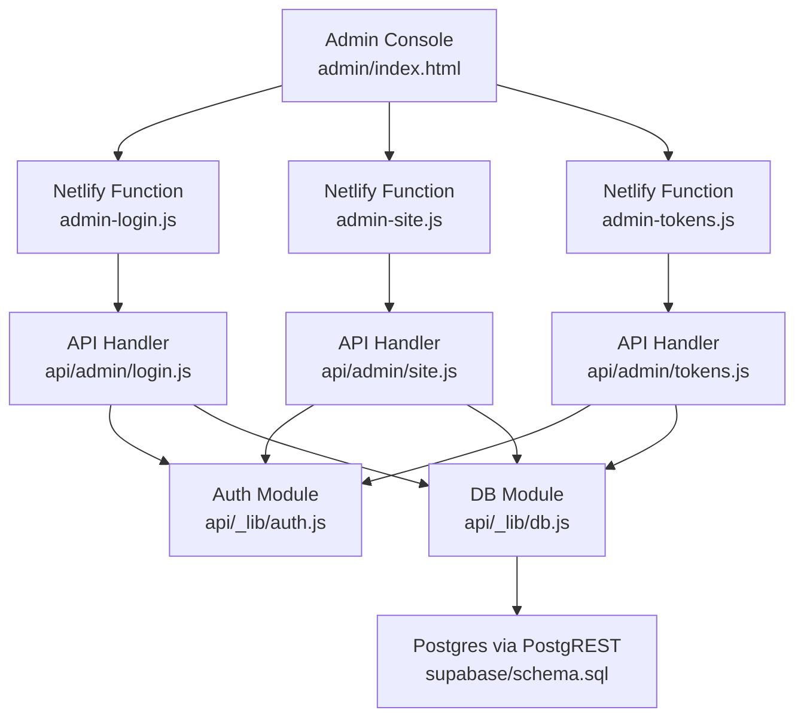
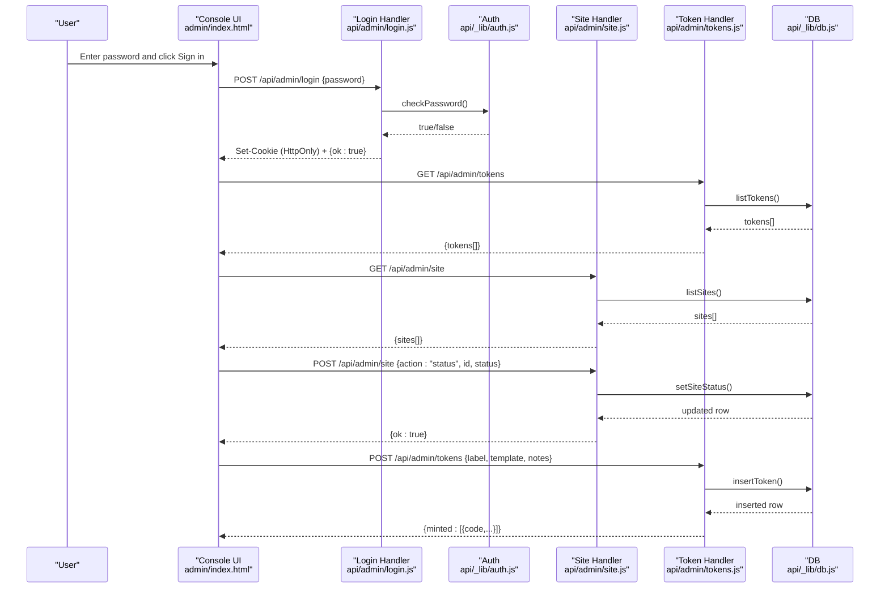
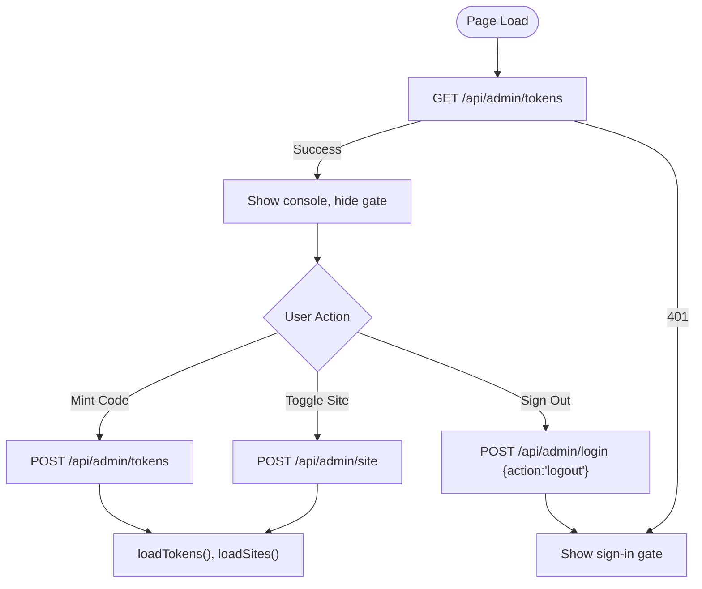
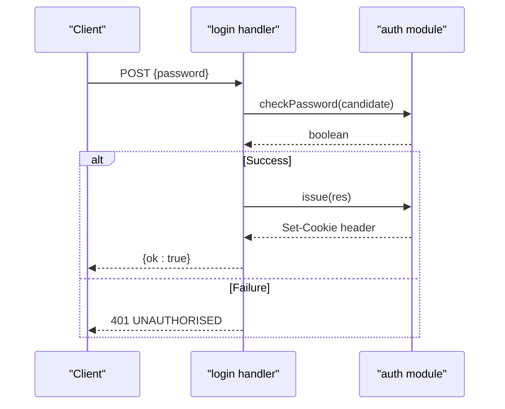
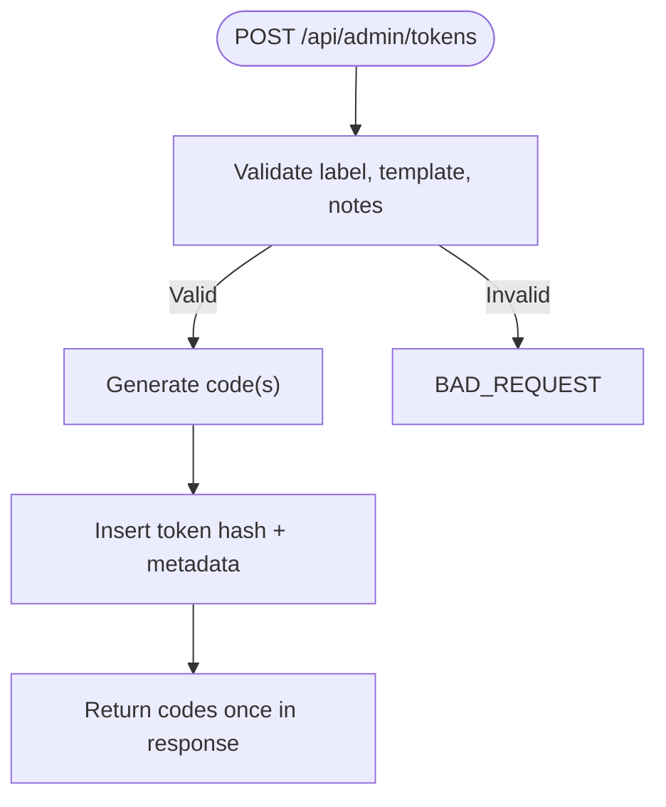
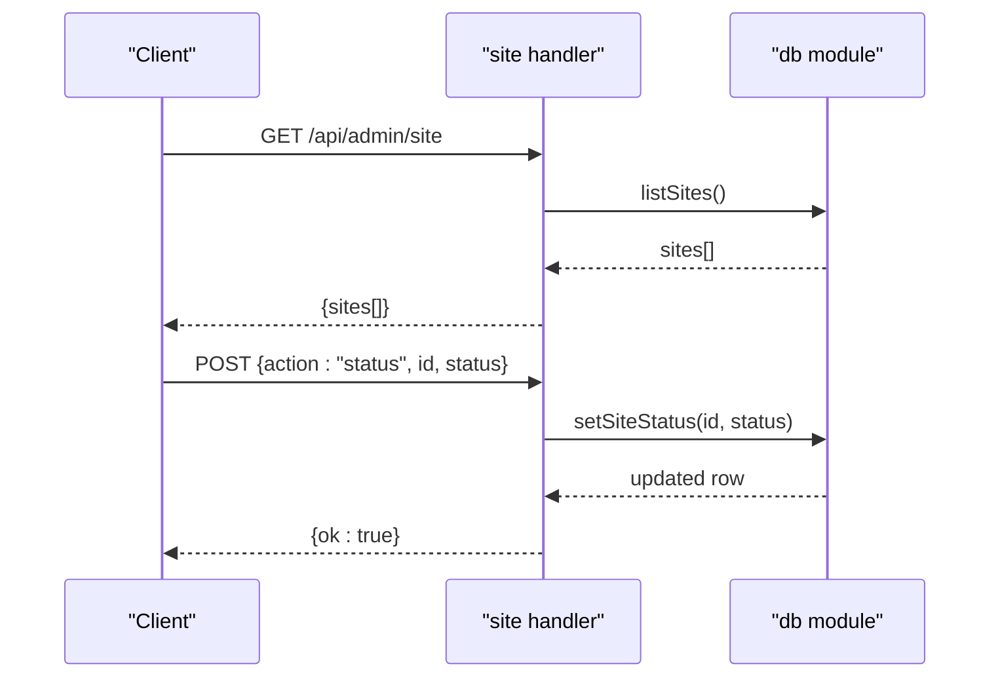
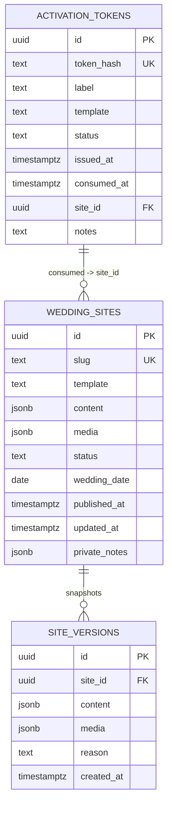
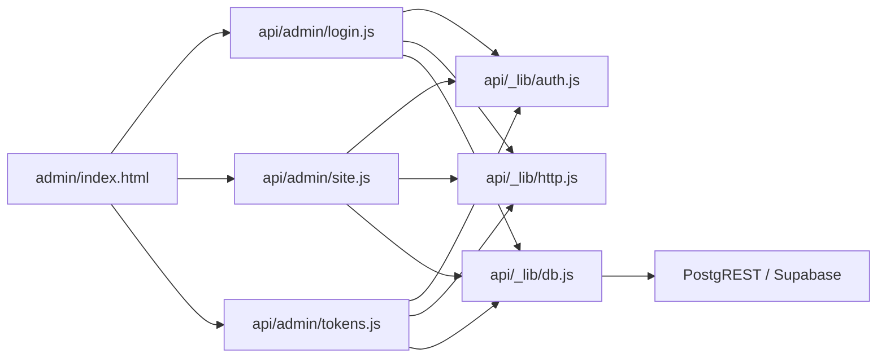

# Admin Dashboard Interface

<cite>
**Referenced Files in This Document**
- [admin/index.html](file://admin/index.html)
- [api/admin/login.js](file://api/admin/login.js)
- [api/admin/site.js](file://api/admin/site.js)
- [api/admin/tokens.js](file://api/admin/tokens.js)
- [netlify/functions/admin-login.js](file://netlify/functions/admin-login.js)
- [netlify/functions/admin-site.js](file://netlify/functions/admin-site.js)
- [netlify/functions/admin-tokens.js](file://netlify/functions/admin-tokens.js)
- [api/_lib/auth.js](file://api/_lib/auth.js)
- [api/_lib/http.js](file://api/_lib/http.js)
- [api/_lib/db.js](file://api/_lib/db.js)
- [supabase/schema.sql](file://supabase/schema.sql)
</cite>

## Table of Contents
1. [Introduction](#introduction)
2. [Project Structure](#project-structure)
3. [Core Components](#core-components)
4. [Architecture Overview](#architecture-overview)
5. [Detailed Component Analysis](#detailed-component-analysis)
6. [Dependency Analysis](#dependency-analysis)
7. [Performance Considerations](#performance-considerations)
8. [Troubleshooting Guide](#troubleshooting-guide)
9. [Conclusion](#conclusion)
10. [Appendices](#appendices)

## Introduction
This document explains the admin dashboard interface design and user experience for managing activation codes and published wedding websites. It covers responsive design, accessibility considerations, interactive elements (forms, tables, buttons), real-time updates, end-to-end workflows from login to administrative tasks, error handling and feedback, visual design principles, and guidance for customization and extending functionality while maintaining a consistent experience across devices.

## Project Structure
The admin console is a single-page HTML application with embedded CSS and JavaScript that communicates with serverless functions exposing REST endpoints under /api/admin/. The backend enforces authentication, rate limiting, input validation, and database operations via PostgREST.

**Diagram sources**
- [admin/index.html:137-345](file://admin/index.html#L137-L345)
- [netlify/functions/admin-login.js:1-7](file://netlify/functions/admin-login.js#L1-L7)
- [netlify/functions/admin-site.js:1-7](file://netlify/functions/admin-site.js#L1-L7)
- [netlify/functions/admin-tokens.js:1-7](file://netlify/functions/admin-tokens.js#L1-L7)
- [api/admin/login.js:1-50](file://api/admin/login.js#L1-L50)
- [api/admin/site.js:1-112](file://api/admin/site.js#L1-L112)
- [api/admin/tokens.js:1-103](file://api/admin/tokens.js#L1-L103)
- [api/_lib/auth.js:1-124](file://api/_lib/auth.js#L1-L124)
- [api/_lib/db.js:1-265](file://api/_lib/db.js#L1-L265)
- [supabase/schema.sql:1-348](file://supabase/schema.sql#L1-L348)

**Section sources**
- [admin/index.html:1-349](file://admin/index.html#L1-L349)
- [api/admin/login.js:1-50](file://api/admin/login.js#L1-L50)
- [api/admin/site.js:1-112](file://api/admin/site.js#L1-L112)
- [api/admin/tokens.js:1-103](file://api/admin/tokens.js#L1-L103)
- [api/_lib/auth.js:1-124](file://api/_lib/auth.js#L1-L124)
- [api/_lib/db.js:1-265](file://api/_lib/db.js#L1-L265)
- [supabase/schema.sql:1-348](file://supabase/schema.sql#L1-L348)

## Core Components
- Admin Console UI: Single HTML file with inline styles and scripts; manages sign-in, code minting, token listing, site status toggling, and refresh actions.
- Authentication: Server-side password check and signed HttpOnly cookie session management.
- API Handlers: Endpoints for login/logout, token management (list/mint/revoke), and site management (list/status/rollback).
- Database Layer: PostgREST client with typed queries and RPCs for transactional operations.
- Error Handling: Centralized error mapping and user-friendly messages; rate limiting protects against brute force.

Key responsibilities:
- UI: Responsive layout, accessible labels, clear feedback messages, safe DOM rendering to prevent XSS.
- Auth: Secure session issuance and verification; logout always works even if session expired.
- API: Input validation, method enforcement, admin-only guards, structured JSON responses.
- DB: Timeouts, redacted logging, minimal data exposure, transactional writes via RPCs.

**Section sources**
- [admin/index.html:23-69](file://admin/index.html#L23-L69)
- [admin/index.html:137-345](file://admin/index.html#L137-L345)
- [api/_lib/auth.js:1-124](file://api/_lib/auth.js#L1-L124)
- [api/_lib/http.js:1-198](file://api/_lib/http.js#L1-L198)
- [api/_lib/db.js:1-265](file://api/_lib/db.js#L1-L265)

## Architecture Overview
The admin console uses a mobile-first, responsive design with CSS variables and media queries. All interactions are asynchronous via fetch calls to /api/admin/* endpoints. Responses are rendered into the DOM using createElement and textContent to avoid XSS. Real-time updates occur when users trigger actions like minting tokens or changing site status; the UI re-renders lists immediately after successful operations.

**Diagram sources**
- [admin/index.html:176-345](file://admin/index.html#L176-L345)
- [api/admin/login.js:23-49](file://api/admin/login.js#L23-L49)
- [api/_lib/auth.js:64-98](file://api/_lib/auth.js#L64-L98)
- [api/admin/site.js:31-111](file://api/admin/site.js#L31-L111)
- [api/admin/tokens.js:42-102](file://api/admin/tokens.js#L42-L102)
- [api/_lib/db.js:173-219](file://api/_lib/db.js#L173-L219)

## Detailed Component Analysis

### Admin Console UI (Single Page)
- Layout and responsiveness:
  - Uses CSS variables for theme colors and spacing.
  - Two-column grid collapses to one column on small screens via media query at 620px.
  - Tables and controls adapt to narrow viewports with appropriate padding and font sizes.
- Accessibility:
  - Labels associated with inputs via for/id attributes.
  - Semantic headings and sections improve navigation for assistive technologies.
  - Keyboard support: Enter key triggers sign-in; focus states are visible due to default browser styling.
- Interactive elements:
  - Forms: Password input, label/template/notes fields for code creation.
  - Buttons: Primary action (Create code), ghost actions (Refresh, Sign out, Revoke, Toggle status).
  - Tables: Dynamically built with rows for tokens and sites; includes status pills and action buttons.
- Real-time updates:
  - After minting a code or toggling site status, the UI clears and rebuilds relevant sections by calling loadTokens/loadSites.
- Security:
  - All user-provided content is rendered via textContent to prevent XSS.
  - Session checks happen server-side; UI hides console until authenticated.

**Diagram sources**
- [admin/index.html:147-173](file://admin/index.html#L147-L173)
- [admin/index.html:234-345](file://admin/index.html#L234-L345)

**Section sources**
- [admin/index.html:23-69](file://admin/index.html#L23-L69)
- [admin/index.html:76-135](file://admin/index.html#L76-L135)
- [admin/index.html:137-345](file://admin/index.html#L137-L345)

### Authentication Flow
- Login:
  - Client sends POST /api/admin/login with password.
  - Server compares against environment variable using constant-time comparison.
  - On success, sets an HttpOnly, Secure, SameSite=Strict cookie with HMAC-signed payload containing subject and expiry.
- Logout:
  - Always succeeds even if session expired; clears cookie.
- Session validation:
  - Every admin endpoint requires a valid session; otherwise returns 401 with a friendly message.

**Diagram sources**
- [api/admin/login.js:23-49](file://api/admin/login.js#L23-L49)
- [api/_lib/auth.js:64-98](file://api/_lib/auth.js#L64-L98)

**Section sources**
- [api/admin/login.js:1-50](file://api/admin/login.js#L1-L50)
- [api/_lib/auth.js:1-124](file://api/_lib/auth.js#L1-L124)

### Token Management
- List tokens:
  - Returns newest first, excluding sensitive fields like hashes.
- Mint tokens:
  - Validates label, template, and optional notes.
  - Generates secure random codes, stores only hashed values with pepper.
  - Returns plain codes once in response; not stored or logged.
- Revoke tokens:
  - Only issued tokens can be revoked; ensures no live site is affected.

**Diagram sources**
- [api/admin/tokens.js:42-102](file://api/admin/tokens.js#L42-L102)
- [api/_lib/db.js:173-197](file://api/_lib/db.js#L173-L197)

**Section sources**
- [api/admin/tokens.js:1-103](file://api/admin/tokens.js#L1-L103)
- [api/_lib/db.js:173-197](file://api/_lib/db.js#L173-L197)

### Site Management
- List sites:
  - Returns public links and statuses; supports fetching a specific site by id with versions.
- Toggle status:
  - Switch between live and disabled; prevents accidental deletion to preserve guest access.
- Rollback:
  - Restores a previous version snapshot; logs the action.

**Diagram sources**
- [api/admin/site.js:31-111](file://api/admin/site.js#L31-L111)
- [api/_lib/db.js:199-219](file://api/_lib/db.js#L199-L219)

**Section sources**
- [api/admin/site.js:1-112](file://api/admin/site.js#L1-L112)
- [api/_lib/db.js:199-219](file://api/_lib/db.js#L199-L219)

### Data Model and Persistence
- Activation tokens:
  - Stores hashed tokens with labels, templates, status, timestamps, and optional notes.
  - Unique constraints ensure one-time use per website.
- Wedding sites:
  - Stores slugs, templates, content/media references, status, dates, and private notes.
  - Public views are restricted to live sites; admin can see disabled ones.
- Versions:
  - Snapshot content before edits/publishes; supports rollback.

**Diagram sources**
- [supabase/schema.sql:23-130](file://supabase/schema.sql#L23-L130)
- [supabase/schema.sql:136-348](file://supabase/schema.sql#L136-L348)

**Section sources**
- [supabase/schema.sql:1-348](file://supabase/schema.sql#L1-L348)

## Dependency Analysis
- UI depends on:
  - Fetch-based API calls to /api/admin/* endpoints.
  - Centralized error handling and session checks.
- Handlers depend on:
  - Auth module for session validation and password checks.
  - HTTP utilities for JSON responses, rate limiting, and error mapping.
  - DB module for PostgREST requests and RPCs.
- DB module depends on:
  - Environment configuration (URL and service key).
  - Postgres schema and functions for transactional operations.

**Diagram sources**
- [admin/index.html:137-345](file://admin/index.html#L137-L345)
- [api/admin/login.js:1-50](file://api/admin/login.js#L1-L50)
- [api/admin/site.js:1-112](file://api/admin/site.js#L1-L112)
- [api/admin/tokens.js:1-103](file://api/admin/tokens.js#L1-L103)
- [api/_lib/auth.js:1-124](file://api/_lib/auth.js#L1-L124)
- [api/_lib/http.js:1-198](file://api/_lib/http.js#L1-L198)
- [api/_lib/db.js:1-265](file://api/_lib/db.js#L1-L265)

**Section sources**
- [api/_lib/http.js:1-198](file://api/_lib/http.js#L1-L198)
- [api/_lib/db.js:1-265](file://api/_lib/db.js#L1-L265)

## Performance Considerations
- Network:
  - All API responses include Cache-Control: no-store to prevent caching of sensitive data.
  - Requests use credentials: same-origin to send cookies securely.
- Rendering:
  - DOM manipulation uses createElement and textContent to minimize overhead and avoid innerHTML risks.
- Backend:
  - Rate limiting protects login endpoints; in-memory buckets with periodic sweep reduce memory usage.
  - DB timeouts prevent hanging requests; errors are mapped to user-friendly messages.
- Storage:
  - Only hashed tokens stored; plain codes returned once in responses.
  - Version snapshots enable quick rollbacks without full restores.

[No sources needed since this section provides general guidance]

## Troubleshooting Guide
Common issues and resolutions:
- Session expired:
  - Symptom: Console redirects to sign-in gate; any subsequent API call returns 401.
  - Resolution: Re-authenticate; logout always clears stale sessions.
- Wrong password:
  - Symptom: 401 UNAUTHORISED; slow response due to rate limiting.
  - Resolution: Verify environment configuration; ensure ADMIN_PASSWORD meets minimum length.
- Token not found or already used:
  - Symptom: 400/409 errors when attempting to publish or revoke.
  - Resolution: Confirm token status and template match; revoke only issued tokens.
- Upstream errors:
  - Symptom: 503 UPSTREAM; retryable flag indicates transient failure.
  - Resolution: Retry later; check Supabase availability and environment variables.

**Section sources**
- [api/_lib/http.js:52-79](file://api/_lib/http.js#L52-L79)
- [api/_lib/auth.js:111-121](file://api/_lib/auth.js#L111-L121)
- [api/admin/tokens.js:57-73](file://api/admin/tokens.js#L57-L73)
- [api/admin/site.js:89-108](file://api/admin/site.js#L89-L108)

## Conclusion
The admin dashboard provides a secure, responsive, and accessible interface for managing activation codes and published wedding websites. It follows a mobile-first design, emphasizes safety through server-side validation and secure sessions, and offers clear feedback for all user actions. Customization points include updating styles in the inline CSS, adding new admin features via handlers and DB methods, and extending the UI with additional tables or forms while preserving security and consistency.

[No sources needed since this section summarizes without analyzing specific files]

## Appendices

### Customization Guidance
- Visual theme:
  - Modify CSS variables in the admin console’s style block to adjust colors, fonts, and spacing.
  - Use media queries to refine layouts for specific breakpoints.
- Extending functionality:
  - Add new admin endpoints in api/admin/* and expose them via netlify/functions/*.
  - Implement corresponding UI components in admin/index.html using the existing patterns for forms, tables, and messages.
  - Ensure all new fields are validated and sanitized before storage.
- Maintaining consistency:
  - Follow the established error mapping and message format for user-facing feedback.
  - Use the centralized auth and http utilities to ensure consistent behavior across endpoints.
  - Keep sensitive data out of logs and responses; rely on hashed tokens and minimal data exposure.

**Section sources**
- [admin/index.html:23-69](file://admin/index.html#L23-L69)
- [api/_lib/http.js:52-79](file://api/_lib/http.js#L52-L79)
- [api/_lib/auth.js:1-124](file://api/_lib/auth.js#L1-L124)