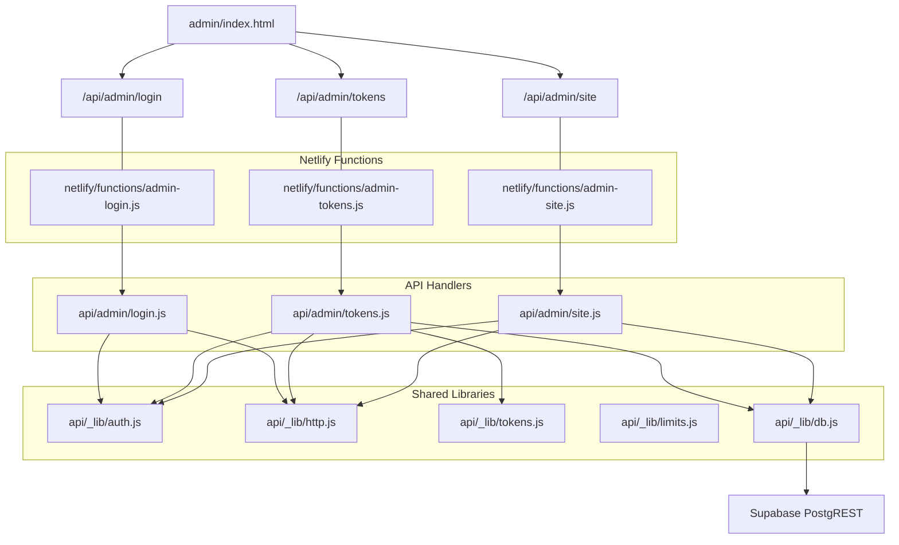
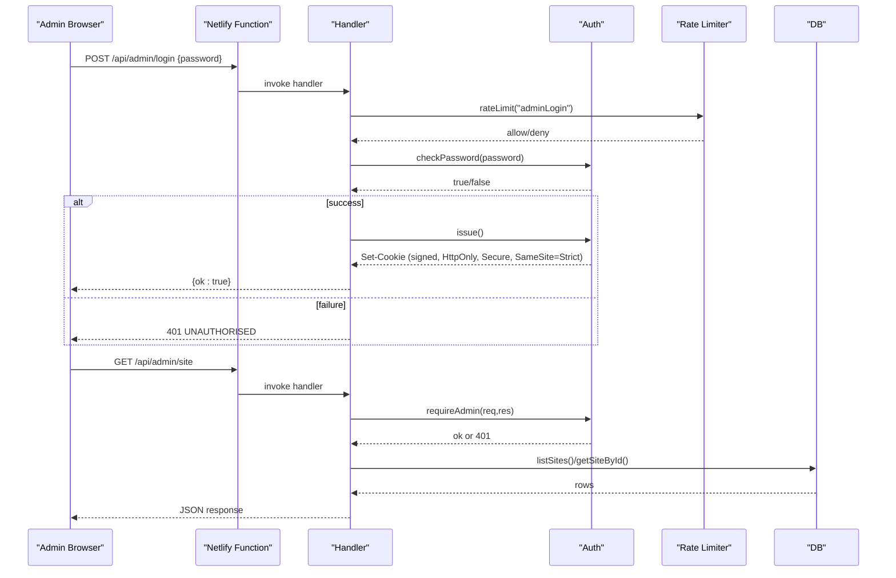
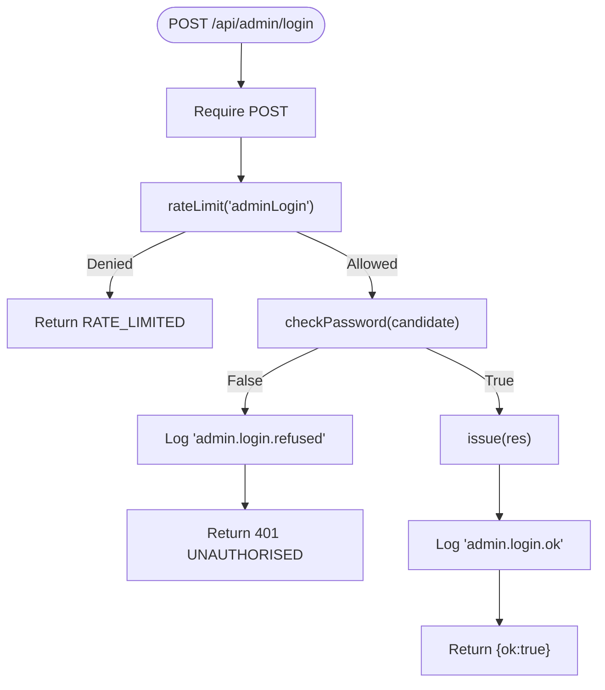
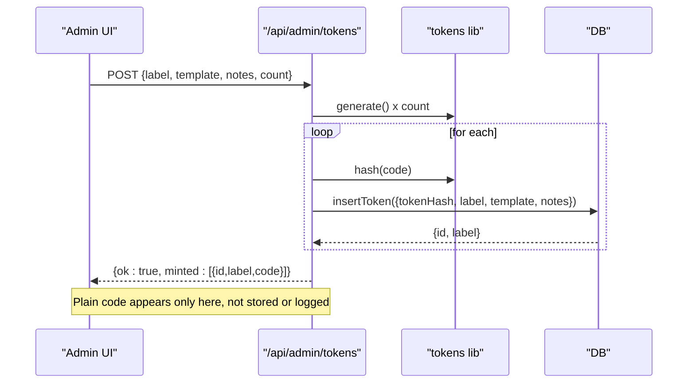
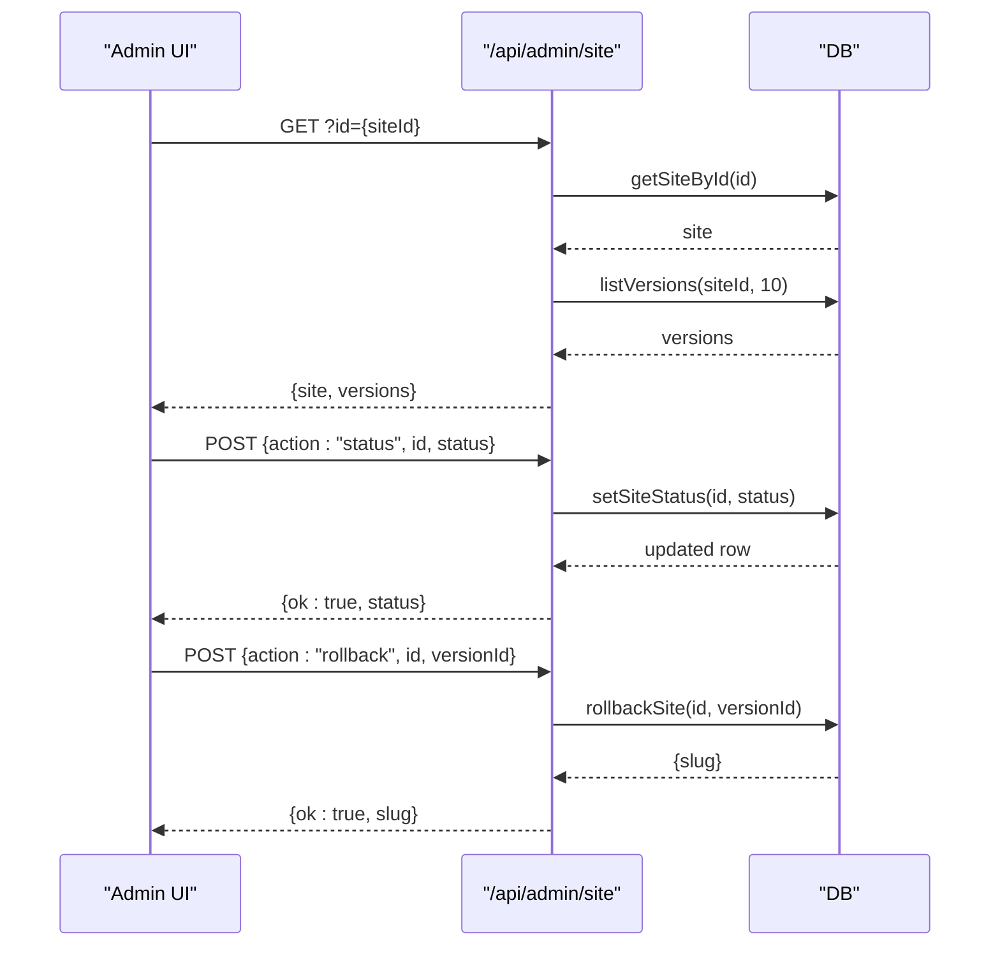
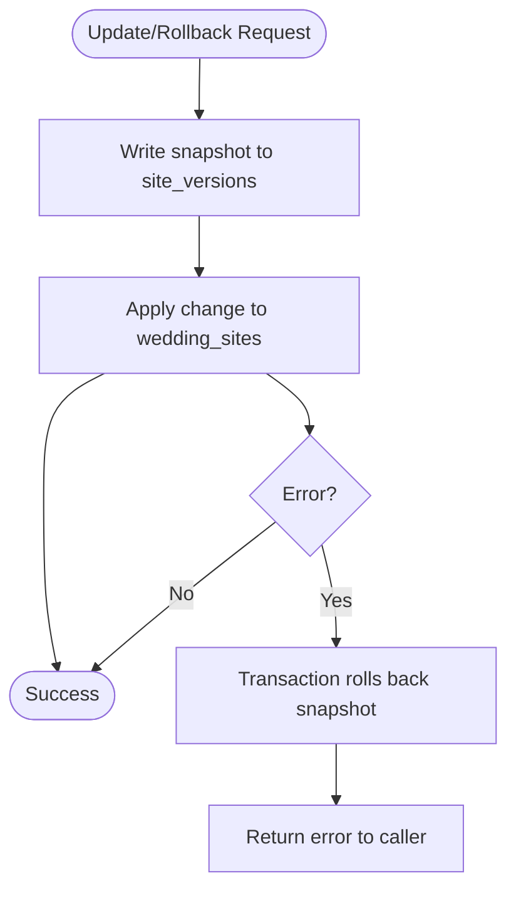
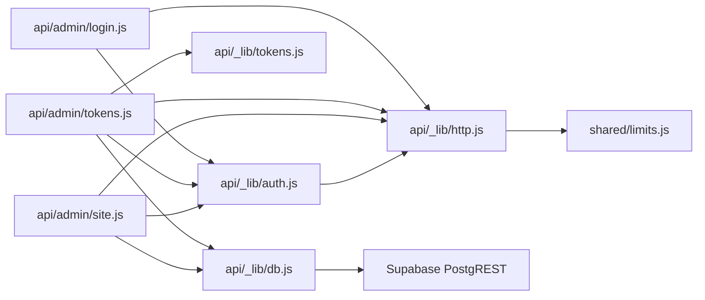

# Admin Management Dashboard

<cite>
**Referenced Files in This Document**
- [auth.js](file://api/_lib/auth.js)
- [login.js](file://api/admin/login.js)
- [site.js](file://api/admin/site.js)
- [tokens.js](file://api/admin/tokens.js)
- [tokens_lib.js](file://api/_lib/tokens.js)
- [http.js](file://api/_lib/http.js)
- [limits.js](file://api/_lib/limits.js)
- [db.js](file://api/_lib/db.js)
- [shared_limits.js](file://shared/limits.js)
- [admin_index.html](file://admin/index.html)
- [schema.sql](file://supabase/schema.sql)
- [netlify_admin_login.js](file://netlify/functions/admin-login.js)
- [netlify_admin_site.js](file://netlify/functions/admin-site.js)
- [netlify_admin_tokens.js](file://netlify/functions/admin-tokens.js)
</cite>

## Table of Contents
1. Introduction
2. Project Structure
3. Core Components
4. Architecture Overview
5. Detailed Component Analysis
6. Dependency Analysis
7. Performance Considerations
8. Troubleshooting Guide
9. Conclusion

## Introduction
This document explains the admin management dashboard system that allows authorized studio operators to:
- Authenticate securely using HMAC-based session cookies and server-side password validation
- Manage activation tokens (mint, list, revoke)
- Monitor published sites and control their visibility
- Roll back content to previous versions
- Operate within strict security boundaries including rate limiting, cookie protection, and input validation

The system is designed for zero-trust client code: the admin HTML page is intentionally public but contains no secrets; all sensitive operations are guarded by a signed session cookie and server-side checks.

## Project Structure
The admin system spans three layers:
- Frontend: a single-page console at admin/index.html that renders tables and forms and calls admin APIs
- API handlers: route-specific modules under api/admin that enforce auth, validate inputs, and call shared utilities
- Shared libraries: authentication, HTTP helpers, limits, token generation, and database access

**Diagram sources**
- [admin_index.html:137-345](file://admin/index.html#L137-L345)
- [netlify_admin_login.js:1-7](file://netlify/functions/admin-login.js#L1-L7)
- [netlify_admin_tokens.js:1-7](file://netlify/functions/admin-tokens.js#L1-L7)
- [netlify_admin_site.js:1-7](file://netlify/functions/admin-site.js#L1-L7)
- [login.js:1-50](file://api/admin/login.js#L1-L50)
- [tokens.js:1-103](file://api/admin/tokens.js#L1-L103)
- [site.js:1-112](file://api/admin/site.js#L1-L112)
- [auth.js:1-124](file://api/_lib/auth.js#L1-L124)
- [http.js:1-198](file://api/_lib/http.js#L1-L198)
- [tokens_lib.js:1-155](file://api/_lib/tokens.js#L1-L155)
- [db.js:1-265](file://api/_lib/db.js#L1-L265)

**Section sources**
- [admin_index.html:1-349](file://admin/index.html#L1-L349)
- [login.js:1-50](file://api/admin/login.js#L1-L50)
- [tokens.js:1-103](file://api/admin/tokens.js#L1-L103)
- [site.js:1-112](file://api/admin/site.js#L1-L112)
- [auth.js:1-124](file://api/_lib/auth.js#L1-L124)
- [http.js:1-198](file://api/_lib/http.js#L1-L198)
- [tokens_lib.js:1-155](file://api/_lib/tokens.js#L1-L155)
- [db.js:1-265](file://api/_lib/db.js#L1-L265)

## Core Components
- Authentication and sessions: HMAC-signed cookie with expiry, HttpOnly/Secure/SameSite=Strict, constant-time password comparison
- Rate limiting: per-IP in-memory buckets with rolling windows for login and other endpoints
- Token lifecycle: generate, hash with pepper, mint once-only codes, revoke unused codes
- Site lifecycle: list sites, toggle status live/disabled, rollback to prior versioned snapshot
- Content versioning: every publish/edit/rollback writes a snapshot row before mutating live data
- Input validation: strict shape and size checks for text, templates, dates, and media references
- Database layer: thin wrapper over PostgREST with timeouts, error mapping, and RPCs for transactional operations

**Section sources**
- [auth.js:15-124](file://api/_lib/auth.js#L15-L124)
- [http.js:121-177](file://api/_lib/http.js#L121-L177)
- [tokens_lib.js:26-83](file://api/_lib/tokens.js#L26-L83)
- [tokens.js:26-103](file://api/admin/tokens.js#L26-L103)
- [site.js:22-112](file://api/admin/site.js#L22-L112)
- [db.js:138-169](file://api/_lib/db.js#L138-L169)
- [schema.sql:95-110](file://supabase/schema.sql#L95-L110)
- [limits.js:43-187](file://api/_lib/limits.js#L43-L187)

## Architecture Overview
The admin flow uses a signed session cookie to protect all admin endpoints. The frontend never sees or stores secrets; it only toggles UI state based on responses. All admin actions go through Netlify functions that delegate to handler modules, which use shared libraries for auth, HTTP, limits, tokens, and DB.

**Diagram sources**
- [login.js:23-49](file://api/admin/login.js#L23-L49)
- [auth.js:64-98](file://api/_lib/auth.js#L64-L98)
- [http.js:131-147](file://api/_lib/http.js#L131-L147)
- [site.js:31-78](file://api/admin/site.js#L31-L78)
- [db.js:199-210](file://api/_lib/db.js#L199-L210)

## Detailed Component Analysis

### Authentication and Session Management
- Password validation: Server-side comparison against an environment variable using constant-time comparison to prevent timing attacks. No password is logged or returned.
- Session cookie: An HMAC-SHA256 signature over a base64url-encoded payload containing subject and expiry. Cookie flags include HttpOnly, Secure, SameSite=Strict, Path=/api, and Max-Age set to 8 hours.
- Session verification: Each protected endpoint reads the cookie, verifies signature and expiry, and rejects invalid or expired sessions with a uniform 401 JSON response.

**Diagram sources**
- [login.js:23-49](file://api/admin/login.js#L23-L49)
- [auth.js:64-98](file://api/_lib/auth.js#L64-L98)
- [http.js:131-147](file://api/_lib/http.js#L131-L147)

**Section sources**
- [auth.js:15-124](file://api/_lib/auth.js#L15-L124)
- [login.js:1-50](file://api/admin/login.js#L1-L50)
- [http.js:153-160](file://api/_lib/http.js#L153-L160)

### Token Generation and Tracking
- Generation: Cryptographically secure random bytes encoded into a human-friendly base32 string grouped into segments. Designed to be easy to type on mobile and resistant to misreading characters.
- Storage: Only a salted hash of the token (with a server-side pepper) is stored. The plain token exists only in the one-time response when minted.
- Minting: Admin can create one or multiple tokens with labels, notes, and template selection. Batch sizes are capped.
- Revocation: Unused issued tokens can be revoked via a dedicated action; consumed tokens cannot be revoked to avoid affecting live sites.

**Diagram sources**
- [tokens.js:75-101](file://api/admin/tokens.js#L75-L101)
- [tokens_lib.js:26-83](file://api/_lib/tokens.js#L26-L83)
- [db.js:173-188](file://api/_lib/db.js#L173-L188)

**Section sources**
- [tokens.js:1-103](file://api/admin/tokens.js#L1-L103)
- [tokens_lib.js:1-155](file://api/_lib/tokens.js#L1-L155)
- [db.js:173-188](file://api/_lib/db.js#L173-L188)

### Site Lifecycle Management
- Listing: Returns a paginated list of published sites with links and metadata.
- Detail view: Fetches a specific site by id and includes recent versions for rollback.
- Status control: Toggle between live and disabled states. Disabled sites return a calm card to guests instead of dead links.
- Rollback: Restore a previous version snapshot atomically; the operation itself is versioned.

**Diagram sources**
- [site.js:31-112](file://api/admin/site.js#L31-L112)
- [db.js:110-116](file://api/_lib/db.js#L110-L116)
- [db.js:199-218](file://api/_lib/db.js#L199-L218)

**Section sources**
- [site.js:1-112](file://api/admin/site.js#L1-L112)
- [db.js:199-218](file://api/_lib/db.js#L199-L218)

### Content Versioning
- Every publish, edit, or rollback writes a snapshot row before mutating live content. This ensures:
  - Safe edits: failures do not corrupt live content
  - Auditable history: reason field indicates 'publish', 'edit', or 'rollback'
  - Reversible changes: rollbacks themselves are versioned
- Pruning keeps version history bounded to manage storage costs.

**Diagram sources**
- [schema.sql:231-273](file://supabase/schema.sql#L231-L273)
- [schema.sql:276-310](file://supabase/schema.sql#L276-L310)
- [schema.sql:313-337](file://supabase/schema.sql#L313-L337)

**Section sources**
- [schema.sql:95-110](file://supabase/schema.sql#L95-L110)
- [schema.sql:231-337](file://supabase/schema.sql#L231-L337)

### Admin Interface Design and UX Patterns
- Single-file, dependency-free console with dark theme and accessible controls
- Sign-in gate: password input triggers login; on success, console reveals
- Data rendering: tables built with createElement and textContent to prevent XSS from user-provided labels/notes
- Actions: mint codes, revoke issued codes, toggle site status, refresh lists
- Feedback: contextual messages for success/error; buttons disable during async operations
- Session handling: automatic re-gate on 401 responses

**Section sources**
- [admin_index.html:23-69](file://admin/index.html#L23-L69)
- [admin_index.html:137-345](file://admin/index.html#L137-L345)

### Security Measures
- HMAC session cookie: signed, non-readable, short-lived, restricted to /api
- Constant-time comparisons: for passwords and signatures to mitigate timing side-channels
- Rate limiting: per-IP sliding window for login attempts to deter brute force
- Input validation: strict schemas for labels, notes, templates, IDs, dates, and media references
- Secret redaction: logging helper masks sensitive fields automatically
- Database security: Row Level Security enabled with no policies; service-role key used only server-side

**Section sources**
- [auth.js:64-98](file://api/_lib/auth.js#L64-L98)
- [http.js:19-40](file://api/_lib/http.js#L19-L40)
- [http.js:131-147](file://api/_lib/http.js#L131-L147)
- [limits.js:43-187](file://api/_lib/limits.js#L43-L187)
- [schema.sql:123-134](file://supabase/schema.sql#L123-L134)

## Dependency Analysis
- Handlers depend on shared auth, http, limits, tokens, and db modules
- Netlify functions act as thin bridges to handlers
- DB module encapsulates all Supabase interactions, exposing clean methods for handlers
- Limits are shared between browser and server to provide consistent constraints

**Diagram sources**
- [login.js:19-22](file://api/admin/login.js#L19-L22)
- [tokens.js:21-24](file://api/admin/tokens.js#L21-L24)
- [site.js:18-20](file://api/admin/site.js#L18-L20)
- [db.js:1-20](file://api/_lib/db.js#L1-L20)
- [shared_limits.js:1-84](file://shared/limits.js#L1-L84)

**Section sources**
- [login.js:1-50](file://api/admin/login.js#L1-L50)
- [tokens.js:1-103](file://api/admin/tokens.js#L1-L103)
- [site.js:1-112](file://api/admin/site.js#L1-L112)
- [db.js:1-265](file://api/_lib/db.js#L1-L265)
- [shared_limits.js:1-84](file://shared/limits.js#L1-L84)

## Performance Considerations
- In-memory rate limiter: lightweight, per-instance; suitable for stopping casual abuse without adding DB pressure
- Timeouts: DB requests have default timeouts to prevent hanging serverless functions
- Payload caps: JSON body reading enforces byte limits to avoid memory exhaustion
- Selective column projection: DB queries request only needed columns to reduce payload sizes
- Version pruning: periodic cleanup of old snapshots to bound storage growth

[No sources needed since this section provides general guidance]

## Troubleshooting Guide
Common issues and resolutions:
- 401 Not signed in:
  - Cause: Missing, expired, or invalid session cookie
  - Resolution: Sign in again; ensure cookies are allowed and path matches /api
- RATE_LIMITED:
  - Cause: Too many login attempts from the same IP within the window
  - Resolution: Wait for the window to reset; avoid rapid retries
- BAD_REQUEST:
  - Cause: Invalid method, malformed body, or disallowed values (e.g., unknown template)
  - Resolution: Verify request shape and allowed values
- NOT_FOUND:
  - Cause: Referencing a non-existent site or token
  - Resolution: Confirm IDs and statuses
- UPSTREAM:
  - Cause: Database unreachable or timeout
  - Resolution: Retry later; check environment configuration for Supabase URL and keys

Operational tips:
- Always log with redacted payloads to avoid leaking secrets
- Use revoke only for issued tokens; consumed tokens cannot be withdrawn
- When rolling back, verify the target version belongs to the intended site

**Section sources**
- [http.js:56-79](file://api/_lib/http.js#L56-L79)
- [http.js:131-147](file://api/_lib/http.js#L131-L147)
- [auth.js:111-121](file://api/_lib/auth.js#L111-L121)
- [tokens.js:57-73](file://api/admin/tokens.js#L57-L73)
- [db.js:22-32](file://api/_lib/db.js#L22-L32)

## Conclusion
The admin management dashboard provides a secure, efficient, and auditable way to manage activation tokens, monitor published sites, and maintain content integrity through versioning. Its design emphasizes minimal trust in the client, strong server-side validation, and robust protections against common threats such as brute force and injection. With clear separation of concerns across handlers, shared libraries, and database routines, the system remains maintainable and extensible while preserving performance and security.