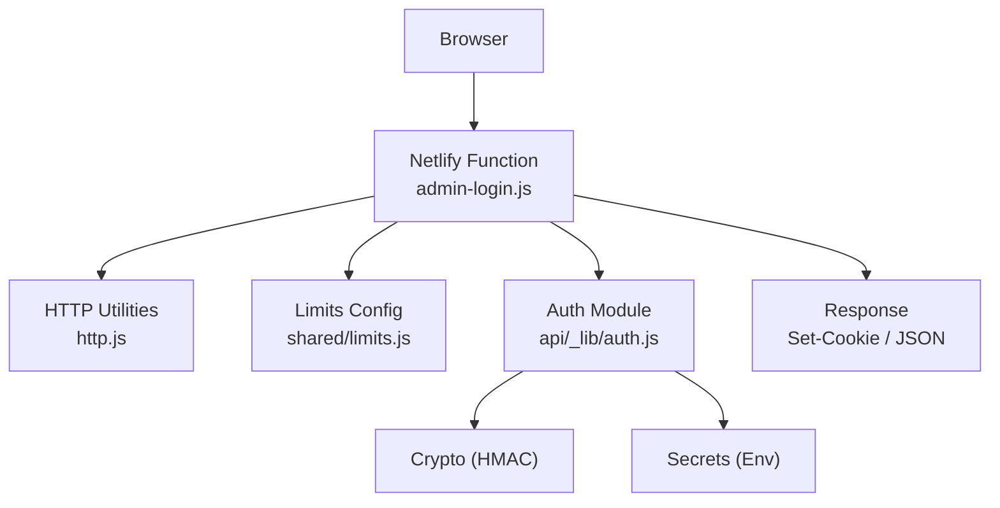
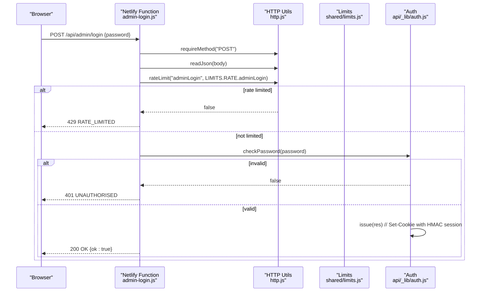
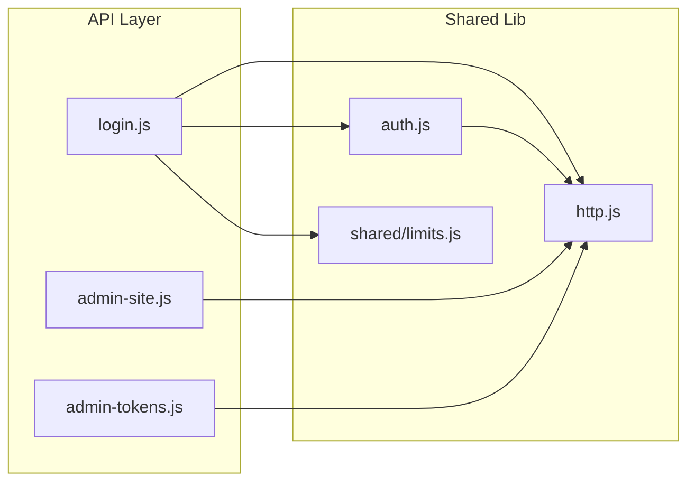

# Authentication & Security System

<cite>
**Referenced Files in This Document**
- [auth.js](file://api/_lib/auth.js)
- [login.js](file://api/admin/login.js)
- [http.js](file://api/_lib/http.js)
- [limits.js](file://shared/limits.js)
- [admin-login.js](file://netlify/functions/admin-login.js)
- [admin-site.js](file://netlify/functions/admin-site.js)
- [admin-tokens.js](file://netlify/functions/admin-tokens.js)
- [tokens.js](file://api/_lib/tokens.js)
</cite>

## Table of Contents
1. [Introduction](#introduction)
2. [Project Structure](#project-structure)
3. [Core Components](#core-components)
4. [Architecture Overview](#architecture-overview)
5. [Detailed Component Analysis](#detailed-component-analysis)
6. [Dependency Analysis](#dependency-analysis)
7. [Performance Considerations](#performance-considerations)
8. [Troubleshooting Guide](#troubleshooting-guide)
9. [Conclusion](#conclusion)

## Introduction
This document explains the admin authentication and security system used to protect administrative endpoints. It covers:
- HMAC-based session management with signed cookies
- Secure password validation using constant-time comparison
- HttpOnly, Secure, SameSite=Strict cookie handling scoped to API paths
- Rate limiting for login attempts
- Session expiration and logout behavior
- Defenses against common attacks (brute force, CSRF, XSS, timing attacks)
- Practical authentication flows, error handling patterns, and troubleshooting steps

## Project Structure
The authentication system is implemented as a small set of focused modules:
- Admin login endpoint under api/admin
- Shared HTTP utilities for rate limiting, logging, and safe responses
- Auth module for HMAC sessions, password checks, and cookie handling
- Netlify function wrappers that bridge requests to the API handlers
- Shared limits configuration for rate limits and token sizing

**Diagram sources**
- [admin-login.js:1-7](file://netlify/functions/admin-login.js#L1-L7)
- [login.js:1-50](file://api/admin/login.js#L1-L50)
- [http.js:1-198](file://api/_lib/http.js#L1-L198)
- [limits.js:1-84](file://shared/limits.js#L1-L84)
- [auth.js:1-124](file://api/_lib/auth.js#L1-L124)

**Section sources**
- [admin-login.js:1-7](file://netlify/functions/admin-login.js#L1-L7)
- [login.js:1-50](file://api/admin/login.js#L1-L50)
- [http.js:1-198](file://api/_lib/http.js#L1-L198)
- [limits.js:1-84](file://shared/limits.js#L1-L84)
- [auth.js:1-124](file://api/_lib/auth.js#L1-L124)

## Core Components
- Admin login handler: validates method, enforces rate limits, compares password securely, issues or clears session cookies, and returns standardized JSON responses.
- Auth module: implements HMAC-signed session tokens, secure cookie generation, session verification, and an authorization guard for protected endpoints.
- HTTP utilities: provide rate limiting, safe logging with secret redaction, consistent error responses, and constant-time string comparison.
- Limits configuration: centralizes rate limit policies and other caps shared between client and server.

Key responsibilities:
- Prevent brute-force via per-IP rate limiting on login
- Avoid information leakage by returning generic errors and never logging secrets
- Protect sessions with cryptographic signatures and strict cookie flags
- Enforce short-lived sessions with automatic expiration

**Section sources**
- [login.js:1-50](file://api/admin/login.js#L1-L50)
- [auth.js:1-124](file://api/_lib/auth.js#L1-L124)
- [http.js:1-198](file://api/_lib/http.js#L1-L198)
- [limits.js:1-84](file://shared/limits.js#L1-L84)

## Architecture Overview
The admin login flow uses a stateless HMAC session stored in a single cookie. The browser sends this cookie on subsequent requests; the server verifies the signature and expiry before granting access.

**Diagram sources**
- [admin-login.js:1-7](file://netlify/functions/admin-login.js#L1-L7)
- [login.js:1-50](file://api/admin/login.js#L1-L50)
- [http.js:121-151](file://api/_lib/http.js#L121-L151)
- [limits.js:67-73](file://shared/limits.js#L67-L73)
- [auth.js:64-98](file://api/_lib/auth.js#L64-L98)

## Detailed Component Analysis

### HMAC-Based Session Management
- Session payload contains a subject and numeric expiry timestamp.
- The payload is base64url-encoded and signed with HMAC-SHA256 using a secret from environment variables.
- Verification includes signature validation using constant-time comparison and expiry checking.
- Sessions are short-lived (fixed TTL) and must be refreshed by re-authenticating after expiry.

Security properties:
- Signature prevents tampering and forgery
- Expiry prevents indefinite reuse
- Secret key isolation ensures only configured deployments can validate sessions

Cookie issuance and clearing:
- Issue sets a single cookie with HttpOnly, Secure, SameSite=Strict, Path=/api, and Max-Age matching the TTL.
- Clear resets the cookie to expire immediately.

Authorization guard:
- Reads the cookie, verifies it, and returns a standardized 401 response if missing or invalid.

**Section sources**
- [auth.js:15-62](file://api/_lib/auth.js#L15-L62)
- [auth.js:76-98](file://api/_lib/auth.js#L76-L98)
- [auth.js:100-121](file://api/_lib/auth.js#L100-L121)

### Secure Password Validation
- Password is read from an environment variable and compared using constant-time comparison to prevent timing side-channels.
- Input validation rejects non-string values and overly long inputs.
- Misconfiguration (missing or too-short password) is logged without exposing sensitive details.
- Responses do not reveal whether the password was missing or incorrect.

Best practices applied:
- No password storage or hashing needed since the password is held in environment variables and compared directly.
- Logging is sanitized to avoid leaking secrets.

**Section sources**
- [auth.js:64-74](file://api/_lib/auth.js#L64-L74)
- [http.js:153-160](file://api/_lib/http.js#L153-L160)

### HttpOnly Cookie Handling with SameSite Protection
- Cookie name is fixed and scoped to the API path to avoid leaking to static assets.
- Flags:
  - HttpOnly: prevents JavaScript access, mitigating XSS-based theft
  - Secure: requires HTTPS transport
  - SameSite=Strict: prevents cross-site request forgery by disallowing cross-origin cookie sending
  - Path=/api: restricts cookie scope to API routes
  - Max-Age: controls lifetime and aligns with session TTL

Session lifecycle:
- On successful login, a signed cookie is issued with a TTL.
- On logout, the cookie is cleared by setting an empty value with immediate expiry.
- Subsequent requests include the cookie automatically when calling API endpoints.

**Section sources**
- [auth.js:76-98](file://api/_lib/auth.js#L76-L98)
- [login.js:28-48](file://api/admin/login.js#L28-L48)

### Rate Limiting for Login Attempts
- Per-IP sliding window limiter protects the login endpoint.
- Configuration is centralized in shared limits and enforced before password comparison.
- When exceeded, the endpoint returns a standard rate-limited response without revealing internal state.

Implementation notes:
- Uses in-memory buckets keyed by IP and endpoint name.
- Sweeps expired entries to control memory usage.
- Works well for serverless environments where instances may scale out; combined with high token entropy elsewhere in the system, it provides practical protection.

**Section sources**
- [login.js:35-43](file://api/admin/login.js#L35-L43)
- [http.js:121-151](file://api/_lib/http.js#L121-L151)
- [limits.js:67-73](file://shared/limits.js#L67-L73)

### Session Expiration Handling
- Each session carries an expiry timestamp in seconds since epoch.
- Verification rejects expired sessions, forcing re-authentication.
- Logout always succeeds even if the session has expired, ensuring safe sign-out on shared devices.

Operational guidance:
- If users repeatedly get unauthorized, verify that the client respects the cookie path and does not strip headers.
- Ensure time synchronization across clients and servers to avoid premature expiry issues.

**Section sources**
- [auth.js:39-62](file://api/_lib/auth.js#L39-L62)
- [auth.js:91-98](file://api/_lib/auth.js#L91-L98)
- [login.js:28-33](file://api/admin/login.js#L28-L33)

### Security Measures Against Common Attacks
- Brute force mitigation: rate limiting on login and constant-time password comparison.
- CSRF protection: SameSite=Strict cookie policy prevents cross-site requests from sending the admin cookie.
- XSS resistance: HttpOnly cookie prevents script access to session tokens.
- Timing attacks: constant-time comparison avoids leaking match length.
- Information disclosure: standardized error messages and secret redaction in logs.
- Transport security: Secure flag ensures cookies are sent only over HTTPS.

**Section sources**
- [http.js:14-40](file://api/_lib/http.js#L14-L40)
- [http.js:52-79](file://api/_lib/http.js#L52-L79)
- [http.js:153-160](file://api/_lib/http.js#L153-L160)
- [auth.js:76-98](file://api/_lib/auth.js#L76-L98)

### Practical Authentication Flow Examples
- Successful login:
  - Browser sends POST with password to the login endpoint.
  - Server validates method, applies rate limit, checks password, issues signed cookie, and returns success.
- Failed login:
  - Wrong password or malformed input results in a generic unauthorized response without revealing specifics.
- Logout:
  - Browser sends a logout action; server clears the cookie regardless of current session validity.

Error handling patterns:
- All responses use a consistent JSON shape with ok, code, message, and optional retryable flags.
- Errors are mapped to user-friendly messages and appropriate HTTP status codes.

**Section sources**
- [login.js:23-49](file://api/admin/login.js#L23-L49)
- [http.js:42-79](file://api/_lib/http.js#L42-L79)

### Access Control Patterns for Protected Endpoints
- Protected endpoints call an authorization guard that verifies the session cookie.
- If verification fails, the guard writes a 401 response and stops further processing.
- This pattern ensures all admin APIs enforce authentication consistently.

Example integration points:
- Site management and token management endpoints are exposed through Netlify functions that wrap the corresponding API handlers.

**Section sources**
- [auth.js:111-121](file://api/_lib/auth.js#L111-L121)
- [admin-site.js:1-7](file://netlify/functions/admin-site.js#L1-L7)
- [admin-tokens.js:1-7](file://netlify/functions/admin-tokens.js#L1-L7)

## Dependency Analysis
The authentication system composes several modules with clear boundaries:

Coupling and cohesion:
- login.js depends on http.js for rate limiting and response helpers, auth.js for session management, and shared/limits.js for policy.
- auth.js encapsulates all session logic and exposes minimal interfaces for issuing, verifying, and guarding sessions.
- http.js centralizes rate limiting, logging, and error formatting to ensure consistency across endpoints.

Potential circular dependencies:
- None observed; dependencies are one-directional from handlers to shared libraries.

External integrations:
- Environment variables for secrets (session secret, password, token pepper).
- Node crypto module for HMAC and hashing.

**Diagram sources**
- [login.js:1-50](file://api/admin/login.js#L1-L50)
- [auth.js:1-124](file://api/_lib/auth.js#L1-L124)
- [http.js:1-198](file://api/_lib/http.js#L1-L198)
- [limits.js:1-84](file://shared/limits.js#L1-L84)
- [admin-site.js:1-7](file://netlify/functions/admin-site.js#L1-L7)
- [admin-tokens.js:1-7](file://netlify/functions/admin-tokens.js#L1-L7)

**Section sources**
- [login.js:1-50](file://api/admin/login.js#L1-L50)
- [auth.js:1-124](file://api/_lib/auth.js#L1-L124)
- [http.js:1-198](file://api/_lib/http.js#L1-L198)
- [limits.js:1-84](file://shared/limits.js#L1-L84)
- [admin-site.js:1-7](file://netlify/functions/admin-site.js#L1-L7)
- [admin-tokens.js:1-7](file://netlify/functions/admin-tokens.js#L1-L7)

## Performance Considerations
- Rate limiting uses in-memory maps; while efficient, it is bounded per instance. For high-scale deployments, consider a distributed store for stricter global limits.
- HMAC signing and verification are lightweight operations; ensure secrets are loaded once per process to minimize overhead.
- Cookie size remains small due to compact base64url payloads, minimizing network overhead.
- Logging is redacted and structured; keep log volumes reasonable to avoid performance impact.

[No sources needed since this section provides general guidance]

## Troubleshooting Guide
Common issues and resolutions:
- 401 Unauthorized:
  - Missing or invalid session cookie; verify the cookie is present and not blocked by CORS or proxy settings.
  - Expired session; re-authenticate via login.
- 429 Rate Limited:
  - Too many login attempts within the configured window; wait and retry.
- Cookie not set:
  - Ensure HTTPS is used (Secure flag); check browser settings blocking third-party cookies if behind proxies.
  - Verify Path=/api is respected by your client library.
- Logout not working:
  - Confirm the logout action is sent and the server clears the cookie; refresh the page to confirm removal.

Diagnostic tips:
- Inspect Set-Cookie headers for correct flags (HttpOnly, Secure, SameSite=Strict).
- Check logs for redacted events like login refused or rate limited; avoid including raw passwords or secrets.
- Validate environment variables for required secrets; misconfiguration will cause upstream errors.

**Section sources**
- [login.js:23-49](file://api/admin/login.js#L23-L49)
- [http.js:52-79](file://api/_lib/http.js#L52-L79)
- [auth.js:76-98](file://api/_lib/auth.js#L76-L98)

## Conclusion
The admin authentication system employs a robust, minimal design centered on HMAC-signed sessions, secure cookie handling, and strict rate limiting. It balances security with simplicity by avoiding persistent session stores and leveraging environment-held secrets. The consistent error model and secret-safe logging reduce operational risk. By following the recommended practices—HTTPS-only traffic, proper cookie scoping, and timely re-authentication—you can maintain a secure admin experience resistant to common threats such as brute force, CSRF, and XSS.

[No sources needed since this section summarizes without analyzing specific files]