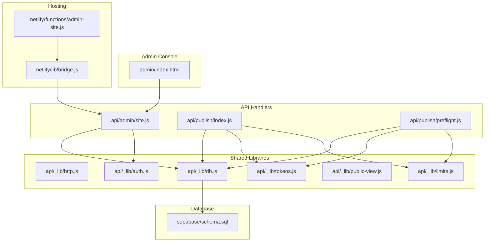
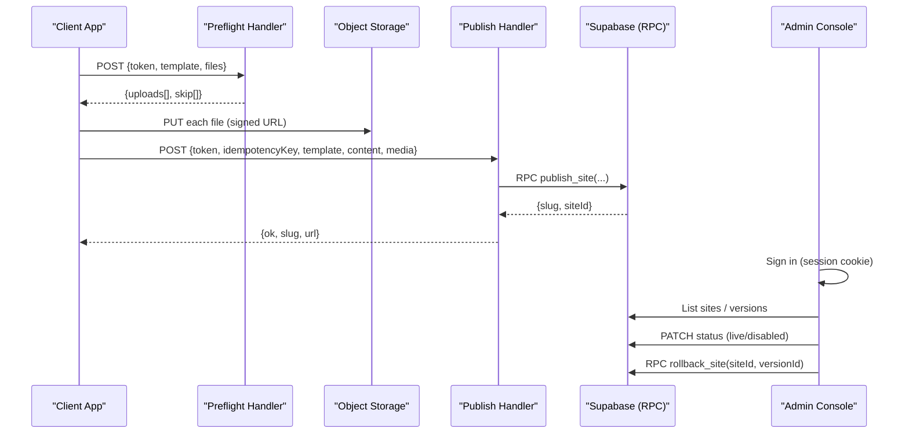
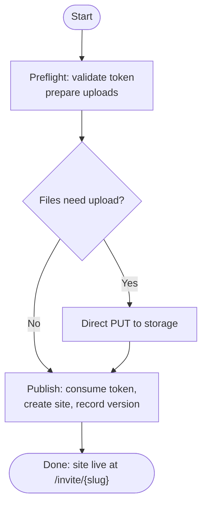
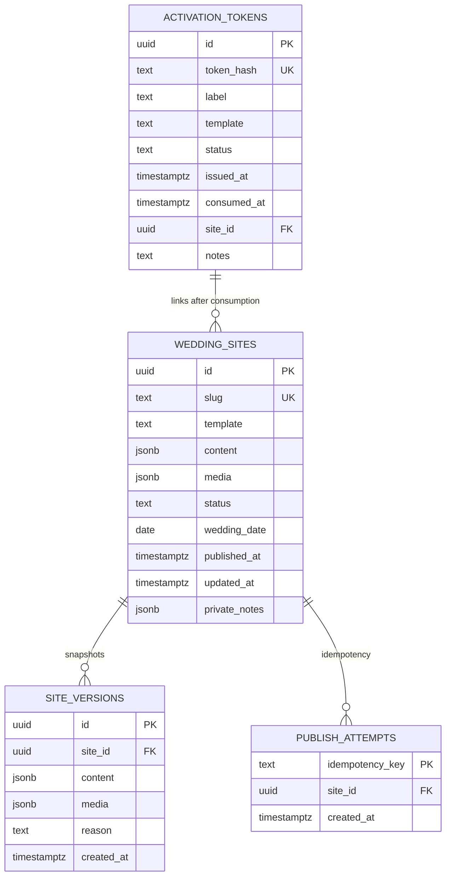
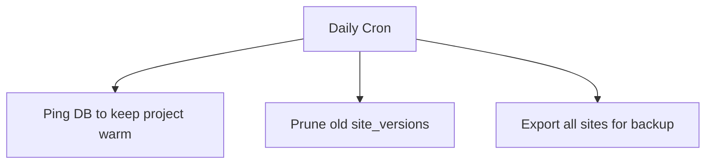
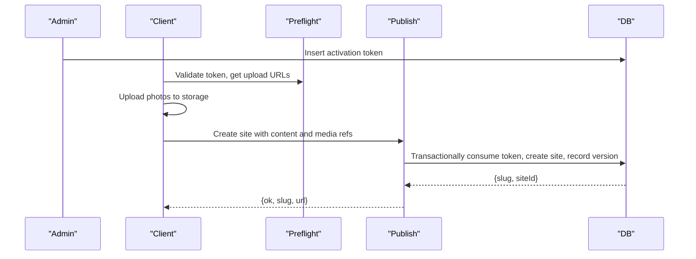
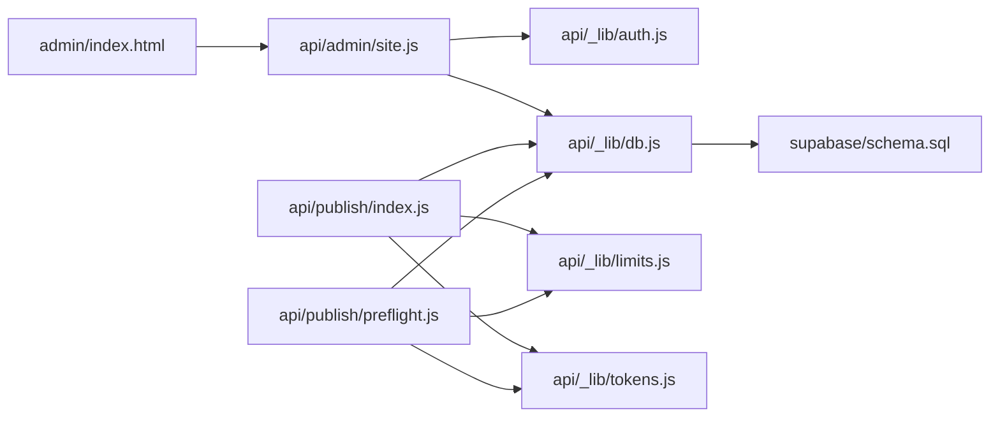
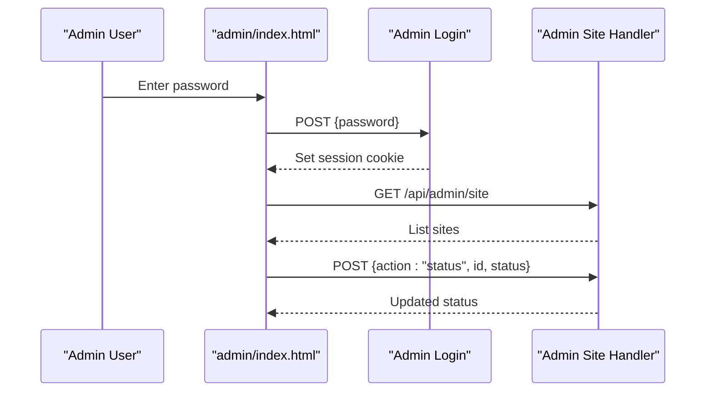

# Published Site Administration

<cite>
**Referenced Files in This Document**
- [api/admin/site.js](file://api/admin/site.js)
- [api/publish/index.js](file://api/publish/index.js)
- [api/publish/preflight.js](file://api/publish/preflight.js)
- [shared/publish-client.js](file://shared/publish-client.js)
- [api/_lib/db.js](file://api/_lib/db.js)
- [supabase/schema.sql](file://supabase/schema.sql)
- [api/_lib/http.js](file://api/_lib/http.js)
- [api/_lib/auth.js](file://api/_lib/auth.js)
- [api/_lib/limits.js](file://api/_lib/limits.js)
- [api/_lib/tokens.js](file://api/_lib/tokens.js)
- [api/_lib/public-view.js](file://api/_lib/public-view.js)
- [admin/index.html](file://admin/index.html)
- [netlify/functions/admin-site.js](file://netlify/functions/admin-site.js)
- [netlify/lib/bridge.js](file://netlify/lib/bridge.js)
</cite>

## Table of Contents
1. [Introduction](#introduction)
2. [Project Structure](#project-structure)
3. [Core Components](#core-components)
4. [Architecture Overview](#architecture-overview)
5. [Detailed Component Analysis](#detailed-component-analysis)
6. [Dependency Analysis](#dependency-analysis)
7. [Performance Considerations](#performance-considerations)
8. [Troubleshooting Guide](#troubleshooting-guide)
9. [Conclusion](#conclusion)
10. [Appendices](#appendices)

## Introduction
This document explains the published site administration system: how sites are created, versioned, monitored, and controlled; how administrators manage multiple sites; and how to operate, troubleshoot, and scale the system for large numbers of sites. It covers the full lifecycle from activation code to live invitation, including taking sites offline, rolling back content versions, and monitoring health.

## Project Structure
The system is composed of:
- API handlers for publishing, preflight checks, and admin operations
- A database layer that talks to Supabase via PostgREST and SQL functions
- A schema defining sites, tokens, versions, and idempotency
- An admin console UI for operators
- Hosting bridge for Netlify function invocation

**Diagram sources**
- [admin/index.html:137-345](file://admin/index.html#L137-L345)
- [api/admin/site.js:1-112](file://api/admin/site.js#L1-L112)
- [api/publish/index.js:1-135](file://api/publish/index.js#L1-L135)
- [api/publish/preflight.js:1-136](file://api/publish/preflight.js#L1-L136)
- [api/_lib/http.js:1-198](file://api/_lib/http.js#L1-L198)
- [api/_lib/auth.js:1-124](file://api/_lib/auth.js#L1-L124)
- [api/_lib/limits.js:1-188](file://api/_lib/limits.js#L1-L188)
- [api/_lib/tokens.js:1-155](file://api/_lib/tokens.js#L1-L155)
- [api/_lib/public-view.js:1-335](file://api/_lib/public-view.js#L1-L335)
- [api/_lib/db.js:1-265](file://api/_lib/db.js#L1-L265)
- [supabase/schema.sql:1-348](file://supabase/schema.sql#L1-L348)
- [netlify/functions/admin-site.js:1-7](file://netlify/functions/admin-site.js#L1-L7)
- [netlify/lib/bridge.js:1-126](file://netlify/lib/bridge.js#L1-L126)

**Section sources**
- [admin/index.html:137-345](file://admin/index.html#L137-L345)
- [api/admin/site.js:1-112](file://api/admin/site.js#L1-L112)
- [api/publish/index.js:1-135](file://api/publish/index.js#L1-L135)
- [api/publish/preflight.js:1-136](file://api/publish/preflight.js#L1-L136)
- [api/_lib/db.js:1-265](file://api/_lib/db.js#L1-L265)
- [supabase/schema.sql:1-348](file://supabase/schema.sql#L1-L348)
- [netlify/lib/bridge.js:1-126](file://netlify/lib/bridge.js#L1-L126)

## Core Components
- Publishing pipeline: preflight validation, direct uploads, and transactional publish
- Admin site management: list sites, toggle status (live/disabled), rollback to a previous version
- Data model: wedding_sites, activation_tokens, site_versions, publish_attempts
- Security: admin session via signed cookie, token hashing with pepper, strict input limits
- Hosting bridge: adapts Netlify events to Node-style request/response used by handlers

Key responsibilities:
- api/publish/preflight.js validates tokens and prepares storage upload permissions without consuming codes
- api/publish/index.js consumes a token and creates a site atomically, recording a version
- api/admin/site.js provides authenticated admin endpoints to manage site availability and rollbacks
- api/_lib/db.js encapsulates all database interactions and RPC calls
- supabase/schema.sql defines tables, constraints, and stored procedures ensuring consistency and safety

**Section sources**
- [api/publish/preflight.js:1-136](file://api/publish/preflight.js#L1-L136)
- [api/publish/index.js:1-135](file://api/publish/index.js#L1-L135)
- [api/admin/site.js:1-112](file://api/admin/site.js#L1-L112)
- [api/_lib/db.js:1-265](file://api/_lib/db.js#L1-L265)
- [supabase/schema.sql:1-348](file://supabase/schema.sql#L1-L348)

## Architecture Overview
The system enforces strong guarantees:
- One activation code activates exactly one website
- Publishing is idempotent and transactional
- Content changes are versioned before applying to the live site
- Admin can take sites offline or restore previous versions
- Public views are sanitized through an allow-list per template

**Diagram sources**
- [api/publish/preflight.js:1-136](file://api/publish/preflight.js#L1-L136)
- [api/publish/index.js:1-135](file://api/publish/index.js#L1-L135)
- [api/_lib/db.js:138-168](file://api/_lib/db.js#L138-L168)
- [supabase/schema.sql:147-208](file://supabase/schema.sql#L147-L208)
- [api/admin/site.js:31-112](file://api/admin/site.js#L31-L112)

## Detailed Component Analysis

### Site Lifecycle Management
- Creation: The client runs preflight to validate the token and obtain signed upload URLs, uploads photos directly to storage, then calls publish to consume the token and create the site in a single transaction. A version row is recorded automatically.
- Availability: Sites default to live. Admin can set status to disabled to take a site offline. Public reads only serve live sites.
- Versioning: Every publish and edit writes a snapshot to site_versions before updating the live row. Rollback restores a prior version and records the rollback as a new version.

**Diagram sources**
- [api/publish/preflight.js:33-136](file://api/publish/preflight.js#L33-L136)
- [api/publish/index.js:30-135](file://api/publish/index.js#L30-L135)
- [supabase/schema.sql:147-208](file://supabase/schema.sql#L147-L208)

**Section sources**
- [api/publish/preflight.js:33-136](file://api/publish/preflight.js#L33-L136)
- [api/publish/index.js:30-135](file://api/publish/index.js#L30-L135)
- [supabase/schema.sql:147-208](file://supabase/schema.sql#L147-L208)

### Site Data Model and Template Associations
- wedding_sites: stores slug, template, content, media references, status, dates, timestamps, and private notes
- activation_tokens: hashed tokens with label, template, status, and optional link to site_id
- site_versions: immutable snapshots of content/media with reason tags (publish/edit/rollback)
- publish_attempts: idempotency keys to prevent duplicate publishes

Template associations:
- Each site has a template field constrained to allowed values
- Public view uses per-template allow-lists to sanitize content safely
- Slug generation derives names from content based on template structure

**Diagram sources**
- [supabase/schema.sql:28-133](file://supabase/schema.sql#L28-L133)
- [supabase/schema.sql:116-120](file://supabase/schema.sql#L116-L120)
- [supabase/schema.sql:100-109](file://supabase/schema.sql#L100-L109)

**Section sources**
- [supabase/schema.sql:28-133](file://supabase/schema.sql#L28-L133)
- [supabase/schema.sql:100-109](file://supabase/schema.sql#L100-L109)
- [supabase/schema.sql:116-120](file://supabase/schema.sql#L116-L120)
- [api/_lib/public-view.js:117-169](file://api/_lib/public-view.js#L117-L169)

### Administrative Operations
- List sites: returns recent sites with slugs, templates, statuses, dates, and public URLs
- View site details: fetches a specific site by id along with its recent versions
- Toggle status: set site to live or disabled; affects public visibility
- Rollback: restore a previous version atomically; records a rollback version

```mermaid
sequenceDiagram
participant AdminUI as "Admin Console"
participant AdminAPI as "Admin Site Handler"
participant DB as "DB Layer"
AdminUI->>AdminAPI : GET /api/admin/site?id={siteId}
AdminAPI->>DB : getSiteById(id)
DB-->>AdminAPI : site row
AdminAPI->>DB : listVersions(siteId, limit=10)
DB-->>AdminAPI : versions[]
AdminAPI-->>AdminUI : {site, versions}
AdminUI->>AdminAPI : POST {action : "status", id, status}
AdminAPI->>DB : setSiteStatus(id, status)
DB-->>AdminAPI : updated row
AdminAPI-->>AdminUI : {ok, status}
AdminUI->>AdminAPI : POST {action : "rollback", id, versionId}
AdminAPI->>DB : rollbackSite(id, versionId)
DB-->>AdminAPI : {slug}
AdminAPI-->>AdminUI : {ok, slug}
```

**Diagram sources**
- [api/admin/site.js:31-112](file://api/admin/site.js#L31-L112)
- [api/_lib/db.js:110-116](file://api/_lib/db.js#L110-L116)
- [api/_lib/db.js:206-219](file://api/_lib/db.js#L206-L219)
- [api/_lib/db.js:166-168](file://api/_lib/db.js#L166-L168)

**Section sources**
- [api/admin/site.js:31-112](file://api/admin/site.js#L31-L112)
- [api/_lib/db.js:110-116](file://api/_lib/db.js#L110-L116)
- [api/_lib/db.js:206-219](file://api/_lib/db.js#L206-L219)
- [api/_lib/db.js:166-168](file://api/_lib/db.js#L166-L168)

### Status Monitoring and Health
- Live vs disabled: public reads filter by status = live; admin can toggle status
- Timestamps: published_at and updated_at help track when sites were created or last edited
- Cron keepalive: a daily ping prevents platform pauses; prune versions keeps data bounded
- Export: supports exporting all sites for backup purposes

**Diagram sources**
- [api/_lib/db.js:226-257](file://api/_lib/db.js#L226-L257)

**Section sources**
- [api/_lib/db.js:226-257](file://api/_lib/db.js#L226-L257)

### Practical Deployment Workflows
- New site creation:
  - Generate activation code in admin
  - Client runs preflight, uploads photos directly to storage
  - Client calls publish; server consumes token, creates site, records version
  - Site becomes live at /invite/{slug}
- Taking a site offline:
  - Admin toggles status to disabled; public invites return a disabled state
- Restoring a previous version:
  - Admin selects a version and triggers rollback; system records rollback as a new version

**Diagram sources**
- [api/_lib/db.js:173-179](file://api/_lib/db.js#L173-L179)
- [api/publish/preflight.js:33-136](file://api/publish/preflight.js#L33-L136)
- [api/publish/index.js:30-135](file://api/publish/index.js#L30-L135)
- [supabase/schema.sql:147-208](file://supabase/schema.sql#L147-L208)

**Section sources**
- [api/publish/preflight.js:33-136](file://api/publish/preflight.js#L33-L136)
- [api/publish/index.js:30-135](file://api/publish/index.js#L30-L135)
- [api/_lib/db.js:173-179](file://api/_lib/db.js#L173-L179)
- [supabase/schema.sql:147-208](file://supabase/schema.sql#L147-L208)

### Troubleshooting Published Sites
Common issues and resolutions:
- Token invalid or revoked: check activation token status and template match
- Token already used: recover existing site if available; otherwise issue a new code
- Slug taken: retry with a different suffix during publish
- Upstream errors: transient network or DB issues; retry with backoff
- Rate limited: wait and retry; reduce burst attempts

Operational checks:
- Verify site status is live for public access
- Confirm versions exist for rollback
- Ensure cron keepalive is running to avoid platform pauses

**Section sources**
- [api/publish/index.js:98-135](file://api/publish/index.js#L98-L135)
- [api/_lib/http.js:52-79](file://api/_lib/http.js#L52-L79)
- [api/_lib/db.js:226-257](file://api/_lib/db.js#L226-L257)

## Dependency Analysis
- Handlers depend on shared libraries for HTTP plumbing, auth, limits, tokens, and public view shaping
- Database layer centralizes all Supabase interactions and RPC calls
- Schema enforces constraints and business rules via stored procedures
- Admin UI depends on admin endpoints which require authenticated sessions

**Diagram sources**
- [admin/index.html:137-345](file://admin/index.html#L137-L345)
- [api/admin/site.js:1-112](file://api/admin/site.js#L1-L112)
- [api/publish/index.js:1-135](file://api/publish/index.js#L1-L135)
- [api/publish/preflight.js:1-136](file://api/publish/preflight.js#L1-L136)
- [api/_lib/db.js:1-265](file://api/_lib/db.js#L1-L265)
- [supabase/schema.sql:1-348](file://supabase/schema.sql#L1-L348)

**Section sources**
- [api/admin/site.js:1-112](file://api/admin/site.js#L1-L112)
- [api/publish/index.js:1-135](file://api/publish/index.js#L1-L135)
- [api/publish/preflight.js:1-136](file://api/publish/preflight.js#L1-L136)
- [api/_lib/db.js:1-265](file://api/_lib/db.js#L1-L265)
- [supabase/schema.sql:1-348](file://supabase/schema.sql#L1-L348)

## Performance Considerations
- Media handling: Photos are uploaded directly to storage; only paths and metadata are stored in the database to minimize payload sizes
- Content size limits: Enforced caps on content JSON and media references to protect database size and egress budgets
- Egress budgeting: Public view resolves responsive image sizes to reduce bandwidth per guest
- Idempotency: Prevents duplicate publishes and token spending under retries
- Version pruning: Daily pruning keeps the versions table bounded
- Keepalive: Daily ping avoids platform pauses that would make live sites temporarily unavailable

Recommendations:
- Monitor egress usage and adjust photo counts/sizes if nearing limits
- Use version pruning to control database growth
- Ensure keepalive cron runs reliably to maintain uptime

[No sources needed since this section provides general guidance]

## Troubleshooting Guide
Symptoms and actions:
- Activation code not recognized: verify token shape and ensure it matches the selected template
- Code already used: attempt recovery to find existing site; if none, issue a new code
- Too many attempts: rate limiting triggered; wait and retry
- Upstream errors: transient; retry with backoff; check DB connectivity
- Site not visible: confirm status is live; check slug resolution

Admin diagnostics:
- List sites and versions to inspect state
- Toggle status to isolate issues
- Rollback to a known-good version if edits caused problems

**Section sources**
- [api/_lib/http.js:52-79](file://api/_lib/http.js#L52-L79)
- [api/publish/index.js:98-135](file://api/publish/index.js#L98-L135)
- [api/admin/site.js:31-112](file://api/admin/site.js#L31-L112)

## Conclusion
The published site administration system provides robust lifecycle management for wedding invitations with strong guarantees around uniqueness, idempotency, and versioning. Administrators can manage multiple sites, control availability, and recover from mistakes using version rollbacks. The architecture emphasizes security, performance, and operational reliability through strict input validation, direct media uploads, and scheduled maintenance tasks.

[No sources needed since this section summarizes without analyzing specific files]

## Appendices

### Admin Console Workflow
- Sign in with password to obtain a signed session cookie
- Mint activation codes with labels and template selection
- Manage tokens: revoke issued codes
- Manage published sites: list, view details, toggle status, rollback

**Diagram sources**
- [admin/index.html:137-345](file://admin/index.html#L137-L345)
- [api/admin/site.js:31-112](file://api/admin/site.js#L31-L112)

**Section sources**
- [admin/index.html:137-345](file://admin/index.html#L137-L345)
- [api/admin/site.js:31-112](file://api/admin/site.js#L31-L112)