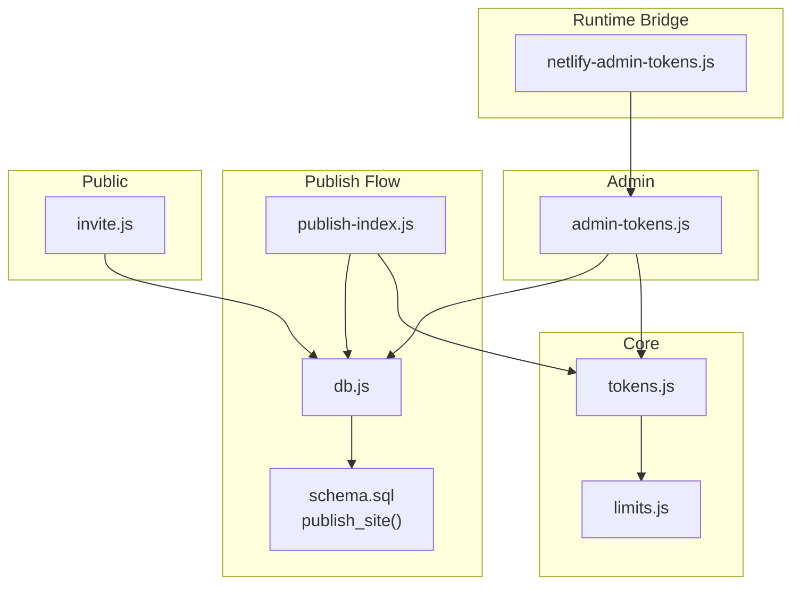
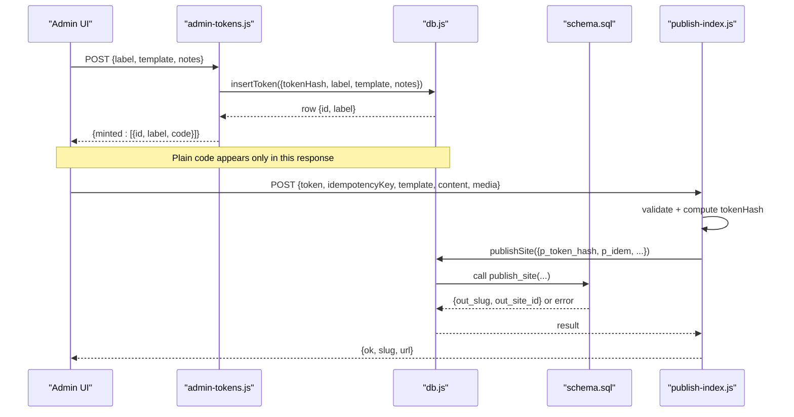
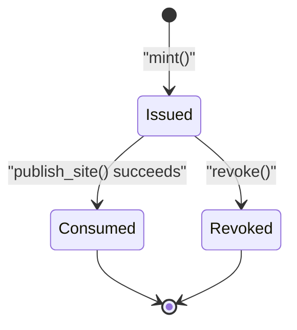
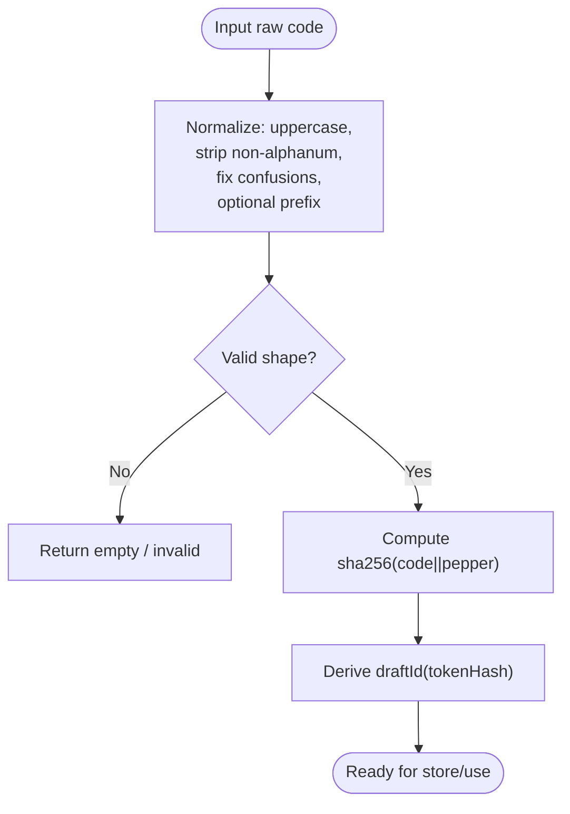
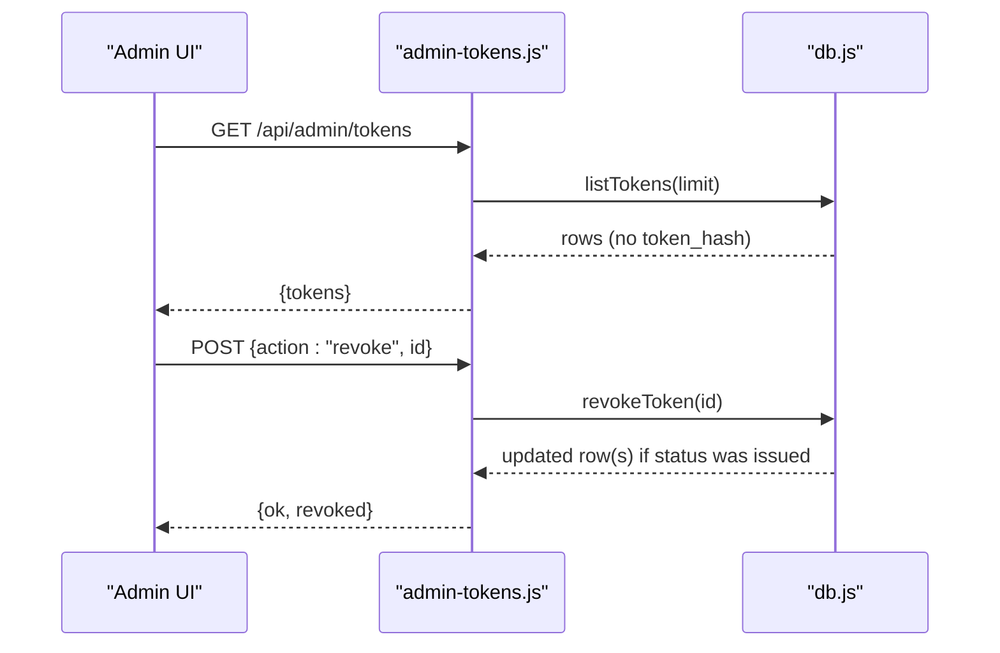
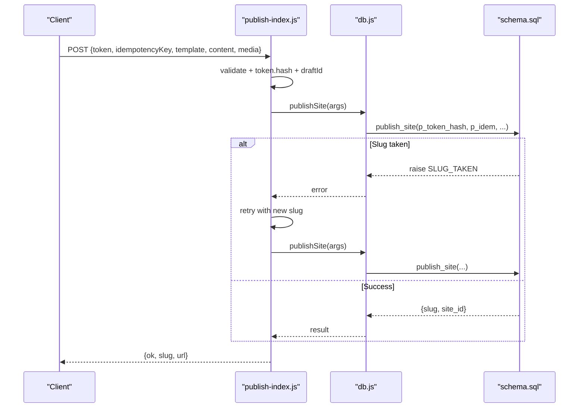
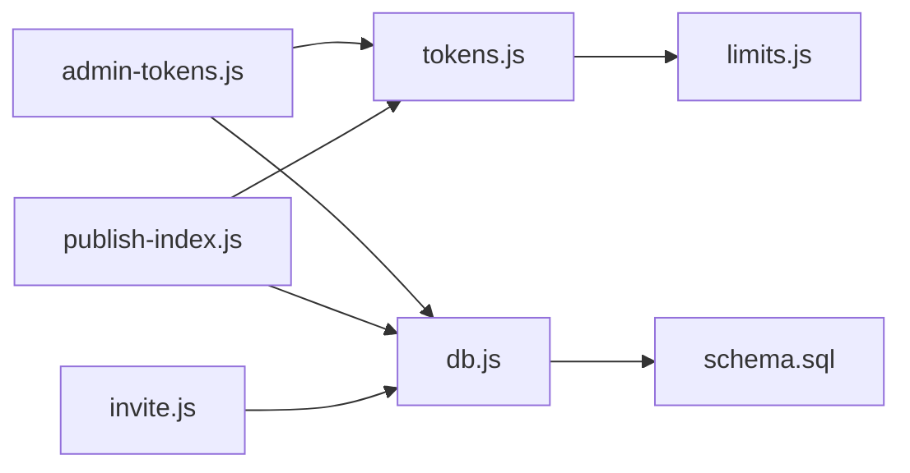

# Token Generation & Management

<cite>
**Referenced Files in This Document**
- [tokens.js](file://api/_lib/tokens.js)
- [db.js](file://api/_lib/db.js)
- [schema.sql](file://supabase/schema.sql)
- [limits.js](file://shared/limits.js)
- [admin-tokens.js](file://api/admin/tokens.js)
- [publish-index.js](file://api/publish/index.js)
- [invite.js](file://api/invite.js)
- [netlify-admin-tokens.js](file://netlify/functions/admin-tokens.js)
</cite>

## Table of Contents
1. Introduction
2. Project Structure
3. Core Components
4. Architecture Overview
5. Detailed Component Analysis
6. Dependency Analysis
7. Performance Considerations
8. Troubleshooting Guide
9. Conclusion

## Introduction
This document explains the token generation and management system used to activate one-time wedding website publishing. It covers how activation codes are created, how tokens transition through their lifecycle (issued → consumed or revoked), how metadata such as labels and notes is handled, and how monitoring and bulk operations work. It also documents security considerations for storage, transmission, and validation.

## Project Structure
The token system spans a small set of focused modules:
- Token utilities generate and normalize activation codes and derive safe identifiers for drafts and public slugs.
- The admin API mints, lists, and revokes tokens under authentication.
- The publish endpoint consumes a token atomically with site creation via a database function.
- The database schema defines tables, constraints, and functions that enforce one-time use and consistency.
- Limits define token format parameters and rate limits.

**Diagram sources**
- [admin-tokens.js:42-102](file://api/admin/tokens.js#L42-L102)
- [publish-index.js:30-135](file://api/publish/index.js#L30-L135)
- [db.js:125-197](file://api/_lib/db.js#L125-L197)
- [schema.sql:147-208](file://supabase/schema.sql#L147-L208)
- [tokens.js:26-99](file://api/_lib/tokens.js#L26-L99)
- [limits.js:57-60](file://shared/limits.js#L57-L60)
- [netlify-admin-tokens.js:1-7](file://netlify/functions/admin-tokens.js#L1-L7)

**Section sources**
- [tokens.js:1-155](file://api/_lib/tokens.js#L1-L155)
- [db.js:1-265](file://api/_lib/db.js#L1-L265)
- [schema.sql:65-93](file://supabase/schema.sql#L65-L93)
- [limits.js:1-84](file://shared/limits.js#L1-L84)
- [admin-tokens.js:1-103](file://api/admin/tokens.js#L1-L103)
- [publish-index.js:1-135](file://api/publish/index.js#L1-L135)
- [invite.js:1-115](file://api/invite.js#L1-L115)
- [netlify-admin-tokens.js:1-7](file://netlify/functions/admin-tokens.js#L1-L7)

## Core Components
- Token generator and normalizer: creates secure, human-friendly activation codes; normalizes user input; hashes codes with a server-side pepper; derives draft folder IDs and public slugs.
- Admin token API: authenticated endpoints to mint one or multiple codes, list tokens, and revoke unused codes.
- Publish flow: validates inputs, computes token hash, enforces idempotency, and calls a database function to consume the token and create the site in one transaction.
- Database schema: defines activation_tokens table, status transitions, unique constraints, and functions that guarantee one-time use and atomicity.
- Limits: central configuration for token format and rate limits.

**Section sources**
- [tokens.js:26-99](file://api/_lib/tokens.js#L26-L99)
- [admin-tokens.js:42-102](file://api/admin/tokens.js#L42-L102)
- [publish-index.js:30-135](file://api/publish/index.js#L30-L135)
- [schema.sql:65-93](file://supabase/schema.sql#L65-L93)
- [limits.js:57-60](file://shared/limits.js#L57-L60)

## Architecture Overview
The system ensures that each activation code activates exactly one website, never stored in plain text, and protected by hashing and environment-scoped secrets.

**Diagram sources**
- [admin-tokens.js:75-102](file://api/admin/tokens.js#L75-L102)
- [db.js:173-197](file://api/_lib/db.js#L173-L197)
- [publish-index.js:30-135](file://api/publish/index.js#L30-L135)
- [schema.sql:147-208](file://supabase/schema.sql#L147-L208)

## Detailed Component Analysis

### Token Data Model and Lifecycle
- Activation tokens are stored with a hashed value (sha256(code || pepper)), a label, template, status, timestamps, optional notes, and an optional link to the published site.
- Statuses:
  - issued: available for activation
  - consumed: activated and linked to a site
  - revoked: withdrawn before use
- One-time use is enforced by:
  - Unique constraint on token_hash
  - Atomic update in publish_site that requires status = 'issued' and matching template
  - Linking site_id back to the token after successful publish
- Metadata:
  - label: free-form reference string (e.g., customer name, payment note)
  - notes: additional private notes attached at issuance time
  - private_notes on sites: separate from token notes; not served publicly

**Diagram sources**
- [schema.sql:65-93](file://supabase/schema.sql#L65-L93)
- [schema.sql:147-208](file://supabase/schema.sql#L147-L208)
- [admin-tokens.js:57-73](file://api/admin/tokens.js#L57-L73)

**Section sources**
- [schema.sql:65-93](file://supabase/schema.sql#L65-L93)
- [schema.sql:147-208](file://supabase/schema.sql#L147-L208)
- [db.js:173-197](file://api/_lib/db.js#L173-L197)

### Token Generation and Normalization
- Codes are generated with fixed groups and group size for readability and entropy.
- Normalization handles case, spaces, missing prefix, and common confusions (I/l→1, O→0).
- Hashing uses a server-side pepper; without it, operations fail early.
- Draft IDs are derived from the token hash to scope uploads per customer without storing paths that could be misused.

**Diagram sources**
- [tokens.js:26-99](file://api/_lib/tokens.js#L26-L99)
- [limits.js:57-60](file://shared/limits.js#L57-L60)

**Section sources**
- [tokens.js:26-99](file://api/_lib/tokens.js#L26-L99)
- [limits.js:57-60](file://shared/limits.js#L57-L60)

### Admin Token Operations (Mint, List, Revoke)
- Mint:
  - Requires admin session.
  - Accepts label, template, notes, and count (batch up to a limit).
  - Generates codes, stores only hashes, returns plain codes once in the response.
- List:
  - Returns tokens excluding sensitive fields like token_hash.
- Revoke:
  - Only affects tokens still in issued state; cannot revoke already consumed tokens.

**Diagram sources**
- [admin-tokens.js:42-102](file://api/admin/tokens.js#L42-L102)
- [db.js:184-197](file://api/_lib/db.js#L184-L197)

**Section sources**
- [admin-tokens.js:42-102](file://api/admin/tokens.js#L42-L102)
- [db.js:184-197](file://api/_lib/db.js#L184-L197)

### Publish Workflow and One-Time Consumption
- Validates request body, template, idempotency key, and token shape.
- Derives media paths from token-derived draft ID to prevent cross-customer path injection.
- Calls publish_site which:
  - Checks idempotency key to avoid duplicate publishes.
  - Atomically claims the token (status issued → consumed) and creates the site.
  - On slug collision, rolls back the claim and retries with a new suffix.
- Returns the public invite URL or a specific error indicating why the token could not be used.

**Diagram sources**
- [publish-index.js:30-135](file://api/publish/index.js#L30-L135)
- [db.js:138-148](file://api/_lib/db.js#L138-L148)
- [schema.sql:147-208](file://supabase/schema.sql#L147-L208)

**Section sources**
- [publish-index.js:30-135](file://api/publish/index.js#L30-L135)
- [db.js:138-148](file://api/_lib/db.js#L138-L148)
- [schema.sql:147-208](file://supabase/schema.sql#L147-L208)

### Monitoring and Visibility
- Admin list shows token status, template, issue/consume times, and associated site when present.
- Logs record minting and revocation events without including plain codes.
- Public pages do not expose token data; they serve only public site content.

**Section sources**
- [admin-tokens.js:45-48](file://api/admin/tokens.js#L45-L48)
- [admin-tokens.js:99-101](file://api/admin/tokens.js#L99-L101)
- [db.js:184-188](file://api/_lib/db.js#L184-L188)

### Practical Workflows and Examples

- Create a single token:
  - Call the admin endpoint with label, template, and optional notes.
  - Receive the plain code once; send it securely to the customer.
  - Store the returned id for later revocation if needed.

- Create multiple tokens (bulk):
  - Provide a count to mint several codes at once.
  - Labels are auto-numbered for batch items.

- Revoke a token:
  - Send action revoke with the token id while it remains issued.
  - If already consumed, revocation fails safely.

- Publish with a token:
  - Validate token shape and compute hash.
  - Submit idempotency key to avoid duplicates.
  - Handle errors: TOKEN_INVALID, TOKEN_REVOKED, TOKEN_WRONG_TEMPLATE, TOKEN_USED (with recoverable hint), or SERVER.

- Recover a published link:
  - Use the recover flow to find the site by token hash after a successful publish but lost response.

[No sources needed since this section summarizes workflows without analyzing specific files]

## Dependency Analysis
- Admin token handler depends on auth, http helpers, tokens utility, and db layer.
- Publish handler depends on http helpers, limits, tokens utility, db layer, and public-view helpers.
- DB layer abstracts PostgREST RPCs and queries; all multi-step writes go through database functions for transactional safety.
- Schema defines core constraints and functions that enforce business rules at the database level.

**Diagram sources**
- [tokens.js:1-155](file://api/_lib/tokens.js#L1-L155)
- [limits.js:1-84](file://shared/limits.js#L1-L84)
- [admin-tokens.js:1-103](file://api/admin/tokens.js#L1-L103)
- [publish-index.js:1-135](file://api/publish/index.js#L1-L135)
- [db.js:1-265](file://api/_lib/db.js#L1-L265)
- [schema.sql:1-348](file://supabase/schema.sql#L1-L348)
- [invite.js:1-115](file://api/invite.js#L1-L115)

**Section sources**
- [tokens.js:1-155](file://api/_lib/tokens.js#L1-L155)
- [limits.js:1-84](file://shared/limits.js#L1-L84)
- [admin-tokens.js:1-103](file://api/admin/tokens.js#L1-L103)
- [publish-index.js:1-135](file://api/publish/index.js#L1-L135)
- [db.js:1-265](file://api/_lib/db.js#L1-L265)
- [schema.sql:1-348](file://supabase/schema.sql#L1-L348)
- [invite.js:1-115](file://api/invite.js#L1-L115)

## Performance Considerations
- Token hashing and normalization are lightweight operations.
- Batch minting is capped to avoid excessive load.
- Publishing uses idempotency keys to prevent duplicate work and relies on database-level locking via conditional updates.
- Public invites are cached at the CDN to minimize database reads during high traffic.

[No sources needed since this section provides general guidance]

## Troubleshooting Guide
Common issues and where to look:
- TOKEN_INVALID:
  - Check token shape and normalization; ensure correct template selection.
  - Verify TOKEN_PEPPER is configured.
- TOKEN_REVOKED:
  - Token was withdrawn before use; mint a replacement.
- TOKEN_WRONG_TEMPLATE:
  - Template mismatch between token and request.
- TOKEN_USED:
  - Token already consumed; use recover flow to retrieve the published link if available.
- SLUG_TAKEN:
  - Name-based slug collision; system retries automatically; persistent failures indicate extreme collisions.
- UPSTREAM errors:
  - Database unreachable or timeout; check Supabase connectivity and timeouts.

Operational checks:
- Confirm admin session and permissions when minting or revoking.
- Ensure environment variables for Supabase and token pepper are set.
- Review logs for mint/revoke events and publish outcomes.

**Section sources**
- [publish-index.js:98-135](file://api/publish/index.js#L98-L135)
- [db.js:26-32](file://api/_lib/db.js#L26-L32)
- [tokens.js:69-83](file://api/_lib/tokens.js#L69-L83)
- [admin-tokens.js:57-73](file://api/admin/tokens.js#L57-L73)

## Security Considerations
- Storage:
  - Plain activation codes are never stored; only sha256(code || pepper) is persisted.
  - Draft folders are derived from token hashes to avoid storing sensitive paths.
- Transmission:
  - Plain codes are returned only once in the admin response; they should be sent directly to customers and not logged.
  - Admin sessions use secure cookies with appropriate flags.
- Validation:
  - Token shape is validated before any database lookup.
  - Media paths are re-derived from token-derived draft IDs to prevent cross-customer access.
  - Idempotency keys prevent duplicate publishes.
- Access control:
  - Database Row Level Security is enabled; only service-role can access tables via server-side functions.
  - Admin endpoints require authentication.

**Section sources**
- [schema.sql:6-17](file://supabase/schema.sql#L6-L17)
- [schema.sql:123-134](file://supabase/schema.sql#L123-L134)
- [tokens.js:69-99](file://api/_lib/tokens.js#L69-L99)
- [publish-index.js:50-58](file://api/publish/index.js#L50-L58)
- [admin-tokens.js:29-40](file://api/admin/tokens.js#L29-L40)

## Conclusion
The token system provides a secure, auditable, and robust mechanism for one-time activation of wedding websites. It combines client-friendly codes, server-side hashing with pepper, strict validation, idempotent publishing, and database-enforced constraints to ensure each token activates exactly one site. Admin tools support minting, listing, and revocation, while monitoring and logging help track token usage and operational health.