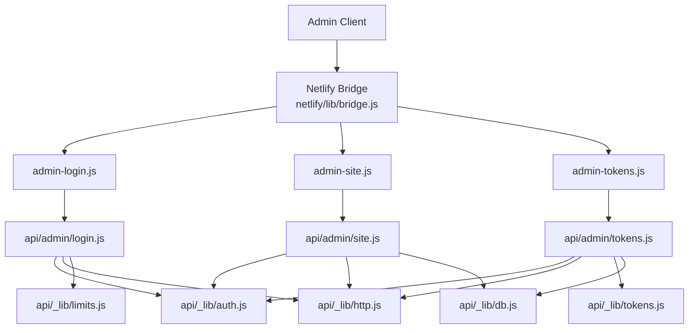
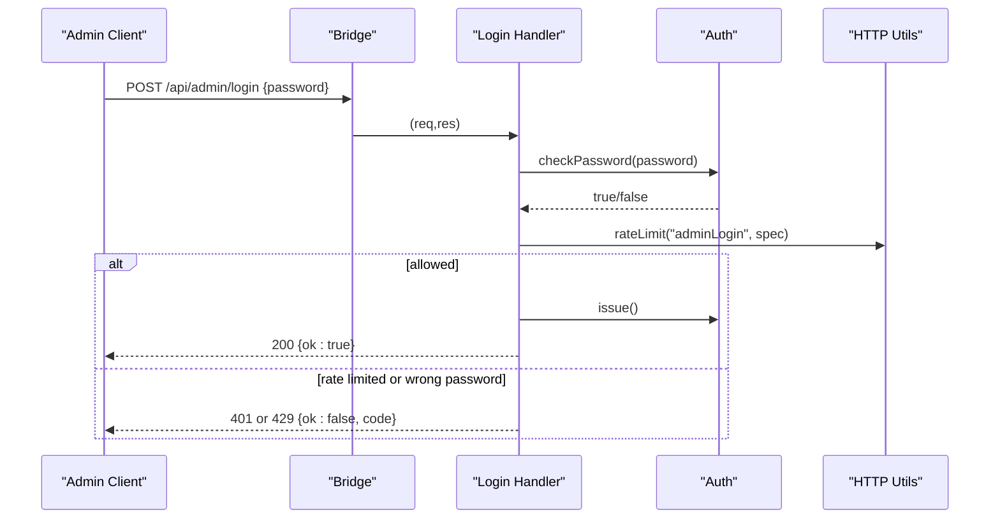
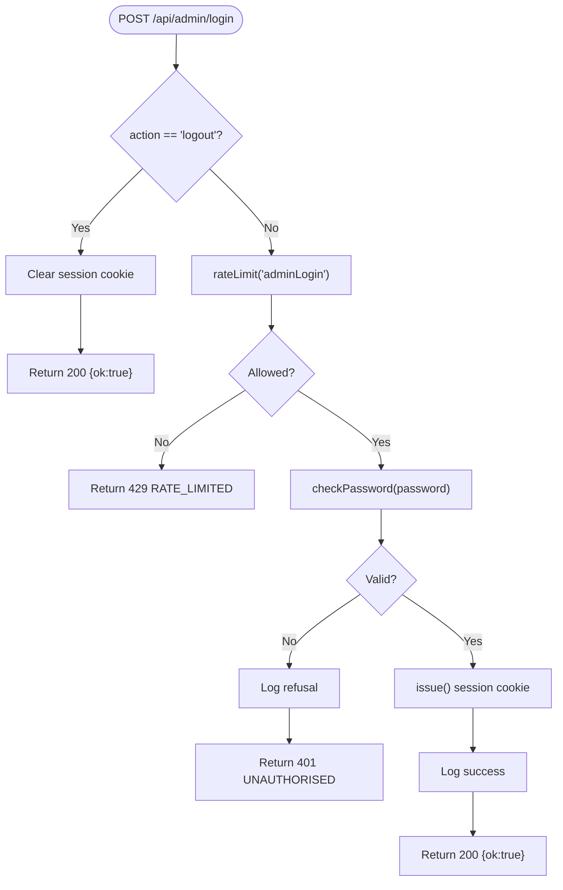
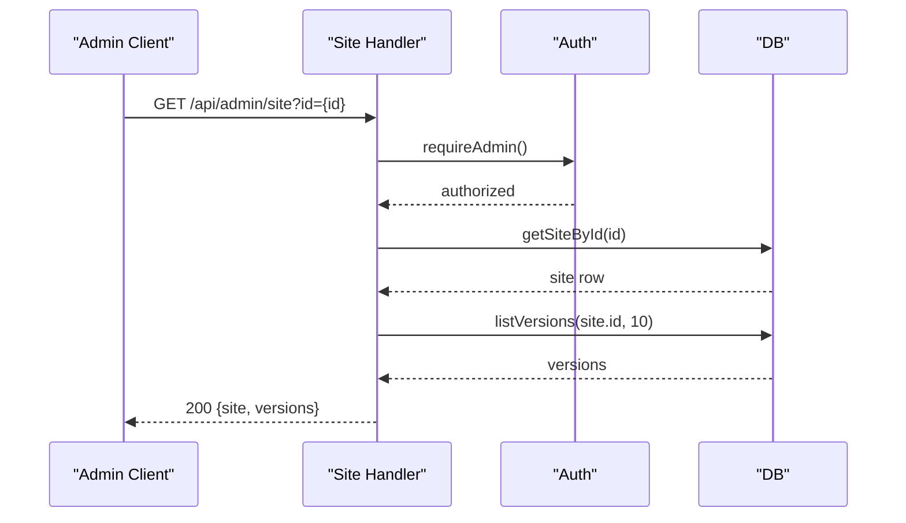
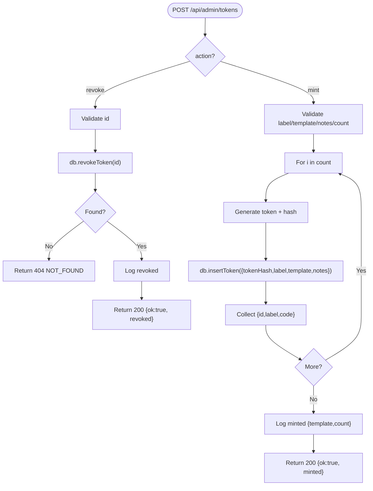
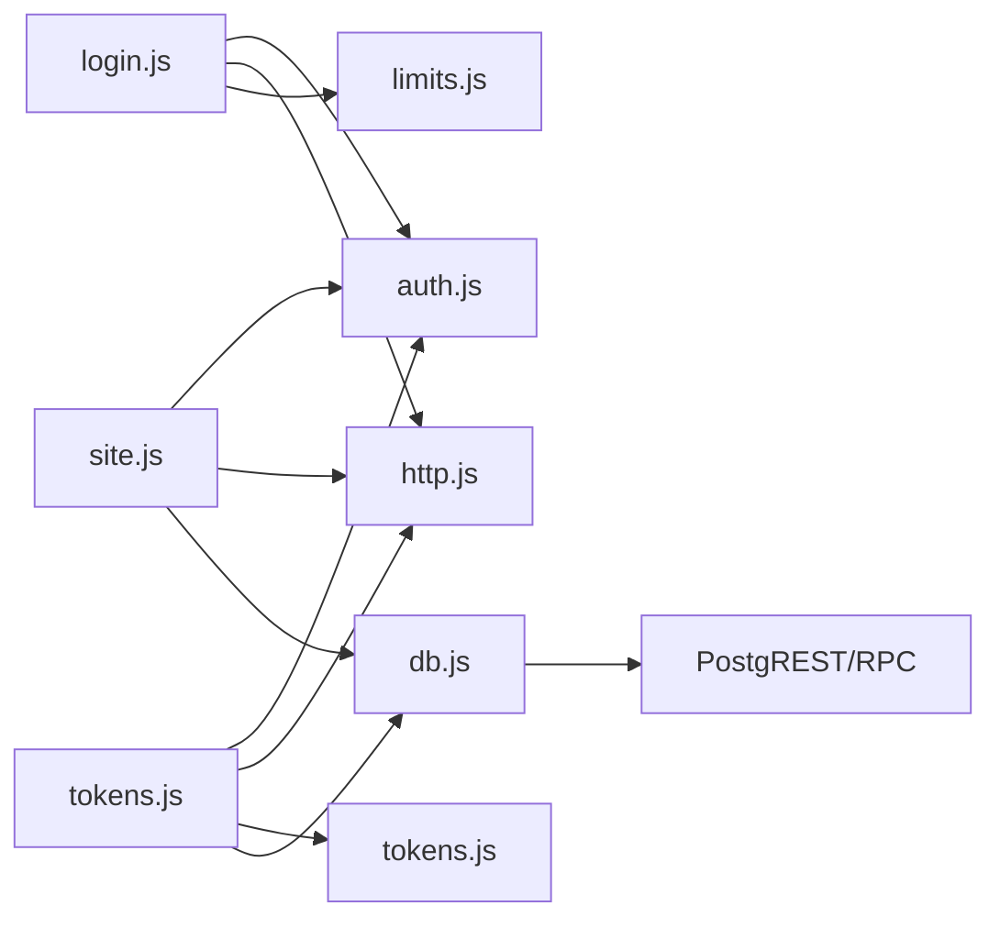

# Admin APIs

<cite>
**Referenced Files in This Document**
- [api/admin/login.js](file://api/admin/login.js)
- [api/admin/site.js](file://api/admin/site.js)
- [api/admin/tokens.js](file://api/admin/tokens.js)
- [netlify/functions/admin-login.js](file://netlify/functions/admin-login.js)
- [netlify/functions/admin-site.js](file://netlify/functions/admin-site.js)
- [netlify/functions/admin-tokens.js](file://netlify/functions/admin-tokens.js)
- [api/_lib/auth.js](file://api/_lib/auth.js)
- [api/_lib/http.js](file://api/_lib/http.js)
- [api/_lib/limits.js](file://api/_lib/limits.js)
- [api/_lib/tokens.js](file://api/_lib/tokens.js)
- [api/_lib/db.js](file://api/_lib/db.js)
- [netlify/lib/bridge.js](file://netlify/lib/bridge.js)
</cite>

## Table of Contents
1. [Introduction](#introduction)
2. [Project Structure](#project-structure)
3. [Core Components](#core-components)
4. [Architecture Overview](#architecture-overview)
5. [Detailed Component Analysis](#detailed-component-analysis)
6. [Dependency Analysis](#dependency-analysis)
7. [Performance Considerations](#performance-considerations)
8. [Troubleshooting Guide](#troubleshooting-guide)
9. [Conclusion](#conclusion)

## Introduction
This document provides comprehensive API documentation for the admin dashboard endpoints used to manage sites, tokens, and administrative sessions. It covers HTTP methods, URL patterns, request/response schemas, authentication requirements, rate limiting, access controls, security measures, error responses, validation rules, and best practices for safe and efficient admin usage.

## Project Structure
The admin API is implemented as serverless functions that delegate to shared handlers:
- Netlify function wrappers route requests to handler modules under api/admin.
- Handlers enforce authentication, validate inputs, perform business logic, and interact with the database via a centralized DB module.
- Shared libraries provide authentication, HTTP utilities, limits, token generation, and rate limiting.

**Diagram sources**
- [netlify/lib/bridge.js:18-123](file://netlify/lib/bridge.js#L18-L123)
- [netlify/functions/admin-login.js:1-7](file://netlify/functions/admin-login.js#L1-L7)
- [netlify/functions/admin-site.js:1-7](file://netlify/functions/admin-site.js#L1-L7)
- [netlify/functions/admin-tokens.js:1-7](file://netlify/functions/admin-tokens.js#L1-L7)
- [api/admin/login.js:19-49](file://api/admin/login.js#L19-L49)
- [api/admin/site.js:18-111](file://api/admin/site.js#L18-L111)
- [api/admin/tokens.js:21-101](file://api/admin/tokens.js#L21-L101)
- [api/_lib/auth.js:1-124](file://api/_lib/auth.js#L1-L124)
- [api/_lib/http.js:1-198](file://api/_lib/http.js#L1-L198)
- [api/_lib/limits.js:1-188](file://api/_lib/limits.js#L1-L188)
- [api/_lib/tokens.js:1-155](file://api/_lib/tokens.js#L1-L155)
- [api/_lib/db.js:1-265](file://api/_lib/db.js#L1-L265)

**Section sources**
- [netlify/lib/bridge.js:18-123](file://netlify/lib/bridge.js#L18-L123)
- [api/admin/login.js:19-49](file://api/admin/login.js#L19-L49)
- [api/admin/site.js:18-111](file://api/admin/site.js#L18-L111)
- [api/admin/tokens.js:21-101](file://api/admin/tokens.js#L21-L101)

## Core Components
- Authentication: HMAC-signed session cookie with strict SameSite and HttpOnly flags; constant-time password comparison; short-lived sessions.
- HTTP utilities: standardized JSON responses, error codes, method enforcement, body size caps, redacted logging, and rate limiting.
- Token management: secure activation code generation, hashing with pepper, listing, minting, and revocation.
- Site management: list sites, fetch site details with versions, change status, rollback to previous version.
- Database abstraction: PostgREST calls with timeouts, RPCs for multi-step writes, and admin-specific queries.

**Section sources**
- [api/_lib/auth.js:1-124](file://api/_lib/auth.js#L1-L124)
- [api/_lib/http.js:1-198](file://api/_lib/http.js#L1-L198)
- [api/_lib/tokens.js:1-155](file://api/_lib/tokens.js#L1-L155)
- [api/_lib/db.js:1-265](file://api/_lib/db.js#L1-L265)

## Architecture Overview
Admin endpoints are protected by an admin session established via login. Subsequent requests must include the signed cookie. All admin handlers require admin authorization before processing. Rate limiting protects sensitive operations like login. Requests are wrapped with consistent error handling and logging.

**Diagram sources**
- [api/admin/login.js:23-49](file://api/admin/login.js#L23-L49)
- [api/_lib/auth.js:64-98](file://api/_lib/auth.js#L64-L98)
- [api/_lib/http.js:121-147](file://api/_lib/http.js#L121-L147)

## Detailed Component Analysis

### Authentication: POST /api/admin/login
- Purpose: Establish or clear an admin session.
- Method: POST
- Path: /api/admin/login
- Headers: None required for login; subsequent admin endpoints require the session cookie set by this endpoint.
- Request body:
  - For sign-in: { password: string }
  - For sign-out: { action: "logout" }
- Response:
  - 200 OK: { ok: true }
  - 401 Unauthorized: { ok: false, code: "UNAUTHORISED", message: "Not signed in." }
  - 429 Too Many Requests: { ok: false, code: "RATE_LIMITED", message: "Too many attempts. Please wait a few minutes and try again." }
- Security:
  - Password compared using constant-time comparison against environment variable.
  - Session cookie is HttpOnly, Secure, SameSite=Strict, scoped to /api, with a fixed TTL.
  - Rate limiting applied before password check to mitigate brute force.
- Audit logging:
  - Successful login and refused attempts are logged without secrets.

**Diagram sources**
- [api/admin/login.js:23-49](file://api/admin/login.js#L23-L49)
- [api/_lib/auth.js:64-98](file://api/_lib/auth.js#L64-L98)
- [api/_lib/http.js:121-147](file://api/_lib/http.js#L121-L147)

**Section sources**
- [api/admin/login.js:1-50](file://api/admin/login.js#L1-L50)
- [api/_lib/auth.js:1-124](file://api/_lib/auth.js#L1-L124)
- [api/_lib/http.js:121-147](file://api/_lib/http.js#L121-L147)

### Site Management: GET/POST /api/admin/site
- Purpose: List websites, retrieve details including saved versions, change site status, and rollback to a previous version.
- Authorization: Requires valid admin session cookie.
- Methods and patterns:
  - GET /api/admin/site
    - Query params: id (optional) — returns one site if provided; otherwise lists up to 200 sites newest first.
    - Response:
      - Without id: { ok: true, sites: Array<{ id, slug, template, status, weddingDate, publishedAt, updatedAt, url }> }
      - With id: { ok: true, site: { id, slug, template, status, weddingDate, publishedAt, updatedAt, privateNotes, url }, versions: Array<{ id, reason, created_at }> }
  - POST /api/admin/site
    - Body:
      - Status change: { action: "status", id: string, status: "live" | "disabled" }
      - Rollback: { action: "rollback", id: string, versionId: string }
    - Responses:
      - 200 OK: { ok: true, status: "live"|"disabled" } or { ok: true, slug: string }
      - 400 Bad Request: invalid fields or method
      - 401 Unauthorized: missing or invalid session
      - 404 Not Found: site or version not found
- Validation:
  - id and versionId validated as short alphanumeric strings.
  - status restricted to allowed values.
- Audit logging:
  - Status changes and rollbacks are logged with identifiers.

**Diagram sources**
- [api/admin/site.js:31-78](file://api/admin/site.js#L31-L78)
- [api/_lib/auth.js:111-121](file://api/_lib/auth.js#L111-L121)
- [api/_lib/db.js:110-210](file://api/_lib/db.js#L110-L210)

**Section sources**
- [api/admin/site.js:1-112](file://api/admin/site.js#L1-L112)
- [api/_lib/db.js:110-210](file://api/_lib/db.js#L110-L210)

### Token Administration: GET/POST /api/admin/tokens
- Purpose: List activation tokens, mint new tokens, and revoke unused tokens.
- Authorization: Requires valid admin session cookie.
- Methods and patterns:
  - GET /api/admin/tokens
    - Response: { ok: true, tokens: Array<{ id, label, template, status, issued_at, consumed_at, site_id }> }
  - POST /api/admin/tokens
    - Revoke: { action: "revoke", id: string }
      - Response: { ok: true, revoked: number } or 404 if not found or already used
    - Mint: { label: string, template: "sample1"|"sample2", notes?: string, count?: number }
      - Response: { ok: true, minted: Array<{ id, label, code }> }
      - Notes: The plain text code appears only in this response and is never stored or logged.
- Validation:
  - label and notes sanitized and length-capped.
  - template restricted to allowed values.
  - count bounded to a maximum batch size.
- Audit logging:
  - Minting and revoking actions are logged with counts and templates, without exposing raw codes.

**Diagram sources**
- [api/admin/tokens.js:42-101](file://api/admin/tokens.js#L42-L101)
- [api/_lib/tokens.js:26-83](file://api/_lib/tokens.js#L26-L83)
- [api/_lib/db.js:173-197](file://api/_lib/db.js#L173-L197)

**Section sources**
- [api/admin/tokens.js:1-103](file://api/admin/tokens.js#L1-L103)
- [api/_lib/tokens.js:1-155](file://api/_lib/tokens.js#L1-L155)
- [api/_lib/db.js:173-197](file://api/_lib/db.js#L173-L197)

## Dependency Analysis
- Handlers depend on:
  - Authentication: requireAdmin for all admin endpoints except login.
  - HTTP utilities: json, fail, readJson, requireMethod, rateLimit, publicOrigin.
  - Database: site listing, version listing, status updates, rollback, token listing, insertion, revocation.
  - Token library: generate and hash for activation codes.
  - Limits: constants and validations where applicable.
- Netlify bridge translates platform events into Node-like req/res objects and ensures headers and body streaming work consistently.

**Diagram sources**
- [api/admin/login.js:19-49](file://api/admin/login.js#L19-L49)
- [api/admin/site.js:18-111](file://api/admin/site.js#L18-L111)
- [api/admin/tokens.js:21-101](file://api/admin/tokens.js#L21-L101)
- [api/_lib/db.js:1-265](file://api/_lib/db.js#L1-L265)

**Section sources**
- [api/_lib/db.js:1-265](file://api/_lib/db.js#L1-L265)
- [api/_lib/http.js:1-198](file://api/_lib/http.js#L1-L198)
- [api/_lib/auth.js:1-124](file://api/_lib/auth.js#L1-L124)

## Performance Considerations
- Rate limiting: In-memory per instance with sliding windows; protects login from brute force.
- Body size caps: readJson enforces byte limits to prevent resource exhaustion.
- Database timeouts: Default timeouts prevent hanging requests; long-running RPCs use extended timeouts.
- Selective field projection: Admin endpoints return only necessary fields to reduce payload size.
- Batch minting: Token creation supports controlled batch sizes to avoid excessive load.

[No sources needed since this section provides general guidance]

## Troubleshooting Guide
Common errors and their meanings:
- UNAUTHORISED (401): Missing or invalid admin session cookie. Ensure you have successfully logged in and the cookie is present for /api paths.
- BAD_REQUEST (400): Invalid parameters, unsupported method, or malformed body. Check field types and allowed values.
- NOT_FOUND (404): Resource not found (e.g., site or token). Verify IDs and existence.
- RATE_LIMITED (429): Too many requests within the time window. Wait and retry.
- UPSTREAM (503): Database or service unreachable. Retry later; your work may be saved locally.
- SERVER (500): Unexpected server error. Retry after a short delay.

Best practices:
- Always handle retryable errors gracefully and implement exponential backoff.
- Avoid logging sensitive data; rely on structured logs provided by the system.
- Use proper error codes to guide client behavior (e.g., show retry button for retryable errors).

**Section sources**
- [api/_lib/http.js:52-79](file://api/_lib/http.js#L52-L79)
- [api/_lib/auth.js:111-121](file://api/_lib/auth.js#L111-L121)

## Conclusion
The admin API provides secure, auditable endpoints for managing sites and activation tokens. Authentication relies on signed cookies with strict security flags, while rate limiting and input validation protect sensitive operations. Consistent error handling and redacted logging ensure robustness and safety. Follow the documented request/response schemas and best practices to integrate effectively and maintain high security standards.

[No sources needed since this section summarizes without analyzing specific files]