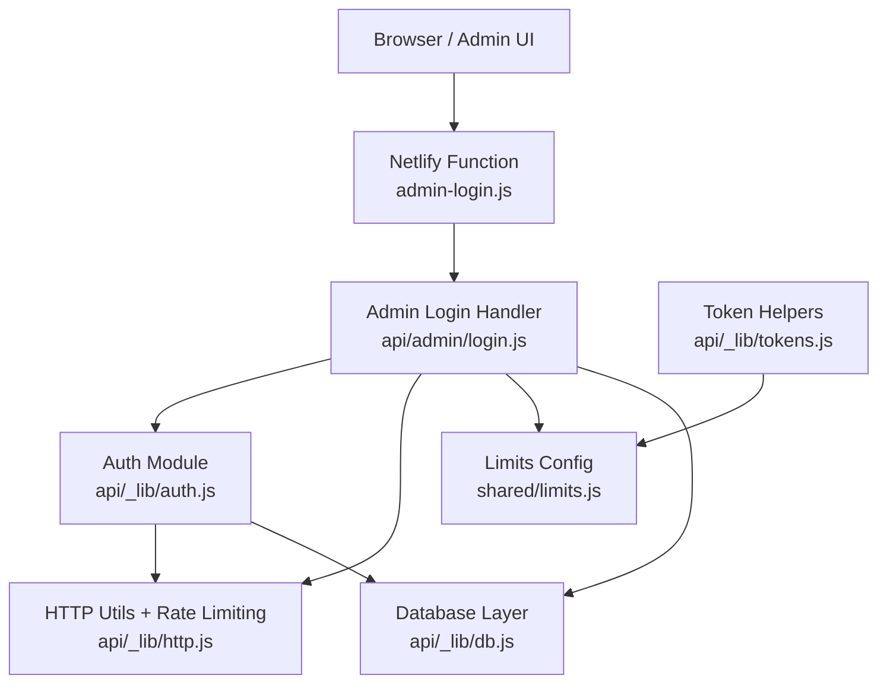
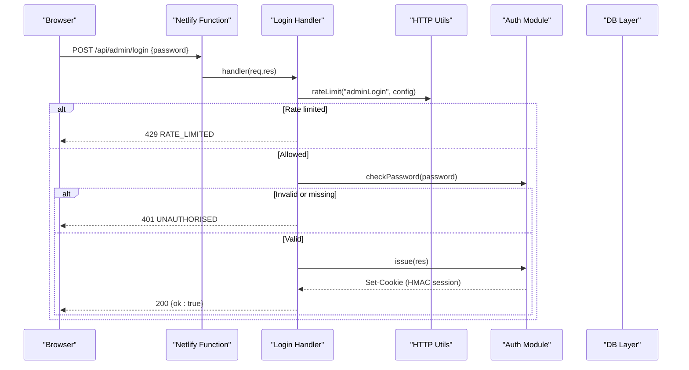
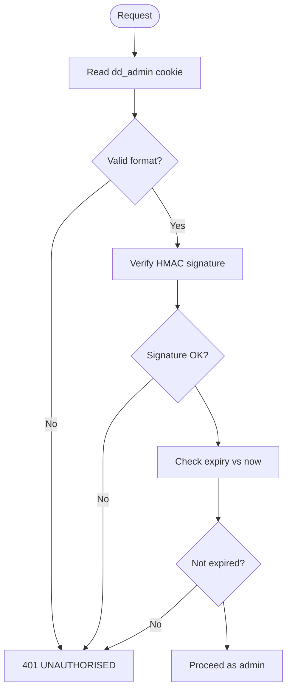
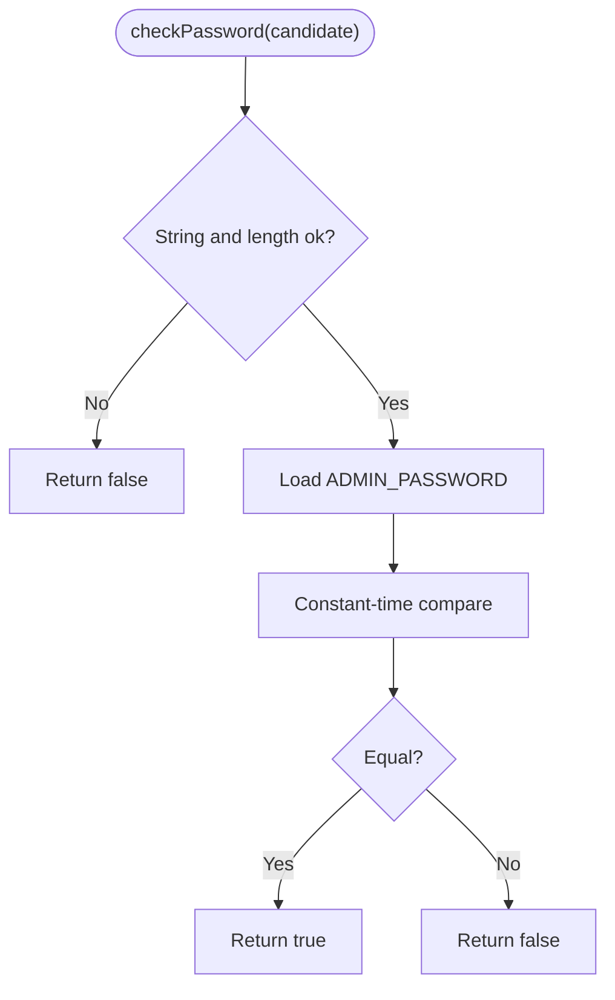
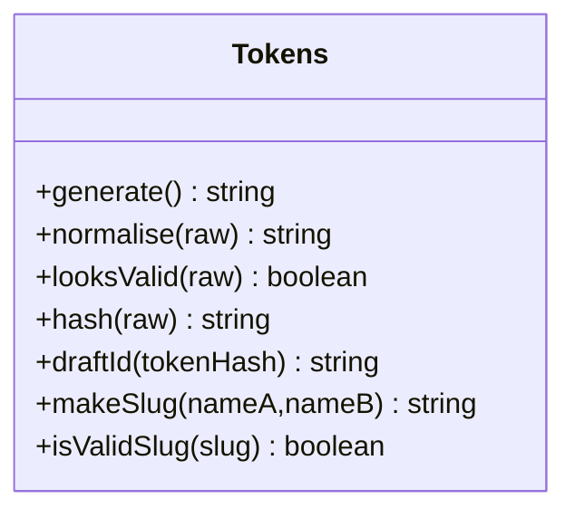
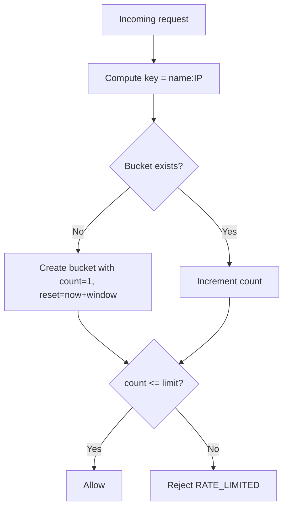
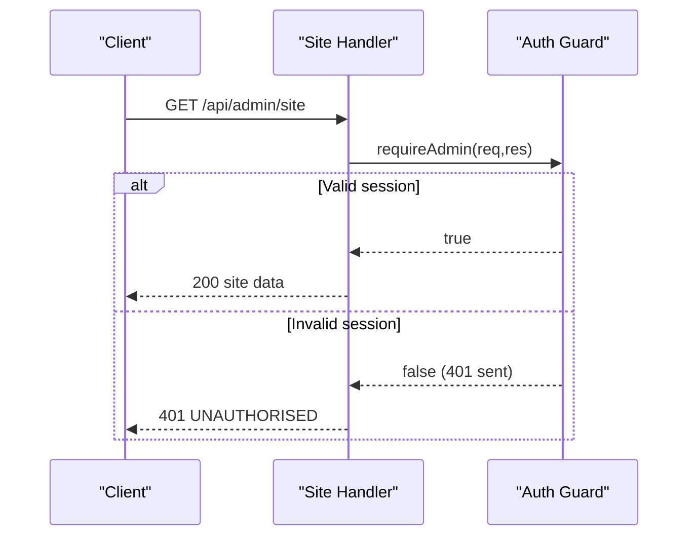
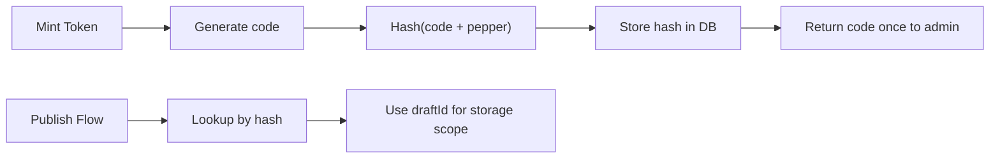
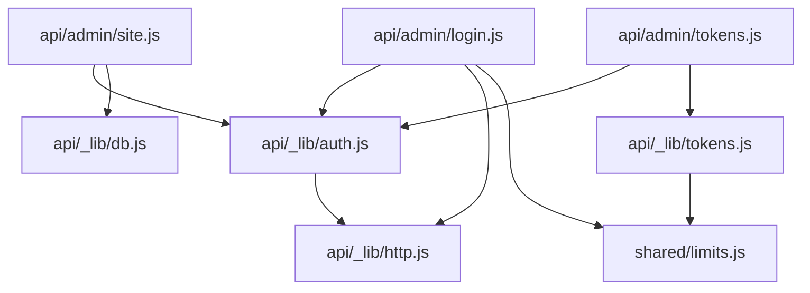

# Authentication & Security

<cite>
**Referenced Files in This Document**
- [auth.js](file://api/_lib/auth.js)
- [http.js](file://api/_lib/http.js)
- [tokens.js](file://api/_lib/tokens.js)
- [limits.js](file://shared/limits.js)
- [login.js](file://api/admin/login.js)
- [site.js](file://api/admin/site.js)
- [tokens_admin.js](file://api/admin/tokens.js)
- [db.js](file://api/_lib/db.js)
- [admin-login.js](file://netlify/functions/admin-login.js)
</cite>

## Table of Contents
1. Introduction
2. Project Structure
3. Core Components
4. Architecture Overview
5. Detailed Component Analysis
6. Dependency Analysis
7. Performance Considerations
8. Troubleshooting Guide
9. Conclusion

## Introduction
This document explains the authentication and security system for the admin portal and token-based workflows. It covers:
- HMAC-based session management with secure cookies
- Secure password validation
- Token generation, hashing, and validation
- Rate limiting strategies for login attempts
- Protection against common vulnerabilities (XSS, CSRF, timing attacks, brute force)
- Integration between authentication tokens and admin access control
- Session lifecycle and error handling patterns

## Project Structure
The authentication and security logic is implemented across a small set of focused modules:
- Admin session and cookie handling: api/_lib/auth.js
- HTTP utilities, rate limiting, and safe logging: api/_lib/http.js
- Token generation, normalization, hashing, and slug helpers: api/_lib/tokens.js
- Shared limits and rate limit configuration: shared/limits.js
- Admin endpoints that enforce auth: api/admin/login.js, api/admin/site.js, api/admin/tokens.js
- Database integration for tokens and sites: api/_lib/db.js
- Netlify function bridge to expose admin endpoints: netlify/functions/admin-login.js

**Diagram sources**
- [admin-login.js:1-7](file://netlify/functions/admin-login.js#L1-L7)
- [login.js:1-50](file://api/admin/login.js#L1-L50)
- [auth.js:1-124](file://api/_lib/auth.js#L1-L124)
- [http.js:1-198](file://api/_lib/http.js#L1-L198)
- [limits.js:1-84](file://shared/limits.js#L1-L84)
- [tokens.js:1-155](file://api/_lib/tokens.js#L1-L155)
- [db.js:1-265](file://api/_lib/db.js#L1-L265)

**Section sources**
- [admin-login.js:1-7](file://netlify/functions/admin-login.js#L1-L7)
- [login.js:1-50](file://api/admin/login.js#L1-L50)
- [auth.js:1-124](file://api/_lib/auth.js#L1-L124)
- [http.js:1-198](file://api/_lib/http.js#L1-L198)
- [limits.js:1-84](file://shared/limits.js#L1-L84)
- [tokens.js:1-155](file://api/_lib/tokens.js#L1-L155)
- [db.js:1-265](file://api/_lib/db.js#L1-L265)

## Core Components
- HMAC session cookie: A signed payload containing subject and expiry is stored in an HttpOnly, Secure, SameSite=Strict cookie scoped to /api. Verification uses constant-time comparison and enforces expiration.
- Password validation: The admin password is read from environment variables and compared using constant-time comparison; errors are generic and never leak details.
- Token system: Activation codes are generated with high entropy, normalized for user input, hashed with a pepper, and used to derive draft storage paths and public slugs safely.
- Rate limiting: In-memory per-instance rate limiter protects sensitive endpoints like admin login with strict budgets.
- Admin access control: All admin endpoints require a valid session via a guard that returns 401 on failure.

**Section sources**
- [auth.js:15-124](file://api/_lib/auth.js#L15-L124)
- [http.js:121-160](file://api/_lib/http.js#L121-L160)
- [tokens.js:14-155](file://api/_lib/tokens.js#L14-L155)
- [limits.js:67-73](file://shared/limits.js#L67-L73)
- [login.js:23-49](file://api/admin/login.js#L23-L49)
- [site.js:31-33](file://api/admin/site.js#L31-L33)
- [tokens_admin.js:42-44](file://api/admin/tokens.js#L42-L44)

## Architecture Overview
The admin authentication flow centers around a single password check and an HMAC-signed session cookie. Token flows use cryptographic hashing and environment-scoped secrets to ensure safety even if data stores are compromised.

**Diagram sources**
- [admin-login.js:1-7](file://netlify/functions/admin-login.js#L1-L7)
- [login.js:23-49](file://api/admin/login.js#L23-L49)
- [http.js:121-160](file://api/_lib/http.js#L121-L160)
- [auth.js:64-98](file://api/_lib/auth.js#L64-L98)

## Detailed Component Analysis

### HMAC-Based Session Management
- Cookie format: base64url(payload).base64url(hmac-sha256), where payload includes subject and numeric expiry timestamp.
- Signing and verification: Uses a secret from environment; verification checks signature with constant-time comparison and validates expiry and subject.
- Cookie attributes: HttpOnly, Secure, SameSite=Strict, Path=/api, Max-Age set to TTL.
- Lifecycle:
  - Issue: On successful login, a session cookie is set with TTL.
  - Verify: Each admin request reads the cookie, verifies signature and expiry.
  - Clear: Logout clears the cookie by setting empty value and zero Max-Age.

**Diagram sources**
- [auth.js:31-62](file://api/_lib/auth.js#L31-L62)
- [auth.js:76-98](file://api/_lib/auth.js#L76-L98)
- [auth.js:100-121](file://api/_lib/auth.js#L100-L121)

**Section sources**
- [auth.js:15-124](file://api/_lib/auth.js#L15-L124)

### Secure Password Validation
- Environment-backed password: ADMIN_PASSWORD must be present and sufficiently long; otherwise misconfiguration is logged.
- Comparison: Constant-time comparison prevents timing side-channels.
- Error behavior: Generic refusal message; no hints about whether the password was missing or incorrect.

**Diagram sources**
- [auth.js:64-74](file://api/_lib/auth.js#L64-L74)
- [http.js:153-160](file://api/_lib/http.js#L153-L160)

**Section sources**
- [auth.js:64-74](file://api/_lib/auth.js#L64-L74)
- [http.js:153-160](file://api/_lib/http.js#L153-L160)

### Token Generation and Validation
- Generation: High-entropy codes composed of groups from an unambiguous alphabet; prefixed and grouped for readability.
- Normalization: Case-insensitive, strips separators, corrects common confusions (I/l/1, O/0), ensures canonical form.
- Hashing: SHA-256(code + pepper) with pepper from environment; database stores only hashes.
- Draft scoping: Draft folder IDs derived from token hash with a separate label to prevent path traversal or cross-token access.
- Public slugs: Safe, non-secret identifiers built from names plus random suffix; validated by strict regex and length constraints.

**Diagram sources**
- [tokens.js:14-155](file://api/_lib/tokens.js#L14-L155)

**Section sources**
- [tokens.js:14-155](file://api/_lib/tokens.js#L14-L155)

### Rate Limiting Strategies
- Implementation: In-memory buckets keyed by name and IP; supports rolling windows and counts per window.
- Admin login protection: Strict budget configured in shared limits; applied before password comparison to mitigate brute-force.
- Cleanup: Periodic sweep removes expired buckets to bound memory usage.

**Diagram sources**
- [http.js:121-151](file://api/_lib/http.js#L121-L151)
- [limits.js:67-73](file://shared/limits.js#L67-L73)

**Section sources**
- [http.js:121-151](file://api/_lib/http.js#L121-L151)
- [limits.js:67-73](file://shared/limits.js#L67-L73)

### Admin Access Control Integration
- Guard: Every admin endpoint calls a guard that verifies the session cookie; unauthorized requests receive 401 with a generic message.
- Endpoints:
  - Login: Issues/clears session cookie after password check and rate limiting.
  - Site management: Requires admin session to list, update status, or rollback versions.
  - Token management: Requires admin session to list, mint, or revoke activation codes.

**Diagram sources**
- [site.js:31-33](file://api/admin/site.js#L31-L33)
- [auth.js:111-121](file://api/_lib/auth.js#L111-L121)

**Section sources**
- [site.js:31-33](file://api/admin/site.js#L31-L33)
- [auth.js:111-121](file://api/_lib/auth.js#L111-L121)
- [tokens_admin.js:42-44](file://api/admin/tokens.js#L42-L44)

### Data Flow and Storage
- Tokens: Only hashed values are stored; plain codes are returned once at creation time and never logged.
- Drafts: Paths derived from token hashes ensure isolation and stability across retries.
- Admin operations: Use database layer to list tokens/sites, insert tokens, revoke tokens, and manage site status and versions.

**Diagram sources**
- [tokens_admin.js:75-101](file://api/admin/tokens.js#L75-L101)
- [tokens.js:69-99](file://api/_lib/tokens.js#L69-L99)
- [db.js:173-197](file://api/_lib/db.js#L173-L197)

**Section sources**
- [tokens_admin.js:75-101](file://api/admin/tokens.js#L75-L101)
- [tokens.js:69-99](file://api/_lib/tokens.js#L69-L99)
- [db.js:173-197](file://api/_lib/db.js#L173-L197)

## Dependency Analysis
- Login depends on:
  - HTTP utilities for method enforcement, JSON parsing, rate limiting, and standardized responses.
  - Auth module for password checking and session cookie issuance.
  - Limits configuration for rate limit budgets.
- Auth depends on:
  - HTTP utilities for constant-time comparison and logging.
- Tokens depend on:
  - Shared limits for group sizes and lengths.
  - Environment variables for pepper.
- Admin endpoints depend on:
  - Auth guard for authorization.
  - DB layer for persistence.

**Diagram sources**
- [login.js:19-22](file://api/admin/login.js#L19-L22)
- [site.js:18-21](file://api/admin/site.js#L18-L21)
- [tokens_admin.js:21-24](file://api/admin/tokens.js#L21-L24)
- [auth.js:15-17](file://api/_lib/auth.js#L15-L17)
- [tokens.js:14-16](file://api/_lib/tokens.js#L14-L16)

**Section sources**
- [login.js:19-22](file://api/admin/login.js#L19-L22)
- [site.js:18-21](file://api/admin/site.js#L18-L21)
- [tokens_admin.js:21-24](file://api/admin/tokens.js#L21-L24)
- [auth.js:15-17](file://api/_lib/auth.js#L15-L17)
- [tokens.js:14-16](file://api/_lib/tokens.js#L14-L16)

## Performance Considerations
- Rate limiting is in-memory per instance; suitable for mitigating casual brute force but not a distributed guarantee.
- Cookie verification is lightweight: base64 decoding, HMAC computation, and constant-time comparison.
- Token hashing uses efficient SHA-256; draft ID derivation adds minimal overhead.
- Avoid logging sensitive data; redaction is enforced for all logs to reduce risk and noise.

[No sources needed since this section provides general guidance]

## Troubleshooting Guide
Common issues and resolutions:
- Missing environment variables:
  - ADMIN_SESSION_SECRET required for signing sessions; absence triggers upstream error.
  - TOKEN_PEPPER required for hashing tokens; absence triggers upstream error.
- Misconfigured admin password:
  - If ADMIN_PASSWORD is missing or too short, login will fail; logs indicate misconfiguration without exposing details.
- Rate limiting:
  - Excessive login attempts return 429; wait for the window to reset.
- Unauthorized access:
  - Any admin endpoint without a valid session returns 401; ensure you have successfully logged in and the cookie is present.

**Section sources**
- [auth.js:21-29](file://api/_lib/auth.js#L21-L29)
- [auth.js:64-74](file://api/_lib/auth.js#L64-L74)
- [http.js:56-79](file://api/_lib/http.js#L56-L79)
- [tokens.js:69-83](file://api/_lib/tokens.js#L69-L83)

## Conclusion
The system implements a robust, minimal authentication model:
- HMAC-signed, HttpOnly, Secure, SameSite=Strict session cookies protect admin access.
- Password validation avoids timing leaks and information disclosure.
- Token generation and hashing ensure safe, scalable identification and scoping.
- Rate limiting defends against brute-force attempts.
- Admin endpoints consistently enforce session checks and provide clear, safe error responses.

[No sources needed since this section summarizes without analyzing specific files]