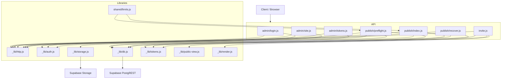
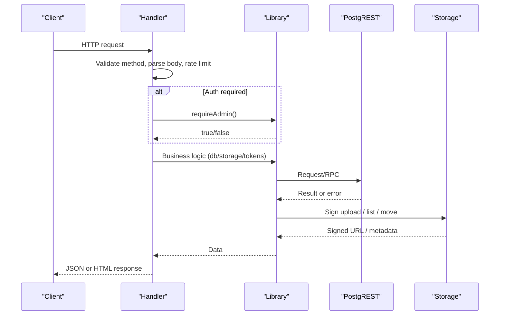
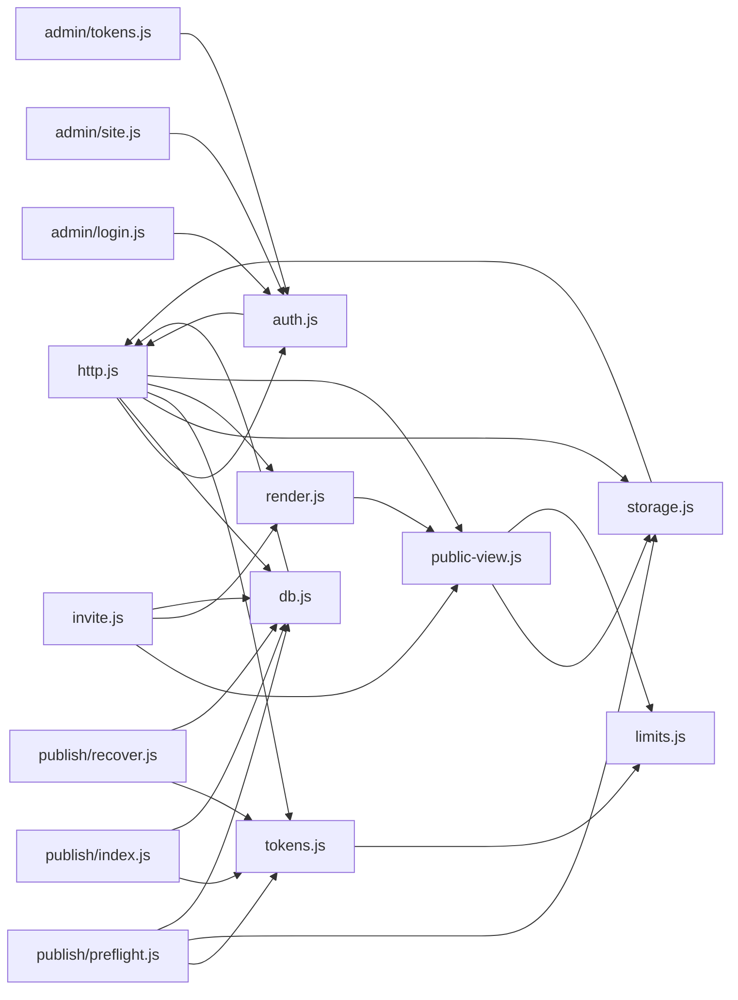

# Backend Services & APIs

<cite>
**Referenced Files in This Document**
- [api/_lib/http.js](file://api/_lib/http.js)
- [api/_lib/auth.js](file://api/_lib/auth.js)
- [api/_lib/db.js](file://api/_lib/db.js)
- [api/_lib/storage.js](file://api/_lib/storage.js)
- [api/_lib/tokens.js](file://api/_lib/tokens.js)
- [api/_lib/public-view.js](file://api/_lib/public-view.js)
- [api/_lib/render.js](file://api/_lib/render.js)
- [shared/limits.js](file://shared/limits.js)
- [api/admin/login.js](file://api/admin/login.js)
- [api/admin/site.js](file://api/admin/site.js)
- [api/admin/tokens.js](file://api/admin/tokens.js)
- [api/publish/index.js](file://api/publish/index.js)
- [api/publish/preflight.js](file://api/publish/preflight.js)
- [api/publish/recover.js](file://api/publish/recover.js)
- [api/invite.js](file://api/invite.js)
</cite>

## Table of Contents
1. Introduction
2. Project Structure
3. Core Components
4. Architecture Overview
5. Detailed Component Analysis
6. Dependency Analysis
7. Performance Considerations
8. Troubleshooting Guide
9. Conclusion

## Introduction
This document provides comprehensive API documentation for the backend services and serverless functions that power wedding invitation publishing, admin management, token handling, storage operations, and public invitation rendering. It covers REST endpoints, authentication, database interactions, storage flows, error handling, rate limiting, security considerations, and operational guidance. There are no WebSocket APIs in this codebase; all interactions are HTTP-based.

## Project Structure
The system is organized around a small set of shared libraries under api/_lib and feature-specific handlers:
- Authentication and session cookies
- Database access via Supabase PostgREST
- Storage access via Supabase Storage with signed upload URLs
- Token generation, normalization, hashing, and slug creation
- Public view shaping and HTML rendering for invitations
- Admin endpoints for login, site management, and token lifecycle
- Publishing pipeline: preflight (upload planning), publish (token consumption), recover (link retrieval)
- Public invitation endpoint with CDN-friendly caching

**Diagram sources**
- [api/admin/login.js:1-50](file://api/admin/login.js#L1-L50)
- [api/admin/site.js:1-112](file://api/admin/site.js#L1-L112)
- [api/admin/tokens.js:1-103](file://api/admin/tokens.js#L1-L103)
- [api/publish/preflight.js:1-136](file://api/publish/preflight.js#L1-L136)
- [api/publish/index.js:1-135](file://api/publish/index.js#L1-L135)
- [api/publish/recover.js:1-54](file://api/publish/recover.js#L1-L54)
- [api/invite.js:1-115](file://api/invite.js#L1-L115)
- [api/_lib/http.js:1-198](file://api/_lib/http.js#L1-L198)
- [api/_lib/auth.js:1-124](file://api/_lib/auth.js#L1-L124)
- [api/_lib/db.js:1-265](file://api/_lib/db.js#L1-L265)
- [api/_lib/storage.js:1-183](file://api/_lib/storage.js#L1-L183)
- [api/_lib/tokens.js:1-155](file://api/_lib/tokens.js#L1-L155)
- [api/_lib/public-view.js:1-335](file://api/_lib/public-view.js#L1-L335)
- [api/_lib/render.js:1-290](file://api/_lib/render.js#L1-L290)
- [shared/limits.js:1-84](file://shared/limits.js#L1-L84)

**Section sources**
- [api/_lib/http.js:1-198](file://api/_lib/http.js#L1-L198)
- [api/_lib/auth.js:1-124](file://api/_lib/auth.js#L1-L124)
- [api/_lib/db.js:1-265](file://api/_lib/db.js#L1-L265)
- [api/_lib/storage.js:1-183](file://api/_lib/storage.js#L1-L183)
- [api/_lib/tokens.js:1-155](file://api/_lib/tokens.js#L1-L155)
- [api/_lib/public-view.js:1-335](file://api/_lib/public-view.js#L1-L335)
- [api/_lib/render.js:1-290](file://api/_lib/render.js#L1-L290)
- [shared/limits.js:1-84](file://shared/limits.js#L1-L84)

## Core Components
- Authentication: HMAC-signed cookie-based admin sessions with HttpOnly, Secure, SameSite=Strict cookies scoped to /api.
- Database: Centralized module using fetch against Supabase PostgREST with timeouts, error mapping, and RPC wrappers for transactional writes.
- Storage: Signed upload URLs for direct client-to-storage uploads; safe path validation; public URL generation; move/remove/list/backups.
- Tokens: Generation, normalization, hashing with pepper, draft folder derivation, and public slug creation with collision handling.
- Public View: Strict allow-listed transformation of stored content into safe, template-aware public shapes.
- Rendering: Template HTML fetched from deployment, head injection for SEO/social, inline JSON payload, asset path absolutization.
- Limits: Shared configuration for media caps, rate limits, TTLs, and page budgets used by both client and server.

**Section sources**
- [api/_lib/auth.js:1-124](file://api/_lib/auth.js#L1-L124)
- [api/_lib/db.js:1-265](file://api/_lib/db.js#L1-L265)
- [api/_lib/storage.js:1-183](file://api/_lib/storage.js#L1-L183)
- [api/_lib/tokens.js:1-155](file://api/_lib/tokens.js#L1-L155)
- [api/_lib/public-view.js:1-335](file://api/_lib/public-view.js#L1-L335)
- [api/_lib/render.js:1-290](file://api/_lib/render.js#L1-L290)
- [shared/limits.js:1-84](file://shared/limits.js#L1-L84)

## Architecture Overview
The system separates concerns into thin handlers and robust libraries:
- Handlers enforce method restrictions, parse bodies, apply rate limits, authenticate where needed, and delegate to libraries.
- Libraries encapsulate cross-cutting concerns: auth, db, storage, tokens, public shaping, rendering, and shared limits.
- External systems: Supabase PostgREST for data, Supabase Storage for media, and CDN caching for public pages.

**Diagram sources**
- [api/_lib/http.js:1-198](file://api/_lib/http.js#L1-L198)
- [api/_lib/auth.js:1-124](file://api/_lib/auth.js#L1-L124)
- [api/_lib/db.js:1-265](file://api/_lib/db.js#L1-L265)
- [api/_lib/storage.js:1-183](file://api/_lib/storage.js#L1-L183)

## Detailed Component Analysis

### Authentication (Admin Session)
- Purpose: Secure admin access via password check and signed cookie issuance/clearing.
- Key behaviors:
  - Password compared server-side; never logged or returned.
  - Cookie is HttpOnly, Secure, SameSite=Strict, Path=/api, with TTL.
  - requireAdmin guard returns 401 with standardized error shape when unauthenticated.

Endpoints
- POST /api/admin/login
  - Auth: None
  - Body: { password } or { action: "logout" }
  - Response: { ok: true } on success; 401 if invalid
  - Rate limited: adminLogin
  - Notes: Logout clears session even if expired

Security
- Uses constant-time comparison for secrets.
- No sensitive values in logs.

**Section sources**
- [api/admin/login.js:1-50](file://api/admin/login.js#L1-L50)
- [api/_lib/auth.js:1-124](file://api/_lib/auth.js#L1-L124)
- [api/_lib/http.js:1-198](file://api/_lib/http.js#L1-L198)
- [shared/limits.js:1-84](file://shared/limits.js#L1-L84)

### Admin Site Management
- Purpose: List sites, get details with versions, change status, rollback to a version.
- Auth: Admin session required.
- Endpoints:
  - GET /api/admin/site
    - Query: ?id=<siteId>
    - Response: List of sites or single site with versions and url
  - POST /api/admin/site
    - Body: { action: "status", id, status } | { action: "rollback", id, versionId }
    - Response: { ok: true, ... }

Validation
- Id fields validated to a strict pattern.
- Status restricted to allowed values.

**Section sources**
- [api/admin/site.js:1-112](file://api/admin/site.js#L1-L112)
- [api/_lib/db.js:1-265](file://api/_lib/db.js#L1-L265)
- [api/_lib/http.js:1-198](file://api/_lib/http.js#L1-L198)

### Admin Tokens
- Purpose: Mint activation codes, list tokens, revoke unused tokens.
- Auth: Admin session required.
- Endpoints:
  - GET /api/admin/tokens
    - Response: { ok: true, tokens: [...] }
  - POST /api/admin/tokens
    - Body: { label, template, notes, count } or { action: "revoke", id }
    - Response: { ok: true, minted: [...] } or { ok: true, revoked: n }

Security
- Plain text code only appears once in the mint response; not stored or logged.
- Revocation only affects issued tokens.

**Section sources**
- [api/admin/tokens.js:1-103](file://api/admin/tokens.js#L1-L103)
- [api/_lib/tokens.js:1-155](file://api/_lib/tokens.js#L1-L155)
- [api/_lib/db.js:1-265](file://api/_lib/db.js#L1-L265)
- [api/_lib/http.js:1-198](file://api/_lib/http.js#L1-L198)

### Publishing Pipeline
Preflight
- Purpose: Validate token and files; return upload permissions and skip list.
- Auth: None
- Endpoint: POST /api/publish/preflight
  - Body: { token, template, files: [{ sha256, bytes, type, w, h, variant }] }
  - Response: { ok: true, uploads: [...], skip: [...], limits: {...} }
  - Behavior:
    - Validates token shape and existence/status/template match
    - Derives per-token draft folder path securely
    - Lists existing files to avoid re-uploads
    - Signs one-time upload URLs valid for a short TTL

Publish
- Purpose: Consume token and create website atomically; generate public slug and link.
- Auth: None
- Endpoint: POST /api/publish
  - Body: { token, idempotencyKey, template, content, media, weddingDate }
  - Response: { ok: true, slug, url }
  - Behavior:
    - Validates content, media references, and date
    - Derives media paths from token hash (never trust client paths)
    - Attempts slug generation with retry on collision
    - Calls transactional DB RPC to consume token and create site

Recover
- Purpose: Retrieve published link for a token that already succeeded but did not return the URL.
- Auth: None
- Endpoint: POST /api/publish/recover
  - Body: { token }
  - Response: { ok: true, slug, url } or 404

Rate Limiting
- All three endpoints are rate-limited per IP with distinct windows and quotas.

Error Handling
- Distinguishes unknown token, revoked, wrong template, consumed, and slug exhaustion cases with user-friendly messages.

**Section sources**
- [api/publish/preflight.js:1-136](file://api/publish/preflight.js#L1-L136)
- [api/publish/index.js:1-135](file://api/publish/index.js#L1-L135)
- [api/publish/recover.js:1-54](file://api/publish/recover.js#L1-L54)
- [api/_lib/tokens.js:1-155](file://api/_lib/tokens.js#L1-L155)
- [api/_lib/db.js:1-265](file://api/_lib/db.js#L1-L265)
- [api/_lib/storage.js:1-183](file://api/_lib/storage.js#L1-L183)
- [api/_lib/http.js:1-198](file://api/_lib/http.js#L1-L198)
- [shared/limits.js:1-84](file://shared/limits.js#L1-L84)

### Public Invitation
- Purpose: Render a guest-facing invitation page with strong caching and safety guarantees.
- Endpoint: GET /invite/{slug} (rewritten to /api/invite?slug=...)
  - Auth: None
  - Response: HTML with meta tags, inline JSON payload, and asset links
  - Caching:
    - Cache-Control: public, s-maxage=60, stale-while-revalidate=86400 for live invites
    - Short cache for miss/error pages to prevent scanning amplification
  - Behavior:
    - Validates slug shape before DB lookup
    - Fetches site row (only live sites)
    - Builds public view via allow-listed transformation
    - Loads template HTML from deployment and injects head and inline data
    - Sets robots tag to discourage indexing

Performance
- Template HTML cached per warm instance to reduce cold start overhead.
- Preconnect hints to storage origin.

**Section sources**
- [api/invite.js:1-115](file://api/invite.js#L1-L115)
- [api/_lib/public-view.js:1-335](file://api/_lib/public-view.js#L1-L335)
- [api/_lib/render.js:1-290](file://api/_lib/render.js#L1-L290)
- [api/_lib/db.js:1-265](file://api/_lib/db.js#L1-L265)

### Storage Operations
- Purpose: Provide secure, path-scoped upload permissions and manage media assets.
- Key capabilities:
  - signUpload(path): Returns a one-time signed URL to write to exactly one path; path validated strictly
  - publicUrl(path): Generates public CDN URL for media
  - move(fromPath, toPath): Promotes draft to final location after successful publish
  - remove(paths): Deletes prefixes
  - list(prefix, options): Lists objects in a prefix for deduplication and cleanup
  - putJson/listBackups/removeBackups: Backup bucket utilities

Security
- Paths validated against a strict regex to prevent traversal or extension injection.
- Service keys never exposed to clients; only short-lived signed URLs are issued.

**Section sources**
- [api/_lib/storage.js:1-183](file://api/_lib/storage.js#L1-L183)

### Database Operations
- Purpose: Single point of contact with Supabase PostgREST and RPCs.
- Capabilities:
  - Reads: getSiteBySlug, getSiteById, slugExists, findToken
  - Writes: publishSite, updateSite, rollbackSite, insertToken, revokeToken, setSiteStatus
  - Admin queries: listTokens, listSites, listVersions
  - Housekeeping: ping, pruneVersions, exportAllSites, staleIssuedTokens
- Error handling:
  - Timeouts enforced per request
  - Upstream errors normalized to generic codes with logging
  - RPC sentinel codes surfaced to callers for precise error handling

**Section sources**
- [api/_lib/db.js:1-265](file://api/_lib/db.js#L1-L265)

### Token Utilities
- Purpose: Generate, normalize, hash, and derive identifiers for activation codes and slugs.
- Features:
  - generate(): Creates high-entropy codes with an unambiguous alphabet
  - normalise(raw): Robust normalization tolerant of common typos
  - hash(code): SHA-256 with environment pepper
  - draftId(tokenHash): Deterministic, isolated draft folder name
  - makeSlug(nameA, nameB): Human-friendly, safe slug with random suffix
  - isValidSlug(slug): Fast rejection of malformed slugs

**Section sources**
- [api/_lib/tokens.js:1-155](file://api/_lib/tokens.js#L1-L155)
- [shared/limits.js:1-84](file://shared/limits.js#L1-L84)

### Public View Shaping
- Purpose: Transform stored content into a safe, template-aware public object.
- Guarantees:
  - Allow-listed schema per template
  - Type validation for text, bool, number, color, URL, media references
  - Media references resolved to responsive sizes and public URLs
  - Private fields never included

**Section sources**
- [api/_lib/public-view.js:1-335](file://api/_lib/public-view.js#L1-L335)
- [api/_lib/storage.js:1-183](file://api/_lib/storage.js#L1-L183)

### Rendering Engine
- Purpose: Assemble final HTML for guests by injecting meta tags, inline JSON, and absolute asset paths into template HTML.
- Highlights:
  - Strips demo meta tags and replaces with real couple data
  - Escapes JSON safely for script injection
  - Absolutizes relative assets to work under /invite/{slug}
  - Provides not-found and maintenance pages

**Section sources**
- [api/_lib/render.js:1-290](file://api/_lib/render.js#L1-L290)
- [api/_lib/public-view.js:1-335](file://api/_lib/public-view.js#L1-L335)

## Dependency Analysis

**Diagram sources**
- [api/_lib/http.js:1-198](file://api/_lib/http.js#L1-L198)
- [api/_lib/auth.js:1-124](file://api/_lib/auth.js#L1-L124)
- [api/_lib/db.js:1-265](file://api/_lib/db.js#L1-L265)
- [api/_lib/storage.js:1-183](file://api/_lib/storage.js#L1-L183)
- [api/_lib/tokens.js:1-155](file://api/_lib/tokens.js#L1-L155)
- [api/_lib/public-view.js:1-335](file://api/_lib/public-view.js#L1-L335)
- [api/_lib/render.js:1-290](file://api/_lib/render.js#L1-L290)
- [shared/limits.js:1-84](file://shared/limits.js#L1-L84)
- [api/admin/login.js:1-50](file://api/admin/login.js#L1-L50)
- [api/admin/site.js:1-112](file://api/admin/site.js#L1-L112)
- [api/admin/tokens.js:1-103](file://api/admin/tokens.js#L1-L103)
- [api/publish/preflight.js:1-136](file://api/publish/preflight.js#L1-L136)
- [api/publish/index.js:1-135](file://api/publish/index.js#L1-L135)
- [api/publish/recover.js:1-54](file://api/publish/recover.js#L1-L54)
- [api/invite.js:1-115](file://api/invite.js#L1-L115)

**Section sources**
- [api/_lib/http.js:1-198](file://api/_lib/http.js#L1-L198)
- [api/_lib/auth.js:1-124](file://api/_lib/auth.js#L1-L124)
- [api/_lib/db.js:1-265](file://api/_lib/db.js#L1-L265)
- [api/_lib/storage.js:1-183](file://api/_lib/storage.js#L1-L183)
- [api/_lib/tokens.js:1-155](file://api/_lib/tokens.js#L1-L155)
- [api/_lib/public-view.js:1-335](file://api/_lib/public-view.js#L1-L335)
- [api/_lib/render.js:1-290](file://api/_lib/render.js#L1-L290)
- [shared/limits.js:1-84](file://shared/limits.js#L1-L84)

## Performance Considerations
- CDN caching for public invitations reduces database load during peak viewing.
- Template HTML cached per instance to minimize cold starts.
- Direct client-to-storage uploads bypass function size and duration limits.
- Signed upload URLs are short-lived and path-scoped to avoid large payloads through functions.
- Database requests have timeouts to prevent hanging functions.
- Image widths and quality tuned to balance quality and egress costs.

[No sources needed since this section provides general guidance]

## Troubleshooting Guide
Common error responses and meanings:
- BAD_REQUEST: Invalid method or malformed input
- TOKEN_INVALID: Unknown or malformed activation code
- TOKEN_USED: Code already consumed
- TOKEN_REVOKED: Code withdrawn
- TOKEN_WRONG_TEMPLATE: Code does not match requested template
- TOO_LARGE: Payload exceeds configured limits
- RATE_LIMITED: Too many attempts within window
- UNAUTHORISED: Missing or invalid admin session
- NOT_FOUND: Resource not found
- UPSTREAM: Temporary service unavailability (retryable)
- SERVER: Unexpected internal failure (retryable)

Debugging tips:
- Use handler-wrapped functions to capture metrics and redacted logs
- Check rate limiter buckets and windows in shared limits
- Inspect storage listing results during preflight to confirm reuse behavior
- Verify template loading and head injection during invite rendering

**Section sources**
- [api/_lib/http.js:1-198](file://api/_lib/http.js#L1-L198)
- [shared/limits.js:1-84](file://shared/limits.js#L1-L84)
- [api/publish/preflight.js:1-136](file://api/publish/preflight.js#L1-L136)
- [api/invite.js:1-115](file://api/invite.js#L1-L115)

## Conclusion
This system provides a secure, efficient, and user-friendly workflow for creating and sharing wedding invitations. It enforces strong security boundaries around tokens and storage, uses robust error handling and rate limiting, and optimizes performance through CDN caching and direct uploads. The modular design keeps responsibilities clear and makes future changes safer and easier.

[No sources needed since this section summarizes without analyzing specific files]