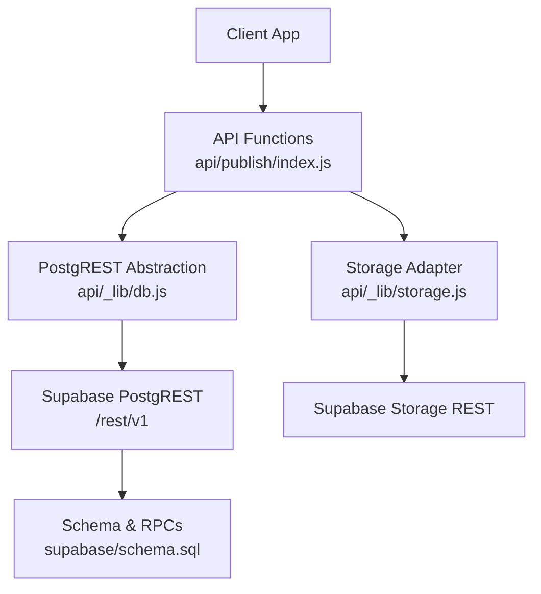
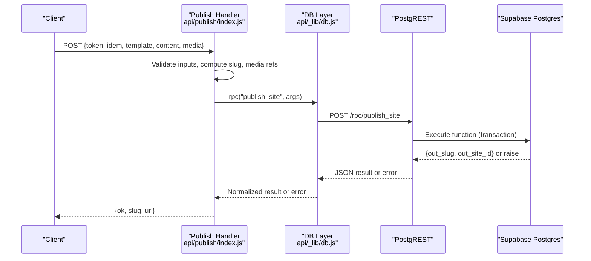
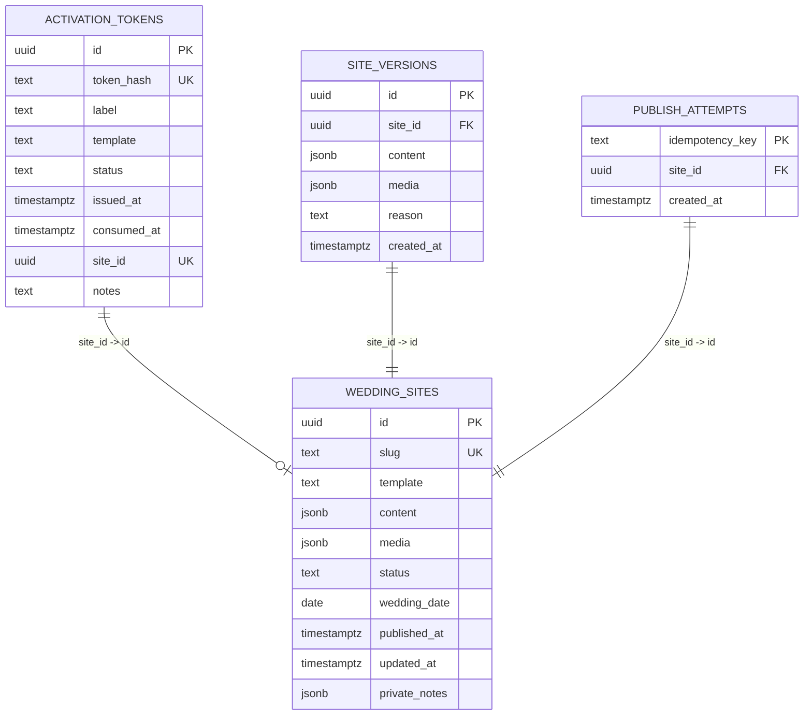
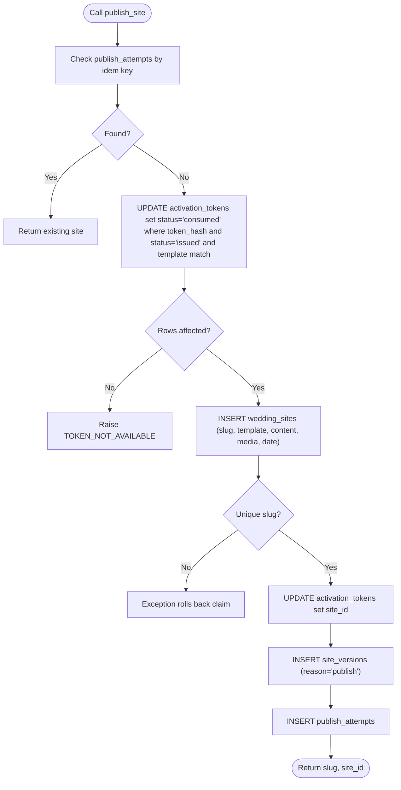
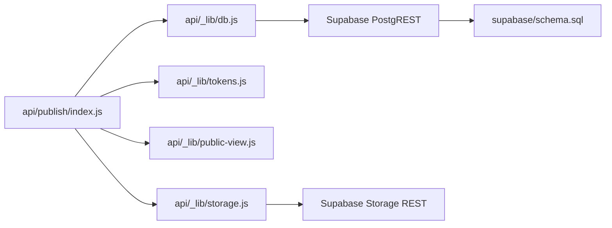

# Database Operations

<cite>
**Referenced Files in This Document**
- [schema.sql](file://supabase/schema.sql)
- [db.js](file://api/_lib/db.js)
- [tokens.js](file://api/_lib/tokens.js)
- [public-view.js](file://api/_lib/public-view.js)
- [storage.js](file://api/_lib/storage.js)
- [publish/index.js](file://api/publish/index.js)
- [admin/tokens.js](file://api/admin/tokens.js)
- [limits.js](file://shared/limits.js)
- [README.md](file://supabase/README.md)
</cite>

## Table of Contents
1. [Introduction](#introduction)
2. [Project Structure](#project-structure)
3. [Core Components](#core-components)
4. [Architecture Overview](#architecture-overview)
5. [Detailed Component Analysis](#detailed-component-analysis)
6. [Dependency Analysis](#dependency-analysis)
7. [Performance Considerations](#performance-considerations)
8. [Troubleshooting Guide](#troubleshooting-guide)
9. [Backup and Recovery Procedures](#backup-and-recovery-procedures)
10. [Data Migration Strategies](#data-migration-strategies)
11. [Security Measures for Database Access](#security-measures-for-database-access)
12. [Conclusion](#conclusion)

## Introduction
This document explains the database layer and Supabase integration used to power token-gated wedding website publishing. It covers the PostgREST abstraction, transactional token consumption, schema design, entity relationships, validation rules, common operations, error handling, performance considerations, backup and recovery, migration strategies, and security controls.

## Project Structure
The database layer is implemented as a thin HTTP client over PostgREST with server-side functions (RPCs) enforcing business logic and transactions. The API surface lives under api/_lib and api/*, while the database schema and stored procedures live under supabase/schema.sql.

**Diagram sources**
- [publish/index.js:30-135](file://api/publish/index.js#L30-L135)
- [db.js:34-94](file://api/_lib/db.js#L34-L94)
- [schema.sql:147-208](file://supabase/schema.sql#L147-L208)
- [storage.js:40-117](file://api/_lib/storage.js#L40-L117)

**Section sources**
- [schema.sql:1-134](file://supabase/schema.sql#L1-L134)
- [db.js:1-15](file://api/_lib/db.js#L1-L15)
- [storage.js:1-13](file://api/_lib/storage.js#L1-L13)

## Core Components
- PostgREST abstraction: Centralized HTTP client that calls PostgREST endpoints and RPCs with timeouts, authentication, and error normalization.
- Token utilities: Generate, normalize, hash activation tokens; derive draft storage paths; build public slugs safely.
- Public view formatter: Strict allow-listed projection from database rows to safe public responses.
- Storage adapter: Signed uploads, public URLs, move/remove/list, and backup helpers.
- Publish flow: Orchestrates token validation, idempotency, media references, slug generation, and calls the transactional publish RPC.
- Admin token management: Minting, listing, revoking tokens with strict input validation and secure responses.

**Section sources**
- [db.js:34-94](file://api/_lib/db.js#L34-L94)
- [tokens.js:26-99](file://api/_lib/tokens.js#L26-L99)
- [public-view.js:39-169](file://api/_lib/public-view.js#L39-L169)
- [storage.js:83-163](file://api/_lib/storage.js#L83-L163)
- [publish/index.js:30-135](file://api/publish/index.js#L30-L135)
- [admin/tokens.js:42-101](file://api/admin/tokens.js#L42-L101)

## Architecture Overview
The system uses Postgres Row Level Security with no policies, so only service-role authenticated requests can access data. All writes go through Postgres functions to ensure atomicity and consistency. Reads are filtered by a strict public view to prevent leaks.

**Diagram sources**
- [publish/index.js:30-135](file://api/publish/index.js#L30-L135)
- [db.js:90-94](file://api/_lib/db.js#L90-L94)
- [schema.sql:147-208](file://supabase/schema.sql#L147-L208)

## Detailed Component Analysis

### Database Schema and Relationships
- Tables:
  - wedding_sites: published invitation metadata and content/media references.
  - activation_tokens: hashed activation codes with lifecycle status and optional site link.
  - site_versions: version history for rollback and audit.
  - publish_attempts: idempotency guard against duplicate publishes.
- Constraints and indexes:
  - Unique slugs, unique token hashes, status checks, size constraints on JSONB fields.
  - Indexes on slug, status, token_hash, site_id, and version ordering.
- Row Level Security: Enabled on all tables; revoke access to anon/authenticated roles.

**Diagram sources**
- [schema.sql:28-120](file://supabase/schema.sql#L28-L120)

**Section sources**
- [schema.sql:28-134](file://supabase/schema.sql#L28-L134)

### Transactional Token Consumption and Publishing
- Function publish_site performs an atomic sequence:
  - Idempotency check via publish_attempts.
  - Claim token by updating status from 'issued' to 'consumed' with matching template.
  - Insert wedding_sites row; handle unique slug collisions.
  - Link token to site and record version and attempt.
- Concurrency safety: The UPDATE WHERE clause acts as a lock; only one consumer succeeds.
- Error signaling: Custom exceptions TOKEN_NOT_AVAILABLE and SLUG_TAKEN propagate to callers.

**Diagram sources**
- [schema.sql:147-208](file://supabase/schema.sql#L147-L208)

**Section sources**
- [schema.sql:147-208](file://supabase/schema.sql#L147-L208)
- [publish/index.js:66-96](file://api/publish/index.js#L66-L96)

### Query Optimization Strategies
- Selective column projection in reads to avoid loading sensitive or large fields.
- Unique index on slug for fast lookups; status indexes for filtering.
- Version table indexed by site_id and created_at desc for efficient rollbacks and listing.
- Size constraints on JSONB columns to prevent oversized payloads.
- Use of RPCs for complex multi-step writes to keep logic in the database.

**Section sources**
- [schema.sql:60-109](file://supabase/schema.sql#L60-L109)
- [db.js:102-123](file://api/_lib/db.js#L102-L123)

### Data Validation Rules
- Tokens:
  - Generated with fixed entropy and grouped format; normalized to canonical form.
  - Stored as sha256(token + pepper); plain token never persisted.
- Slugs:
  - Built from names plus random suffix; validated length and character set.
- Content:
  - Public view enforces allow-list per template; text clamped, colors hex-checked, URLs https-only, media references restricted to internal markers or bundled assets.
- Media:
  - Paths derived from token hash; upload permissions scoped to single path and time-limited.

**Section sources**
- [tokens.js:26-99](file://api/_lib/tokens.js#L26-L99)
- [public-view.js:39-169](file://api/_lib/public-view.js#L39-L169)
- [storage.js:83-117](file://api/_lib/storage.js#L83-L117)

### Common Database Operations
- Read a published site by slug:
  - Endpoint: GET /wedding_sites?slug=eq.<slug>&status=eq.live&select=id,slug,template,content,media,wedding_date,updated_at&limit=1
  - Implementation: db.getSiteBySlug
- Preflight token lookup without consuming:
  - Endpoint: GET /activation_tokens?token_hash=eq.<hash>&select=id,status,template,site_id&limit=1
  - Implementation: db.findToken
- Publish site (transactional):
  - RPC: publish_site(p_token_hash, p_idem, p_template, p_slug, p_content, p_media, p_wedding_date)
  - Implementation: db.publishSite
- Find site by consumed token:
  - RPC: find_site_by_token(p_token_hash)
  - Implementation: db.findSiteByToken
- Update site with version snapshot:
  - RPC: update_site(p_site_id, p_content, p_media, p_wedding_date)
  - Implementation: db.updateSite
- Rollback to previous version:
  - RPC: rollback_site(p_site_id, p_version_id)
  - Implementation: db.rollbackSite
- Admin token management:
  - List tokens: GET /activation_tokens?select=id,label,template,status,issued_at,consumed_at,site_id&order=issued_at.desc&limit=N
  - Revoke token: PATCH /activation_tokens?id=eq.<id>&status=eq.issued with body {status:"revoked"}
  - Insert token: POST /activation_tokens with Prefer:return=representation

**Section sources**
- [db.js:102-219](file://api/_lib/db.js#L102-L219)
- [schema.sql:216-310](file://supabase/schema.sql#L216-L310)
- [admin/tokens.js:42-101](file://api/admin/tokens.js#L42-L101)

### Error Handling Patterns
- Upstream errors: Network/DNS/timeouts mapped to generic UPSTREAM with logging.
- Business errors: RPCs raise sentinel messages like TOKEN_NOT_AVAILABLE, SLUG_TAKEN; these are surfaced verbatim to callers.
- Admin auth failures: 401 with UNAUTHORISED when session invalid.
- Input validation: BAD_REQUEST for malformed inputs; rate limiting enforced before DB calls.

**Section sources**
- [db.js:34-84](file://api/_lib/db.js#L34-L84)
- [auth.js:111-121](file://api/_lib/auth.js#L111-L121)
- [publish/index.js:87-135](file://api/publish/index.js#L87-L135)

## Dependency Analysis
- api/_lib/db.js depends on environment variables SUPABASE_URL and SUPABASE_SERVICE_KEY; it calls PostgREST endpoints and RPCs.
- api/_lib/storage.js depends on SUPABASE_URL and SUPABASE_SERVICE_KEY; it calls Supabase Storage REST.
- api/publish/index.js composes tokens, limits, public-view, and db to orchestrate publishing.
- supabase/schema.sql defines tables, constraints, indexes, and functions invoked by db.js.

**Diagram sources**
- [publish/index.js:19-23](file://api/publish/index.js#L19-L23)
- [db.js:17-20](file://api/_lib/db.js#L17-L20)
- [storage.js:17-22](file://api/_lib/storage.js#L17-L22)
- [schema.sql:147-208](file://supabase/schema.sql#L147-L208)

**Section sources**
- [publish/index.js:19-23](file://api/publish/index.js#L19-L23)
- [db.js:17-20](file://api/_lib/db.js#L17-L20)
- [storage.js:17-22](file://api/_lib/storage.js#L17-L22)

## Performance Considerations
- Cold starts: Avoid heavy dependencies; use Node fetch directly to minimize payload and startup time.
- Timeouts: Default 6s for DB calls; longer for RPCs; prevents hanging functions.
- Selective selects: Only request needed columns to reduce memory and response size.
- CDN caching: Public images served directly from Supabase Storage CDN; no function invocation per image.
- Egress budget: Limit photos and sizes; responsive widths reduce bandwidth usage.
- Version pruning: Periodic cleanup of site_versions to control growth.

[No sources needed since this section provides general guidance]

## Troubleshooting Guide
- Token not available:
  - Causes: Unknown code, already consumed, revoked, or wrong template.
  - Resolution: Verify code, template, and status; recover link if consumed.
- Slug taken:
  - Cause: Collision on generated slug; handled by retry with new suffix.
  - Resolution: Retry publish; system will generate a fresh slug automatically.
- Upstream errors:
  - Causes: Network issues, project paused, or service unavailability.
  - Resolution: Retry after delay; ensure cron keeps project alive.
- Admin unauthorized:
  - Cause: Missing or expired session cookie.
  - Resolution: Re-authenticate via admin login.

**Section sources**
- [publish/index.js:101-135](file://api/publish/index.js#L101-L135)
- [db.js:53-84](file://api/_lib/db.js#L53-L84)
- [auth.js:111-121](file://api/_lib/auth.js#L111-L121)

## Backup and Recovery Procedures
- Daily backup:
  - Export all sites to JSON and write to private bucket wedding-backups.
  - Implemented via db.exportAllSites and storage.putJson.
- Recovery:
  - Restore from latest backup file; re-import into wedding_sites using admin tools or scripts.
- Versioning:
  - site_versions retains recent edits; rollback via rollback_site to revert to a known good state.
- Pruning:
  - prune_site_versions keeps N most recent versions per site to manage storage growth.

**Section sources**
- [db.js:250-257](file://api/_lib/db.js#L250-L257)
- [storage.js:151-163](file://api/_lib/storage.js#L151-L163)
- [schema.sql:318-337](file://supabase/schema.sql#L318-L337)

## Data Migration Strategies
- Schema changes:
  - Apply schema.sql in Supabase SQL editor; it is idempotent and safe to run multiple times.
- Backward compatibility:
  - Use migrations that add columns with defaults; avoid dropping or renaming critical columns without fallbacks.
- Data integrity:
  - Leverage constraints and indexes to enforce invariants during migration.
- Testing:
  - Test migrations on a staging project; verify RLS and function permissions remain intact.

**Section sources**
- [schema.sql:1-17](file://supabase/schema.sql#L1-L17)
- [README.md:14-27](file://supabase/README.md#L14-L27)

## Security Measures for Database Access
- Row Level Security:
  - Enabled on all tables; no policies; anon and authenticated roles have no access.
- Service role key:
  - Used exclusively server-side; never exposed to browsers.
- Token hashing:
  - Plain tokens never stored; only sha256(token + pepper).
- Public view:
  - Strict allow-list projection prevents leaking private_notes or internal identifiers.
- Storage security:
  - Signed upload URLs scoped to a single path and short-lived; public bucket contains only non-sensitive media with unguessable paths.
- Admin auth:
  - HMAC-signed session cookie with HttpOnly, Secure, SameSite=Strict; password verified server-side only.

**Section sources**
- [schema.sql:123-134](file://supabase/schema.sql#L123-L134)
- [tokens.js:69-83](file://api/_lib/tokens.js#L69-L83)
- [public-view.js:3-30](file://api/_lib/public-view.js#L3-L30)
- [storage.js:83-117](file://api/_lib/storage.js#L83-L117)
- [auth.js:76-98](file://api/_lib/auth.js#L76-L98)

## Conclusion
The database layer combines a minimal PostgREST client with robust server-side functions to ensure transactional correctness, strong security, and predictable behavior under concurrency. The schema enforces constraints and relationships, while the public view guarantees safe exposure of data. Operational concerns like backups, versioning, and pruning are built-in to support long-term reliability on constrained environments.