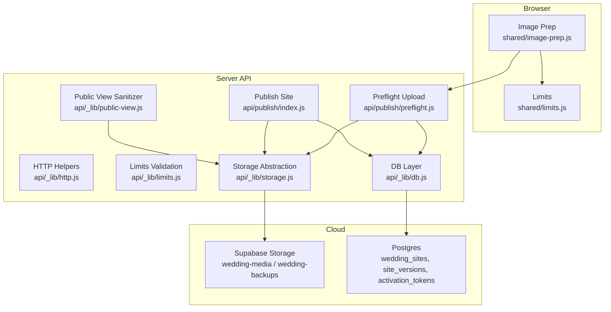
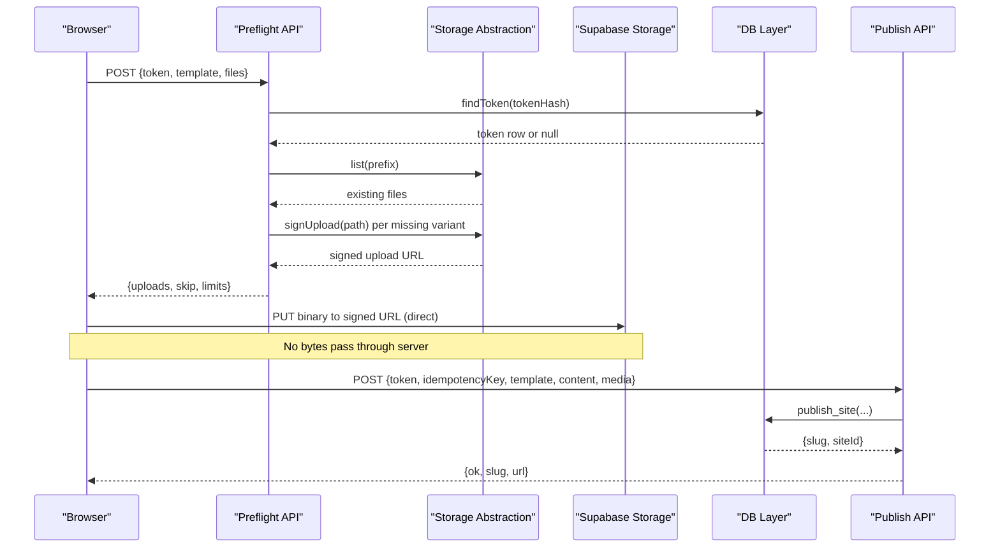
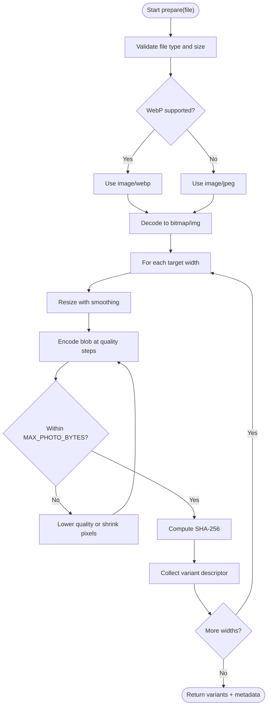
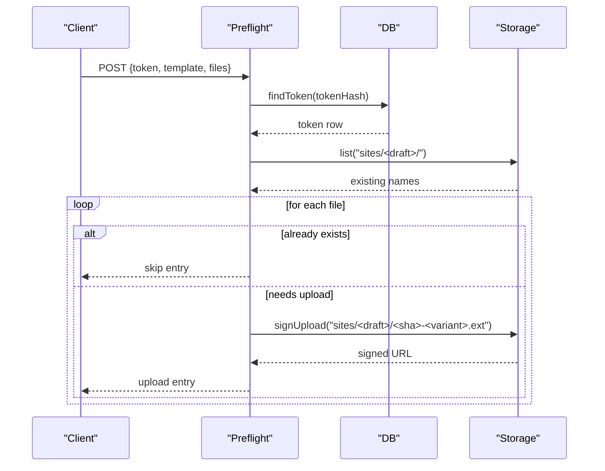
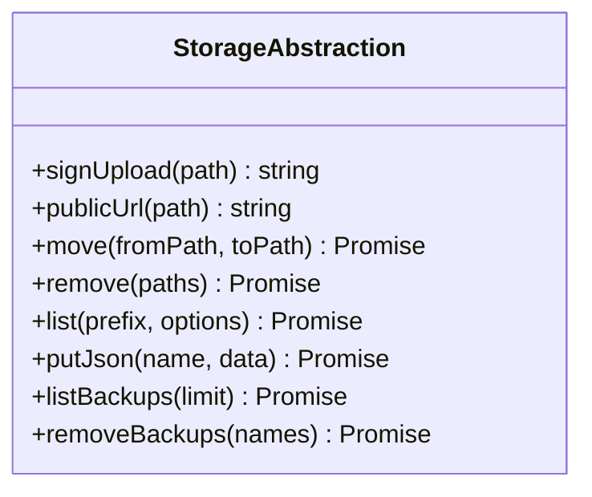
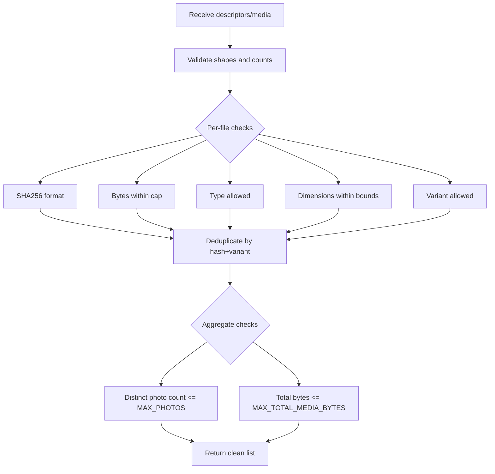
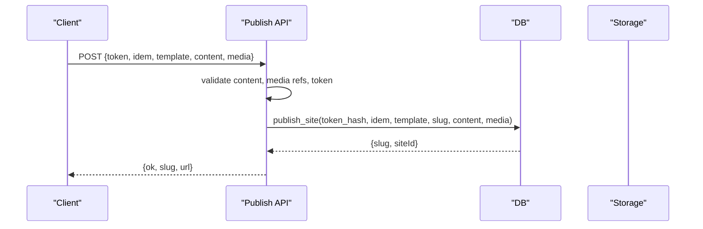
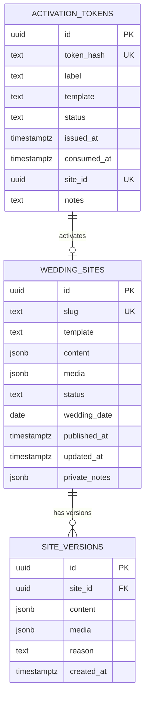
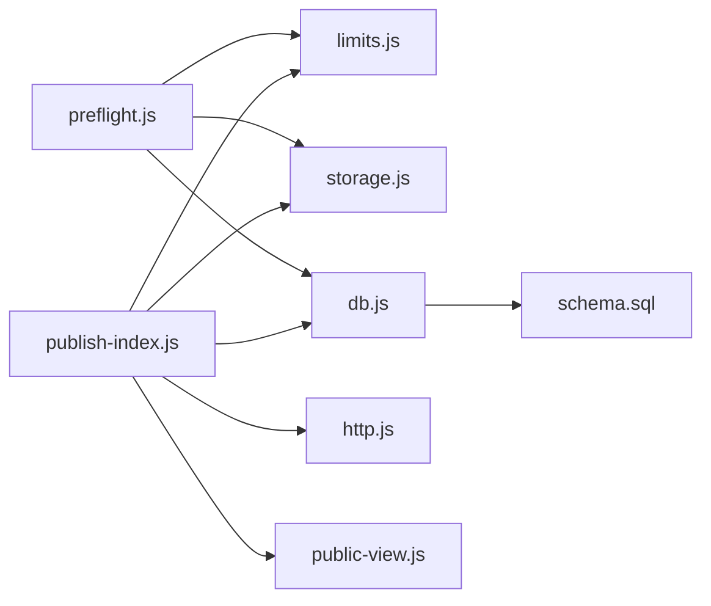

# File Storage & Management

<cite>
**Referenced Files in This Document**
- [storage.js](file://api/_lib/storage.js)
- [image-prep.js](file://shared/image-prep.js)
- [limits.js](file://api/_lib/limits.js)
- [limits-shared.js](file://shared/limits.js)
- [db.js](file://api/_lib/db.js)
- [schema.sql](file://supabase/schema.sql)
- [preflight.js](file://api/publish/preflight.js)
- [publish-index.js](file://api/publish/index.js)
- [http.js](file://api/_lib/http.js)
- [public-view.js](file://api/_lib/public-view.js)
</cite>

## Table of Contents
1. [Introduction](#introduction)
2. [Project Structure](#project-structure)
3. [Core Components](#core-components)
4. [Architecture Overview](#architecture-overview)
5. [Detailed Component Analysis](#detailed-component-analysis)
6. [Dependency Analysis](#dependency-analysis)
7. [Performance Considerations](#performance-considerations)
8. [Troubleshooting Guide](#troubleshooting-guide)
9. [Conclusion](#conclusion)

## Introduction
This document explains the file storage and media management system used to handle wedding invitation assets. It covers how images are prepared and optimized in the browser, how uploads are authorized and performed directly to cloud storage, how files are organized into buckets and folders, how metadata is stored in the database, and how the system enforces security, validation, and performance constraints for large files.

## Project Structure
The storage subsystem spans client-side image processing, server-side validation and authorization, and a thin abstraction over Supabase Storage and Postgres:

- Client-side preprocessing: shared image preparation and limits
- Server-side validation and authorization: limits, tokens, HTTP helpers
- Storage abstraction: one module that talks to Supabase Storage
- Database layer: PostgREST calls and SQL functions for site content and versions
- Publish flow endpoints: preflight (authorize upload), publish (finalize site)

**Diagram sources**
- [image-prep.js:1-360](file://shared/image-prep.js#L1-L360)
- [limits-shared.js:1-84](file://shared/limits.js#L1-L84)
- [http.js:1-198](file://api/_lib/http.js#L1-L198)
- [limits.js:1-188](file://api/_lib/limits.js#L1-L188)
- [preflight.js:1-136](file://api/publish/preflight.js#L1-L136)
- [publish-index.js:1-135](file://api/publish/index.js#L1-L135)
- [db.js:1-265](file://api/_lib/db.js#L1-L265)
- [storage.js:1-183](file://api/_lib/storage.js#L1-L183)
- [public-view.js:21-53](file://api/_lib/public-view.js#L21-L53)

**Section sources**
- [image-prep.js:1-360](file://shared/image-prep.js#L1-L360)
- [limits-shared.js:1-84](file://shared/limits.js#L1-L84)
- [http.js:1-198](file://api/_lib/http.js#L1-L198)
- [limits.js:1-188](file://api/_lib/limits.js#L1-L188)
- [preflight.js:1-136](file://api/publish/preflight.js#L1-L136)
- [publish-index.js:1-135](file://api/publish/index.js#L1-L135)
- [db.js:1-265](file://api/_lib/db.js#L1-L265)
- [storage.js:1-183](file://api/_lib/storage.js#L1-L183)
- [public-view.js:21-53](file://api/_lib/public-view.js#L21-L53)

## Core Components
- Browser image preparation: decodes, resizes, re-encodes, computes hashes, and produces multiple responsive variants with strict size caps.
- Preflight endpoint: validates token and file descriptors, checks existing files, and returns short-lived signed upload URLs scoped to exact paths.
- Storage abstraction: encapsulates Supabase Storage operations (sign upload, public URL, move, remove, list, backups).
- Limits and validation: central caps for photos, sizes, types, and content; server-side enforcement of all client-proposed values.
- Database layer: reads/writes via PostgREST and SQL functions; stores only references to media paths, not bytes.
- Public view sanitizer: ensures only safe asset references are rendered publicly.

**Section sources**
- [image-prep.js:1-360](file://shared/image-prep.js#L1-L360)
- [preflight.js:1-136](file://api/publish/preflight.js#L1-L136)
- [storage.js:1-183](file://api/_lib/storage.js#L1-L183)
- [limits.js:1-188](file://api/_lib/limits.js#L1-L188)
- [db.js:1-265](file://api/_lib/db.js#L1-L265)
- [public-view.js:21-53](file://api/_lib/public-view.js#L21-L53)

## Architecture Overview
End-to-end flow from upload to published site:

**Diagram sources**
- [preflight.js:1-136](file://api/publish/preflight.js#L1-L136)
- [storage.js:1-183](file://api/_lib/storage.js#L1-L183)
- [db.js:1-265](file://api/_lib/db.js#L1-L265)
- [publish-index.js:1-135](file://api/publish/index.js#L1-L135)

## Detailed Component Analysis

### Browser Image Preparation
Responsibilities:
- Decode images efficiently across browsers
- Resize to target widths while respecting maximum edge length
- Re-encode to WebP when supported, otherwise JPEG
- Reduce quality iteratively to meet per-photo byte cap
- Compute SHA-256 of encoded blobs for deduplication and naming
- Enforce source size and total media caps before upload

Key behaviors:
- Capability detection for WebP encoding
- Sequential encoding to avoid memory pressure on low-end devices
- Error codes for invalid inputs, oversized photos, and insecure contexts

**Diagram sources**
- [image-prep.js:43-177](file://shared/image-prep.js#L43-L177)
- [image-prep.js:197-270](file://shared/image-prep.js#L197-L270)

**Section sources**
- [image-prep.js:1-360](file://shared/image-prep.js#L1-L360)
- [limits-shared.js:1-84](file://shared/limits.js#L1-L84)

### Preflight Endpoint (Authorization and Deduplication)
Responsibilities:
- Validate request shape and rate limit
- Verify token existence and status without consuming it
- Build deterministic draft folder path from token hash
- List existing files under the draft prefix to skip duplicates
- Return signed upload URLs scoped to exact paths and time-limited

Security and safety:
- Token never logged or returned
- Paths built from server-controlled table mapping types to extensions
- Signed URLs grant write access to exactly one path for ten minutes

**Diagram sources**
- [preflight.js:1-136](file://api/publish/preflight.js#L1-L136)
- [storage.js:85-117](file://api/_lib/storage.js#L85-L117)

**Section sources**
- [preflight.js:1-136](file://api/publish/preflight.js#L1-L136)
- [storage.js:85-117](file://api/_lib/storage.js#L85-L117)

### Storage Abstraction (Supabase Integration)
Responsibilities:
- Provide a single seam for Supabase Storage operations
- Sign direct-upload permissions to specific paths
- Generate public CDN URLs for the media bucket
- Move, remove, and list objects safely
- Manage private backup bucket writes and listings

Security and safety:
- Path validation enforces safe characters and prevents directory traversal
- All upstream errors normalized to a consistent error code
- Timeouts protect against hanging requests

**Diagram sources**
- [storage.js:1-183](file://api/_lib/storage.js#L1-L183)

**Section sources**
- [storage.js:1-183](file://api/_lib/storage.js#L1-L183)

### Limits and Validation (Server-Side Enforcement)
Responsibilities:
- Centralize caps for photos, sizes, types, content, and timing
- Validate file descriptors: hash format, size, type, dimensions, variant
- Validate media references at publish time to ensure they reside under the correct draft prefix
- Prevent embedded base64 in content and enforce JSON size budgets
- Enforce idempotency keys and date formats

Design principles:
- Client-side limits are user-friendly hints; server-side limits are authoritative
- Caps balance storage and egress costs on the free tier
- Strict allowlists for types and variants prevent path injection

**Diagram sources**
- [limits.js:64-125](file://api/_lib/limits.js#L64-L125)
- [limits.js:127-162](file://api/_lib/limits.js#L127-L162)

**Section sources**
- [limits.js:1-188](file://api/_lib/limits.js#L1-L188)
- [limits-shared.js:1-84](file://shared/limits.js#L1-L84)

### Publish Endpoint (Finalization)
Responsibilities:
- Accept final site content and media references
- Derive media paths from token hash to prevent cross-customer theft
- Consume token and create site in a single transactional call
- Handle slug collisions with retries
- Return public invite URL

Error handling:
- Distinguishes token states (invalid, revoked, wrong template, consumed)
- Uses idempotency key to prevent duplicate publishes

**Diagram sources**
- [publish-index.js:1-135](file://api/publish/index.js#L1-L135)
- [db.js:138-169](file://api/_lib/db.js#L138-L169)

**Section sources**
- [publish-index.js:1-135](file://api/publish/index.js#L1-L135)
- [db.js:138-169](file://api/_lib/db.js#L138-L169)

### Database Schema and Asset Lifecycle
- Media is stored in object storage; the database holds only references (paths, dimensions, roles).
- Activation tokens are hashed and tracked; publishing consumes a token atomically with site creation.
- Site versions are snapshotted on edits and publishes to enable rollbacks.
- Row-level security is enabled with no policies; only service-role can access tables.

Lifecycle highlights:
- Drafts live under a deterministic folder derived from token hash
- After successful publish, media remains in place; references are recorded in the site record
- Backups are written to a private bucket for disaster recovery

**Diagram sources**
- [schema.sql:23-130](file://supabase/schema.sql#L23-L130)
- [schema.sql:136-208](file://supabase/schema.sql#L136-L208)
- [schema.sql:230-310](file://supabase/schema.sql#L230-L310)

**Section sources**
- [schema.sql:1-348](file://supabase/schema.sql#L1-L348)
- [db.js:101-169](file://api/_lib/db.js#L101-L169)

### Security Measures for Uploads and Downloads
- Direct uploads bypass server payload limits and duration limits by using short-lived, path-scoped signed URLs.
- Paths are validated to prevent directory traversal and extension injection.
- Tokens are never logged or included in responses; only their hashes are persisted.
- Rate limiting protects endpoints against brute-force attempts.
- Public rendering uses a sanitizer that allows only safe asset references.

**Section sources**
- [storage.js:26-38](file://api/_lib/storage.js#L26-L38)
- [preflight.js:28-32](file://api/publish/preflight.js#L28-L32)
- [http.js:12-39](file://api/_lib/http.js#L12-L39)
- [public-view.js:21-53](file://api/_lib/public-view.js#L21-L53)

## Dependency Analysis
Key dependencies and coupling:
- Preflight depends on limits, tokens, storage, and db to authorize and prepare uploads.
- Publish depends on limits, tokens, db, and http utilities to finalize sites.
- Storage abstraction isolates Supabase-specific logic; other modules depend only on its interface.
- Limits are shared between client and server to align UX and enforcement.

**Diagram sources**
- [preflight.js:1-136](file://api/publish/preflight.js#L1-L136)
- [publish-index.js:1-135](file://api/publish/index.js#L1-L135)
- [limits.js:1-188](file://api/_lib/limits.js#L1-L188)
- [storage.js:1-183](file://api/_lib/storage.js#L1-L183)
- [db.js:1-265](file://api/_lib/db.js#L1-L265)
- [public-view.js:21-53](file://api/_lib/public-view.js#L21-L53)
- [schema.sql:1-348](file://supabase/schema.sql#L1-L348)

**Section sources**
- [preflight.js:1-136](file://api/publish/preflight.js#L1-L136)
- [publish-index.js:1-135](file://api/publish/index.js#L1-L135)
- [limits.js:1-188](file://api/_lib/limits.js#L1-L188)
- [storage.js:1-183](file://api/_lib/storage.js#L1-L183)
- [db.js:1-265](file://api/_lib/db.js#L1-L265)
- [public-view.js:21-53](file://api/_lib/public-view.js#L21-L53)
- [schema.sql:1-348](file://supabase/schema.sql#L1-L348)

## Performance Considerations
- Client-side optimization reduces bandwidth and storage:
  - Responsive variants sized for mobile-first delivery
  - Adaptive quality and pixel scaling to meet per-photo caps
  - WebP where supported to minimize size
- Server-side safeguards:
  - Strict size and count limits prevent runaway usage
  - Deduplication by hash avoids redundant uploads
  - Short timeouts on upstream calls reduce function hang risk
- Egress-aware design:
  - Limits account for monthly bandwidth budgets
  - Public URLs served via CDN without server invocation

[No sources needed since this section provides general guidance]

## Troubleshooting Guide
Common issues and strategies:
- Upstream failures:
  - Storage or DB unreachable errors are normalized and marked retryable for clients
  - Logs capture context without secrets
- Token problems:
  - Invalid, revoked, wrong template, or consumed tokens produce actionable messages
  - Preflight does not consume tokens so users can fix issues before spending
- Oversized media:
  - Client reports early if source too large or compressed result exceeds cap
  - Server rejects descriptors exceeding limits
- Path and type validation:
  - Disallowed types or malformed hashes cause immediate rejection
  - Media references must be under the correct draft prefix

Operational tips:
- Use preflight to discover which files can be skipped due to existing uploads
- If publish fails due to slug collision, retry with a new suffix automatically handled by the endpoint
- For recovery after interrupted publish, use token-based lookup to retrieve the generated link

**Section sources**
- [http.js:52-79](file://api/_lib/http.js#L52-L79)
- [preflight.js:43-72](file://api/publish/preflight.js#L43-L72)
- [limits.js:64-125](file://api/_lib/limits.js#L64-L125)
- [publish-index.js:98-134](file://api/publish/index.js#L98-L134)

## Conclusion
The system implements a secure, efficient, and scalable approach to managing wedding invitation media. By performing heavy image processing in the browser, authorizing direct uploads to cloud storage with short-lived scoped permissions, and enforcing strict server-side validation, it minimizes server load and cost while ensuring safety and reliability. The database stores only lightweight references, enabling fast public reads and robust versioning. Together, these components provide a resilient lifecycle for file uploads, optimization, storage organization, and asset management tailored to high-volume, mobile-first scenarios.