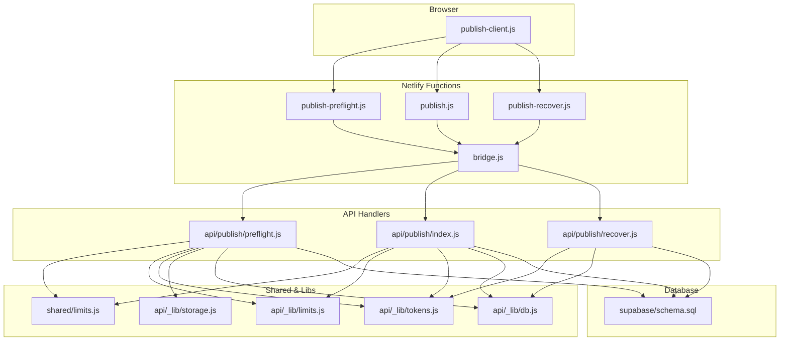
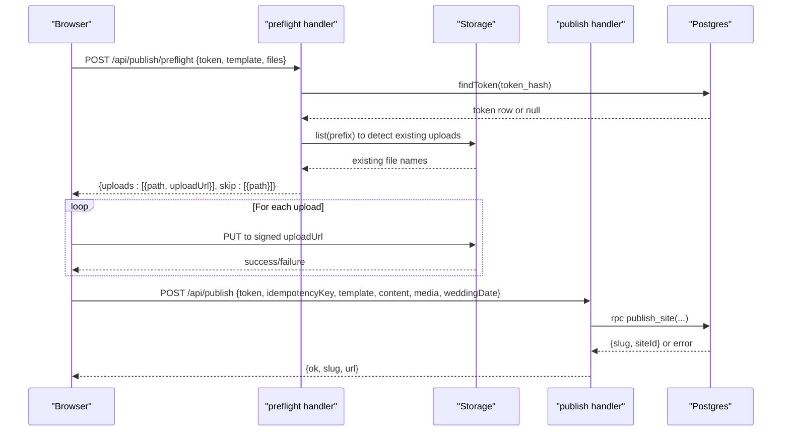
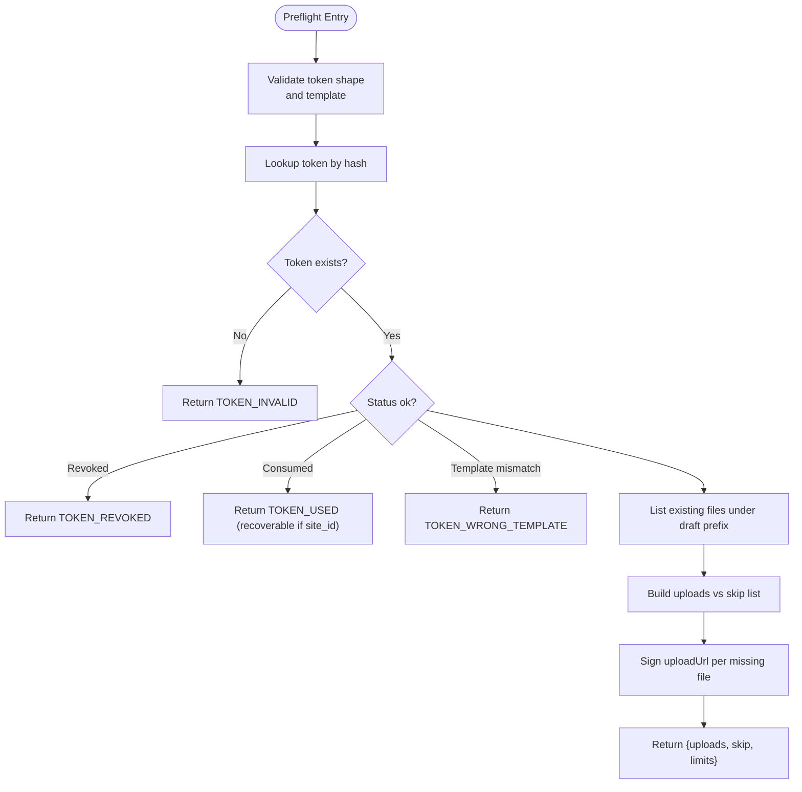
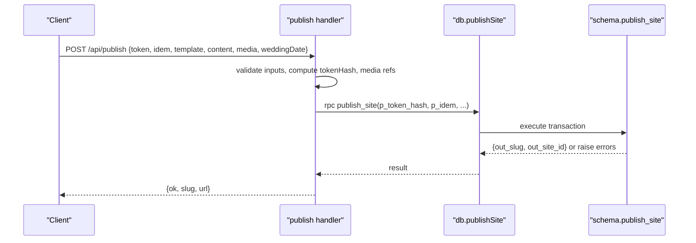
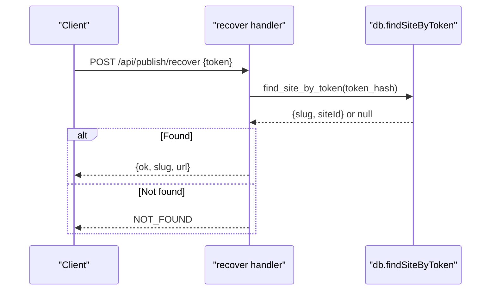
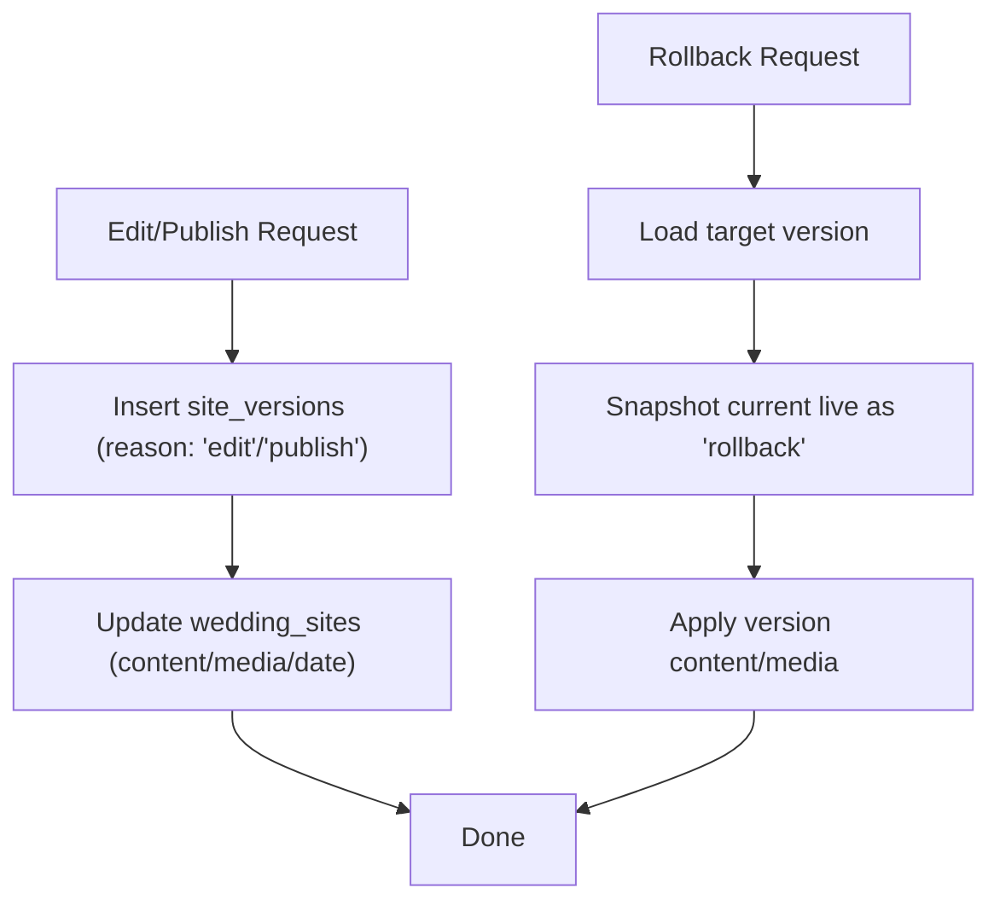
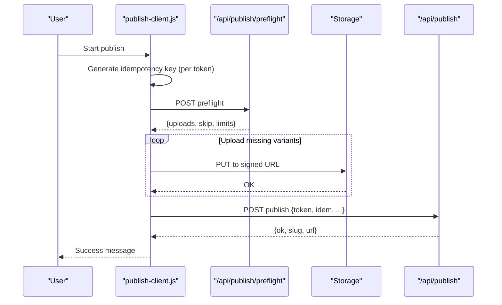
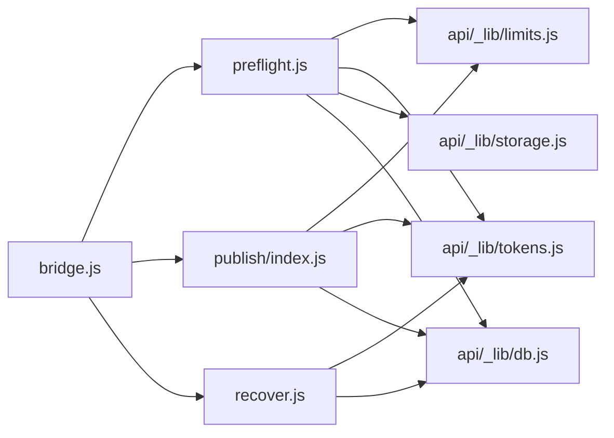

# Publishing Pipeline

<cite>
**Referenced Files in This Document**
- [api/publish/index.js](file://api/publish/index.js)
- [api/publish/preflight.js](file://api/publish/preflight.js)
- [api/publish/recover.js](file://api/publish/recover.js)
- [netlify/functions/publish.js](file://netlify/functions/publish.js)
- [netlify/functions/publish-preflight.js](file://netlify/functions/publish-preflight.js)
- [netlify/functions/publish-recover.js](file://netlify/functions/publish-recover.js)
- [netlify/lib/bridge.js](file://netlify/lib/bridge.js)
- [api/_lib/tokens.js](file://api/_lib/tokens.js)
- [api/_lib/limits.js](file://api/_lib/limits.js)
- [shared/limits.js](file://shared/limits.js)
- [api/_lib/storage.js](file://api/_lib/storage.js)
- [api/_lib/db.js](file://api/_lib/db.js)
- [shared/publish-client.js](file://shared/publish-client.js)
- [supabase/schema.sql](file://supabase/schema.sql)
</cite>

## Table of Contents
1. Introduction
2. Project Structure
3. Core Components
4. Architecture Overview
5. Detailed Component Analysis
6. Dependency Analysis
7. Performance Considerations
8. Troubleshooting Guide
9. Conclusion
10. Appendices

## Introduction
This document explains the content publishing pipeline that turns a paid activation code into a live wedding website. It covers token-based site generation, preflight validation for uploads, and recovery mechanisms when a publish succeeds but the response is lost. It also documents versioning, rollback capabilities, asset management, API usage patterns, error handling, and monitoring approaches for deployment status tracking.

## Project Structure
The publishing system spans browser-side orchestration, serverless function handlers, shared limits, token utilities, storage abstraction, database access, and Postgres functions that enforce transactional guarantees.

**Diagram sources**
- [netlify/functions/publish.js:1-7](file://netlify/functions/publish.js#L1-L7)
- [netlify/functions/publish-preflight.js:1-8](file://netlify/functions/publish-preflight.js#L1-L8)
- [netlify/functions/publish-recover.js:1-7](file://netlify/functions/publish-recover.js#L1-L7)
- [netlify/lib/bridge.js:1-126](file://netlify/lib/bridge.js#L1-L126)
- [api/publish/index.js:1-135](file://api/publish/index.js#L1-L135)
- [api/publish/preflight.js:1-136](file://api/publish/preflight.js#L1-L136)
- [api/publish/recover.js:1-54](file://api/publish/recover.js#L1-L54)
- [shared/limits.js:1-84](file://shared/limits.js#L1-L84)
- [api/_lib/limits.js:1-188](file://api/_lib/limits.js#L1-L188)
- [api/_lib/tokens.js:1-155](file://api/_lib/tokens.js#L1-L155)
- [api/_lib/storage.js:1-183](file://api/_lib/storage.js#L1-L183)
- [api/_lib/db.js:1-265](file://api/_lib/db.js#L1-L265)
- [supabase/schema.sql:1-348](file://supabase/schema.sql#L1-L348)

**Section sources**
- [netlify/functions/publish.js:1-7](file://netlify/functions/publish.js#L1-L7)
- [netlify/functions/publish-preflight.js:1-8](file://netlify/functions/publish-preflight.js#L1-L8)
- [netlify/functions/publish-recover.js:1-7](file://netlify/functions/publish-recover.js#L1-L7)
- [netlify/lib/bridge.js:1-126](file://netlify/lib/bridge.js#L1-L126)
- [api/publish/index.js:1-135](file://api/publish/index.js#L1-L135)
- [api/publish/preflight.js:1-136](file://api/publish/preflight.js#L1-L136)
- [api/publish/recover.js:1-54](file://api/publish/recover.js#L1-L54)
- [shared/limits.js:1-84](file://shared/limits.js#L1-L84)
- [api/_lib/limits.js:1-188](file://api/_lib/limits.js#L1-L188)
- [api/_lib/tokens.js:1-155](file://api/_lib/tokens.js#L1-L155)
- [api/_lib/storage.js:1-183](file://api/_lib/storage.js#L1-L183)
- [api/_lib/db.js:1-265](file://api/_lib/db.js#L1-L265)
- [supabase/schema.sql:1-348](file://supabase/schema.sql#L1-L348)

## Core Components
- Preflight endpoint validates tokens, enforces upload limits, and issues short-lived signed upload URLs to object storage. It does not consume the token.
- Publish endpoint consumes the token atomically with site creation, generates a public slug, records media references, and returns the invite URL.
- Recovery endpoint retrieves an existing published link for a consumed token without creating anything new.
- Shared limits define caps for photos, content size, rate limits, and timeouts, enforced on both client and server.
- Token utilities normalize activation codes, hash them securely, derive per-token draft folders, and build safe public slugs.
- Storage adapter abstracts object storage operations (signed uploads, listing, moving, removing).
- Database layer calls PostgREST and Postgres RPCs for reads/writes and enforces idempotency and concurrency via SQL functions.
- Netlify bridge adapts event objects to Node-style request/response used by handlers.

**Section sources**
- [api/publish/preflight.js:1-136](file://api/publish/preflight.js#L1-L136)
- [api/publish/index.js:1-135](file://api/publish/index.js#L1-L135)
- [api/publish/recover.js:1-54](file://api/publish/recover.js#L1-L54)
- [shared/limits.js:1-84](file://shared/limits.js#L1-L84)
- [api/_lib/limits.js:1-188](file://api/_lib/limits.js#L1-L188)
- [api/_lib/tokens.js:1-155](file://api/_lib/tokens.js#L1-L155)
- [api/_lib/storage.js:1-183](file://api/_lib/storage.js#L1-L183)
- [api/_lib/db.js:1-265](file://api/_lib/db.js#L1-L265)
- [netlify/lib/bridge.js:1-126](file://netlify/lib/bridge.js#L1-L126)

## Architecture Overview
The publish flow is designed so image bytes never pass through the server. The browser first asks for permission to upload, then writes directly to storage, and finally triggers a single transactional publish call.

**Diagram sources**
- [api/publish/preflight.js:1-136](file://api/publish/preflight.js#L1-L136)
- [api/publish/index.js:1-135](file://api/publish/index.js#L1-L135)
- [api/_lib/storage.js:1-183](file://api/_lib/storage.js#L1-L183)
- [api/_lib/db.js:1-265](file://api/_lib/db.js#L1-L265)
- [supabase/schema.sql:136-208](file://supabase/schema.sql#L136-L208)

## Detailed Component Analysis

### Preflight Validation and Asset Management
- Validates token shape and existence without consuming it.
- Enforces file descriptor schema, photo count, total media bytes, and allowed types/sizes.
- Derives a per-token draft folder from the token hash; lists existing files to skip re-uploads.
- Issues one-time signed upload URLs scoped to exact paths with a short TTL.
- Returns limits to the client for consistent UI behavior.

**Diagram sources**
- [api/publish/preflight.js:1-136](file://api/publish/preflight.js#L1-L136)
- [api/_lib/limits.js:64-125](file://api/_lib/limits.js#L64-L125)
- [api/_lib/storage.js:85-108](file://api/_lib/storage.js#L85-L108)
- [shared/limits.js:31-73](file://shared/limits.js#L31-L73)

**Section sources**
- [api/publish/preflight.js:1-136](file://api/publish/preflight.js#L1-L136)
- [api/_lib/limits.js:64-125](file://api/_lib/limits.js#L64-L125)
- [api/_lib/storage.js:85-108](file://api/_lib/storage.js#L85-L108)
- [shared/limits.js:31-73](file://shared/limits.js#L31-L73)

### Token-Based Site Generation (Publish)
- Accepts token, idempotency key, template, content, media references, and optional wedding date.
- Derives media paths strictly from preflight responses to prevent cross-customer path injection.
- Attempts slug generation based on couple names with limited retries on collision.
- Calls a transactional Postgres function to claim the token, create the site, record versions, and mark attempts idempotent.
- Returns the public invite URL.

**Diagram sources**
- [api/publish/index.js:30-96](file://api/publish/index.js#L30-L96)
- [api/_lib/db.js:138-148](file://api/_lib/db.js#L138-L148)
- [supabase/schema.sql:147-208](file://supabase/schema.sql#L147-L208)

**Section sources**
- [api/publish/index.js:1-135](file://api/publish/index.js#L1-L135)
- [api/_lib/db.js:138-148](file://api/_lib/db.js#L138-L148)
- [supabase/schema.sql:147-208](file://supabase/schema.sql#L147-L208)

### Recovery Mechanism
- If a publish succeeded but the response was lost, the recover endpoint returns the existing public link using the token hash.
- Returns no information for unknown or unconsumed tokens to avoid enumeration.

**Diagram sources**
- [api/publish/recover.js:1-54](file://api/publish/recover.js#L1-L54)
- [api/_lib/db.js:150-155](file://api/_lib/db.js#L150-L155)
- [supabase/schema.sql:211-227](file://supabase/schema.sql#L211-L227)

**Section sources**
- [api/publish/recover.js:1-54](file://api/publish/recover.js#L1-L54)
- [api/_lib/db.js:150-155](file://api/_lib/db.js#L150-L155)
- [supabase/schema.sql:211-227](file://supabase/schema.sql#L211-L227)

### Versioning and Rollback
- Every publish and edit writes a snapshot to site_versions before changing the live site.
- Rollback restores a previous version and snapshots the current state to maintain reversibility.
- A daily prune keeps only the newest N versions per site.

**Diagram sources**
- [supabase/schema.sql:230-310](file://supabase/schema.sql#L230-L310)
- [api/_lib/db.js:157-169](file://api/_lib/db.js#L157-L169)

**Section sources**
- [supabase/schema.sql:230-310](file://supabase/schema.sql#L230-L310)
- [api/_lib/db.js:157-169](file://api/_lib/db.js#L157-L169)

### Browser Orchestration and Idempotency
- Generates an idempotency key per token and persists it locally before any attempt.
- Performs preflight, uploads images directly to storage, then publishes with the same idempotency key.
- Implements retry with backoff for transient network/server errors and friendly user messages.

**Diagram sources**
- [shared/publish-client.js:156-194](file://shared/publish-client.js#L156-L194)
- [shared/publish-client.js:196-261](file://shared/publish-client.js#L196-L261)
- [shared/publish-client.js:301-377](file://shared/publish-client.js#L301-L377)

**Section sources**
- [shared/publish-client.js:156-194](file://shared/publish-client.js#L156-L194)
- [shared/publish-client.js:196-261](file://shared/publish-client.js#L196-L261)
- [shared/publish-client.js:301-377](file://shared/publish-client.js#L301-L377)

## Dependency Analysis
- Handlers depend on shared limits for validation and rate limiting.
- Preflight depends on storage for listing and signing uploads.
- Publish depends on db for transactional token consumption and site creation.
- Recovery depends on db for read-only lookup of published sites by token.
- All serverless functions are wrapped by the Netlify bridge to adapt events to Node-style req/res.

**Diagram sources**
- [api/publish/preflight.js:1-136](file://api/publish/preflight.js#L1-L136)
- [api/publish/index.js:1-135](file://api/publish/index.js#L1-L135)
- [api/publish/recover.js:1-54](file://api/publish/recover.js#L1-L54)
- [api/_lib/limits.js:1-188](file://api/_lib/limits.js#L1-L188)
- [api/_lib/tokens.js:1-155](file://api/_lib/tokens.js#L1-L155)
- [api/_lib/storage.js:1-183](file://api/_lib/storage.js#L1-L183)
- [api/_lib/db.js:1-265](file://api/_lib/db.js#L1-L265)
- [netlify/lib/bridge.js:1-126](file://netlify/lib/bridge.js#L1-L126)

**Section sources**
- [api/publish/preflight.js:1-136](file://api/publish/preflight.js#L1-L136)
- [api/publish/index.js:1-135](file://api/publish/index.js#L1-L135)
- [api/publish/recover.js:1-54](file://api/publish/recover.js#L1-L54)
- [api/_lib/limits.js:1-188](file://api/_lib/limits.js#L1-L188)
- [api/_lib/tokens.js:1-155](file://api/_lib/tokens.js#L1-L155)
- [api/_lib/storage.js:1-183](file://api/_lib/storage.js#L1-L183)
- [api/_lib/db.js:1-265](file://api/_lib/db.js#L1-L265)
- [netlify/lib/bridge.js:1-126](file://netlify/lib/bridge.js#L1-L126)

## Performance Considerations
- Direct-to-storage uploads bypass function payload and duration limits, improving scalability for large media sets.
- Signed upload URLs have a short TTL to limit exposure and reduce storage churn.
- Draft folder listing avoids re-uploading already present files, saving bandwidth and time.
- Transactional publish minimizes contention and ensures consistency; slug collisions are retried a small number of times.
- Rate limits protect endpoints from abuse and ensure fair usage.

[No sources needed since this section provides general guidance]

## Troubleshooting Guide
Common error codes and their meanings:
- TOKEN_INVALID: Unknown or malformed token.
- TOKEN_REVOKED: Token has been revoked.
- TOKEN_USED: Token already consumed; may include recoverable flag if a site exists.
- TOKEN_WRONG_TEMPLATE: Token belongs to a different template.
- RATE_LIMITED: Too many requests within the window.
- TOO_LARGE: Photo or total media exceeds limits.
- BAD_REQUEST: Invalid input shape or content.
- NOT_FOUND: No published site found for the token.
- UPSTREAM: Temporary infrastructure failure (database or storage unreachable).
- NETWORK/TIMEOUT: Client-side connectivity or timeout issues.

Monitoring and observability:
- Handlers log outcomes such as preflight.ok/refused, publish.ok/refused, recover.ok/miss, and upstream errors.
- Storage and database layers log reachability and errors with context like path and status.
- Use these logs to track success rates, failure reasons, and performance hotspots.

**Section sources**
- [api/publish/preflight.js:50-72](file://api/publish/preflight.js#L50-L72)
- [api/publish/index.js:98-133](file://api/publish/index.js#L98-L133)
- [api/publish/recover.js:37-46](file://api/publish/recover.js#L37-L46)
- [api/_lib/storage.js:40-81](file://api/_lib/storage.js#L40-L81)
- [api/_lib/db.js:34-84](file://api/_lib/db.js#L34-L84)
- [shared/publish-client.js:55-69](file://shared/publish-client.js#L55-L69)

## Conclusion
The publishing pipeline separates concerns to maximize reliability and scalability: preflight validates and prepares uploads, direct-to-storage handles heavy media, and a transactional publish finalizes the site with strong guarantees. Idempotency keys, versioning, and recovery endpoints provide resilience against network failures and operator mistakes. Monitoring via structured logs enables quick diagnosis and operational visibility.

[No sources needed since this section summarizes without analyzing specific files]

## Appendices

### Publish API Examples
- Preflight
  - Method: POST
  - Path: /api/publish/preflight
  - Body: { token, template, files: [{ sha256, bytes, type, w, h, variant }] }
  - Response: { ok, uploads: [{ sha256, variant, path, uploadUrl }], skip: [{ sha256, variant, path }], limits }
- Publish
  - Method: POST
  - Path: /api/publish
  - Body: { token, idempotencyKey, template, content, media, weddingDate }
  - Response: { ok, slug, url }
- Recover
  - Method: POST
  - Path: /api/publish/recover
  - Body: { token }
  - Response: { ok, slug, url } or NOT_FOUND

**Section sources**
- [api/publish/preflight.js:1-136](file://api/publish/preflight.js#L1-L136)
- [api/publish/index.js:1-135](file://api/publish/index.js#L1-L135)
- [api/publish/recover.js:1-54](file://api/publish/recover.js#L1-L54)

### Error Handling Patterns
- Server returns structured error codes; client maps them to friendly messages.
- Transient errors trigger retries with exponential backoff; non-transient errors surface immediately.
- Upstream failures (database/storage) are logged with context and surfaced as generic errors to users.

**Section sources**
- [shared/publish-client.js:89-154](file://shared/publish-client.js#L89-L154)
- [api/_lib/storage.js:40-81](file://api/_lib/storage.js#L40-L81)
- [api/_lib/db.js:34-84](file://api/_lib/db.js#L34-L84)

### Deployment Status Tracking
- Logs at each stage indicate success or failure:
  - Preflight: ok/refused/list_failed
  - Publish: ok/refused/slug_exhausted
  - Recover: ok/miss
  - Upstream: storage.unreachable, db.unreachable
- Use these logs to monitor health, identify bottlenecks, and investigate failures.

**Section sources**
- [api/publish/preflight.js:120-120](file://api/publish/preflight.js#L120-L120)
- [api/publish/index.js:80-80](file://api/publish/index.js#L80-L80)
- [api/publish/recover.js:46-46](file://api/publish/recover.js#L46-L46)
- [api/_lib/storage.js:63-79](file://api/_lib/storage.js#L63-L79)
- [api/_lib/db.js:53-80](file://api/_lib/db.js#L53-L80)