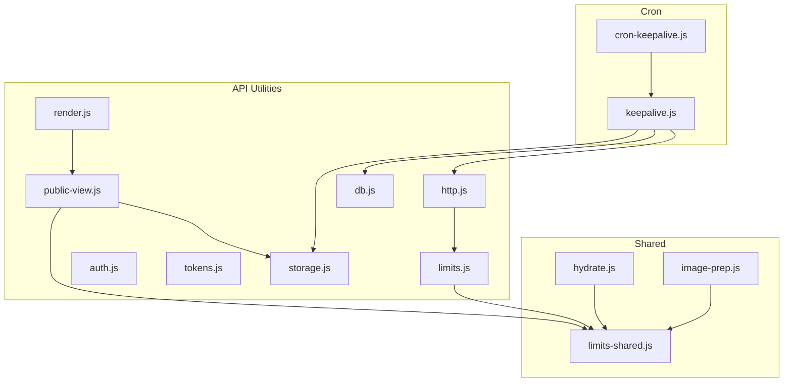
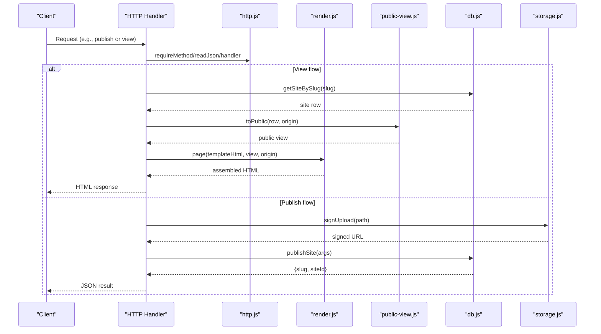
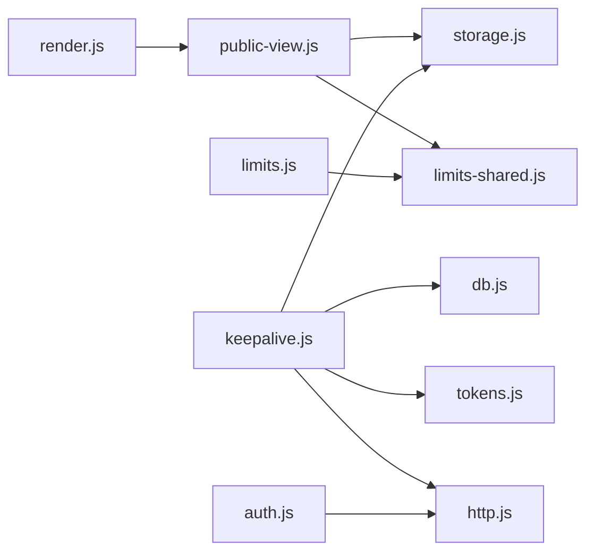

# Utility Functions & Helpers

<cite>
**Referenced Files in This Document**
- [http.js](file://api/_lib/http.js)
- [render.js](file://api/_lib/render.js)
- [public-view.js](file://api/_lib/public-view.js)
- [limits.js](file://api/_lib/limits.js)
- [auth.js](file://api/_lib/auth.js)
- [tokens.js](file://api/_lib/tokens.js)
- [storage.js](file://api/_lib/storage.js)
- [db.js](file://api/_lib/db.js)
- [keepalive.js](file://api/cron/keepalive.js)
- [limits-shared.js](file://shared/limits.js)
- [hydrate.js](file://shared/hydrate.js)
- [image-prep.js](file://shared/image-prep.js)
- [cron-keepalive.js](file://netlify/functions/cron-keepalive.js)
</cite>

## Table of Contents
1. [Introduction](#introduction)
2. [Project Structure](#project-structure)
3. [Core Components](#core-components)
4. [Architecture Overview](#architecture-overview)
5. [Detailed Component Analysis](#detailed-component-analysis)
6. [Dependency Analysis](#dependency-analysis)
7. [Performance Considerations](#performance-considerations)
8. [Troubleshooting Guide](#troubleshooting-guide)
9. [Conclusion](#conclusion)

## Introduction
This document explains the backend utility functions and helper modules that power request handling, rendering, public view generation, rate limiting, cron maintenance, keep-alive for serverless environments, and shared business logic across services. It focuses on how these components work together to provide secure, performant, and maintainable operations for invitation publishing and viewing.

## Project Structure
The utilities are organized into focused modules:
- HTTP plumbing, error shaping, rate limiting, and safe logging live under api/_lib/http.js.
- Rendering and HTML assembly for guest pages live under api/_lib/render.js.
- Public data projection and validation live under api/_lib/public-view.js.
- Limits and enforcement live under api/_lib/limits.js and shared/limits.js.
- Authentication and session management live under api/_lib/auth.js.
- Token generation, normalization, hashing, and slug creation live under api/_lib/tokens.js.
- Storage abstraction over Supabase Storage lives under api/_lib/storage.js.
- Database access via PostgREST RPCs and queries lives under api/_lib/db.js.
- Cron keepalive jobs live under api/cron/keepalive.js with a Netlify bridge at netlify/functions/cron-keepalive.js.
- Browser-side helpers for hydration and image preparation live under shared/hydrate.js and shared/image-prep.js.

**Diagram sources**
- [http.js:1-198](file://api/_lib/http.js#L1-L198)
- [render.js:1-290](file://api/_lib/render.js#L1-L290)
- [public-view.js:1-335](file://api/_lib/public-view.js#L1-L335)
- [limits.js:1-188](file://api/_lib/limits.js#L1-L188)
- [limits-shared.js:1-84](file://shared/limits.js#L1-L84)
- [auth.js:1-124](file://api/_lib/auth.js#L1-L124)
- [tokens.js:1-155](file://api/_lib/tokens.js#L1-L155)
- [storage.js:1-183](file://api/_lib/storage.js#L1-L183)
- [db.js:1-265](file://api/_lib/db.js#L1-L265)
- [keepalive.js:1-159](file://api/cron/keepalive.js#L1-L159)
- [cron-keepalive.js:1-17](file://netlify/functions/cron-keepalive.js#L1-L17)

**Section sources**
- [http.js:1-198](file://api/_lib/http.js#L1-L198)
- [render.js:1-290](file://api/_lib/render.js#L1-L290)
- [public-view.js:1-335](file://api/_lib/public-view.js#L1-L335)
- [limits.js:1-188](file://api/_lib/limits.js#L1-L188)
- [limits-shared.js:1-84](file://shared/limits.js#L1-L84)
- [auth.js:1-124](file://api/_lib/auth.js#L1-L124)
- [tokens.js:1-155](file://api/_lib/tokens.js#L1-L155)
- [storage.js:1-183](file://api/_lib/storage.js#L1-L183)
- [db.js:1-265](file://api/_lib/db.js#L1-L265)
- [keepalive.js:1-159](file://api/cron/keepalive.js#L1-L159)
- [cron-keepalive.js:1-17](file://netlify/functions/cron-keepalive.js#L1-L17)

## Core Components
- HTTP utilities: standardized JSON responses, error codes, method enforcement, safe body reading, in-memory per-instance rate limiting, constant-time comparison, handler wrapper, and canonical origin resolution.
- Rendering: template-aware HTML assembly, meta tag injection for social previews, asset path rewriting, and safe JSON embedding.
- Public view generator: strict allow-listed projection from database rows to public shapes, media resolution, and derived metadata for titles and images.
- Limits: shared caps for photos, content size, tokens, and rate limits; server-side enforcement and browser-facing limits.
- Auth: HMAC-signed admin session cookies with expiry and strict cookie attributes.
- Tokens: activation code generation, normalization, hashing with pepper, draft folder derivation, and public slug creation.
- Storage: signed upload permissions, public URL construction, move/remove/list operations, and backup export utilities.
- DB: PostgREST client with timeouts, RPC wrappers, read/write helpers, and housekeeping queries.
- Cron keepalive: daily tasks to keep the project alive, sweep abandoned drafts, prune versions, and back up sites.

**Section sources**
- [http.js:1-198](file://api/_lib/http.js#L1-L198)
- [render.js:1-290](file://api/_lib/render.js#L1-L290)
- [public-view.js:1-335](file://api/_lib/public-view.js#L1-L335)
- [limits.js:1-188](file://api/_lib/limits.js#L1-L188)
- [limits-shared.js:1-84](file://shared/limits.js#L1-L84)
- [auth.js:1-124](file://api/_lib/auth.js#L1-L124)
- [tokens.js:1-155](file://api/_lib/tokens.js#L1-L155)
- [storage.js:1-183](file://api/_lib/storage.js#L1-L183)
- [db.js:1-265](file://api/_lib/db.js#L1-L265)
- [keepalive.js:1-159](file://api/cron/keepalive.js#L1-L159)

## Architecture Overview
The system separates concerns cleanly:
- API handlers use http.js for consistent request/response behavior and error handling.
- Rendering composes templates with validated public views and injects metadata for sharing.
- Public views enforce allow-lists to prevent accidental leakage of private fields.
- Limits ensure storage and bandwidth budgets are respected both client and server side.
- Auth secures admin endpoints with signed cookies.
- Tokens manage activation flows and derive scoping identifiers safely.
- Storage abstracts cloud object operations and enforces safe paths.
- DB centralizes all database interactions with timeouts and structured errors.
- Cron keepalive runs maintenance tasks independently of user requests.

**Diagram sources**
- [http.js:1-198](file://api/_lib/http.js#L1-L198)
- [render.js:1-290](file://api/_lib/render.js#L1-L290)
- [public-view.js:1-335](file://api/_lib/public-view.js#L1-L335)
- [db.js:1-265](file://api/_lib/db.js#L1-L265)
- [storage.js:1-183](file://api/_lib/storage.js#L1-L183)

## Detailed Component Analysis

### HTTP Request Handling Utilities
- Response shaping: json sets headers and writes JSON bodies; fail maps known error codes to user-friendly messages and status codes.
- Input safety: requireMethod restricts allowed methods; readJson parses streaming bodies with a hard byte cap to avoid long-running requests.
- Rate limiting: in-memory buckets keyed by name and IP; sweeps expired entries to bound memory usage.
- Security: redact prevents secrets from being logged; safeEqual avoids timing attacks for comparisons.
- Handler wrapper: ensures exceptions never leak stack traces and logs completion metrics.
- Origin resolution: publicOrigin derives canonical base URLs for links.

Usage patterns:
- Wrap every endpoint with handler(name, fn).
- Use requireMethod(req, res, "POST") for token endpoints.
- Read bodies via readJson(req, maxBytes) and handle TOO_LARGE/BAD_REQUEST errors.
- Emit errors via fail(res, code, extra) using predefined ERRORS.
- Apply rateLimit(req, name, spec) before sensitive operations.

**Section sources**
- [http.js:1-198](file://api/_lib/http.js#L1-L198)

### Rendering Functions for Dynamic Content
- Template source mapping: TEMPLATE_SOURCE maps template names to static HTML files.
- Head injection: stripHead removes demo tags; metaBlock builds OG/Twitter tags from public view data; absolute asset paths are injected via absolutise.
- Safe embedding: safeJson escapes dangerous characters for inline script blocks; escapeHtml sanitizes text.
- Fallback images: fallbackImage provides share preview images when none uploaded.
- Shell pages: notFoundPage and maintenancePage render friendly standalone pages.

Integration points:
- Called after toPublic produces a validated view.
- Uses coupleLine and occasion from public-view.js to build titles and descriptions.
- Resolves Supabase CDN origins for preconnect hints.

**Section sources**
- [render.js:1-290](file://api/_lib/render.js#L1-L290)
- [public-view.js:264-301](file://api/_lib/public-view.js#L264-L301)

### Public View Generators
- Strict allow-lists: SHAPES define permitted fields per template; walk validates and projects only allowed fields.
- Media resolution: publicMedia converts stored references to responsive URLs with srcset and dimensions.
- Derived metadata: coupleLine, occasion, coverImage produce values used for titles, descriptions, and share images.
- Name/date extraction: namesOf and dateOf help generate slugs and dates during publishing.

Constraints and safety:
- Text clamped to MAX_STRING.
- Colors validated as hex.
- URLs restricted to https.
- Media references limited to internal markers or bundled assets.

**Section sources**
- [public-view.js:1-335](file://api/_lib/public-view.js#L1-L335)

### Rate Limiting Mechanisms
- In-memory per instance: buckets store counts and reset times; sweep cleans expired keys.
- Configurable specs: windowMs and limit defined centrally in shared limits.
- Integration: applied around sensitive endpoints like publish, preflight, recover, and admin login.

Behavior notes:
- Not distributed; intended to deter casual brute force while relying on token entropy for security.
- Memory bounded by sweeping old entries.

**Section sources**
- [http.js:121-151](file://api/_lib/http.js#L121-L151)
- [limits-shared.js:67-73](file://shared/limits.js#L67-L73)

### Cron Job Implementations and Keep-Alive
- Authorization: requires CRON_SECRET via Bearer header or query key; misconfiguration is logged.
- Jobs:
  - Ping database to keep free-tier project active.
  - Sweep abandoned drafts older than configured TTL by listing and removing storage folders derived from token hashes.
  - Prune version history to a fixed number.
  - Export all sites to backups bucket and retain a rolling set.
- Error isolation: attempt wraps each job so one failure does not block others.
- Netlify bridge: cron-keepalive.js proxies scheduled calls to the same handler.

Operational guidance:
- Ensure CRON_SECRET is set and strong.
- Monitor logs for failed jobs and unfinished sweep counts.
- Adjust KEEP_VERSIONS and KEEP_BACKUPS based on retention needs.

**Section sources**
- [keepalive.js:1-159](file://api/cron/keepalive.js#L1-L159)
- [cron-keepalive.js:1-17](file://netlify/functions/cron-keepalive.js#L1-L17)

### Shared Business Logic Components
- Limits:
  - Centralized caps for photos, content size, tokens, and rate windows.
  - Loaded by both browser and server to align UX and enforcement.
- Hydration:
  - Resolves media markers to actual URLs based on device capabilities.
  - Merges published overrides with template defaults.
  - Collects images from editor content for upload and assigns markers.
- Image preparation:
  - Decodes images, encodes to WebP/JPEG, scales to target widths, computes SHA-256, and reports descriptors for preflight.
  - Enforces per-image and total media budgets with clear user feedback.

Integration examples:
- Use hydrate.content() to obtain resolved content for templates.
- Use image-prep.prepareAll(files, opts) to compress and prepare uploads; then send descriptors to preflight and upload via signed URLs.

**Section sources**
- [limits-shared.js:1-84](file://shared/limits.js#L1-L84)
- [hydrate.js:1-207](file://shared/hydrate.js#L1-L207)
- [image-prep.js:1-360](file://shared/image-prep.js#L1-L360)

### Authentication and Session Management
- Signed cookies: issue creates an HMAC-signed cookie with subject and expiry; verify checks signature and expiration.
- Password check: constant-time comparison against environment variable; misconfiguration logged.
- Guard: requireAdmin returns true if valid session exists; otherwise responds with unauthorized JSON.

Security properties:
- HttpOnly, Secure, SameSite=Strict, Path=/api.
- No secret exposure in responses or logs.

**Section sources**
- [auth.js:1-124](file://api/_lib/auth.js#L1-L124)

### Token Utilities
- Generation: random Crockford Base32 groups form activation codes with high entropy.
- Normalization: handles case, separators, and common confusions; validates structure.
- Hashing: sha256(code + pepper) for secure storage; pepper required in environment.
- Draft scoping: draftId derives a stable folder path from token hash without storing it.
- Slug creation: makeSlug normalizes names and appends a random suffix; isValidSlug validates incoming slugs.

Usage:
- Generate codes for new invitations.
- Normalize user input before lookup.
- Derive draft paths for storage scoping.
- Build public invite links from names and suffix.

**Section sources**
- [tokens.js:1-155](file://api/_lib/tokens.js#L1-L155)

### Storage Abstraction
- Signed uploads: signUpload returns a time-limited URL for direct client-to-storage writes.
- Public URLs: publicUrl constructs permanent links for media.
- Moves and removals: move promotes draft uploads; remove deletes prefixes.
- Listing: list enumerates objects with sorting and pagination.
- Backups: putJson writes nightly exports; listBackups and removeBackups manage retention.

Safety:
- assertSafePath validates paths to prevent traversal or invalid formats.
- Timeouts and error mapping to UPSTREAM for reliability.

**Section sources**
- [storage.js:1-183](file://api/_lib/storage.js#L1-L183)

### Database Access Layer
- PostgREST client: request wraps fetch with timeouts and error handling; rpc calls Postgres functions.
- Reads: getSiteBySlug, getSiteById, slugExists, findToken select minimal columns.
- Writes: publishSite, updateSite, rollbackSite, insertToken, revokeToken, setSiteStatus.
- Admin: listTokens, listSites, listVersions.
- Housekeeping: ping, staleIssuedTokens, pruneVersions, exportAllSites.

Reliability:
- Default timeouts prevent hangs.
- Structured errors distinguish service-level issues from application-level sentinels.

**Section sources**
- [db.js:1-265](file://api/_lib/db.js#L1-L265)

## Dependency Analysis
Key dependency relationships:
- render.js depends on public-view.js for derived metadata and uses storage.js indirectly via public-url resolution.
- public-view.js depends on storage.js for media URL generation and shared/limits.js for constraints.
- limits.js re-exports shared/limits.js and adds server-side enforcement helpers.
- keepalive.js depends on db.js, storage.js, tokens.js, and http.js utilities.
- auth.js depends on http.js for safeEqual and logging.
- storage.js and db.js depend on environment configuration and log via http.js.

**Diagram sources**
- [render.js:1-290](file://api/_lib/render.js#L1-L290)
- [public-view.js:1-335](file://api/_lib/public-view.js#L1-L335)
- [limits.js:1-188](file://api/_lib/limits.js#L1-L188)
- [limits-shared.js:1-84](file://shared/limits.js#L1-L84)
- [keepalive.js:1-159](file://api/cron/keepalive.js#L1-L159)
- [db.js:1-265](file://api/_lib/db.js#L1-L265)
- [storage.js:1-183](file://api/_lib/storage.js#L1-L183)
- [tokens.js:1-155](file://api/_lib/tokens.js#L1-L155)
- [http.js:1-198](file://api/_lib/http.js#L1-L198)
- [auth.js:1-124](file://api/_lib/auth.js#L1-L124)

**Section sources**
- [render.js:1-290](file://api/_lib/render.js#L1-L290)
- [public-view.js:1-335](file://api/_lib/public-view.js#L1-L335)
- [limits.js:1-188](file://api/_lib/limits.js#L1-L188)
- [limits-shared.js:1-84](file://shared/limits.js#L1-L84)
- [keepalive.js:1-159](file://api/cron/keepalive.js#L1-L159)
- [db.js:1-265](file://api/_lib/db.js#L1-L265)
- [storage.js:1-183](file://api/_lib/storage.js#L1-L183)
- [tokens.js:1-155](file://api/_lib/tokens.js#L1-L155)
- [http.js:1-198](file://api/_lib/http.js#L1-L198)
- [auth.js:1-124](file://api/_lib/auth.js#L1-L124)

## Performance Considerations
- Streaming body reads with caps prevent long-running requests and memory spikes.
- In-memory rate limiting reduces overhead compared to database-backed counters on hot paths.
- Asset path rewriting avoids <base> pitfalls and preserves in-page navigation performance.
- Preconnect hints to storage CDN reduce latency for critical images.
- Responsive image selection on the client minimizes bandwidth usage.
- Cron jobs are budgeted and isolated to avoid impacting user requests.

[No sources needed since this section provides general guidance]

## Troubleshooting Guide
Common issues and resolutions:
- Misconfigured secrets:
  - ADMIN_SESSION_SECRET or TOKEN_PEPPER missing will cause authentication or token hashing failures; ensure environment variables are set.
- Upstream unreachability:
  - SUPABASE_URL or SUPABASE_SERVICE_KEY missing leads to UPSTREAM errors in storage and db modules; verify environment configuration.
- Rate limiting:
  - If endpoints return 429, adjust RATE settings or investigate abuse patterns; remember rate limits are per instance.
- Cron failures:
  - Check logs for failed jobs; ensure CRON_SECRET is present and strong; monitor unfinished sweep counts to detect backlog.
- Large payloads:
  - readJson enforces byte caps; clients must respect shared limits and compress images appropriately.

**Section sources**
- [auth.js:21-29](file://api/_lib/auth.js#L21-L29)
- [tokens.js:69-83](file://api/_lib/tokens.js#L69-L83)
- [storage.js:40-81](file://api/_lib/storage.js#L40-L81)
- [db.js:26-84](file://api/_lib/db.js#L26-L84)
- [http.js:121-151](file://api/_lib/http.js#L121-L151)
- [keepalive.js:64-88](file://api/cron/keepalive.js#L64-L88)

## Conclusion
The utility layer provides a robust foundation for secure, efficient, and maintainable backend operations. By centralizing HTTP handling, rendering, public view projection, limits, authentication, tokens, storage, database access, and cron maintenance, the system ensures consistency and safety across all services. The separation of concerns and strict validation enable reliable scaling and easy evolution as requirements change.

[No sources needed since this section summarizes without analyzing specific files]