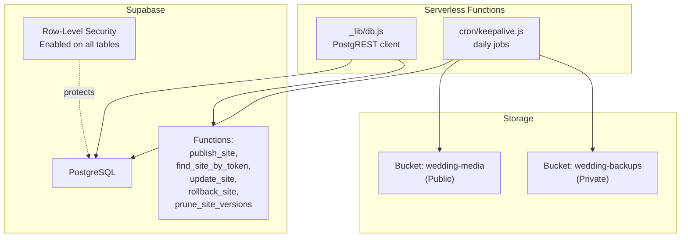
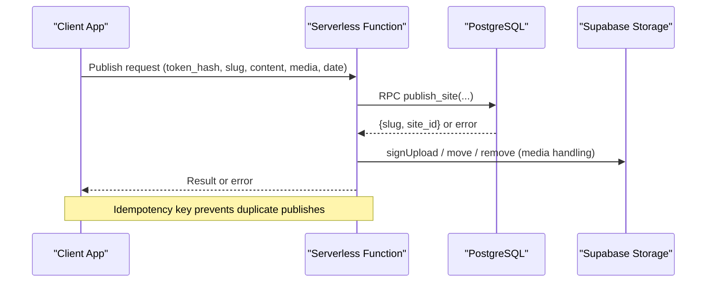
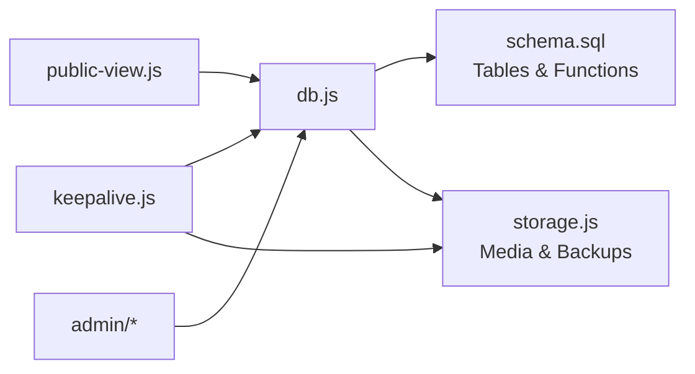

# Database Schema & Data Models

<cite>
**Referenced Files in This Document**
- [schema.sql](file://supabase/schema.sql)
- [README.md](file://supabase/README.md)
- [db.js](file://api/_lib/db.js)
- [public-view.js](file://api/_lib/public-view.js)
- [storage.js](file://api/_lib/storage.js)
- [keepalive.js](file://api/cron/keepalive.js)
</cite>

## Table of Contents
1. [Introduction](#introduction)
2. [Project Structure](#project-structure)
3. [Core Components](#core-components)
4. [Architecture Overview](#architecture-overview)
5. [Detailed Component Analysis](#detailed-component-analysis)
6. [Dependency Analysis](#dependency-analysis)
7. [Performance Considerations](#performance-considerations)
8. [Troubleshooting Guide](#troubleshooting-guide)
9. [Conclusion](#conclusion)
10. [Appendices](#appendices)

## Introduction
This document describes the Supabase PostgreSQL data model and related data operations for the token-gated wedding publishing system. It covers entity relationships, field definitions, constraints, indexes, stored procedures, security (row-level security), data validation at the database and API layers, caching strategies, performance considerations, lifecycle management, retention policies, backups, and recovery procedures.

## Project Structure
The database schema is defined in a single SQL file and applied once to the Supabase project. Application code accesses the database via PostgREST and invokes server-side functions through RPC calls from serverless functions. Storage is handled separately with two buckets: one public for media and one private for backups.



**Diagram sources**
- [schema.sql:19-133](file://supabase/schema.sql#L19-L133)
- [db.js:19-94](file://api/_lib/db.js#L19-L94)
- [keepalive.js:92-137](file://api/cron/keepalive.js#L92-L137)
- [storage.js:21-23](file://api/_lib/storage.js#L21-L23)

**Section sources**
- [schema.sql:19-133](file://supabase/schema.sql#L19-L133)
- [README.md:28-39](file://supabase/README.md#L28-L39)
- [db.js:19-94](file://api/_lib/db.js#L19-L94)

## Core Components
- Tables:
  - wedding_sites: published invitation metadata and content references
  - activation_tokens: hashed tokens used to activate sites
  - site_versions: version history for rollback capability
  - publish_attempts: idempotency guard for publishing
- Stored functions:
  - publish_site: consume a token and create a site atomically
  - find_site_by_token: recover a site by token hash
  - update_site: edit site content with pre-edit snapshot
  - rollback_site: restore a previous version with its own snapshot
  - prune_site_versions: trim old versions per site
- Security:
  - Row-Level Security enabled on all tables; no policies grant access to anon/authenticated roles
  - Functions are security definer and explicitly revoked from public/anon/authenticated
- Storage:
  - Public bucket for images (wedding-media)
  - Private bucket for daily JSON backups (wedding-backups)

**Section sources**
- [schema.sql:23-133](file://supabase/schema.sql#L23-L133)
- [schema.sql:136-347](file://supabase/schema.sql#L136-L347)
- [storage.js:21-23](file://api/_lib/storage.js#L21-L23)

## Architecture Overview
Data flows between the application’s serverless functions and Supabase via PostgREST. Writes that must be atomic use database functions exposed as RPC endpoints. Reads are optimized to select only necessary columns and leverage indexes.



**Diagram sources**
- [db.js:138-169](file://api/_lib/db.js#L138-L169)
- [schema.sql:147-208](file://supabase/schema.sql#L147-L208)
- [storage.js:85-117](file://api/_lib/storage.js#L85-L117)

## Detailed Component Analysis

### Entity Relationship Model
```mermaid
erDiagram
WEDDING_SITES {
uuid id PK
text slug UK
text template
jsonb content
jsonb media
text status
date wedding_date
timestamptz published_at
timestamptz updated_at
jsonb private_notes
}
ACTIVATION_TOKENS {
uuid id PK
text token_hash UK
text label
text template
text status
timestamptz issued_at
timestamptz consumed_at
uuid site_id UK FK
text notes
}
SITE_VERSIONS {
uuid id PK
uuid site_id FK
jsonb content
jsonb media
text reason
timestamptz created_at
}
PUBLISH_ATTEMPTS {
text idempotency_key PK
uuid site_id FK
timestamptz created_at
}
WEDDING_SITES ||--o{ SITE_VERSIONS : "has many"
ACTIVATION_TOKENS }o--|| WEDDING_SITES : "links to"
PUBLISH_ATTEMPTS }o--|| WEDDING_SITES : "references"
```

**Diagram sources**
- [schema.sql:23-120](file://supabase/schema.sql#L23-L120)

**Section sources**
- [schema.sql:23-120](file://supabase/schema.sql#L23-L120)

### Table Definitions and Constraints

- wedding_sites
  - Primary key: id (uuid)
  - Unique: slug
  - Check constraints:
    - template in ('sample1','sample2')
    - status in ('live','disabled')
    - pg_column_size(content) < 150000
    - pg_column_size(media) < 60000
  - Indexes:
    - unique index on slug
    - index on status
  - Notes:
    - content and media store JSONB; media holds paths and metadata, not bytes
    - private_notes never served publicly; accessed only via admin/internal flows

- activation_tokens
  - Primary key: id (uuid)
  - Unique: token_hash
  - Unique: site_id (one-to-one link when consumed)
  - Check constraints:
    - template in ('sample1','sample2')
    - status in ('issued','consumed','revoked')
  - Indexes:
    - unique index on token_hash
    - index on status
    - index on site_id

- site_versions
  - Primary key: id (uuid)
  - Foreign key: site_id references wedding_sites(id) on delete cascade
  - Index: composite (site_id, created_at desc)

- publish_attempts
  - Primary key: idempotency_key
  - Foreign key: site_id references wedding_sites(id) on delete cascade

**Section sources**
- [schema.sql:23-120](file://supabase/schema.sql#L23-L120)

### Stored Procedures and Business Logic

- publish_site(p_token_hash, p_idem, p_template, p_slug, p_content, p_media, p_wedding_date)
  - Idempotent replay using publish_attempts.idempotency_key
  - Claims token by updating status from 'issued' to 'consumed' with WHERE clause acting as lock
  - Creates wedding_sites row; on unique violation raises SLUG_TAKEN
  - Links token to site_id, records attempt, writes initial site_version with reason 'publish'
  - Returns out_slug and out_site_id

- find_site_by_token(p_token_hash)
  - Joins activation_tokens to wedding_sites where status = 'consumed'
  - Returns out_slug and out_site_id or nothing

- update_site(p_site_id, p_content, p_media, p_wedding_date)
  - Writes site_versions snapshot with reason 'edit' before modifying live row
  - Updates content, media, optional wedding_date, and updated_at
  - Returns out_slug and out_version_id

- rollback_site(p_site_id, p_version_id)
  - Loads content/media from specified version
  - Writes site_versions snapshot with reason 'rollback'
  - Replaces live content/media and updated_at
  - Returns out_slug

- prune_site_versions(p_keep)
  - Deletes older versions beyond p_keep per site_id ordered by created_at desc
  - Returns number of deleted rows

**Section sources**
- [schema.sql:136-347](file://supabase/schema.sql#L136-L347)

### Data Validation Rules

- Database-level
  - Enum-like checks via CHECK constraints for template and status fields
  - Column size limits on JSONB fields to prevent oversized payloads
  - Unique constraints enforce business rules (e.g., one token per site)

- API-level (public output)
  - public-view.js enforces allow-lists per template and validates each leaf:
    - text clamped to max length
    - colour validated as hex color
    - url restricted to https
    - media references limited to internal markers or bundled assets
  - Limits enforced for arrays and image widths

**Section sources**
- [schema.sql:23-120](file://supabase/schema.sql#L23-L120)
- [public-view.js:36-108](file://api/_lib/public-view.js#L36-L108)
- [public-view.js:117-169](file://api/_lib/public-view.js#L117-L169)
- [public-view.js:204-233](file://api/_lib/public-view.js#L204-L233)

### Security Measures

- Row-Level Security
  - Enabled on all four tables
  - No policies granted to anon or authenticated roles; effectively locked down
  - Only service-role key can bypass RLS via server-side functions

- Function Permissions
  - All functions are security definer
  - Explicitly revoked from public, anon, authenticated

- Token Security
  - Plain tokens never stored; only sha256(token || pepper) persisted
  - Token consumption is atomic and idempotent

**Section sources**
- [schema.sql:123-133](file://supabase/schema.sql#L123-L133)
- [schema.sql:340-347](file://supabase/schema.sql#L340-L347)
- [schema.sql:65-92](file://supabase/schema.sql#L65-L92)

### Data Access Patterns

- Reads
  - getSiteBySlug selects only needed columns and filters by status=live
  - Admin queries select minimal fields and order by timestamps
  - Slug existence checks avoid loading full rows

- Writes
  - All multi-step writes go through RPC functions to ensure transactional integrity
  - publishSite uses idempotency key to prevent duplicates

- Caching
  - CDN caches public pages; database query runs only on cache misses
  - Media served directly from public storage bucket via CDN

**Section sources**
- [db.js:101-134](file://api/_lib/db.js#L101-L134)
- [db.js:138-169](file://api/_lib/db.js#L138-L169)
- [README.md:28-39](file://supabase/README.md#L28-L39)

### Performance Characteristics

- Indexes
  - Unique index on wedding_sites.slug optimizes lookups by slug
  - Index on wedding_sites.status supports filtering by status
  - Composite index on site_versions(site_id, created_at desc) optimizes version listing and pruning
  - Indexes on activation_tokens support token lookup and status-based queries

- Query Optimization
  - Select lists restrict columns to reduce payload size
  - Limit clauses prevent large result sets
  - JSONB column size checks prevent bloating

- Concurrency
  - Token claim uses UPDATE with WHERE clause as implicit lock
  - publish_attempts ensures idempotency under retries

**Section sources**
- [schema.sql:60-92](file://supabase/schema.sql#L60-L92)
- [schema.sql:109-120](file://supabase/schema.sql#L109-L120)
- [schema.sql:147-208](file://supabase/schema.sql#L147-L208)

### Data Lifecycle Management

- Drafts and Publishing
  - Photographs uploaded before token consumption; abandoned drafts cleaned up after TTL
  - Tokens transition from 'issued' to 'consumed' upon successful publish

- Versioning and Rollback
  - Every edit creates a version snapshot; rollbacks also create snapshots
  - Versions pruned to keep last N per site

- Retention Policies
  - Daily cron prunes versions to configured limit
  - Backups retained for two weeks; older backups removed

- Archival Procedures
  - Nightly export of all sites written to private backup bucket as JSON
  - Export includes all relevant site data for recovery

**Section sources**
- [keepalive.js:92-137](file://api/cron/keepalive.js#L92-L137)
- [schema.sql:318-337](file://supabase/schema.sql#L318-L337)
- [README.md:91-104](file://supabase/README.md#L91-L104)

### Backup and Recovery

- Backup Process
  - Daily export of wedding_sites to JSON file in private bucket
  - File named by date; overwritten if run twice same day
  - Retention policy keeps last 14 days

- Recovery Options
  - Restore from nightly JSON exports
  - Use version history for recent edits within site context

**Section sources**
- [keepalive.js:122-137](file://api/cron/keepalive.js#L122-L137)
- [storage.js:151-175](file://api/_lib/storage.js#L151-L175)

### Sample Data Structures

- wedding_sites row structure:
  - id: uuid primary key
  - slug: unique text identifier for public link
  - template: 'sample1' or 'sample2'
  - content: JSONB with validated fields per template
  - media: JSONB array of photo metadata and paths
  - status: 'live' or 'disabled'
  - wedding_date: optional date
  - published_at, updated_at: timestamps
  - private_notes: JSONB with internal notes

- activation_tokens row structure:
  - id: uuid primary key
  - token_hash: unique sha256 hash of token + pepper
  - label: internal reference string
  - template: 'sample1' or 'sample2'
  - status: 'issued', 'consumed', or 'revoked'
  - issued_at, consumed_at: timestamps
  - site_id: optional linked site when consumed
  - notes: optional text

- site_versions row structure:
  - id: uuid primary key
  - site_id: foreign key to wedding_sites
  - content, media: snapshots of site state
  - reason: 'publish', 'edit', or 'rollback'
  - created_at: timestamp

- publish_attempts row structure:
  - idempotency_key: primary key for deduplication
  - site_id: linked site when completed
  - created_at: timestamp

**Section sources**
- [schema.sql:23-120](file://supabase/schema.sql#L23-L120)

## Dependency Analysis



**Diagram sources**
- [db.js:19-94](file://api/_lib/db.js#L19-L94)
- [keepalive.js:44-48](file://api/cron/keepalive.js#L44-L48)
- [public-view.js:33-34](file://api/_lib/public-view.js#L33-L34)

**Section sources**
- [db.js:19-94](file://api/_lib/db.js#L19-L94)
- [keepalive.js:44-48](file://api/cron/keepalive.js#L44-L48)

## Performance Considerations
- Use selective column projection in queries to minimize payload size
- Leverage existing indexes for slug lookups and status filtering
- Monitor JSONB column sizes to stay within limits
- Cache public pages at CDN level to reduce database load
- Prune versions regularly to control table growth
- Monitor storage usage and cleanup abandoned drafts according to TTL

[No sources needed since this section provides general guidance]

## Troubleshooting Guide
- Common errors from database functions:
  - TOKEN_NOT_AVAILABLE: token unknown, already consumed, revoked, or wrong template
  - SLUG_TAKEN: slug collision during publish
  - SITE_NOT_FOUND: update attempted on non-existent site
  - VERSION_NOT_FOUND: rollback requested with invalid version
- Infrastructure errors:
  - UPSTREAM: network timeout, DNS failure, or paused project
  - BAD_REQUEST: invalid input parameters
- Monitoring:
  - Cron job logs indicate which jobs succeeded or failed
  - Unfinished sweep count indicates backlog in draft cleanup

**Section sources**
- [schema.sql:185-207](file://supabase/schema.sql#L185-L207)
- [schema.sql:259-309](file://supabase/schema.sql#L259-L309)
- [db.js:66-84](file://api/_lib/db.js#L66-L84)
- [keepalive.js:146-157](file://api/cron/keepalive.js#L146-L157)

## Conclusion
The database schema implements a secure, efficient, and resilient data model for token-gated wedding website publishing. It combines strict constraints, comprehensive indexing, transactional functions, and robust security measures to ensure data integrity and operational reliability. The accompanying lifecycle management, retention policies, and backup procedures provide comprehensive protection against data loss and enable effective recovery.

[No sources needed since this section summarizes without analyzing specific files]

## Appendices

### API Endpoints for Data Operations
- Read operations:
  - GET /wedding_sites?slug=eq.{slug}&status=eq.live&select=id,slug,template,content,media,wedding_date,updated_at&limit=1
  - GET /activation_tokens?token_hash=eq.{hash}&select=id,status,template,site_id&limit=1
- Write operations via RPC:
  - POST /rpc/publish_site with arguments: p_token_hash, p_idem, p_template, p_slug, p_content, p_media, p_wedding_date
  - POST /rpc/update_site with arguments: p_site_id, p_content, p_media, p_wedding_date
  - POST /rpc/rollback_site with arguments: p_site_id, p_version_id
  - POST /rpc/prune_site_versions with argument: p_keep

**Section sources**
- [db.js:101-169](file://api/_lib/db.js#L101-L169)
- [schema.sql:147-337](file://supabase/schema.sql#L147-L337)