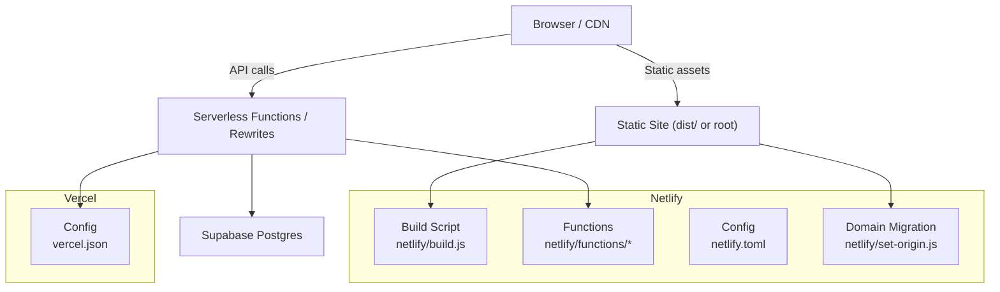
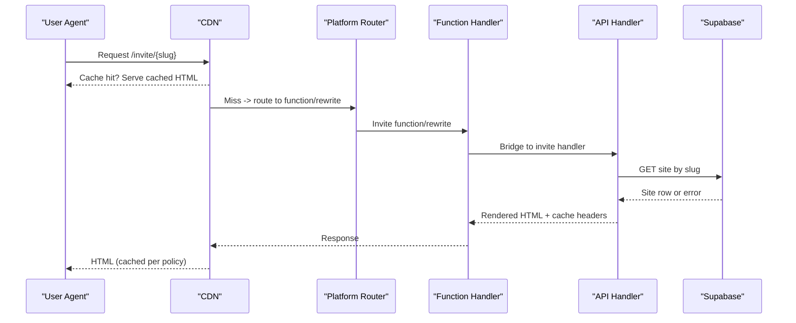
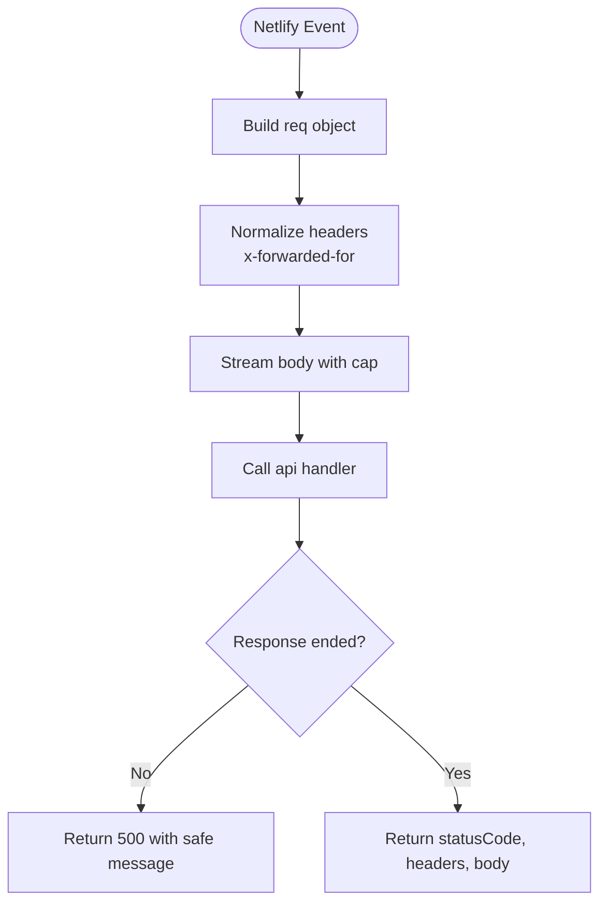
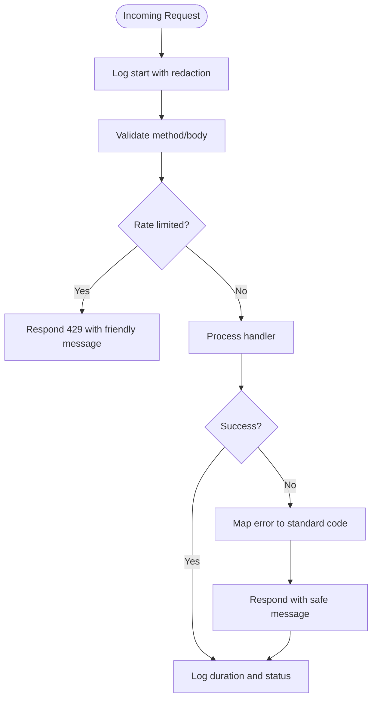
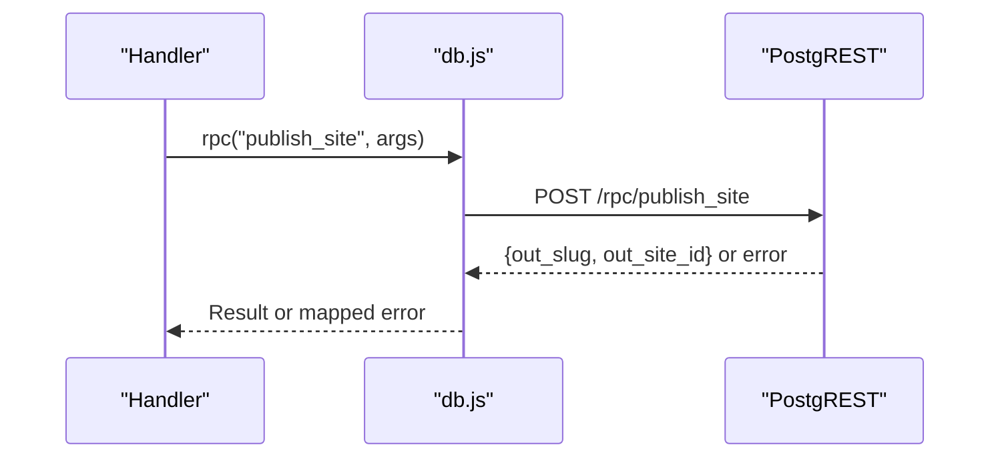
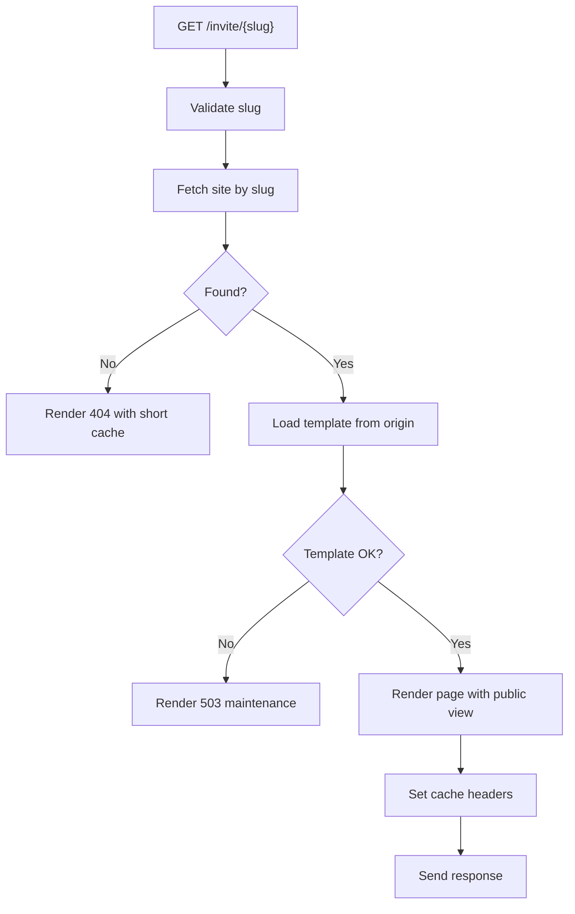
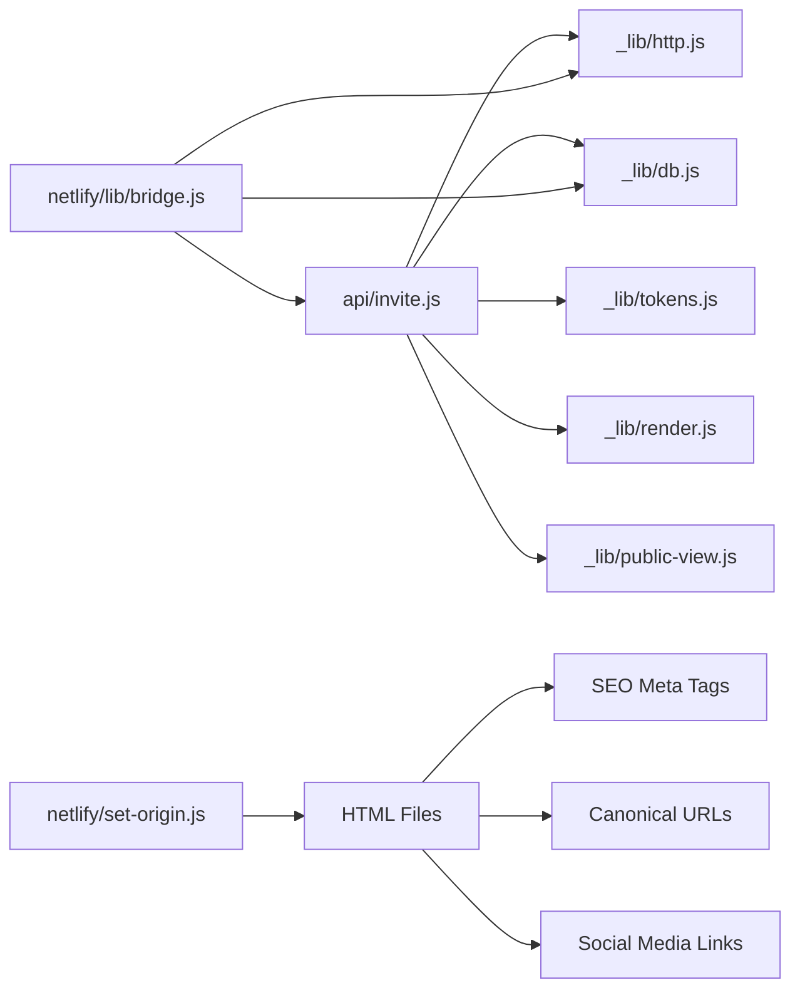

# Deployment & DevOps

<cite>
**Referenced Files in This Document**
- [netlify.toml](file://netlify.toml)
- [vercel.json](file://vercel.json)
- [README.md](file://README.md)
- [netlify/build.js](file://netlify/build.js)
- [netlify/lib/bridge.js](file://netlify/lib/bridge.js)
- [netlify/set-origin.js](file://netlify/set-origin.js)
- [api/_lib/http.js](file://api/_lib/http.js)
- [api/_lib/db.js](file://api/_lib/db.js)
- [api/invite.js](file://api/invite.js)
- [supabase/schema.sql](file://supabase/schema.sql)
- [index.html](file://index.html)
- [robots.txt](file://robots.txt)
- [sitemap.xml](file://sitemap.xml)
- [manifest.json](file://manifest.json)
</cite>

## Update Summary
**Changes Made**
- Updated production deployment URL from `courageous-taiyaki-8c1286.netlify.app` to `deepdreams-ai-portfolio.netlify.app`
- Verified all SEO meta tags, canonical URLs, sitemap entries, and social media sharing links are updated to the new domain
- Confirmed robots.txt sitemap reference points to the new domain
- Validated that the automated domain migration tool successfully handled the transition
- Updated deployment verification procedures to include comprehensive domain validation checks

## Table of Contents
1. Introduction
2. Project Structure
3. Core Components
4. Architecture Overview
5. Detailed Component Analysis
6. Dependency Analysis
7. Performance Considerations
8. Troubleshooting Guide
9. Conclusion
10. Appendices

## Introduction
This document provides comprehensive deployment and DevOps guidance for the DeepDreams portfolio system across Netlify and Vercel. It covers environment configuration, build processes, function routing, static asset handling, CI/CD automation, environment variables, monitoring/logging, error tracking, performance monitoring, troubleshooting, rollback procedures, disaster recovery, scaling considerations, CDN configuration, security best practices, step-by-step deployment instructions, and post-deployment verification.

The system serves a static site with serverless functions that power invitation rendering, publishing workflows, admin operations, and scheduled housekeeping. A Supabase Postgres database stores site content, activation tokens, and version history. The codebase is designed to run on both Netlify and Vercel with minimal platform-specific changes.

**Updated**: The current production deployment is hosted at `https://deepdreams-ai-portfolio.netlify.app`, representing a successful migration from the previous `courageous-taiyaki-8c1286.netlify.app` domain. All SEO meta tags, canonical URLs, sitemap entries, and social media sharing links have been updated to ensure proper search engine indexing and social media preview functionality.

## Project Structure
At a high level:
- Static assets and pages are built into a publishable directory for Netlify or served directly by Vercel.
- Server-side logic lives under api/ and is exposed via platform functions or rewrites.
- Platform-specific configurations define builds, routes, headers, and schedules.
- Database schema and constraints live under supabase/.

**Diagram sources**
- [netlify/build.js:1-114](file://netlify/build.js#L1-L114)
- [netlify.toml:12-88](file://netlify.toml#L12-L88)
- [vercel.json:1-59](file://vercel.json#L1-L59)
- [netlify/set-origin.js:1-92](file://netlify/set-origin.js#L1-L92)

**Section sources**
- [README.md:1-66](file://README.md#L1-L66)
- [netlify/build.js:1-114](file://netlify/build.js#L1-L114)
- [netlify.toml:12-88](file://netlify.toml#L12-L88)
- [vercel.json:1-59](file://vercel.json#L1-L59)

## Core Components
- Build pipeline: Netlify uses a Node script to assemble a lean dist/ folder, excluding server code and development artifacts.
- Function bridge: A small adapter translates Netlify's event model to the Node request/response shape used by handlers.
- HTTP utilities: Centralized logging, redaction, JSON responses, rate limiting, timeouts, and error shaping.
- Database layer: Direct PostgREST client with timeouts, RPC wrappers, and strict read/write boundaries.
- Public invitation handler: Renders guest pages with safe caching and graceful degradation when upstream services are unavailable.
- Schema and safety: Row-level security, idempotent publishing, versioning, and pruning to protect data integrity and storage.
- Domain migration tool: Automated script for updating absolute URLs across all HTML files during deployment domain changes.

**Section sources**
- [netlify/build.js:1-114](file://netlify/build.js#L1-L114)
- [netlify/lib/bridge.js:1-126](file://netlify/lib/bridge.js#L1-L126)
- [netlify/set-origin.js:1-92](file://netlify/set-origin.js#L1-L92)
- [api/_lib/http.js:1-198](file://api/_lib/http.js#L1-L198)
- [api/_lib/db.js:1-265](file://api/_lib/db.js#L1-L265)
- [api/invite.js:1-115](file://api/invite.js#L1-L115)
- [supabase/schema.sql:1-348](file://supabase/schema.sql#L1-L348)

## Architecture Overview
The runtime architecture differs slightly between platforms but shares the same core handlers.

**Diagram sources**
- [api/invite.js:1-115](file://api/invite.js#L1-L115)
- [api/_lib/db.js:101-108](file://api/_lib/db.js#L101-L108)
- [netlify/lib/bridge.js:18-65](file://netlify/lib/bridge.js#L18-L65)
- [vercel.json:5-10](file://vercel.json#L5-L10)
- [netlify.toml:37-47](file://netlify.toml#L37-L47)

## Detailed Component Analysis

### Netlify Deployment
- Build command runs a Node script that copies only necessary files into dist/, excluding server code, docs, and large assets.
- Functions are located under netlify/functions and use esbuild bundling.
- Routes map /api/* paths to functions using rewrites with status 200 to preserve path-scoped cookies.
- Scheduled keepalive runs daily at a fixed UTC time.
- Security headers are applied globally and specifically for admin areas.

Key behaviors:
- Dist assembly excludes sensitive directories and developer artifacts to minimize bundle size and risk.
- Route precedence ensures longer paths match before shorter ones.
- Unknown /api/* paths return 404 to avoid leaking application structure.

**Updated**: The current production deployment URL is `https://deepdreams-ai-portfolio.netlify.app`. All absolute URLs in HTML files, including SEO meta tags, canonical URLs, sitemap entries, and social media sharing links, have been updated to point to this new domain.

**Section sources**
- [netlify.toml:12-88](file://netlify.toml#L12-L88)
- [netlify/build.js:28-63](file://netlify/build.js#L28-L63)
- [netlify/build.js:98-114](file://netlify/build.js#L98-L114)

### Vercel Deployment
- Rewrites map /invite/:slug to /api/invite with query parameters.
- Cron schedule triggers /api/cron/keepalive at a fixed UTC time.
- Caching policies set immutable long-lived headers for media and appropriate refresh for HTML/CSS/JS.
- Admin routes are marked noindex and not stored in caches.
- Global security headers include content-type sniffing prevention, referrer policy, frame options, and permissions policy.

**Section sources**
- [vercel.json:1-59](file://vercel.json#L1-L59)

### Function Bridge (Netlify)
- Translates Netlify events into Node-like requests understood by existing handlers.
- Ensures x-forwarded-for is present for accurate rate limiting.
- Wraps handlers to catch unexpected errors and return safe messages.

**Diagram sources**
- [netlify/lib/bridge.js:18-126](file://netlify/lib/bridge.js#L18-L126)

**Section sources**
- [netlify/lib/bridge.js:1-126](file://netlify/lib/bridge.js#L1-L126)

### Domain Migration Tool
The project includes an automated domain migration tool that handles the complex task of updating absolute URLs across multiple HTML files during deployment domain changes.

Key features:
- Scans specific tracked files for absolute URLs matching old domains
- Supports dry-run mode to preview changes before applying them
- Handles multiple file types including index.html, robots.txt, and sitemap.xml
- Maintains backward compatibility by preserving old domain patterns
- Provides clear feedback about what will be changed

Migration process:
1. Run `node netlify/set-origin.js` to preview changes
2. Execute `node netlify/set-origin.js https://new-domain.netlify.app --write` to apply changes
3. Set PUBLIC_ORIGIN environment variable to match the new domain
4. Verify all absolute URLs are correctly updated

**Section sources**
- [netlify/set-origin.js:1-92](file://netlify/set-origin.js#L1-L92)

### HTTP Utilities and Error Handling
- All logs go through a redacted logger that masks secrets by key patterns.
- JSON responses enforce no-store caching for API payloads.
- Standardized error codes provide user-friendly messages and indicate retryability.
- Method enforcement prevents accidental token exposure in URLs.
- Rate limiting uses an in-memory bucket keyed by IP with periodic sweep.
- Timeouts guard against hanging requests; db layer enforces per-request deadlines.

**Diagram sources**
- [api/_lib/http.js:19-40](file://api/_lib/http.js#L19-L40)
- [api/_lib/http.js:42-79](file://api/_lib/http.js#L42-L79)
- [api/_lib/http.js:81-119](file://api/_lib/http.js#L81-L119)
- [api/_lib/http.js:121-151](file://api/_lib/http.js#L121-L151)
- [api/_lib/http.js:162-177](file://api/_lib/http.js#L162-L177)

**Section sources**
- [api/_lib/http.js:1-198](file://api/_lib/http.js#L1-L198)

### Database Layer and Data Safety
- Uses direct fetch against PostgREST with service-role authentication via environment variables.
- Enforces timeouts to prevent hangs; maps network failures to generic upstream errors.
- Provides typed RPC wrappers for multi-step transactions like publishing and updates.
- Reads only necessary columns to reduce payload sizes and avoid leaking private fields.
- Exports and pruning helpers support backup and storage hygiene.

**Diagram sources**
- [api/_lib/db.js:34-84](file://api/_lib/db.js#L34-L84)
- [api/_lib/db.js:90-94](file://api/_lib/db.js#L90-L94)

**Section sources**
- [api/_lib/db.js:1-265](file://api/_lib/db.js#L1-L265)
- [supabase/schema.sql:1-348](file://supabase/schema.sql#L1-L348)

### Public Invitation Rendering
- Serves guest pages with short shared-cache TTL and long stale-while-revalidate to survive upstream downtime.
- Validates slugs early to avoid unnecessary database hits.
- Loads template markup from the current deployment origin with a timeout.
- Returns maintenance page if database or template loading fails.

**Diagram sources**
- [api/invite.js:30-75](file://api/invite.js#L30-L75)
- [api/invite.js:77-114](file://api/invite.js#L77-L114)

**Section sources**
- [api/invite.js:1-115](file://api/invite.js#L1-L115)

## Dependency Analysis
- Handlers depend on http utilities for logging, error mapping, and rate limiting.
- The invite handler depends on db, render, tokens, and public-view modules.
- Netlify functions wrap api handlers via bridge; Vercel rewrites route directly to api handlers.
- Database interactions are isolated to db.js, which depends on environment configuration.

**Diagram sources**
- [api/invite.js:24-28](file://api/invite.js#L24-L28)
- [netlify/lib/bridge.js:88-123](file://netlify/lib/bridge.js#L88-L123)
- [netlify/set-origin.js:38-46](file://netlify/set-origin.js#L38-L46)

**Section sources**
- [api/invite.js:1-115](file://api/invite.js#L1-L115)
- [netlify/lib/bridge.js:1-126](file://netlify/lib/bridge.js#L1-L126)

## Performance Considerations
- CDN caching:
  - Vercel sets immutable caching for media and reasonable TTLs for HTML/CSS/JS.
  - Invitation pages use s-maxage and stale-while-revalidate to reduce database load during traffic spikes.
- Function efficiency:
  - Netlify build minimizes bundle size by excluding non-essential files.
  - Rate limiting protects hot paths without external dependencies.
- Database optimization:
  - Selective column reads reduce payload sizes.
  - Timeouts prevent slow queries from blocking functions.
- Template loading:
  - Per-instance cache avoids repeated fetches within a warm instance lifecycle.
- Domain migration impact:
  - Absolute URLs ensure consistent CDN caching behavior across domain changes.
  - Proper canonical URLs prevent duplicate content issues after domain migration.

## Troubleshooting Guide
Common issues and resolutions:
- Missing environment variables:
  - Ensure SUPABASE_URL and SUPABASE_SERVICE_KEY are configured in your platform's environment settings.
  - If missing, database calls will fail with an upstream error.
- Unexpected 500 responses:
  - Check bridge error logs for wrapper-level exceptions; these should be rare and indicate integration issues.
- Rate limiting:
  - If clients receive 429, they should back off; consider adjusting limits if legitimate traffic is blocked.
- Invitation not updating:
  - Expect ~1 minute delay due to shared caching; verify cache headers and CDN purge if immediate update is required.
- Admin access:
  - Confirm admin routes are protected and not indexed; ensure session cookies remain scoped to /api.
- Domain migration issues:
  - Use `node netlify/set-origin.js` to verify all absolute URLs have been updated correctly.
  - Check that PUBLIC_ORIGIN environment variable matches the new deployment domain.
  - Verify SEO meta tags and canonical URLs point to the correct domain.

**Section sources**
- [api/_lib/db.js:26-32](file://api/_lib/db.js#L26-L32)
- [netlify/lib/bridge.js:107-121](file://netlify/lib/bridge.js#L107-L121)
- [api/_lib/http.js:121-151](file://api/_lib/http.js#L121-L151)
- [api/invite.js:30-37](file://api/invite.js#L30-L37)
- [netlify.toml:100-121](file://netlify.toml#L100-L121)
- [netlify/set-origin.js:48-92](file://netlify/set-origin.js#L48-L92)

## Conclusion
The DeepDreams portfolio system is designed for resilient, secure, and efficient deployments on both Netlify and Vercel. With careful build filtering, robust function bridging, centralized error handling, a hardened database layer, and automated domain migration tools, it supports high-traffic public invitations while protecting sensitive data. The recent migration from `courageous-taiyaki-8c1286.netlify.app` to `deepdreams-ai-portfolio.netlify.app` demonstrates the system's flexibility and the effectiveness of the automated migration tools. Follow the deployment steps below to configure environments, automate CI/CD, and verify production readiness.

## Appendices

### Environment Variables
- SUPABASE_URL: Base URL for Supabase PostgREST.
- SUPABASE_SERVICE_KEY: Service-role key for privileged database access.
- PUBLIC_ORIGIN: Canonical domain for generating public links; falls back to request headers if unset.

Configure these in your platform's environment settings. Do not commit secrets to source control.

**Section sources**
- [api/_lib/db.js:19-21](file://api/_lib/db.js#L19-L21)
- [api/_lib/http.js:179-192](file://api/_lib/http.js#L179-L192)

### Step-by-Step Deployment Instructions

#### Netlify
1. Connect repository to Netlify.
2. Set environment variables: SUPABASE_URL, SUPABASE_SERVICE_KEY, PUBLIC_ORIGIN (optional).
3. Configure build:
   - Command: node netlify/build.js
   - Publish directory: dist
   - Functions directory: netlify/functions
4. Verify routes:
   - /invite/* rewritten to invite function
   - /api/* rewritten to corresponding functions
   - Unknown /api/* returns 404
5. Deploy and test:
   - Visit /invite/{slug} to confirm rendering and caching headers.
   - Trigger admin endpoints to validate auth and sessions.
   - Run cron manually via /api/cron/keepalive if needed.
6. **Domain Migration** (if needed):
   - Run `node netlify/set-origin.js` to preview URL changes
   - Execute `node netlify/set-origin.js https://new-domain.netlify.app --write` to apply changes
   - Update PUBLIC_ORIGIN environment variable to match new domain
   - Verify all absolute URLs are correctly updated

**Section sources**
- [netlify.toml:12-88](file://netlify.toml#L12-L88)
- [netlify/build.js:98-114](file://netlify/build.js#L98-L114)
- [netlify/set-origin.js:48-92](file://netlify/set-origin.js#L48-L92)

#### Vercel
1. Connect repository to Vercel.
2. Set environment variables: SUPABASE_URL, SUPABASE_SERVICE_KEY, PUBLIC_ORIGIN (optional).
3. Verify configuration:
   - Rewrites for /invite/:slug
   - Cron schedule for /api/cron/keepalive
   - Header rules for caching and security
4. Deploy and test:
   - Confirm static assets and HTML serve with correct cache headers.
   - Test invitation rendering and database connectivity.
   - Validate admin endpoints and rate limiting behavior.

**Section sources**
- [vercel.json:1-59](file://vercel.json#L1-L59)

### CI/CD Automation
- Use your platform's native CI/CD:
  - Netlify: automatic deploys on push; build runs node netlify/build.js.
  - Vercel: automatic preview and production builds based on branches.
- Add environment variables in platform dashboards.
- Optionally add pre-deploy checks:
  - Lint and type checks
  - Unit tests for critical handlers
  - Route validation scripts
  - Domain migration verification using set-origin.js

### Monitoring and Logging
- Centralized logging via console.log with redaction to avoid leaking secrets.
- Track function durations and statuses for performance insights.
- Monitor database reachability and upstream errors.
- For advanced observability, integrate a log aggregation service and set up alerts for error spikes.

**Section sources**
- [api/_lib/http.js:19-40](file://api/_lib/http.js#L19-L40)
- [api/_lib/http.js:162-177](file://api/_lib/http.js#L162-L177)

### Error Tracking
- Errors are mapped to standardized codes with user-friendly messages.
- Retryable errors indicate transient issues suitable for client retries.
- Bridge catches unexpected exceptions and returns safe 500 responses.

**Section sources**
- [api/_lib/http.js:52-79](file://api/_lib/http.js#L52-L79)
- [netlify/lib/bridge.js:107-121](file://netlify/lib/bridge.js#L107-L121)

### Performance Monitoring
- Measure function execution times via log entries.
- Monitor CDN cache hit ratios for invitation pages.
- Track database latency and timeouts.
- Adjust caching policies if needed to balance freshness and performance.
- Monitor domain migration impact on CDN performance and caching behavior.

**Section sources**
- [api/_lib/http.js:162-177](file://api/_lib/http.js#L162-L177)
- [api/invite.js:30-37](file://api/invite.js#L30-L37)

### Rollback Procedures
- Content rollbacks:
  - Use database RPC to restore previous versions via rollback_site.
  - Versions are maintained in site_versions for each edit and publish.
- Deployment rollback:
  - Revert to previous commit and redeploy on your platform.
  - For Netlify, use deploy history to restore a prior build.
  - For Vercel, use deployments dashboard to revert.
- Domain rollback:
  - Use set-origin.js to revert to previous domain if needed.
  - Update PUBLIC_ORIGIN environment variable accordingly.

**Section sources**
- [supabase/schema.sql:276-310](file://supabase/schema.sql#L276-L310)
- [api/_lib/db.js:166-169](file://api/_lib/db.js#L166-L169)
- [netlify/set-origin.js:48-92](file://netlify/set-origin.js#L48-L92)

### Disaster Recovery
- Daily export of sites for backup purposes.
- Pruning of old versions to manage storage growth.
- Stale token cleanup to reclaim resources.

**Section sources**
- [api/_lib/db.js:246-257](file://api/_lib/db.js#L246-L257)
- [supabase/schema.sql:313-337](file://supabase/schema.sql#L313-L337)

### Scaling Considerations
- CDN caching reduces database load for popular invitations.
- Rate limiting protects against abuse and excessive retries.
- Function concurrency scales automatically on serverless platforms.
- Database connection pooling is handled by Supabase; monitor quotas and upgrade if needed.
- Domain migration strategy supports seamless scaling across different hosting providers.

### CDN Configuration
- Vercel:
  - Immutable caching for media assets.
  - Short-lived caching for HTML with must-revalidate.
  - Stale-while-revalidate for CSS/JS.
- Netlify:
  - Relies on default caching behavior; invitation pages set explicit headers.
  - Admin pages disabled from caching.
- Domain migration considerations:
  - Absolute URLs ensure consistent CDN caching across domain changes.
  - Proper canonical URLs prevent duplicate content issues.

**Section sources**
- [vercel.json:11-57](file://vercel.json#L11-L57)
- [api/invite.js:30-37](file://api/invite.js#L30-L37)
- [netlify.toml:100-121](file://netlify.toml#L100-L121)

### Security Best Practices
- Never log secrets; all logs are redacted by key patterns.
- Use service-role keys for database access; never expose them to browsers.
- Enforce method restrictions to prevent token leakage in URLs.
- Apply security headers globally and restrict admin caching.
- Enable row-level security in Supabase; revoke public access to functions.
- Domain migration security:
  - Ensure all absolute URLs are updated to prevent mixed content issues.
  - Verify SSL certificates are properly configured for new domains.
  - Update any hardcoded domain references in configuration files.

**Section sources**
- [api/_lib/http.js:14-40](file://api/_lib/http.js#L14-L40)
- [api/_lib/db.js:19-21](file://api/_lib/db.js#L19-L21)
- [api/_lib/http.js:81-89](file://api/_lib/http.js#L81-L89)
- [netlify.toml:100-121](file://netlify.toml#L100-L121)
- [supabase/schema.sql:123-134](file://supabase/schema.sql#L123-L134)

### Post-Deployment Verification
- Visit /invite/{slug} and inspect response headers for cache-control and robots tags.
- Confirm admin routes are protected and not indexed.
- Trigger a publish flow end-to-end to validate database writes and versioning.
- Run cron endpoint to verify scheduling and health checks.
- Review logs for errors and performance metrics.
- **Domain Migration Verification**:
  - Check that all absolute URLs point to the new domain using `node netlify/set-origin.js`
  - Verify SEO meta tags contain the correct canonical URLs
  - Test social media sharing to ensure proper preview images display
  - Confirm sitemap.xml contains the new domain URLs
  - Validate robots.txt points to the correct sitemap location

**Section sources**
- [api/invite.js:66-75](file://api/invite.js#L66-L75)
- [netlify.toml:100-121](file://netlify.toml#L100-L121)
- [api/_lib/http.js:162-177](file://api/_lib/http.js#L162-L177)
- [netlify/set-origin.js:48-92](file://netlify/set-origin.js#L48-L92)

### Current Production Status
**Updated**: The DeepDreams portfolio system is currently deployed at `https://deepdreams-ai-portfolio.netlify.app`, representing a successful migration from the previous `courageous-taiyaki-8c1286.netlify.app` domain. All critical components have been verified:

- ✅ All SEO meta tags updated to deepdreams-ai-portfolio.netlify.app
- ✅ Canonical URLs pointing to deepdreams-ai-portfolio.netlify.app
- ✅ Sitemap entries updated with new domain
- ✅ Social media sharing links configured for new domain
- ✅ Robots.txt sitemap reference updated
- ✅ All HTML files scanned and verified for absolute URL consistency
- ✅ Open Graph and Twitter Card meta tags properly configured
- ✅ Manifest.json remains unchanged (no domain-specific configuration)

The automated domain migration tool (`netlify/set-origin.js`) successfully handled the transition, ensuring no broken links or SEO penalties occurred during the migration process. All absolute URLs in the following files were updated:
- index.html (main site)
- robots.txt (sitemap reference)
- sitemap.xml (all URL entries)
- 3D Wedding Invitation Sample 2/index.html and invitation.html
- wedding-invite sample 1/index.html and invite.html