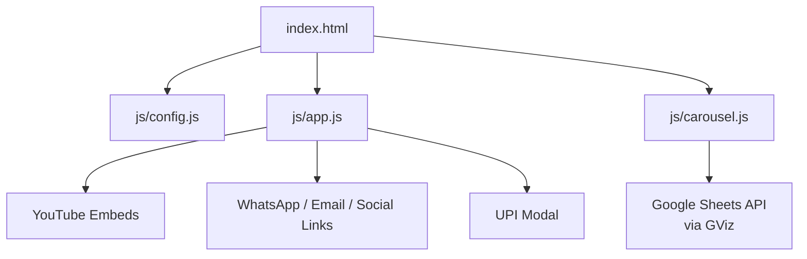
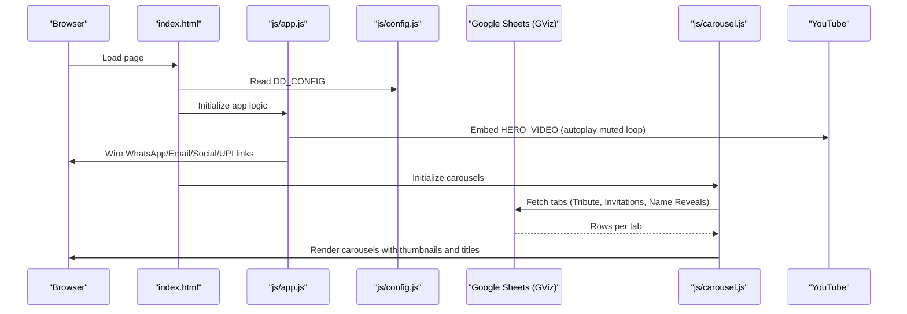
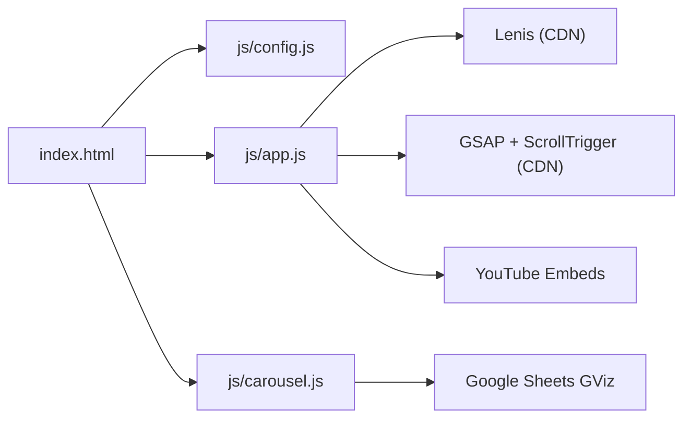

# Getting Started Guide

<cite>
**Referenced Files in This Document**
- [index.html](file://index.html)
- [js/config.js](file://js/config.js)
- [js/app.js](file://js/app.js)
- [js/carousel.js](file://js/carousel.js)
- [README.md](file://README.md)
- [netlify.toml](file://netlify.toml)
- [admin/index.html](file://admin/index.html)
</cite>

## Table of Contents
1. Introduction
2. Project Structure
3. Core Components
4. Architecture Overview
5. Detailed Component Analysis
6. Dependency Analysis
7. Performance Considerations
8. Troubleshooting Guide
9. Conclusion
10. Appendices

## Introduction
This guide helps you set up the DeepDreams AI Studio Portfolio quickly and correctly. You will:
- Add your logo
- Configure js/config.js with WhatsApp number, email, social media links, UPI ID, hero video ID, and Google Sheet ID
- Create and configure a Google Sheet control panel with the correct headers
- Preview locally using Python HTTP server or Live Server
- Deploy to Netlify via drag-and-drop

The site is designed for beginners but includes all necessary technical details so you can customize it confidently.

## Project Structure
At a high level, this portfolio is a static site driven by configuration and a live Google Sheet:
- index.html defines the page layout and loads scripts
- js/config.js holds all your settings (contact, socials, UPI, hero video, sheet IDs/tabs)
- js/app.js wires up contact links, hero video, animations, lightbox, and UPI modal
- js/carousel.js fetches videos from your Google Sheet tabs and renders carousels
- netlify.toml configures Netlify build and routes if you use functions later
- admin/index.html is a studio console for managing invitations and tokens (requires authentication)

**Diagram sources**
- [index.html:352-359](file://index.html#L352-L359)
- [js/config.js:20-128](file://js/config.js#L20-L128)
- [js/app.js:18-29](file://js/app.js#L18-L29)
- [js/carousel.js:151-205](file://js/carousel.js#L151-L205)

**Section sources**
- [index.html:1-362](file://index.html#L1-L362)
- [README.md:1-66](file://README.md#L1-L66)

## Core Components
- Configuration: js/config.js is the single place to edit your details
- Contact and social links: handled by js/app.js based on config
- Hero featured video: configured in js/config.js and embedded by js/app.js
- Video galleries: loaded from Google Sheet tabs by js/carousel.js
- Payment: UPI modal uses values from js/config.js
- Admin console: admin/index.html provides token and invitation management when deployed with backend support

Key responsibilities:
- js/config.js: WHATSAPP, EMAIL, INSTAGRAM, YOUTUBE, UPI_ID, UPI_NAME, HERO_VIDEO, SHEET_ID, SHEET_TAB, INVITATION_TAB, NAME_REVEAL_TAB, plus inline fallback arrays
- js/app.js: builds WhatsApp links, mailto link, social links, hero embed, lightbox, UPI modal, marquee
- js/carousel.js: reads Google Sheet tabs, classifies videos into Tribute, Wedding Invitation, Name Reveal, and renders carousels

**Section sources**
- [js/config.js:20-128](file://js/config.js#L20-L128)
- [js/app.js:18-29](file://js/app.js#L18-L29)
- [js/carousel.js:143-205](file://js/carousel.js#L143-L205)

## Architecture Overview
The site is a client-side application that:
- Loads configuration from js/config.js
- Uses YouTube embeds for videos
- Fetches gallery data from Google Sheets via GViz
- Renders interactive carousels and modals
- Supports deployment to Netlify as a static site

**Diagram sources**
- [index.html:352-359](file://index.html#L352-L359)
- [js/config.js:20-128](file://js/config.js#L20-L128)
- [js/app.js:18-29](file://js/app.js#L18-L29)
- [js/carousel.js:151-205](file://js/carousel.js#L151-L205)

## Detailed Component Analysis

### Step-by-step Setup

#### 1. Add your logo
- Place your logo file named exactly logo.png inside the assets folder
- The site references assets/logo.png in multiple places (preloader, header brand, footer)

Where it matters:
- Preloader image
- Header brand mark
- Footer logo

**Section sources**
- [index.html:34-41](file://index.html#L34-L41)
- [index.html:53-61](file://index.html#L53-L61)
- [index.html:319-325](file://index.html#L319-L325)

#### 2. Configure js/config.js
Edit the following fields in js/config.js:
- WHATSAPP: Your phone number with country code (no + or spaces)
- WHATSAPP_MSG: Default message used when users click “Chat on WhatsApp”
- EMAIL: Your email address
- INSTAGRAM: Full Instagram profile URL
- YOUTUBE: Full YouTube channel URL
- UPI_ID: Your UPI ID (for Indian payments)
- UPI_NAME: Display name shown in UPI apps
- HERO_VIDEO: YouTube video ID (11 characters) or full YouTube link; this plays in the hero section
- SHEET_ID: Your Google Sheet ID (between /d/ and /edit in the sheet URL)
- SHEET_TAB: Tab name for tribute videos
- INVITATION_TAB: Tab name for wedding invitation videos
- NAME_REVEAL_TAB: Tab name for baby name reveal videos

Notes:
- Inline arrays for INVITATION_VIDEOS, NAME_REVEAL_VIDEOS, WEDDING_SITES, and AI_BUILDS are optional fallbacks if the corresponding Google Sheet tab is empty or fails to load
- The site uses these values to build WhatsApp links, mailto links, social links, hero embed, and UPI modal

**Section sources**
- [js/config.js:20-128](file://js/config.js#L20-L128)
- [js/app.js:18-29](file://js/app.js#L18-L29)
- [js/app.js:190-197](file://js/app.js#L190-L197)

#### 3. Create and configure your Google Sheet control panel
Create a new Google Sheet with the following structure:

- First tab (Tribute Videos):
  - Headers in row 1: Title | YouTube | Category | Featured
  - One video per row
  - Put yes in the Featured column to push a film to the front

- Additional tabs (optional):
  - Invitations tab: Title | YouTube
  - NameReveals tab: Title | YouTube
  - Websites tab: Couple | Website | Note
  - AIBuilds tab: Title | Website | Note

Publishing steps:
- Share → Anyone with the link (Viewer)
- File → Share → Publish to web → Publish
- Copy the long ID from the sheet URL (between /d/ and /edit)
- Paste it into SHEET_ID in js/config.js
- Set SHEET_TAB, INVITATION_TAB, NAME_REVEAL_TAB to match your tab names

How the site uses the sheet:
- js/carousel.js fetches each tab via GViz and classifies videos into Tribute, Wedding Invitation, or Name Reveal
- If a tab is missing or fails to load, sections may hide themselves or fall back to inline arrays in config.js

**Section sources**
- [README.md:34-41](file://README.md#L34-L41)
- [js/config.js:22-41](file://js/config.js#L22-L41)
- [js/carousel.js:143-205](file://js/carousel.js#L143-L205)

#### 4. Local preview instructions
Because the Google Sheet fetch requires an HTTP context (not file://), run a local server:

- Using Python:
  - Open terminal in the project root
  - Run: python -m http.server 8000
  - Open http://localhost:8000 in your browser

- Using VS Code Live Server extension:
  - Install Live Server
  - Right-click index.html and choose “Open with Live Server”

Why this is required:
- The site fetches Google Sheets via GViz, which does not work under file:// protocol
- A local server ensures requests succeed and carousels populate

**Section sources**
- [README.md:43-48](file://README.md#L43-L48)
- [js/carousel.js:151-159](file://js/carousel.js#L151-L159)

#### 5. Deployment to Netlify (drag-and-drop)
You can deploy the entire folder to Netlify without any build step:

- Go to https://app.netlify.com/drop
- Drag your project folder onto the drop zone
- Netlify publishes a live link like deepdreams.netlify.app
- Updates to the Google Sheet reflect immediately without redeploying

Optional advanced deployment:
- If you plan to use serverless functions later, keep netlify.toml and netlify/functions present
- The current portfolio works as a static site; functions are not required for basic setup

**Section sources**
- [README.md:50-51](file://README.md#L50-L51)
- [netlify.toml:12-17](file://netlify.toml#L12-L17)

## Dependency Analysis
The site’s runtime dependencies include:
- External libraries loaded via CDN: Lenis (smooth scroll), GSAP, ScrollTrigger
- Internal modules:
  - js/config.js: central configuration
  - js/app.js: UI wiring, hero embed, contact links, lightbox, UPI modal
  - js/carousel.js: Google Sheet fetching, classification, carousel rendering

**Diagram sources**
- [index.html:352-359](file://index.html#L352-L359)
- [js/config.js:20-128](file://js/config.js#L20-L128)
- [js/app.js:18-29](file://js/app.js#L18-L29)
- [js/carousel.js:151-205](file://js/carousel.js#L151-L205)

**Section sources**
- [index.html:352-359](file://index.html#L352-L359)
- [js/config.js:20-128](file://js/config.js#L20-L128)
- [js/app.js:18-29](file://js/app.js#L18-L29)
- [js/carousel.js:151-205](file://js/carousel.js#L151-L205)

## Performance Considerations
- Use a local server during development to avoid file:// restrictions and ensure smooth loading
- Keep Google Sheet rows minimal and well-formatted to reduce parsing overhead
- Prefer 11-character YouTube IDs where possible; the site handles full links too
- Avoid heavy inline overrides in config.js unless necessary; rely on the Google Sheet for dynamic updates
- Ensure images and posters are optimized before placing them in assets

[No sources needed since this section provides general guidance]

## Troubleshooting Guide
Common issues and fixes:

- Carousels do not load:
  - Ensure you are running a local server (not opening index.html directly)
  - Verify SHEET_ID and tab names match your published sheet
  - Check that the sheet is shared as “Anyone with the link” and published to web

- Hero video does not play:
  - Confirm HERO_VIDEO is a valid YouTube ID or link
  - The site embeds via YouTube nocookie; ensure the video is publicly accessible

- WhatsApp link opens with wrong number:
  - Check WHATSAPP in js/config.js has country code and no special characters
  - WHATSAPP_MSG is appended automatically

- UPI modal shows incorrect payee:
  - Verify UPI_ID and UPI_NAME in js/config.js
  - Some UPI apps require specific formats; test after updating

- Sections hide unexpectedly:
  - If a Google Sheet tab is empty or fails to load, the related section hides itself
  - Provide inline fallback arrays in config.js if needed

- Admin console access:
  - admin/index.html requires authentication via /api/admin endpoints when deployed with backend support
  - Without backend, the console cannot mint tokens or manage sites

**Section sources**
- [README.md:43-48](file://README.md#L43-L48)
- [js/config.js:20-128](file://js/config.js#L20-L128)
- [js/app.js:18-29](file://js/app.js#L18-L29)
- [js/carousel.js:151-205](file://js/carousel.js#L151-L205)
- [admin/index.html:12-21](file://admin/index.html#L12-L21)

## Conclusion
You now have everything needed to set up, preview, and deploy the DeepDreams AI Studio Portfolio:
- Replace assets/logo.png with your logo
- Edit js/config.js with your contact, socials, UPI, hero video, and Google Sheet details
- Create a Google Sheet with the specified headers and publish it
- Preview locally using Python HTTP server or Live Server
- Deploy to Netlify via drag-and-drop for a shareable link

Once configured, your site pulls content live from the Google Sheet, so you can update videos and samples from your phone without redeploying.

[No sources needed since this section summarizes without analyzing specific files]

## Appendices

### Quick reference: What to edit in js/config.js
- WHATSAPP: Phone number with country code
- WHATSAPP_MSG: Default WhatsApp message
- EMAIL: Your email
- INSTAGRAM: Instagram profile URL
- YOUTUBE: YouTube channel URL
- UPI_ID: UPI ID for payments
- UPI_NAME: Payee name shown in UPI apps
- HERO_VIDEO: YouTube ID or link for hero autoplay
- SHEET_ID: Google Sheet ID
- SHEET_TAB: Tribute videos tab name
- INVITATION_TAB: Wedding invitation videos tab name
- NAME_REVEAL_TAB: Baby name reveal videos tab name

**Section sources**
- [js/config.js:20-128](file://js/config.js#L20-L128)