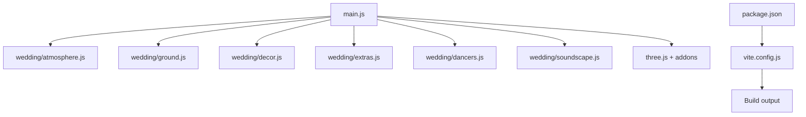
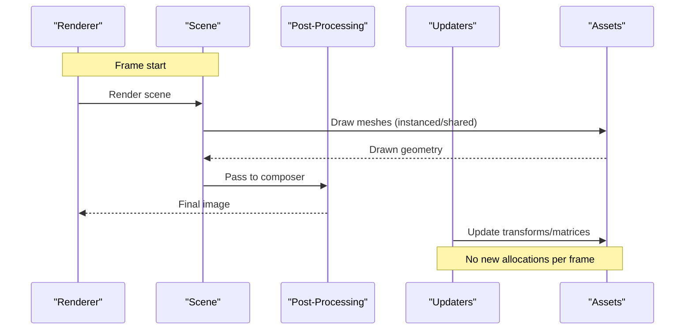
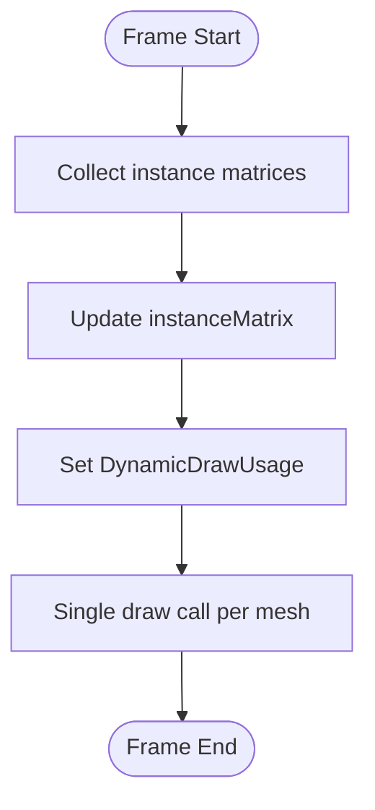
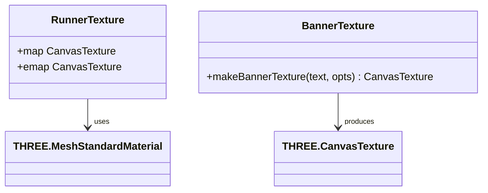
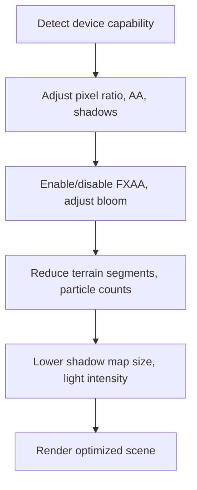
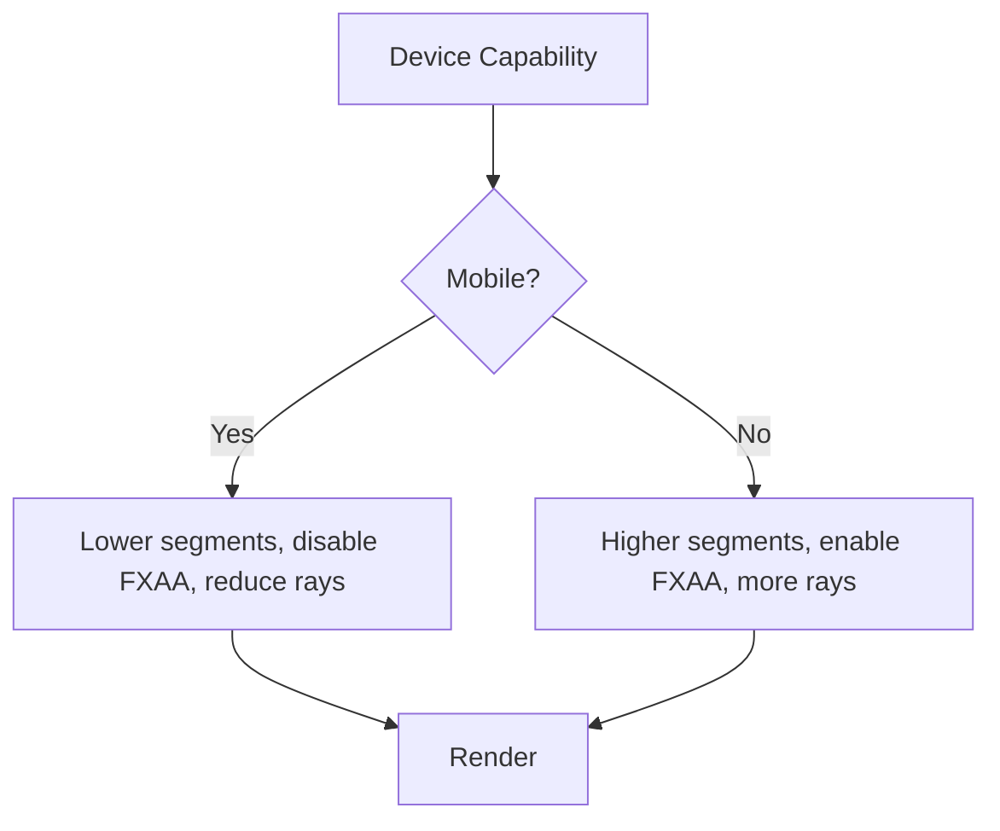
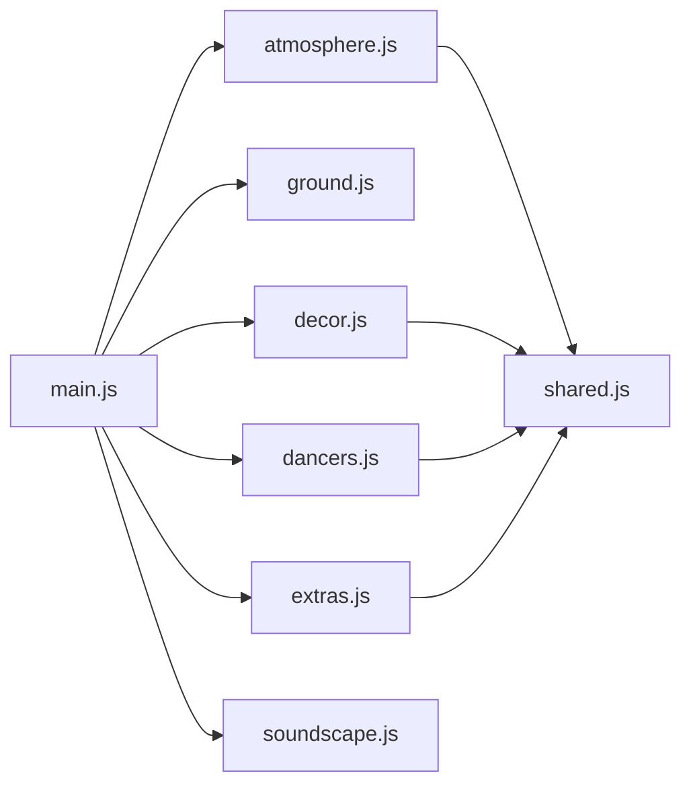

# 3D Rendering & WebGL Performance

<cite>
**Referenced Files in This Document**
- [main.js](file://3D Wedding Invitation Sample 2/3d-world-source/src/main.js)
- [atmosphere.js](file://3D Wedding Invitation Sample 2/3d-world-source/src/wedding/atmosphere.js)
- [decor.js](file://3D Wedding Invitation Sample 2/3d-world-source/src/wedding/decor.js)
- [extras.js](file://3D Wedding Invitation Sample 2/3d-world-source/src/wedding/extras.js)
- [ground.js](file://3D Wedding Invitation Sample 2/3d-world-source/src/wedding/ground.js)
- [dancers.js](file://3D Wedding Invitation Sample 2/3d-world-source/src/wedding/dancers.js)
- [soundscape.js](file://3D Wedding Invitation Sample 2/3d-world-source/src/wedding/soundscape.js)
- [package.json](file://3D Wedding Invitation Sample 2/3d-world-source/package.json)
- [vite.config.js](file://3D Wedding Invitation Sample 2/3d-world-source/vite.config.js)
</cite>

## Table of Contents
1. [Introduction](#introduction)
2. [Project Structure](#project-structure)
3. [Core Components](#core-components)
4. [Architecture Overview](#architecture-overview)
5. [Detailed Component Analysis](#detailed-component-analysis)
6. [Dependency Analysis](#dependency-analysis)
7. [Performance Considerations](#performance-considerations)
8. [Troubleshooting Guide](#troubleshooting-guide)
9. [Conclusion](#conclusion)
10. [Appendices](#appendices)

## Introduction
This document explains how the wedding invitation 3D world optimizes Three.js rendering for smooth, mobile-friendly performance while preserving a cinematic look. It covers geometry instancing, texture atlasing, draw call reduction, adaptive quality scaling based on device capabilities, memory management strategies, LOD-like techniques, particle and animation optimization, mobile WebGL constraints, battery and thermal considerations, and practical debugging/profiling approaches.

## Project Structure
The 3D scene is implemented as a modular Three.js application:
- main.js orchestrates scene setup, camera, lighting, post-processing, asset placement, and the render loop.
- wedding/* modules provide reusable assets (characters, props, atmosphere effects, ground, extras).
- Build configuration uses Vite to bundle efficiently and optionally produce a single-file build.



**Diagram sources**
- [main.js:1-24](file://3D Wedding Invitation Sample 2/3d-world-source/src/main.js#L1-L24)
- [vite.config.js:1-20](file://3D Wedding Invitation Sample 2/3d-world-source/vite.config.js#L1-L20)
- [package.json:1-22](file://3D Wedding Invitation Sample 2/3d-world-source/package.json#L1-L22)

**Section sources**
- [main.js:1-24](file://3D Wedding Invitation Sample 2/3d-world-source/src/main.js#L1-L24)
- [vite.config.js:1-20](file://3D Wedding Invitation Sample 2/3d-world-source/vite.config.js#L1-L20)
- [package.json:1-22](file://3D Wedding Invitation Sample 2/3d-world-source/package.json#L1-L22)

## Core Components
- Scene director and runtime: main.js sets up renderer, camera, controls, fog, post-processing, lighting, terrain, environment, and manages the animation loop and procession logic.
- Atmosphere effects: atmosphere.js provides petal particles via InstancedMesh and volumetric sun rays using shared geometry and lightweight textures.
- Ground and path: ground.js builds a procedural ceremonial runner with custom textures and emissive glow, plus rangoli medallions.
- Decor and props: decor.js creates small reusable ceremonial items (diyas, lanterns, garlands, kalash, petal trays) with shared materials.
- Extras: extras.js adds animated elements like an aerial banner plane, swans, money fountain, fireworks, and a waving banner—all optimized with instancing and minimal draw calls.
- Characters: dancers.js defines low-poly characters with shared materials and efficient per-frame animations.
- Audio: soundscape.js streams audio and schedules procedural sound events without heavy decoding.

Key performance patterns across components:
- Geometry instancing for repeated objects (flowers, grass, petals, money notes, sparks).
- Shared materials and cached material instances to reduce state changes.
- Procedural canvas textures instead of large image files.
- Adaptive quality toggles based on device capability detection.
- Lightweight post-processing tuned for mobile vs desktop.

**Section sources**
- [main.js:138-188](file://3D Wedding Invitation Sample 2/3d-world-source/src/main.js#L138-L188)
- [atmosphere.js:38-205](file://3D Wedding Invitation Sample 2/3d-world-source/src/wedding/atmosphere.js#L38-L205)
- [ground.js:113-192](file://3D Wedding Invitation Sample 2/3d-world-source/src/wedding/ground.js#L113-L192)
- [decor.js:27-135](file://3D Wedding Invitation Sample 2/3d-world-source/src/wedding/decor.js#L27-L135)
- [extras.js:10-112](file://3D Wedding Invitation Sample 2/3d-world-source/src/wedding/extras.js#L10-L112)
- [dancers.js:104-329](file://3D Wedding Invitation Sample 2/3d-world-source/src/wedding/dancers.js#L104-L329)
- [soundscape.js:31-639](file://3D Wedding Invitation Sample 2/3d-world-source/src/wedding/soundscape.js#L31-L639)

## Architecture Overview
The rendering pipeline emphasizes reducing draw calls and GPU workload while maintaining visual richness:
- Renderer and post-processing are configured once at startup with mobile-aware settings.
- Terrain and path are generated procedurally with vertex colors and custom textures.
- Repeated elements use InstancedMesh to batch geometry into single draw calls.
- Effects like petals and volumetric rays share geometry and textures.
- Character animations update transforms only; no new meshes or materials per frame.
- Audio streaming avoids large in-memory buffers.



**Diagram sources**
- [main.js:138-188](file://3D Wedding Invitation Sample 2/3d-world-source/src/main.js#L138-L188)
- [atmosphere.js:153-205](file://3D Wedding Invitation Sample 2/3d-world-source/src/wedding/atmosphere.js#L153-L205)
- [extras.js:153-202](file://3D Wedding Invitation Sample 2/3d-world-source/src/wedding/extras.js#L153-L202)

## Detailed Component Analysis

### Geometry Instancing and Draw Call Reduction
- Flowers and grass are rendered via InstancedMesh, minimizing draw calls by batching many identical geometries under one material.
- Petals use a single InstancedMesh with dynamic matrices updated each frame.
- Money fountain and fireworks use InstancedMesh for particles, updating instance matrices efficiently.



**Diagram sources**
- [main.js:793-834](file://3D Wedding Invitation Sample 2/3d-world-source/src/main.js#L793-L834)
- [atmosphere.js:153-205](file://3D Wedding Invitation Sample 2/3d-world-source/src/wedding/atmosphere.js#L153-L205)
- [extras.js:153-202](file://3D Wedding Invitation Sample 2/3d-world-source/src/wedding/extras.js#L153-L202)

**Section sources**
- [main.js:793-834](file://3D Wedding Invitation Sample 2/3d-world-source/src/main.js#L793-L834)
- [atmosphere.js:153-205](file://3D Wedding Invitation Sample 2/3d-world-source/src/wedding/atmosphere.js#L153-L205)
- [extras.js:153-202](file://3D Wedding Invitation Sample 2/3d-world-source/src/wedding/extras.js#L153-L202)

### Texture Atlasing and Procedural Textures
- Runner and rangoli use procedural canvas textures with color maps and emissive masks, avoiding external texture downloads and enabling atlas-like reuse within a single draw.
- Banner textures are generated on the fly and reused across planes, reducing texture count and memory overhead.



**Diagram sources**
- [ground.js:15-86](file://3D Wedding Invitation Sample 2/3d-world-source/src/wedding/ground.js#L15-L86)
- [ground.js:197-291](file://3D Wedding Invitation Sample 2/3d-world-source/src/wedding/ground.js#L197-L291)
- [extras.js:10-41](file://3D Wedding Invitation Sample 2/3d-world-source/src/wedding/extras.js#L10-L41)

**Section sources**
- [ground.js:15-86](file://3D Wedding Invitation Sample 2/3d-world-source/src/wedding/ground.js#L15-L86)
- [ground.js:197-291](file://3D Wedding Invitation Sample 2/3d-world-source/src/wedding/ground.js#L197-L291)
- [extras.js:10-41](file://3D Wedding Invitation Sample 2/3d-world-source/src/wedding/extras.js#L10-L41)

### Adaptive Quality Scaling Based on Device Capabilities
- Mobile detection adjusts pixel ratio, shadow map type, shadow resolution, antialiasing, and effect passes (e.g., FXAA disabled on mobile).
- Terrain segment count and particle counts scale down on mobile to reduce GPU load.
- Volumetric ray count and bloom parameters are tuned for mobile vs desktop.



**Diagram sources**
- [main.js:111-188](file://3D Wedding Invitation Sample 2/3d-world-source/src/main.js#L111-L188)
- [main.js:228-240](file://3D Wedding Invitation Sample 2/3d-world-source/src/main.js#L228-L240)
- [main.js:593-631](file://3D Wedding Invitation Sample 2/3d-world-source/src/main.js#L593-L631)
- [atmosphere.js:212-328](file://3D Wedding Invitation Sample 2/3d-world-source/src/wedding/atmosphere.js#L212-L328)

**Section sources**
- [main.js:111-188](file://3D Wedding Invitation Sample 2/3d-world-source/src/main.js#L111-L188)
- [main.js:228-240](file://3D Wedding Invitation Sample 2/3d-world-source/src/main.js#L228-L240)
- [main.js:593-631](file://3D Wedding Invitation Sample 2/3d-world-source/src/main.js#L593-L631)
- [atmosphere.js:212-328](file://3D Wedding Invitation Sample 2/3d-world-source/src/wedding/atmosphere.js#L212-L328)

### Memory Management Strategies for 3D Assets
- Shared materials and caches: Materials are created once and reused across instances (e.g., cloth cache in dancers.js), reducing memory churn.
- Procedural textures: Generated via Canvas API, avoiding large external assets and enabling on-demand creation.
- Streaming audio: The soundscape streams media rather than decoding entire tracks into memory, keeping mobile memory predictable.
- Instance updates: Use setMatrixAt and needsUpdate flags to avoid reallocating geometry per frame.

```mermaid
sequenceDiagram
participant M as "Main"
participant D as "Dancers"
participant T as "Textures"
participant A as "Audio"
M->>D : Create dancer instances
D->>D : Cache materials (cloth cache)
M->>T : Generate procedural textures
M->>A : Stream piano track
A-->>M : Resume/pause based on visibility
Note over M,D,T,A : Minimal allocations per frame
```

**Diagram sources**
- [dancers.js:16-39](file://3D Wedding Invitation Sample 2/3d-world-source/src/wedding/dancers.js#L16-L39)
- [extras.js:10-41](file://3D Wedding Invitation Sample 2/3d-world-source/src/wedding/extras.js#L10-L41)
- [soundscape.js:510-528](file://3D Wedding Invitation Sample 2/3d-world-source/src/wedding/soundscape.js#L510-L528)

**Section sources**
- [dancers.js:16-39](file://3D Wedding Invitation Sample 2/3d-world-source/src/wedding/dancers.js#L16-L39)
- [extras.js:10-41](file://3D Wedding Invitation Sample 2/3d-world-source/src/wedding/extras.js#L10-L41)
- [soundscape.js:510-528](file://3D Wedding Invitation Sample 2/3d-world-source/src/wedding/soundscape.js#L510-L528)

### LOD Systems and Level-of-Detail Techniques
While explicit LOD switching is not present, the scene implements LOD-like behaviors:
- Reduced terrain segments and particle counts on mobile.
- Disabling FXAA and lowering shadow quality on mobile.
- Reducing volumetric ray count and adjusting bloom thresholds for mobile.
- Using simple geometries for background elements (mountains, clouds, birds) with flat shading and fewer polygons.



**Diagram sources**
- [main.js:111-188](file://3D Wedding Invitation Sample 2/3d-world-source/src/main.js#L111-L188)
- [main.js:593-631](file://3D Wedding Invitation Sample 2/3d-world-source/src/main.js#L593-L631)
- [atmosphere.js:212-328](file://3D Wedding Invitation Sample 2/3d-world-source/src/wedding/atmosphere.js#L212-L328)

**Section sources**
- [main.js:111-188](file://3D Wedding Invitation Sample 2/3d-world-source/src/main.js#L111-L188)
- [main.js:593-631](file://3D Wedding Invitation Sample 2/3d-world-source/src/main.js#L593-L631)
- [atmosphere.js:212-328](file://3D Wedding Invitation Sample 2/3d-world-source/src/wedding/atmosphere.js#L212-L328)

### Particle Effect Optimization
- Petal system uses a single InstancedMesh with preallocated state arrays and dynamic matrix updates.
- Money fountain and fireworks use InstancedMesh for particles, updating positions and rotations per frame without creating new objects.
- Volumetric rays use shared geometry and lightweight gradient textures, minimizing GPU memory and draw calls.

**Section sources**
- [atmosphere.js:38-205](file://3D Wedding Invitation Sample 2/3d-world-source/src/wedding/atmosphere.js#L38-L205)
- [extras.js:153-202](file://3D Wedding Invitation Sample 2/3d-world-source/src/wedding/extras.js#L153-L202)
- [extras.js:208-257](file://3D Wedding Invitation Sample 2/3d-world-source/src/wedding/extras.js#L208-L257)

### Animation Performance Tuning
- Character animations update transforms only; no new meshes or materials per frame.
- Locomotion and dance animations are driven by time-based functions with minimal branching.
- Updaters are registered centrally and invoked once per frame, avoiding per-object scheduling overhead.

```mermaid
sequenceDiagram
participant Loop as "Render Loop"
participant U as "Updaters"
participant C as "Characters"
Loop->>U : Call update(t, dt)
U->>C : Update transforms
C-->>U : Matrices updated
Note over U,C : No allocations, minimal CPU work
```

**Diagram sources**
- [main.js:116-133](file://3D Wedding Invitation Sample 2/3d-world-source/src/main.js#L116-L133)
- [dancers.js:237-329](file://3D Wedding Invitation Sample 2/3d-world-source/src/wedding/dancers.js#L237-L329)

**Section sources**
- [main.js:116-133](file://3D Wedding Invitation Sample 2/3d-world-source/src/main.js#L116-L133)
- [dancers.js:237-329](file://3D Wedding Invitation Sample 2/3d-world-source/src/wedding/dancers.js#L237-L329)

### Mobile WebGL Limitations, Battery Optimization, and Thermal Throttling
- Pixel ratio capped on mobile to reduce fill rate pressure.
- Antialiasing disabled on mobile to save GPU cycles.
- Shadow maps reduced in resolution and switched to PCFSoftShadowMap only on desktop.
- Post-processing passes minimized on mobile (FXAA disabled).
- Audio context suspended when tab hidden to conserve battery.
- Procedural textures and instancing reduce memory bandwidth and GPU stress.

**Section sources**
- [main.js:111-188](file://3D Wedding Invitation Sample 2/3d-world-source/src/main.js#L111-L188)
- [soundscape.js:619-628](file://3D Wedding Invitation Sample 2/3d-world-source/src/wedding/soundscape.js#L619-L628)

### Debugging Tools and Performance Profiling Approaches
- Use browser DevTools Performance tab to capture frames and analyze GPU/CPU usage.
- Monitor draw calls, triangles, and shader compilation in WebGL inspector.
- Log frame times and object counts during development to identify spikes.
- Test on real devices to validate mobile-specific optimizations.

[No sources needed since this section provides general guidance]

## Dependency Analysis
The scene’s dependencies are organized to minimize coupling and maximize reuse:
- main.js depends on wedding/* modules for assets and effects.
- Each module encapsulates its own geometry, materials, and animations.
- Shared constants (palette) are exported and reused across modules.



**Diagram sources**
- [main.js:1-24](file://3D Wedding Invitation Sample 2/3d-world-source/src/main.js#L1-L24)
- [atmosphere.js:1-3](file://3D Wedding Invitation Sample 2/3d-world-source/src/wedding/atmosphere.js#L1-L3)
- [decor.js:1-3](file://3D Wedding Invitation Sample 2/3d-world-source/src/wedding/decor.js#L1-L3)
- [extras.js:1-5](file://3D Wedding Invitation Sample 2/3d-world-source/src/wedding/extras.js#L1-L5)
- [dancers.js:1-3](file://3D Wedding Invitation Sample 2/3d-world-source/src/wedding/dancers.js#L1-L3)

**Section sources**
- [main.js:1-24](file://3D Wedding Invitation Sample 2/3d-world-source/src/main.js#L1-L24)
- [atmosphere.js:1-3](file://3D Wedding Invitation Sample 2/3d-world-source/src/wedding/atmosphere.js#L1-L3)
- [decor.js:1-3](file://3D Wedding Invitation Sample 2/3d-world-source/src/wedding/decor.js#L1-L3)
- [extras.js:1-5](file://3D Wedding Invitation Sample 2/3d-world-source/src/wedding/extras.js#L1-L5)
- [dancers.js:1-3](file://3D Wedding Invitation Sample 2/3d-world-source/src/wedding/dancers.js#L1-L3)

## Performance Considerations
- Prioritize instancing for repeated geometry to reduce draw calls.
- Use procedural textures to avoid large asset downloads and enable atlas-like reuse.
- Adapt quality settings based on device capabilities to maintain smooth framerates.
- Minimize per-frame allocations; update matrices and properties in place.
- Stream audio instead of decoding large buffers to control memory usage.
- Leverage shared materials and caches to reduce state changes.

[No sources needed since this section provides general guidance]

## Troubleshooting Guide
- If performance drops on mobile, verify that mobile-specific toggles are active (pixel ratio, shadows, FXAA).
- Check for excessive draw calls by inspecting WebGL stats in DevTools.
- Ensure instanced meshes are using DynamicDrawUsage and updating instance matrices correctly.
- Validate that procedural textures are not being recreated every frame.
- Confirm audio context is suspended when tabs are hidden to conserve battery.

**Section sources**
- [main.js:111-188](file://3D Wedding Invitation Sample 2/3d-world-source/src/main.js#L111-L188)
- [atmosphere.js:153-205](file://3D Wedding Invitation Sample 2/3d-world-source/src/wedding/atmosphere.js#L153-L205)
- [soundscape.js:619-628](file://3D Wedding Invitation Sample 2/3d-world-source/src/wedding/soundscape.js#L619-L628)

## Conclusion
The wedding invitation 3D world achieves high-quality visuals while maintaining strong performance through careful use of instancing, procedural textures, adaptive quality scaling, and efficient animation updates. These techniques ensure smooth experiences across devices, especially on mobile where WebGL resources are constrained. By following these patterns, developers can create immersive 3D content that balances aesthetics with performance.

[No sources needed since this section summarizes without analyzing specific files]

## Appendices
- Build configuration supports both standard and single-file builds for easy distribution.
- Dependencies are managed via npm with Three.js as the core library.

**Section sources**
- [vite.config.js:1-20](file://3D Wedding Invitation Sample 2/3d-world-source/vite.config.js#L1-L20)
- [package.json:1-22](file://3D Wedding Invitation Sample 2/3d-world-source/package.json#L1-L22)