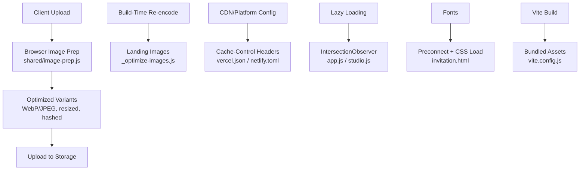
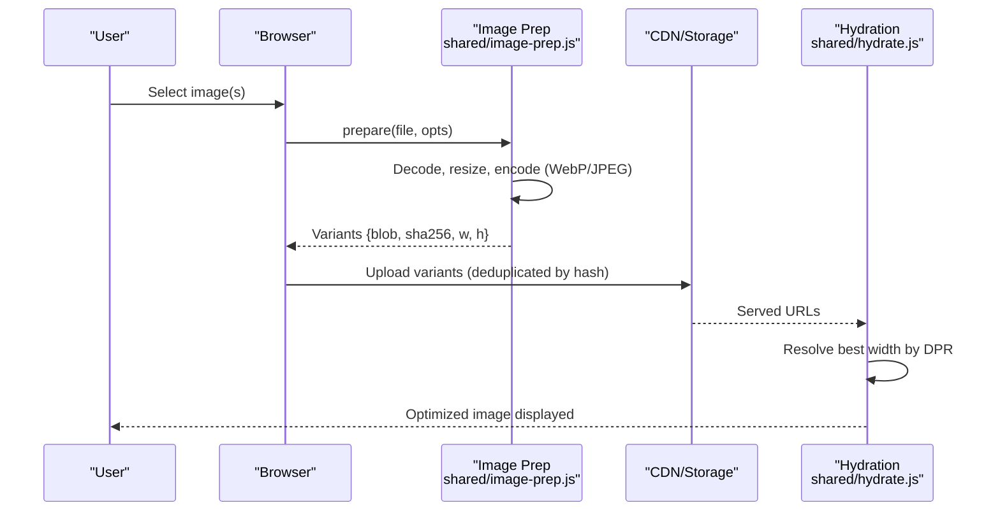
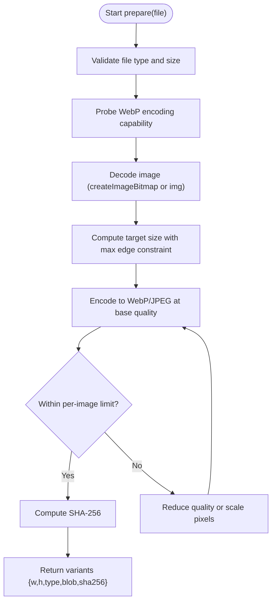
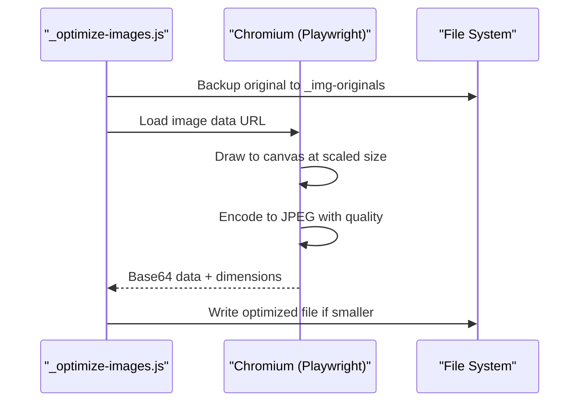
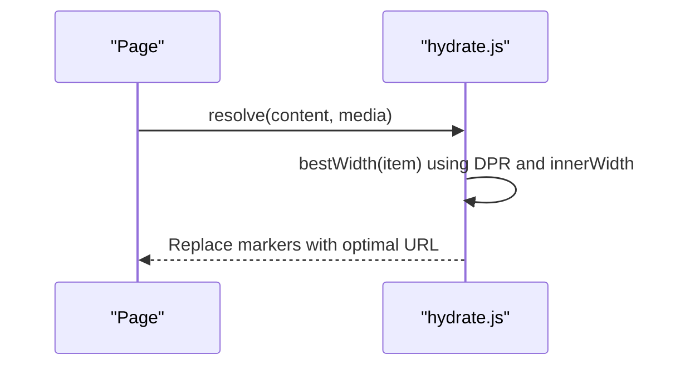
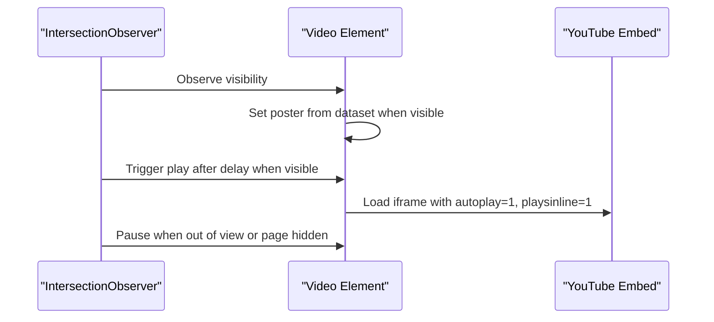
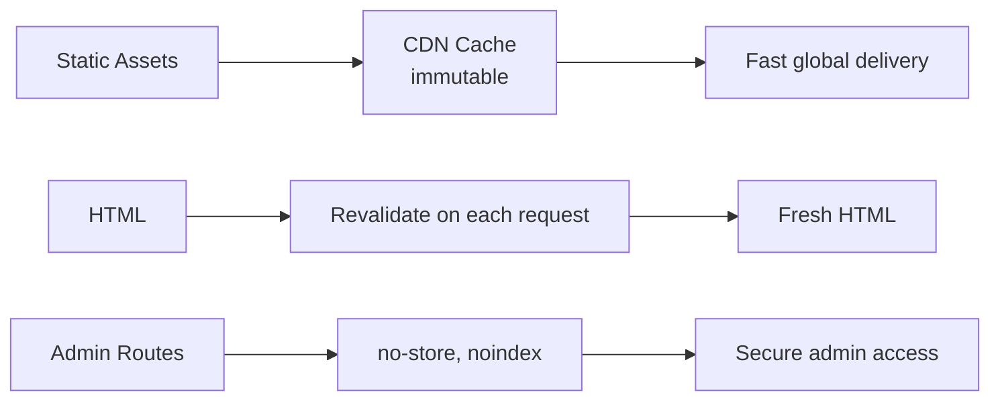
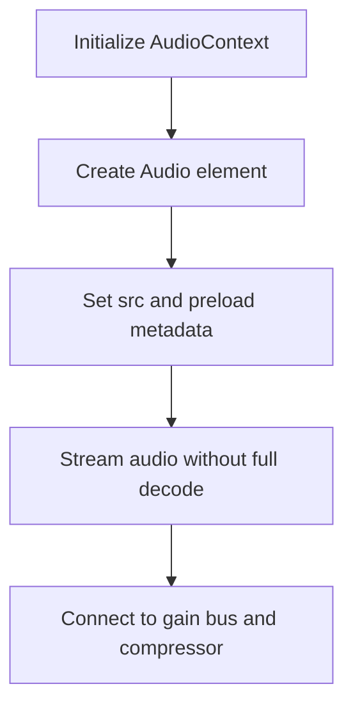
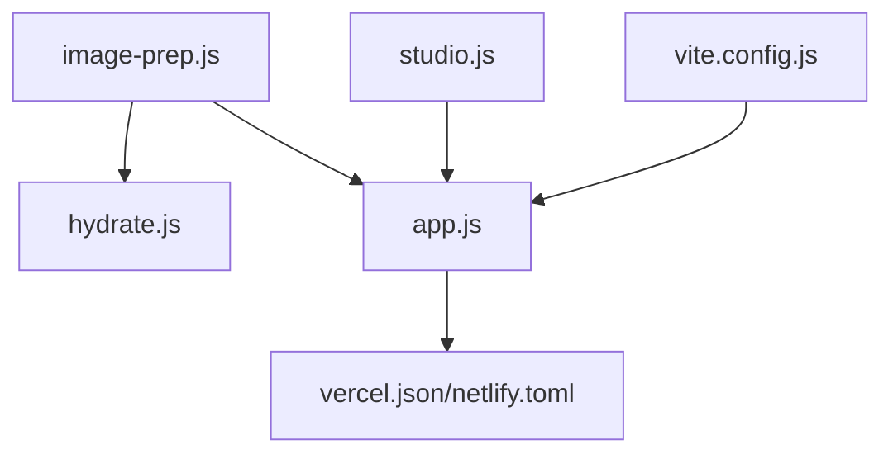

# Asset & Media Optimization

<cite>
**Referenced Files in This Document**
- [_optimize-images.js](file://_optimize-images.js)
- [shared/image-prep.js](file://shared/image-prep.js)
- [shared/hydrate.js](file://shared/hydrate.js)
- [vercel.json](file://vercel.json)
- [netlify.toml](file://netlify.toml)
- [3D Wedding Invitation Sample 2/app.js](file://3D%20Wedding%20Invitation%20Sample%202/app.js)
- [3D Wedding Invitation Sample 2/studio.js](file://3D%20Wedding%20Invitation%20Sample%202/studio.js)
- [3D Wedding Invitation Sample 2/invitation.html](file://3D%20Wedding%20Invitation%20Sample%202/invitation.html)
- [3D Wedding Invitation Sample 2/3d-world-source/vite.config.js](file://3D%20Wedding%20Invitation%20Sample%202/3d-world-source/vite.config.js)
- [manifest.json](file://manifest.json)
- [js/app.js](file://js/app.js)
- [shared/limits.js](file://shared/limits.js)
- [_weight.js](file://_weight.js)
</cite>

## Table of Contents
1. [Introduction](#introduction)
2. [Project Structure](#project-structure)
3. [Core Components](#core-components)
4. [Architecture Overview](#architecture-overview)
5. [Detailed Component Analysis](#detailed-component-analysis)
6. [Dependency Analysis](#dependency-analysis)
7. [Performance Considerations](#performance-considerations)
8. [Troubleshooting Guide](#troubleshooting-guide)
9. [Conclusion](#conclusion)
10. [Appendices](#appendices)

## Introduction
This document explains how the DeepDreams system optimizes assets and media for performance, bandwidth, and user experience. It covers:
- Automated image processing pipeline (compression, responsive variants, metadata stripping)
- Image preparation utilities (resizing, cropping constraints, format selection)
- Video optimization strategies for YouTube integration (lazy loading, poster handling)
- CDN and caching configuration patterns
- Audio asset optimization and font loading strategies
- Bundle size reduction techniques
- Monitoring and identifying optimization opportunities

## Project Structure
The project implements a mix of client-side and build-time optimizations:
- Client-side image preparation runs in the browser to produce optimized variants before upload
- Build-time scripts re-encode large images using headless Chrome to reduce payload sizes
- Delivery is configured via platform-specific files that set cache headers and security headers
- Lazy loading and intersection observers are used extensively to defer non-critical resources
- Fonts are preconnected and loaded via Google Fonts with versioned URLs
- The 3D world uses Vite to bundle assets efficiently and can produce single-file builds

**Diagram sources**
- [shared/image-prep.js:33-41](file://shared/image-prep.js#L33-L41)
- [_optimize-images.js:9-14](file://_optimize-images.js#L9-L14)
- [vercel.json:25-28](file://vercel.json#L25-L28)
- [netlify.toml:91-121](file://netlify.toml#L91-L121)
- [3D Wedding Invitation Sample 2/app.js:1266-1275](file://3D%20Wedding%20Invitation%20Sample%202/app.js#L1266-L1275)
- [3D Wedding Invitation Sample 2/studio.js:124-129](file://3D%20Wedding%20Invitation%20Sample%202/studio.js#L124-L129)
- [3D Wedding Invitation Sample 2/invitation.html:40-42](file://3D%20Wedding%20Invitation%20Sample%202/invitation.html#L40-L42)
- [3D Wedding Invitation Sample 2/3d-world-source/vite.config.js:9-18](file://3D%20Wedding%20Invitation%20Sample%202/3d-world-source/vite.config.js#L9-L18)

**Section sources**
- [shared/image-prep.js:1-41](file://shared/image-prep.js#L1-L41)
- [_optimize-images.js:1-14](file://_optimize-images.js#L1-L14)
- [vercel.json:12-28](file://vercel.json#L12-L28)
- [netlify.toml:91-121](file://netlify.toml#L91-L121)
- [3D Wedding Invitation Sample 2/app.js:1266-1275](file://3D%20Wedding%20Invitation%20Sample%202/app.js#L1266-L1275)
- [3D Wedding Invitation Sample 2/studio.js:124-129](file://3D%20Wedding%20Invitation%20Sample%202/studio.js#L124-L129)
- [3D Wedding Invitation Sample 2/invitation.html:40-42](file://3D%20Wedding%20Invitation%20Sample%202/invitation.html#L40-L42)
- [3D Wedding Invitation Sample 2/3d-world-source/vite.config.js:9-18](file://3D%20Wedding%20Invitation%20Sample%202/3d-world-source/vite.config.js#L9-L18)

## Core Components
- Browser-based image preparation:
  - Detects WebP encoding capability and falls back to JPEG when needed
  - Resizes images to target widths while enforcing maximum edge length
  - Iteratively reduces quality and pixel scale to meet per-image byte limits
  - Strips metadata by re-encoding through canvas
  - Computes SHA-256 hashes for deduplication and resume-friendly uploads
- Build-time image re-encoder:
  - Uses Playwright’s Chromium to re-encode specific landing images at reduced dimensions and quality
  - Backs up originals and writes optimized files in place
- Hydration and responsive resolution:
  - Selects best width variant based on device DPR and viewport
- CDN and caching:
  - Sets long-lived immutable cache for static assets
  - Applies security headers across routes
- Lazy loading and deferred playback:
  - Uses IntersectionObserver to load images and play videos only when near viewport
- Font loading strategy:
  - Preconnects to fonts.gstatic.com and loads fonts via CSS with versioned URLs
- Bundle optimization:
  - Vite config supports single-file builds and controls asset inlining and chunking

**Section sources**
- [shared/image-prep.js:43-64](file://shared/image-prep.js#L43-L64)
- [shared/image-prep.js:127-177](file://shared/image-prep.js#L127-L177)
- [shared/image-prep.js:179-195](file://shared/image-prep.js#L179-L195)
- [_optimize-images.js:18-48](file://_optimize-images.js#L18-L48)
- [shared/hydrate.js:55-77](file://shared/hydrate.js#L55-L77)
- [vercel.json:25-28](file://vercel.json#L25-L28)
- [3D Wedding Invitation Sample 2/app.js:1690-1747](file://3D%20Wedding%20Invitation%20Sample%202/app.js#L1690-L1747)
- [3D Wedding Invitation Sample 2/invitation.html:40-42](file://3D%20Wedding%20Invitation%20Sample%202/invitation.html#L40-L42)
- [3D Wedding Invitation Sample 2/3d-world-source/vite.config.js:9-18](file://3D%20Wedding%20Invitation%20Sample%202/3d-world-source/vite.config.js#L9-L18)

## Architecture Overview
The asset pipeline spans client-side preprocessing, build-time optimization, and delivery configuration:

**Diagram sources**
- [shared/image-prep.js:204-270](file://shared/image-prep.js#L204-L270)
- [shared/hydrate.js:55-77](file://shared/hydrate.js#L55-L77)

## Detailed Component Analysis

### Automated Image Processing Pipeline
- Capability detection:
  - Probes WebP encoding support once and caches result
  - Falls back to JPEG if WebP is not supported
- Decoding:
  - Prefers createImageBitmap for speed; falls back to  decoding
- Resizing and constraints:
  - Targets nominal widths (e.g., 640px, 1280px)
  - Enforces maximum edge length to avoid oversized canvases
- Encoding and quality stepping:
  - Encodes to WebP or JPEG with base quality
  - Steps down quality and then scales pixels if still over per-image limit
- Metadata stripping:
  - Canvas re-encode discards EXIF and other metadata
- Hashing:
  - Computes SHA-256 of encoded bytes for deduplication and resume
- Batch processing:
  - Processes multiple images sequentially to avoid memory pressure
  - Validates total media size against budget

**Diagram sources**
- [shared/image-prep.js:43-64](file://shared/image-prep.js#L43-L64)
- [shared/image-prep.js:127-177](file://shared/image-prep.js#L127-L177)
- [shared/image-prep.js:179-195](file://shared/image-prep.js#L179-L195)

**Section sources**
- [shared/image-prep.js:43-64](file://shared/image-prep.js#L43-L64)
- [shared/image-prep.js:127-177](file://shared/image-prep.js#L127-L177)
- [shared/image-prep.js:179-195](file://shared/image-prep.js#L179-L195)
- [shared/image-prep.js:204-270](file://shared/image-prep.js#L204-L270)

### Build-Time Image Re-Encoder
- Purpose:
  - Re-encodes oversized landing-page images in place without changing references
- Process:
  - Launches Chromium via Playwright
  - Draws image onto canvas at scaled dimensions
  - Encodes to JPEG with specified quality
  - Compares output size; skips if no gain
  - Backs up originals to a dedicated folder

**Diagram sources**
- [_optimize-images.js:18-48](file://_optimize-images.js#L18-L48)

**Section sources**
- [_optimize-images.js:9-14](file://_optimize-images.js#L9-L14)
- [_optimize-images.js:18-48](file://_optimize-images.js#L18-L48)

### Responsive Image Resolution and Hydration
- Hydration logic selects the best width variant based on device pixel ratio and viewport width
- Markers in content are replaced with resolved URLs during hydration

**Diagram sources**
- [shared/hydrate.js:55-77](file://shared/hydrate.js#L55-L77)

**Section sources**
- [shared/hydrate.js:55-77](file://shared/hydrate.js#L55-L77)

### Video Optimization Strategies for YouTube Integration
- Lazy loading:
  - Posters and video sources are set only when elements enter the viewport
  - Playback is delayed until the element is visible and page is not hidden
- Lightweight embedding:
  - Uses YouTube nocookie embed with autoplay and inline settings
- Resource gating:
  - Pauses all videos when leaving viewport or on page hide

**Diagram sources**
- [3D Wedding Invitation Sample 2/app.js:1690-1747](file://3D%20Wedding%20Invitation%20Sample%202/app.js#L1690-L1747)
- [js/app.js:146-168](file://js/app.js#L146-L168)

**Section sources**
- [3D Wedding Invitation Sample 2/app.js:1690-1747](file://3D%20Wedding%20Invitation%20Sample%202/app.js#L1690-L1747)
- [js/app.js:146-168](file://js/app.js#L146-L168)

### CDN Integration Patterns and Caching
- Long-lived immutable caching for static assets (images, fonts, audio):
  - Ensures efficient CDN caching and reduces revalidation overhead
- Security headers applied globally:
  - Prevents MIME sniffing, restricts framing, and sets strict referrer policy
- Admin areas disabled from indexing and caching:
  - Protects sensitive interfaces

**Diagram sources**
- [vercel.json:25-28](file://vercel.json#L25-L28)
- [vercel.json:43-47](file://vercel.json#L43-L47)
- [netlify.toml:100-121](file://netlify.toml#L100-L121)

**Section sources**
- [vercel.json:25-28](file://vercel.json#L25-L28)
- [vercel.json:43-47](file://vercel.json#L43-L47)
- [netlify.toml:100-121](file://netlify.toml#L100-L121)

### Audio Asset Optimization
- Persistent media element:
  - Uses a single Audio element with preload metadata to avoid decoding large tracks into memory
- Streaming audio:
  - Keeps one persistent source pair to minimize memory usage on mobile devices
- Synthesized sounds:
  - Some effects use Web Audio API oscillators instead of audio files to reduce payload

**Diagram sources**
- [3D Wedding Invitation Sample 2/3d-world-source/src/wedding/soundscape.js:498-524](file://3D%20Wedding%20Invitation%20Sample%202/3d-world-source/src/wedding/soundscape.js#L498-L524)

**Section sources**
- [3D Wedding Invitation Sample 2/3d-world-source/src/wedding/soundscape.js:498-524](file://3D%20Wedding%20Invitation%20Sample%202/3d-world-source/src/wedding/soundscape.js#L498-L524)

### Font Loading Strategies
- Preconnect to font providers to reduce connection setup time
- Use CSS @import or link tags with versioned URLs to enable caching
- Avoid blocking critical rendering by deferring non-critical fonts where possible

**Section sources**
- [3D Wedding Invitation Sample 2/invitation.html:40-42](file://3D%20Wedding%20Invitation%20Sample%202/invitation.html#L40-L42)

### Bundle Size Reduction Techniques
- Vite build options:
  - Single-file mode for self-contained distribution
  - Controls asset inlining and chunk size warnings
- Minimal dependencies:
  - Only essential libraries included (e.g., Three.js for 3D scenes)
- Efficient resource loading:
  - Lazy loading and deferred initialization reduce initial payload impact

**Section sources**
- [3D Wedding Invitation Sample 2/3d-world-source/vite.config.js:9-18](file://3D%20Wedding%20Invitation%20Sample%202/3d-world-source/vite.config.js#L9-L18)

## Dependency Analysis
Key relationships between components:
- shared/image-prep.js provides core image processing functions used by client flows
- shared/hydrate.js resolves optimal image URLs based on device capabilities
- Platform configs (vercel.json, netlify.toml) control caching and security headers
- app.js and studio.js implement lazy loading and interactive behaviors
- Vite config influences build outputs and asset bundling

**Diagram sources**
- [shared/image-prep.js:204-270](file://shared/image-prep.js#L204-L270)
- [shared/hydrate.js:55-77](file://shared/hydrate.js#L55-L77)
- [3D Wedding Invitation Sample 2/app.js:1266-1275](file://3D%20Wedding%20Invitation%20Sample%202/app.js#L1266-L1275)
- [3D Wedding Invitation Sample 2/studio.js:124-129](file://3D%20Wedding%20Invitation%20Sample%202/studio.js#L124-L129)
- [vercel.json:25-28](file://vercel.json#L25-L28)
- [netlify.toml:91-121](file://netlify.toml#L91-L121)
- [3D Wedding Invitation Sample 2/3d-world-source/vite.config.js:9-18](file://3D%20Wedding%20Invitation%20Sample%202/3d-world-source/vite.config.js#L9-L18)

**Section sources**
- [shared/image-prep.js:204-270](file://shared/image-prep.js#L204-L270)
- [shared/hydrate.js:55-77](file://shared/hydrate.js#L55-L77)
- [3D Wedding Invitation Sample 2/app.js:1266-1275](file://3D%20Wedding%20Invitation%20Sample%202/app.js#L1266-L1275)
- [3D Wedding Invitation Sample 2/studio.js:124-129](file://3D%20Wedding%20Invitation%20Sample%202/studio.js#L124-L129)
- [vercel.json:25-28](file://vercel.json#L25-L28)
- [netlify.toml:91-121](file://netlify.toml#L91-L121)
- [3D Wedding Invitation Sample 2/3d-world-source/vite.config.js:9-18](file://3D%20Wedding%20Invitation%20Sample%202/3d-world-source/vite.config.js#L9-L18)

## Performance Considerations
- Prefer client-side image preparation to avoid server load and ensure optimal formats
- Use responsive sizing and modern formats (WebP) when supported
- Apply immutable caching for static assets to maximize CDN efficiency
- Defer non-critical resources using IntersectionObserver
- Monitor first paint and full scroll weights to identify heavy assets
- Use budgets to guide decisions about adding new media

[No sources needed since this section provides general guidance]

## Troubleshooting Guide
Common issues and resolutions:
- Image too large:
  - The preparation pipeline will step down quality and pixel scale; if still too large, prompt users to choose smaller images
- Insecure context errors:
  - SHA-256 hashing requires secure context; ensure HTTPS or localhost
- WebP encoding failures:
  - Fall back to JPEG automatically; verify capability probe results
- Lazy loading not triggering:
  - Ensure IntersectionObserver is available and elements are within viewport margins
- Heavy first paint:
  - Use weight measurement tools to identify top contributors and optimize accordingly

**Section sources**
- [shared/image-prep.js:235-240](file://shared/image-prep.js#L235-L240)
- [shared/image-prep.js:179-195](file://shared/image-prep.js#L179-L195)
- [3D Wedding Invitation Sample 2/app.js:1266-1275](file://3D%20Wedding%20Invitation%20Sample%202/app.js#L1266-L1275)
- [_weight.js:34-48](file://_weight.js#L34-L48)

## Conclusion
DeepDreams employs a comprehensive asset and media optimization strategy that combines client-side preprocessing, build-time re-encoding, intelligent caching, and lazy loading. These techniques collectively reduce bandwidth, improve load times, and maintain visual quality across devices. Continuous monitoring and adherence to budgets help sustain performance as the site evolves.

[No sources needed since this section summarizes without analyzing specific files]

## Appendices

### Configuration Options Summary
- Image preparation limits and targets:
  - Max photos, per-image bytes, total media bytes, max edge, widths, quality, source size
- CDN caching rules:
  - Immutable caching for static assets, revalidation for HTML, no-store for admin
- Build options:
  - Single-file builds, asset inlining limits, chunk warnings

**Section sources**
- [shared/image-prep.js:33-41](file://shared/image-prep.js#L33-L41)
- [vercel.json:25-28](file://vercel.json#L25-L28)
- [vercel.json:43-47](file://vercel.json#L43-L47)
- [3D Wedding Invitation Sample 2/3d-world-source/vite.config.js:9-18](file://3D%20Wedding%20Invitation%20Sample%202/3d-world-source/vite.config.js#L9-L18)

### Monitoring and Measurement
- Weight measurement script captures first paint and full scroll metrics
- Page budgets documented for review and enforcement

**Section sources**
- [_weight.js:34-48](file://_weight.js#L34-L48)
- [shared/limits.js:67-83](file://shared/limits.js#L67-L83)