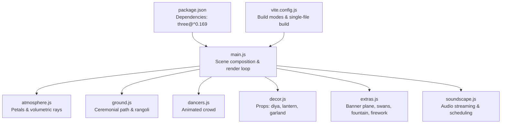
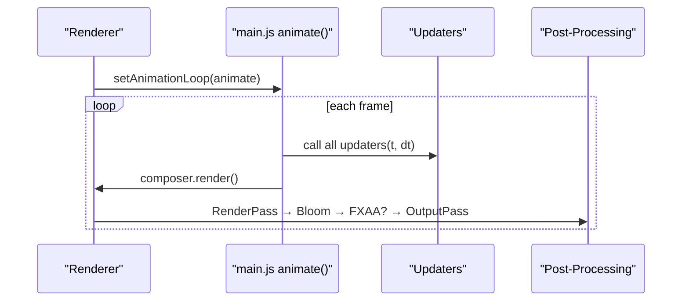
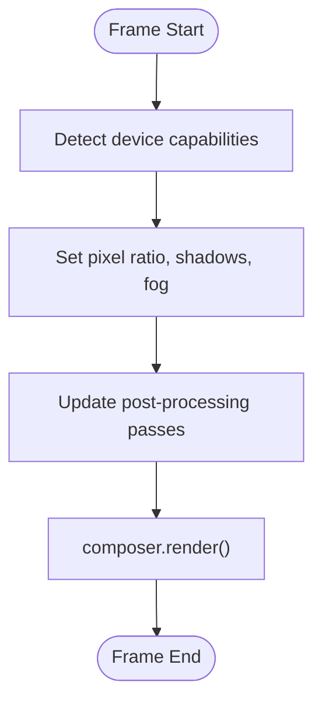
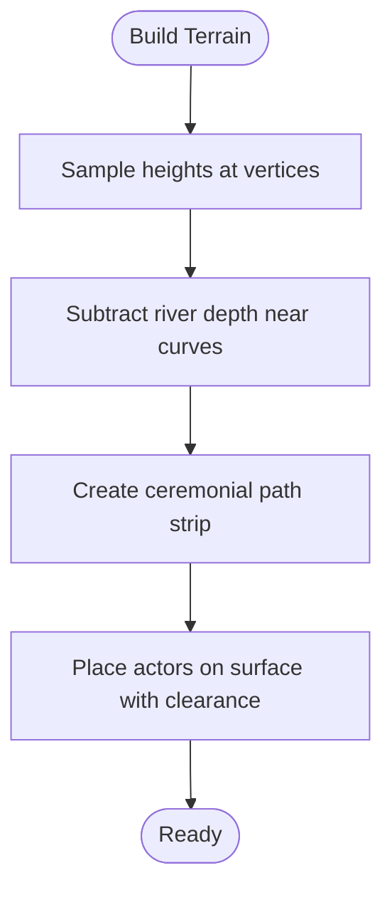
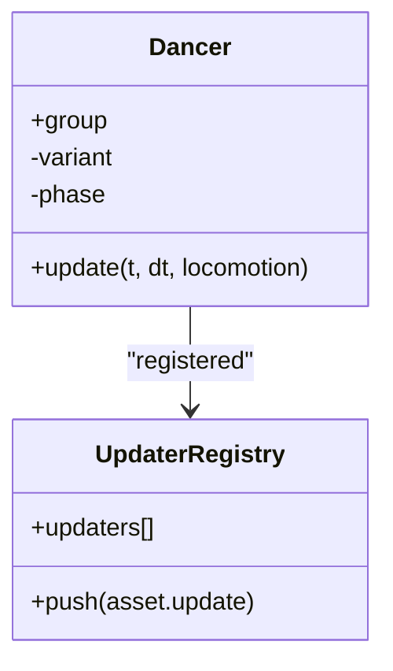
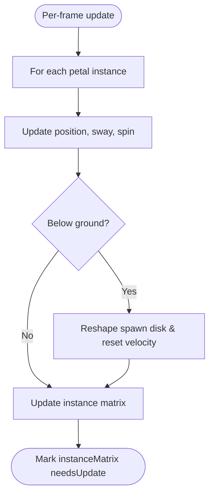
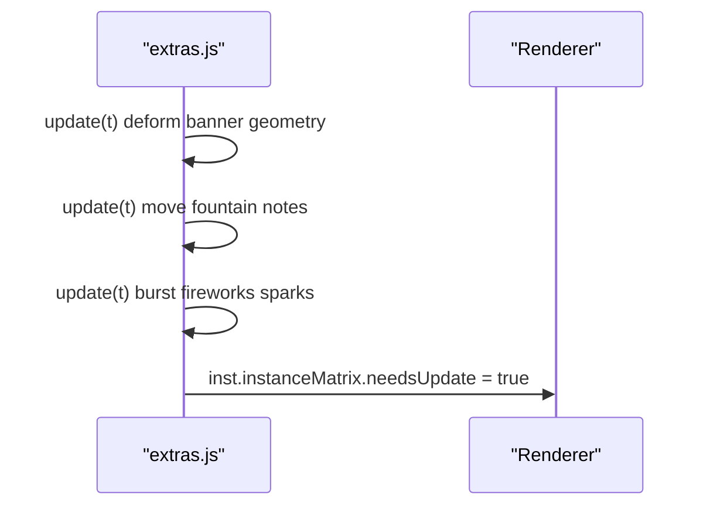
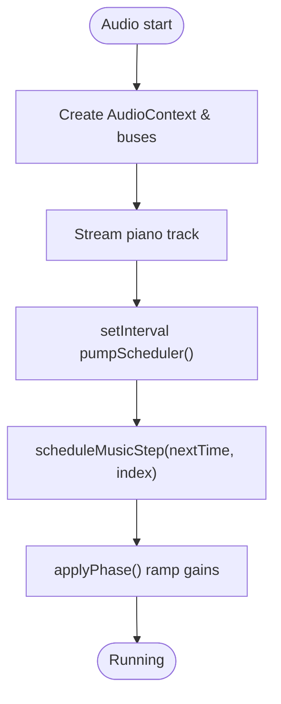
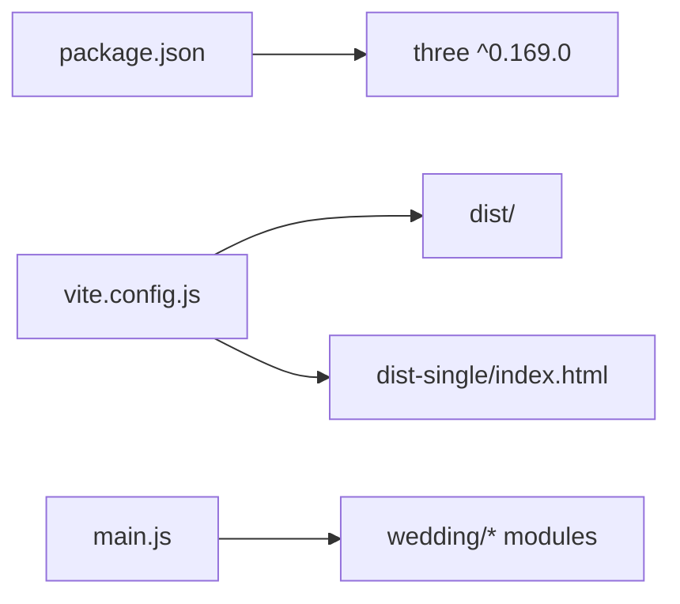

# 3D World Performance

<cite>
**Referenced Files in This Document**
- [main.js](file://3D Wedding Invitation Sample 2/3d-world-source/src/main.js)
- [package.json](file://3D Wedding Invitation Sample 2/3d-world-source/package.json)
- [vite.config.js](file://3D Wedding Invitation Sample 2/3d-world-source/vite.config.js)
- [atmosphere.js](file://3D Wedding Invitation Sample 2/3d-world-source/src/wedding/atmosphere.js)
- [dancers.js](file://3D Wedding Invitation Sample 2/3d-world-source/src/wedding/dancers.js)
- [decor.js](file://3D Wedding Invitation Sample 2/3d-world-source/src/wedding/decor.js)
- [extras.js](file://3D Wedding Invitation Sample 2/3d-world-source/src/wedding/extras.js)
- [ground.js](file://3D Wedding Invitation Sample 2/3d-world-source/src/wedding/ground.js)
- [soundscape.js](file://3D Wedding Invitation Sample 2/3d-world-source/src/wedding/soundscape.js)
</cite>

## Table of Contents
1. [Introduction](#introduction)
2. [Project Structure](#project-structure)
3. [Core Components](#core-components)
4. [Architecture Overview](#architecture-overview)
5. [Detailed Component Analysis](#detailed-component-analysis)
6. [Dependency Analysis](#dependency-analysis)
7. [Performance Considerations](#performance-considerations)
8. [Troubleshooting Guide](#troubleshooting-guide)
9. [Conclusion](#conclusion)
10. [Appendices](#appendices)

## Introduction
This document explains how the wedding invitation system’s 3D world is optimized for smooth, GPU-accelerated rendering across devices. It focuses on Three.js scene management, frame-rate-aware quality scaling, efficient use of requestAnimationFrame, chunked animation strategies to prevent jank, and memory-conscious transitions. It also covers profiling tools, browser compatibility considerations, and fallback strategies for limited WebGL support.

## Project Structure
The 3D world is implemented as a modular Three.js application built with Vite. The main entry composes scene assets (terrain, path, characters, decorations, atmosphere), sets up renderer/post-processing, and drives the render loop. Asset modules encapsulate reusable components such as dancers, decor, ground runner, atmospheric effects, and extras like banners and fireworks. Audio is handled by a dedicated module that streams media and schedules procedural sound.

**Diagram sources**
- [main.js:1-24](file://3D Wedding Invitation Sample 2/3d-world-source/src/main.js#L1-L24)
- [package.json:13-15](file://3D Wedding Invitation Sample 2/3d-world-source/package.json#L13-L15)
- [vite.config.js:4-18](file://3D Wedding Invitation Sample 2/3d-world-source/vite.config.js#L4-L18)

**Section sources**
- [main.js:1-24](file://3D Wedding Invitation Sample 2/3d-world-source/src/main.js#L1-L24)
- [package.json:1-22](file://3D Wedding Invitation Sample 2/3d-world-source/package.json#L1-L22)
- [vite.config.js:1-20](file://3D Wedding Invitation Sample 2/3d-world-source/vite.config.js#L1-L20)

## Core Components
- Scene setup and device-adaptive rendering: pixel ratio capping, mobile vs desktop shadow maps, fog density, bloom intensity, and FXAA toggling based on device capability detection.
- Post-processing pipeline: RenderPass → UnrealBloomPass → optional FXAAShader → OutputPass.
- Terrain and path: procedural height sampling, river carving, raised ceremonial terrace, and a textured ceremonial runner with emissive gold bands.
- Animated actors: dancers with shared materials and per-variant animations; procession locomotion via lightweight updaters.
- Atmospheric effects: petal particles using InstancedMesh and volumetric sun rays via additive quads and gradient textures.
- Extras: animated banner plane with deformed cloth geometry, money fountain and fireworks using InstancedMesh, swans circling the pond.
- Audio: streaming piano track with procedural accompaniment, phase-based mixing, and robust resume/mute handling.

**Section sources**
- [main.js:138-188](file://3D Wedding Invitation Sample 2/3d-world-source/src/main.js#L138-L188)
- [main.js:593-687](file://3D Wedding Invitation Sample 2/3d-world-source/src/main.js#L593-L687)
- [ground.js:113-191](file://3D Wedding Invitation Sample 2/3d-world-source/src/wedding/ground.js#L113-L191)
- [atmosphere.js:38-204](file://3D Wedding Invitation Sample 2/3d-world-source/src/wedding/atmosphere.js#L38-L204)
- [extras.js:47-111](file://3D Wedding Invitation Sample 2/3d-world-source/src/wedding/extras.js#L47-L111)
- [extras.js:153-201](file://3D Wedding Invitation Sample 2/3d-world-source/src/wedding/extras.js#L153-L201)
- [extras.js:208-256](file://3D Wedding Invitation Sample 2/3d-world-source/src/wedding/extras.js#L208-L256)
- [soundscape.js:31-638](file://3D Wedding Invitation Sample 2/3d-world-source/src/wedding/soundscape.js#L31-L638)

## Architecture Overview
The render loop centralizes updates and rendering. Each asset contributes an update function invoked once per frame. Post-processing runs after scene rendering. Device capability detection influences renderer settings and effect usage.

**Diagram sources**
- [main.js:1700-1727](file://3D Wedding Invitation Sample 2/3d-world-source/src/main.js#L1700-L1727)

## Detailed Component Analysis

### Renderer and Post-Processing Pipeline
- Mobile detection adjusts antialiasing, pixel ratio cap, shadow map type, and fog density to balance quality and performance.
- Post-processing uses a small number of passes: one render pass, bloom for golden-hour glow, optional FXAA on desktop, and output pass for color space correctness.
- Resize handling throttles camera and renderer updates to avoid layout thrash.

**Diagram sources**
- [main.js:111-188](file://3D Wedding Invitation Sample 2/3d-world-source/src/main.js#L111-L188)
- [main.js:1732-1753](file://3D Wedding Invitation Sample 2/3d-world-source/src/main.js#L1732-L1753)

**Section sources**
- [main.js:111-188](file://3D Wedding Invitation Sample 2/3d-world-source/src/main.js#L111-L188)
- [main.js:1732-1753](file://3D Wedding Invitation Sample 2/3d-world-source/src/main.js#L1732-L1753)

### Terrain, Path, and Grounding
- Procedural terrain uses sampled height functions and river carving to create varied landscape with minimal CPU cost.
- Ceremonial path builds a strip mesh with cross-section sampling to conform to terrain and lift along the runner.
- Actors are grounded against surface height with clearance offsets to avoid sinking into bumps or carpet.

**Diagram sources**
- [main.js:593-631](file://3D Wedding Invitation Sample 2/3d-world-source/src/main.js#L593-L631)
- [ground.js:113-191](file://3D Wedding Invitation Sample 2/3d-world-source/src/wedding/ground.js#L113-L191)

**Section sources**
- [main.js:593-631](file://3D Wedding Invitation Sample 2/3d-world-source/src/main.js#L593-L631)
- [ground.js:113-191](file://3D Wedding Invitation Sample 2/3d-world-source/src/wedding/ground.js#L113-L191)

### Animated Crowd and Locomotion
- Dancers share materials and use low-poly geometry; animations are driven by simple trigonometric functions per variant.
- Locomotion state is stored in lightweight objects and applied only to transform groups, avoiding extra draw calls.
- Updaters are collected centrally and invoked per frame, keeping animation logic decoupled from placement.

**Diagram sources**
- [dancers.js:104-329](file://3D Wedding Invitation Sample 2/3d-world-source/src/wedding/dancers.js#L104-L329)
- [main.js:116-118](file://3D Wedding Invitation Sample 2/3d-world-source/src/main.js#L116-L118)
- [main.js:1700-1701](file://3D Wedding Invitation Sample 2/3d-world-source/src/main.js#L1700-L1701)

**Section sources**
- [dancers.js:104-329](file://3D Wedding Invitation Sample 2/3d-world-source/src/wedding/dancers.js#L104-L329)
- [main.js:116-118](file://3D Wedding Invitation Sample 2/3d-world-source/src/main.js#L116-L118)
- [main.js:1700-1701](file://3D Wedding Invitation Sample 2/3d-world-source/src/main.js#L1700-L1701)

### Petal System and Volumetric Rays
- Petal system uses a single InstancedMesh with per-instance position, rotation, scale, and color buffers updated each frame.
- Volumetric rays are created from a few additive quads with a gradient texture, providing cheap god-ray effects without heavy shaders.

**Diagram sources**
- [atmosphere.js:153-188](file://3D Wedding Invitation Sample 2/3d-world-source/src/wedding/atmosphere.js#L153-L188)

**Section sources**
- [atmosphere.js:38-204](file://3D Wedding Invitation Sample 2/3d-world-source/src/wedding/atmosphere.js#L38-L204)
- [atmosphere.js:212-327](file://3D Wedding Invitation Sample 2/3d-world-source/src/wedding/atmosphere.js#L212-L327)

### Extras: Banner Plane, Fountain, Fireworks
- Banner plane deforms its geometry each frame to simulate wind ripple while maintaining readable text via canvas-generated textures.
- Money fountain and fireworks rely on InstancedMesh for many small dynamic objects with minimal draw calls.
- Swans perform simple circular motion with minimal overhead.

**Diagram sources**
- [extras.js:47-111](file://3D Wedding Invitation Sample 2/3d-world-source/src/wedding/extras.js#L47-L111)
- [extras.js:153-201](file://3D Wedding Invitation Sample 2/3d-world-source/src/wedding/extras.js#L153-L201)
- [extras.js:208-256](file://3D Wedding Invitation Sample 2/3d-world-source/src/wedding/extras.js#L208-L256)

**Section sources**
- [extras.js:47-111](file://3D Wedding Invitation Sample 2/3d-world-source/src/wedding/extras.js#L47-L111)
- [extras.js:153-201](file://3D Wedding Invitation Sample 2/3d-world-source/src/wedding/extras.js#L153-L201)
- [extras.js:208-256](file://3D Wedding Invitation Sample 2/3d-world-source/src/wedding/extras.js#L208-L256)

### Audio Scheduling and Streaming
- Piano audio is streamed via HTMLMediaElement to avoid large in-memory buffers; procedural layers fill gaps and enhance ambiance.
- A scheduler ticks ahead to schedule notes precisely, with lookahead to maintain timing stability.
- Phase-based mixing smoothly transitions between opening, procession, arrival, and celebration states.

**Diagram sources**
- [soundscape.js:480-574](file://3D Wedding Invitation Sample 2/3d-world-source/src/wedding/soundscape.js#L480-L574)
- [soundscape.js:313-380](file://3D Wedding Invitation Sample 2/3d-world-source/src/wedding/soundscape.js#L313-L380)

**Section sources**
- [soundscape.js:31-638](file://3D Wedding Invitation Sample 2/3d-world-source/src/wedding/soundscape.js#L31-L638)

## Dependency Analysis
- Three.js is the core runtime dependency; version pinned in package.json ensures consistent behavior.
- Vite config supports two build modes: standard dist and a single self-contained file for easy sharing.
- Main module imports scene components from wedding submodules, creating a clear separation of concerns.

**Diagram sources**
- [package.json:13-15](file://3D Wedding Invitation Sample 2/3d-world-source/package.json#L13-L15)
- [vite.config.js:4-18](file://3D Wedding Invitation Sample 2/3d-world-source/vite.config.js#L4-L18)
- [main.js:1-24](file://3D Wedding Invitation Sample 2/3d-world-source/src/main.js#L1-L24)

**Section sources**
- [package.json:1-22](file://3D Wedding Invitation Sample 2/3d-world-source/package.json#L1-L22)
- [vite.config.js:1-20](file://3D Wedding Invitation Sample 2/3d-world-source/vite.config.js#L1-L20)
- [main.js:1-24](file://3D Wedding Invitation Sample 2/3d-world-source/src/main.js#L1-L24)

## Performance Considerations
- Frame rate monitoring: Use browser DevTools Performance tab to capture frames, identify long tasks, and measure FPS. Look for spikes during asset creation or heavy per-frame loops.
- Adaptive quality scaling:
  - Pixel ratio capped on mobile to reduce overdraw.
  - Shadow map resolution and type adjusted per device.
  - Fog density tuned for mobile vs desktop.
  - FXAA disabled on mobile to save shader passes.
- Efficient requestAnimationFrame usage:
  - Single render loop with centralized updater invocation.
  - Resize events throttled to a single rAF to avoid redundant work.
- GPU-accelerated transforms:
  - Animations modify Object3D matrices rather than rebuilding geometry every frame.
  - Deformations limited to necessary attributes (e.g., banner vertex positions).
- Chunking complex animations:
  - Particle systems update per instance in tight loops but keep allocations minimal.
  - Procedural audio scheduling avoids blocking the main thread by using precise time-based scheduling.
- Memory management:
  - Shared materials and geometries across instances.
  - Streaming audio instead of decoding entire tracks into memory.
  - Avoid creating new textures or buffers inside the render loop.
- Browser compatibility and fallbacks:
  - WebGL availability assumed; if unavailable, the page should gracefully degrade to static content or a 2D fallback.
  - Media playback relies on user gesture; audio module handles resume/mute robustly.
- Profiling tools:
  - Chrome DevTools Performance panel for frame timelines and JS heap snapshots.
  - GPU timeline in DevTools to inspect draw calls and shader costs.
  - WebPageTest or Lighthouse for load-time metrics and resource optimization opportunities.

[No sources needed since this section provides general guidance]

## Troubleshooting Guide
- Jank during initial load: Ensure heavy asset creation happens before the first render; defer non-critical effects until after first frame.
- Stutter when resizing: Confirm resize handler is throttled to one rAF and does not recreate expensive resources.
- Audio not playing: Verify user gesture triggered resume; check for muted state and visibility changes that suspend/resume context.
- Excessive GPU usage: Reduce bloom strength, disable FXAA on low-end devices, lower shadow map size, and limit particle counts.
- Visual artifacts on water/path: Adjust polygon offset values to prevent z-fighting between overlapping surfaces.

**Section sources**
- [main.js:1732-1753](file://3D Wedding Invitation Sample 2/3d-world-source/src/main.js#L1732-L1753)
- [soundscape.js:619-628](file://3D Wedding Invitation Sample 2/3d-world-source/src/wedding/soundscape.js#L619-L628)
- [ground.js:174-186](file://3D Wedding Invitation Sample 2/3d-world-source/src/wedding/ground.js#L174-L186)

## Conclusion
The 3D world achieves smooth performance through careful scene composition, device-aware renderer configuration, efficient animation patterns, and disciplined memory usage. By leveraging InstancedMesh, shared resources, and a streamlined post-processing pipeline, it delivers a rich cinematic experience while remaining responsive on a wide range of devices.

[No sources needed since this section summarizes without analyzing specific files]

## Appendices

### Key Implementation References
- Render loop and updater orchestration: [main.js:1700-1727](file://3D Wedding Invitation Sample 2/3d-world-source/src/main.js#L1700-L1727)
- Device capability checks and adaptive settings: [main.js:111-188](file://3D Wedding Invitation Sample 2/3d-world-source/src/main.js#L111-L188)
- Terrain and path generation: [main.js:593-631](file://3D Wedding Invitation Sample 2/3d-world-source/src/main.js#L593-L631), [ground.js:113-191](file://3D Wedding Invitation Sample 2/3d-world-source/src/wedding/ground.js#L113-L191)
- Atmosphere effects: [atmosphere.js:38-204](file://3D Wedding Invitation Sample 2/3d-world-source/src/wedding/atmosphere.js#L38-L204), [atmosphere.js:212-327](file://3D Wedding Invitation Sample 2/3d-world-source/src/wedding/atmosphere.js#L212-L327)
- Animated extras: [extras.js:47-111](file://3D Wedding Invitation Sample 2/3d-world-source/src/wedding/extras.js#L47-L111), [extras.js:153-201](file://3D Wedding Invitation Sample 2/3d-world-source/src/wedding/extras.js#L153-L201), [extras.js:208-256](file://3D Wedding Invitation Sample 2/3d-world-source/src/wedding/extras.js#L208-L256)
- Audio streaming and scheduling: [soundscape.js:480-574](file://3D Wedding Invitation Sample 2/3d-world-source/src/wedding/soundscape.js#L480-L574), [soundscape.js:313-380](file://3D Wedding Invitation Sample 2/3d-world-source/src/wedding/soundscape.js#L313-L380)