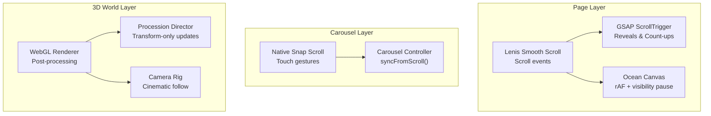
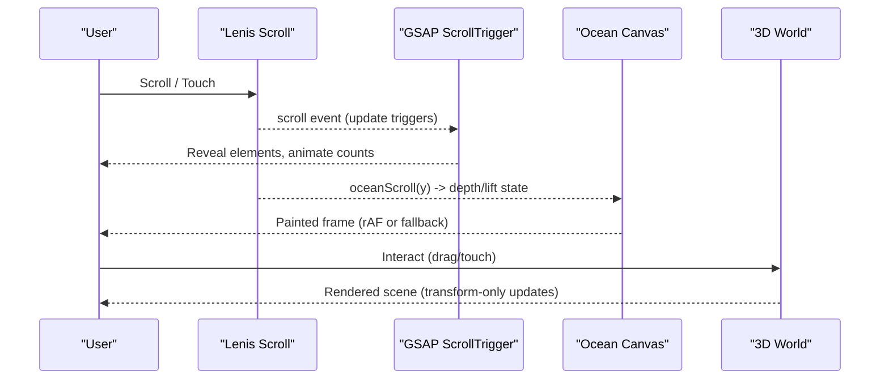
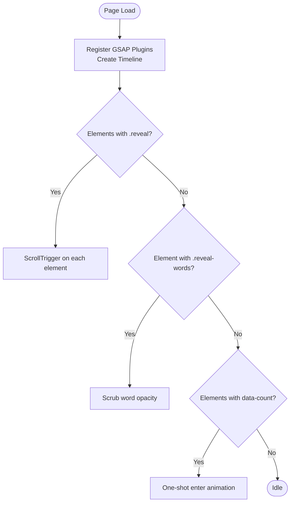
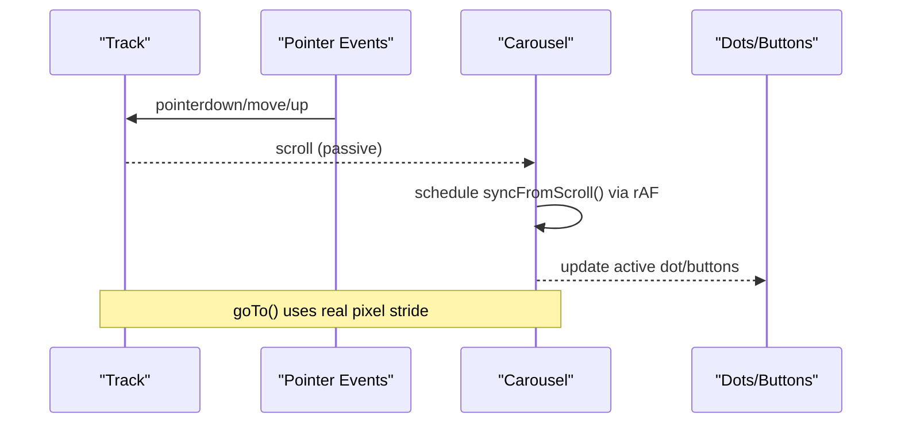
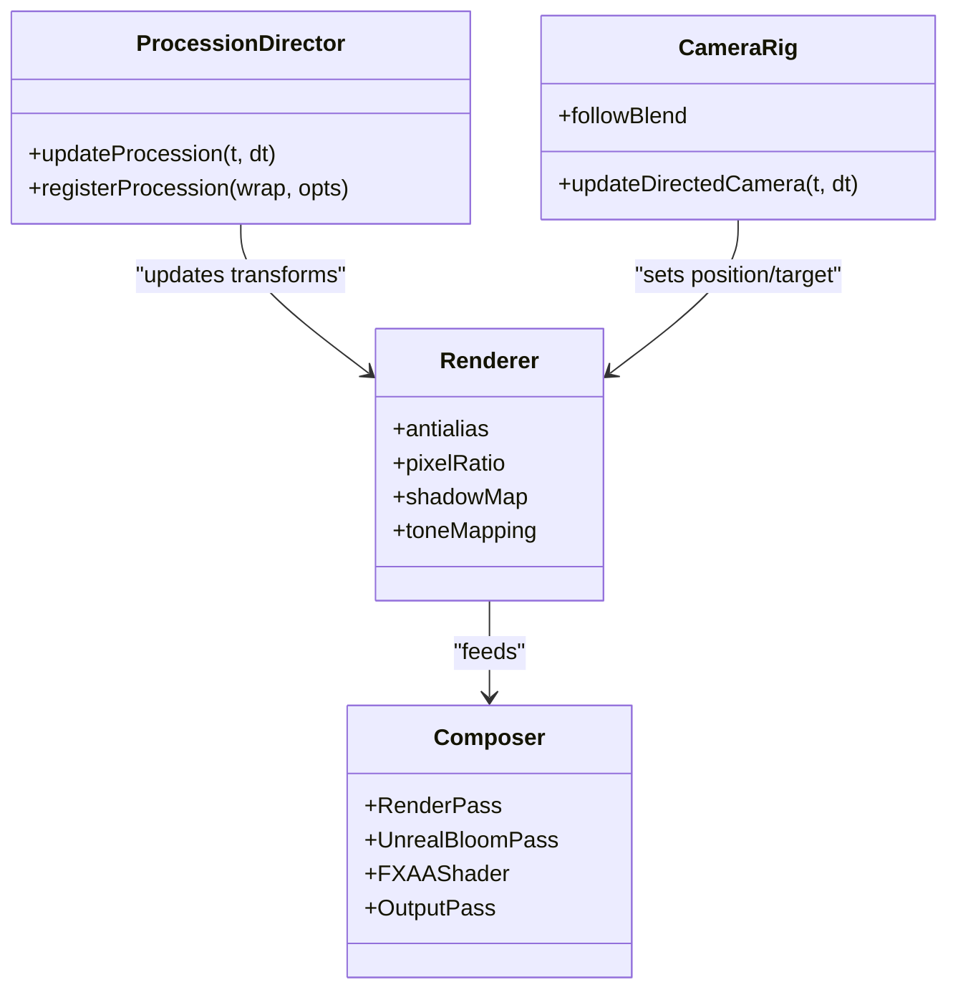
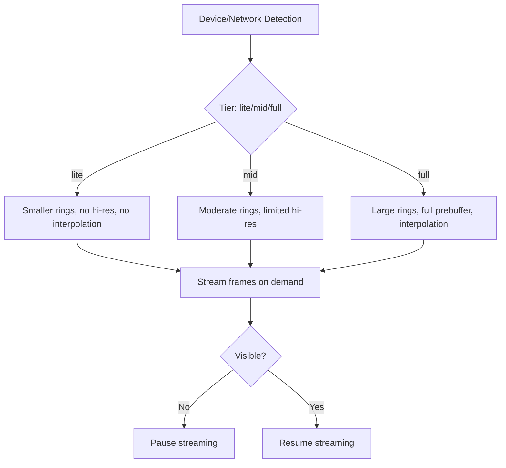
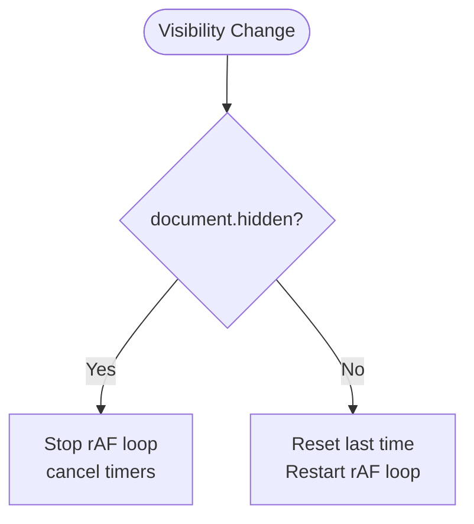
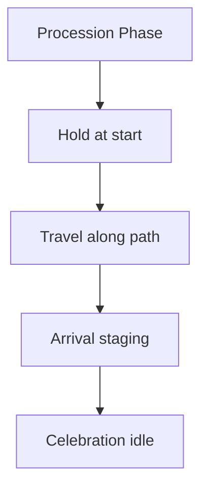
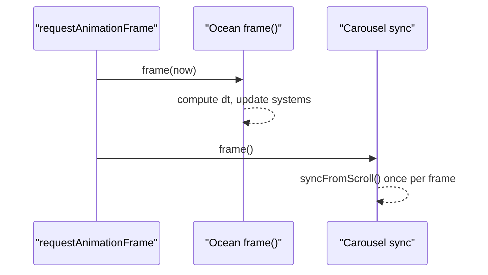
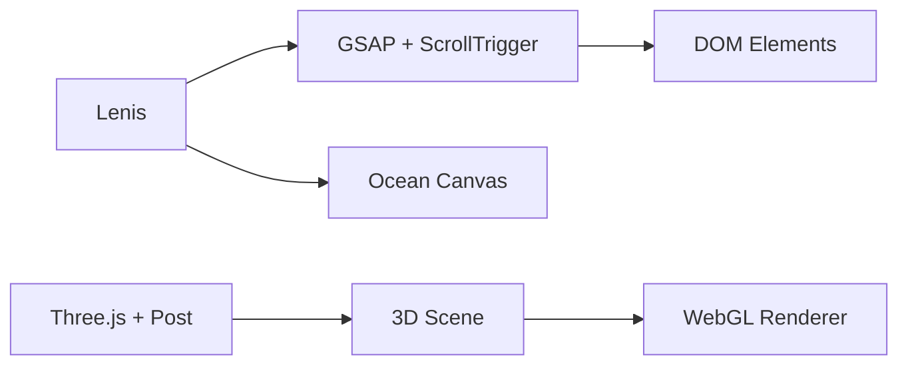

# Animation Performance

<cite>
**Referenced Files in This Document**
- [app.js](file://js/app.js)
- [carousel.js](file://js/carousel.js)
- [ocean.js](file://js/ocean.js)
- [main.js](file://3D Wedding Invitation Sample 2/3d-world-source/src/main.js)
- [app.js](file://3D Wedding Invitation Sample 2/app.js)
</cite>

## Table of Contents
1. [Introduction](#introduction)
2. [Project Structure](#project-structure)
3. [Core Components](#core-components)
4. [Architecture Overview](#architecture-overview)
5. [Detailed Component Analysis](#detailed-component-analysis)
6. [Dependency Analysis](#dependency-analysis)
7. [Performance Considerations](#performance-considerations)
8. [Troubleshooting Guide](#troubleshooting-guide)
9. [Conclusion](#conclusion)

## Introduction
This document explains how the DeepDreams portfolio optimizes animation performance across scroll-driven UI, mobile carousels, and a WebGL 3D world. It focuses on:
- GSAP ScrollTrigger usage for scroll-based reveals and count-up animations
- Carousel touch gestures and swipe behavior optimized for mobile
- The 3D world’s animation system with frame pacing, adaptive quality scaling, and GPU-accelerated transforms
- Strategies to pause non-visible animations, chunk complex sequences, and use requestAnimationFrame efficiently
- Browser compatibility considerations and fallback strategies for devices with limited rendering capabilities

## Project Structure
The animation stack spans three layers:
- Page-level scroll and GSAP-driven UI animations
- A native snap-scroll carousel for video sections
- A WebGL 3D wedding world with cinematic camera, procession choreography, and post-processing

**Diagram sources**
- [app.js:58-93](file://js/app.js#L58-L93)
- [app.js:44-56](file://js/app.js#L44-L56)
- [ocean.js:426-445](file://js/ocean.js#L426-L445)
- [carousel.js:207-322](file://js/carousel.js#L207-L322)
- [main.js:138-188](file://3D Wedding Invitation Sample 2/3d-world-source/src/main.js#L138-L188)
- [main.js:1188-1308](file://3D Wedding Invitation Sample 2/3d-world-source/src/main.js#L1188-L1308)

**Section sources**
- [app.js:44-93](file://js/app.js#L44-L93)
- [carousel.js:207-322](file://js/carousel.js#L207-L322)
- [ocean.js:426-445](file://js/ocean.js#L426-L445)
- [main.js:138-188](file://3D Wedding Invitation Sample 2/3d-world-source/src/main.js#L138-L188)

## Core Components
- GSAP ScrollTrigger: entrance timelines, scroll-triggered reveals, word-by-word scrubbing, and count-up numbers
- Lenis smooth scroll integration: unified scroll source feeding both GSAP and canvas ocean
- Native snap-scroll carousel: hardware-accelerated swiping with rAF-throttled UI sync
- Ocean canvas: hybrid rAF/setTimeout loop, visibility pause, reduced-motion handling
- 3D world: renderer tuning per device class, transform-only animation loops, cinematic camera, post-processing

**Section sources**
- [app.js:58-93](file://js/app.js#L58-L93)
- [app.js:44-56](file://js/app.js#L44-L56)
- [carousel.js:207-322](file://js/carousel.js#L207-L322)
- [ocean.js:426-445](file://js/ocean.js#L426-L445)
- [main.js:138-188](file://3D Wedding Invitation Sample 2/3d-world-source/src/main.js#L138-L188)

## Architecture Overview
High-level flow from user interaction to animated output:

**Diagram sources**
- [app.js:44-56](file://js/app.js#L44-L56)
- [app.js:58-93](file://js/app.js#L58-L93)
- [ocean.js:68-78](file://js/ocean.js#L68-L78)
- [main.js:138-188](file://3D Wedding Invitation Sample 2/3d-world-source/src/main.js#L138-L188)

## Detailed Component Analysis

### GSAP ScrollTrigger Implementation
- Entrance timeline animates hero text and actions with staggered easing
- Scroll-triggered reveals fade/slide elements into view at defined thresholds
- Word-by-word reveal uses scrub tied to scroll progress for precise control
- Count-up numbers animate when entering viewport using a one-shot trigger

Performance notes:
- Uses power easing curves for smooth motion
- Triggers are scoped to specific elements to minimize layout thrash
- Lenis provides consistent scroll values to GSAP via update hooks

**Diagram sources**
- [app.js:58-93](file://js/app.js#L58-L93)

**Section sources**
- [app.js:58-93](file://js/app.js#L58-L93)

### Carousel Optimization for Mobile Touch Gestures
- Uses CSS scroll-snap for native inertia and rubber-banding
- Pointer events detect drag vs click to prevent accidental lightbox opens after swipes
- Scroll handler is passive; active index sync runs once per frame via requestAnimationFrame
- goTo computes pixel offsets based on actual item widths and gaps for precise alignment

**Diagram sources**
- [carousel.js:207-322](file://js/carousel.js#L207-L322)

**Section sources**
- [carousel.js:207-322](file://js/carousel.js#L207-L322)

### 3D World Animation System
- Device detection adjusts renderer settings: antialiasing, shadow maps, pixel ratio, bloom/FXAA
- Post-processing pipeline includes render pass, bloom, optional FXAA, and output pass
- Procession director updates actor transforms only (no extra meshes), driving gait and pose from distance along path
- Camera rig blends between intro fly-in and continuous cinematic orbit, clamping long background-tab frames to avoid jumps

**Diagram sources**
- [main.js:138-188](file://3D Wedding Invitation Sample 2/3d-world-source/src/main.js#L138-L188)
- [main.js:1188-1308](file://3D Wedding Invitation Sample 2/3d-world-source/src/main.js#L1188-L1308)
- [main.js:1310-1471](file://3D Wedding Invitation Sample 2/3d-world-source/src/main.js#L1310-L1471)

**Section sources**
- [main.js:138-188](file://3D Wedding Invitation Sample 2/3d-world-source/src/main.js#L138-L188)
- [main.js:1188-1308](file://3D Wedding Invitation Sample 2/3d-world-source/src/main.js#L1188-L1308)
- [main.js:1310-1471](file://3D Wedding Invitation Sample 2/3d-world-source/src/main.js#L1310-L1471)

### Frame Rate Monitoring and Adaptive Quality Scaling
- 3D world detects mobile/coarse-pointer and reduces shadows, disables FXAA, caps pixel ratio, and lowers terrain resolution
- Image frame engine tiers decide prebuffer size and interpolation based on device memory and connection type
- IntersectionObserver pauses image streaming when scrub area is off-screen to save bandwidth and CPU/GPU

**Diagram sources**
- [main.js:111-149](file://3D Wedding Invitation Sample 2/3d-world-source/src/main.js#L111-L149)
- [app.js:479-489](file://3D Wedding Invitation Sample 2/app.js#L479-L489)
- [app.js:624-631](file://3D Wedding Invitation Sample 2/app.js#L624-L631)

**Section sources**
- [main.js:111-149](file://3D Wedding Invitation Sample 2/3d-world-source/src/main.js#L111-L149)
- [app.js:479-489](file://3D Wedding Invitation Sample 2/app.js#L479-L489)
- [app.js:624-631](file://3D Wedding Invitation Sample 2/app.js#L624-L631)

### Pausing Animations When Not Visible
- Ocean canvas stops its loop when the tab is hidden and resumes when visible
- Carousel scroll handlers are passive to avoid blocking main thread
- 3D world clamps large time deltas on return from background tabs to avoid camera jumps

**Diagram sources**
- [ocean.js:629-632](file://js/ocean.js#L629-L632)
- [main.js:1390-1395](file://3D Wedding Invitation Sample 2/3d-world-source/src/main.js#L1390-L1395)

**Section sources**
- [ocean.js:629-632](file://js/ocean.js#L629-L632)
- [main.js:1390-1395](file://3D Wedding Invitation Sample 2/3d-world-source/src/main.js#L1390-L1395)

### Breaking Complex Animations Into Smaller Chunks
- 3D procession splits movement into phases: opening hold, travel, arrival, celebration
- Each actor has an offset and final lane/distance, allowing independent choreography without heavy computation
- Ocean canvas separates concerns: fish flocking, jellyfish physics, marine snow, and god rays run as independent subsystems within one frame

**Diagram sources**
- [main.js:1188-1308](file://3D Wedding Invitation Sample 2/3d-world-source/src/main.js#L1188-L1308)

**Section sources**
- [main.js:1188-1308](file://3D Wedding Invitation Sample 2/3d-world-source/src/main.js#L1188-L1308)

### Efficient Use of requestAnimationFrame
- Ocean canvas uses a hybrid driver: rAF plus a setTimeout watchdog to survive throttled environments
- Carousel syncs UI state once per frame via rAF to avoid excessive DOM writes
- GSAP timelines and ScrollTrigger leverage rAF internally for smooth updates

**Diagram sources**
- [ocean.js:426-445](file://js/ocean.js#L426-L445)
- [carousel.js:229-237](file://js/carousel.js#L229-L237)

**Section sources**
- [ocean.js:426-445](file://js/ocean.js#L426-L445)
- [carousel.js:229-237](file://js/carousel.js#L229-L237)

### Browser Compatibility and Fallback Strategies
- Reduced motion: ocean canvas renders a single static frame and slows time base
- Image decoding: prefers createImageBitmap with fallback to  decode path
- 3D renderer: disables FXAA on mobile, reduces shadow map sizes, and caps pixel ratio
- Connection-aware tiering: avoids heavy prebuffers on slow connections or low-memory devices

**Section sources**
- [ocean.js:34-38](file://js/ocean.js#L34-L38)
- [ocean.js:619-627](file://js/ocean.js#L619-L627)
- [app.js:355-403](file://3D Wedding Invitation Sample 2/app.js#L355-L403)
- [main.js:111-149](file://3D Wedding Invitation Sample 2/3d-world-source/src/main.js#L111-L149)

## Dependency Analysis
Key runtime dependencies and their roles:
- GSAP + ScrollTrigger: declarative scroll-driven animations
- Lenis: smooth scrolling that feeds consistent scroll values to GSAP and custom logic
- Three.js + post-processing: high-quality 3D rendering with adaptive quality
- Canvas API: lightweight animated backgrounds with fine-grained control

**Diagram sources**
- [app.js:44-56](file://js/app.js#L44-L56)
- [app.js:58-93](file://js/app.js#L58-L93)
- [main.js:138-188](file://3D Wedding Invitation Sample 2/3d-world-source/src/main.js#L138-L188)

**Section sources**
- [app.js:44-56](file://js/app.js#L44-L56)
- [app.js:58-93](file://js/app.js#L58-L93)
- [main.js:138-188](file://3D Wedding Invitation Sample 2/3d-world-source/src/main.js#L138-L188)

## Performance Considerations
- Prefer transform-only updates in 3D to avoid layout/paint overhead
- Cap pixel ratio and disable expensive effects on mobile
- Use intersection observers to pause off-screen work
- Throttle frequent updates (e.g., carousel UI sync) to one rAF call per frame
- Use hybrid rAF/setTimeout loops to ensure responsiveness in constrained environments
- Reduce geometry complexity (terrain segments, grass counts) on mobile
- Avoid heavy DOM operations inside scroll handlers; batch updates

[No sources needed since this section provides general guidance]

## Troubleshooting Guide
Common issues and resolutions:
- Stutter during scroll: ensure scroll handlers are passive and UI sync is rAF-throttled
- Frozen animations in webviews: rely on hybrid rAF/setTimeout loop to keep loops alive
- Excessive battery drain: reduce particle counts, disable FXAA, lower pixel ratio on mobile
- Jumpy camera after background tab: clamp dt to small max value to avoid large leaps
- Images not loading: verify createImageBitmap support and fallback paths

**Section sources**
- [carousel.js:229-237](file://js/carousel.js#L229-L237)
- [ocean.js:426-445](file://js/ocean.js#L426-L445)
- [main.js:1390-1395](file://3D Wedding Invitation Sample 2/3d-world-source/src/main.js#L1390-L1395)
- [app.js:355-403](file://3D Wedding Invitation Sample 2/app.js#L355-L403)

## Conclusion
The DeepDreams portfolio achieves smooth, performant animations by combining:
- Declarative scroll-driven UI with GSAP ScrollTrigger
- Native snap-scroll carousels optimized for mobile touch
- A carefully tuned 3D world that adapts quality to device capability
- Robust rAF strategies, visibility awareness, and chunked animation design
These patterns ensure responsive interactions and efficient resource use across browsers and devices.