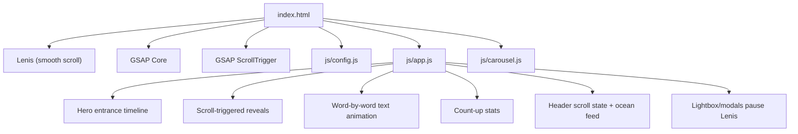
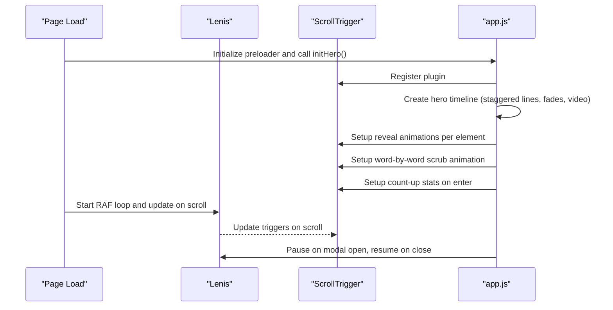
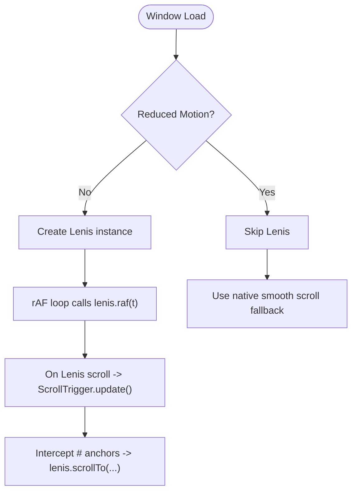
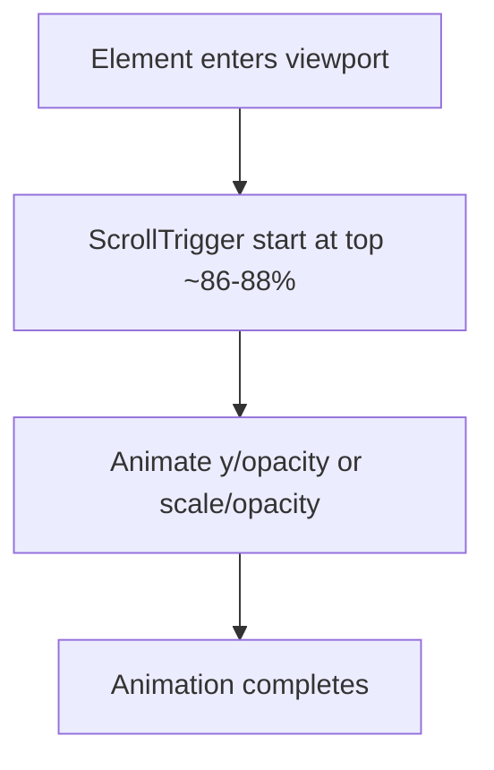
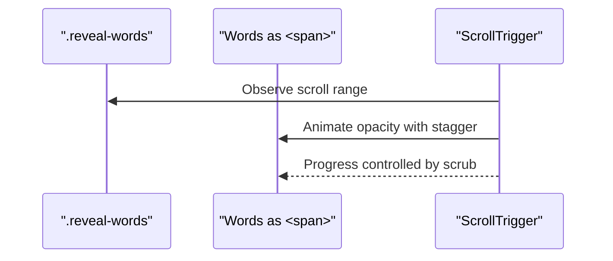
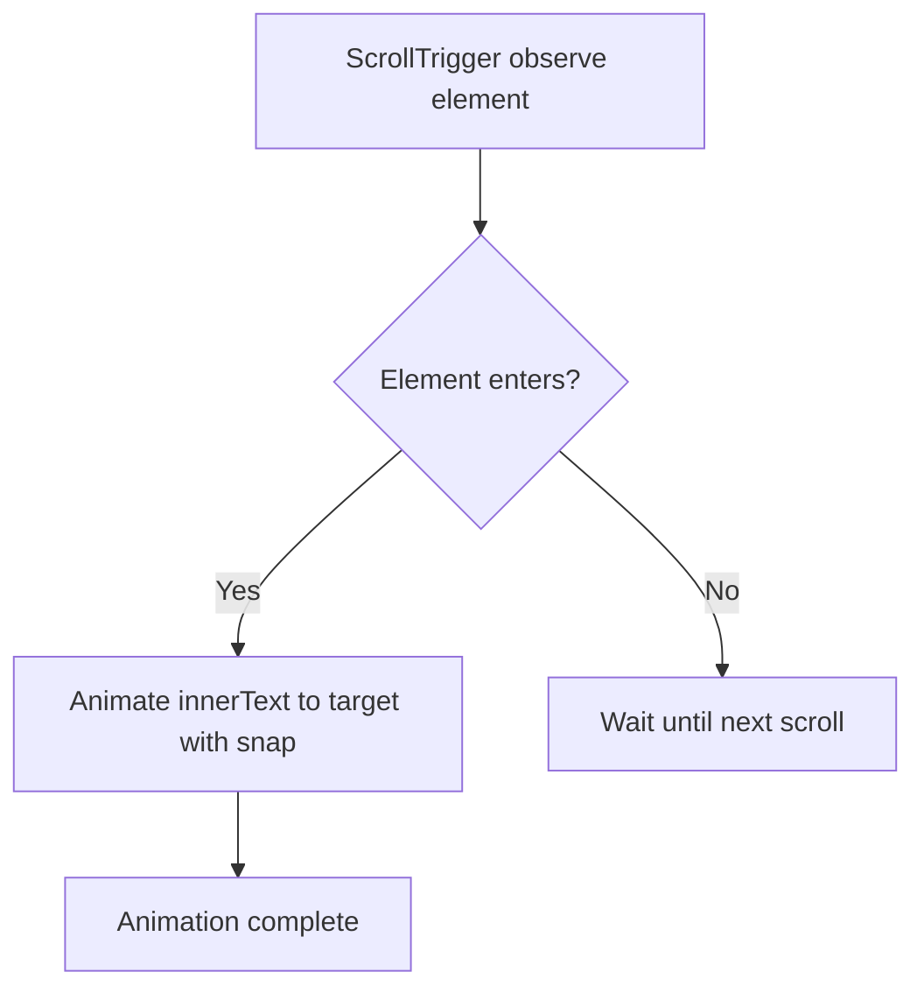
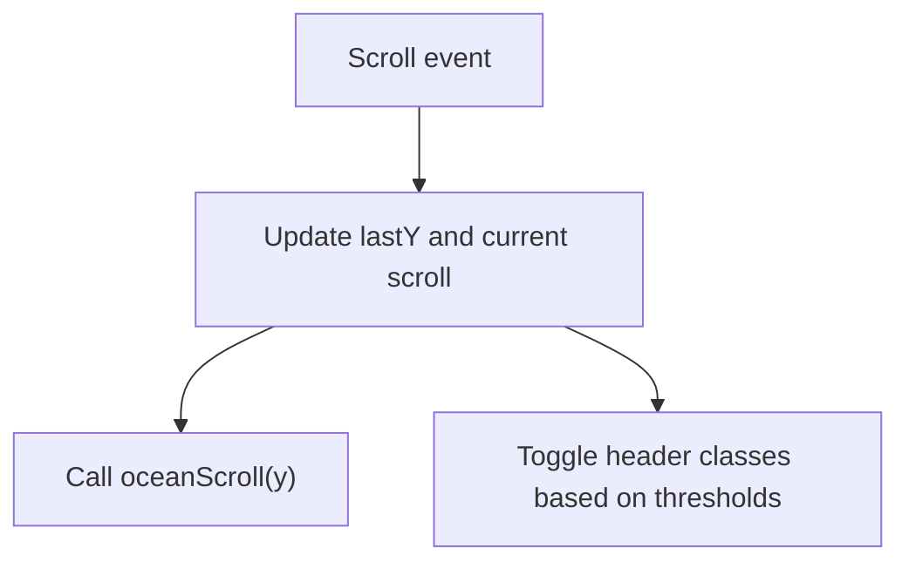
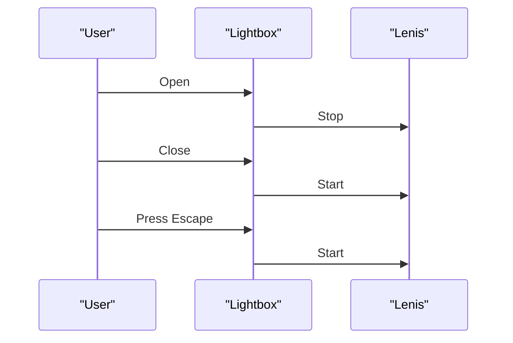
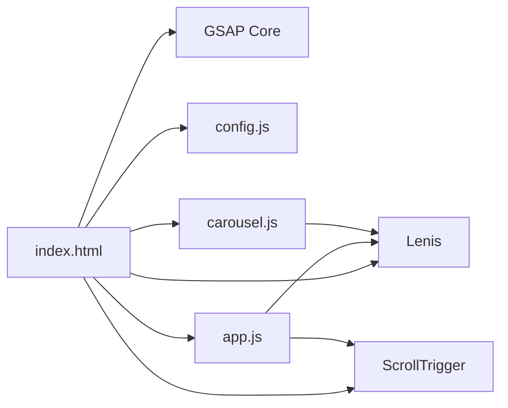

# GSAP Scroll Animations

<cite>
**Referenced Files in This Document**
- [index.html](file://index.html)
- [js/app.js](file://js/app.js)
- [js/carousel.js](file://js/carousel.js)
- [js/config.js](file://js/config.js)
</cite>

## Table of Contents
1. [Introduction](#introduction)
2. [Project Structure](#project-structure)
3. [Core Components](#core-components)
4. [Architecture Overview](#architecture-overview)
5. [Detailed Component Analysis](#detailed-component-analysis)
6. [Dependency Analysis](#dependency-analysis)
7. [Performance Considerations](#performance-considerations)
8. [Troubleshooting Guide](#troubleshooting-guide)
9. [Conclusion](#conclusion)

## Introduction
This document explains how the DeepDreams portfolio implements scroll-driven animations using GSAP and ScrollTrigger, integrated with Lenis for smooth scrolling. It covers trigger points, scrubbing mechanisms, performance optimizations, entrance animations for hero sections, reveal animations for content elements, word-by-word text animations, and how animations are paused when not visible or during modals. It also documents timeline configurations, easing functions, and stagger effects used across the site.

## Project Structure
The animation logic is primarily implemented in the main application script and wired into the page via HTML. The key files involved are:
- index.html: Loads Lenis, GSAP core, and ScrollTrigger, then loads configuration and scripts.
- js/app.js: Initializes Lenis, registers ScrollTrigger, sets up hero entrance animations, scroll-triggered reveals, word-by-word text animations, count-up stats, header behavior, and lightbox/modal interactions that pause/resume Lenis.
- js/carousel.js: Manages carousels and grids; does not directly use GSAP/ScrollTrigger but interacts with the page’s scroll context through Lenis.
- js/config.js: Holds site configuration (e.g., featured video ID), which indirectly influences animations by determining what media is shown.



**Diagram sources**
- [index.html:352-359](file://index.html#L352-L359)
- [js/app.js:44-110](file://js/app.js#L44-L110)
- [js/app.js:58-93](file://js/app.js#L58-L93)
- [js/carousel.js:1-10](file://js/carousel.js#L1-L10)
- [js/config.js:20-48](file://js/config.js#L20-L48)

**Section sources**
- [index.html:352-359](file://index.html#L352-L359)
- [js/app.js:44-110](file://js/app.js#L44-L110)
- [js/carousel.js:1-10](file://js/carousel.js#L1-L10)
- [js/config.js:20-48](file://js/config.js#L20-L48)

## Core Components
- Lenis integration: Smooth scrolling with a lerp-based engine; ScrollTrigger updates are synced on each Lenis scroll event to keep triggers accurate. Anchor links are routed through Lenis for consistent smooth navigation.
- GSAP ScrollTrigger registration: Registered once after DOM load to enable scroll-linked animations.
- Hero entrance timeline: A single timeline orchestrates staggered line reveals, eyebrow/sub/actions fade-in, and hero video appearance with easing and offsets.
- Scroll-triggered reveals: Elements with specific classes animate into view based on their position relative to the viewport.
- Word-by-word text animation: Text nodes are wrapped in spans and animated with opacity and scrubbing tied to scroll progress.
- Count-up stats: Numbers animate from zero to configured values when scrolled into view.
- Header behavior and ocean feed: Scroll position drives header visibility and feeds an ocean canvas effect via Lenis events.
- Modal/lightbox control: Opening/closing overlays pauses and resumes Lenis to prevent background scrolling while preserving animation state.

**Section sources**
- [js/app.js:44-56](file://js/app.js#L44-L56)
- [js/app.js:58-93](file://js/app.js#L58-L93)
- [js/app.js:95-110](file://js/app.js#L95-L110)
- [js/app.js:146-195](file://js/app.js#L146-L195)

## Architecture Overview
The animation architecture centers around a single initialization flow:
1. Page loads and includes Lenis, GSAP, and ScrollTrigger.
2. On window load, preloader completes and hero initialization runs.
3. Lenis is created if available and reduced motion is not preferred; it drives smooth scrolling and syncs ScrollTrigger updates.
4. GSAP ScrollTrigger is registered and timelines are set up for hero entrance and scroll-triggered effects.
5. Scroll events drive header state and feed the ocean canvas.
6. Modals and lightboxes pause Lenis to lock scrolling while open.



**Diagram sources**
- [index.html:352-359](file://index.html#L352-L359)
- [js/app.js:31-41](file://js/app.js#L31-L41)
- [js/app.js:44-56](file://js/app.js#L44-L56)
- [js/app.js:58-93](file://js/app.js#L58-L93)
- [js/app.js:146-195](file://js/app.js#L146-L195)

## Detailed Component Analysis

### Lenis Integration and Scroll Sync
- Smooth scrolling is enabled unless the user prefers reduced motion.
- Lenis runs an rAF loop and calls its internal update method each frame.
- ScrollTrigger.update() is called on every Lenis scroll event to ensure accurate trigger calculations.
- Anchor links are intercepted and scrolled via Lenis with a small offset for better UX.



**Diagram sources**
- [js/app.js:44-56](file://js/app.js#L44-L56)

**Section sources**
- [js/app.js:44-56](file://js/app.js#L44-L56)

### Hero Entrance Timeline
- A GSAP timeline is created with a default ease for smooth motion.
- Staggered line reveals animate title lines into place.
- Eyebrow, subtitle, and actions fade and slide in with negative offsets to overlap timing.
- Hero video scales and fades in near the end of the sequence.

```mermaid
sequenceDiagram
participant TL as "Timeline"
participant Title as ".hero-title .line>span"
participant Eyebrow as ".eyebrow"
participant Sub as ".hero-sub"
participant Actions as ".hero-actions"
participant Video as ".hero-video"
TL->>Title : Animate y to 0 with stagger
TL->>Eyebrow : Fade/slide in (offset -0.9)
TL->>Sub : Fade/slide in (offset -0.6)
TL->>Actions : Fade/slide in (offset -0.5)
TL->>Video : Opacity/scale transition (ease power3.out)
```

**Diagram sources**
- [js/app.js:58-68](file://js/app.js#L58-L68)

**Section sources**
- [js/app.js:58-68](file://js/app.js#L58-L68)

### Scroll-Triggered Reveal Animations
- Elements with class .reveal animate from below with opacity increase when entering the viewport.
- Elements with class .reveal-scale scale and fade in at a slightly lower threshold.
- Triggers are positioned near the bottom of the viewport to create a natural reveal as users scroll down.



**Diagram sources**
- [js/app.js:69-77](file://js/app.js#L69-L77)

**Section sources**
- [js/app.js:69-77](file://js/app.js#L69-L77)

### Word-by-Word Text Animation with Scrub
- Text inside a container is split into individual spans representing words or emphasized segments.
- A ScrollTrigger animates opacity of each span with a small stagger.
- The animation uses scrubbing so the progress is driven by scroll position rather than time, creating a precise reading experience tied to scroll depth.



**Diagram sources**
- [js/app.js:79-84](file://js/app.js#L79-L84)

**Section sources**
- [js/app.js:79-84](file://js/app.js#L79-L84)

### Count-Up Stats
- Elements with data attributes containing target numbers animate from zero to the specified value when they enter the viewport.
- Uses a one-time trigger to avoid re-running on repeated scrolls.
- Number interpolation snaps to integer steps for clean counting.



**Diagram sources**
- [js/app.js:86-92](file://js/app.js#L86-L92)

**Section sources**
- [js/app.js:86-92](file://js/app.js#L86-L92)

### Header Behavior and Ocean Feed
- Scroll position determines header classes for visual states (scrolled/hide).
- The current scroll position is fed to an ocean canvas function to synchronize background visuals with smooth scrolling.
- If Lenis is active, scroll events come from Lenis; otherwise, a passive window scroll listener is used.



**Diagram sources**
- [js/app.js:95-110](file://js/app.js#L95-L110)

**Section sources**
- [js/app.js:95-110](file://js/app.js#L95-L110)

### Lightbox and Modal Control
- When opening a lightbox or payment modal, Lenis is paused to prevent background scrolling.
- On closing, Lenis is resumed and temporary content is cleared after a short delay.
- Escape key closes modals and resumes Lenis.



**Diagram sources**
- [js/app.js:146-195](file://js/app.js#L146-L195)

**Section sources**
- [js/app.js:146-195](file://js/app.js#L146-L195)

### Timeline Configurations, Easing, and Stagger Effects
- Default easing for the hero timeline is a smooth power curve for natural motion.
- Stagger is applied to title lines to create sequential reveals.
- Negative offsets are used to overlap animations for a fluid sequence.
- Word-by-word animation uses a very subtle stagger and scrubbing for scroll-driven pacing.
- Count-up animation uses snapping to produce discrete number increments.

Examples of where these patterns appear:
- Hero timeline setup and staggered line animation
- Eyebrow/sub/actions fade-ins with negative offsets
- Word-by-word opacity scrub animation
- Count-up stat animation with snapping

**Section sources**
- [js/app.js:58-93](file://js/app.js#L58-L93)

## Dependency Analysis
- index.html loads external libraries and local scripts in a specific order: Lenis first, then GSAP core and ScrollTrigger, followed by configuration and app logic.
- app.js depends on Lenis being available and conditionally initializes it based on reduced motion preferences.
- app.js registers ScrollTrigger only if GSAP is present, ensuring graceful degradation.
- carousel.js operates independently of GSAP/ScrollTrigger but relies on the page’s scroll context managed by Lenis.



**Diagram sources**
- [index.html:352-359](file://index.html#L352-L359)
- [js/app.js:44-56](file://js/app.js#L44-L56)
- [js/carousel.js:1-10](file://js/carousel.js#L1-L10)

**Section sources**
- [index.html:352-359](file://index.html#L352-L359)
- [js/app.js:44-56](file://js/app.js#L44-L56)
- [js/carousel.js:1-10](file://js/carousel.js#L1-L10)

## Performance Considerations
- Reduced motion support: Lenis initialization is skipped when the user prefers reduced motion, minimizing unnecessary work.
- Passive scroll listeners: Where native scroll is used as a fallback, passive listeners are employed to avoid blocking rendering.
- One-time triggers: Count-up stats use a one-time enter callback to prevent repeated animations.
- Scrubbing over time-based animations: Word-by-word text uses scrub to tie animation progress to scroll, reducing CPU-intensive time-based loops.
- Lenis pause/resume: Modals pause Lenis to stop background scrolling and reduce layout thrash while overlays are open.
- Efficient DOM queries: Element selection is scoped to containers where possible to minimize overhead.

[No sources needed since this section provides general guidance]

## Troubleshooting Guide
- Animations not triggering: Ensure ScrollTrigger is registered and Lenis is initialized; verify that elements exist before setting up triggers.
- Scroll drift with Lenis: Confirm that ScrollTrigger.update() is called on Lenis scroll events to keep triggers synchronized.
- Heavy animations on low-end devices: Respect reduced motion preferences and consider disabling non-essential animations.
- Modal scroll conflicts: Verify that Lenis is paused when modals open and resumed on close to prevent background scrolling issues.
- Incorrect trigger positions: Adjust start/end values for ScrollTrigger to match desired viewport thresholds.

**Section sources**
- [js/app.js:44-56](file://js/app.js#L44-L56)
- [js/app.js:58-93](file://js/app.js#L58-L93)
- [js/app.js:146-195](file://js/app.js#L146-L195)

## Conclusion
The DeepDreams portfolio uses GSAP ScrollTrigger in combination with Lenis to deliver smooth, scroll-driven animations. Hero entrances are orchestrated via timelines with staggered reveals and overlapping transitions. Content elements animate into view using simple yet effective triggers, while word-by-word text animations leverage scrubbing for precise scroll-linked pacing. Performance is considered through reduced motion support, one-time triggers, and efficient event handling. Modals and lightboxes integrate seamlessly by pausing and resuming Lenis to maintain a consistent user experience.