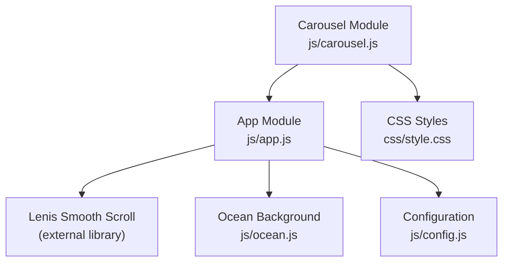
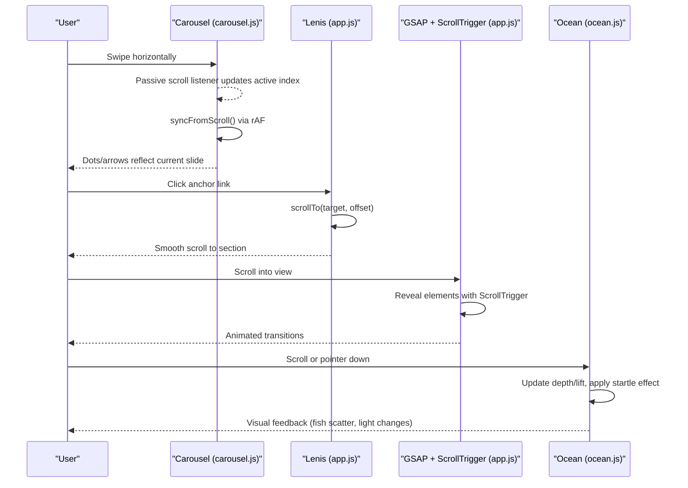
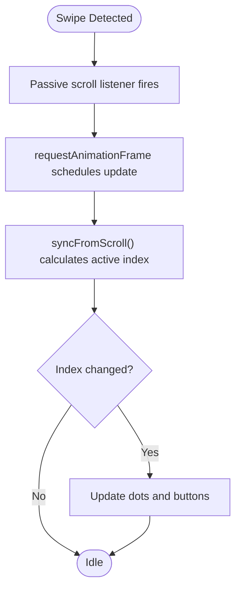
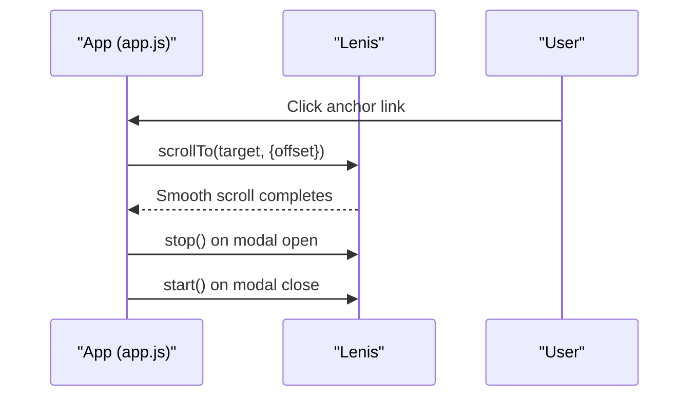
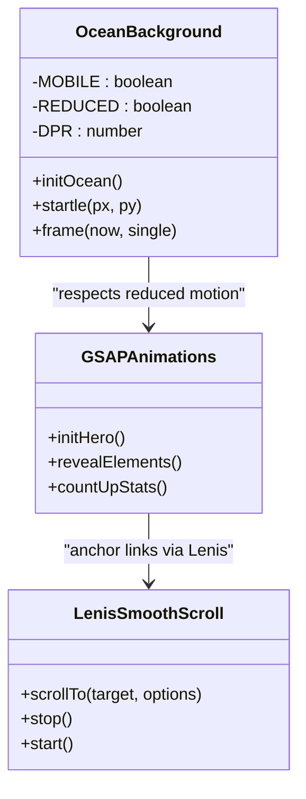
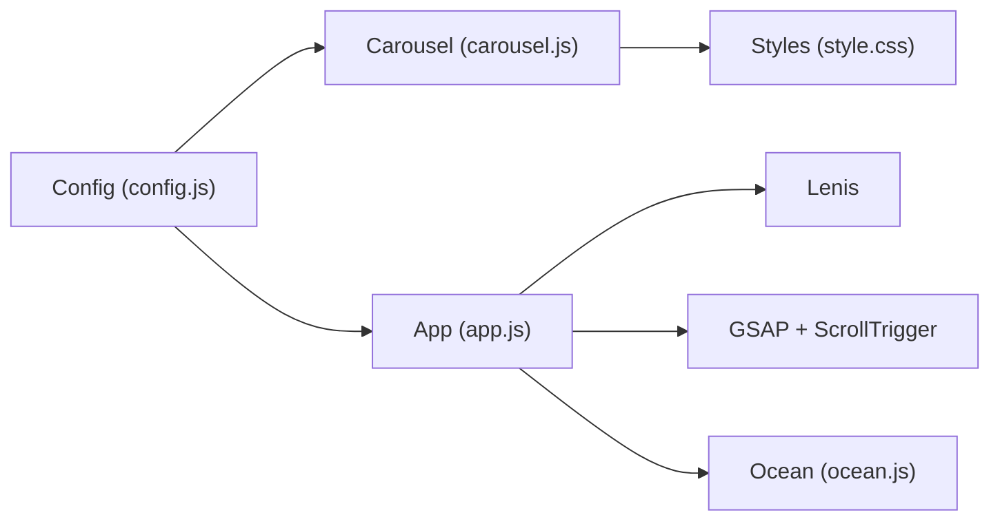

# Mobile Touch Optimization

<cite>
**Referenced Files in This Document**
- [carousel.js](file://js/carousel.js)
- [app.js](file://js/app.js)
- [style.css](file://css/style.css)
- [ocean.js](file://js/ocean.js)
- [config.js](file://js/config.js)
</cite>

## Table of Contents
1. [Introduction](#introduction)
2. [Project Structure](#project-structure)
3. [Core Components](#core-components)
4. [Architecture Overview](#architecture-overview)
5. [Detailed Component Analysis](#detailed-component-analysis)
6. [Dependency Analysis](#dependency-analysis)
7. [Performance Considerations](#performance-considerations)
8. [Troubleshooting Guide](#troubleshooting-guide)
9. [Conclusion](#conclusion)

## Introduction
This document explains how the site optimizes mobile touch interactions and carousel performance. It covers:
- Efficient handling of touch events using passive listeners to keep scrolling smooth on mobile devices with limited processing power.
- Swipe-based carousel navigation implemented with native scroll-snap for inertia, rubber-banding, and precise alignment.
- Animation optimization strategies including reduced motion support, GPU-friendly transforms, and adaptive rendering budgets.
- Integration with Lenis smooth scrolling for desktop while disabling it on touch devices to preserve native swipe feel.
- Touch-specific animation parameters and performance monitoring techniques used across the codebase.

## Project Structure
The relevant implementation spans a few focused files:
- Carousel logic and touch event handling live in the carousel module.
- Smooth scrolling integration and GSAP animations are managed in the app module.
- CSS defines scroll-snap behavior, touch-action properties, and responsive adjustments for mobile carousels.
- The ocean background demonstrates advanced animation optimizations (hybrid frame loop, reduced motion, device-aware scaling).
- Configuration centralizes content and feature toggles that influence runtime behavior.

**Diagram sources**
- [carousel.js:207-322](file://js/carousel.js#L207-L322)
- [app.js:44-56](file://js/app.js#L44-L56)
- [style.css:421-477](file://css/style.css#L421-L477)
- [ocean.js:27-79](file://js/ocean.js#L27-L79)
- [config.js:20-41](file://js/config.js#L20-L41)

**Section sources**
- [carousel.js:207-322](file://js/carousel.js#L207-L322)
- [app.js:44-56](file://js/app.js#L44-L56)
- [style.css:421-477](file://css/style.css#L421-L477)
- [ocean.js:27-79](file://js/ocean.js#L27-L79)
- [config.js:20-41](file://js/config.js#L20-L41)

## Core Components
- Carousel with native scroll-snap and passive event listeners for efficient swipe handling.
- Lenis integration for smooth scrolling on non-touch devices, disabled on touch to avoid interfering with native gestures.
- GSAP-driven entrance animations with ScrollTrigger, respecting reduced motion preferences.
- Ocean background with hybrid frame loop, device-aware scaling, and reduced-motion fallbacks.

Key behaviors:
- Passive listeners prevent blocking the main thread during scroll and pointer events.
- Carousel uses CSS scroll-snap and pixel-based centering for reliable slide alignment.
- Animations adapt to screen size and input method (hover vs touch), with reduced motion respected globally.

**Section sources**
- [carousel.js:207-322](file://js/carousel.js#L207-L322)
- [app.js:44-56](file://js/app.js#L44-L56)
- [style.css:421-477](file://css/style.css#L421-L477)
- [ocean.js:27-79](file://js/ocean.js#L27-L79)

## Architecture Overview
The system separates concerns between gesture handling, animation orchestration, and visual effects:
- Carousel listens to native scroll events passively and updates UI state (dots, arrows) without blocking user interaction.
- App initializes Lenis when available and not restricted by reduced motion; anchor links route through Lenis for smooth scrolling.
- GSAP animations use ScrollTrigger to reveal elements as they enter the viewport, with staggered timings optimized for mobile.
- Ocean background adapts to device capabilities and respects reduced motion, providing a lightweight experience on constrained devices.

**Diagram sources**
- [carousel.js:229-248](file://js/carousel.js#L229-L248)
- [app.js:44-56](file://js/app.js#L44-L56)
- [app.js:58-93](file://js/app.js#L58-L93)
- [ocean.js:68-102](file://js/ocean.js#L68-L102)

## Detailed Component Analysis

### Carousel Touch Handling and Swipe Navigation
- Uses CSS scroll-snap for native swipe behavior, ensuring consistent inertia and alignment across devices.
- Implements passive scroll listeners to avoid blocking the main thread during swipes.
- Tracks pointer movement to differentiate clicks from drags, preventing unintended actions after a swipe.
- Computes slide stride based on actual item widths and gaps, then centers items precisely using pixel offsets.

**Diagram sources**
- [carousel.js:229-248](file://js/carousel.js#L229-L248)
- [carousel.js:281-302](file://js/carousel.js#L281-L302)

**Section sources**
- [carousel.js:207-322](file://js/carousel.js#L207-L322)

### Lenis Smooth Scrolling Integration
- Initializes Lenis only if available and not restricted by reduced motion preferences.
- Disables smoothTouch to preserve native swipe feel on mobile devices.
- Routes anchor link clicks through Lenis for consistent smooth scrolling.
- Pauses/resumes Lenis when opening/closing modals to prevent conflicts with overlay interactions.

**Diagram sources**
- [app.js:44-56](file://js/app.js#L44-L56)
- [app.js:146-195](file://js/app.js#L146-L195)

**Section sources**
- [app.js:44-56](file://js/app.js#L44-L56)
- [app.js:146-195](file://js/app.js#L146-L195)

### Animation Optimization for Mobile
- GSAP animations use ScrollTrigger to trigger reveals near viewport entry, reducing unnecessary work off-screen.
- Reduced motion preference disables heavy animations and transitions globally.
- Ocean background adapts to device capabilities:
  - Reduces particle counts and fish numbers on mobile.
  - Caps device pixel ratio to limit rendering cost.
  - Uses a hybrid frame loop (rAF plus setTimeout watchdog) to ensure responsiveness even in constrained environments.
  - Provides a static frame for reduced motion users.

**Diagram sources**
- [ocean.js:27-79](file://js/ocean.js#L27-L79)
- [ocean.js:428-461](file://js/ocean.js#L428-L461)
- [app.js:58-93](file://js/app.js#L58-L93)
- [app.js:44-56](file://js/app.js#L44-L56)

**Section sources**
- [ocean.js:27-79](file://js/ocean.js#L27-L79)
- [ocean.js:428-461](file://js/ocean.js#L428-L461)
- [app.js:58-93](file://js/app.js#L58-L93)

### Touch-Specific Parameters and Responsive Behavior
- Carousel tracks pointer movement to distinguish swipes from clicks, preventing accidental triggers after dragging.
- CSS applies touch-action properties to allow horizontal swiping while preserving vertical scrolling.
- Media queries adjust carousel sizes and spacing for smaller screens, optimizing layout for touch devices.
- Ocean background reduces visual complexity on mobile by lowering element counts and capping DPR.

**Section sources**
- [carousel.js:239-248](file://js/carousel.js#L239-L248)
- [style.css:421-477](file://css/style.css#L421-L477)
- [style.css:578-633](file://css/style.css#L578-L633)
- [ocean.js:34-38](file://js/ocean.js#L34-L38)

## Dependency Analysis
- Carousel depends on CSS scroll-snap and passive listeners for efficient touch handling.
- App orchestrates Lenis and GSAP, coordinating scroll-based animations and smooth navigation.
- Ocean background is independent but integrates with scroll events to provide contextual visuals.
- Configuration influences content loading and feature availability, indirectly affecting performance.

**Diagram sources**
- [config.js:20-41](file://js/config.js#L20-L41)
- [carousel.js:207-322](file://js/carousel.js#L207-L322)
- [app.js:44-93](file://js/app.js#L44-L93)
- [style.css:421-477](file://css/style.css#L421-L477)
- [ocean.js:27-79](file://js/ocean.js#L27-L79)

**Section sources**
- [config.js:20-41](file://js/config.js#L20-L41)
- [carousel.js:207-322](file://js/carousel.js#L207-L322)
- [app.js:44-93](file://js/app.js#L44-L93)
- [style.css:421-477](file://css/style.css#L421-L477)
- [ocean.js:27-79](file://js/ocean.js#L27-L79)

## Performance Considerations
- Passive event listeners minimize main thread blocking during scroll and pointer interactions.
- Native scroll-snap leverages browser optimizations for swipe inertia and alignment.
- Reduced motion preferences disable heavy animations and transitions to conserve resources.
- Device-aware scaling caps DPR and reduces element counts on mobile to maintain smooth performance.
- Hybrid frame loop ensures responsiveness even when rAF is throttled or paused.

[No sources needed since this section provides general guidance]

## Troubleshooting Guide
- If swipes feel unresponsive, verify passive listeners are correctly applied to scroll events.
- If carousel alignment is off, check that item widths and gaps are computed dynamically rather than using percentages.
- If animations stutter on mobile, confirm reduced motion settings are respected and element counts are appropriate for the device.
- If smooth scrolling interferes with touch gestures, ensure Lenis is disabled on touch devices and anchor links are routed appropriately.

**Section sources**
- [carousel.js:229-248](file://js/carousel.js#L229-L248)
- [app.js:44-56](file://js/app.js#L44-L56)
- [ocean.js:34-38](file://js/ocean.js#L34-L38)

## Conclusion
The site achieves high-performance mobile touch interactions by combining native browser features (scroll-snap, passive listeners) with carefully tuned animations and adaptive rendering. Lenis enhances desktop scrolling without compromising touch gestures, while GSAP and the ocean background respect user preferences and device capabilities. These patterns ensure smooth, accessible experiences across a wide range of devices and input methods.

[No sources needed since this section summarizes without analyzing specific files]