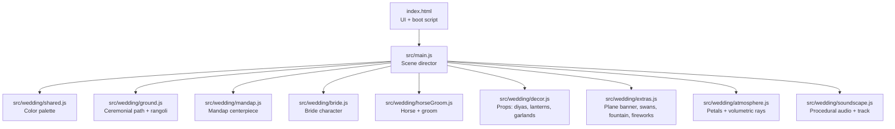
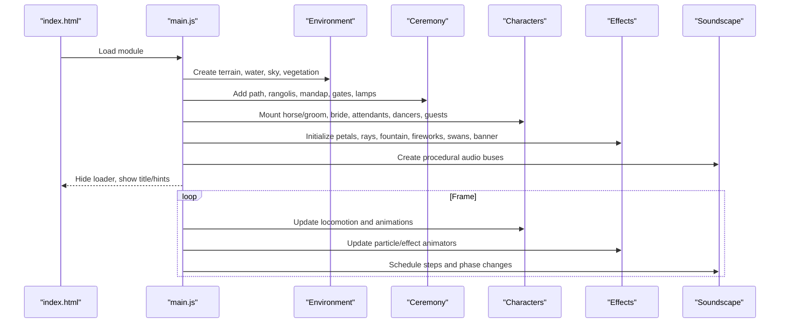
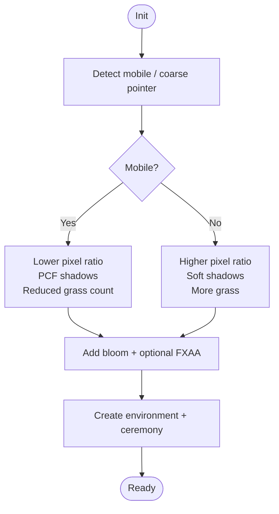
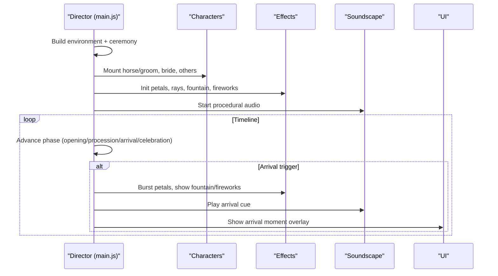
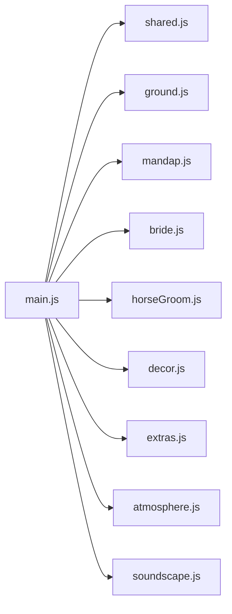

# 3D Asset Loading

<cite>
**Referenced Files in This Document**
- [index.html](file://3D Wedding Invitation Sample 2/3d-world-source/index.html)
- [main.js](file://3D Wedding Invitation Sample 2/3d-world-source/src/main.js)
- [shared.js](file://3D Wedding Invitation Sample 2/3d-world-source/src/wedding/shared.js)
- [atmosphere.js](file://3D Wedding Invitation Sample 2/3d-world-source/src/wedding/atmosphere.js)
- [ground.js](file://3D Wedding Invitation Sample 2/3d-world-source/src/wedding/ground.js)
- [mandap.js](file://3D Wedding Invitation Sample 2/3d-world-source/src/wedding/mandap.js)
- [bride.js](file://3D Wedding Invitation Sample 2/3d-world-source/src/wedding/bride.js)
- [horseGroom.js](file://3D Wedding Invitation Sample 2/3d-world-source/src/wedding/horseGroom.js)
- [decor.js](file://3D Wedding Invitation Sample 2/3d-world-source/src/wedding/decor.js)
- [extras.js](file://3D Wedding Invitation Sample 2/3d-world-source/src/wedding/extras.js)
- [soundscape.js](file://3D Wedding Invitation Sample 2/3d-world-source/src/wedding/soundscape.js)
- [package.json](file://3D Wedding Invitation Sample 2/3d-world-source/package.json)
- [vite.config.js](file://3D Wedding Invitation Sample 2/3d-world-source/vite.config.js)
</cite>

## Table of Contents
1. [Introduction](#introduction)
2. [Project Structure](#project-structure)
3. [Core Components](#core-components)
4. [Architecture Overview](#architecture-overview)
5. [Detailed Component Analysis](#detailed-component-analysis)
6. [Dependency Analysis](#dependency-analysis)
7. [Performance Considerations](#performance-considerations)
8. [Troubleshooting Guide](#troubleshooting-guide)
9. [Conclusion](#conclusion)

## Introduction
This document explains how the Three.js-based wedding invitation system loads and renders 3D assets efficiently, with a focus on non-blocking initialization, modular scene composition, adaptive quality, progressive loading, and memory management. The world initializes quickly by rendering lightweight environment geometry first, then adds characters, decorations, and atmospheric effects as the experience progresses. Rendering quality adapts to device capabilities, and heavy or temporary assets are managed carefully to avoid memory leaks during transitions or when closing the experience.

## Project Structure
The 3D world is implemented as a single-page application built with Vite and Three.js. The entry HTML wires up UI overlays (loading veil, title card, hints) and boots the 3D module. The main module composes the scene from small, feature-focused modules under a shared palette and utilities.



**Diagram sources**
- [index.html:226-259](file://3D Wedding Invitation Sample 2/3d-world-source/index.html#L226-L259)
- [main.js:1-23](file://3D Wedding Invitation Sample 2/3d-world-source/src/main.js#L1-L23)
- [shared.js:1-26](file://3D Wedding Invitation Sample 2/3d-world-source/src/wedding/shared.js#L1-L26)
- [ground.js:1-10](file://3D Wedding Invitation Sample 2/3d-world-source/src/wedding/ground.js#L1-L10)
- [mandap.js:1-10](file://3D Wedding Invitation Sample 2/3d-world-source/src/wedding/mandap.js#L1-L10)
- [bride.js:1-12](file://3D Wedding Invitation Sample 2/3d-world-source/src/wedding/bride.js#L1-L12)
- [horseGroom.js:1-9](file://3D Wedding Invitation Sample 2/3d-world-source/src/wedding/horseGroom.js#L1-L9)
- [decor.js:1-10](file://3D Wedding Invitation Sample 2/3d-world-source/src/wedding/decor.js#L1-L10)
- [extras.js:1-6](file://3D Wedding Invitation Sample 2/3d-world-source/src/wedding/extras.js#L1-L6)
- [atmosphere.js:1-14](file://3D Wedding Invitation Sample 2/3d-world-source/src/wedding/atmosphere.js#L1-L14)
- [soundscape.js:1-20](file://3D Wedding Invitation Sample 2/3d-world-source/src/wedding/soundscape.js#L1-L20)

**Section sources**
- [index.html:226-259](file://3D Wedding Invitation Sample 2/3d-world-source/index.html#L226-L259)
- [package.json:1-22](file://3D Wedding Invitation Sample 2/3d-world-source/package.json#L1-L22)
- [vite.config.js:1-20](file://3D Wedding Invitation Sample 2/3d-world-source/vite.config.js#L1-L20)

## Core Components
- Scene director and runtime: Initializes renderer, camera, controls, post-processing, lighting, terrain, water, vegetation, and the ceremonial layer. It also drives the procession timeline, camera choreography, and per-frame updates.
- Modular asset modules: Each feature (mandap, bride, horse/groom, decor props, atmosphere, extras) is encapsulated in its own module and returns groups or { group, update } objects that the director mounts into the scene.
- Shared palette: A centralized color palette ensures consistent materials across modules.
- Audio subsystem: Procedural soundscape with optional streamed piano track; phases adapt to story timing.

Key responsibilities:
- Adaptive quality based on device type (mobile vs desktop).
- Progressive addition of actors and effects.
- Centralized update loop for animated assets.
- Clean separation between static and animated assets via mounting helpers.

**Section sources**
- [main.js:135-188](file://3D Wedding Invitation Sample 2/3d-world-source/src/main.js#L135-L188)
- [main.js:925-1186](file://3D Wedding Invitation Sample 2/3d-world-source/src/main.js#L925-L1186)
- [shared.js:1-26](file://3D Wedding Invitation Sample 2/3d-world-source/src/wedding/shared.js#L1-L26)
- [soundscape.js:31-638](file://3D Wedding Invitation Sample 2/3d-world-source/src/wedding/soundscape.js#L31-L638)

## Architecture Overview
The world follows a layered architecture:
- Environment layer: Terrain, rivers, lake, sky, basic vegetation, mountains, clouds, birds, butterflies.
- Ceremonial layer: Path, rangolis, mandap base pad, toran gates, lamp pillars, floral arch.
- Character layer: Horse/groom, bride, attendants, dancers, guests.
- Effects layer: Petal system, volumetric rays, money fountain, fireworks, swans, plane banner.
- Audio layer: Procedural music and cues synchronized with story phases.



**Diagram sources**
- [index.html:226-259](file://3D Wedding Invitation Sample 2/3d-world-source/index.html#L226-L259)
- [main.js:593-632](file://3D Wedding Invitation Sample 2/3d-world-source/src/main.js#L593-L632)
- [main.js:925-1186](file://3D Wedding Invitation Sample 2/3d-world-source/src/main.js#L925-L1186)
- [soundscape.js:31-638](file://3D Wedding Invitation Sample 2/3d-world-source/src/wedding/soundscape.js#L31-L638)

## Detailed Component Analysis

### Adaptive Quality System
- Mobile detection influences pixel ratio, shadow map type, antialiasing, fog density, grass counts, and other performance-sensitive settings.
- Renderer configuration sets appropriate shadow maps and tone mapping. Post-processing includes bloom and optional FXAA on desktop.
- Vegetation and instanced meshes reduce draw calls while keeping visual richness.



**Diagram sources**
- [main.js:111-188](file://3D Wedding Invitation Sample 2/3d-world-source/src/main.js#L111-L188)
- [main.js:814-834](file://3D Wedding Invitation Sample 2/3d-world-source/src/main.js#L814-L834)

**Section sources**
- [main.js:111-188](file://3D Wedding Invitation Sample 2/3d-world-source/src/main.js#L111-L188)
- [main.js:814-834](file://3D Wedding Invitation Sample 2/3d-world-source/src/main.js#L814-L834)

### Progressive Loading and Story Timeline
- The world builds the environment and ceremony first, then mounts characters and effects.
- The procession timeline orchestrates movement, arrival, and celebration phases, triggering effects like petal bursts, money fountain, fireworks, and audio cues at precise moments.
- Camera choreography provides an intro fly-in followed by a smooth follow mode.



**Diagram sources**
- [main.js:925-1186](file://3D Wedding Invitation Sample 2/3d-world-source/src/main.js#L925-L1186)
- [main.js:1188-1308](file://3D Wedding Invitation Sample 2/3d-world-source/src/main.js#L1188-L1308)
- [soundscape.js:390-418](file://3D Wedding Invitation Sample 2/3d-world-source/src/wedding/soundscape.js#L390-L418)

**Section sources**
- [main.js:925-1186](file://3D Wedding Invitation Sample 2/3d-world-source/src/main.js#L925-L1186)
- [main.js:1188-1308](file://3D Wedding Invitation Sample 2/3d-world-source/src/main.js#L1188-L1308)

### Modular Asset Modules
Each module encapsulates a specific visual element and exposes a simple API:
- Mandap: Returns a group representing the ceremonial structure.
- Bride: Returns { group, update }, with idle sway and arrival animation control.
- Horse/Groom: Returns { group, update } with distance-driven gait and idle motion.
- Decor: Small reusable props (diya, lantern, garland, kalash, petal tray).
- Extras: Plane banner, swans, money fountain, fireworks, team banner.
- Atmosphere: Petal system and volumetric rays with update hooks.
- Ground: Ceremonial path and rangoli medallions.

```mermaid
classDiagram
class MandapModule {
+createMandap() Group
}
class BrideModule {
+createBride() Object{group, update, setArrival}
}
class HorseGroomModule {
+createHorseGroom() Object{group, update, gaitScale, gaitOffset}
}
class DecorModule {
+createDiya() Group
+createLantern() Object{group, update}
+createHangingGarland() Group
+createKalash() Group
+createPetalTray() Group
}
class ExtrasModule {
+createPlaneBanner() Object{group, update}
+createSwan() Object{group, update}
+createMoneyFountain() Object{group, update, setOrigin}
+createFirework() Object{group, update}
+createTeamGroomBanner() Object{group, update}
}
class AtmosphereModule {
+createPetalSystem() Object{group, update, burst}
+createVolumetricRays() Object{group, update}
}
class GroundModule {
+createCeremonialPath() Group
+createRangoli() Group
}
MandapModule --> AtmosphereModule : "uses palette"
BrideModule --> AtmosphereModule : "uses palette"
HorseGroomModule --> AtmosphereModule : "uses palette"
ExtrasModule --> AtmosphereModule : "uses palette"
GroundModule --> AtmosphereModule : "uses palette"
```

**Diagram sources**
- [mandap.js:10-261](file://3D Wedding Invitation Sample 2/3d-world-source/src/wedding/mandap.js#L10-L261)
- [bride.js:12-274](file://3D Wedding Invitation Sample 2/3d-world-source/src/wedding/bride.js#L12-L274)
- [horseGroom.js:9-303](file://3D Wedding Invitation Sample 2/3d-world-source/src/wedding/horseGroom.js#L9-L303)
- [decor.js:27-289](file://3D Wedding Invitation Sample 2/3d-world-source/src/wedding/decor.js#L27-L289)
- [extras.js:47-303](file://3D Wedding Invitation Sample 2/3d-world-source/src/wedding/extras.js#L47-L303)
- [atmosphere.js:38-328](file://3D Wedding Invitation Sample 2/3d-world-source/src/wedding/atmosphere.js#L38-L328)
- [ground.js:113-316](file://3D Wedding Invitation Sample 2/3d-world-source/src/wedding/ground.js#L113-L316)

**Section sources**
- [mandap.js:10-261](file://3D Wedding Invitation Sample 2/3d-world-source/src/wedding/mandap.js#L10-L261)
- [bride.js:12-274](file://3D Wedding Invitation Sample 2/3d-world-source/src/wedding/bride.js#L12-L274)
- [horseGroom.js:9-303](file://3D Wedding Invitation Sample 2/3d-world-source/src/wedding/horseGroom.js#L9-L303)
- [decor.js:27-289](file://3D Wedding Invitation Sample 2/3d-world-source/src/wedding/decor.js#L27-L289)
- [extras.js:47-303](file://3D Wedding Invitation Sample 2/3d-world-source/src/wedding/extras.js#L47-L303)
- [atmosphere.js:38-328](file://3D Wedding Invitation Sample 2/3d-world-source/src/wedding/atmosphere.js#L38-L328)
- [ground.js:113-316](file://3D Wedding Invitation Sample 2/3d-world-source/src/wedding/ground.js#L113-L316)

### Non-Critical Loading and Main Thread Safety
- The world avoids blocking the main thread by constructing geometry procedurally and using efficient data structures (InstancedMesh for grass, flowers, particles).
- Heavy effects (petals, rays, fountain, fireworks) are initialized once and updated per frame without allocating new objects in the hot path.
- Audio uses streaming media elements and procedural synthesis to avoid large decodes and keep responsiveness high.

Practical patterns observed:
- InstancedMesh usage for repeated geometry (grass, petals, money notes, sparks).
- Lightweight canvas textures generated at startup rather than loaded from disk where possible.
- Minimal allocations in update loops; matrices reused via temporary objects.

**Section sources**
- [main.js:792-834](file://3D Wedding Invitation Sample 2/3d-world-source/src/main.js#L792-L834)
- [atmosphere.js:38-205](file://3D Wedding Invitation Sample 2/3d-world-source/src/wedding/atmosphere.js#L38-L205)
- [extras.js:153-257](file://3D Wedding Invitation Sample 2/3d-world-source/src/wedding/extras.js#L153-L257)
- [soundscape.js:1-20](file://3D Wedding Invitation Sample 2/3d-world-source/src/wedding/soundscape.js#L1-L20)

### Memory Management Practices
- Materials are created once per module and reused within that module to minimize GPU state changes.
- Geometry reuse: Shared geometries for repeated parts (e.g., pillar components, flower beads).
- Dynamic draw usage flags for frequently updated instance matrices to optimize GPU buffer updates.
- Temporary vectors and quaternions are reused in tight loops to avoid GC pressure.
- Visibility toggling for effects (fountain, fireworks) when not active to reduce unnecessary updates.

Cleanup considerations:
- When transitioning scenes or closing the experience, ensure removal of all scene children, disposal of geometries, materials, textures, and event listeners attached to DOM elements.
- Dispose of any custom render targets or post-processing resources if added later.
- Stop audio scheduling intervals and release references to audio nodes/sources to free memory.

[No sources needed since this section provides general guidance grounded in observed patterns]

## Dependency Analysis
The main module imports feature modules and coordinates their lifecycle. Shared constants (palette) are imported by multiple modules to maintain visual consistency.



**Diagram sources**
- [main.js:1-23](file://3D Wedding Invitation Sample 2/3d-world-source/src/main.js#L1-L23)
- [shared.js:1-26](file://3D Wedding Invitation Sample 2/3d-world-source/src/wedding/shared.js#L1-L26)

**Section sources**
- [main.js:1-23](file://3D Wedding Invitation Sample 2/3d-world-source/src/main.js#L1-L23)

## Performance Considerations
- Adaptive rendering: Pixel ratio, shadow maps, and post-processing are tuned for mobile vs desktop.
- Efficient geometry: Procedural generation and shared materials reduce overhead.
- Instancing: Large populations (grass, flowers, petals, money, sparks) use InstancedMesh to minimize draw calls.
- Animation budgets: Character animations are lightweight pivots and transforms; no physics engine.
- Audio strategy: Streaming media element for long tracks; procedural synthesis for effects to avoid decoding large buffers.

Recommendations:
- Keep update functions allocation-free; reuse temporary objects.
- Use visibility toggles for effects only when needed.
- Monitor GPU memory by limiting texture sizes and reusing materials.
- Profile frame times to identify spikes from heavy operations.

[No sources needed since this section provides general guidance]

## Troubleshooting Guide
Common issues and remedies:
- Stutter on first load: Ensure heavy effects are not constructed synchronously on the critical path; prefer deferred initialization after initial frame.
- Excessive memory growth: Check for undisposed textures, materials, and geometries; remove scene children before navigation or teardown.
- Audio not starting: Confirm user gesture required to resume AudioContext; handle errors gracefully and fall back to procedural audio.
- Poor mobile performance: Reduce pixel ratio, disable FXAA, lower shadow resolution, and decrease instance counts.

Validation points:
- Verify that loaders hide appropriately and UI feedback is provided.
- Confirm that interaction tips appear and disappear as expected.
- Ensure arrival cues trigger effects and audio at correct times.

**Section sources**
- [index.html:46-66](file://3D Wedding Invitation Sample 2/3d-world-source/index.html#L46-L66)
- [main.js:1521-1599](file://3D Wedding Invitation Sample 2/3d-world-source/src/main.js#L1521-L1599)
- [soundscape.js:480-574](file://3D Wedding Invitation Sample 2/3d-world-source/src/wedding/soundscape.js#L480-L574)

## Conclusion
The wedding invitation’s 3D world achieves smooth, cinematic experiences by combining modular asset design, adaptive quality, and careful memory practices. The environment and ceremony layer initialize first, followed by characters and effects, with a robust timeline driving interactions. Procedural techniques and instancing keep performance predictable across devices. For future enhancements, consider explicit cleanup routines for scene transitions and resource disposal to ensure zero-leak behavior when users navigate away or close the experience.