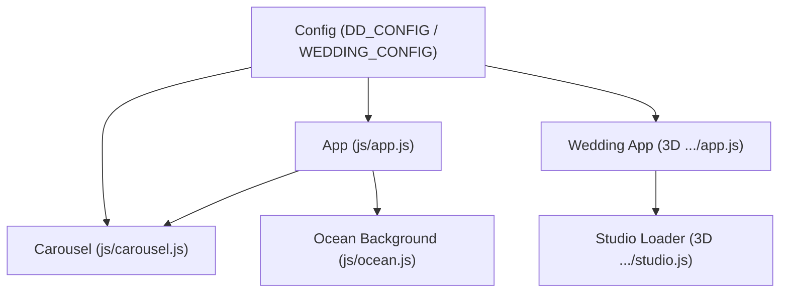
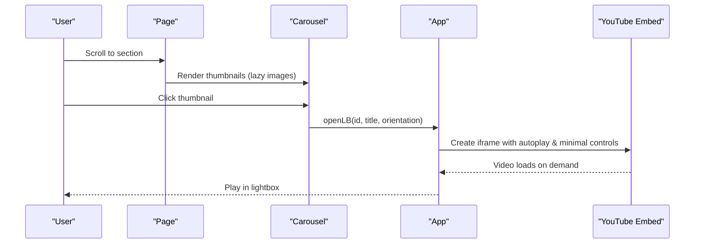
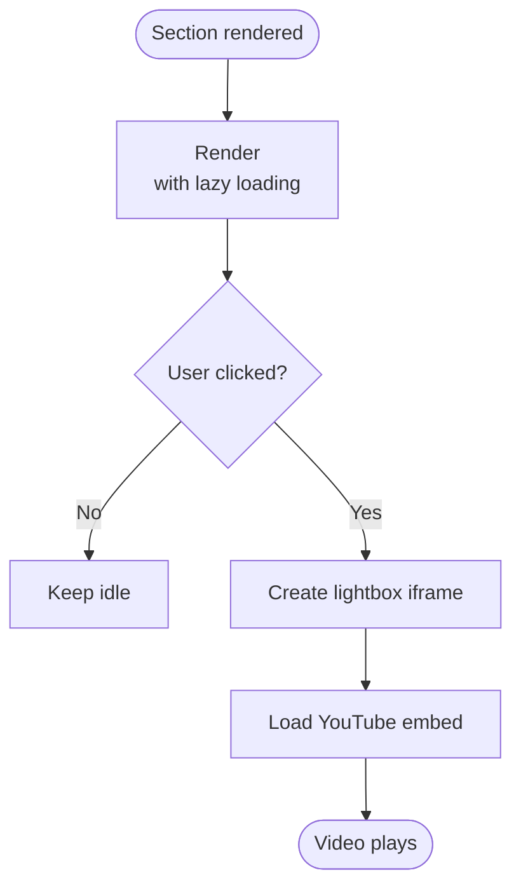
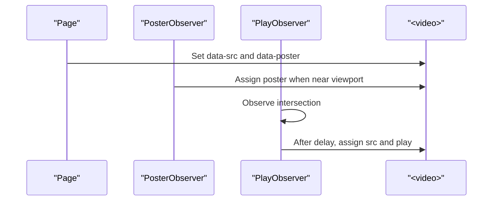
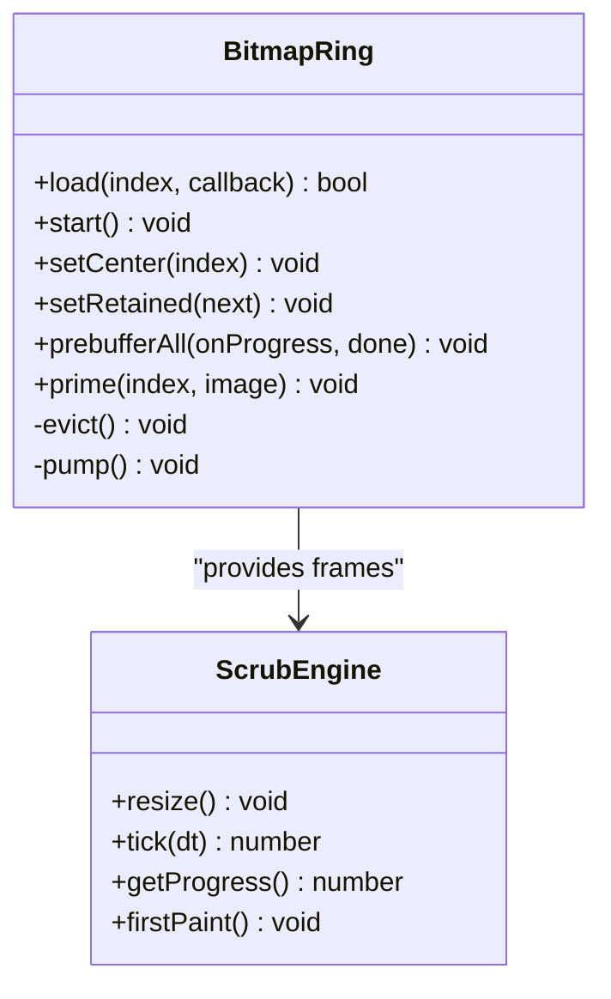
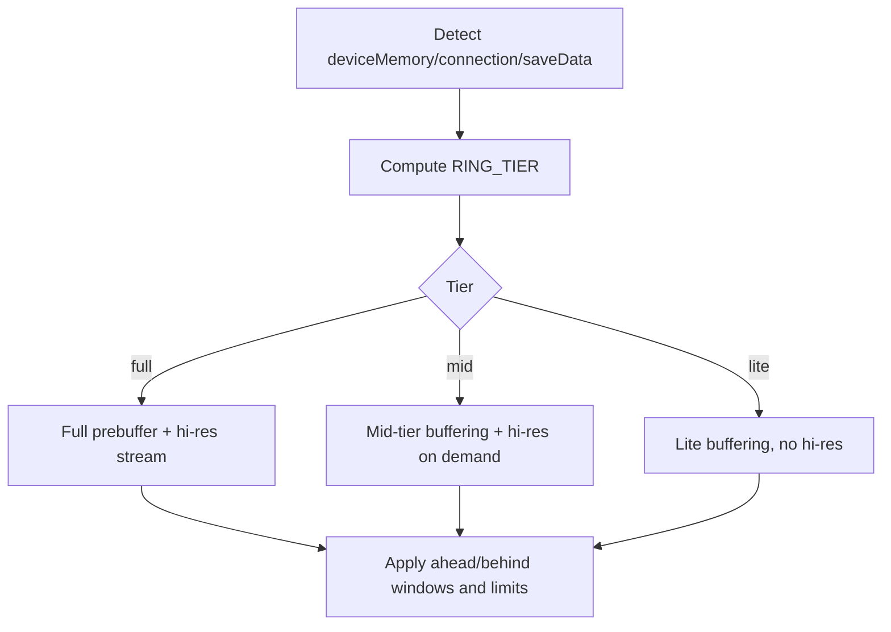
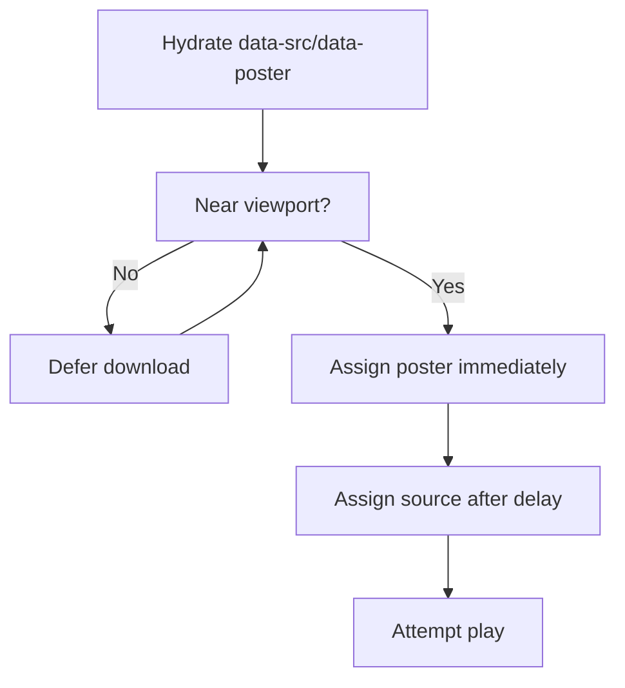
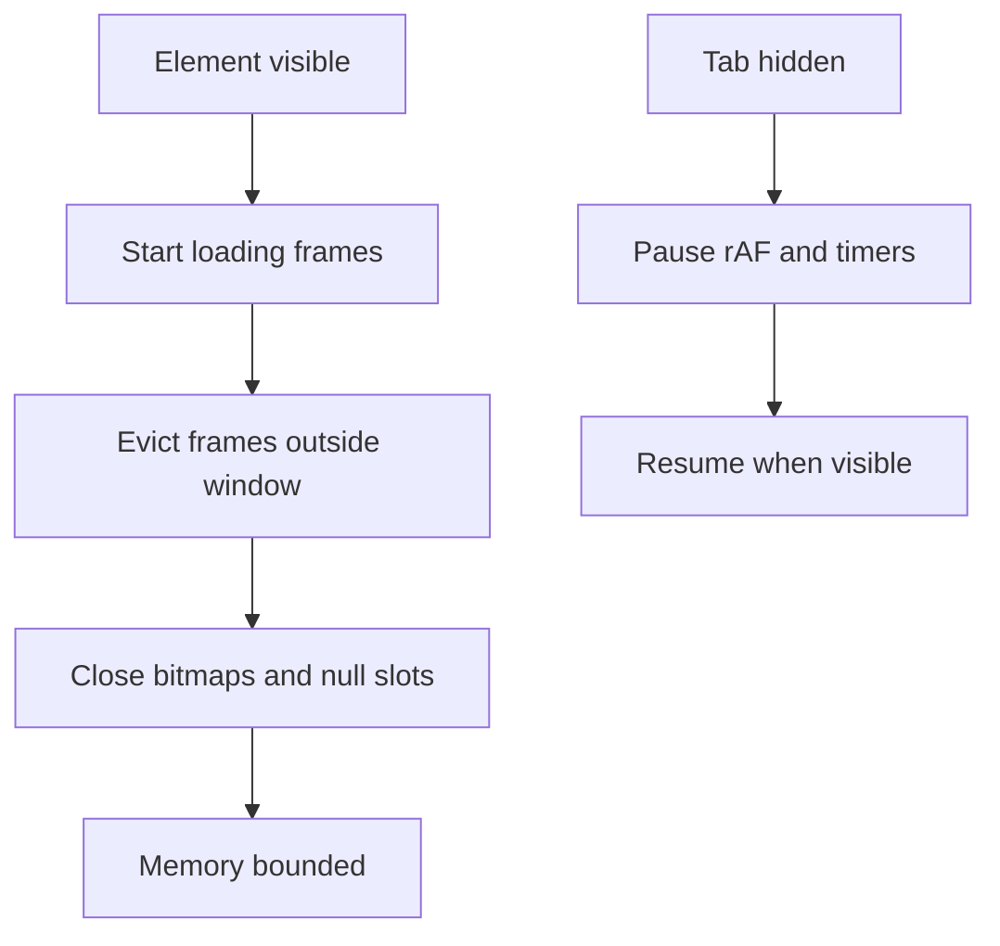
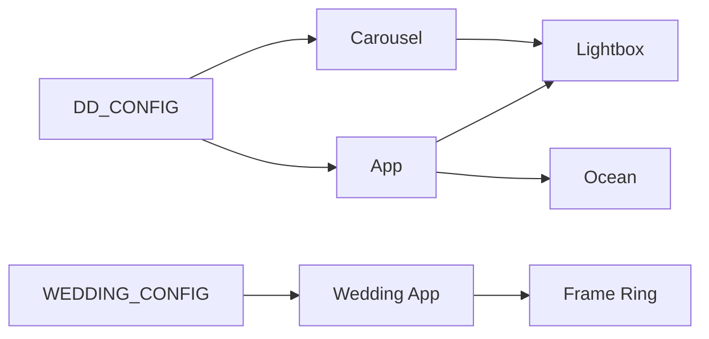

# Asset Loading Optimization

<cite>
**Referenced Files in This Document**
- [js/config.js](file://js/config.js)
- [js/carousel.js](file://js/carousel.js)
- [js/app.js](file://js/app.js)
- [3D Wedding Invitation Sample 2/config.js](file://3D%20Wedding%20Invitation%20Sample%202/config.js)
- [3D Wedding Invitation Sample 2/app.js](file://3D%20Wedding%20Invitation%20Sample%202/app.js)
- [3D Wedding Invitation Sample 2/studio.js](file://3D%20Wedding%20Invitation%20Sample%202/studio.js)
- [js/ocean.js](file://js/ocean.js)
</cite>

## Table of Contents
1. [Introduction](#introduction)
2. [Project Structure](#project-structure)
3. [Core Components](#core-components)
4. [Architecture Overview](#architecture-overview)
5. [Detailed Component Analysis](#detailed-component-analysis)
6. [Dependency Analysis](#dependency-analysis)
7. [Performance Considerations](#performance-considerations)
8. [Troubleshooting Guide](#troubleshooting-guide)
9. [Conclusion](#conclusion)

## Introduction
This document explains how the DeepDreams portfolio system optimizes asset loading to keep initial page weight low and maintain smooth interactions. It focuses on:
- Lazy loading YouTube videos, images, and heavy 3D assets using Intersection Observer
- Progressive video loading in the carousel to avoid blocking the first paint
- A configuration-driven approach that selects asset quality and behavior based on viewport size and device capabilities
- Non-critical loading strategies for heavy assets
- Image preloading strategies that balance performance with user experience
- Memory management practices to prevent leaks from unloaded assets and ensure proper cleanup when components are destroyed

## Project Structure
The portfolio uses a small set of focused modules:
- Configuration files define content and capability-aware settings
- The main app wires up global behaviors (hero video, lightbox, animations)
- The carousel module renders sections and defers heavy work until needed
- The 3D wedding invitation sample contains advanced frame-based media streaming with memory-bounded rings
- An ocean background canvas runs only when visible and is paused when offscreen or hidden

**Diagram sources**
- [js/config.js:20-129](file://js/config.js#L20-L129)
- [js/app.js:1-210](file://js/app.js#L1-L210)
- [js/carousel.js:1-569](file://js/carousel.js#L1-L569)
- [js/ocean.js:1-200](file://js/ocean.js#L1-L200)
- [3D Wedding Invitation Sample 2/config.js:6-123](file://3D%20Wedding%20Invitation%20Sample%202/config.js#L6-L123)
- [3D Wedding Invitation Sample 2/app.js:1-800](file://3D%20Wedding%20Invitation%20Sample%202/app.js#L1-L800)
- [3D Wedding Invitation Sample 2/studio.js:76-145](file://3D%20Wedding%20Invitation%20Sample%202/studio.js#L76-L145)

**Section sources**
- [js/config.js:20-129](file://js/config.js#L20-L129)
- [3D Wedding Invitation Sample 2/config.js:6-123](file://3D%20Wedding%20Invitation%20Sample%202/config.js#L6-L123)

## Core Components
- Configuration-driven content and capabilities:
  - Portfolio config defines hero video, social links, and showcase items
  - Wedding invitation config defines frame counts, paths, and film metadata
- Carousel and sections:
  - Renders thumbnails and defers embedding heavy iframes until interaction
  - Uses lazy image loading attributes and lightweight placeholders
- Lightbox:
  - Creates YouTube embeds on demand when a user opens a video
- 3D frame engine:
  - Streams frames via Intersection Observer and decodes off-main-thread
  - Uses bitmap rings with eviction to bound memory
- Ocean background:
  - Pauses animation loop when tab is hidden; throttles drawing when offscreen

**Section sources**
- [js/carousel.js:17-25](file://js/carousel.js#L17-L25)
- [js/app.js:26-29](file://js/app.js#L26-L29)
- [js/app.js:146-188](file://js/app.js#L146-L188)
- [3D Wedding Invitation Sample 2/app.js:347-477](file://3D%20Wedding%20Invitation%20Sample%202/app.js#L347-L477)
- [js/ocean.js:428-461](file://js/ocean.js#L428-L461)

## Architecture Overview
The system separates data (config), rendering (carousel/app), and heavy media (3D frames/videos). Heavy resources are loaded lazily and only when necessary. Capability detection controls quality and concurrency.

**Diagram sources**
- [js/carousel.js:324-334](file://js/carousel.js#L324-L334)
- [js/app.js:146-188](file://js/app.js#L146-L188)

## Detailed Component Analysis

### Lazy Loading YouTube Videos in the Carousel
- Thumbnails are lightweight images loaded with native lazy loading to reduce initial payload
- Actual YouTube iframes are not created until the user clicks a thumbnail
- The lightbox creates an embed only on demand, preventing unnecessary network requests at page load

**Diagram sources**
- [js/carousel.js:361-373](file://js/carousel.js#L361-L373)
- [js/app.js:146-188](file://js/app.js#L146-L188)

**Section sources**
- [js/carousel.js:361-373](file://js/carousel.js#L361-L373)
- [js/app.js:146-188](file://js/app.js#L146-L188)

### Progressive Video Loading for Film Bands in the Wedding Invitation
- Video elements are hydrated with data attributes instead of immediate src assignment to avoid starting downloads on page load
- Intersection Observers detect when videos enter the viewport
- Posters are assigned early for visual feedback; playback starts after a short delay once visible
- Multiple observers coordinate poster assignment and play scheduling

**Diagram sources**
- [3D Wedding Invitation Sample 2/app.js:108-132](file://3D%20Wedding%20Invitation%20Sample%202/app.js#L108-L132)
- [3D Wedding Invitation Sample 2/app.js:1690-1721](file://3D%20Wedding%20Invitation%20Sample%202/app.js#L1690-L1721)

**Section sources**
- [3D Wedding Invitation Sample 2/app.js:108-132](file://3D%20Wedding%20Invitation%20Sample%202/app.js#L108-L132)
- [3D Wedding Invitation Sample 2/app.js:1690-1721](file://3D%20Wedding%20Invitation%20Sample%202/app.js#L1690-L1721)

### Heavy 3D Assets: Frame-Based Streaming with Intersection Observer
- Frames are loaded only when the scrub area becomes visible
- Images are decoded off the main thread using createImageBitmap where available
- A direction-aware ring buffer keeps only nearby frames resident; older frames are evicted and closed to free memory
- Concurrency limits cap simultaneous loads to avoid overwhelming the network or CPU

**Diagram sources**
- [3D Wedding Invitation Sample 2/app.js:347-477](file://3D%20Wedding%20Invitation%20Sample%202/app.js#L347-L477)
- [3D Wedding Invitation Sample 2/app.js:608-713](file://3D%20Wedding%20Invitation%20Sample%202/app.js#L608-L713)

**Section sources**
- [3D Wedding Invitation Sample 2/app.js:347-477](file://3D%20Wedding%20Invitation%20Sample%202/app.js#L347-L477)
- [3D Wedding Invitation Sample 2/app.js:608-713](file://3D%20Wedding%20Invitation%20Sample%202/app.js#L608-L713)

### Configuration-Driven Loading Based on Viewport and Device Capabilities
- Capability tiering determines whether to use full prebuffering, interpolation, and high-resolution frames
- Device memory and connection type influence concurrency and retention windows
- For mobile touch devices, lower DPR and reduced concurrency are used to preserve responsiveness
- The wedding invitation config centralizes frame counts and paths so loaders can adapt without hard-coded values

**Diagram sources**
- [3D Wedding Invitation Sample 2/app.js:479-489](file://3D%20Wedding%20Invitation%20Sample%202/app.js#L479-L489)
- [3D Wedding Invitation Sample 2/config.js:97-123](file://3D%20Wedding%20Invitation%20Sample%202/config.js#L97-L123)

**Section sources**
- [3D Wedding Invitation Sample 2/app.js:479-489](file://3D%20Wedding%20Invitation%20Sample%202/app.js#L479-L489)
- [3D Wedding Invitation Sample 2/config.js:97-123](file://3D%20Wedding%20Invitation%20Sample%202/config.js#L97-L123)

### Image Preloading Strategies That Balance Performance and UX
- Lightweight posters are assigned early to provide instant visual feedback
- Actual video sources are deferred until the element is near the viewport
- Low-resolution frame sequences are loaded progressively with concurrency limits
- First-frame failures gracefully fall back to static placeholders

**Diagram sources**
- [3D Wedding Invitation Sample 2/app.js:108-132](file://3D%20Wedding%20Invitation%20Sample%202/app.js#L108-L132)
- [3D Wedding Invitation Sample 2/studio.js:96-129](file://3D%20Wedding%20Invitation%20Sample%202/studio.js#L96-L129)

**Section sources**
- [3D Wedding Invitation Sample 2/app.js:108-132](file://3D%20Wedding%20Invitation%20Sample%202/app.js#L108-L132)
- [3D Wedding Invitation Sample 2/studio.js:96-129](file://3D%20Wedding%20Invitation%20Sample%202/studio.js#L96-L129)

### Memory Management and Cleanup Practices
- Off-main-thread decoding reduces jank and allows faster GC of temporary objects
- Bitmap ring eviction closes bitmaps outside the active window to free GPU/CPU memory
- Intersection Observers disconnect after triggering to release references
- Animation loops pause when tabs are hidden and resume when visible
- Lightbox clears inner HTML after closing to remove embedded iframes and event handlers

**Diagram sources**
- [3D Wedding Invitation Sample 2/app.js:362-376](file://3D%20Wedding%20Invitation%20Sample%202/app.js#L362-L376)
- [js/ocean.js:428-461](file://js/ocean.js#L428-L461)
- [js/app.js:183-188](file://js/app.js#L183-L188)

**Section sources**
- [3D Wedding Invitation Sample 2/app.js:362-376](file://3D%20Wedding%20Invitation%20Sample%202/app.js#L362-L376)
- [js/ocean.js:428-461](file://js/ocean.js#L428-L461)
- [js/app.js:183-188](file://js/app.js#L183-L188)

## Dependency Analysis
- Config drives both portfolio and wedding invitation experiences
- Carousel depends on config for content and delegates video playback to the shared lightbox
- Wedding invitation app reads config to determine frame counts and paths, then applies capability-based strategies
- Ocean background integrates with scroll input from the main app and pauses itself when offscreen or hidden

**Diagram sources**
- [js/config.js:20-129](file://js/config.js#L20-L129)
- [3D Wedding Invitation Sample 2/config.js:6-123](file://3D%20Wedding%20Invitation%20Sample%202/config.js#L6-L123)
- [js/carousel.js:15-25](file://js/carousel.js#L15-L25)
- [js/app.js:146-188](file://js/app.js#L146-L188)
- [3D Wedding Invitation Sample 2/app.js:347-477](file://3D%20Wedding%20Invitation%20Sample%202/app.js#L347-L477)
- [js/ocean.js:1-200](file://js/ocean.js#L1-L200)

**Section sources**
- [js/config.js:20-129](file://js/config.js#L20-L129)
- [3D Wedding Invitation Sample 2/config.js:6-123](file://3D%20Wedding%20Invitation%20Sample%202/config.js#L6-L123)

## Performance Considerations
- Avoid initial page weight bloat by deferring heavy assets until they are needed
- Use Intersection Observer to gate expensive operations like decoding and network requests
- Prefer off-main-thread decoding to minimize layout and paint stalls
- Tune concurrency and retention windows based on device capabilities
- Pause or throttle animations when offscreen or hidden to save CPU and battery
- Clear DOM nodes and cancel timers when modals close to prevent leaks

[No sources needed since this section provides general guidance]

## Troubleshooting Guide
- If videos do not start playing:
  - Ensure data attributes are present and Intersection Observers are observing the correct elements
  - Verify that autoplay policies allow muted playback or that user gestures have occurred
- If 3D frames stutter:
  - Check capability tier and adjust ahead/behind windows or concurrency limits
  - Confirm that bitmaps are being evicted and closed properly
- If animations freeze:
  - Verify that rAF loops are canceled and resumed correctly on visibility changes
  - Ensure passive listeners are used for scroll events to avoid blocking

**Section sources**
- [3D Wedding Invitation Sample 2/app.js:1690-1721](file://3D%20Wedding%20Invitation%20Sample%202/app.js#L1690-L1721)
- [3D Wedding Invitation Sample 2/app.js:362-376](file://3D%20Wedding%20Invitation%20Sample%202/app.js#L362-L376)
- [js/ocean.js:428-461](file://js/ocean.js#L428-L461)

## Conclusion
The DeepDreams portfolio system achieves strong performance by:
- Deferring heavy assets until they are needed
- Using Intersection Observer to gate loading and playback
- Applying capability-aware strategies to balance quality and responsiveness
- Managing memory through bitmap eviction and careful cleanup
- Keeping the initial payload small while delivering rich media experiences on demand

[No sources needed since this section summarizes without analyzing specific files]