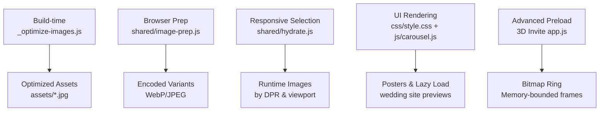
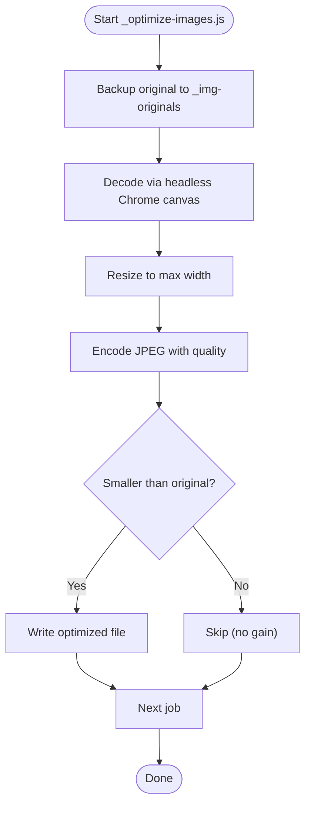
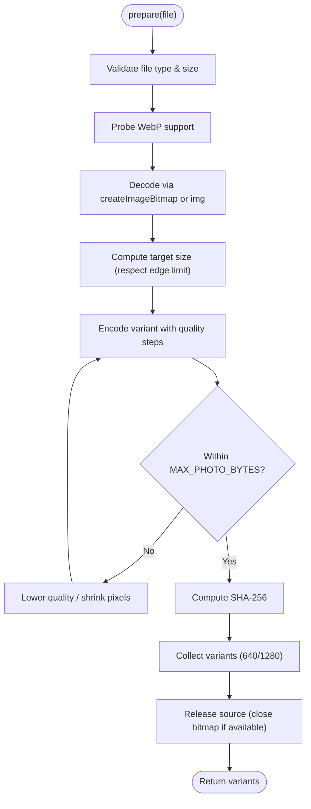
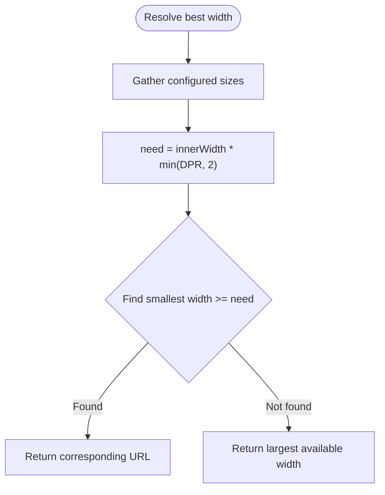
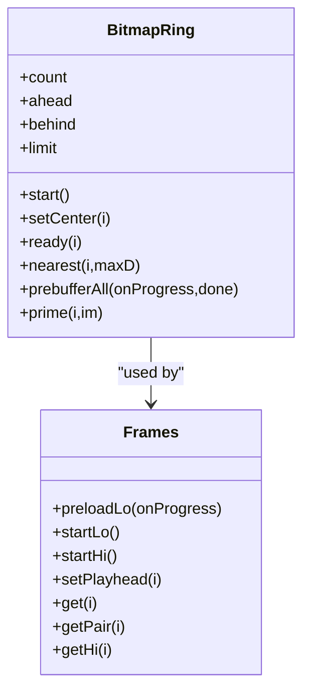
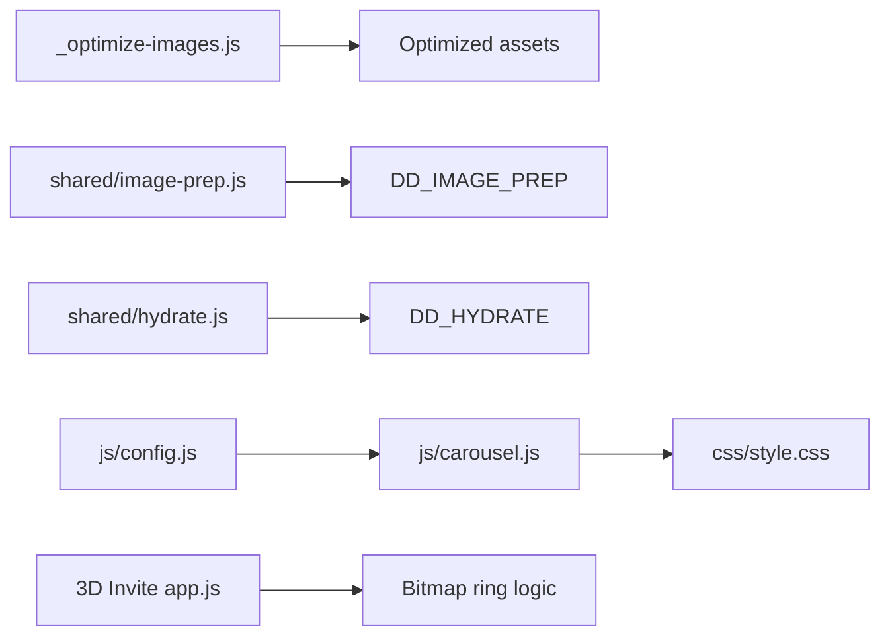

# Image Optimization Strategies

<cite>
**Referenced Files in This Document**
- [_optimize-images.js](file://_optimize-images.js)
- [shared/image-prep.js](file://shared/image-prep.js)
- [shared/hydrate.js](file://shared/hydrate.js)
- [js/config.js](file://js/config.js)
- [css/style.css](file://css/style.css)
- [js/app.js](file://js/app.js)
- [js/carousel.js](file://js/carousel.js)
- [wedding-invite/app.js](file://wedding-invite/app.js)
- [3D Wedding Invitation Sample 2/app.js](file://3D%20Wedding%20Invitation%20Sample%202/app.js)
</cite>

## Table of Contents
1. [Introduction](#introduction)
2. [Project Structure](#project-structure)
3. [Core Components](#core-components)
4. [Architecture Overview](#architecture-overview)
5. [Detailed Component Analysis](#detailed-component-analysis)
6. [Dependency Analysis](#dependency-analysis)
7. [Performance Considerations](#performance-considerations)
8. [Troubleshooting Guide](#troubleshooting-guide)
9. [Conclusion](#conclusion)

## Introduction
This document explains how the DeepDreams portfolio system optimizes images for performance and user experience across devices and networks. It covers:
- Responsive image loading based on viewport size and device capabilities using CSS media queries and JavaScript detection
- Preloading strategies that balance performance with perceived speed, including progressive poster loading for wedding sites
- The build-time image optimization pipeline that compresses assets and selects formats
- Configuration-driven behavior that controls which images load based on screen density and network conditions
- Memory management for large images and proper cleanup when components are removed from the DOM

## Project Structure
The image optimization strategy spans several layers:
- Build-time compression script to reduce landing page hero images
- Browser-side image preparation that resizes, re-encodes, and caps sizes before upload
- Runtime responsive selection that chooses the best width based on device pixel ratio and viewport
- UI rendering that uses posters, lazy loading, and progressive reveals for wedding site previews
- Advanced frame-based preloading and memory-bounded bitmap rings for cinematic experiences



**Diagram sources**
- [_optimize-images.js:1-51](file://_optimize-images.js#L1-L51)
- [shared/image-prep.js:1-360](file://shared/image-prep.js#L1-L360)
- [shared/hydrate.js:42-98](file://shared/hydrate.js#L42-L98)
- [css/style.css:318-577](file://css/style.css#L318-L577)
- [js/carousel.js:465-568](file://js/carousel.js#L465-L568)
- [3D Wedding Invitation Sample 2/app.js:347-477](file://3D%20Wedding%20Invitation%20Sample%202/app.js#L347-L477)

**Section sources**
- [_optimize-images.js:1-51](file://_optimize-images.js#L1-L51)
- [shared/image-prep.js:1-360](file://shared/image-prep.js#L1-L360)
- [shared/hydrate.js:42-98](file://shared/hydrate.js#L42-L98)
- [css/style.css:318-577](file://css/style.css#L318-L577)
- [js/carousel.js:465-568](file://js/carousel.js#L465-L568)
- [3D Wedding Invitation Sample 2/app.js:347-477](file://3D%20Wedding%20Invitation%20Sample%202/app.js#L347-L477)

## Core Components
- Build-time compressor: Re-encodes oversized JPEGs in place with headless Chrome canvas, preserving filenames and format while reducing file size.
- Browser-side image prep: Decodes uploaded photos, detects WebP capability, scales to target widths, enforces per-image and total size limits, discards EXIF, and computes SHA-256 hashes for deduplication and resume uploads.
- Responsive selector: Chooses the best width at runtime by combining viewport width and device pixel ratio, returning a single URL to avoid per-image srcset complexity.
- Poster and carousel renderer: Uses lightweight poster images for wedding site previews, lazy-loading thumbnails, and graceful fallbacks when iframes cannot be embedded.
- Advanced frame loader: Implements a direction-aware ring buffer of decoded bitmaps with eviction, prebuffering, and tiered quality based on device memory and network type.

**Section sources**
- [_optimize-images.js:9-48](file://_optimize-images.js#L9-L48)
- [shared/image-prep.js:33-41](file://shared/image-prep.js#L33-L41)
- [shared/image-prep.js:48-64](file://shared/image-prep.js#L48-L64)
- [shared/image-prep.js:131-177](file://shared/image-prep.js#L131-L177)
- [shared/hydrate.js:49-77](file://shared/hydrate.js#L49-L77)
- [js/carousel.js:470-514](file://js/carousel.js#L470-L514)
- [3D Wedding Invitation Sample 2/app.js:479-489](file://3D%20Wedding%20Invitation%20Sample%202/app.js#L479-L489)

## Architecture Overview
The system combines build-time and runtime optimizations to deliver fast, efficient images:

```mermaid
sequenceDiagram
participant User as "User"
participant UI as "Carousel/Poster Renderer"
participant Prep as "Image Prep (image-prep.js)"
participant Select as "Responsive Selector (hydrate.js)"
participant Server as "Storage/API"
participant Frames as "Frame Loader (3D Invite)"
User->>UI : Open wedding site preview
UI->>UI : Render poster image (lazy)
Note over UI : Use poster.jpg; defer heavy iframe until interaction
User->>Prep : Upload photo
Prep->>Prep : Detect WebP support
Prep->>Prep : Decode via createImageBitmap or img
Prep->>Prep : Scale to 640/1280; enforce MAX_IMAGE_EDGE
Prep->>Prep : Encode to WebP/JPEG with quality steps
Prep->>Server : Upload variants (SHA-256 keyed)
UI->>Select : Resolve best width
Select->>Select : Compute need = innerWidth * DPR
Select-->>UI : Return best URL
Frames->>Frames : Create bitmap ring
Frames->>Frames : Prebuffer low-res frames
Frames->>Frames : Evict bitmaps outside retention window
```

**Diagram sources**
- [js/carousel.js:470-514](file://js/carousel.js#L470-L514)
- [shared/image-prep.js:48-64](file://shared/image-prep.js#L48-L64)
- [shared/image-prep.js:131-177](file://shared/image-prep.js#L131-L177)
- [shared/hydrate.js:49-77](file://shared/hydrate.js#L49-L77)
- [3D Wedding Invitation Sample 2/app.js:357-477](file://3D%20Wedding%20Invitation%20Sample%202/app.js#L357-L477)

## Detailed Component Analysis

### Build-time Compression Pipeline
- Purpose: Reduce oversized landing page JPEGs without changing HTML/CSS references.
- Process:
  - Back up originals to _img-originals
  - Launch headless Chrome, decode each image into a canvas
  - Resize to max width and encode with quality factor
  - Write back only if smaller than original
- Output: Smaller files at same paths and format, improving initial load times.



**Diagram sources**
- [_optimize-images.js:18-48](file://_optimize-images.js#L18-L48)

**Section sources**
- [_optimize-images.js:9-48](file://_optimize-images.js#L9-L48)

### Browser-side Image Preparation
- Capability detection: Probes canvas to determine WebP encoding support; falls back to JPEG where needed.
- Decoding: Prefers createImageBitmap for speed; falls back to  decoding for compatibility.
- Scaling and sizing: Computes target dimensions respecting MAX_IMAGE_EDGE; ensures aspect ratio is preserved.
- Encoding strategy: Iteratively reduces quality and then pixel scale to meet per-image byte cap; reports oversize errors when necessary.
- Deduplication and metadata: Discards EXIF by re-encoding through canvas; computes SHA-256 hash for storage naming and resumable uploads.
- Batch processing: Processes multiple files sequentially to avoid memory pressure; validates total media bytes before upload.



**Diagram sources**
- [shared/image-prep.js:48-64](file://shared/image-prep.js#L48-L64)
- [shared/image-prep.js:68-94](file://shared/image-prep.js#L68-L94)
- [shared/image-prep.js:131-177](file://shared/image-prep.js#L131-L177)
- [shared/image-prep.js:181-195](file://shared/image-prep.js#L181-L195)
- [shared/image-prep.js:204-270](file://shared/image-prep.js#L204-L270)

**Section sources**
- [shared/image-prep.js:33-41](file://shared/image-prep.js#L33-L41)
- [shared/image-prep.js:48-64](file://shared/image-prep.js#L48-L64)
- [shared/image-prep.js:68-94](file://shared/image-prep.js#L68-L94)
- [shared/image-prep.js:131-177](file://shared/image-prep.js#L131-L177)
- [shared/image-prep.js:181-195](file://shared/image-prep.js#L181-L195)
- [shared/image-prep.js:204-270](file://shared/image-prep.js#L204-L270)
- [shared/image-prep.js:272-315](file://shared/image-prep.js#L272-L315)

### Responsive Image Selection at Runtime
- Strategy: Instead of per-image srcset, compute a single best width once per page using innerWidth and devicePixelRatio.
- Resolution: Multiply viewport width by DPR (capped), then pick the smallest configured width that meets or exceeds the need.
- Integration: Used to resolve markers in published content so templates can reference placeholders rather than hardcoding URLs.



**Diagram sources**
- [shared/hydrate.js:49-77](file://shared/hydrate.js#L49-L77)

**Section sources**
- [shared/hydrate.js:42-98](file://shared/hydrate.js#L42-L98)

### Poster Loading and Progressive Preloading for Wedding Sites
- Posters: Each wedding site entry includes a poster filename used to render a lightweight preview instead of embedding an iframe immediately.
- Lazy loading: Thumbnails use native lazy loading to defer offscreen images.
- Progressive reveal: When a user interacts with a card, the live demo link opens; otherwise, the poster remains visible without heavy resource usage.
- Fallbacks: If poster is missing, a styled placeholder is shown; if iframe embed fails, the poster remains the primary visual.

```mermaid
sequenceDiagram
participant User as "User"
participant Grid as "Site Grid"
participant Poster as "Poster Image"
participant Link as "Live Demo Link"
User->>Grid : View wedding sites
Grid->>Poster : Render poster (lazy)
Note over Poster : Lightweight image; no iframe yet
User->>Link : Click "View Live Demo"
Link-->>User : Open site in new tab
```

**Diagram sources**
- [js/config.js:103-106](file://js/config.js#L103-L106)
- [js/carousel.js:470-514](file://js/carousel.js#L470-L514)
- [css/style.css:514-577](file://css/style.css#L514-L577)

**Section sources**
- [js/config.js:91-106](file://js/config.js#L91-L106)
- [js/carousel.js:465-568](file://js/carousel.js#L465-L568)
- [css/style.css:514-577](file://css/style.css#L514-L577)

### Advanced Frame Preloading and Memory Management
- Bitmap ring: Maintains a circular buffer of decoded frames around the playhead; evicts bitmaps outside a retention window to bound memory.
- Tiered behavior: Chooses lite/mid/full tiers based on save-data flag, effective network type, and device memory; disables interpolation on lite tier.
- Prebuffering: Optionally decodes all frames ahead of time for smooth scrubbing; otherwise loads gate frames with retries.
- Cleanup: Explicitly closes ImageBitmap instances when evicted; resets failed slots; pauses streaming when not visible.



**Diagram sources**
- [3D Wedding Invitation Sample 2/app.js:357-477](file://3D%20Wedding%20Invitation%20Sample%202/app.js#L357-L477)
- [3D Wedding Invitation Sample 2/app.js:479-489](file://3D%20Wedding%20Invitation%20Sample%202/app.js#L479-L489)
- [3D Wedding Invitation Sample 2/app.js:515-606](file://3D%20Wedding%20Invitation%20Sample%202/app.js#L515-L606)

**Section sources**
- [3D Wedding Invitation Sample 2/app.js:347-477](file://3D%20Wedding%20Invitation%20Sample%202/app.js#L347-L477)
- [3D Wedding Invitation Sample 2/app.js:479-489](file://3D%20Wedding%20Invitation%20Sample%202/app.js#L479-L489)
- [3D Wedding Invitation Sample 2/app.js:515-606](file://3D%20Wedding%20Invitation%20Sample%202/app.js#L515-L606)

### Configuration-Driven Image Behavior
- Config object centralizes content and assets:
  - WEDDING_SITES entries include couple names, notes, URLs, and poster filenames
  - AI_BUILDS entries similarly define titles, notes, URLs, and poster filenames
- Carousel renderer consumes this configuration to generate poster cards and links, ensuring consistent presentation and behavior.

**Section sources**
- [js/config.js:91-114](file://js/config.js#L91-L114)
- [js/carousel.js:516-568](file://js/carousel.js#L516-L568)

### CSS Media Queries and Device Detection
- Reduced motion: Animations are disabled when prefers-reduced-motion is set, improving accessibility and performance.
- Touch/coarse pointer: Some behaviors adjust for touch devices (e.g., disabling hover effects, adjusting thresholds).
- Save data: Network-level save-data preference influences feature toggles like full prebuffering and interpolation.

**Section sources**
- [css/style.css:127-127](file://css/style.css#L127-L127)
- [css/style.css:542-546](file://css/style.css#L542-L546)
- [3D Wedding Invitation Sample 2/app.js:11-13](file://3D%20Wedding%20Invitation%20Sample%202/app.js#L11-L13)
- [3D Wedding Invitation Sample 2/app.js:479-489](file://3D%20Wedding%20Invitation%20Sample%202/app.js#L479-L489)

## Dependency Analysis
Key dependencies and relationships:
- Build-time script depends on Playwright Chromium to perform canvas-based re-encoding
- Browser prep module exposes DD_IMAGE_PREP API for client-side image processing
- Hydrate module provides DD_HYDRATE for resolving responsive URLs at runtime
- Carousel and config modules depend on DD_CONFIG for content and asset references
- Advanced frame loader depends on device capabilities and network signals to tune behavior



**Diagram sources**
- [_optimize-images.js:1-51](file://_optimize-images.js#L1-L51)
- [shared/image-prep.js:27-30](file://shared/image-prep.js#L27-L30)
- [shared/hydrate.js:25-27](file://shared/hydrate.js#L25-L27)
- [js/config.js:20-129](file://js/config.js#L20-L129)
- [js/carousel.js:12-15](file://js/carousel.js#L12-L15)
- [3D Wedding Invitation Sample 2/app.js:357-477](file://3D%20Wedding%20Invitation%20Sample%202/app.js#L357-L477)

**Section sources**
- [_optimize-images.js:1-51](file://_optimize-images.js#L1-L51)
- [shared/image-prep.js:27-30](file://shared/image-prep.js#L27-L30)
- [shared/hydrate.js:25-27](file://shared/hydrate.js#L25-L27)
- [js/config.js:20-129](file://js/config.js#L20-L129)
- [js/carousel.js:12-15](file://js/carousel.js#L12-L15)
- [3D Wedding Invitation Sample 2/app.js:357-477](file://3D%20Wedding%20Invitation%20Sample%202/app.js#L357-L477)

## Performance Considerations
- Prefer WebP when supported; fall back to JPEG for older iOS Safari
- Limit per-image and total media bytes to prevent excessive bandwidth and storage usage
- Use high-quality smoothing during canvas scaling to maintain visual fidelity
- Avoid simultaneous decoding of many large images; process sequentially to manage memory
- Choose appropriate tier (lite/mid/full) based on device memory and network conditions
- Evict bitmaps aggressively when not visible to keep memory bounded
- Use posters instead of iframes for previews to reduce initial payload

[No sources needed since this section provides general guidance]

## Troubleshooting Guide
Common issues and resolutions:
- NOT_AN_IMAGE: Ensure the selected file is a valid image; check MIME type and decoding path
- ENCODE_FAILED: Canvas encoding failed; retry with different quality or format
- SOURCE_TOO_LARGE: Source image exceeds maximum allowed size; ask users to select smaller files
- PHOTO_TOO_LARGE: Cannot compress under per-image cap; prompt user to choose another image
- MEDIA_TOTAL_TOO_LARGE: Combined size exceeds total media limit; remove some photos
- INSECURE_CONTEXT: SHA-256 requires secure context (HTTPS or localhost); ensure deployment is secure

**Section sources**
- [shared/image-prep.js:88-94](file://shared/image-prep.js#L88-L94)
- [shared/image-prep.js:105-112](file://shared/image-prep.js#L105-L112)
- [shared/image-prep.js:213-217](file://shared/image-prep.js#L213-L217)
- [shared/image-prep.js:235-240](file://shared/image-prep.js#L235-L240)
- [shared/image-prep.js:307-312](file://shared/image-prep.js#L307-L312)
- [shared/image-prep.js:181-184](file://shared/image-prep.js#L181-L184)

## Conclusion
The DeepDreams portfolio system employs a comprehensive image optimization strategy that balances performance and user experience:
- Build-time compression reduces initial payloads without breaking references
- Browser-side preparation ensures safe, efficient uploads with capability detection and strict size limits
- Runtime responsive selection delivers appropriately sized images based on device and viewport
- Poster-based previews and lazy loading improve perceived performance for wedding site showcases
- Advanced frame loaders provide smooth interactions while managing memory carefully
- Configuration-driven behavior allows flexible control over assets and presentation

These practices collectively ensure fast, reliable image delivery across diverse devices and network conditions while maintaining visual quality and accessibility.