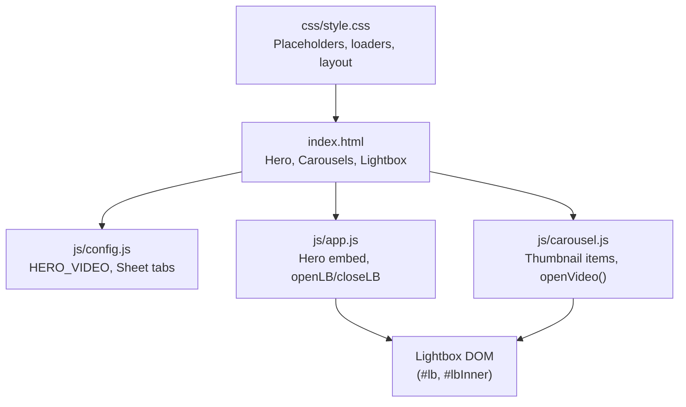
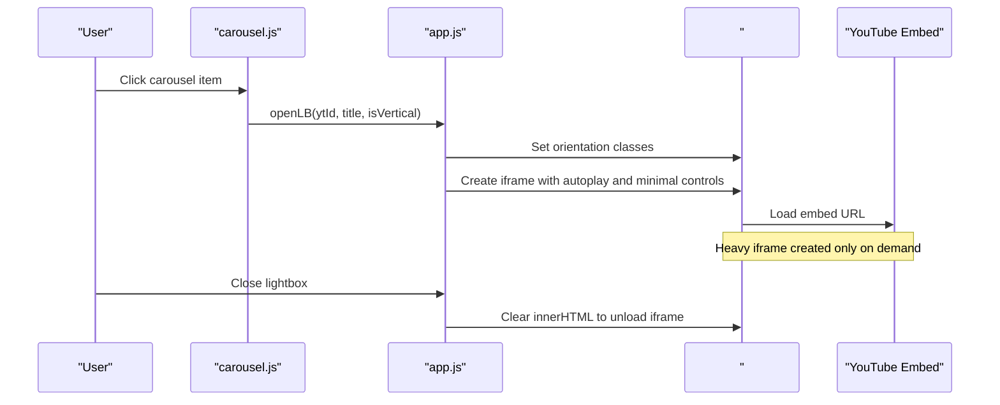
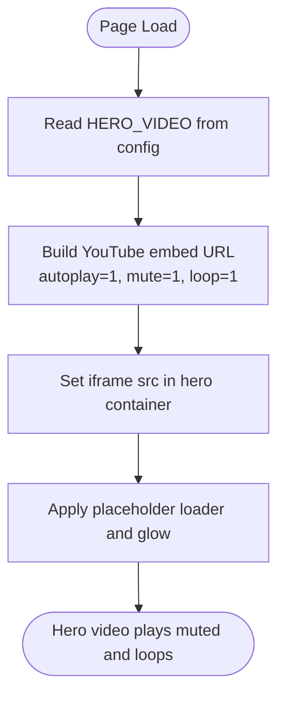
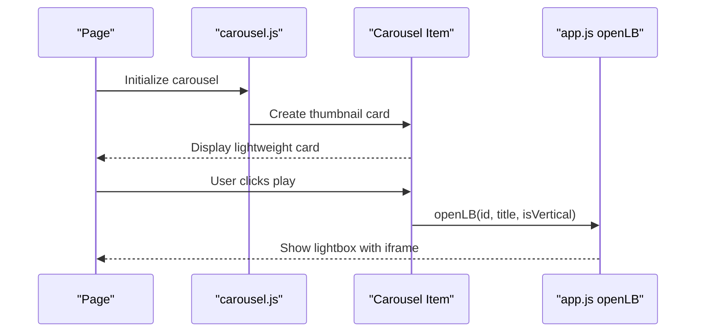
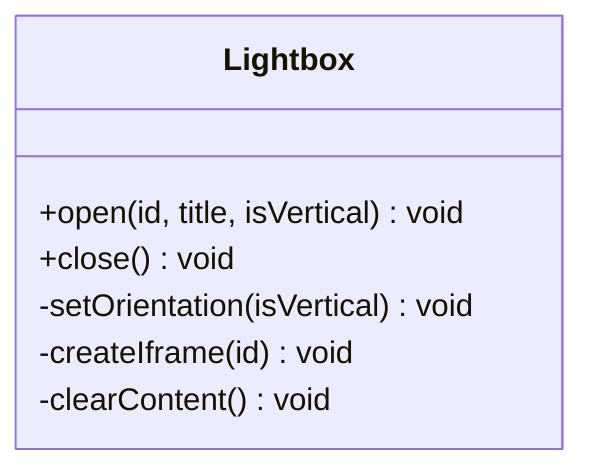
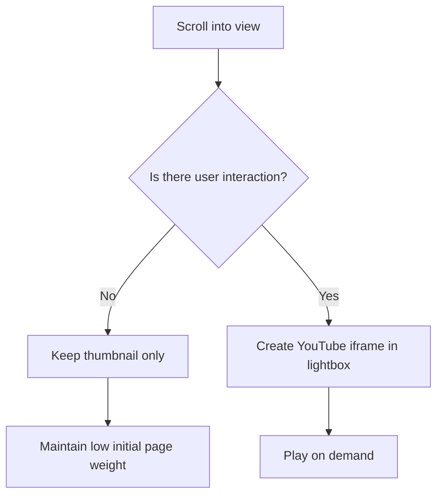
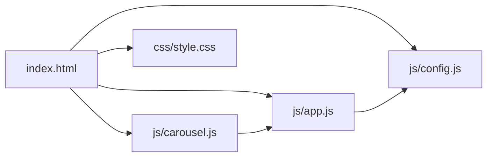

# Lazy Video Loading

<cite>
**Referenced Files in This Document**
- [index.html](file://index.html)
- [js/config.js](file://js/config.js)
- [js/app.js](file://js/app.js)
- [js/carousel.js](file://js/carousel.js)
- [css/style.css](file://css/style.css)
</cite>

## Table of Contents
1. [Introduction](#introduction)
2. [Project Structure](#project-structure)
3. [Core Components](#core-components)
4. [Architecture Overview](#architecture-overview)
5. [Detailed Component Analysis](#detailed-component-analysis)
6. [Dependency Analysis](#dependency-analysis)
7. [Performance Considerations](#performance-considerations)
8. [Troubleshooting Guide](#troubleshooting-guide)
9. [Conclusion](#conclusion)

## Introduction
This document explains how the DeepDreams portfolio system loads YouTube videos lazily to keep initial page weight low and improve performance. The hero section uses an autoplaying, muted, looping YouTube embed for immediate visual impact. All other videos are rendered as lightweight thumbnails first and only load a heavy YouTube iframe when the user interacts with them (for example, by clicking a carousel item or opening the lightbox). This approach prevents unnecessary network requests and playback overhead until the content is actually needed.

The implementation centers on:
- A configuration object that defines the hero video and data sources for carousels.
- A carousel module that builds thumbnail-only items and defers iframe creation until interaction.
- A shared lightbox that creates the YouTube iframe on demand and cleans it up when closed.
- CSS-driven placeholders and loaders to maintain layout stability while waiting for media.

Note: In this codebase, the main site’s video sections use click-to-load rather than Intersection Observer–based auto-loading. Intersection Observer patterns do exist elsewhere in the repository for other projects; however, the core DeepDreams portfolio relies on explicit user interaction to trigger heavy iframe loading.

## Project Structure
The lazy loading behavior spans HTML structure, JavaScript modules, and styles:
- index.html defines the hero video container, carousel tracks, and the lightbox shell.
- js/config.js provides the hero video ID and data sources for carousels.
- js/app.js initializes the hero embed and exposes a shared lightbox API used by carousels.
- js/carousel.js renders carousel items with thumbnails and opens the lightbox on click.
- css/style.css styles placeholders, loaders, and responsive layouts.

**Diagram sources**
- [index.html:63-88](file://index.html#L63-L88)
- [index.html:95-115](file://index.html#L95-L115)
- [index.html:159-203](file://index.html#L159-L203)
- [index.html:332-339](file://index.html#L332-L339)
- [js/config.js:20-47](file://js/config.js#L20-L47)
- [js/app.js:26-29](file://js/app.js#L26-L29)
- [js/app.js:146-188](file://js/app.js#L146-L188)
- [js/carousel.js:324-334](file://js/carousel.js#L324-L334)
- [css/style.css:129-136](file://css/style.css#L129-L136)

**Section sources**
- [index.html:63-88](file://index.html#L63-L88)
- [index.html:95-115](file://index.html#L95-L115)
- [index.html:159-203](file://index.html#L159-L203)
- [index.html:332-339](file://index.html#L332-L339)
- [js/config.js:20-47](file://js/config.js#L20-L47)
- [js/app.js:26-29](file://js/app.js#L26-L29)
- [js/app.js:146-188](file://js/app.js#L146-L188)
- [js/carousel.js:324-334](file://js/carousel.js#L324-L334)
- [css/style.css:129-136](file://css/style.css#L129-L136)

## Core Components
- Hero video: An immediately loaded, autoplay-muted-looping YouTube embed configured via config.js. It sets the tone and demonstrates embedded playback without blocking the rest of the page.
- Carousel items: Rendered as lightweight cards with a YouTube thumbnail image and a play overlay. No iframe exists until the user clicks.
- Lightbox: A modal that creates a YouTube iframe only when opened, and clears its content when closed to free resources.
- Configuration: Centralized settings for the hero video and data sources for carousels.

Key behaviors:
- Thumbnails are always loaded; iframes are deferred until interaction.
- The lightbox supports both horizontal and vertical orientations based on the source.
- The hero embed is always present and starts playing muted and looping.

**Section sources**
- [js/config.js:20-47](file://js/config.js#L20-L47)
- [js/app.js:26-29](file://js/app.js#L26-L29)
- [js/carousel.js:351-463](file://js/carousel.js#L351-L463)
- [js/app.js:146-188](file://js/app.js#L146-L188)
- [css/style.css:129-136](file://css/style.css#L129-L136)

## Architecture Overview
The system separates presentation from resource loading:
- The HTML declares containers for the hero, carousels, and lightbox.
- JS modules populate carousels with thumbnails and wire interactions.
- The lightbox centralizes iframe creation and cleanup.

**Diagram sources**
- [js/carousel.js:324-334](file://js/carousel.js#L324-L334)
- [js/app.js:146-188](file://js/app.js#L146-L188)
- [index.html:332-339](file://index.html#L332-L339)

## Detailed Component Analysis

### Hero Video: Immediate Autoplay, Muted, Loop
- Source: The hero embed URL is set using the configured video ID.
- Behavior: Autoplay, mute, loop, inline playback, and minimal branding are applied to ensure smooth background-like playback without sound.
- Styling: A loader and glow overlay provide visual feedback while the embed initializes.

**Diagram sources**
- [js/config.js:43-47](file://js/config.js#L43-L47)
- [js/app.js:26-29](file://js/app.js#L26-L29)
- [css/style.css:129-136](file://css/style.css#L129-L136)

**Section sources**
- [js/config.js:43-47](file://js/config.js#L43-L47)
- [js/app.js:26-29](file://js/app.js#L26-L29)
- [css/style.css:129-136](file://css/style.css#L129-L136)

### Carousel Items: Thumbnail-First, Click-to-Load
- Rendering: Each carousel item contains a YouTube thumbnail image and a play overlay. No iframe is created at render time.
- Interaction: Clicking an item triggers the shared lightbox function to create the iframe on demand.
- Data sources: Items come from routed Google Sheets data or fallback arrays in config.

**Diagram sources**
- [js/carousel.js:351-463](file://js/carousel.js#L351-L463)
- [js/app.js:146-188](file://js/app.js#L146-L188)

**Section sources**
- [js/carousel.js:351-463](file://js/carousel.js#L351-L463)
- [js/app.js:146-188](file://js/app.js#L146-L188)

### Lightbox: On-Demand Iframe Creation and Cleanup
- Creation: When opened, the lightbox sets orientation classes and injects a YouTube iframe into the container.
- Cleanup: When closed, the inner content is cleared to remove the iframe and release associated resources.
- Orientation: Supports both horizontal and vertical modes depending on the source.

**Diagram sources**
- [js/app.js:146-188](file://js/app.js#L146-L188)
- [index.html:332-339](file://index.html#L332-L339)

**Section sources**
- [js/app.js:146-188](file://js/app.js#L146-L188)
- [index.html:332-339](file://index.html#L332-L339)

### Configuration Options That Control Video Behavior
- HERO_VIDEO: Sets the hero embed ID.
- Sheet-based data: Controls which videos appear in each carousel section. Inline fallback arrays can be provided if sheets are empty.
- Contact and social links: Not directly related to video loading but part of the same configuration surface.

Practical implications:
- Changing HERO_VIDEO updates the hero embed automatically.
- Modifying sheet tabs or inline arrays changes carousel content without redeploying.

**Section sources**
- [js/config.js:20-47](file://js/config.js#L20-L47)
- [js/config.js:63-89](file://js/config.js#L63-L89)
- [js/config.js:103-114](file://js/config.js#L103-L114)

### Conceptual Overview: Intersection Observer vs. Current Implementation
While the broader repository includes Intersection Observer usage in other projects for progressive loading, the main DeepDreams portfolio currently uses explicit user interaction to defer heavy iframe loading. This design choice ensures predictable resource usage and avoids unintended autoplay or network spikes during scroll.

[No sources needed since this diagram shows conceptual workflow, not actual code structure]

## Dependency Analysis
- index.html depends on:
  - js/config.js for configuration values.
  - js/app.js for hero embed initialization and lightbox API.
  - js/carousel.js for rendering carousel items and triggering lightbox.
  - css/style.css for visual placeholders and layout.
- js/carousel.js depends on:
  - js/config.js for data sources.
  - js/app.js for the shared lightbox API.
- js/app.js depends on:
  - js/config.js for contact/social links and hero video.

**Diagram sources**
- [index.html:352-359](file://index.html#L352-L359)
- [js/config.js:20-47](file://js/config.js#L20-L47)
- [js/app.js:26-29](file://js/app.js#L26-L29)
- [js/carousel.js:324-334](file://js/carousel.js#L324-L334)

**Section sources**
- [index.html:352-359](file://index.html#L352-L359)
- [js/config.js:20-47](file://js/config.js#L20-L47)
- [js/app.js:26-29](file://js/app.js#L26-L29)
- [js/carousel.js:324-334](file://js/carousel.js#L324-L334)

## Performance Considerations
- Initial payload: Only lightweight thumbnails are loaded initially; heavy iframes are deferred until interaction.
- Hero embed: Autoplay-muted-loop reduces perceived latency and keeps the experience engaging without audio disruption.
- Memory management: Closing the lightbox clears the iframe content, releasing browser resources tied to the player.
- Layout stability: Placeholders and loaders prevent layout shifts while assets load.
- Network efficiency: Avoids unnecessary YouTube API calls and streaming until the user explicitly requests playback.

[No sources needed since this section provides general guidance]

## Troubleshooting Guide
Common issues and resolutions:
- Hero video does not start:
  - Verify the configured hero video ID is valid.
  - Ensure autoplay and mute parameters are present in the embed URL.
- Carousel items show no content:
  - Check that the Google Sheet tab names and IDs match the configuration.
  - Confirm that the sheet fetch returns rows and that titles/IDs are parsed correctly.
- Lightbox does not close or remains blank:
  - Ensure the close handler clears the inner content.
  - Confirm that the lightbox container exists in the DOM before manipulation.
- Unexpected memory growth:
  - Validate that closing the lightbox removes the iframe.
  - Avoid retaining references to removed nodes.

**Section sources**
- [js/config.js:20-47](file://js/config.js#L20-L47)
- [js/carousel.js:351-463](file://js/carousel.js#L351-L463)
- [js/app.js:146-188](file://js/app.js#L146-L188)
- [index.html:332-339](file://index.html#L332-L339)

## Conclusion
The DeepDreams portfolio employs a pragmatic lazy loading strategy:
- The hero video provides immediate visual engagement through autoplay-muted-loop playback.
- Other videos remain lightweight thumbnails until the user interacts, at which point a YouTube iframe is created in a lightbox.
- Configuration centralizes video sources and behavior, enabling easy updates without code changes.
- Cleanup routines remove iframes when the lightbox closes, helping manage memory and prevent leaks.

This approach balances performance and user experience by minimizing initial page weight while still delivering rich video content on demand.

[No sources needed since this section summarizes without analyzing specific files]