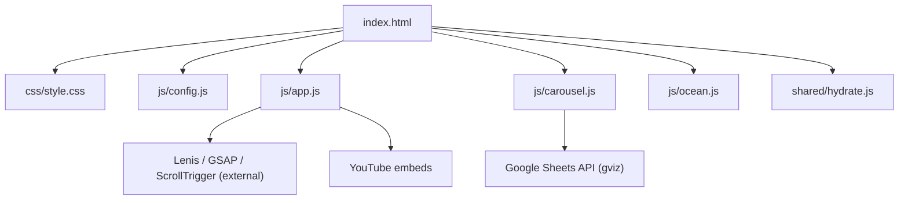
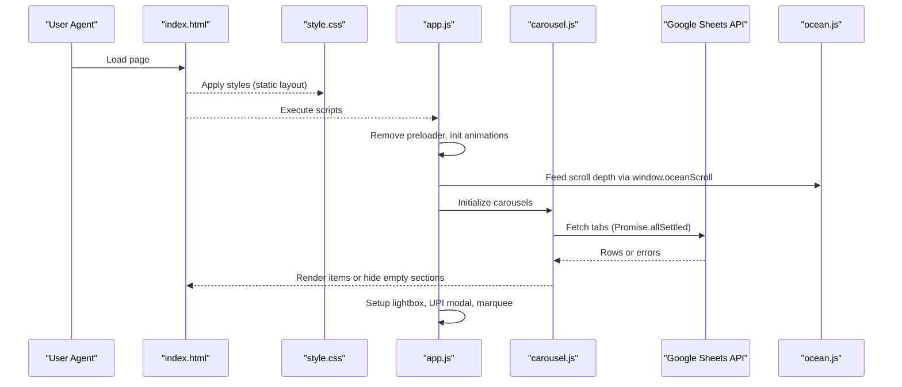
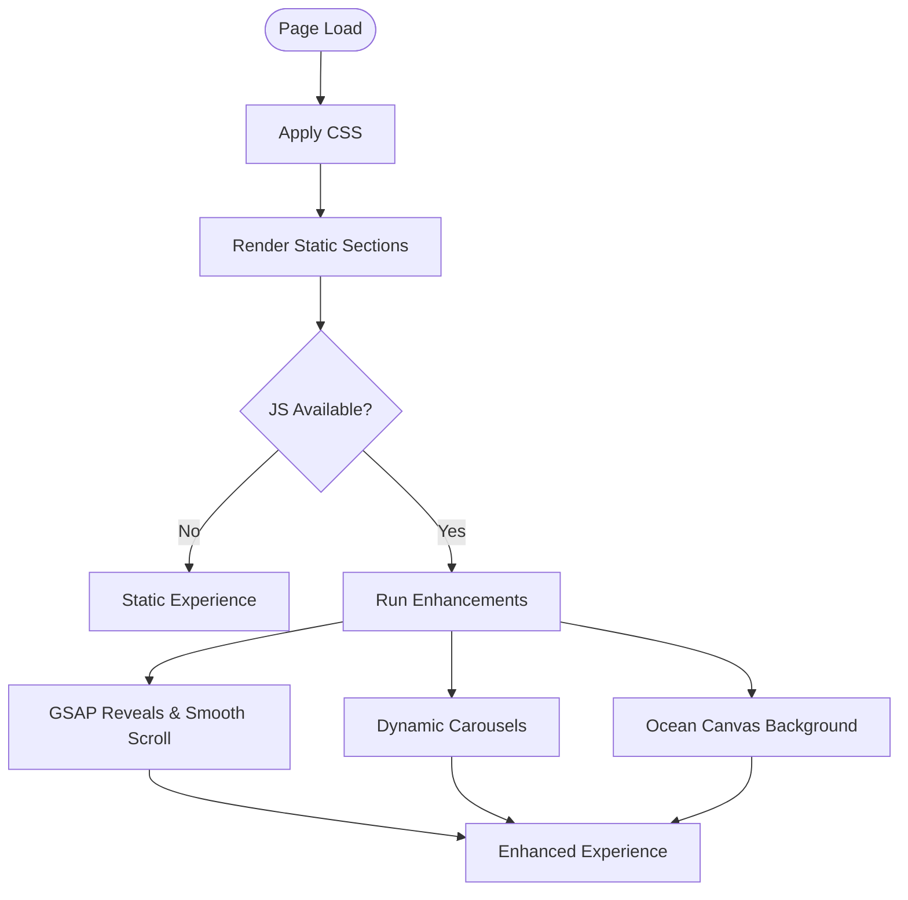
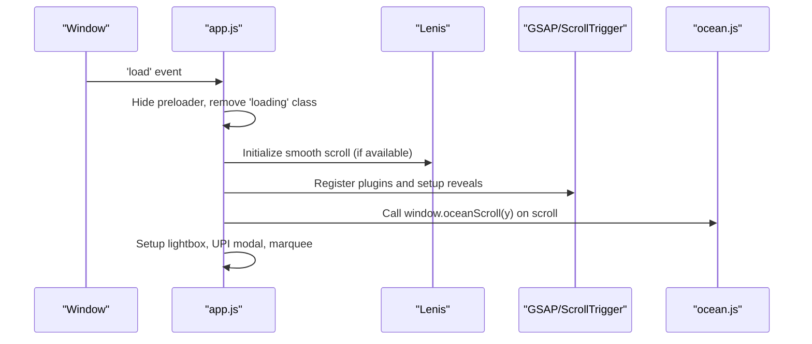
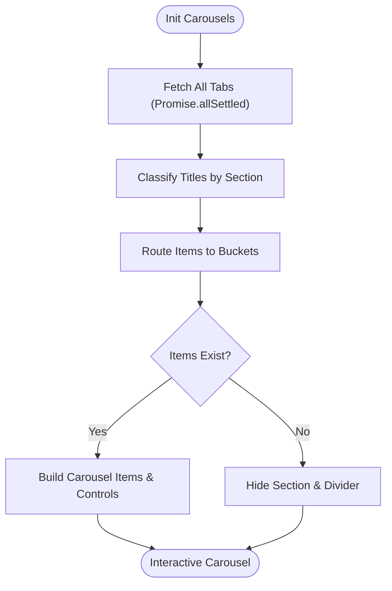
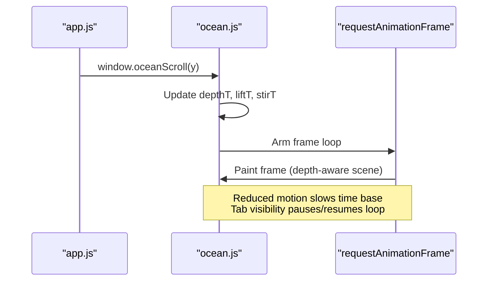
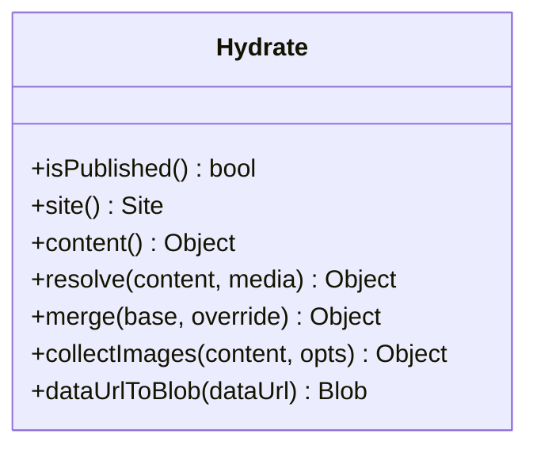
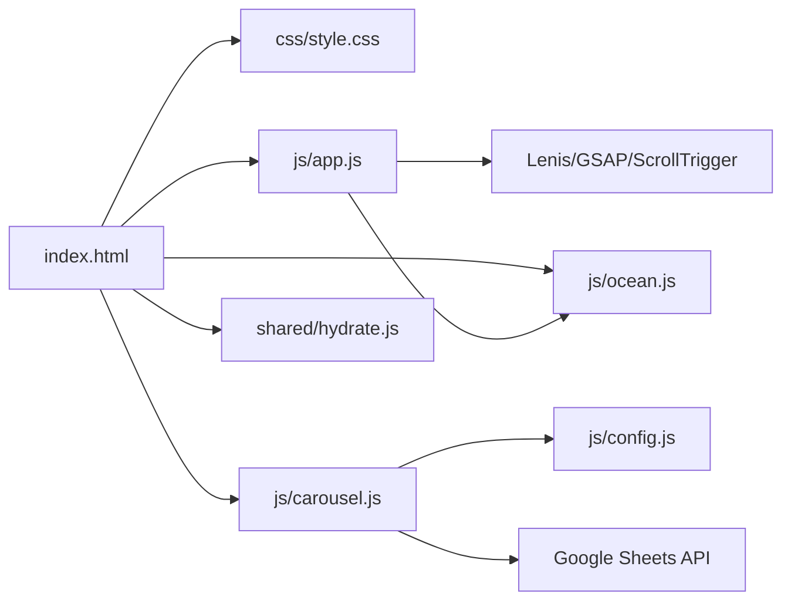

# Progressive Enhancement Strategy

<cite>
**Referenced Files in This Document**
- [index.html](file://index.html)
- [js/config.js](file://js/config.js)
- [js/app.js](file://js/app.js)
- [js/carousel.js](file://js/carousel.js)
- [js/ocean.js](file://js/ocean.js)
- [css/style.css](file://css/style.css)
- [shared/hydrate.js](file://shared/hydrate.js)
</cite>

## Table of Contents
1. [Introduction](#introduction)
2. [Project Structure](#project-structure)
3. [Core Components](#core-components)
4. [Architecture Overview](#architecture-overview)
5. [Detailed Component Analysis](#detailed-component-analysis)
6. [Dependency Analysis](#dependency-analysis)
7. [Performance Considerations](#performance-considerations)
8. [Troubleshooting Guide](#troubleshooting-guide)
9. [Conclusion](#conclusion)

## Introduction
This document explains how the DeepDreams portfolio site implements progressive enhancement: it delivers a fully usable, accessible static page first, then enhances interactivity and content when JavaScript loads. It covers hydration patterns, dynamic Google Sheets integration, graceful degradation on slow or older browsers, error handling for external services, and user feedback strategies for failed asset loading or service unavailability.

## Project Structure
The site is organized around a single-page HTML shell that contains all essential content and semantic structure. CSS styles provide layout, motion, and accessibility-friendly defaults. JavaScript modules are loaded after the DOM to progressively enhance behavior:

- index.html: Static markup with sections for hero, carousels, services, contact, modals, and footers. External scripts (Lenis, GSAP, ScrollTrigger) and local scripts load at the end of the body.
- css/style.css: Core visual design, responsive layout, animations, and reduced-motion support.
- js/config.js: Central configuration object controlling content sources (Google Sheets vs inline), contact links, and showcase data.
- js/app.js: Application bootstrap, preloader, smooth scrolling, entrance animations, header behavior, lightbox, UPI modal, and marquee.
- js/carousel.js: Dynamic content rendering from Google Sheets with fallbacks, carousel controls, and section hiding when no content exists.
- js/ocean.js: Full-screen canvas background with scroll-driven depth, fish, snow, and jellyfish; respects reduced motion and device capabilities.
- shared/hydrate.js: Hydration utility for published invitations, resolving image markers into optimal URLs based on device pixel ratio and viewport width.

**Diagram sources**
- [index.html:352-359](file://index.html#L352-L359)
- [js/config.js:20-128](file://js/config.js#L20-L128)
- [js/app.js:32-93](file://js/app.js#L32-L93)
- [js/carousel.js:151-205](file://js/carousel.js#L151-L205)
- [js/ocean.js:27-78](file://js/ocean.js#L27-L78)

**Section sources**
- [index.html:1-362](file://index.html#L1-L362)
- [css/style.css:1-635](file://css/style.css#L1-L635)
- [js/config.js:1-129](file://js/config.js#L1-L129)
- [js/app.js:1-210](file://js/app.js#L1-L210)
- [js/carousel.js:1-569](file://js/carousel.js#L1-L569)
- [js/ocean.js:1-642](file://js/ocean.js#L1-L642)
- [shared/hydrate.js:1-207](file://shared/hydrate.js#L1-L207)

## Core Components
- Static-first HTML: All sections exist in the markup so users without JavaScript see complete content immediately.
- CSS-only interactions: Native scroll-snap carousels, hover states, and responsive grids work without JS.
- Progressive enhancements: Smooth scrolling, entrance animations, interactive carousels, lightboxes, and dynamic content loading via JS.
- Configuration-driven content: Google Sheets as primary source with inline arrays as fallbacks.
- Hydration for published invitations: On-device resolution of image markers to optimal sizes.

Key behaviors:
- Preloader hides once assets load, then triggers animations and initializes components.
- Lenis smooth scrolling integrates with GSAP ScrollTrigger for reveal animations.
- Carousels use native touch/swipe with arrow/dot controls and hide empty sections gracefully.
- Ocean canvas responds to scroll depth and reduces motion preferences.

**Section sources**
- [index.html:34-362](file://index.html#L34-L362)
- [css/style.css:18-31](file://css/style.css#L18-L31)
- [css/style.css:157-160](file://css/style.css#L157-L160)
- [css/style.css:422-477](file://css/style.css#L422-L477)
- [js/app.js:32-93](file://js/app.js#L32-L93)
- [js/carousel.js:213-322](file://js/carousel.js#L213-L322)
- [js/ocean.js:34-78](file://js/ocean.js#L34-L78)

## Architecture Overview
The site follows a layered architecture:

- Presentation layer: HTML + CSS deliver content and baseline UX.
- Enhancement layer: app.js wires up UI behaviors and animations.
- Data layer: carousel.js fetches content from Google Sheets and renders carousels; config.js provides inline fallbacks.
- Visual effects layer: ocean.js renders an animated canvas background driven by scroll position.
- Hydration layer: shared/hydrate.js resolves image markers for published invitations to optimize bandwidth.

**Diagram sources**
- [index.html:352-359](file://index.html#L352-L359)
- [js/app.js:32-93](file://js/app.js#L32-L93)
- [js/carousel.js:151-205](file://js/carousel.js#L151-L205)
- [js/ocean.js:68-78](file://js/ocean.js#L68-L78)

## Detailed Component Analysis

### Static HTML and CSS Baseline
- Semantic sections ensure content is readable without JS.
- Native scroll-snap carousels provide basic navigation via swipe and arrows.
- Reduced motion media query disables animations and reveals content instantly for accessibility.

**Section sources**
- [index.html:63-235](file://index.html#L63-L235)
- [css/style.css:157-160](file://css/style.css#L157-L160)
- [css/style.css:314-316](file://css/style.css#L314-L316)
- [css/style.css:422-477](file://css/style.css#L422-L477)

### Bootstrap and Enhancements (app.js)
- Preloader removal triggers hero animations and initializes scroll-based effects.
- Smooth scrolling via Lenis integrates with anchor links and scroll events.
- Entrance animations use GSAP ScrollTrigger for reveal effects and count-up stats.
- Header toggles classes based on scroll direction and position.
- Lightbox and UPI modal provide interactive overlays with keyboard support.

**Diagram sources**
- [js/app.js:32-93](file://js/app.js#L32-L93)
- [js/app.js:95-110](file://js/app.js#L95-L110)
- [js/app.js:146-196](file://js/app.js#L146-L196)
- [js/app.js:198-210](file://js/app.js#L198-L210)

**Section sources**
- [js/app.js:32-93](file://js/app.js#L32-L93)
- [js/app.js:95-110](file://js/app.js#L95-L110)
- [js/app.js:146-196](file://js/app.js#L146-L196)
- [js/app.js:198-210](file://js/app.js#L198-L210)

### Dynamic Content and Google Sheets Integration (carousel.js)
- Single fetch of all three tabs using Promise.allSettled ensures robustness against partial failures.
- Title classification routes videos into appropriate sections (tribute, invitation, name reveal).
- Fallback to inline arrays if sheets fail or return empty results.
- Empty sections are hidden to avoid showing incorrect content.
- Carousels use native scroll-snap with arrow and dot controls.

**Diagram sources**
- [js/carousel.js:151-205](file://js/carousel.js#L151-L205)
- [js/carousel.js:351-463](file://js/carousel.js#L351-L463)

**Section sources**
- [js/carousel.js:151-205](file://js/carousel.js#L151-L205)
- [js/carousel.js:351-463](file://js/carousel.js#L351-L463)

### Living Ocean Background (ocean.js)
- Full-screen canvas renders volumetric light, marine snow, fish school, and bioluminescent jellyfish.
- Scroll depth drives descent: surface light dims, rays recede, fish dive, abyss darkens, jellyfish bloom.
- Respects prefers-reduced-motion by slowing time base instead of disabling entirely.
- Uses requestAnimationFrame with setTimeout watchdog to survive throttling environments.
- Exposes window.oceanScroll for app.js to pipe smoothed scroll values.

**Diagram sources**
- [js/ocean.js:68-78](file://js/ocean.js#L68-L78)
- [js/ocean.js:426-445](file://js/ocean.js#L426-L445)
- [js/ocean.js:619-632](file://js/ocean.js#L619-L632)

**Section sources**
- [js/ocean.js:27-78](file://js/ocean.js#L27-L78)
- [js/ocean.js:426-445](file://js/ocean.js#L426-L445)
- [js/ocean.js:619-632](file://js/ocean.js#L619-L632)

### Hydration for Published Invitations (shared/hydrate.js)
- Detects published pages via DD_PUBLISHED and DD_SITE flags.
- Resolves image markers (@mN) into optimal URLs based on device pixel ratio and viewport width.
- Provides deep merge utilities to override template defaults with published content.
- Supports collecting images for upload by converting data URLs to Blobs and replacing them with markers.

**Diagram sources**
- [shared/hydrate.js:32-104](file://shared/hydrate.js#L32-L104)
- [shared/hydrate.js:110-175](file://shared/hydrate.js#L110-L175)
- [shared/hydrate.js:177-205](file://shared/hydrate.js#L177-L205)

**Section sources**
- [shared/hydrate.js:32-104](file://shared/hydrate.js#L32-L104)
- [shared/hydrate.js:110-175](file://shared/hydrate.js#L110-L175)
- [shared/hydrate.js:177-205](file://shared/hydrate.js#L177-L205)

## Dependency Analysis
- index.html depends on CSS for styling and JS for enhancements.
- app.js depends on external libraries (Lenis, GSAP, ScrollTrigger) and exposes window.openLB for carousel.js.
- carousel.js depends on config.js for sheet IDs and inline fallbacks, and calls Google Sheets API.
- ocean.js depends on app.js for scroll input via window.oceanScroll.
- shared/hydrate.js is independent and can be used by other client code to resolve markers.

**Diagram sources**
- [index.html:352-359](file://index.html#L352-L359)
- [js/app.js:32-93](file://js/app.js#L32-L93)
- [js/carousel.js:151-205](file://js/carousel.js#L151-L205)
- [js/config.js:20-128](file://js/config.js#L20-L128)

**Section sources**
- [index.html:352-359](file://index.html#L352-L359)
- [js/app.js:32-93](file://js/app.js#L32-L93)
- [js/carousel.js:151-205](file://js/carousel.js#L151-L205)
- [js/config.js:20-128](file://js/config.js#L20-L128)

## Performance Considerations
- Deferred script loading: Scripts load at the end of the body to prioritize content rendering.
- Native carousels: Use CSS scroll-snap for performance and accessibility without heavy JS libraries.
- Reduced motion: Media queries disable animations for users who prefer reduced motion.
- Device capability detection: Ocean canvas adjusts particle counts and speeds based on mobile detection and reduced motion.
- Image optimization: Hydration selects optimal image widths based on device pixel ratio and viewport.
- Network resilience: Google Sheets fetch uses Promise.allSettled to handle partial failures gracefully.

[No sources needed since this section provides general guidance]

## Troubleshooting Guide
Common issues and their handling:

- Google Sheets unavailable:
  - carousel.js logs warnings and falls back to inline arrays or hides sections if no content exists.
  - Users see a friendly message or no section rather than broken placeholders.

- YouTube embed failures:
  - Lightbox handles missing IDs gracefully and avoids autoplay errors.
  - Thumbnails are optional; if missing, the play overlay still functions.

- Slow connections:
  - Preloader remains until resources load, preventing janky transitions.
  - Reduced motion mode ensures animations do not block interaction.

- Older browsers:
  - Feature checks prevent initialization of unsupported features (e.g., Lenis only if available).
  - Graceful degradation keeps core content visible and functional.

- Error feedback:
  - Console warnings log sheet fetch failures for debugging.
  - UI messages inform users when content cannot be loaded.

**Section sources**
- [js/carousel.js:151-205](file://js/carousel.js#L151-L205)
- [js/carousel.js:379-382](file://js/carousel.js#L379-L382)
- [js/app.js:146-196](file://js/app.js#L146-L196)
- [js/app.js:32-42](file://js/app.js#L32-L42)
- [css/style.css:314-316](file://css/style.css#L314-L316)

## Conclusion
The DeepDreams portfolio system demonstrates a mature progressive enhancement strategy. It prioritizes content delivery through static HTML and CSS, then layers interactivity and dynamic content via JavaScript. The Google Sheets integration provides flexible content management with robust fallbacks, while the hydration utility optimizes image delivery for published invitations. Error handling and user feedback ensure reliability across varying network conditions and browser capabilities. This approach balances performance, accessibility, and maintainability, delivering a consistent experience whether JavaScript is available or not.

[No sources needed since this section summarizes without analyzing specific files]