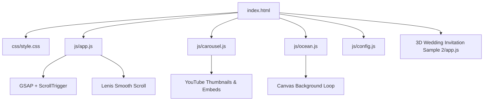
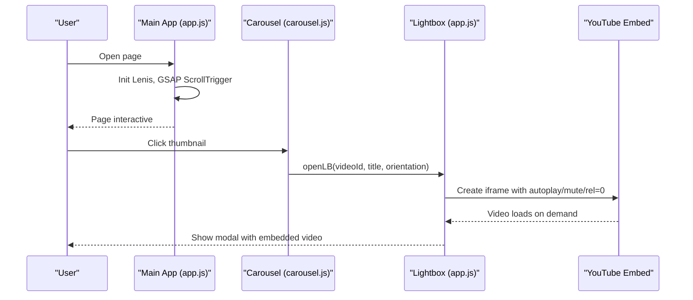
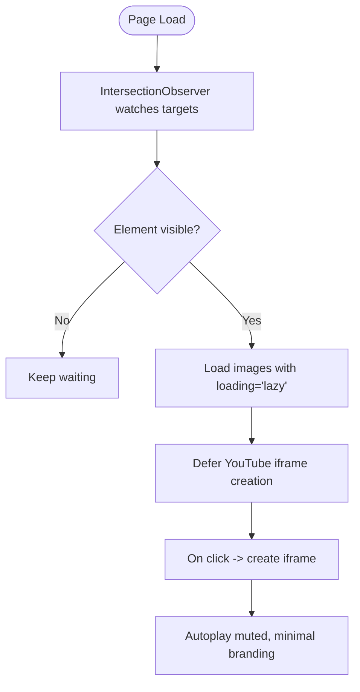
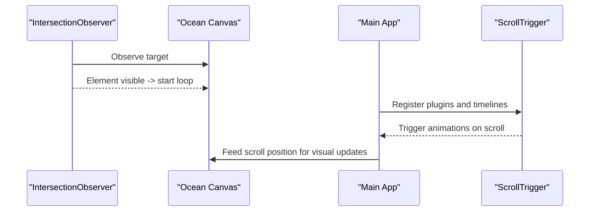
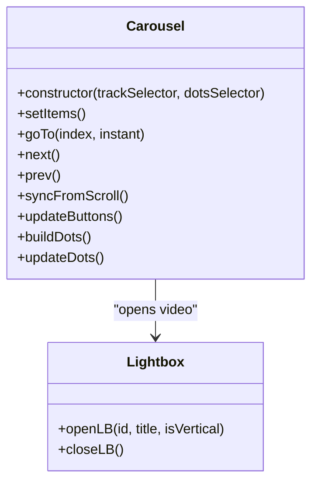
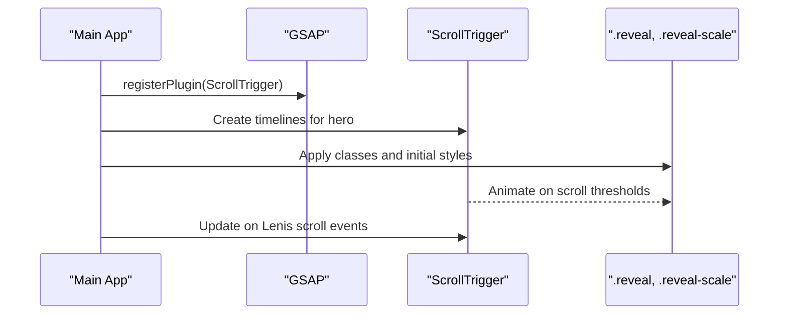
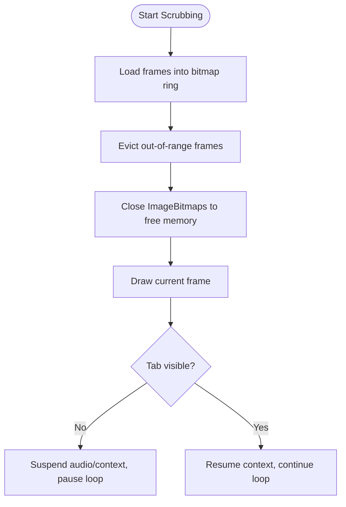
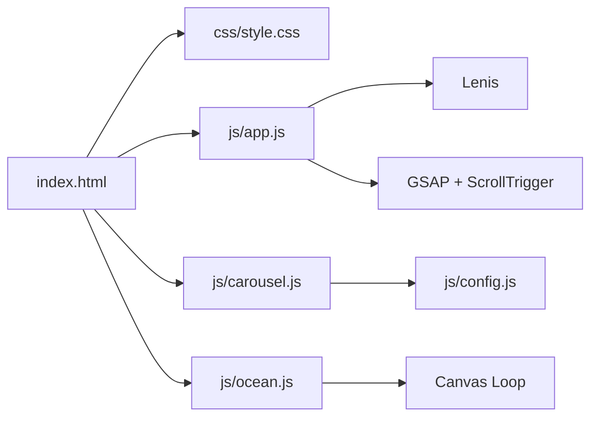

# Frontend Performance Optimization

<cite>
**Referenced Files in This Document**
- [index.html](file://index.html)
- [js/app.js](file://js/app.js)
- [js/carousel.js](file://js/carousel.js)
- [js/config.js](file://js/config.js)
- [css/style.css](file://css/style.css)
- [js/ocean.js](file://js/ocean.js)
- [3D Wedding Invitation Sample 2/app.js](file://3D%20Wedding%20Invitation%20Sample%202/app.js)
- [3D Wedding Invitation Sample 2/studio.js](file://3D%20Wedding%20Invitation%20Sample%202/studio.js)
</cite>

## Table of Contents
1. [Introduction](#introduction)
2. [Project Structure](#project-structure)
3. [Core Components](#core-components)
4. [Architecture Overview](#architecture-overview)
5. [Detailed Component Analysis](#detailed-component-analysis)
6. [Dependency Analysis](#dependency-analysis)
7. [Performance Considerations](#performance-considerations)
8. [Troubleshooting Guide](#troubleshooting-guide)
9. [Conclusion](#conclusion)

## Introduction
This document explains the frontend performance optimization strategies implemented in the DeepDreams portfolio system. It focuses on lazy loading for images, videos, and heavy assets (including YouTube embeds and 3D experiences), progressive enhancement to ensure core functionality without JavaScript while providing enhanced experiences when available, resource prioritization using Intersection Observer and animation scheduling, scroll-triggered animations with GSAP ScrollTrigger, memory management practices to prevent leaks, and mobile-specific optimizations such as touch gesture handling, reduced motion preferences, and viewport-aware rendering.

## Project Structure
The main site is a single-page experience composed of:
- A static HTML shell that loads CSS and scripts, including third-party libraries for smooth scrolling and animations.
- Core application logic that wires up configuration-driven content, lightbox behavior, header state, and scroll-based effects.
- A carousel module that dynamically loads video sections from a Google Sheet or inline config, renders thumbnails, and manages native scroll-snap carousels.
- An animated ocean canvas background that runs efficiently across devices and respects reduced-motion preferences.
- A separate 3D wedding invitation sample that demonstrates advanced techniques like frame scrubbing, bitmap rings, and intersection-driven loading.

**Diagram sources**
- [index.html:352-359](file://index.html#L352-L359)
- [js/app.js:44-93](file://js/app.js#L44-L93)
- [js/carousel.js:213-322](file://js/carousel.js#L213-L322)
- [js/ocean.js:428-461](file://js/ocean.js#L428-L461)

**Section sources**
- [index.html:1-362](file://index.html#L1-L362)
- [js/app.js:1-210](file://js/app.js#L1-L210)
- [js/carousel.js:1-569](file://js/carousel.js#L1-L569)
- [js/config.js:1-129](file://js/config.js#L1-L129)
- [css/style.css:1-200](file://css/style.css#L1-L200)
- [js/ocean.js:428-641](file://js/ocean.js#L428-L641)
- [3D Wedding Invitation Sample 2/app.js:1-200](file://3D%20Wedding%20Invitation%20Sample%202/app.js#L1-L200)
- [3D Wedding Invitation Sample 2/studio.js:76-145](file://3D%20Wedding%20Invitation%20Sample%202/studio.js#L76-L145)

## Core Components
- Main app controller: initializes Lenis smooth scroll, GSAP ScrollTrigger animations, header scroll state, starfield canvas, cursor glow, magnetic buttons, and a shared video lightbox.
- Carousel module: fetches and routes video data from a Google Sheet or inline config, builds native scroll-snap carousels, and opens a lightbox with YouTube embeds only when needed.
- Ocean background: a performant canvas loop with hybrid rAF/setTimeout driving, visibility handling, and reduced-motion support.
- 3D wedding invitation sample: advanced frame scrubbing with pre-decoded bitmaps, intersection observers for lazy loading, and capability-tiered resource usage.

Key performance highlights:
- Lazy loading via HTML attributes and Intersection Observer.
- Deferred initialization of heavy features until they are visible or user-interacted.
- Resource prioritization by deferring non-critical tasks and pausing loops when off-screen.
- Mobile-first interactions with passive listeners and touch-optimized behaviors.
- Reduced motion awareness to avoid unnecessary work.

**Section sources**
- [js/app.js:44-110](file://js/app.js#L44-L110)
- [js/carousel.js:151-205](file://js/carousel.js#L151-L205)
- [js/ocean.js:428-461](file://js/ocean.js#L428-L461)
- [3D Wedding Invitation Sample 2/app.js:347-425](file://3D%20Wedding%20Invitation%20Sample%202/app.js#L347-L425)

## Architecture Overview
The architecture separates concerns into modules that communicate through well-defined interfaces:
- The main app sets up global behaviors and exposes a shared lightbox API used by the carousel.
- The carousel handles data fetching, DOM construction, and interaction events, delegating video playback to the lightbox.
- The ocean background runs independently but integrates with scroll events to adjust visuals.
- The 3D sample uses its own engine with sophisticated resource management and animation control.

**Diagram sources**
- [js/app.js:146-188](file://js/app.js#L146-L188)
- [js/carousel.js:324-334](file://js/carousel.js#L324-L334)

## Detailed Component Analysis

### Lazy Loading Strategy for Images, Videos, and Heavy Assets
- Images use native lazy loading to defer offscreen image downloads until near the viewport.
- YouTube thumbnails are loaded as lightweight images; actual video iframes are created only when the user opens the lightbox.
- The 3D wedding invitation sample uses Intersection Observer to start loading frames only when the phone mock enters the viewport, then decodes images asynchronously and paints them on scroll.

**Diagram sources**
- [js/carousel.js:361-373](file://js/carousel.js#L361-L373)
- [js/app.js:146-188](file://js/app.js#L146-L188)
- [3D Wedding Invitation Sample 2/studio.js:124-142](file://3D%20Wedding%20Invitation%20Sample%202/studio.js#L124-L142)

**Section sources**
- [js/carousel.js:351-463](file://js/carousel.js#L351-L463)
- [js/app.js:146-188](file://js/app.js#L146-L188)
- [3D Wedding Invitation Sample 2/studio.js:96-142](file://3D%20Wedding%20Invitation%20Sample%202/studio.js#L96-L142)

### Progressive Enhancement Techniques
- The HTML provides semantic structure and accessible elements so content remains usable without JavaScript.
- Non-JS fallbacks include native smooth scrolling and basic layout; JS enhances with Lenis smooth scroll, GSAP animations, and dynamic content loading.
- When JavaScript fails or is disabled, users still see structured sections and can navigate to external links.

Evidence:
- The HTML includes meta tags, canonical URLs, and semantic sections for services and contact.
- Scripts are loaded at the end of the body, ensuring critical content renders first.
- The carousel hides empty sections rather than showing incorrect content, preserving usability.

**Section sources**
- [index.html:1-362](file://index.html#L1-L362)
- [js/carousel.js:342-349](file://js/carousel.js#L342-L349)

### Resource Prioritization with Intersection Observer and Animation Scheduling
- Intersection Observer is used to:
  - Start loading frames for the 3D invitation only when visible.
  - Prime posters and delay playing videos until they are likely to be viewed.
  - Toggle active states for heavy components based on visibility.
- Animation scheduling:
  - GSAP ScrollTrigger triggers animations when elements enter the viewport.
  - The ocean background uses requestAnimationFrame with a setTimeout watchdog to keep the loop resilient in throttled environments.
  - Passive event listeners are used for scroll and pointer events to avoid blocking the main thread.

**Diagram sources**
- [js/ocean.js:428-461](file://js/ocean.js#L428-L461)
- [js/app.js:58-93](file://js/app.js#L58-L93)
- [3D Wedding Invitation Sample 2/studio.js:124-142](file://3D%20Wedding%20Invitation%20Sample%202/studio.js#L124-L142)

**Section sources**
- [js/app.js:58-110](file://js/app.js#L58-L110)
- [js/ocean.js:428-461](file://js/ocean.js#L428-L461)
- [3D Wedding Invitation Sample 2/studio.js:124-142](file://3D%20Wedding%20Invitation%20Sample%202/studio.js#L124-L142)

### Carousel Component Optimizations for Video Loading
- Uses native CSS scroll-snap for smooth, hardware-accelerated carousels with inertia and rubber-banding.
- Renders lightweight thumbnails and defers creating YouTube iframes until the user clicks to play.
- Prevents accidental lightbox triggers after swipes by detecting pointer movement and stopping propagation.
- Syncs navigation dots and arrows with actual scroll position using requestAnimationFrame-throttled updates.

**Diagram sources**
- [js/carousel.js:213-322](file://js/carousel.js#L213-L322)
- [js/app.js:146-188](file://js/app.js#L146-L188)

**Section sources**
- [js/carousel.js:213-322](file://js/carousel.js#L213-L322)
- [js/carousel.js:351-463](file://js/carousel.js#L351-L463)

### Main App Scroll-Triggered Animations with GSAP ScrollTrigger
- Registers GSAP and ScrollTrigger, then creates timelines for hero entrance animations.
- Uses ScrollTrigger to reveal elements on scroll with staggered timings and scrubbing for word-by-word text reveals.
- Integrates with Lenis smooth scroll to update ScrollTrigger during smooth scrolling.

**Diagram sources**
- [js/app.js:58-93](file://js/app.js#L58-L93)

**Section sources**
- [js/app.js:58-93](file://js/app.js#L58-L93)

### Memory Management Practices to Prevent Leaks
- The 3D wedding invitation sample implements a bitmap ring that evicts unused frames and closes ImageBitmaps to bound memory usage.
- Visibility changes suspend audio contexts and pause loops when tabs are hidden, resuming when visible again.
- Event listeners are attached with passive options where appropriate to reduce overhead.
- The carousel avoids creating iframes until necessary and clears lightbox content after closing.

**Diagram sources**
- [3D Wedding Invitation Sample 2/app.js:347-425](file://3D%20Wedding%20Invitation%20Sample%202/app.js#L347-L425)
- [3D Wedding Invitation Sample 2/app.js:317-338](file://3D%20Wedding%20Invitation%20Sample%202/app.js#L317-L338)

**Section sources**
- [3D Wedding Invitation Sample 2/app.js:317-338](file://3D%20Wedding%20Invitation%20Sample%202/app.js#L317-L338)
- [3D Wedding Invitation Sample 2/app.js:347-425](file://3D%20Wedding%20Invitation%20Sample%202/app.js#L347-L425)
- [js/app.js:183-188](file://js/app.js#L183-L188)

### Mobile-Specific Optimizations
- Touch gestures:
  - Carousel detects pointer movement to prevent click-after-swipe issues.
  - Passive listeners for scroll and pointer events improve responsiveness.
- Reduced motion preferences:
  - Lenis smooth scroll is disabled when prefers-reduced-motion matches.
  - Ocean background reduces revolution speed and can paint a static frame for reduced-motion users.
  - CSS animations are suppressed under reduced motion media queries.
- Viewport-aware rendering:
  - The 3D sample computes stable viewport units and adjusts DPR for performance on touch devices.
  - Resize handlers debounce re-measurement to avoid excessive recalculations.

**Section sources**
- [js/carousel.js:239-248](file://js/carousel.js#L239-L248)
- [js/app.js:44-51](file://js/app.js#L44-L51)
- [js/ocean.js:428-461](file://js/ocean.js#L428-L461)
- [css/style.css:127-127](file://css/style.css#L127-L127)
- [3D Wedding Invitation Sample 2/app.js:10-14](file://3D%20Wedding%20Invitation%20Sample%202/app.js#L10-L14)
- [3D Wedding Invitation Sample 2/app.js:152-179](file://3D%20Wedding%20Invitation%20Sample%202/app.js#L152-L179)

## Dependency Analysis
- index.html loads CSS and scripts in an order that prioritizes critical rendering and defers heavy libraries.
- js/app.js depends on Lenis and GSAP ScrollTrigger for smooth scrolling and animations.
- js/carousel.js depends on window.DD_CONFIG for data and exposes a lightbox interface consumed by app.js.
- js/ocean.js runs independently but integrates with scroll events fed by app.js.
- The 3D sample has its own engine and configuration, demonstrating advanced patterns not required by the main site.

**Diagram sources**
- [index.html:352-359](file://index.html#L352-L359)
- [js/app.js:44-93](file://js/app.js#L44-L93)
- [js/carousel.js:151-205](file://js/carousel.js#L151-L205)
- [js/ocean.js:428-461](file://js/ocean.js#L428-L461)

**Section sources**
- [index.html:352-359](file://index.html#L352-L359)
- [js/app.js:44-93](file://js/app.js#L44-L93)
- [js/carousel.js:151-205](file://js/carousel.js#L151-L205)
- [js/ocean.js:428-461](file://js/ocean.js#L428-L461)

## Performance Considerations
- Prefer native browser features (scroll-snap, lazy loading) over custom implementations to leverage GPU acceleration and optimized code paths.
- Defer heavy operations (iframe creation, complex animations) until they are necessary or visible.
- Use Intersection Observer to gate expensive tasks and reduce main-thread work.
- Respect user preferences (reduced motion) to avoid unnecessary computations and animations.
- Manage memory by closing resources (ImageBitmaps, timers, listeners) when no longer needed.
- Optimize mobile performance by adjusting resolution (DPR), debouncing resize handlers, and using passive event listeners.

[No sources needed since this section provides general guidance]

## Troubleshooting Guide
- If carousels do not initialize:
  - Ensure the carousel track and dots selectors exist in the DOM before initialization.
  - Check that the Google Sheet or inline config provides valid YouTube IDs.
- If videos do not load:
  - Verify that the lightbox is opened only on user interaction to allow autoplay policies.
  - Confirm that YouTube embed URLs are correctly constructed and parameters are set for minimal branding and inline playback.
- If animations stutter:
  - Check for excessive DOM mutations during scroll; throttle updates with requestAnimationFrame.
  - Ensure Lenis and ScrollTrigger are synchronized and passive listeners are used.
- If memory usage grows:
  - Verify that bitmap rings evict frames and close resources.
  - Ensure event listeners are removed when components are destroyed.

**Section sources**
- [js/carousel.js:351-463](file://js/carousel.js#L351-L463)
- [js/app.js:146-188](file://js/app.js#L146-L188)
- [3D Wedding Invitation Sample 2/app.js:347-425](file://3D%20Wedding%20Invitation%20Sample%202/app.js#L347-L425)

## Conclusion
The DeepDreams portfolio system employs a layered approach to performance:
- Native browser capabilities provide baseline efficiency.
- Intersection Observer gates heavy work until necessary.
- GSAP ScrollTrigger delivers polished, scroll-driven animations without compromising interactivity.
- The carousel defers video embedding until user intent, minimizing initial payload.
- The 3D sample demonstrates advanced memory management and capability-aware rendering.
- Mobile considerations ensure responsive, efficient experiences across devices and user preferences.

These strategies collectively deliver fast, accessible, and engaging experiences while maintaining low resource consumption and preventing common pitfalls like memory leaks and jank.

[No sources needed since this section summarizes without analyzing specific files]