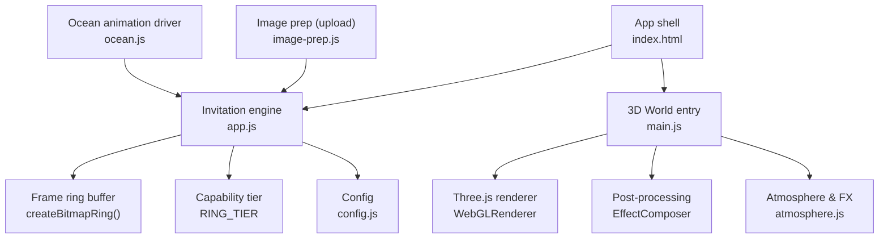
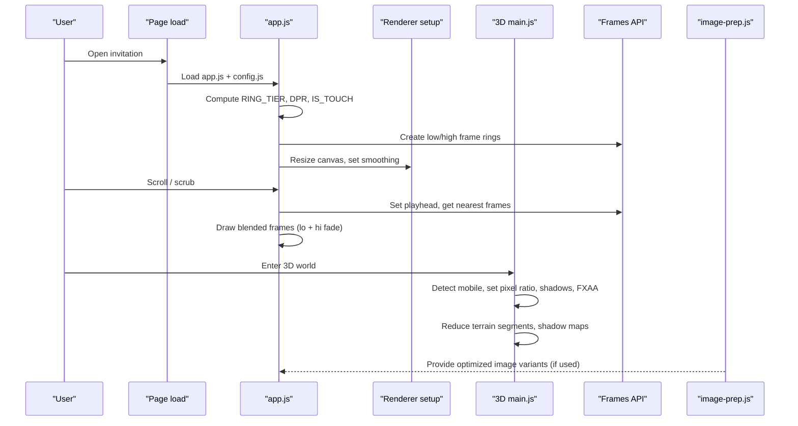
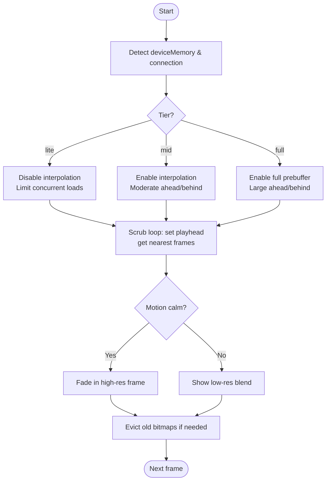
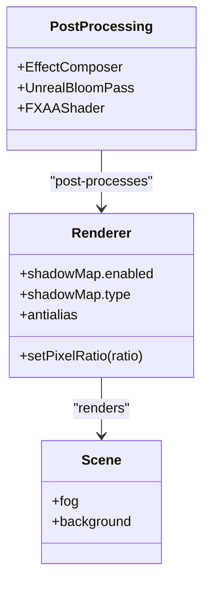
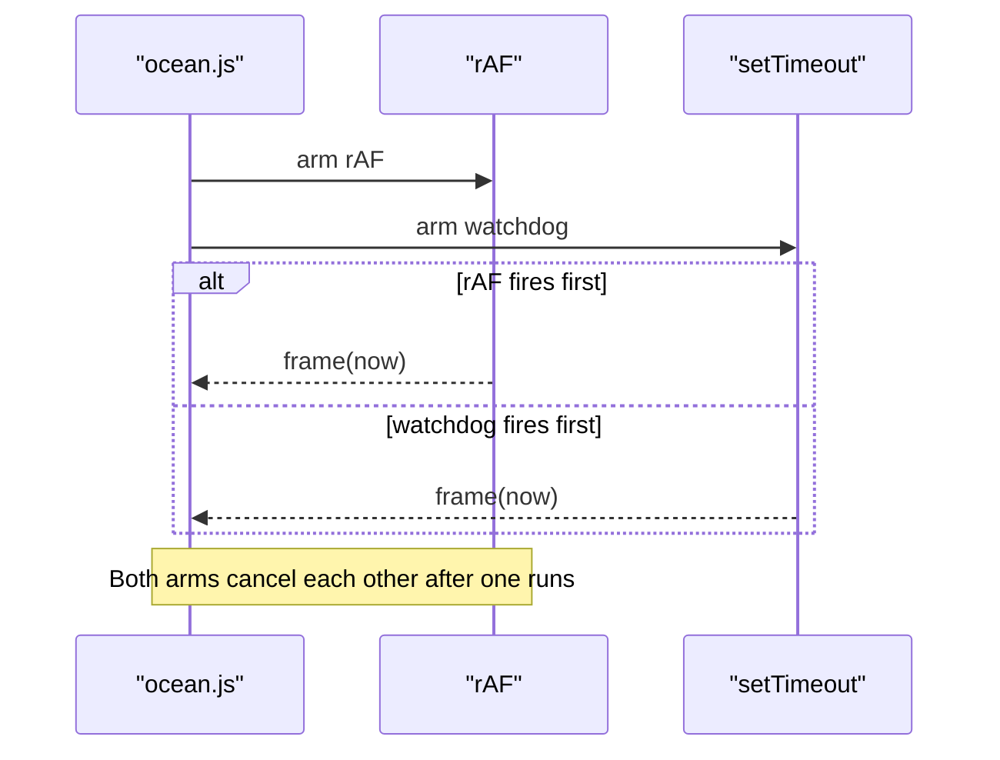
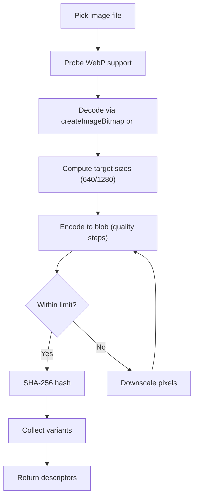
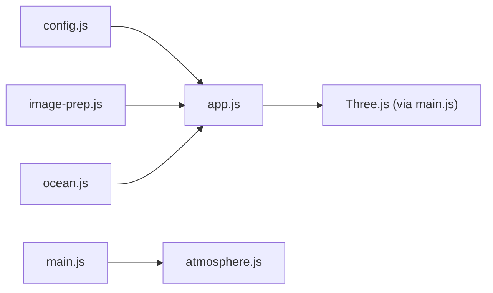

# Device-Adaptive Rendering

<cite>
**Referenced Files in This Document**
- [main.js](file://3D Wedding Invitation Sample 2/3d-world-source/src/main.js)
- [atmosphere.js](file://3D Wedding Invitation Sample 2/3d-world-source/src/wedding/atmosphere.js)
- [app.js](file://3D Wedding Invitation Sample 2/app.js)
- [config.js](file://3D Wedding Invitation Sample 2/config.js)
- [image-prep.js](file://shared/image-prep.js)
- [ocean.js](file://js/ocean.js)
</cite>

## Table of Contents
1. Introduction
2. Project Structure
3. Core Components
4. Architecture Overview
5. Detailed Component Analysis
6. Dependency Analysis
7. Performance Considerations
8. Troubleshooting Guide
9. Conclusion
10. Appendices

## Introduction
This document explains how the project adapts rendering to device capabilities to balance visual quality and performance. It covers automatic adjustments for 3D scene complexity, texture resolution, and animation intensity on mobile devices; GPU capability detection; memory usage monitoring; dynamic quality scaling to prevent thermal throttling and battery drain; conditional enabling of WebGL features; fallback rendering paths; configuration options; and debugging tools for device-specific metrics.

## Project Structure
The adaptive behavior spans two main areas:
- The 2D frame-scrub invitation engine that streams image assets at appropriate resolutions and scales post-processing and DPR based on device class.
- The 3D world built with Three.js that reduces geometry density, shadow costs, and post-processing effects on mobile.

**Diagram sources**
- [app.js:347-606](file://3D Wedding Invitation Sample 2/app.js#L347-L606)
- [config.js:97-123](file://3D Wedding Invitation Sample 2/config.js#L97-L123)
- [main.js:138-188](file://3D Wedding Invitation Sample 2/3d-world-source/src/main.js#L138-L188)
- [atmosphere.js:334-363](file://3D Wedding Invitation Sample 2/3d-world-source/src/wedding/atmosphere.js#L334-L363)
- [image-prep.js:1-360](file://shared/image-prep.js#L1-L360)
- [ocean.js:428-461](file://js/ocean.js#L428-L461)

**Section sources**
- [app.js:347-606](file://3D Wedding Invitation Sample 2/app.js#L347-L606)
- [main.js:138-188](file://3D Wedding Invitation Sample 2/3d-world-source/src/main.js#L138-L188)
- [config.js:97-123](file://3D Wedding Invitation Sample 2/config.js#L97-L123)
- [image-prep.js:1-360](file://shared/image-prep.js#L1-L360)
- [ocean.js:428-461](file://js/ocean.js#L428-L461)

## Core Components
- Capability tiering and resource budgeting for the 2D frame streamer.
- Mobile-aware 3D renderer settings (pixel ratio, shadows, antialiasing).
- Conditional post-processing and FXAA on desktop vs mobile.
- Image asset preparation and serving at appropriate resolutions.
- Animation loop resilience for reduced-motion or throttled environments.

Key behaviors:
- Detects mobile/touch and network conditions to select a rendering tier.
- Caps pixel ratio and disables expensive features on mobile.
- Streams low-res frames first, then fades in high-res when motion settles.
- Reduces terrain segments and shadow map sizes on mobile.
- Skips FXAA and soft shadows on mobile.
- Prepares images client-side to fit size budgets and formats.

**Section sources**
- [app.js:11-13](file://3D Wedding Invitation Sample 2/app.js#L11-L13)
- [app.js:479-489](file://3D Wedding Invitation Sample 2/app.js#L479-L489)
- [app.js:491-606](file://3D Wedding Invitation Sample 2/app.js#L491-L606)
- [main.js:111-188](file://3D Wedding Invitation Sample 2/3d-world-source/src/main.js#L111-L188)
- [main.js:593-631](file://3D Wedding Invitation Sample 2/3d-world-source/src/main.js#L593-L631)
- [image-prep.js:1-360](file://shared/image-prep.js#L1-L360)

## Architecture Overview
The system uses a layered approach:
- App shell loads config and initializes both the 2D invitation engine and the 3D world portal.
- The 2D engine selects a capability tier and manages a ring buffer of decoded bitmaps for smooth scrubbing.
- The 3D world adjusts renderer settings, lighting, and geometry complexity based on device type.
- Shared utilities prepare images for upload and ensure only necessary variants are served.

**Diagram sources**
- [app.js:479-606](file://3D Wedding Invitation Sample 2/app.js#L479-L606)
- [main.js:111-188](file://3D Wedding Invitation Sample 2/3d-world-source/src/main.js#L111-L188)
- [image-prep.js:1-360](file://shared/image-prep.js#L1-L360)

## Detailed Component Analysis

### Capability Tiering and Dynamic Quality Scaling (2D Frame Streamer)
- Device capability is inferred from memory hints and connection type to assign a tier: lite, mid, full.
- Lite mode disables interpolation and prebuffering; mid enables interpolation; full enables full prebuffer for zero-latency scrubbing.
- Two ring buffers manage low-resolution and high-resolution frames. High-res is streamed later and faded in during calm moments.
- Bitmap eviction keeps memory bounded by closing unused ImageBitmaps.

**Diagram sources**
- [app.js:479-489](file://3D Wedding Invitation Sample 2/app.js#L479-L489)
- [app.js:491-606](file://3D Wedding Invitation Sample 2/app.js#L491-L606)

**Section sources**
- [app.js:479-489](file://3D Wedding Invitation Sample 2/app.js#L479-L489)
- [app.js:491-606](file://3D Wedding Invitation Sample 2/app.js#L491-L606)

### Mobile-Aware 3D Renderer and Scene Complexity
- Mobile detection disables antialiasing and caps pixel ratio to reduce GPU load.
- Shadow maps are halved on mobile; PCFSoftShadowMap is replaced with PCFShadowMap.
- Fog density is tuned for mobile readability and performance.
- Terrain mesh segments are reduced on mobile to lower vertex processing cost.
- Post-processing includes bloom on all devices; FXAA is skipped on mobile.

**Diagram sources**
- [main.js:138-188](file://3D Wedding Invitation Sample 2/3d-world-source/src/main.js#L138-L188)
- [main.js:593-631](file://3D Wedding Invitation Sample 2/3d-world-source/src/main.js#L593-L631)

**Section sources**
- [main.js:111-188](file://3D Wedding Invitation Sample 2/3d-world-source/src/main.js#L111-L188)
- [main.js:593-631](file://3D Wedding Invitation Sample 2/3d-world-source/src/main.js#L593-L631)

### Animation Intensity and Motion Management
- The ocean animation uses a hybrid driver: requestAnimationFrame with a setTimeout watchdog to keep motion alive even when rAF is throttled or paused.
- Reduced-motion preferences are respected elsewhere in the page; the 3D world avoids heavy effects on mobile.
- Petal and volumetric ray systems use efficient instancing and simple shaders to maintain smoothness.

**Diagram sources**
- [ocean.js:428-461](file://js/ocean.js#L428-L461)

**Section sources**
- [ocean.js:428-461](file://js/ocean.js#L428-L461)
- [atmosphere.js:38-205](file://3D Wedding Invitation Sample 2/3d-world-source/src/wedding/atmosphere.js#L38-L205)
- [atmosphere.js:212-328](file://3D Wedding Invitation Sample 2/3d-world-source/src/wedding/atmosphere.js#L212-L328)

### Image Asset Serving and Preparation
- Client-side image preparation resizes, re-encodes, and compresses photos to target sizes and formats (WebP where supported, JPEG fallback).
- Variants are generated sequentially to avoid memory spikes on mid-range devices.
- Quality steps down until within per-image byte limits; otherwise, pixel dimensions are reduced.
- SHA-256 hashing enables deduplication and resume-friendly uploads.

**Diagram sources**
- [image-prep.js:43-64](file://shared/image-prep.js#L43-L64)
- [image-prep.js:151-177](file://shared/image-prep.js#L151-L177)
- [image-prep.js:204-269](file://shared/image-prep.js#L204-L269)

**Section sources**
- [image-prep.js:1-360](file://shared/image-prep.js#L1-L360)

### Configuration Options for Adaptive Behavior
- Frames configuration defines count, paths, prefix, and extension for low/high frame sets.
- Theme and content configuration drive UI and media references without affecting core adaptive logic.
- The 3D world reads global flags (e.g., mobile detection) to adjust rendering parameters.

Examples of configurable items:
- Frame counts and paths for low/high tiers.
- Theme colors and event details.
- Film/video assets referenced by the invitation.

**Section sources**
- [config.js:97-123](file://3D Wedding Invitation Sample 2/config.js#L97-L123)
- [config.js:1-123](file://3D Wedding Invitation Sample 2/config.js#L1-L123)

## Dependency Analysis
- The 2D engine depends on config for frame metadata and on browser APIs (createImageBitmap, deviceMemory, connection info).
- The 3D world depends on Three.js modules and applies runtime toggles based on device detection.
- Atmosphere utilities provide reusable particle and volumetric effects with minimal overhead.
- Image prep is independent and can be used wherever media ingestion occurs.

**Diagram sources**
- [config.js:97-123](file://3D Wedding Invitation Sample 2/config.js#L97-L123)
- [app.js:347-606](file://3D Wedding Invitation Sample 2/app.js#L347-L606)
- [main.js:138-188](file://3D Wedding Invitation Sample 2/3d-world-source/src/main.js#L138-L188)
- [atmosphere.js:334-363](file://3D Wedding Invitation Sample 2/3d-world-source/src/wedding/atmosphere.js#L334-L363)
- [ocean.js:428-461](file://js/ocean.js#L428-L461)

**Section sources**
- [app.js:347-606](file://3D Wedding Invitation Sample 2/app.js#L347-L606)
- [main.js:138-188](file://3D Wedding Invitation Sample 2/3d-world-source/src/main.js#L138-L188)
- [atmosphere.js:334-363](file://3D Wedding Invitation Sample 2/3d-world-source/src/wedding/atmosphere.js#L334-L363)
- [ocean.js:428-461](file://js/ocean.js#L428-L461)

## Performance Considerations
- Pixel ratio capping and disabled antialiasing on mobile reduce GPU pressure.
- Lower shadow map resolution and simpler shadow types on mobile decrease draw calls and memory.
- Reduced terrain segments cut vertex workload significantly on constrained devices.
- FXAA is omitted on mobile; bloom remains for aesthetic consistency but is tuned conservatively.
- Frame streaming uses off-main-thread decoding and bitmap eviction to avoid jank and memory growth.
- Hybrid animation driver ensures responsiveness even when rAF is throttled.

[No sources needed since this section provides general guidance]

## Troubleshooting Guide
Common issues and remedies:
- Stutter during scrubbing: Ensure high-res frames are enabled only when motion is calm; verify tier selection and bitmap eviction.
- Excessive memory usage: Confirm ImageBitmaps are evicted and closed; check that full prebuffer is not forced on low-memory devices.
- Poor visuals on mobile: Verify pixel ratio cap and shadow settings; consider reducing fog density or disabling additional effects if needed.
- Slow uploads: Use client-side image preparation to resize and compress before upload; rely on sequential encoding to avoid memory spikes.

**Section sources**
- [app.js:479-606](file://3D Wedding Invitation Sample 2/app.js#L479-L606)
- [main.js:138-188](file://3D Wedding Invitation Sample 2/3d-world-source/src/main.js#L138-L188)
- [image-prep.js:151-177](file://shared/image-prep.js#L151-L177)

## Conclusion
The project implements robust device-adaptive rendering by combining capability-based tiering, mobile-aware 3D settings, efficient frame streaming, and client-side image preparation. These strategies preserve visual fidelity while preventing thermal throttling and battery drain on mobile devices. Configuration options allow fine-tuning, and resilient animation loops ensure consistent performance across environments.

[No sources needed since this section summarizes without analyzing specific files]

## Appendices

### Appendix A: Key Adaptive Behaviors Summary
- Mobile detection: pointer/coarse and UA sniffing influence renderer and controls.
- Pixel ratio: capped on mobile to balance sharpness and performance.
- Shadows: smaller maps and simpler types on mobile.
- Post-processing: FXAA disabled on mobile; bloom retained.
- Terrain: fewer segments on mobile.
- Frame streaming: tiered ahead/behind buffers, interpolation, and full prebuffer on capable devices.
- Image prep: WebP/JPEG fallback, quality stepping, and size constraints.

**Section sources**
- [main.js:111-188](file://3D Wedding Invitation Sample 2/3d-world-source/src/main.js#L111-L188)
- [main.js:593-631](file://3D Wedding Invitation Sample 2/3d-world-source/src/main.js#L593-L631)
- [app.js:479-606](file://3D Wedding Invitation Sample 2/app.js#L479-L606)
- [image-prep.js:1-360](file://shared/image-prep.js#L1-L360)