# Mobile Device Optimization

<cite>
**Referenced Files in This Document**
- [app.js](file://3D Wedding Invitation Sample 2/app.js)
- [config.js](file://3D Wedding Invitation Sample 2/config.js)
- [styles.css](file://3D Wedding Invitation Sample 2/styles.css)
- [ocean.js](file://js/ocean.js)
- [app.js](file://js/app.js)
- [style.css](file://css/style.css)
- [hydrate.js](file://shared/hydrate.js)
- [publish-client.js](file://shared/publish-client.js)
- [main.js](file://3D Wedding Invitation Sample 2/3d-world-source/src/main.js)
</cite>

## Table of Contents
1. [Introduction](#introduction)
2. [Project Structure](#project-structure)
3. [Core Components](#core-components)
4. [Architecture Overview](#architecture-overview)
5. [Detailed Component Analysis](#detailed-component-analysis)
6. [Dependency Analysis](#dependency-analysis)
7. [Performance Considerations](#performance-considerations)
8. [Troubleshooting Guide](#troubleshooting-guide)
9. [Conclusion](#conclusion)

## Introduction
This document explains how the DeepDreams portfolio system optimizes for mobile devices across responsive design, touch interactions, viewport-aware rendering, and resource efficiency. It focuses on:
- Responsive content density and feature availability based on screen size and device capabilities
- Touch gesture handling optimized for smooth scrolling and interaction
- Viewport-aware rendering that adapts 3D scene complexity, texture resolution, and animation intensity
- Configuration-driven detection of mobile constraints and serving of optimized assets
- Battery-conscious background processing and efficient network usage patterns
- Common mobile pitfalls and their mitigations (memory limits, thermal throttling, variable networks)

## Project Structure
The mobile optimizations span several layers:
- Client configuration and capability detection
- Canvas-based frame scrubbing with bitmap rings
- Background ocean canvas with reduced-motion and mobile-specific counts
- CSS responsive rules and safe-area handling
- Hydration utilities for device-appropriate image sizing
- 3D world source tuned for coarse-pointer devices

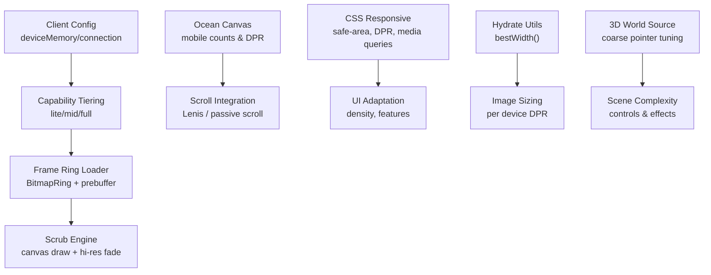

**Diagram sources**
- [app.js:479-497](file://3D Wedding Invitation Sample 2/app.js#L479-L497)
- [ocean.js:34-38](file://js/ocean.js#L34-L38)
- [styles.css:6-20](file://3D Wedding Invitation Sample 2/styles.css#L6-L20)
- [hydrate.js:49-63](file://shared/hydrate.js#L49-L63)
- [main.js:111-113](file://3D Wedding Invitation Sample 2/3d-world-source/src/main.js#L111-L113)

**Section sources**
- [app.js:479-497](file://3D Wedding Invitation Sample 2/app.js#L479-L497)
- [ocean.js:34-38](file://js/ocean.js#L34-L38)
- [styles.css:6-20](file://3D Wedding Invitation Sample 2/styles.css#L6-L20)
- [hydrate.js:49-63](file://shared/hydrate.js#L49-L63)
- [main.js:111-113](file://3D Wedding Invitation Sample 2/3d-world-source/src/main.js#L111-L113)

## Core Components
- Capability tiering and device detection: Uses device memory and connection type to select a performance tier (lite/mid/full), controlling prebuffering and interpolation.
- Frame ring loader: Pre-decodes images into ImageBitmaps in a direction-aware ring around the playhead; evicts bitmaps to bound memory; supports full prebuffer on capable devices.
- Scrub engine: Maps scroll to frame indices with smoothing; fades in high-resolution frames when motion settles; respects reduced motion and touch thresholds.
- Ocean canvas: Full-screen animated background with mobile-reduced particle/fish/jelly counts; DPR capped; integrates with Lenis or passive scroll.
- CSS responsive layer: Safe-area insets, viewport height correction, media queries for density and feature toggles; touch-friendly controls.
- Hydration utility: Chooses best image width based on innerWidth and devicePixelRatio, avoiding per-image srcset edits.
- 3D world source: Detects coarse pointer and adjusts control mappings and behavior for mobile.

**Section sources**
- [app.js:479-497](file://3D Wedding Invitation Sample 2/app.js#L479-L497)
- [app.js:357-477](file://3D Wedding Invitation Sample 2/app.js#L357-L477)
- [app.js:608-713](file://3D Wedding Invitation Sample 2/app.js#L608-L713)
- [ocean.js:34-38](file://js/ocean.js#L34-L38)
- [ocean.js:104-131](file://js/ocean.js#L104-L131)
- [styles.css:6-20](file://3D Wedding Invitation Sample 2/styles.css#L6-L20)
- [hydrate.js:49-63](file://shared/hydrate.js#L49-L63)
- [main.js:111-113](file://3D Wedding Invitation Sample 2/3d-world-source/src/main.js#L111-L113)

## Architecture Overview
The mobile optimization architecture is centered on capability detection driving resource allocation and rendering budgets.

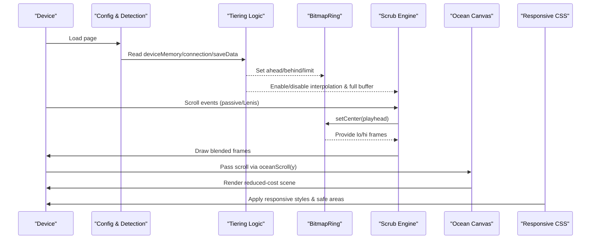

**Diagram sources**
- [app.js:479-497](file://3D Wedding Invitation Sample 2/app.js#L479-L497)
- [app.js:357-477](file://3D Wedding Invitation Sample 2/app.js#L357-L477)
- [app.js:608-713](file://3D Wedding Invitation Sample 2/app.js#L608-L713)
- [ocean.js:68-78](file://js/ocean.js#L68-L78)
- [styles.css:6-20](file://3D Wedding Invitation Sample 2/styles.css#L6-L20)

## Detailed Component Analysis

### Capability Detection and Tiered Rendering
- Detects save data mode, effective network type, and device memory to assign a tier:
  - lite: minimal prebuffer, no interpolation, small ring limits
  - mid: moderate prebuffer and interpolation
  - full: full prebuffer and interpolation where supported
- Influences:
  - Bitmap ring ahead/behind windows
  - Whether to fully prebuffer frames
  - Whether to enable high-res frame fading during calm motion

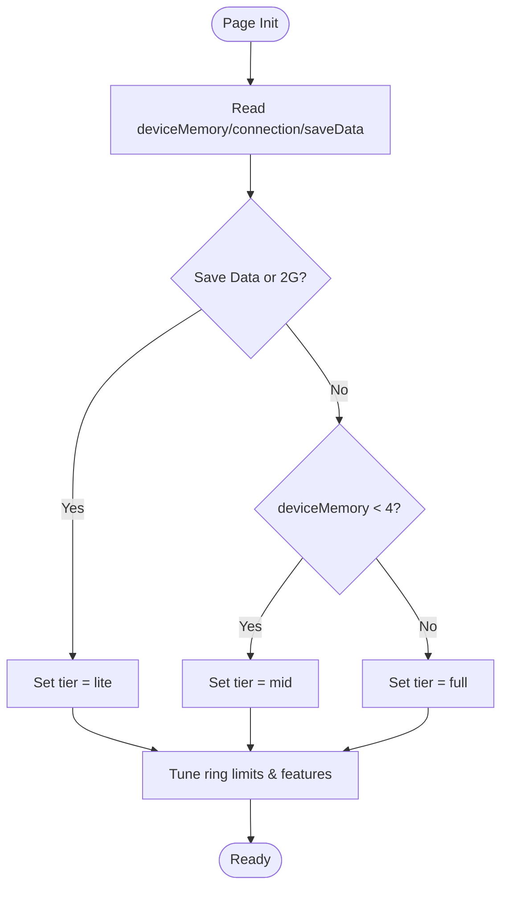

**Diagram sources**
- [app.js:479-497](file://3D Wedding Invitation Sample 2/app.js#L479-L497)

**Section sources**
- [app.js:479-497](file://3D Wedding Invitation Sample 2/app.js#L479-L497)

### Frame Ring Loader and Prebuffering
- Loads frames off the main thread using createImageBitmap when available; falls back to async decoding
- Maintains a ring around the current frame index with directional pumping and eviction
- Supports full prebuffer on capable devices to eliminate decode stalls during scrubbing
- Evicts bitmaps outside retention windows to keep memory bounded

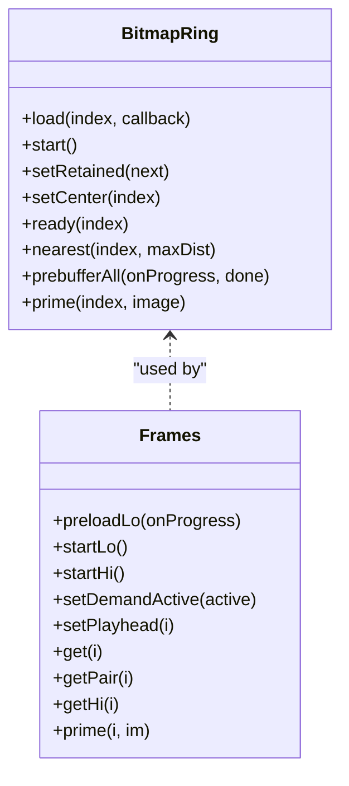

**Diagram sources**
- [app.js:357-477](file://3D Wedding Invitation Sample 2/app.js#L357-L477)
- [app.js:491-606](file://3D Wedding Invitation Sample 2/app.js#L491-L606)

**Section sources**
- [app.js:357-477](file://3D Wedding Invitation Sample 2/app.js#L357-L477)
- [app.js:491-606](file://3D Wedding Invitation Sample 2/app.js#L491-L606)

### Scrub Engine and Touch-Aware Scrolling
- Maps scroll progress to frame indices with exponential smoothing tuned differently for touch vs mouse
- Uses IntersectionObserver to activate/deactivate demand loading only when visible
- Fades in high-resolution frames when motion velocity drops below threshold
- Respects reduced motion preferences and avoids heavy work when not needed

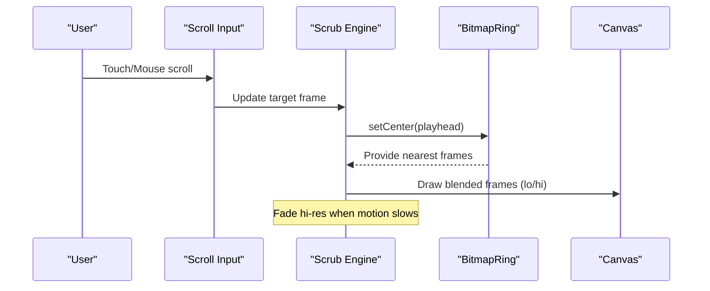

**Diagram sources**
- [app.js:608-713](file://3D Wedding Invitation Sample 2/app.js#L608-L713)

**Section sources**
- [app.js:608-713](file://3D Wedding Invitation Sample 2/app.js#L608-L713)

### Ocean Canvas Optimizations for Mobile
- Caps DPR to reduce GPU pressure on high-DPI screens
- Reduces counts of visual elements (rays, snow, fish, jellyfish) on mobile
- Integrates with Lenis or passive scroll listeners to avoid jank
- Pauses animation loop when tab hidden; uses hybrid rAF/setTimeout driver for resilience

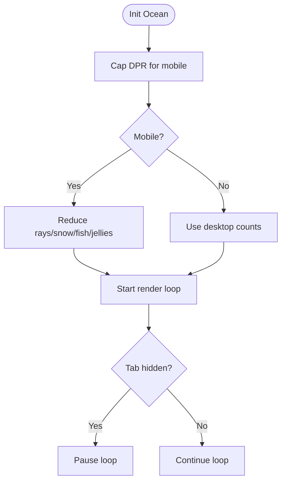

**Diagram sources**
- [ocean.js:34-38](file://js/ocean.js#L34-L38)
- [ocean.js:104-131](file://js/ocean.js#L104-L131)
- [ocean.js:426-445](file://js/ocean.js#L426-L445)
- [ocean.js:629-632](file://js/ocean.js#L629-L632)

**Section sources**
- [ocean.js:34-38](file://js/ocean.js#L34-L38)
- [ocean.js:104-131](file://js/ocean.js#L104-L131)
- [ocean.js:426-445](file://js/ocean.js#L426-L445)
- [ocean.js:629-632](file://js/ocean.js#L629-L632)

### Responsive Design Patterns and Content Density
- Uses CSS variables for theme and safe-area insets; corrects vh units to avoid URL bar jumps
- Media queries adjust layout density, carousel sizes, and interactive affordances
- Touch-friendly controls with larger hit areas and passive event listeners
- Reduced motion respected globally to disable animations and transitions

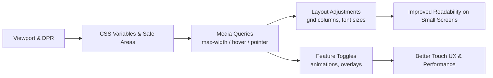

**Diagram sources**
- [styles.css:6-20](file://3D Wedding Invitation Sample 2/styles.css#L6-L20)
- [style.css:297-316](file://css/style.css#L297-L316)

**Section sources**
- [styles.css:6-20](file://3D Wedding Invitation Sample 2/styles.css#L6-L20)
- [style.css:297-316](file://css/style.css#L297-L316)

### Viewport-Aware Rendering Strategies
- Corrects vh units dynamically to handle mobile browser chrome changes
- Uses intersection observers to limit work to visible regions
- Selects image widths based on device DPR and innerWidth via hydration utility
- Adjusts 3D world controls for coarse pointers to optimize touch navigation

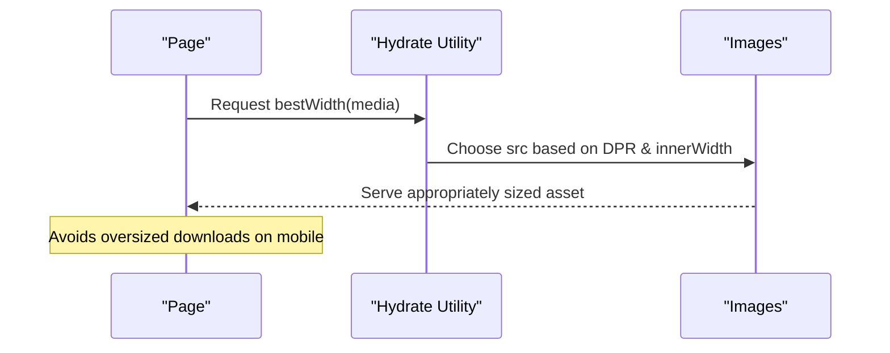

**Diagram sources**
- [app.js:152-179](file://3D Wedding Invitation Sample 2/app.js#L152-L179)
- [hydrate.js:49-63](file://shared/hydrate.js#L49-L63)

**Section sources**
- [app.js:152-179](file://3D Wedding Invitation Sample 2/app.js#L152-L179)
- [hydrate.js:49-63](file://shared/hydrate.js#L49-L63)

### Touch Gesture Handling Optimizations
- Passive scroll listeners and Lenis integration for smooth scrolling without blocking
- Touch-action properties to allow horizontal carousels while preventing unwanted gestures
- Pointer events used for interactions like scattering fish in the ocean canvas
- Reduced motion preference disables heavy animations and transitions

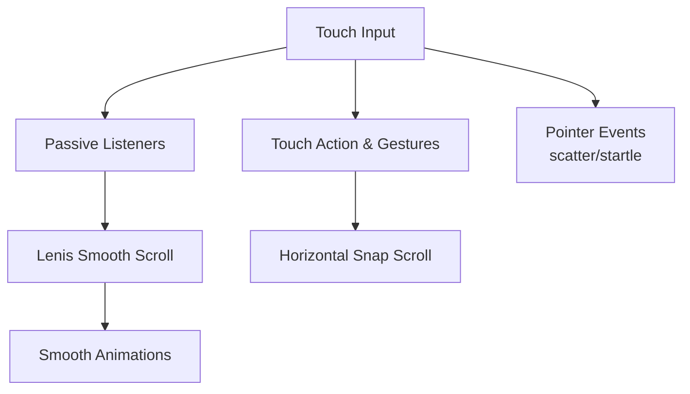

**Diagram sources**
- [app.js:44-56](file://js/app.js#L44-L56)
- [style.css:425-431](file://css/style.css#L425-L431)
- [ocean.js:81-102](file://js/ocean.js#L81-L102)

**Section sources**
- [app.js:44-56](file://js/app.js#L44-L56)
- [style.css:425-431](file://css/style.css#L425-L431)
- [ocean.js:81-102](file://js/ocean.js#L81-L102)

### Configuration System for Mobile Asset Serving
- Reads device capabilities and network conditions to determine performance tier
- Applies different prebuffer strategies and interpolation settings based on tier
- Uses hydration utility to serve appropriately sized images per device
- 3D world source detects coarse pointer to adapt controls and behaviors

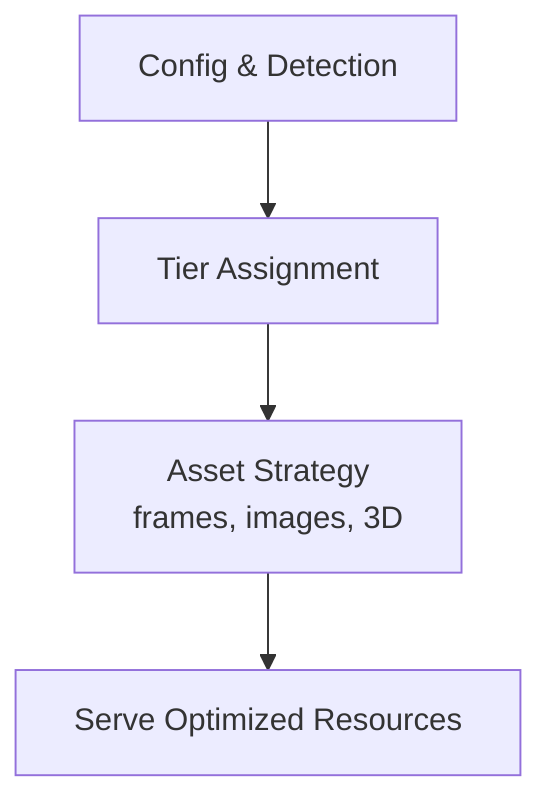

**Diagram sources**
- [app.js:479-497](file://3D Wedding Invitation Sample 2/app.js#L479-L497)
- [hydrate.js:49-63](file://shared/hydrate.js#L49-L63)
- [main.js:111-113](file://3D Wedding Invitation Sample 2/3d-world-source/src/main.js#L111-L113)

**Section sources**
- [app.js:479-497](file://3D Wedding Invitation Sample 2/app.js#L479-L497)
- [hydrate.js:49-63](file://shared/hydrate.js#L49-L63)
- [main.js:111-113](file://3D Wedding Invitation Sample 2/3d-world-source/src/main.js#L111-L113)

### Battery Usage Minimization and Background Processing
- Pauses audio context and background music when tab hidden; resumes on visibility change
- Suspends/resumes AudioContext to conserve battery and CPU
- Uses IntersectionObserver to limit expensive work to visible sections
- Hybrid render loop with setTimeout fallback ensures responsiveness even if rAF is throttled

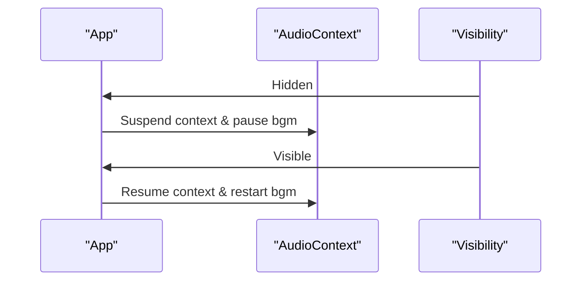

**Diagram sources**
- [app.js:335-338](file://3D Wedding Invitation Sample 2/app.js#L335-L338)
- [ocean.js:629-632](file://js/ocean.js#L629-L632)

**Section sources**
- [app.js:335-338](file://3D Wedding Invitation Sample 2/app.js#L335-L338)
- [ocean.js:629-632](file://js/ocean.js#L629-L632)

### Network Requests: Batching and Caching
- Bitmap ring batches fetches with controlled concurrency and retries on failure
- Uses cache: "no-store" for API calls to avoid stale state; includes retry logic with backoff for transient errors
- Prefers local resources and lazy-loading to minimize initial payload

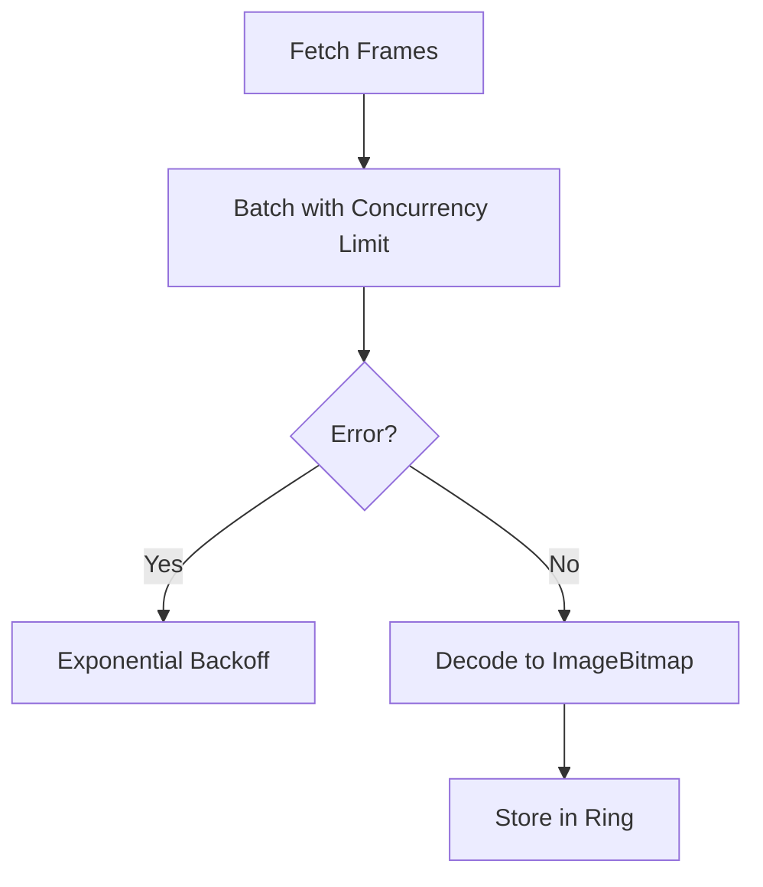

**Diagram sources**
- [app.js:378-403](file://3D Wedding Invitation Sample 2/app.js#L378-L403)
- [publish-client.js:118-140](file://shared/publish-client.js#L118-L140)

**Section sources**
- [app.js:378-403](file://3D Wedding Invitation Sample 2/app.js#L378-L403)
- [publish-client.js:118-140](file://shared/publish-client.js#L118-L140)

## Dependency Analysis
Key dependencies and relationships:
- app.js orchestrates capability detection, frame loading, and scrubbing
- ocean.js provides an optimized background canvas with mobile-specific reductions
- styles.css and style.css define responsive layouts and safe-area handling
- hydrate.js selects appropriate image sizes based on device characteristics
- main.js in 3D world source adapts controls for coarse pointers

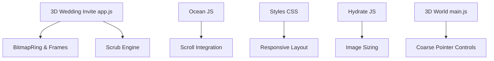

**Diagram sources**
- [app.js:479-497](file://3D Wedding Invitation Sample 2/app.js#L479-L497)
- [ocean.js:34-38](file://js/ocean.js#L34-L38)
- [styles.css:6-20](file://3D Wedding Invitation Sample 2/styles.css#L6-L20)
- [hydrate.js:49-63](file://shared/hydrate.js#L49-L63)
- [main.js:111-113](file://3D Wedding Invitation Sample 2/3d-world-source/src/main.js#L111-L113)

**Section sources**
- [app.js:479-497](file://3D Wedding Invitation Sample 2/app.js#L479-L497)
- [ocean.js:34-38](file://js/ocean.js#L34-L38)
- [styles.css:6-20](file://3D Wedding Invitation Sample 2/styles.css#L6-L20)
- [hydrate.js:49-63](file://shared/hydrate.js#L49-L63)
- [main.js:111-113](file://3D Wedding Invitation Sample 2/3d-world-source/src/main.js#L111-L113)

## Performance Considerations
- Memory constraints: Bitmap ring eviction and capped DPR prevent excessive memory use on low-memory devices
- Thermal throttling: Reduced element counts and disabled animations under reduced motion help maintain frame rates
- Variable networks: Save data mode and slow network detection lower prebuffering and enable retries with backoff
- Battery life: Audio context suspension and visibility handling reduce power consumption when inactive
- Interaction smoothness: Passive listeners, Lenis integration, and touch-action properties improve scrolling and gesture response

[No sources needed since this section provides general guidance]

## Troubleshooting Guide
Common issues and resolutions:
- Stuttering during scrubbing: Ensure bitmap ring has sufficient ahead/behind windows; verify full prebuffer on capable devices
- High memory usage: Confirm eviction is active and DPR is capped; check for retained bitmaps beyond retention window
- Poor scroll performance: Use passive listeners; integrate with Lenis; avoid heavy work off the main thread
- Excessive battery drain: Suspend audio context when hidden; respect reduced motion; limit animation loops
- Network failures: Implement retries with backoff; avoid caching sensitive requests; prefer smaller assets on slow connections

**Section sources**
- [app.js:378-403](file://3D Wedding Invitation Sample 2/app.js#L378-L403)
- [publish-client.js:118-140](file://shared/publish-client.js#L118-L140)
- [ocean.js:426-445](file://js/ocean.js#L426-L445)

## Conclusion
The DeepDreams portfolio system employs a comprehensive set of mobile optimizations:
- Capability-aware tiering drives resource allocation and rendering budgets
- Efficient frame loading and scrubbing ensure smooth interactions
- Responsive CSS and safe-area handling deliver consistent layouts across devices
- Battery-conscious practices and resilient networking improve reliability and longevity
- Touch-optimized interactions and reduced motion support enhance accessibility and performance

These strategies collectively address common mobile pitfalls and provide a robust foundation for delivering high-quality experiences on constrained devices.

[No sources needed since this section summarizes without analyzing specific files]