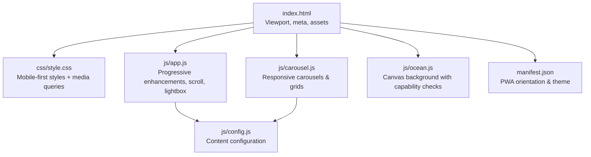
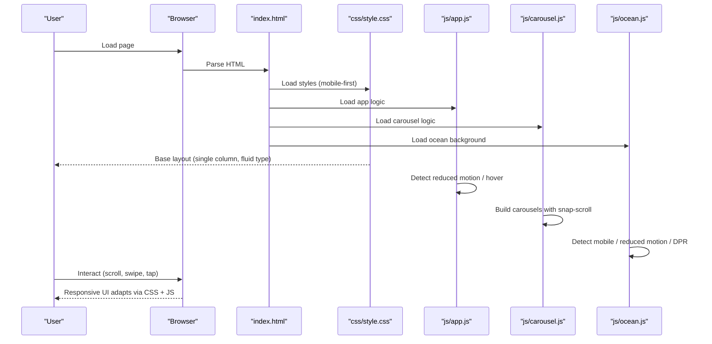
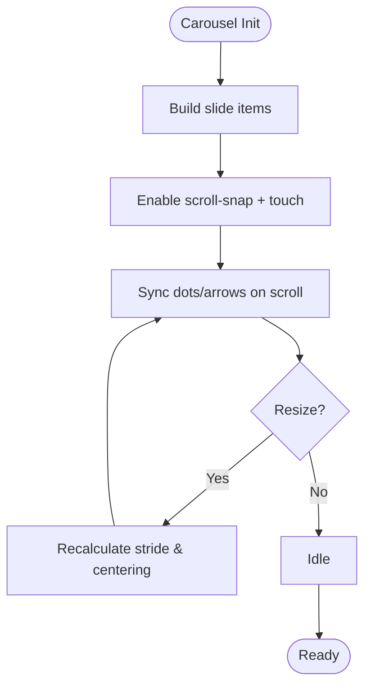
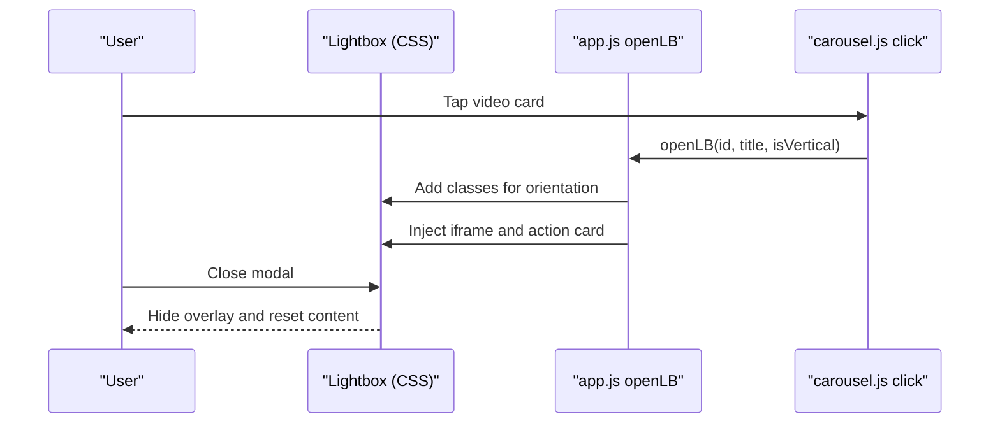
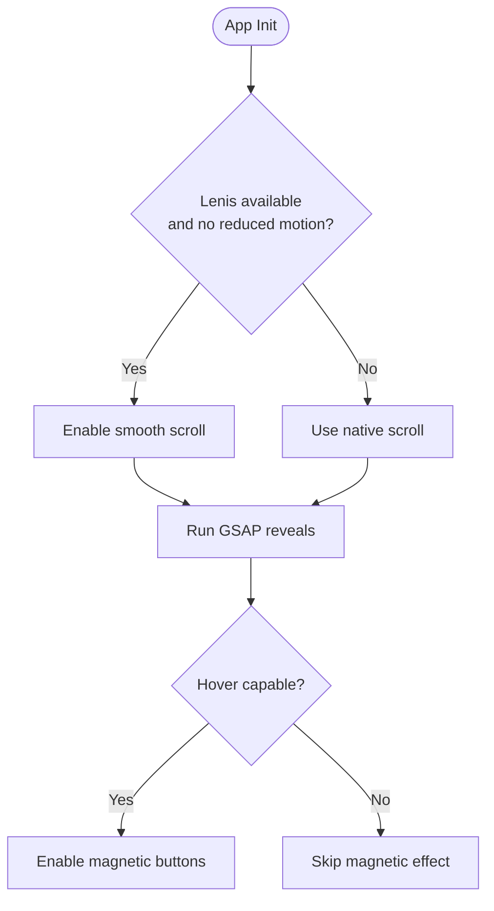
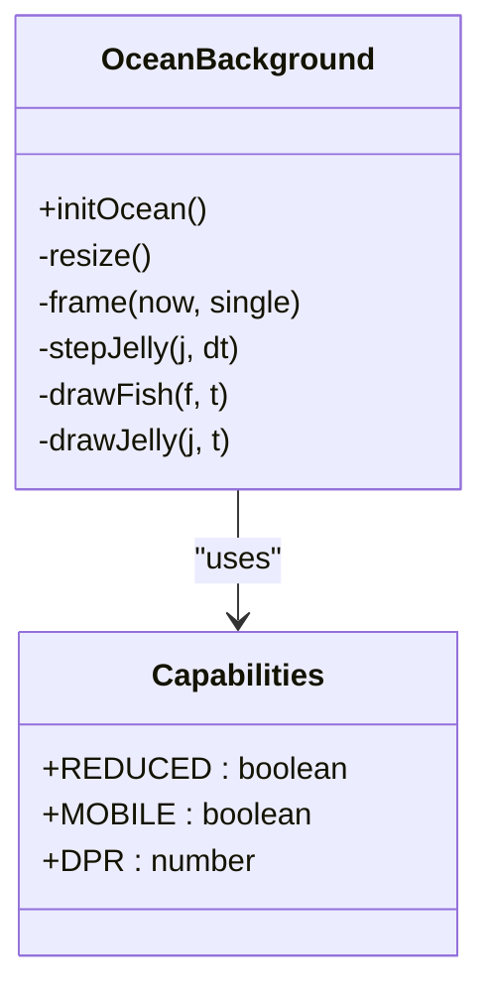
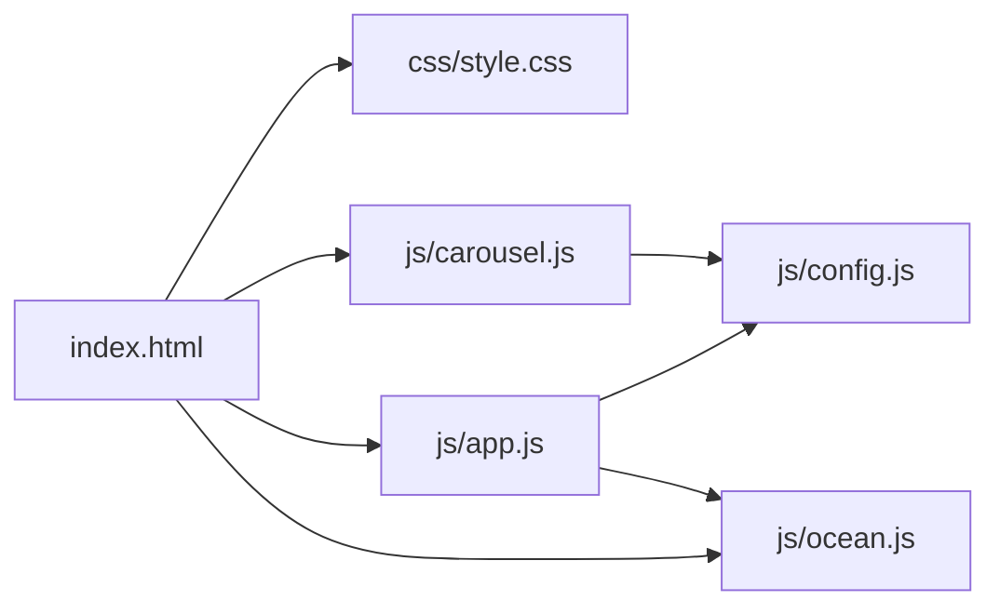

# Responsive Design Patterns

<cite>
**Referenced Files in This Document**
- [index.html](file://index.html)
- [css/style.css](file://css/style.css)
- [js/app.js](file://js/app.js)
- [js/carousel.js](file://js/carousel.js)
- [js/ocean.js](file://js/ocean.js)
- [js/config.js](file://js/config.js)
- [manifest.json](file://manifest.json)
</cite>

## Table of Contents
1. [Introduction](#introduction)
2. [Project Structure](#project-structure)
3. [Core Components](#core-components)
4. [Architecture Overview](#architecture-overview)
5. [Detailed Component Analysis](#detailed-component-analysis)
6. [Dependency Analysis](#dependency-analysis)
7. [Performance Considerations](#performance-considerations)
8. [Troubleshooting Guide](#troubleshooting-guide)
9. [Conclusion](#conclusion)

## Introduction
This document explains how the DeepDreams portfolio system implements responsive design patterns to deliver an optimal viewing experience across smartphones, tablets, and desktop devices. It focuses on:
- Mobile-first CSS with fluid typography and adaptive layouts
- Media queries that adjust carousels, galleries, navigation, and modals for different screen sizes
- Device capability detection and performance-aware rendering (reduced motion, DPR limits, mobile-specific canvas budgets)
- Progressive enhancement where core content works everywhere and advanced interactions are enabled when supported
- Video galleries, navigation menus, and interactive elements that automatically adapt their layout and behavior

## Project Structure
The responsive system is implemented primarily through:
- A single-page HTML shell that sets viewport and loads shared styles and scripts
- A comprehensive stylesheet defining fluid layouts, media queries, and component-level responsiveness
- JavaScript modules that detect capabilities, render carousels and lightboxes, and manage animations and scroll-driven effects

**Diagram sources**
- [index.html:1-31](file://index.html#L1-L31)
- [css/style.css:1-30](file://css/style.css#L1-L30)
- [js/app.js:1-60](file://js/app.js#L1-L60)
- [js/carousel.js:1-20](file://js/carousel.js#L1-L20)
- [js/ocean.js:1-40](file://js/ocean.js#L1-L40)
- [js/config.js:1-20](file://js/config.js#L1-L20)
- [manifest.json:1-25](file://manifest.json#L1-L25)

**Section sources**
- [index.html:1-31](file://index.html#L1-L31)
- [css/style.css:1-30](file://css/style.css#L1-L30)
- [js/app.js:1-60](file://js/app.js#L1-L60)
- [js/carousel.js:1-20](file://js/carousel.js#L1-L20)
- [js/ocean.js:1-40](file://js/ocean.js#L1-L40)
- [js/config.js:1-20](file://js/config.js#L1-L20)
- [manifest.json:1-25](file://manifest.json#L1-L25)

## Core Components
- Viewport and PWA setup ensure proper scaling and mobile app-like presentation
- Fluid typography and spacing using clamp and relative units for scalable text and spacing
- CSS Grid and Flexbox layouts that reflow from single-column mobile to multi-column desktop
- Media queries that adjust carousels, grids, modals, and navigation for small, medium, and large screens
- Capability detection to reduce or disable heavy animations and optimize canvas rendering
- Progressive enhancement: core content always visible; advanced features like smooth scrolling, magnetic buttons, and complex animations are conditionally enabled

**Section sources**
- [index.html:4-30](file://index.html#L4-L30)
- [css/style.css:110-160](file://css/style.css#L110-L160)
- [css/style.css:297-316](file://css/style.css#L297-L316)
- [css/style.css:468-477](file://css/style.css#L468-L477)
- [css/style.css:575-577](file://css/style.css#L575-L577)
- [js/app.js:44-56](file://js/app.js#L44-L56)
- [js/app.js:126-141](file://js/app.js#L126-L141)
- [js/ocean.js:34-38](file://js/ocean.js#L34-L38)
- [manifest.json:1-25](file://manifest.json#L1-L25)

## Architecture Overview
The responsive architecture combines a mobile-first stylesheet with JavaScript-driven capability detection and progressive enhancement. The flow is:
- HTML defines semantic structure and loads CSS and JS
- CSS establishes base styles for mobile and uses media queries to enhance for larger screens
- JS detects device capabilities and user preferences to enable or limit advanced features
- Carousels and galleries use native scroll-snap for consistent touch behavior across devices
- Canvas-based background adapts particle counts and visual complexity based on screen size and reduced-motion settings

**Diagram sources**
- [index.html:32-359](file://index.html#L32-L359)
- [css/style.css:91-160](file://css/style.css#L91-L160)
- [js/app.js:44-56](file://js/app.js#L44-L56)
- [js/carousel.js:213-322](file://js/carousel.js#L213-L322)
- [js/ocean.js:34-38](file://js/ocean.js#L34-L38)

## Detailed Component Analysis

### Fluid Layouts and Typography
- Fluid typography uses clamp to scale headings and section titles across viewports, ensuring readability on phones and large screens
- Spacing and container widths adapt via CSS variables and max-width constraints
- Grid layouts switch from single-column on mobile to two-column on larger screens for galleries and site showcases

Examples:
- Hero title scales fluidly with clamp
- Section titles and descriptions scale proportionally
- Grids reflow at specific breakpoints

**Section sources**
- [css/style.css:110-116](file://css/style.css#L110-L116)
- [css/style.css:150-156](file://css/style.css#L150-L156)
- [css/style.css:322-357](file://css/style.css#L322-L357)
- [css/style.css:514-577](file://css/style.css#L514-L577)

### Media Queries and Breakpoints
Breakpoints used throughout the stylesheet:
- Small phones: around 520–560px
- Tablets and smaller desktops: around 640–768px
- Larger screens: above 768px

Key behaviors:
- Navigation and hero actions wrap and adjust padding
- Carousel controls shrink and reposition for touch devices
- Grids collapse to single column on small screens
- Modals stack action cards vertically on narrow screens

**Section sources**
- [css/style.css:297-303](file://css/style.css#L297-L303)
- [css/style.css:468-477](file://css/style.css#L468-L477)
- [css/style.css:501-509](file://css/style.css#L501-L509)
- [css/style.css:575-577](file://css/style.css#L575-L577)

### Adaptive Component Rendering: Carousels and Galleries
- Native scroll-snap carousels provide consistent horizontal swiping on all devices
- Dots and arrows update based on actual scroll position and track width
- Vertical invitation videos maintain a two-column layout but tighten gaps on small phones
- Site showcase grids collapse to one column on very small screens

**Diagram sources**
- [js/carousel.js:213-322](file://js/carousel.js#L213-L322)
- [css/style.css:425-477](file://css/style.css#L425-L477)

**Section sources**
- [js/carousel.js:213-322](file://js/carousel.js#L213-L322)
- [css/style.css:425-477](file://css/style.css#L425-L477)
- [css/style.css:482-509](file://css/style.css#L482-L509)
- [css/style.css:514-577](file://css/style.css#L514-L577)

### Lightbox Behavior and Orientation Handling
- Lightbox supports both horizontal and vertical video orientations
- On narrow screens, action cards stack vertically and buttons become full-width
- Close behavior and backdrop blur improve focus on video content

**Diagram sources**
- [js/app.js:146-188](file://js/app.js#L146-L188)
- [css/style.css:240-303](file://css/style.css#L240-L303)

**Section sources**
- [js/app.js:146-188](file://js/app.js#L146-L188)
- [css/style.css:240-303](file://css/style.css#L240-L303)

### Navigation and Touch-Friendly Controls
- Header becomes translucent and hides on scroll down to maximize content space
- Buttons and links are sized for touch targets
- Carousel arrows and dots adapt size and positioning for smaller screens

**Section sources**
- [css/style.css:95-107](file://css/style.css#L95-L107)
- [css/style.css:450-477](file://css/style.css#L450-L477)

### Progressive Enhancement and Reduced Motion
- Smooth scrolling via Lenis is disabled if reduced motion is preferred
- Magnetic button effects only activate on hover-capable devices
- GSAP animations run only when libraries are available and do not block core content

**Diagram sources**
- [js/app.js:44-56](file://js/app.js#L44-L56)
- [js/app.js:126-141](file://js/app.js#L126-L141)

**Section sources**
- [js/app.js:44-56](file://js/app.js#L44-L56)
- [js/app.js:126-141](file://js/app.js#L126-L141)
- [css/style.css:314-316](file://css/style.css#L314-L316)

### Device Capability Detection and Performance Optimization
- Canvas background reduces particle counts and fish numbers on mobile
- Device pixel ratio capped to balance sharpness and performance
- Reduced motion preference slows or simplifies animations
- Visibility handling pauses animation loops when tab is hidden

**Diagram sources**
- [js/ocean.js:27-51](file://js/ocean.js#L27-L51)
- [js/ocean.js:104-141](file://js/ocean.js#L104-L141)
- [js/ocean.js:241-298](file://js/ocean.js#L241-L298)
- [js/ocean.js:419-445](file://js/ocean.js#L419-L445)

**Section sources**
- [js/ocean.js:34-38](file://js/ocean.js#L34-L38)
- [js/ocean.js:104-141](file://js/ocean.js#L104-L141)
- [js/ocean.js:241-298](file://js/ocean.js#L241-L298)
- [js/ocean.js:419-445](file://js/ocean.js#L419-L445)

### Configuration-Driven Content and Sections
- Config centralizes contact info, social links, and showcase data
- Carousels load content from Google Sheets with fallback arrays
- Empty sections hide themselves to avoid showing unrelated content

**Section sources**
- [js/config.js:20-129](file://js/config.js#L20-L129)
- [js/carousel.js:151-205](file://js/carousel.js#L151-L205)
- [js/carousel.js:342-349](file://js/carousel.js#L342-L349)

## Dependency Analysis
- index.html loads CSS and JS in order, ensuring styles apply before scripts enhance behavior
- app.js depends on external libraries (Lenis, GSAP) and config for links and content
- carousel.js depends on config for data and exposes openLB integration with app.js
- ocean.js runs independently but integrates with scroll events fed by app.js

**Diagram sources**
- [index.html:352-359](file://index.html#L352-L359)
- [js/app.js:1-60](file://js/app.js#L1-L60)
- [js/carousel.js:1-20](file://js/carousel.js#L1-L20)
- [js/ocean.js:1-40](file://js/ocean.js#L1-L40)
- [js/config.js:1-20](file://js/config.js#L1-L20)

**Section sources**
- [index.html:352-359](file://index.html#L352-L359)
- [js/app.js:1-60](file://js/app.js#L1-L60)
- [js/carousel.js:1-20](file://js/carousel.js#L1-L20)
- [js/ocean.js:1-40](file://js/ocean.js#L1-L40)
- [js/config.js:1-20](file://js/config.js#L1-L20)

## Performance Considerations
- Mobile-first CSS minimizes initial layout shifts and ensures fast first paint
- Fluid typography avoids multiple font-size declarations per breakpoint
- Native scroll-snap carousels leverage browser optimizations for smooth touch interactions
- Canvas background reduces particle counts and caps DPR on mobile to conserve resources
- Reduced motion support disables or slows animations for accessibility and battery life
- Visibility change handling pauses animation loops when tabs are hidden

[No sources needed since this section provides general guidance]

## Troubleshooting Guide
Common issues and resolutions:
- Videos not loading: Ensure YouTube IDs are valid and embed URLs are correct; check network requests for blocked domains
- Carousels not snapping: Verify scroll-snap properties and that tracks have overflow set correctly
- Animations not running: Confirm GSAP and Lenis libraries loaded; check reduced motion preferences
- Canvas background lagging: Reduce DPR cap or disable heavy effects on low-end devices; verify visibility handling

**Section sources**
- [js/carousel.js:351-383](file://js/carousel.js#L351-L383)
- [js/app.js:44-56](file://js/app.js#L44-L56)
- [js/ocean.js:419-445](file://js/ocean.js#L419-L445)

## Conclusion
The DeepDreams portfolio employs a robust responsive design strategy grounded in mobile-first CSS, fluid layouts, and capability-aware JavaScript. Media queries adapt carousels, galleries, navigation, and modals across devices. Progressive enhancement ensures core functionality works universally while advanced features enrich the experience on capable browsers. Device detection optimizes performance-sensitive components like the canvas background, and configuration-driven content keeps the site maintainable and adaptable. Together, these patterns deliver a consistent, accessible, and high-performance experience across smartphones, tablets, and desktops.