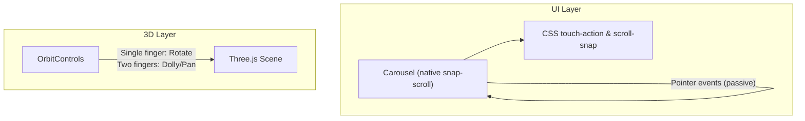
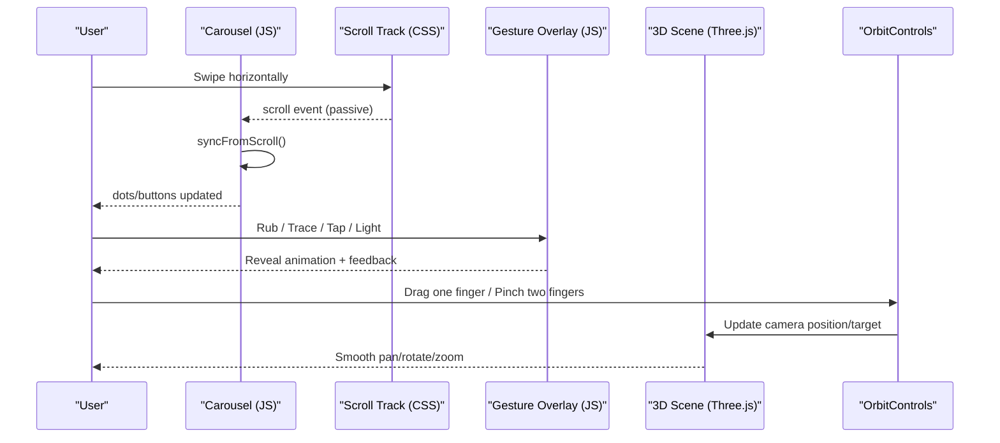
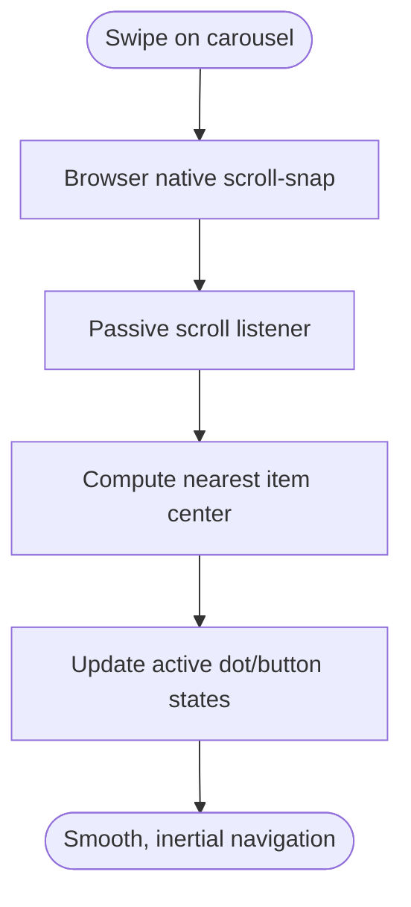
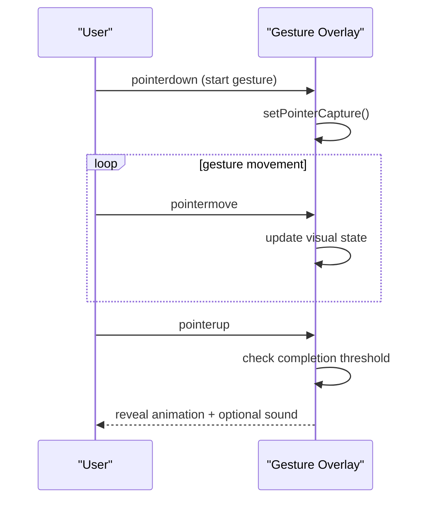
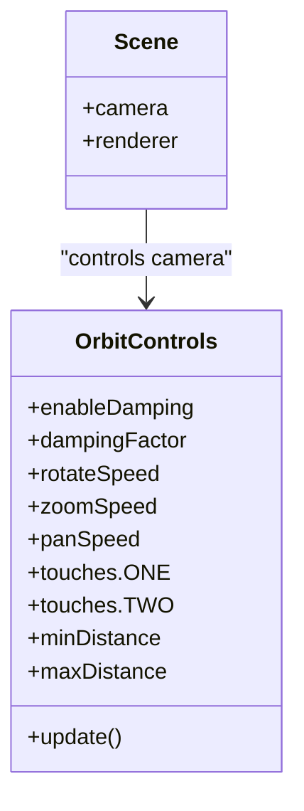
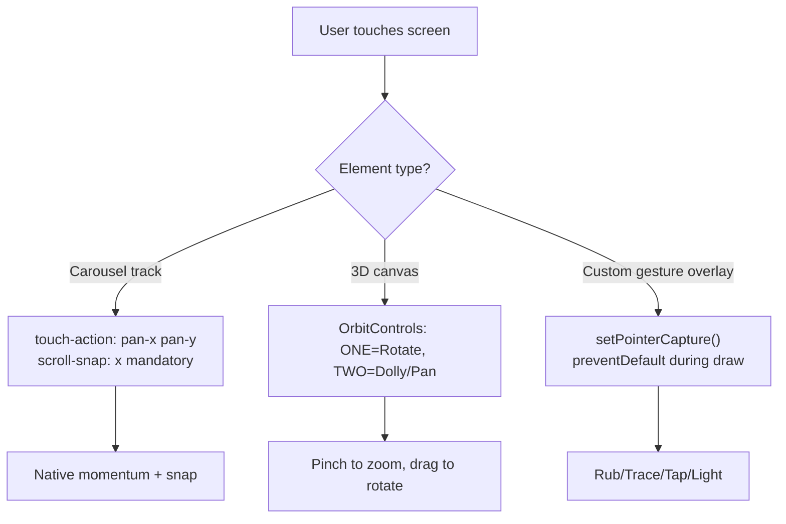
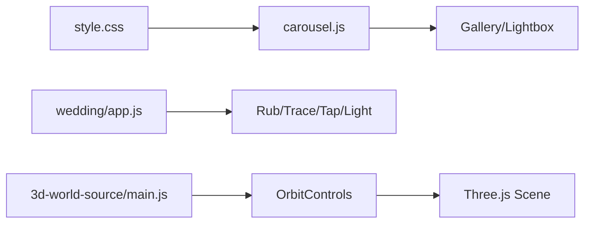

# Touch Gesture Handling

<cite>
**Referenced Files in This Document**
- [carousel.js](file://js/carousel.js)
- [style.css](file://css/style.css)
- [main.js](file://3D Wedding Invitation Sample 2/3d-world-source/src/main.js)
- [app.js](file://wedding/app.js)
</cite>

## Table of Contents
1. [Introduction](#introduction)
2. [Project Structure](#project-structure)
3. [Core Components](#core-components)
4. [Architecture Overview](#architecture-overview)
5. [Detailed Component Analysis](#detailed-component-analysis)
6. [Dependency Analysis](#dependency-analysis)
7. [Performance Considerations](#performance-considerations)
8. [Troubleshooting Guide](#troubleshooting-guide)
9. [Conclusion](#conclusion)

## Introduction
This document explains how the DeepDreams system handles touch gestures and mobile interactions across carousels, galleries, and the 3D wedding invitation world. It covers swipe detection for carousels and galleries, momentum scrolling, pinch-to-zoom behavior, custom gesture implementations (rub, trace, tap, light), camera control in the 3D scene, accessibility considerations, and strategies to avoid common mobile touch issues such as accidental gestures, small touch targets, and cross-browser inconsistencies.

## Project Structure
Touch-related logic is implemented in two main areas:
- UI-level carousels and galleries using native scroll-snap with minimal JS orchestration
- A 3D scene powered by Three.js with OrbitControls handling single-finger rotate and two-finger dolly/pan

**Diagram sources**
- [carousel.js:213-322](file://js/carousel.js#L213-L322)
- [style.css:425-431](file://css/style.css#L425-L431)
- [main.js:175-188](file://3D Wedding Invitation Sample 2/3d-world-source/src/main.js#L175-L188)

**Section sources**
- [carousel.js:213-322](file://js/carousel.js#L213-L322)
- [style.css:425-431](file://css/style.css#L425-L431)
- [main.js:175-188](file://3D Wedding Invitation Sample 2/3d-world-source/src/main.js#L175-L188)

## Core Components
- Carousel with native scroll-snap and pointer-based click guarding
- Custom gesture overlays: rub off turmeric, trace a heart, tap the dhol, light the diya
- 3D camera controls via OrbitControls with mobile-friendly mapping and damping
- CSS-driven touch behaviors (scroll-snap, touch-action) for smooth, inertial swiping

Key responsibilities:
- Carousels delegate most motion to the browser’s native scrolling engine for consistent momentum and rubber-banding
- Gesture overlays use Pointer Events with capture and passive listeners where appropriate
- 3D controls map one-finger drag to rotation and two-finger gestures to zoom/pan with damping tuned for mobile

**Section sources**
- [carousel.js:213-322](file://js/carousel.js#L213-L322)
- [app.js:434-647](file://wedding/app.js#L434-L647)
- [main.js:175-188](file://3D Wedding Invitation Sample 2/3d-world-source/src/main.js#L175-L188)
- [style.css:425-431](file://css/style.css#L425-L431)

## Architecture Overview
The system separates concerns between UI carousels/gestures and the 3D scene:
- UI layer uses CSS scroll-snap for horizontal rails and vertical video grids; JS only updates active state and guards clicks after drags
- 3D layer uses OrbitControls configured for coarse pointers (mobile) with specific touch mappings and damping values

**Diagram sources**
- [carousel.js:230-250](file://js/carousel.js#L230-L250)
- [carousel.js:281-296](file://js/carousel.js#L281-L296)
- [app.js:434-647](file://wedding/app.js#L434-L647)
- [main.js:175-188](file://3D Wedding Invitation Sample 2/3d-world-source/src/main.js#L175-L188)

## Detailed Component Analysis

### Carousel Swipe Detection and Momentum Scrolling
- Uses CSS scroll-snap with a flex track for horizontal carousels and a separate 9:16 rail for invitation videos
- Native scrolling provides inertia, rubber-banding, and pixel-perfect alignment on all devices
- JS listens to scroll events with passive handlers to update active slide, dots, and buttons without blocking input
- Click-after-drag guard prevents opening a lightbox when the user intended to swipe

**Diagram sources**
- [style.css:425-431](file://css/style.css#L425-L431)
- [carousel.js:230-250](file://js/carousel.js#L230-L250)
- [carousel.js:281-296](file://js/carousel.js#L281-L296)

**Section sources**
- [style.css:425-431](file://css/style.css#L425-L431)
- [carousel.js:213-322](file://js/carousel.js#L213-L322)

### Custom Gesture Implementations (Rub, Trace, Tap, Light)
- Rub: Canvas overlay erased with destination-out composite; completion threshold triggers reveal
- Trace: SVG path points sampled around a heart shape; proximity checks mark segments and dots
- Tap: Button taps count toward a beat sequence with synthesized audio feedback
- Light: Single tap toggles flame glow and completes the reveal

All gestures use Pointer Events with setPointerCapture to ensure reliable tracking across devices.

**Diagram sources**
- [app.js:434-498](file://wedding/app.js#L434-L498)
- [app.js:500-570](file://wedding/app.js#L500-L570)
- [app.js:572-647](file://wedding/app.js#L572-L647)

**Section sources**
- [app.js:434-647](file://wedding/app.js#L434-L647)

### 3D Camera Control and Touch Interaction
- Mobile detection adjusts renderer quality, shadow maps, and control sensitivity
- OrbitControls mapped so:
  - One finger: rotate
  - Two fingers: dolly (zoom) and pan
- Damping and speed tuned for mobile; distance limits prevent extreme zoom
- Idle cinematic follow can be interrupted by any interaction; tips guide first-time users

**Diagram sources**
- [main.js:111-114](file://3D Wedding Invitation Sample 2/3d-world-source/src/main.js#L111-L114)
- [main.js:175-188](file://3D Wedding Invitation Sample 2/3d-world-source/src/main.js#L175-L188)

**Section sources**
- [main.js:111-114](file://3D Wedding Invitation Sample 2/3d-world-source/src/main.js#L111-L114)
- [main.js:175-188](file://3D Wedding Invitation Sample 2/3d-world-source/src/main.js#L175-L188)

### Pinch-to-Zoom Prevention and Touch Action Strategy
- Carousels explicitly allow both horizontal and vertical panning while snapping horizontally via CSS
- The 3D scene allows pinch-to-zoom through OrbitControls’ two-finger dolly mapping; this is intentional for camera control
- For UI elements that should not zoom or interfere with page scroll, prefer:
  - CSS touch-action to constrain allowed gestures
  - Passive listeners for scroll/pointermove to keep input responsive
  - Prevent default only when necessary (e.g., inside gesture canvases)

**Diagram sources**
- [style.css:425-431](file://css/style.css#L425-L431)
- [main.js:175-188](file://3D Wedding Invitation Sample 2/3d-world-source/src/main.js#L175-L188)
- [app.js:434-498](file://wedding/app.js#L434-L498)

**Section sources**
- [style.css:425-431](file://css/style.css#L425-L431)
- [main.js:175-188](file://3D Wedding Invitation Sample 2/3d-world-source/src/main.js#L175-L188)
- [app.js:434-498](file://wedding/app.js#L434-L498)

### Accessibility and Touch-Friendly UI
- Carousel dots include aria-labels for keyboard/screen reader navigation
- Gesture overlays provide visible hints and clear affordances
- Reduced-motion preferences are respected in animations and petals
- Large, tappable targets used for gallery items and action buttons

**Section sources**
- [carousel.js:304-313](file://js/carousel.js#L304-L313)
- [app.js:572-647](file://wedding/app.js#L572-L647)
- [style.css:118-127](file://css/style.css#L118-L127)

## Dependency Analysis
- Carousel depends on CSS scroll-snap and passive scroll listeners to stay performant
- Gesture overlays depend on Pointer Events and canvas/SVG manipulation
- 3D scene depends on Three.js and OrbitControls; mobile detection influences rendering and control parameters

**Diagram sources**
- [style.css:425-431](file://css/style.css#L425-L431)
- [carousel.js:213-322](file://js/carousel.js#L213-L322)
- [app.js:434-647](file://wedding/app.js#L434-L647)
- [main.js:175-188](file://3D Wedding Invitation Sample 2/3d-world-source/src/main.js#L175-L188)

**Section sources**
- [carousel.js:213-322](file://js/carousel.js#L213-L322)
- [app.js:434-647](file://wedding/app.js#L434-L647)
- [main.js:175-188](file://3D Wedding Invitation Sample 2/3d-world-source/src/main.js#L175-L188)

## Performance Considerations
- Use passive event listeners for scroll and pointermove to avoid jank
- Defer heavy work from input handlers; compute active slide via requestAnimationFrame
- Limit canvas reads frequency (e.g., sample every few moves) to reduce getImageData cost
- On mobile, reduce pixel ratio, shadow map size, and post-processing passes
- Prefer CSS scroll-snap over JS-driven sliding for carousels to leverage GPU-accelerated scrolling

[No sources needed since this section provides general guidance]

## Troubleshooting Guide
Common mobile touch issues and remedies:
- Accidental lightbox opens after swipe: Guard click events by detecting pointer movement thresholds before allowing click actions
- Unresponsive gestures on some browsers: Use setPointerCapture and handle pointercancel to ensure cleanup
- Conflicting gestures (page scroll vs. custom gesture): Use passive listeners for scroll and preventDefault only within the gesture area
- Small touch targets: Increase button sizes and spacing; rely on large cards and visible play overlays
- Cross-browser inconsistencies: Rely on Pointer Events instead of mouse/touch split; test on iOS Safari and Android Chrome

**Section sources**
- [carousel.js:239-248](file://js/carousel.js#L239-L248)
- [app.js:484-498](file://wedding/app.js#L484-L498)
- [app.js:557-570](file://wedding/app.js#L557-L570)

## Conclusion
DeepDreams combines native CSS scroll-snap carousels with lightweight JS coordination for robust, high-performance touch interactions. Custom gesture overlays deliver engaging reveals using Pointer Events and efficient canvas/SVG updates. The 3D wedding invitation leverages OrbitControls with mobile-tuned settings for intuitive camera control. Together, these patterns provide smooth, accessible, and consistent touch experiences across devices while avoiding common pitfalls like accidental gestures and performance bottlenecks.