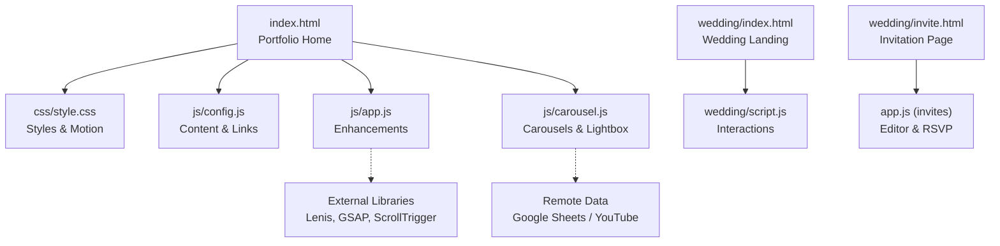
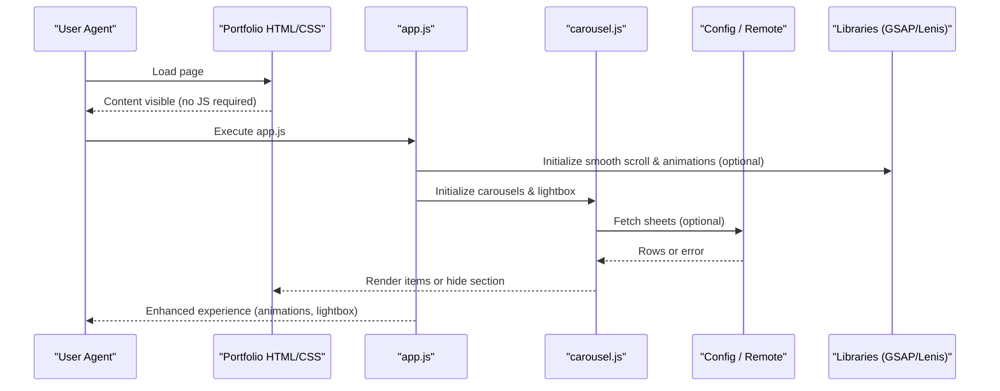
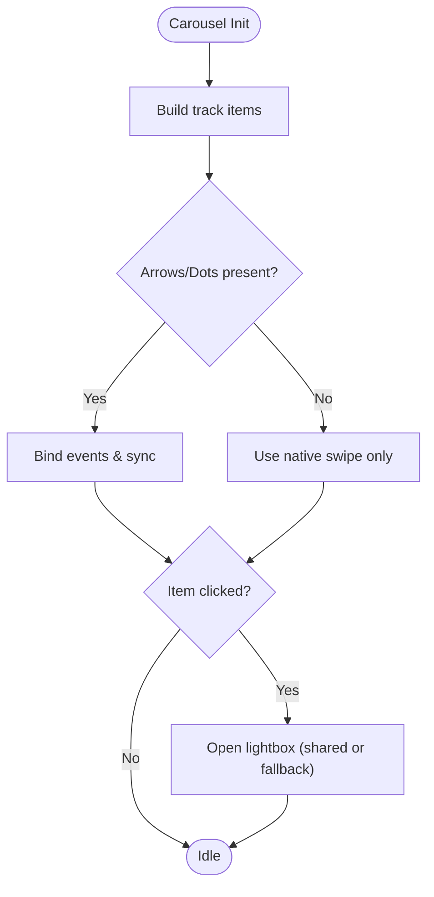
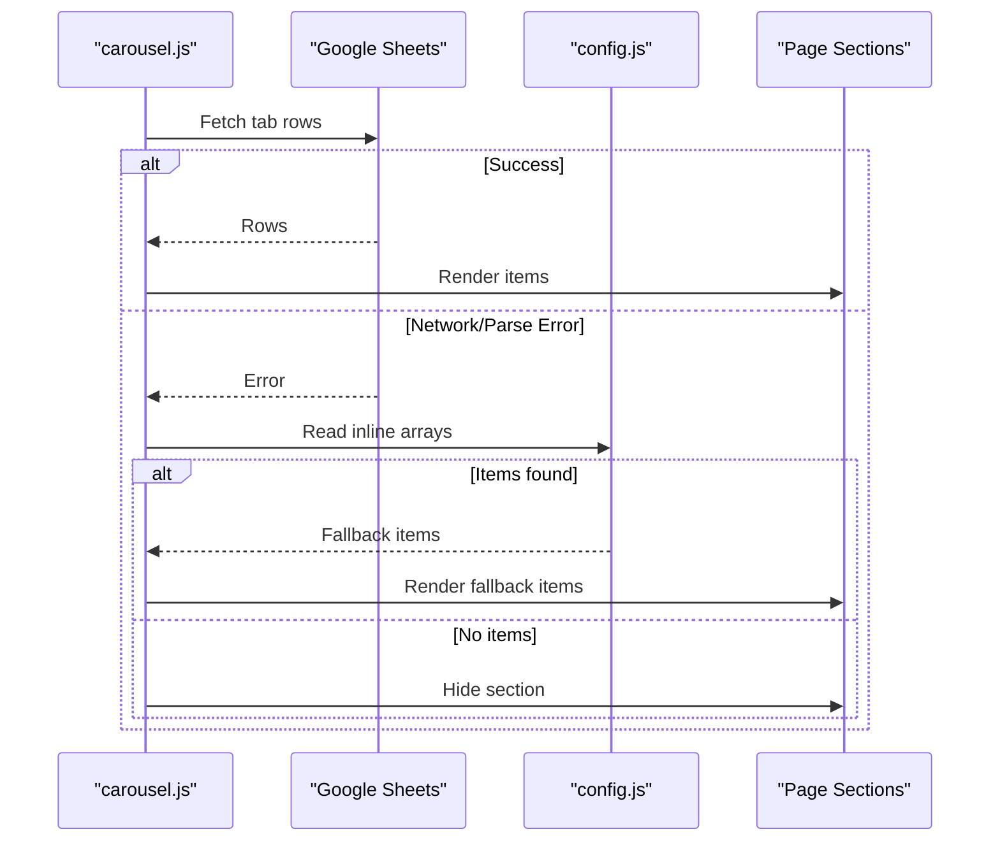
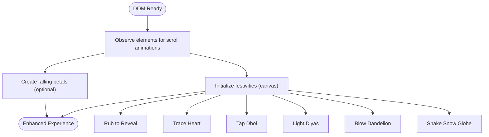
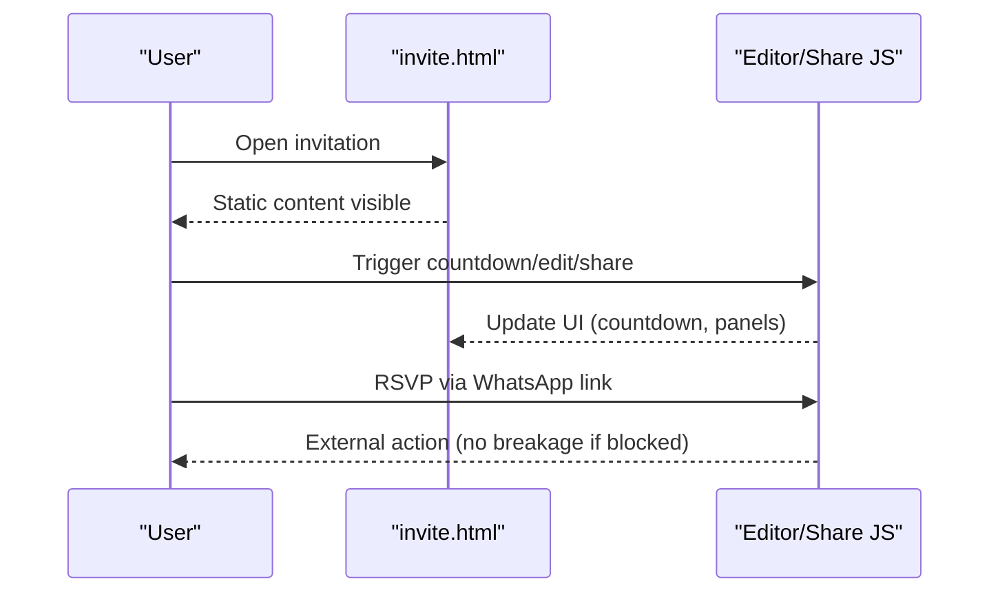
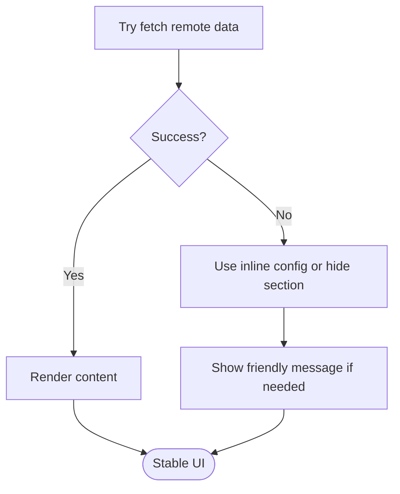
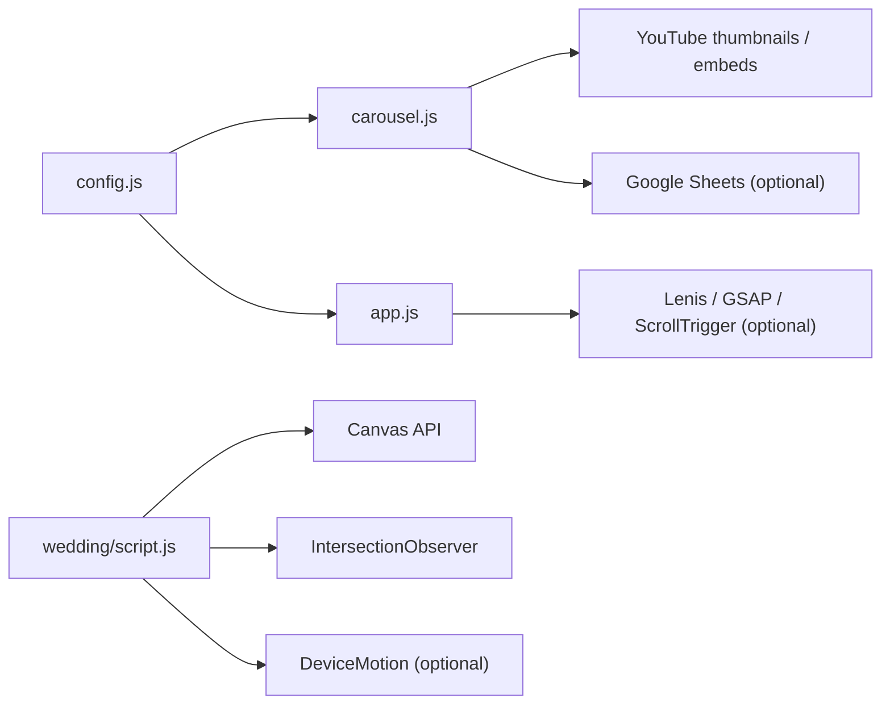

# Progressive Enhancement Strategy

<cite>
**Referenced Files in This Document**
- [index.html](file://index.html)
- [css/style.css](file://css/style.css)
- [js/app.js](file://js/app.js)
- [js/carousel.js](file://js/carousel.js)
- [js/config.js](file://js/config.js)
- [wedding/index.html](file://wedding/index.html)
- [wedding/script.js](file://wedding/script.js)
- [wedding/invite.html](file://wedding/invite.html)
- [api/_lib/http.js](file://api/_lib/http.js)
- [netlify/lib/bridge.js](file://netlify/lib/bridge.js)
</cite>

## Table of Contents
1. [Introduction](#introduction)
2. [Project Structure](#project-structure)
3. [Core Components](#core-components)
4. [Architecture Overview](#architecture-overview)
5. [Detailed Component Analysis](#detailed-component-analysis)
6. [Dependency Analysis](#dependency-analysis)
7. [Performance Considerations](#performance-considerations)
8. [Troubleshooting Guide](#troubleshooting-guide)
9. [Conclusion](#conclusion)

## Introduction
This document explains how the portfolio and wedding invitation system are built with progressive enhancement: a solid, accessible HTML-first foundation that works without JavaScript, enhanced by CSS for visual polish, and then enriched by JavaScript for interactivity, animations, and dynamic content loading. It covers graceful degradation when scripts fail or are disabled, error boundaries that prevent application failure, accessibility considerations, and SEO/performance benefits for crawlers and low-bandwidth users.

## Project Structure
The site is organized into clear layers:
- Static HTML pages define semantic structure and content (portfolio home, wedding landing, individual invitations).
- CSS provides layout, typography, responsive design, and motion-safe styles.
- JavaScript adds progressive enhancements: carousels, lightboxes, scroll animations, canvas interactions, and dynamic content from configuration or remote sources.
- Configuration centralizes content and links so behavior remains consistent across features.

**Diagram sources**
- [index.html:1-360](file://index.html#L1-L360)
- [css/style.css:1-635](file://css/style.css#L1-L635)
- [js/app.js:1-210](file://js/app.js#L1-L210)
- [js/carousel.js:1-569](file://js/carousel.js#L1-L569)
- [js/config.js:1-129](file://js/config.js#L1-L129)
- [wedding/index.html:1-786](file://wedding/index.html#L1-L786)
- [wedding/script.js:1-800](file://wedding/script.js#L1-L800)
- [wedding/invite.html:1-321](file://wedding/invite.html#L1-L321)

**Section sources**
- [index.html:1-360](file://index.html#L1-L360)
- [css/style.css:1-635](file://css/style.css#L1-L635)
- [js/app.js:1-210](file://js/app.js#L1-L210)
- [js/carousel.js:1-569](file://js/carousel.js#L1-L569)
- [js/config.js:1-129](file://js/config.js#L1-L129)
- [wedding/index.html:1-786](file://wedding/index.html#L1-L786)
- [wedding/script.js:1-800](file://wedding/script.js#L1-L800)
- [wedding/invite.html:1-321](file://wedding/invite.html#L1-L321)

## Core Components
- Portfolio home page: Semantic sections for hero, galleries, services, contact; CSS-only carousels and lightbox containers; JS enhances with smooth scrolling, scroll-triggered reveals, lightbox, marquee, and dynamic video loading.
- Wedding landing page: Static sections with interactive “festivities” implemented via canvas and DOM events; JS progressively enhances with scroll animations, background petals, and demo modal.
- Invitation page: Fully functional static invitation with tap-to-open cover, gallery placeholders, event details, venue, RSVP link; JS enhances with countdown, editor panel, share sheet, and ceremony interactions.

Key progressive enhancement patterns:
- HTML-first: All content and navigation exist as semantic markup; images have alt text; buttons and links are usable without JS.
- CSS-only fallbacks: Carousels use native scroll-snap; lightbox container exists but JS opens it; reduced-motion media queries disable heavy animations.
- JS enhancements: Optional libraries (Lenis, GSAP) are loaded conditionally; features degrade gracefully if unavailable.
- Dynamic content: Carousels fetch data from Google Sheets with robust fallbacks to inline config; errors are caught and sections hidden or replaced with friendly messages.

**Section sources**
- [index.html:95-218](file://index.html#L95-L218)
- [css/style.css:170-186](file://css/style.css#L170-L186)
- [css/style.css:421-477](file://css/style.css#L421-L477)
- [js/app.js:44-93](file://js/app.js#L44-L93)
- [js/carousel.js:213-322](file://js/carousel.js#L213-L322)
- [wedding/index.html:161-339](file://wedding/index.html#L161-L339)
- [wedding/script.js:20-45](file://wedding/script.js#L20-L45)
- [wedding/invite.html:23-57](file://wedding/invite.html#L23-L57)

## Architecture Overview
The architecture separates concerns to ensure resilience:
- Presentation layer (HTML/CSS) guarantees baseline usability.
- Enhancement layer (JS) adds interactivity and performance optimizations where supported.
- Data layer (config + optional remote sources) supplies content with safe fallbacks.
- Error boundaries at UI and API layers prevent cascading failures.

**Diagram sources**
- [index.html:352-359](file://index.html#L352-L359)
- [js/app.js:44-93](file://js/app.js#L44-L93)
- [js/carousel.js:151-205](file://js/carousel.js#L151-L205)
- [js/config.js:20-129](file://js/config.js#L20-L129)

## Detailed Component Analysis

### Portfolio Carousel and Lightbox
- Native scroll-snap carousels provide accessible horizontal rails with keyboard and touch support.
- JS enhances with arrow/dot controls, active state sync, and click-to-open lightbox.
- If external libraries are missing, core carousel still functions; lightbox falls back to a minimal implementation.

**Diagram sources**
- [js/carousel.js:213-322](file://js/carousel.js#L213-L322)
- [js/carousel.js:324-334](file://js/carousel.js#L324-L334)
- [js/app.js:146-188](file://js/app.js#L146-L188)

**Section sources**
- [js/carousel.js:213-322](file://js/carousel.js#L213-L322)
- [js/carousel.js:324-334](file://js/carousel.js#L324-L334)
- [js/app.js:146-188](file://js/app.js#L146-L188)

### Dynamic Content Loading and Graceful Degradation
- Carousels attempt to load videos from Google Sheets; on failure, they fall back to inline arrays in config.
- If no content is available, sections are hidden rather than showing incorrect work.
- Errors are logged and user-facing messages are shown where appropriate.

**Diagram sources**
- [js/carousel.js:151-205](file://js/carousel.js#L151-L205)
- [js/carousel.js:351-383](file://js/carousel.js#L351-L383)
- [js/carousel.js:385-423](file://js/carousel.js#L385-L423)
- [js/config.js:63-89](file://js/config.js#L63-L89)

**Section sources**
- [js/carousel.js:151-205](file://js/carousel.js#L151-L205)
- [js/carousel.js:351-383](file://js/carousel.js#L351-L383)
- [js/carousel.js:385-423](file://js/carousel.js#L385-L423)
- [js/config.js:63-89](file://js/config.js#L63-L89)

### Wedding Landing Interactions
- Canvas-based interactions (rub to reveal, trace heart, dhol taps, diya lighting, dandelion blow, snow globe) enhance engagement.
- Scroll animations and background petals add atmosphere; all are optional and do not block content.
- Demo modal demonstrates the full invitation flow; interactions initialize lazily to avoid unnecessary work.

**Diagram sources**
- [wedding/script.js:20-45](file://wedding/script.js#L20-L45)
- [wedding/script.js:47-87](file://wedding/script.js#L47-L87)
- [wedding/script.js:102-218](file://wedding/script.js#L102-L218)
- [wedding/script.js:220-347](file://wedding/script.js#L220-L347)
- [wedding/script.js:349-438](file://wedding/script.js#L349-L438)
- [wedding/script.js:440-576](file://wedding/script.js#L440-L576)
- [wedding/script.js:578-706](file://wedding/script.js#L578-L706)

**Section sources**
- [wedding/index.html:161-339](file://wedding/index.html#L161-L339)
- [wedding/script.js:20-45](file://wedding/script.js#L20-L45)
- [wedding/script.js:47-87](file://wedding/script.js#L47-L87)
- [wedding/script.js:102-218](file://wedding/script.js#L102-L218)
- [wedding/script.js:220-347](file://wedding/script.js#L220-L347)
- [wedding/script.js:349-438](file://wedding/script.js#L349-L438)
- [wedding/script.js:440-576](file://wedding/script.js#L440-L576)
- [wedding/script.js:578-706](file://wedding/script.js#L578-L706)

### Invitation Page Enhancements
- Static invitation includes cover doors, hero poster, families, gallery placeholders, festivities, story, venue, RSVP link, and footer — all usable without JS.
- JS enhances with countdown timer, festival modals, editor panel, share sheet, and AI prompt generator modal.
- Graceful states include an expired screen after the wedding date and private indicators when live URLs are absent.

**Diagram sources**
- [wedding/invite.html:23-57](file://wedding/invite.html#L23-L57)
- [wedding/invite.html:64-86](file://wedding/invite.html#L64-L86)
- [wedding/invite.html:113-140](file://wedding/invite.html#L113-L140)
- [wedding/invite.html:153-208](file://wedding/invite.html#L153-L208)
- [wedding/invite.html:212-319](file://wedding/invite.html#L212-L319)

**Section sources**
- [wedding/invite.html:23-57](file://wedding/invite.html#L23-L57)
- [wedding/invite.html:64-86](file://wedding/invite.html#L64-L86)
- [wedding/invite.html:113-140](file://wedding/invite.html#L113-L140)
- [wedding/invite.html:153-208](file://wedding/invite.html#L153-L208)
- [wedding/invite.html:212-319](file://wedding/invite.html#L212-L319)

### Error Boundaries and Resilience
- Client-side: Carousel catches network/parse errors and hides empty sections; lightbox uses shared function when available, otherwise renders a minimal overlay.
- Server-side: API returns human-readable error codes and messages; Netlify bridge wraps handlers to catch unexpected exceptions and return safe responses.

**Diagram sources**
- [js/carousel.js:351-383](file://js/carousel.js#L351-L383)
- [js/carousel.js:385-423](file://js/carousel.js#L385-L423)
- [api/_lib/http.js:52-65](file://api/_lib/http.js#L52-L65)
- [netlify/lib/bridge.js:96-125](file://netlify/lib/bridge.js#L96-L125)

**Section sources**
- [js/carousel.js:351-383](file://js/carousel.js#L351-L383)
- [js/carousel.js:385-423](file://js/carousel.js#L385-L423)
- [api/_lib/http.js:52-65](file://api/_lib/http.js#L52-L65)
- [netlify/lib/bridge.js:96-125](file://netlify/lib/bridge.js#L96-L125)

## Dependency Analysis
- External libraries (Lenis, GSAP, ScrollTrigger) are loaded via CDN and used conditionally; core functionality does not depend on them.
- Config drives content and links; carousels prefer remote data but fall back to inline arrays.
- Wedding interactions rely on standard APIs (Canvas, IntersectionObserver, DeviceMotion) with feature checks and graceful fallbacks.

**Diagram sources**
- [js/config.js:20-129](file://js/config.js#L20-L129)
- [js/carousel.js:151-205](file://js/carousel.js#L151-L205)
- [js/app.js:44-93](file://js/app.js#L44-L93)
- [wedding/script.js:20-45](file://wedding/script.js#L20-L45)
- [wedding/script.js:440-576](file://wedding/script.js#L440-L576)
- [wedding/script.js:578-706](file://wedding/script.js#L578-L706)

**Section sources**
- [js/config.js:20-129](file://js/config.js#L20-L129)
- [js/carousel.js:151-205](file://js/carousel.js#L151-L205)
- [js/app.js:44-93](file://js/app.js#L44-L93)
- [wedding/script.js:20-45](file://wedding/script.js#L20-L45)
- [wedding/script.js:440-576](file://wedding/script.js#L440-L576)
- [wedding/script.js:578-706](file://wedding/script.js#L578-L706)

## Performance Considerations
- HTML-first ensures fast first paint and crawlability; content is immediately available.
- CSS-only carousels and lightbox containers reduce JS overhead; animations respect reduced-motion preferences.
- Lazy loading of images and conditional library initialization improve performance on low-end devices.
- Remote data fetching is isolated per section; failures do not block other sections.

[No sources needed since this section provides general guidance]

## Troubleshooting Guide
Common issues and resolutions:
- Carousels empty: Check Google Sheet availability; verify inline arrays in config; inspect console for parse errors.
- Animations not playing: Ensure GSAP/ScrollTrigger loaded; check reduced-motion settings; confirm elements exist before init.
- Invitation countdown/editor not working: Verify script execution order; check for blocked third-party resources; confirm DOM IDs match selectors.
- API errors: Use human-readable messages from server; retry only when marked recoverable; guide users to retry or contact support.

**Section sources**
- [js/carousel.js:351-383](file://js/carousel.js#L351-L383)
- [js/app.js:44-93](file://js/app.js#L44-L93)
- [wedding/invite.html:212-319](file://wedding/invite.html#L212-L319)
- [api/_lib/http.js:52-65](file://api/_lib/http.js#L52-L65)
- [netlify/lib/bridge.js:96-125](file://netlify/lib/bridge.js#L96-L125)

## Conclusion
The project implements a robust progressive enhancement strategy:
- Semantic HTML and CSS deliver a fully functional experience without JavaScript.
- JavaScript enhances interactivity, animations, and dynamic content while respecting user preferences and environment constraints.
- Graceful degradation and error boundaries maintain usability under failure conditions.
- Accessibility and SEO benefit from clean markup, meaningful metadata, and reliable content delivery.
- Performance is optimized through lazy loading, conditional dependencies, and motion-aware rendering.

[No sources needed since this section summarizes without analyzing specific files]