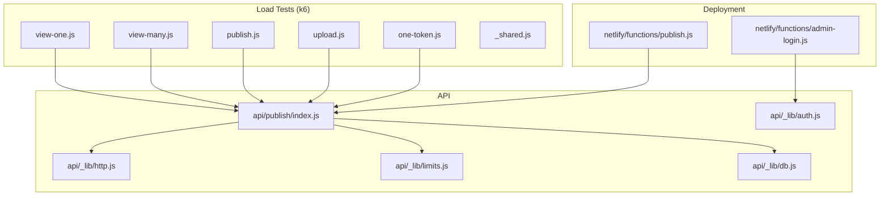
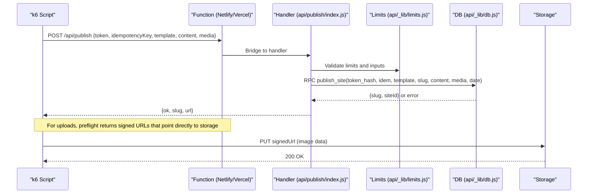
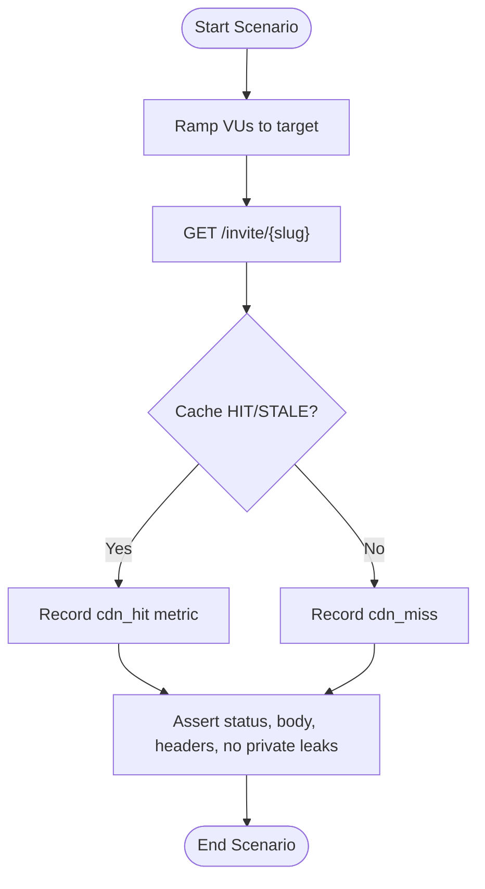
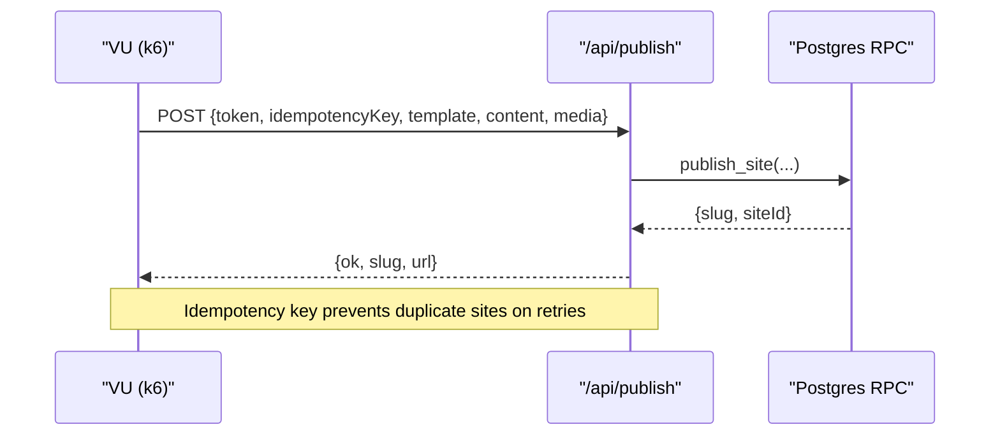
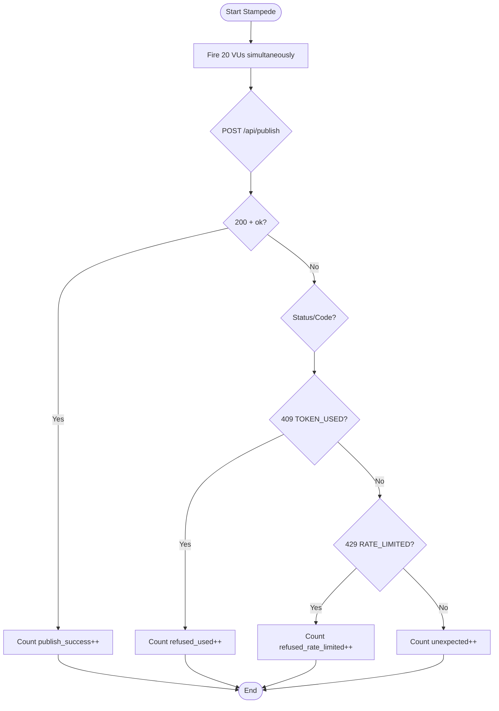
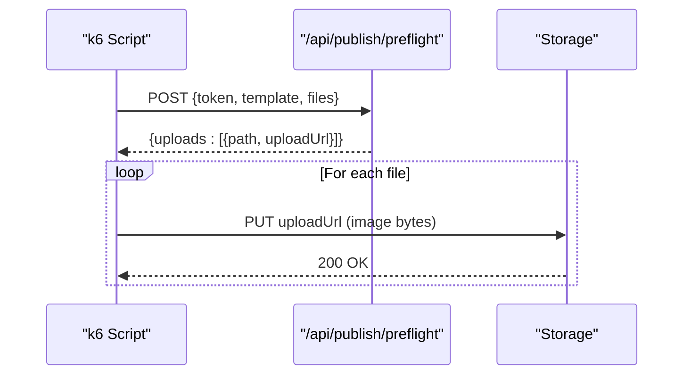
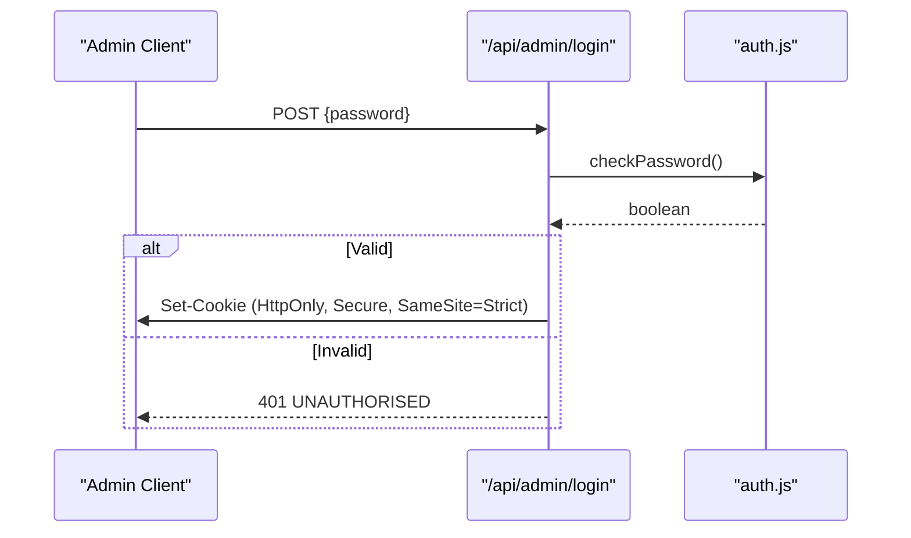
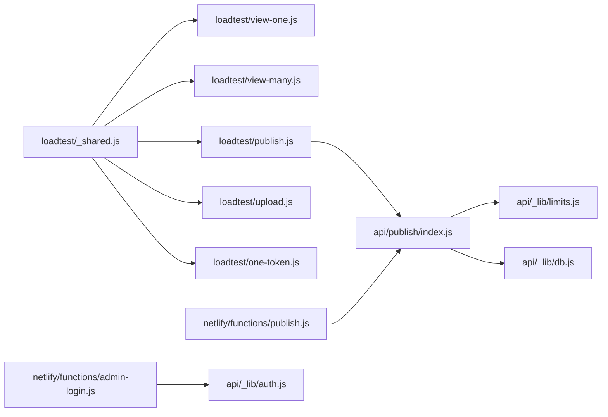

# Load Testing & Performance Monitoring

<cite>
**Referenced Files in This Document**
- [loadtest/README.md](file://loadtest/README.md)
- [loadtest/_shared.js](file://loadtest/_shared.js)
- [loadtest/view-one.js](file://loadtest/view-one.js)
- [loadtest/view-many.js](file://loadtest/view-many.js)
- [loadtest/publish.js](file://loadtest/publish.js)
- [loadtest/upload.js](file://loadtest/upload.js)
- [loadtest/one-token.js](file://loadtest/one-token.js)
- [api/publish/index.js](file://api/publish/index.js)
- [api/_lib/auth.js](file://api/_lib/auth.js)
- [api/_lib/db.js](file://api/_lib/db.js)
- [api/_lib/http.js](file://api/_lib/http.js)
- [api/_lib/limits.js](file://api/_lib/limits.js)
- [shared/limits.js](file://shared/limits.js)
- [netlify/functions/publish.js](file://netlify/functions/publish.js)
- [netlify/functions/admin-login.js](file://netlify/functions/admin-login.js)
- [netlify/README.md](file://netlify/README.md)
- [_weight.js](file://_weight.js)
- [_routecheck.js](file://_routecheck.js)
</cite>

## Table of Contents
1. [Introduction](#introduction)
2. [Project Structure](#project-structure)
3. [Core Components](#core-components)
4. [Architecture Overview](#architecture-overview)
5. [Detailed Component Analysis](#detailed-component-analysis)
6. [Dependency Analysis](#dependency-analysis)
7. [Performance Considerations](#performance-considerations)
8. [Troubleshooting Guide](#troubleshooting-guide)
9. [Conclusion](#conclusion)
10. [Appendices](#appendices)

## Introduction
This document explains the load testing and performance monitoring approach implemented for the DeepDreams system. It covers:
- Load testing methodology using k6 scripts to simulate concurrent users, stress critical endpoints, and analyze database query impact.
- Smoke testing procedures for authentication, content publishing, and admin operations.
- Performance monitoring strategies including CDN cache behavior, server-side response time measurement, and error rate monitoring.
- Examples of load test scenarios for video gallery loading, 3D world initialization, and admin dashboard operations.
- Continuous performance testing guidance for CI/CD pipelines, alerting thresholds, and regression detection.
- Interpretation of metrics and techniques to identify bottlenecks.

## Project Structure
The load testing suite is organized under a dedicated directory with shared utilities and scenario-specific scripts. The backend exposes API endpoints that are exercised by these tests. Deployment wrappers bridge requests into the Node handlers on Netlify or Vercel. Additional scripts measure client-side weight and route health.

**Diagram sources**
- [loadtest/view-one.js:1-57](file://loadtest/view-one.js#L1-L57)
- [loadtest/view-many.js:1-61](file://loadtest/view-many.js#L1-L61)
- [loadtest/publish.js:1-86](file://loadtest/publish.js#L1-L86)
- [loadtest/upload.js:1-130](file://loadtest/upload.js#L1-L130)
- [loadtest/one-token.js:1-131](file://loadtest/one-token.js#L1-L131)
- [loadtest/_shared.js:1-51](file://loadtest/_shared.js#L1-L51)
- [api/publish/index.js:1-135](file://api/publish/index.js#L1-L135)
- [api/_lib/http.js:52-65](file://api/_lib/http.js#L52-L65)
- [api/_lib/limits.js:1-31](file://api/_lib/limits.js#L1-L31)
- [api/_lib/db.js:1-265](file://api/_lib/db.js#L1-L265)
- [api/_lib/auth.js:1-124](file://api/_lib/auth.js#L1-L124)
- [netlify/functions/publish.js:1-7](file://netlify/functions/publish.js#L1-L7)
- [netlify/functions/admin-login.js:1-7](file://netlify/functions/admin-login.js#L1-L7)

**Section sources**
- [loadtest/README.md:1-83](file://loadtest/README.md#L1-L83)
- [netlify/README.md:1-140](file://netlify/README.md#L1-L140)

## Core Components
- Load test harness:
  - Shared configuration and safety checks prevent accidental runs against production.
  - Scenario-specific scripts target specific claims about behavior under load.
- Publishing endpoint:
  - Enforces idempotency, token consumption, slug uniqueness, and media scoping.
- Database layer:
  - Centralized PostgREST calls with timeouts and structured error mapping.
- Admin authentication:
  - HMAC-signed session cookie with strict security flags.
- Limits and rate control:
  - Server-side enforcement of request sizes, rates, and payload constraints.

**Section sources**
- [loadtest/_shared.js:1-51](file://loadtest/_shared.js#L1-L51)
- [api/publish/index.js:1-135](file://api/publish/index.js#L1-L135)
- [api/_lib/db.js:1-265](file://api/_lib/db.js#L1-L265)
- [api/_lib/auth.js:1-124](file://api/_lib/auth.js#L1-L124)
- [api/_lib/limits.js:1-31](file://api/_lib/limits.js#L1-L31)
- [shared/limits.js:1-83](file://shared/limits.js#L1-L83)

## Architecture Overview
The load tests exercise the public invitation view and the publish flow. Viewing flows rely on CDN caching to minimize database hits; publishing flows consume activation tokens and create unique slugs. Uploads use signed URLs directly to storage, bypassing function payloads.

**Diagram sources**
- [loadtest/publish.js:1-86](file://loadtest/publish.js#L1-L86)
- [loadtest/upload.js:1-130](file://loadtest/upload.js#L1-L130)
- [api/publish/index.js:1-135](file://api/publish/index.js#L1-L135)
- [api/_lib/limits.js:1-31](file://api/_lib/limits.js#L1-L31)
- [api/_lib/db.js:1-265](file://api/_lib/db.js#L1-L265)
- [netlify/functions/publish.js:1-7](file://netlify/functions/publish.js#L1-L7)

## Detailed Component Analysis

### Invitation View Load Tests
- view-one.js simulates a spike when a single invitation link is forwarded to many guests. It asserts zero errors, p95 latency below a threshold, and a high CDN hit rate to ensure the database sees minimal traffic.
- view-many.js simulates worst-case cache misses across many distinct invitations. It asserts zero errors and a higher p95 threshold appropriate for per-invitation queries.

**Diagram sources**
- [loadtest/view-one.js:1-57](file://loadtest/view-one.js#L1-L57)
- [loadtest/view-many.js:1-61](file://loadtest/view-many.js#L1-L61)

**Section sources**
- [loadtest/view-one.js:1-57](file://loadtest/view-one.js#L1-L57)
- [loadtest/view-many.js:1-61](file://loadtest/view-many.js#L1-L61)
- [loadtest/README.md:19-31](file://loadtest/README.md#L19-L31)

### Publish Stress Test
- publish.js drives multiple concurrent publishers, each with a unique activation code. It ensures every request succeeds, returns a valid invite URL, and never leaks sensitive fields. It also records a custom metric to count successful publishes.

**Diagram sources**
- [loadtest/publish.js:1-86](file://loadtest/publish.js#L1-L86)
- [api/publish/index.js:1-135](file://api/publish/index.js#L1-L135)

**Section sources**
- [loadtest/publish.js:1-86](file://loadtest/publish.js#L1-L86)
- [api/publish/index.js:1-135](file://api/publish/index.js#L1-L135)

### One-Token Stampede Test
- one-token.js sends simultaneous attempts with a single activation code. Exactly one success is expected; all others must be clean refusals (used or rate-limited). It validates refusal messages and absence of stack traces or secret leakage.

**Diagram sources**
- [loadtest/one-token.js:1-131](file://loadtest/one-token.js#L1-L131)
- [api/publish/index.js:1-135](file://api/publish/index.js#L1-L135)

**Section sources**
- [loadtest/one-token.js:1-131](file://loadtest/one-token.js#L1-L131)

### Upload Throughput Test
- upload.js performs concurrent uploads via signed URLs returned by preflight. It verifies that all uploads succeed and that no image bytes traverse a function. It also validates that signed URLs point to storage paths scoped to the customer’s draft folder.

**Diagram sources**
- [loadtest/upload.js:1-130](file://loadtest/upload.js#L1-L130)

**Section sources**
- [loadtest/upload.js:1-130](file://loadtest/upload.js#L1-L130)

### Admin Authentication Smoke Test
- The admin login flow issues an HMAC-signed session cookie with secure flags. Smoke assertions verify unauthorized access is rejected, password comparison occurs server-side, and cookies cannot be read by client scripts.

**Diagram sources**
- [api/_lib/auth.js:1-124](file://api/_lib/auth.js#L1-L124)
- [netlify/functions/admin-login.js:1-7](file://netlify/functions/admin-login.js#L1-L7)

**Section sources**
- [api/_lib/auth.js:1-124](file://api/_lib/auth.js#L1-L124)
- [netlify/functions/admin-login.js:1-7](file://netlify/functions/admin-login.js#L1-L7)

### Conceptual Overview
- Video gallery loading: Use view-one.js to simulate many guests opening the same invitation with photos; monitor CDN hit rate and p95 latency to ensure images are served from cache and not hitting the database.
- 3D world initialization: Use _weight.js to measure first paint and full scroll weights for the 3D world route; track third-party resource size and identify heavy assets.
- Admin dashboard operations: Use admin smoke tests to validate login, token minting, listing, and status changes without leaking secrets.

[No sources needed since this section doesn't analyze specific files]

## Dependency Analysis
The load tests depend on environment variables and shared utilities. The publish flow depends on validation, token handling, and database RPCs. Deployment bridges connect functions to handlers.

**Diagram sources**
- [loadtest/_shared.js:1-51](file://loadtest/_shared.js#L1-L51)
- [loadtest/view-one.js:1-57](file://loadtest/view-one.js#L1-L57)
- [loadtest/view-many.js:1-61](file://loadtest/view-many.js#L1-L61)
- [loadtest/publish.js:1-86](file://loadtest/publish.js#L1-L86)
- [loadtest/upload.js:1-130](file://loadtest/upload.js#L1-L130)
- [loadtest/one-token.js:1-131](file://loadtest/one-token.js#L1-L131)
- [api/publish/index.js:1-135](file://api/publish/index.js#L1-L135)
- [api/_lib/limits.js:1-31](file://api/_lib/limits.js#L1-L31)
- [api/_lib/db.js:1-265](file://api/_lib/db.js#L1-L265)
- [api/_lib/auth.js:1-124](file://api/_lib/auth.js#L1-L124)
- [netlify/functions/publish.js:1-7](file://netlify/functions/publish.js#L1-L7)
- [netlify/functions/admin-login.js:1-7](file://netlify/functions/admin-login.js#L1-L7)

**Section sources**
- [loadtest/_shared.js:1-51](file://loadtest/_shared.js#L1-L51)
- [api/publish/index.js:1-135](file://api/publish/index.js#L1-L135)
- [api/_lib/db.js:1-265](file://api/_lib/db.js#L1-L265)
- [api/_lib/auth.js:1-124](file://api/_lib/auth.js#L1-L124)
- [netlify/functions/publish.js:1-7](file://netlify/functions/publish.js#L1-L7)
- [netlify/functions/admin-login.js:1-7](file://netlify/functions/admin-login.js#L1-L7)

## Performance Considerations
- CDN caching is central to scalability for invitation views. The viewing tests emphasize cache-hit rates and p95 latency thresholds to ensure free-tier viability.
- Uploads bypass function payloads entirely by using signed URLs to storage, avoiding size and duration limits.
- Database interactions are bounded by timeouts and structured error codes to avoid hanging functions.
- Client-side weight measurement helps identify heavy assets impacting first paint and full journey budgets.

[No sources needed since this section provides general guidance]

## Troubleshooting Guide
- Environment setup:
  - Ensure BASE_URL points to staging and never production unless explicitly overridden.
  - Provide SLUGS for viewing tests and CODES for publish/upload/one-token tests.
- Common failures:
  - Low CDN hit rate indicates caching misconfiguration; review cache-control headers and edge behavior.
  - High p95 latency in view-many suggests database connection pool saturation; tune pooling or increase cache effectiveness.
  - Upload path pointing back to the site indicates signed URL misconfiguration; fix storage permissions.
  - Token stampede shows too many rate-limited responses; run from multiple machines or adjust temporary limits.
- Error interpretation:
  - Use standardized error codes and messages to guide user actions and retries.
  - Confirm no secrets leak in responses or logs.

**Section sources**
- [loadtest/_shared.js:1-51](file://loadtest/_shared.js#L1-L51)
- [loadtest/view-one.js:1-57](file://loadtest/view-one.js#L1-L57)
- [loadtest/view-many.js:1-61](file://loadtest/view-many.js#L1-L61)
- [loadtest/upload.js:1-130](file://loadtest/upload.js#L1-L130)
- [loadtest/one-token.js:1-131](file://loadtest/one-token.js#L1-L131)
- [api/_lib/http.js:52-65](file://api/_lib/http.js#L52-L65)

## Conclusion
The DeepDreams system uses targeted k6 load tests to validate critical performance claims: invitation views should be largely served from cache, publishing must enforce one-code-one-website semantics under concurrency, and uploads must bypass function payloads. Complementary client-side weight and route checks help maintain fast initial loads and healthy pages. Together, these practices provide confidence that the system scales within free-tier constraints and remains robust under real-world wedding-day traffic patterns.

[No sources needed since this section summarizes without analyzing specific files]

## Appendices

### CI/CD Integration Guidance
- Run load tests against a staging deployment with isolated Supabase project and environment variables.
- Gate merges on thresholds:
  - Zero error rate for viewing and publishing tests.
  - p95 latency thresholds per scenario.
  - CDN hit rate thresholds for single-invitation spikes.
  - Zero uploads through functions.
- Alerting:
  - Track egress usage and function call counts after runs.
  - Monitor Supabase reports for anomalies post-run.

**Section sources**
- [loadtest/README.md:7-17](file://loadtest/README.md#L7-L17)
- [loadtest/README.md:54-83](file://loadtest/README.md#L54-L83)

### Interpreting Metrics and Identifying Bottlenecks
- Invitation views:
  - Primary metric: CDN hit rate; low rates indicate cache misses driving database load.
  - Secondary metric: p95 latency; drift above thresholds signals backend pressure.
- Publishing:
  - Success rate and uniqueness of slugs; duplicates indicate race conditions.
  - Refusal breakdown: used vs rate-limited vs unexpected.
- Uploads:
  - All uploads must succeed; any through-function count > 0 is a failure.
- Client-side:
  - First paint and full scroll weights highlight heavy assets or third-party dependencies.

**Section sources**
- [loadtest/view-one.js:1-57](file://loadtest/view-one.js#L1-L57)
- [loadtest/view-many.js:1-61](file://loadtest/view-many.js#L1-L61)
- [loadtest/publish.js:1-86](file://loadtest/publish.js#L1-L86)
- [loadtest/one-token.js:1-131](file://loadtest/one-token.js#L1-L131)
- [loadtest/upload.js:1-130](file://loadtest/upload.js#L1-L130)
- [_weight.js:1-48](file://_weight.js#L1-L48)