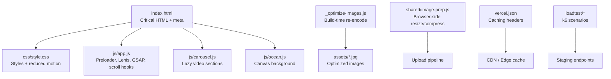
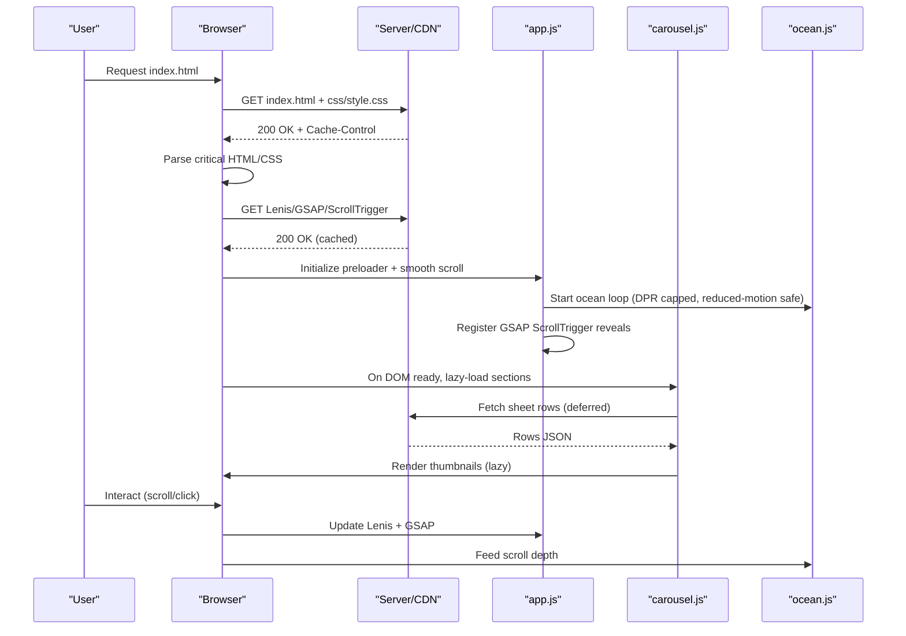
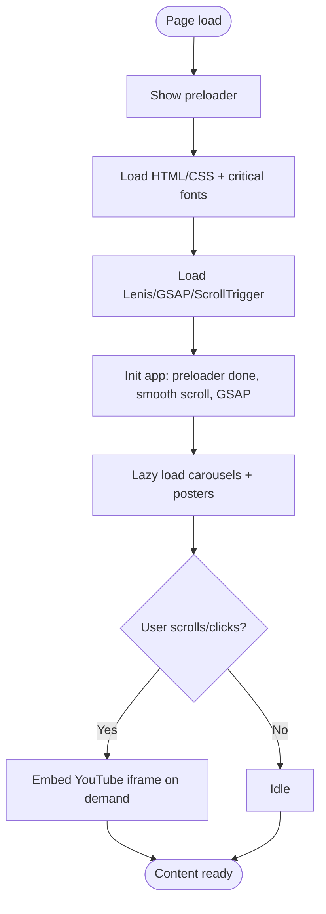
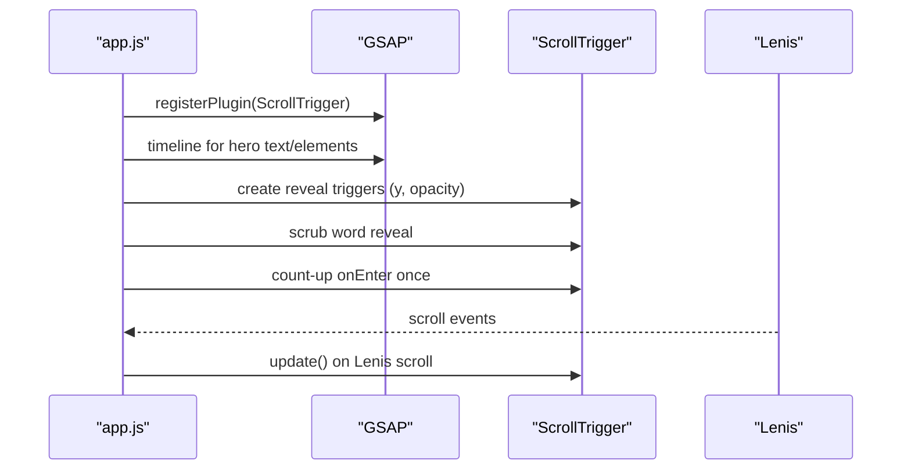
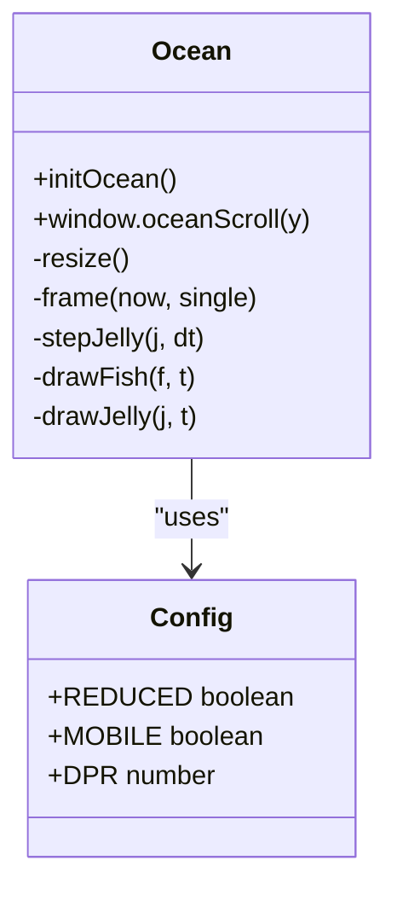
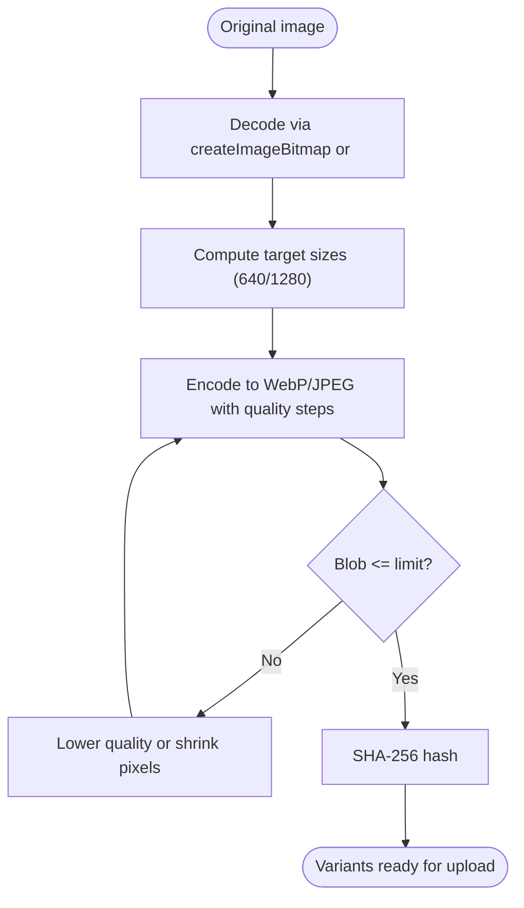
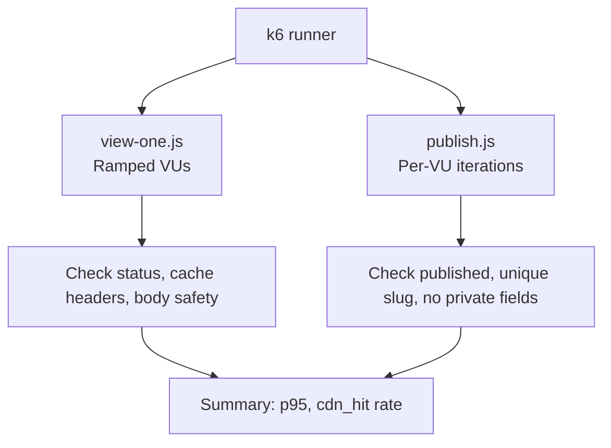
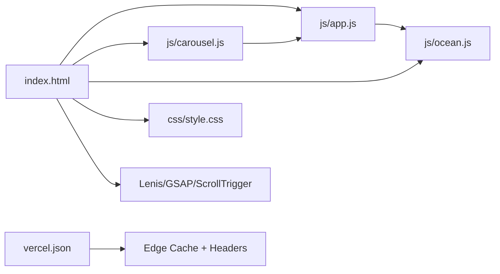

# Performance & Optimization

<cite>
**Referenced Files in This Document**
- [index.html](file://index.html)
- [js/app.js](file://js/app.js)
- [js/carousel.js](file://js/carousel.js)
- [js/ocean.js](file://js/ocean.js)
- [css/style.css](file://css/style.css)
- [_optimize-images.js](file://_optimize-images.js)
- [shared/image-prep.js](file://shared/image-prep.js)
- [loadtest/README.md](file://loadtest/README.md)
- [loadtest/view-one.js](file://loadtest/view-one.js)
- [loadtest/publish.js](file://loadtest/publish.js)
- [manifest.json](file://manifest.json)
- [vercel.json](file://vercel.json)
</cite>

## Table of Contents
1. [Introduction](#introduction)
2. [Project Structure](#project-structure)
3. [Core Components](#core-components)
4. [Architecture Overview](#architecture-overview)
5. [Detailed Component Analysis](#detailed-component-analysis)
6. [Dependency Analysis](#dependency-analysis)
7. [Performance Considerations](#performance-considerations)
8. [Troubleshooting Guide](#troubleshooting-guide)
9. [Conclusion](#conclusion)
10. [Appendices](#appendices)

## Introduction
This document explains the performance optimization strategies implemented across the DeepDreams portfolio system. It covers loading strategies (lazy loading, progressive enhancement, resource prioritization), image and asset optimization, animation tuning with GSAP and ScrollTrigger, mobile considerations, memory management, load testing methodologies, monitoring approaches, browser compatibility, network optimization, and caching strategies. Concrete examples are referenced via file paths to keep this guide actionable without embedding code.

## Project Structure
The site is a client-first static site enhanced by lightweight JavaScript modules:
- HTML shell defines critical resources early and defers heavy work.
- CSS provides responsive layout, reduced-motion support, and minimal runtime cost.
- JS modules handle animations, carousels, and an interactive canvas background.
- Build-time and runtime image processing pipelines optimize assets before upload or delivery.
- Load tests validate behavior under realistic traffic patterns.

**Diagram sources**
- [index.html:1-362](file://index.html#L1-L362)
- [css/style.css:1-635](file://css/style.css#L1-L635)
- [js/app.js:1-210](file://js/app.js#L1-L210)
- [js/carousel.js:1-569](file://js/carousel.js#L1-L569)
- [js/ocean.js:1-642](file://js/ocean.js#L1-L642)
- [_optimize-images.js:1-51](file://_optimize-images.js#L1-L51)
- [shared/image-prep.js:1-360](file://shared/image-prep.js#L1-L360)
- [vercel.json:1-60](file://vercel.json#L1-L60)
- [loadtest/README.md:1-83](file://loadtest/README.md#L1-L83)

**Section sources**
- [index.html:1-362](file://index.html#L1-L362)
- [vercel.json:1-60](file://vercel.json#L1-L60)

## Core Components
- Preloader and progressive reveal: The preloader hides content until essential UI is ready, then fades out to avoid blocking interaction.
- Smooth scrolling and scroll-driven animations: Lenis smooth-scroll integrates with GSAP ScrollTrigger for performant reveals and scrubbing effects.
- Lazy-loaded media: Video thumbnails and carousels are created on demand; YouTube embeds are only instantiated when needed.
- Canvas background: A single full-screen canvas renders animated elements with DPR capping, reduced-motion handling, and visibility-aware loops.
- Image optimization: Build-time re-encoding reduces payload sizes; browser-side compression ensures uploads fit limits and formats adapt to device capabilities.
- Caching and CDN: Vercel headers enforce long-lived immutable caching for assets and short-lived must-revalidate for HTML.

**Section sources**
- [js/app.js:31-93](file://js/app.js#L31-L93)
- [js/carousel.js:351-463](file://js/carousel.js#L351-L463)
- [js/ocean.js:34-78](file://js/ocean.js#L34-L78)
- [_optimize-images.js:9-48](file://_optimize-images.js#L9-L48)
- [shared/image-prep.js:33-41](file://shared/image-prep.js#L33-L41)
- [vercel.json:11-35](file://vercel.json#L11-L35)

## Architecture Overview
The runtime flow emphasizes fast first paint and deferred heavy work:
- Critical HTML/CSS load immediately; fonts are preconnected.
- Third-party scripts (Lenis, GSAP, ScrollTrigger) are loaded from CDN.
- App logic initializes preloader, smooth scroll, and GSAP animations after load.
- Carousels fetch data lazily and render lightweight placeholders.
- Ocean canvas runs only when visible and adapts to device capability and user preferences.

**Diagram sources**
- [index.html:25-31](file://index.html#L25-L31)
- [index.html:352-359](file://index.html#L352-L359)
- [js/app.js:31-93](file://js/app.js#L31-L93)
- [js/carousel.js:151-205](file://js/carousel.js#L151-L205)
- [js/ocean.js:68-78](file://js/ocean.js#L68-L78)

## Detailed Component Analysis

### Loading Strategy: Lazy Loading, Progressive Enhancement, Resource Prioritization
- Preloader and body class control initial state; content is hidden until core UI is ready, then revealed smoothly.
- External libraries are loaded via CDN with versioned URLs to leverage caching.
- Fonts use preconnect hints to reduce font loading latency.
- Carousels defer fetching and rendering until DOM ready; thumbnails are lazy-loaded; videos are embedded only on interaction.
- Reduced-motion preference disables heavy animations and simplifies transitions.

**Diagram sources**
- [index.html:34-41](file://index.html#L34-L41)
- [index.html:25-31](file://index.html#L25-L31)
- [index.html:352-359](file://index.html#L352-L359)
- [js/app.js:31-93](file://js/app.js#L31-L93)
- [js/carousel.js:351-463](file://js/carousel.js#L351-L463)

**Section sources**
- [index.html:34-41](file://index.html#L34-L41)
- [index.html:25-31](file://index.html#L25-L31)
- [index.html:352-359](file://index.html#L352-L359)
- [js/app.js:31-93](file://js/app.js#L31-L93)
- [js/carousel.js:351-463](file://js/carousel.js#L351-L463)

### Animation Performance Tuning: GSAP and ScrollTrigger
- Entrance animations use GSAP timelines with staggered reveals tied to scroll triggers.
- Word-by-word statement uses scrubbing for smooth, scroll-linked opacity changes.
- Count-up stats animate only once per trigger using ScrollTrigger’s once option.
- Magnetic buttons and cursor glow are gated by hover detection to avoid unnecessary work on touch devices.
- Lenis smooth scroll integrates with ScrollTrigger updates to maintain accurate scroll positions.

**Diagram sources**
- [js/app.js:58-93](file://js/app.js#L58-L93)
- [js/app.js:95-110](file://js/app.js#L95-L110)

**Section sources**
- [js/app.js:58-93](file://js/app.js#L58-L93)
- [js/app.js:95-110](file://js/app.js#L95-L110)

### Canvas Background: Ocean Scene
- Single full-screen canvas with DPR capped to 1.5 to balance quality and GPU usage.
- Mobile-specific reductions: fewer rays, fish, snow particles, and jellyfish.
- Time-stepped physics decoupled from frame rate; paused when tab hidden.
- Scroll drives depth and parallax; gentle easing avoids jank.
- Reduced-motion mode keeps a calm, static-feeling scene rather than disabling visuals entirely.

**Diagram sources**
- [js/ocean.js:27-78](file://js/ocean.js#L27-L78)
- [js/ocean.js:104-141](file://js/ocean.js#L104-L141)
- [js/ocean.js:241-298](file://js/ocean.js#L241-L298)
- [js/ocean.js:419-445](file://js/ocean.js#L419-L445)
- [js/ocean.js:619-632](file://js/ocean.js#L619-L632)

**Section sources**
- [js/ocean.js:27-78](file://js/ocean.js#L27-L78)
- [js/ocean.js:104-141](file://js/ocean.js#L104-L141)
- [js/ocean.js:241-298](file://js/ocean.js#L241-L298)
- [js/ocean.js:419-445](file://js/ocean.js#L419-L445)
- [js/ocean.js:619-632](file://js/ocean.js#L619-L632)

### Image and Asset Optimization
- Build-time re-encoding: Uses headless Chrome to downscale and re-encode JPEGs with target widths and quality thresholds, skipping if no gain.
- Browser-side preparation: For uploaded photos, scales to multiple widths, encodes to WebP where supported or JPEG fallback, steps down quality to meet size caps, discards EXIF, and computes SHA-256 for deduplication and resumable uploads.
- Limits enforced: Max photo bytes, total media bytes, max source size, and edge constraints prevent oversized payloads.

**Diagram sources**
- [_optimize-images.js:9-48](file://_optimize-images.js#L9-L48)
- [shared/image-prep.js:43-78](file://shared/image-prep.js#L43-L78)
- [shared/image-prep.js:103-177](file://shared/image-prep.js#L103-L177)
- [shared/image-prep.js:179-195](file://shared/image-prep.js#L179-L195)
- [shared/image-prep.js:197-270](file://shared/image-prep.js#L197-L270)

**Section sources**
- [_optimize-images.js:9-48](file://_optimize-images.js#L9-L48)
- [shared/image-prep.js:33-41](file://shared/image-prep.js#L33-L41)
- [shared/image-prep.js:43-78](file://shared/image-prep.js#L43-L78)
- [shared/image-prep.js:103-177](file://shared/image-prep.js#L103-L177)
- [shared/image-prep.js:179-195](file://shared/image-prep.js#L179-L195)
- [shared/image-prep.js:197-270](file://shared/image-prep.js#L197-L270)

### Mobile Device Considerations
- Reduced motion: Animations and transitions are disabled when prefers-reduced-motion is set.
- Touch-friendly interactions: Magnetic effects and cursor glow are gated by hover detection; carousels rely on native scroll-snap for smooth touch gestures.
- Canvas optimizations: Fewer particles and lower DPR on mobile; visibility change pauses the loop when tab hidden.
- PWA manifest: Defines icons and theme colors for standalone display on mobile.

**Section sources**
- [css/style.css:314-316](file://css/style.css#L314-L316)
- [js/app.js:126-141](file://js/app.js#L126-L141)
- [js/carousel.js:213-322](file://js/carousel.js#L213-L322)
- [js/ocean.js:34-38](file://js/ocean.js#L34-L38)
- [js/ocean.js:619-632](file://js/ocean.js#L619-L632)
- [manifest.json:1-25](file://manifest.json#L1-L25)

### Memory Management Strategies
- Sequential encoding: Photo variants are processed sequentially to avoid concurrent canvas allocations that can exhaust memory on mid-range devices.
- Blob and bitmap cleanup: Encoded blobs are handled carefully; decoded bitmaps are closed when possible.
- Visibility-aware loops: Canvas animation loop pauses when the tab is hidden to free CPU and memory.
- Lazy instantiation: YouTube iframes and heavy DOM nodes are created only on user interaction.

**Section sources**
- [shared/image-prep.js:226-254](file://shared/image-prep.js#L226-L254)
- [shared/image-prep.js:256-268](file://shared/image-prep.js#L256-L268)
- [js/ocean.js:629-632](file://js/ocean.js#L629-L632)
- [js/carousel.js:351-463](file://js/carousel.js#L351-L463)

### Network Optimization and Caching
- CDN and edge caching: Static assets are served with long-lived immutable headers; HTML is marked public with must-revalidate to ensure fresh content while allowing caching.
- Prefetch/preconnect: Font domains are preconnected to reduce DNS/TLS overhead.
- Conditional embeds: YouTube iframes are only created when users open lightboxes, minimizing initial payload.
- Security headers: Content-Type sniffing, referrer policy, frame options, and permissions policy are set to harden responses.

**Section sources**
- [vercel.json:11-35](file://vercel.json#L11-L35)
- [vercel.json:50-57](file://vercel.json#L50-L57)
- [index.html:27-29](file://index.html#L27-L29)
- [js/app.js:146-188](file://js/app.js#L146-L188)

### Load Testing Methodologies
- k6 scenarios simulate real-world traffic:
  - view-one.js: Simulates many guests opening the same invitation to validate CDN hit rates and p95 latency.
  - publish.js: Simulates simultaneous publishes to ensure unique slugs and idempotency.
- Metrics include CDN hit rates, error rates, and latency thresholds.
- Tests run against staging environments to avoid impacting production.

**Diagram sources**
- [loadtest/view-one.js:18-56](file://loadtest/view-one.js#L18-L56)
- [loadtest/publish.js:19-86](file://loadtest/publish.js#L19-L86)
- [loadtest/README.md:19-83](file://loadtest/README.md#L19-L83)

**Section sources**
- [loadtest/README.md:19-83](file://loadtest/README.md#L19-L83)
- [loadtest/view-one.js:18-56](file://loadtest/view-one.js#L18-L56)
- [loadtest/publish.js:19-86](file://loadtest/publish.js#L19-L86)

## Dependency Analysis
- index.html depends on external libraries (Lenis, GSAP, ScrollTrigger) and local modules (config, ocean, carousel, app).
- app.js orchestrates preloader, smooth scroll, GSAP animations, and scroll hooks feeding into ocean.js.
- carousel.js lazily loads content and interacts with app.js lightbox API.
- ocean.js reads scroll depth via window.oceanScroll provided by app.js.
- vercel.json configures caching and security headers applied at the edge.

**Diagram sources**
- [index.html:352-359](file://index.html#L352-L359)
- [js/app.js:95-110](file://js/app.js#L95-L110)
- [js/carousel.js:324-334](file://js/carousel.js#L324-L334)
- [vercel.json:11-35](file://vercel.json#L11-L35)

**Section sources**
- [index.html:352-359](file://index.html#L352-L359)
- [js/app.js:95-110](file://js/app.js#L95-L110)
- [js/carousel.js:324-334](file://js/carousel.js#L324-L334)
- [vercel.json:11-35](file://vercel.json#L11-L35)

## Performance Considerations
- First Paint: Keep HTML/CSS minimal; defer non-critical scripts; use preconnect for fonts.
- Interaction Ready: Use preloader to hide heavy initialization; start smooth scroll and animations after load.
- Media: Lazy-load thumbnails; embed videos on demand; compress images server-side and client-side.
- Animations: Gate expensive effects by device capability and user preference; use requestAnimationFrame and time-based stepping.
- Memory: Avoid concurrent heavy operations; clean up resources; pause loops when hidden.
- Caching: Leverage immutable caching for assets; must-revalidate for HTML; secure headers for safety.
- Mobile: Reduce particle counts and DPR; prefer native scroll-snap; disable heavy effects under reduced-motion.

[No sources needed since this section provides general guidance]

## Troubleshooting Guide
- Slow initial load:
  - Verify preloader removal and script ordering; check CDN availability for third-party libs.
  - Ensure fonts are preconnected and styles are minimal.
- Janky animations:
  - Confirm reduced-motion handling; check for excessive DOM mutations during scroll.
  - Validate ScrollTrigger integration with Lenis and ensure passive listeners are used.
- High memory usage:
  - Inspect concurrent canvas operations; ensure sequential processing for image variants.
  - Check for unclosed bitmaps or lingering event listeners.
- Poor CDN hit rate:
  - Review Cache-Control headers; confirm s-maxage presence for viewing endpoints.
  - Run view-one.js to measure cdn_hit rate and identify MISS patterns.
- Upload failures:
  - Validate image-prep limits and format support; check for insecure context errors when computing hashes.

**Section sources**
- [js/app.js:31-93](file://js/app.js#L31-L93)
- [js/ocean.js:619-632](file://js/ocean.js#L619-L632)
- [shared/image-prep.js:179-195](file://shared/image-prep.js#L179-L195)
- [loadtest/view-one.js:18-56](file://loadtest/view-one.js#L18-L56)
- [vercel.json:11-35](file://vercel.json#L11-L35)

## Conclusion
The DeepDreams portfolio employs a layered performance strategy: critical resources load first, heavy features are deferred, and media is optimized both at build time and in the browser. Animations are tuned for mobile and accessibility, while caching and CDN configuration ensure efficient delivery. Load tests validate resilience under realistic traffic, and troubleshooting guidance helps maintain performance over time.

[No sources needed since this section summarizes without analyzing specific files]

## Appendices

### Appendix A: Key Implementation References
- Preloader and progressive reveal: [index.html:34-41](file://index.html#L34-L41), [js/app.js:31-42](file://js/app.js#L31-L42)
- Smooth scroll and GSAP animations: [js/app.js:44-93](file://js/app.js#L44-L93)
- Lazy carousels and thumbnails: [js/carousel.js:351-463](file://js/carousel.js#L351-L463)
- Canvas background lifecycle: [js/ocean.js:419-445](file://js/ocean.js#L419-L445), [js/ocean.js:619-632](file://js/ocean.js#L619-L632)
- Image optimization pipeline: [_optimize-images.js:9-48](file://_optimize-images.js#L9-L48), [shared/image-prep.js:197-270](file://shared/image-prep.js#L197-L270)
- Caching and security headers: [vercel.json:11-35](file://vercel.json#L11-L35), [vercel.json:50-57](file://vercel.json#L50-L57)
- Load test scenarios: [loadtest/README.md:19-83](file://loadtest/README.md#L19-L83), [loadtest/view-one.js:18-56](file://loadtest/view-one.js#L18-L56), [loadtest/publish.js:19-86](file://loadtest/publish.js#L19-L86)