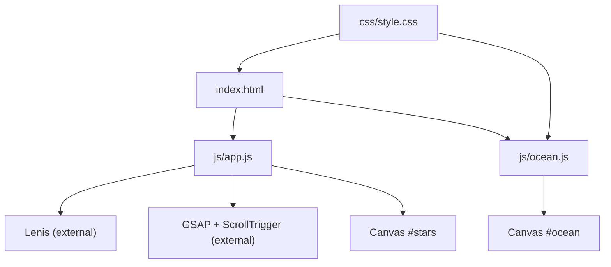
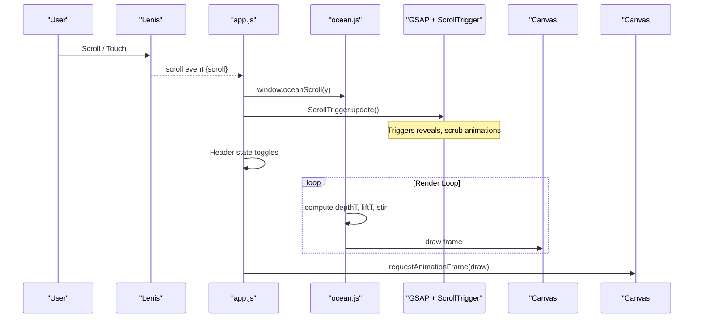
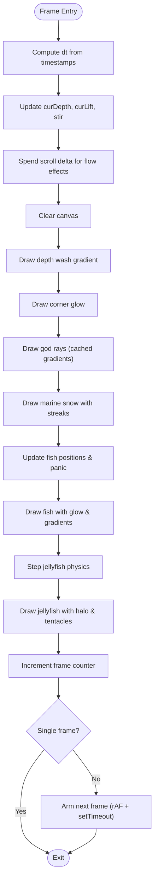
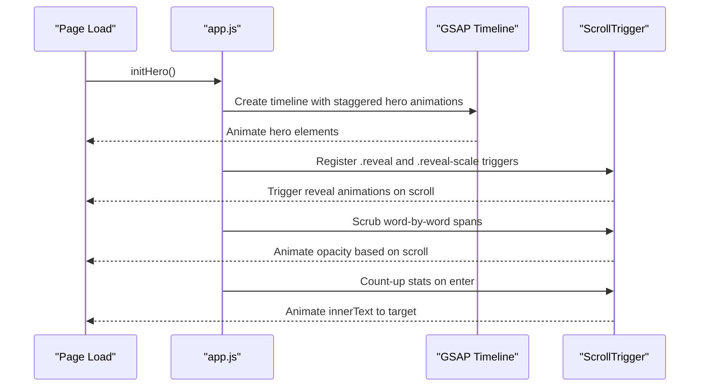
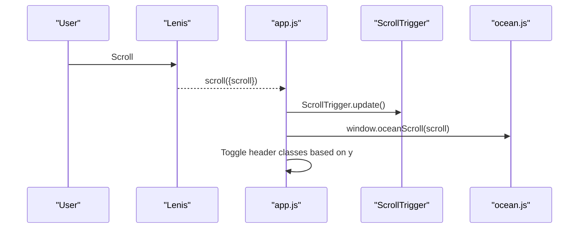
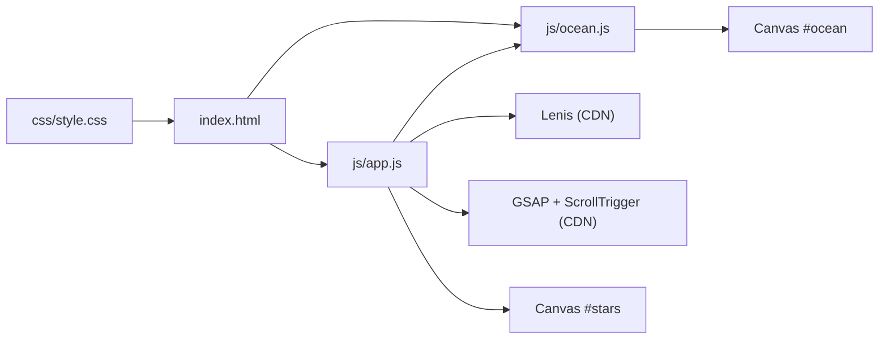

# Animations and Visual Effects

<cite>
**Referenced Files in This Document**
- [index.html](file://index.html)
- [js/app.js](file://js/app.js)
- [js/ocean.js](file://js/ocean.js)
- [css/style.css](file://css/style.css)
</cite>

## Table of Contents
1. [Introduction](#introduction)
2. [Project Structure](#project-structure)
3. [Core Components](#core-components)
4. [Architecture Overview](#architecture-overview)
5. [Detailed Component Analysis](#detailed-component-analysis)
6. [Dependency Analysis](#dependency-analysis)
7. [Performance Considerations](#performance-considerations)
8. [Troubleshooting Guide](#troubleshooting-guide)
9. [Conclusion](#conclusion)
10. [Appendices](#appendices)

## Introduction
This document explains the animations and visual effects system powering the site’s immersive experience. It covers:
- The ocean canvas background that simulates a living deep-sea environment, responding to scroll depth and user interactions.
- GSAP-driven hero entrance animations, scroll-triggered reveals, and word-by-word text animations.
- Lenis smooth scrolling integration and how it coordinates with ScrollTrigger and the ocean animation.
- A lightweight starfield canvas effect and cursor glow interaction for desktop.
- Practical guidance on adding new animations, configuring ScrollTrigger behaviors, and optimizing performance across devices and accessibility preferences.

## Project Structure
The animations are implemented across three primary layers:
- HTML structure defines the canvas elements and content sections that will be animated.
- JavaScript orchestrates animation logic, scroll handling, and canvas rendering.
- CSS provides base styles, transitions, and motion-safe overrides.

**Diagram sources**
- [index.html:43-49](file://index.html#L43-L49)
- [js/app.js:44-51](file://js/app.js#L44-L51)
- [js/app.js:58-93](file://js/app.js#L58-L93)
- [js/ocean.js:27-38](file://js/ocean.js#L27-L38)
- [css/style.css:48-81](file://css/style.css#L48-L81)

**Section sources**
- [index.html:43-49](file://index.html#L43-L49)
- [js/app.js:44-51](file://js/app.js#L44-L51)
- [js/app.js:58-93](file://js/app.js#L58-L93)
- [js/ocean.js:27-38](file://js/ocean.js#L27-L38)
- [css/style.css:48-81](file://css/style.css#L48-L81)

## Core Components
- Ocean Canvas Background: A full-screen canvas renders volumetric light rays, marine snow, fish schooling behavior, and bioluminescent jellyfish. It responds to scroll depth via a global function exposed by app.js and integrates touch/pointer interactions to startle the school.
- GSAP Hero and Reveal Animations: A timeline animates hero elements on load; ScrollTrigger handles reveal animations and a scrubbed word-by-word statement. Count-up stats animate when scrolled into view.
- Lenis Smooth Scrolling: Provides smooth scroll behavior and feeds scroll position to both GSAP ScrollTrigger and the ocean animation.
- Starfield Canvas: A simple twinkling starfield rendered on a separate canvas element.
- Cursor Glow: A desktop-only effect that follows the mouse position.

**Section sources**
- [js/ocean.js:27-78](file://js/ocean.js#L27-L78)
- [js/app.js:58-93](file://js/app.js#L58-L93)
- [js/app.js:112-132](file://js/app.js#L112-L132)
- [css/style.css:48-81](file://css/style.css#L48-L81)

## Architecture Overview
The system is driven by a central application script that initializes Lenis and GSAP, sets up scroll listeners, and delegates responsibilities to specialized modules:
- app.js wires Lenis and GSAP, triggers hero animations, and registers ScrollTrigger-based reveals.
- app.js also exposes a scroll handler that forwards scroll position to the ocean module.
- ocean.js runs its own render loop, updates state based on scroll depth, and draws the scene.
- CSS layers provide visual polish and ensure reduced-motion compatibility.

**Diagram sources**
- [js/app.js:44-51](file://js/app.js#L44-L51)
- [js/app.js:95-110](file://js/app.js#L95-L110)
- [js/ocean.js:57-78](file://js/ocean.js#L57-L78)
- [js/ocean.js:426-445](file://js/ocean.js#L426-L445)
- [js/app.js:112-124](file://js/app.js#L112-L124)

## Detailed Component Analysis

### Ocean Animation Implementation
The ocean animation is a self-contained canvas system that paints a deep-sea environment behind the page content. Key aspects:
- Canvas setup and DPR scaling: Uses devicePixelRatio capped at 1.5 to balance quality and performance.
- Scroll-driven depth: Exposes a global function to receive scroll position and computes normalized depth and lift values used throughout the scene.
- Interaction: Pointer events trigger a “startle” response in the fish school, applying outward forces and panic states that decay over time.
- Rendering pipeline: A hybrid frame driver uses requestAnimationFrame with a setTimeout fallback to ensure resilience in throttled environments. Each frame computes time deltas, updates water inertia, and draws layered elements:
  - Depth wash gradient transitioning from surface blue to abyss near-black.
  - Corner glow representing surface light.
  - God rays with cached gradients per size and pulsing alpha.
  - Marine snow with parallax and scroll-streak motion blur.
  - Fish school with boids-lite separation, homing to an anchor point that moves down with scroll.
  - Jellyfish with jet propulsion physics, visibility gating, and bioluminescent halos.

**Diagram sources**
- [js/ocean.js:426-445](file://js/ocean.js#L426-L445)
- [js/ocean.js:453-609](file://js/ocean.js#L453-L609)

**Section sources**
- [js/ocean.js:27-78](file://js/ocean.js#L27-L78)
- [js/ocean.js:81-103](file://js/ocean.js#L81-L103)
- [js/ocean.js:104-150](file://js/ocean.js#L104-L150)
- [js/ocean.js:152-232](file://js/ocean.js#L152-L232)
- [js/ocean.js:234-351](file://js/ocean.js#L234-L351)
- [js/ocean.js:353-417](file://js/ocean.js#L353-L417)
- [js/ocean.js:419-609](file://js/ocean.js#L419-L609)

### GSAP Animations: Hero Entrance, Scroll Reveals, Word-by-Word Text
- Hero entrance: A timeline staggers title lines, eyebrow, subtitle, actions, and video reveal with easing.
- Scroll reveals: Elements with .reveal and .reveal-scale classes animate into view using ScrollTrigger with specific start thresholds.
- Word-by-word statement: The target element is split into spans; opacity transitions are scrubbed against scroll progress for a synchronized reveal.
- Count-up stats: Numbers animate to their data-count targets when scrolled into view.

**Diagram sources**
- [js/app.js:58-93](file://js/app.js#L58-L93)

**Section sources**
- [js/app.js:58-93](file://js/app.js#L58-L93)

### Lenis Smooth Scrolling Integration
- Initialization: If available and not reduced-motion, Lenis is created with lerp and wheelMultiplier settings.
- Scroll coordination: On each Lenis scroll event, ScrollTrigger.update() is called so GSAP animations stay in sync with smooth scroll.
- Anchor links: Clicking anchor links scrolls smoothly to targets using Lenis with an offset.
- Ocean feed: The same scroll handler forwards the current scroll position to the ocean module so the background depth matches the perceived descent.

**Diagram sources**
- [js/app.js:44-51](file://js/app.js#L44-L51)
- [js/app.js:52-56](file://js/app.js#L52-L56)
- [js/app.js:95-110](file://js/app.js#L95-L110)

**Section sources**
- [js/app.js:44-56](file://js/app.js#L44-L56)
- [js/app.js:95-110](file://js/app.js#L95-L110)

### Starfield Canvas Effect
A lightweight starfield renders twinkling stars on a dedicated canvas element. It resizes on window resize and continuously redraws with randomized phase offsets for a natural shimmer.

**Section sources**
- [js/app.js:112-124](file://js/app.js#L112-L124)

### Cursor Glow Interactions
On desktop devices with hover capability, a glowing element tracks the mouse position to create a subtle ambient effect around the cursor.

**Section sources**
- [js/app.js:126-132](file://js/app.js#L126-L132)

## Dependency Analysis
- External libraries:
  - Lenis: Loaded via CDN and initialized conditionally based on availability and reduced-motion preference.
  - GSAP and ScrollTrigger: Loaded via CDN; ScrollTrigger is registered before use.
- Internal modules:
  - app.js depends on Lenis and GSAP APIs and coordinates between them and the ocean module.
  - ocean.js is independent but relies on a global scroll function provided by app.js.
- DOM dependencies:
  - index.html includes the necessary canvas elements (#ocean, #stars) and content sections with classes used by GSAP (.reveal, .reveal-scale, .reveal-words).

**Diagram sources**
- [index.html:352-359](file://index.html#L352-L359)
- [js/app.js:44-51](file://js/app.js#L44-L51)
- [js/app.js:58-93](file://js/app.js#L58-L93)
- [js/ocean.js:27-38](file://js/ocean.js#L27-L38)
- [css/style.css:48-81](file://css/style.css#L48-L81)

**Section sources**
- [index.html:352-359](file://index.html#L352-L359)
- [js/app.js:44-51](file://js/app.js#L44-L51)
- [js/app.js:58-93](file://js/app.js#L58-L93)
- [js/ocean.js:27-38](file://js/ocean.js#L27-L38)
- [css/style.css:48-81](file://css/style.css#L48-L81)

## Performance Considerations
- Reduced motion support:
  - GSAP animations respect prefers-reduced-motion by skipping initialization if GSAP is unavailable or by relying on CSS keyframe overrides where applicable.
  - The ocean module reduces timebase speed for reduced-motion users while keeping the scene alive to avoid static appearance.
- Canvas optimization:
  - Device pixel ratio is capped to limit offscreen buffer sizes on high-DPI screens.
  - Gradients for rays and fish are cached per size to avoid recomputation on every frame.
  - Particle counts for snow and fish are reduced on mobile breakpoints.
- Frame pacing:
  - Hybrid frame driver uses requestAnimationFrame with a setTimeout fallback to maintain responsiveness even when rAF is throttled.
  - Time deltas are clamped to prevent large jumps after tab inactivity.
- Visibility handling:
  - The render loop pauses when the tab is hidden and resumes safely without double-arming timers.
- Mobile considerations:
  - Fewer particles and smaller fish/jellyfish sizes on mobile reduce GPU/CPU load.
  - Lenis smooth scrolling is disabled for reduced-motion to avoid additional overhead.

[No sources needed since this section provides general guidance]

## Troubleshooting Guide
- Ocean canvas not found:
  - Ensure the canvas element with id "ocean" exists in the DOM before initialization.
  - Check console errors for missing canvas references during init.
- Animations not triggering:
  - Verify GSAP and ScrollTrigger are loaded and registered before calling initHero.
  - Confirm elements have correct classes (.reveal, .reveal-scale, .reveal-words) and that they exist in the DOM when ScrollTrigger scans.
- Scroll not syncing with ocean:
  - Ensure Lenis is initialized and the scroll handler forwards position to window.oceanScroll.
  - Confirm the initial scroll position seeds the ocean state on load.
- Starfield not visible:
  - Verify the canvas element with id "stars" exists and is within the viewport.
- Cursor glow not moving:
  - Confirm the cursor glow element exists and the device supports hover.

**Section sources**
- [js/ocean.js:27-32](file://js/ocean.js#L27-L32)
- [js/app.js:58-61](file://js/app.js#L58-L61)
- [js/app.js:95-110](file://js/app.js#L95-L110)
- [js/app.js:112-132](file://js/app.js#L112-L132)

## Conclusion
The animations and visual effects system combines a sophisticated ocean canvas background with GSAP-driven hero and scroll animations, all coordinated through Lenis smooth scrolling. The design prioritizes performance and accessibility by adapting to device capabilities and user preferences. The modular architecture allows easy extension: add new ScrollTrigger reveals, integrate additional canvas effects, or enhance interactions while maintaining a consistent, responsive experience.

[No sources needed since this section summarizes without analyzing specific files]

## Appendices

### How to Add New Animations
- For scroll-triggered reveals:
  - Add a class like .reveal or .reveal-scale to the target element in the HTML.
  - The existing code already iterates these classes and applies GSAP animations via ScrollTrigger.
- For word-by-word text animations:
  - Wrap your text in an element with class .reveal-words.
  - The script splits content into spans and scrubs opacity based on scroll position.
- For count-up numbers:
  - Add a data-count attribute to the numeric element you want to animate.

**Section sources**
- [js/app.js:69-93](file://js/app.js#L69-L93)

### Configuring ScrollTrigger Behaviors
- Adjust trigger thresholds:
  - Modify start values in the reveal registrations to change when animations begin relative to the viewport.
- Use scrubbing:
  - Apply scrub: true to tie animation progress directly to scroll position for interactive effects.

**Section sources**
- [js/app.js:69-84](file://js/app.js#L69-L84)

### Optimizing Canvas Rendering for Mobile
- Reduce particle counts:
  - The ocean module already scales snow and fish counts based on mobile breakpoints.
- Cap device pixel ratio:
  - DPR is capped to balance sharpness and performance on high-DPI screens.
- Cache expensive resources:
  - Gradients and shapes are cached per size to minimize recomputation.

**Section sources**
- [js/ocean.js:34-38](file://js/ocean.js#L34-L38)
- [js/ocean.js:115-141](file://js/ocean.js#L115-L141)
- [js/ocean.js:500-524](file://js/ocean.js#L500-L524)