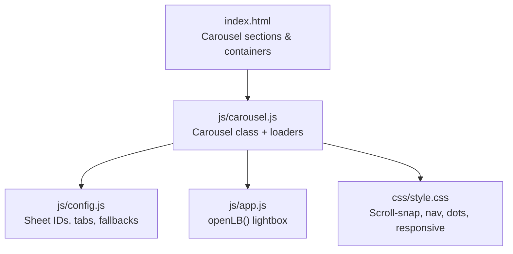
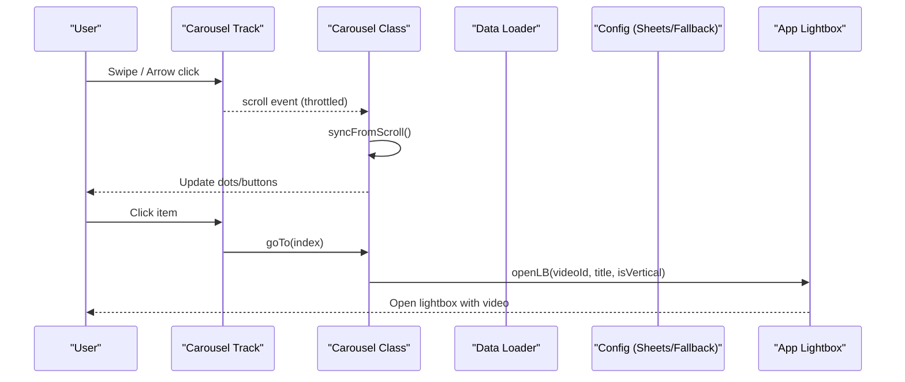
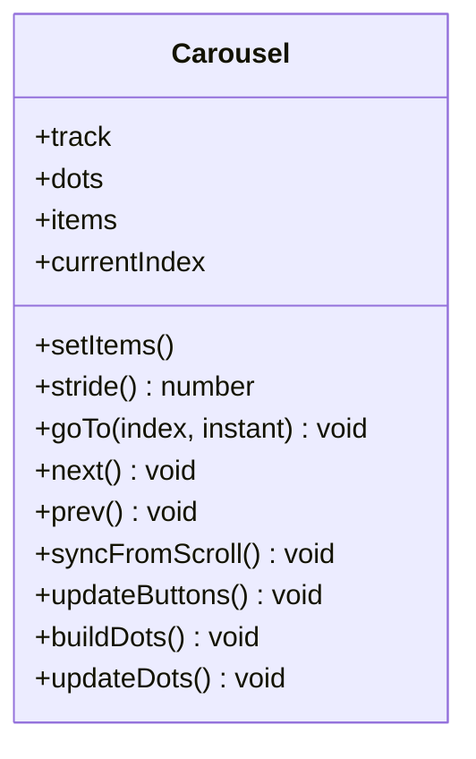
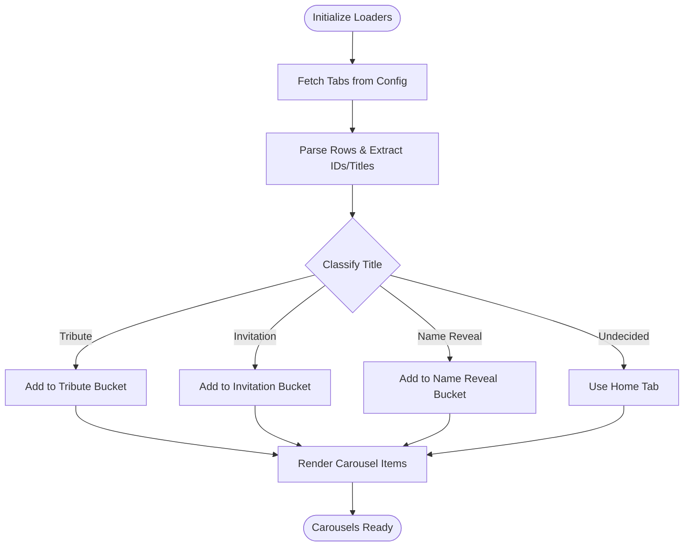
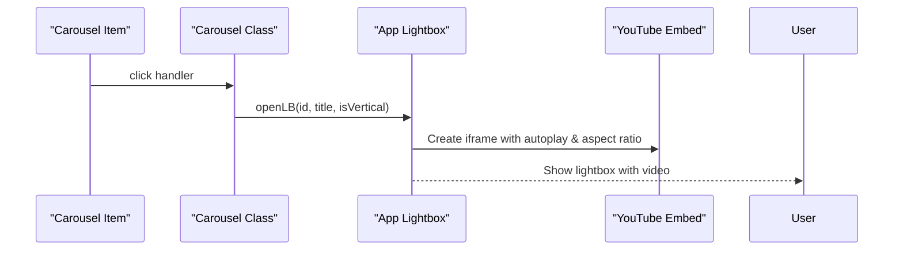
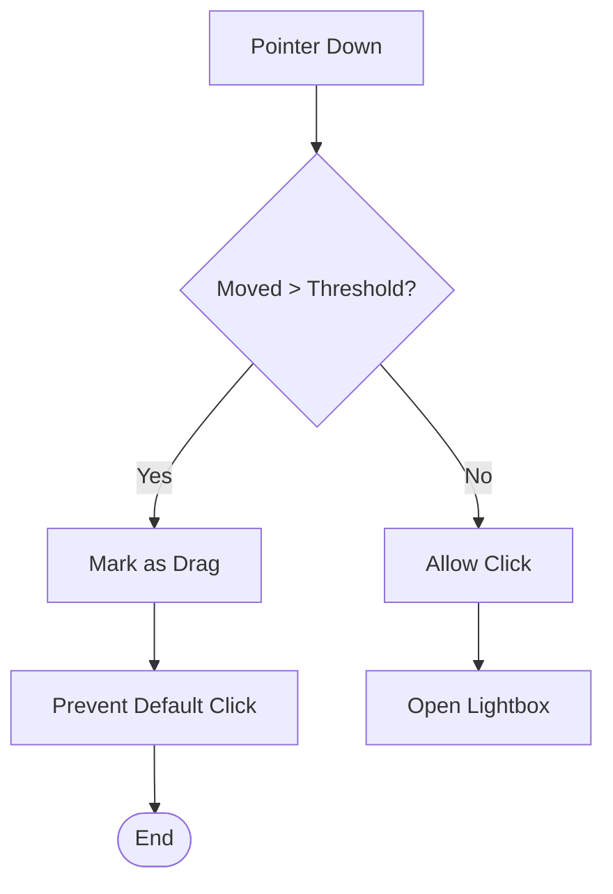
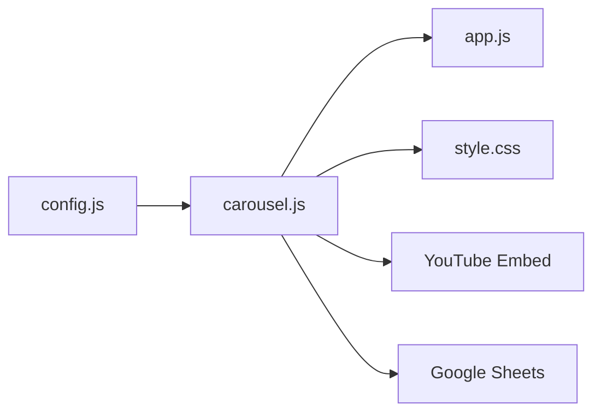

# Carousel Navigation System

<cite>
**Referenced Files in This Document**
- [carousel.js](file://js/carousel.js)
- [app.js](file://js/app.js)
- [style.css](file://css/style.css)
- [index.html](file://index.html)
- [config.js](file://js/config.js)
</cite>

## Table of Contents
1. [Introduction](#introduction)
2. [Project Structure](#project-structure)
3. [Core Components](#core-components)
4. [Architecture Overview](#architecture-overview)
5. [Detailed Component Analysis](#detailed-component-analysis)
6. [Dependency Analysis](#dependency-analysis)
7. [Performance Considerations](#performance-considerations)
8. [Troubleshooting Guide](#troubleshooting-guide)
9. [Conclusion](#conclusion)
10. [Appendices](#appendices)

## Introduction
This document explains the touch-enabled carousel navigation system used to browse video categories and featured content on the site. It covers how carousels are built with native scroll-snap behavior, how touch gestures are handled, how responsive layouts adapt across devices, and how selections trigger the shared video lightbox. It also documents accessibility features such as keyboard navigation and screen reader support, and provides guidance for configuring carousel items, category routing, and navigation controls. Finally, it addresses common issues like touch event conflicts and performance considerations for large carousels.

## Project Structure
The carousel system is implemented primarily in a dedicated JavaScript module and styled via CSS, with HTML sections providing the container elements and configuration sourced from a central config file.

- JavaScript:
  - Carousel logic, data fetching, and item rendering live in a single module that initializes multiple carousels (tribute, invitation videos, name reveal).
  - A shared lightbox function is exposed by the main app module so carousels can open videos consistently.
- CSS:
  - Scroll-snap-based horizontal rails, navigation arrows, dots, and responsive adjustments for mobile and tablet breakpoints.
  - Separate styles for vertical 9:16 invitation items and standard 16:9 tribute/name reveal items.
- HTML:
  - Sections define carousel tracks, navigation buttons, and dot containers for each category.
- Configuration:
  - Centralized settings include Google Sheet IDs/tabs for dynamic loading and inline fallback arrays for static content.

**Diagram sources**
- [index.html:95-203](file://index.html#L95-L203)
- [carousel.js:213-322](file://js/carousel.js#L213-L322)
- [config.js:20-41](file://js/config.js#L20-L41)
- [app.js:146-182](file://js/app.js#L146-L182)
- [style.css:421-477](file://css/style.css#L421-L477)

**Section sources**
- [index.html:95-203](file://index.html#L95-L203)
- [carousel.js:213-322](file://js/carousel.js#L213-L322)
- [config.js:20-41](file://js/config.js#L20-L41)
- [app.js:146-182](file://js/app.js#L146-L182)
- [style.css:421-477](file://css/style.css#L421-L477)

## Core Components
- Carousel class:
  - Encapsulates a track, navigation buttons, and dot indicators.
  - Uses native horizontal scrolling with snap alignment for smooth, inertia-driven swiping.
  - Computes stride based on actual item widths and gaps to center the active item precisely.
  - Syncs UI state (buttons, dots) with scroll position using requestAnimationFrame throttling.
- Data loaders:
  - Fetch rows from Google Sheets per tab (tribute, invitation, name reveal), classify titles into sections, and render carousel items dynamically.
  - Fall back to inline arrays in configuration when sheets are empty or fail to load.
- Lightbox integration:
  - Carousels call a shared lightbox function to open YouTube videos in either horizontal or vertical aspect ratios depending on the section.
- Styling:
  - CSS enforces scroll-snap behavior, hides scrollbars, and provides accessible navigation controls and responsive layouts.

**Section sources**
- [carousel.js:213-322](file://js/carousel.js#L213-L322)
- [carousel.js:351-463](file://js/carousel.js#L351-L463)
- [app.js:146-182](file://js/app.js#L146-L182)
- [style.css:421-477](file://css/style.css#L421-L477)
- [style.css:578-633](file://css/style.css#L578-L633)

## Architecture Overview
The carousel architecture combines native browser capabilities with lightweight JavaScript orchestration:

- Data flow:
  - On page load, the carousel module fetches categorized videos from Google Sheets, normalizes titles, and populates DOM nodes inside predefined track containers.
  - Each carousel instance binds scroll events to update UI state and exposes programmatic methods for next/previous navigation.
- Interaction flow:
  - Users swipe or use arrow keys/buttons to navigate; the carousel centers the nearest item using pixel offsets.
  - Clicking an item opens the shared lightbox with the appropriate aspect ratio and autoplay settings.
- Responsive behavior:
  - Horizontal carousels use full-width items with snap alignment; vertical invitation items are arranged horizontally but sized for 9:16 frames.
  - Breakpoints adjust navigation control sizes and item sizing for tablets and phones.

**Diagram sources**
- [carousel.js:213-322](file://js/carousel.js#L213-L322)
- [carousel.js:351-463](file://js/carousel.js#L351-L463)
- [app.js:146-182](file://js/app.js#L146-L182)

## Detailed Component Analysis

### Carousel Class Implementation
- Responsibilities:
  - Initialize track, navigation buttons, and dots.
  - Compute stride and center items accurately.
  - Sync UI state with scroll position using RAF-throttled listeners.
  - Guard against click-after-drag conflicts to prevent unintended lightbox triggers after swipes.
- Key behaviors:
  - goTo(index, instant): scrolls to the target item’s centered offset with optional instant behavior.
  - next()/prev(): convenience methods to move one step.
  - buildDots(): generates accessible dot buttons with aria-labels and click handlers.
  - updateButtons(): disables prev/next at boundaries based on scroll position.

**Diagram sources**
- [carousel.js:213-322](file://js/carousel.js#L213-L322)

**Section sources**
- [carousel.js:213-322](file://js/carousel.js#L213-L322)

### Data Loading and Category Routing
- Google Sheet integration:
  - Fetches rows from configured tabs and parses JSON responses.
  - Classifies each row into tribute, invitation, or name reveal based on title keywords and context.
  - Scores entries to resolve duplicates across tabs and ensures correct categorization.
- Fallback mechanism:
  - If sheet fetch fails or returns no items, uses inline arrays from configuration to populate carousels.
- Rendering:
  - Creates carousel items with thumbnails, metadata, and click handlers to open the lightbox.
  - Hides entire sections if no items are available to avoid showing incorrect work.

**Diagram sources**
- [carousel.js:151-205](file://js/carousel.js#L151-L205)
- [carousel.js:351-463](file://js/carousel.js#L351-L463)

**Section sources**
- [carousel.js:151-205](file://js/carousel.js#L151-L205)
- [carousel.js:351-463](file://js/carousel.js#L351-L463)
- [config.js:20-41](file://js/config.js#L20-L41)

### Lightbox Integration and Video Playback
- Shared lightbox:
  - The main app exposes a function to open a lightbox with a YouTube embed, setting aspect ratio and autoplay parameters.
  - Vertical invitation videos use a 9:16 aspect ratio; others use 16:9.
- Accessibility:
  - Lightbox includes a close button and ESC key handling to dismiss overlays.
  - Videos are embedded via a privacy-friendly domain with autoplay and minimal branding.

**Diagram sources**
- [carousel.js:324-334](file://js/carousel.js#L324-L334)
- [app.js:146-182](file://js/app.js#L146-L182)

**Section sources**
- [carousel.js:324-334](file://js/carousel.js#L324-L334)
- [app.js:146-182](file://js/app.js#L146-L182)

### Responsive Behavior and Touch Gesture Handling
- Native scroll-snap:
  - Horizontal rails use mandatory x-axis snapping for precise slide alignment and natural inertia.
  - Touch actions are constrained to pan-x and pan-y to allow vertical scrolling alongside horizontal swiping.
- Responsive layout:
  - Navigation arrows scale down on smaller screens; item sizing adapts for tablets and phones.
  - Vertical invitation items maintain 9:16 proportions while fitting within horizontal carousels.
- Gesture conflict prevention:
  - Pointer events detect drag vs. click to prevent accidental lightbox triggers after swipes.

**Diagram sources**
- [carousel.js:239-248](file://js/carousel.js#L239-L248)
- [style.css:421-477](file://css/style.css#L421-L477)
- [style.css:578-633](file://css/style.css#L578-L633)

**Section sources**
- [carousel.js:239-248](file://js/carousel.js#L239-L248)
- [style.css:421-477](file://css/style.css#L421-L477)
- [style.css:578-633](file://css/style.css#L578-L633)

### Accessibility Features
- Keyboard navigation:
  - Dots are buttons with aria-labels enabling focus and activation via keyboard.
  - Lightbox supports ESC to close overlays.
- Screen reader support:
  - Descriptive labels on navigation controls and dots improve assistive technology experiences.
  - Alt text on images conveys item context.

**Section sources**
- [carousel.js:304-321](file://js/carousel.js#L304-L321)
- [app.js:208-210](file://js/app.js#L208-L210)

## Dependency Analysis
- Module dependencies:
  - Carousel module depends on configuration for data sources and on the app module for lightbox functionality.
  - Styles depend on CSS classes defined in the stylesheet for layout and interaction.
- External integrations:
  - Google Sheets API for dynamic content.
  - YouTube embeds for video playback.
- Coupling:
  - Carousel class is loosely coupled to the rest of the app through a shared lightbox interface.
  - Data loaders encapsulate sheet parsing and classification, reducing coupling to external formats.

**Diagram sources**
- [config.js:20-41](file://js/config.js#L20-L41)
- [carousel.js:213-322](file://js/carousel.js#L213-L322)
- [app.js:146-182](file://js/app.js#L146-L182)
- [style.css:421-477](file://css/style.css#L421-L477)

**Section sources**
- [config.js:20-41](file://js/config.js#L20-L41)
- [carousel.js:213-322](file://js/carousel.js#L213-L322)
- [app.js:146-182](file://js/app.js#L146-L182)
- [style.css:421-477](file://css/style.css#L421-L477)

## Performance Considerations
- Native scroll-snap:
  - Leverages browser-native snapping for smooth, GPU-accelerated transitions without heavy animation libraries.
- Event throttling:
  - Scroll listeners are throttled via requestAnimationFrame to minimize reflows and repaints.
- Lazy loading:
  - Thumbnails use lazy loading attributes to defer image loading until needed.
- Large carousels:
  - For very large sets, consider virtualizing visible items or paginating data to reduce DOM size.
  - Ensure sheet queries return only necessary fields to minimize payload size.
- Reduced motion:
  - Respects user preferences for reduced motion where applicable.

[No sources needed since this section provides general guidance]

## Troubleshooting Guide
- Touch event conflicts:
  - If clicks fire after swipes, ensure pointerdown/move thresholds are set to distinguish drag from click.
  - Verify passive event listeners are used for scroll and pointer events to avoid blocking.
- Empty sections:
  - If a carousel section remains hidden, check sheet availability and fallback arrays in configuration.
- Lightbox not opening:
  - Confirm the shared lightbox function is exposed and called with valid video IDs.
  - Validate YouTube links are parsed correctly to extract 11-character IDs.
- Accessibility issues:
  - Ensure all interactive elements have appropriate roles and labels.
  - Test keyboard navigation and screen reader announcements.

**Section sources**
- [carousel.js:239-248](file://js/carousel.js#L239-L248)
- [carousel.js:351-463](file://js/carousel.js#L351-L463)
- [app.js:146-182](file://js/app.js#L146-L182)

## Conclusion
The carousel navigation system delivers a robust, touch-friendly experience for browsing video categories and featured content. By combining native scroll-snap behavior with lightweight JavaScript orchestration, it achieves smooth animations, responsive layouts, and accessible interactions. The modular design allows easy configuration via centralized settings and integrates seamlessly with the shared lightbox for consistent video playback. With careful attention to performance and accessibility, the system scales well for varying content volumes and device types.

[No sources needed since this section summarizes without analyzing specific files]

## Appendices

### How to Configure Carousel Items
- Use Google Sheets:
  - Add tabs for each category with appropriate headers and publish the sheet.
  - Set sheet IDs and tab names in configuration to enable live updates.
- Inline fallback:
  - Provide arrays of video objects in configuration for static content when sheets are unavailable.
- Category filters:
  - Titles are automatically classified into tribute, invitation, or name reveal based on keywords.
  - Adjust classification logic if new categories are introduced.

**Section sources**
- [config.js:20-41](file://js/config.js#L20-L41)
- [carousel.js:151-205](file://js/carousel.js#L151-L205)

### Customizing Navigation Controls
- Arrows and dots:
  - Modify CSS classes for styling and positioning.
  - Ensure aria-labels are present for accessibility.
- Behavior:
  - Adjust stride calculation if custom spacing or item widths are used.
  - Update boundary checks to reflect new navigation constraints.

**Section sources**
- [style.css:421-477](file://css/style.css#L421-L477)
- [carousel.js:298-321](file://js/carousel.js#L298-L321)

### Integration with Main Gallery System
- Shared lightbox:
  - Carousels call the shared lightbox function to open videos consistently across sections.
- Aspect ratios:
  - Vertical invitation videos use 9:16; other categories use 16:9.
- Styling:
  - Lightbox styles adapt to different aspect ratios and provide action cards for user engagement.

**Section sources**
- [app.js:146-182](file://js/app.js#L146-L182)
- [style.css:240-303](file://css/style.css#L240-L303)