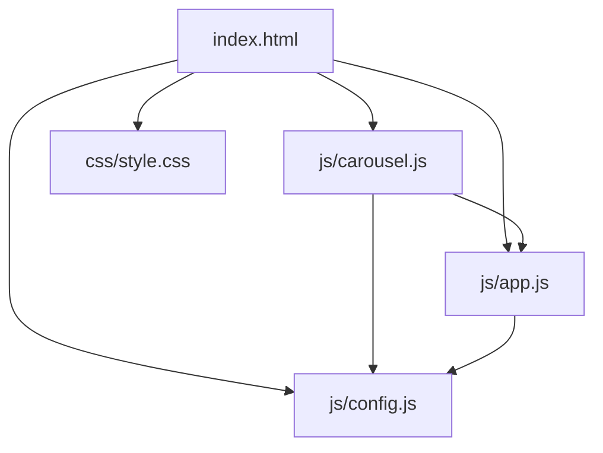
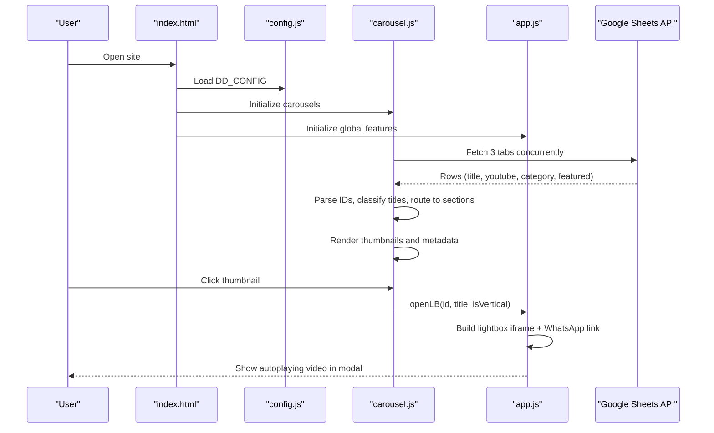
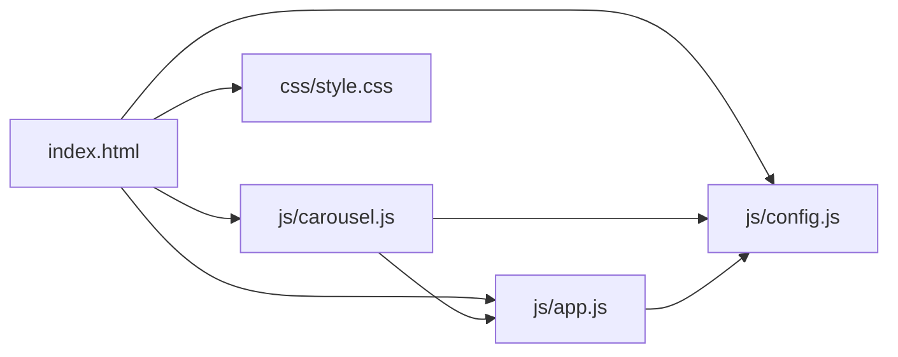

# Core Video Gallery Implementation

<cite>
**Referenced Files in This Document**
- [index.html](file://index.html)
- [js/config.js](file://js/config.js)
- [js/app.js](file://js/app.js)
- [js/carousel.js](file://js/carousel.js)
- [css/style.css](file://css/style.css)
</cite>

## Table of Contents
1. Introduction
2. Project Structure
3. Core Components
4. Architecture Overview
5. Detailed Component Analysis
6. Dependency Analysis
7. Performance Considerations
8. Troubleshooting Guide
9. Conclusion

## Introduction
This document explains the core video gallery implementation that powers a dynamic, configuration-driven portfolio site. The gallery is fed by Google Sheets and displays videos across multiple sections: tribute films, wedding invitation videos (vertical 9:16), and baby name reveal videos. It includes YouTube ID extraction, thumbnail generation, metadata handling, a lightbox with autoplay and mobile-friendly settings, WhatsApp integration for requesting similar videos, and performance-conscious behaviors such as lazy loading of thumbnails and deferred embeds.

## Project Structure
The video gallery spans HTML structure, centralized configuration, runtime logic, and styling:
- index.html defines the page layout, including carousels and the lightbox container.
- js/config.js centralizes all editable behavior: Google Sheet IDs and tabs, hero video, inline fallback lists, contact links, and social links.
- js/app.js wires up global interactions, the hero video, and the shared lightbox used by every section.
- js/carousel.js fetches data from Google Sheets, parses rows, classifies content into sections, builds carousels, and opens the lightbox on click.
- css/style.css provides responsive layouts, carousel styles, and visual polish.

**Diagram sources**
- [index.html:95-202](file://index.html#L95-L202)
- [js/config.js:20-128](file://js/config.js#L20-L128)
- [js/app.js:18-29](file://js/app.js#L18-L29)
- [js/carousel.js:151-205](file://js/carousel.js#L151-L205)
- [css/style.css:170-186](file://css/style.css#L170-L186)

**Section sources**
- [index.html:95-202](file://index.html#L95-L202)
- [js/config.js:20-128](file://js/config.js#L20-L128)
- [js/app.js:18-29](file://js/app.js#L18-L29)
- [js/carousel.js:151-205](file://js/carousel.js#L151-L205)
- [css/style.css:170-186](file://css/style.css#L170-L186)

## Core Components
- Configuration: Centralized in config.js to control sheet IDs/tabs, hero video, inline fallbacks, WhatsApp number/message, email, social links, UPI details.
- Data fetching and parsing: carousel.js reads three Google Sheet tabs concurrently, extracts YouTube IDs and titles, and routes each row into the correct section using title classification.
- Rendering: Each section renders a native scroll-snap carousel with lazy-loaded thumbnails and play overlays. Vertical invitation videos use a 9:16 card style.
- Lightbox: app.js exposes a shared openLB function that opens an autoplaying YouTube embed in a modal, with vertical or horizontal orientation and a WhatsApp “Request this style” button.
- Styling: Responsive grid and carousel UI with accessible controls and motion-aware animations.

**Section sources**
- [js/config.js:20-128](file://js/config.js#L20-L128)
- [js/carousel.js:151-205](file://js/carousel.js#L151-L205)
- [js/carousel.js:351-463](file://js/carousel.js#L351-L463)
- [js/app.js:146-188](file://js/app.js#L146-L188)
- [css/style.css:170-186](file://css/style.css#L170-L186)

## Architecture Overview
The system uses a configuration-first approach. All site behavior is controlled via window.DD_CONFIG. At runtime:
- index.html loads scripts in order: config, ocean background, carousel, app.
- carousel.js initializes carousels and fetches data from Google Sheets.
- app.js sets up global helpers, hero video, and the shared lightbox.

**Diagram sources**
- [index.html:352-359](file://index.html#L352-L359)
- [js/config.js:20-128](file://js/config.js#L20-L128)
- [js/carousel.js:151-205](file://js/carousel.js#L151-L205)
- [js/carousel.js:351-463](file://js/carousel.js#L351-L463)
- [js/app.js:146-188](file://js/app.js#L146-L188)

## Detailed Component Analysis

### Configuration-driven architecture (config.js)
- Central source of truth for:
  - Google Sheet ID and tab names per collection.
  - Hero featured video ID.
  - Inline fallback arrays for invitation and name reveal videos.
  - Contact and social links (WhatsApp, email, Instagram, YouTube).
  - UPI payment details.
- Comments explain how to add new tabs and what headers are expected.
- Behavior is entirely driven by these values; no hard-coded content in JS beyond defaults and fallbacks.

Key responsibilities:
- Provide SHEET_ID and tab names so carousel.js can fetch live content without redeploy.
- Allow inline overrides for quick edits or offline previews.
- Configure WhatsApp messaging and contact points used throughout the site.

**Section sources**
- [js/config.js:20-128](file://js/config.js#L20-L128)

### YouTube ID extraction and thumbnails
- Both app.js and carousel.js implement a robust YouTube ID extractor that accepts:
  - Full watch URLs, embed URLs, youtu.be short links, and shorts links.
  - Raw 11-character IDs.
- Thumbnails are generated via YouTube’s public image endpoint using the extracted ID.
- These utilities ensure consistent behavior across hero, carousels, and lightbox.

Where it matters:
- Hero video setup uses the extractor to build the embed URL.
- Carousels render lazy thumbnails for each item.
- Lightbox embeds the video with autoplay and mobile-friendly parameters.

**Section sources**
- [js/app.js:10-13](file://js/app.js#L10-L13)
- [js/carousel.js:17-24](file://js/carousel.js#L17-L24)
- [js/app.js:26-29](file://js/app.js#L26-L29)
- [js/carousel.js:361-373](file://js/carousel.js#L361-L373)

### Google Sheets integration and metadata handling
- carousel.js fetches three tabs concurrently using the Google Visualization API query format.
- It parses JSON responses and extracts rows containing at least a YouTube field.
- Title normalization and classification route each video to the correct section:
  - Tribute, Wedding Invitation, Name Reveal.
- A scoring mechanism resolves duplicates when the same video appears in multiple tabs, preferring the most semantically appropriate section based on title keywords.
- Section labels are applied for display metadata.

Data flow:
- Fetch all tabs → parse rows → extract IDs and titles → classify → deduplicate by score → bucket into sections → render carousels.

**Section sources**
- [js/carousel.js:151-205](file://js/carousel.js#L151-L205)
- [js/carousel.js:351-463](file://js/carousel.js#L351-L463)

### Carousel rendering and interaction
- Native CSS scroll-snap carousels provide smooth, touch-friendly navigation with arrow buttons and dot indicators.
- Each item shows a lazy thumbnail, a play overlay, and metadata (category and title).
- Click events open the lightbox with the appropriate orientation (horizontal for standard videos, vertical for 9:16 invitation videos).
- Empty sections hide themselves to avoid showing unrelated content.

Behavior highlights:
- Debounced scroll sync updates active dots and arrows.
- Drag-to-swipe detection prevents accidental lightbox triggers after a swipe.
- Fallback to inline config arrays if sheets fail or are empty.

**Section sources**
- [js/carousel.js:213-322](file://js/carousel.js#L213-L322)
- [js/carousel.js:351-463](file://js/carousel.js#L351-L463)
- [css/style.css:170-186](file://css/style.css#L170-L186)

### Lightbox functionality (autoplay and mobile optimization)
- app.js exposes a shared openLB function used by carousels.
- On open:
  - Sets vertical or horizontal mode classes based on video type.
  - Injects a YouTube embed iframe with autoplay enabled and mobile-friendly flags (playsinline, modest branding, rel=0).
  - Renders a title area with a “Request This Style” WhatsApp link pre-filled with the watched video’s title.
- Close behavior clears the iframe after a short delay to stop playback and free resources.

Accessibility and UX:
- Escape key closes modals.
- Click outside the content closes the lightbox.
- Smooth scroll is paused while modal is open to prevent background scrolling.

**Section sources**
- [js/app.js:146-188](file://js/app.js#L146-L188)
- [index.html:332-339](file://index.html#L332-L339)

### WhatsApp integration from lightbox
- When a user clicks “Request This Style,” the site opens a WhatsApp message with a pre-filled text referencing the exact video they watched.
- The message includes the video title and directs users to the configured WhatsApp number.
- Global WhatsApp links (hero, contact, floating action button) are also wired from config.

Flow:
- User watches video in lightbox → clicks WhatsApp button → opens wa.me with encoded message → user sends request.

**Section sources**
- [js/app.js:146-188](file://js/app.js#L146-L188)
- [js/config.js:117-119](file://js/config.js#L117-L119)

### Concrete examples from codebase
- Fetching and routing videos:
  - Concurrently fetch three tabs and route items by title classification.
  - See the routedFilms function and its usage in loadTributeCarousel, loadInvitationVideos, and loadNameRevealCarousel.
- Rendering thumbnails and metadata:
  - Each carousel item creates an img with lazy loading and a play overlay, plus meta elements for category and title.
- Opening lightbox:
  - Click handlers call openVideo which delegates to openLB with id, title, and orientation flag.

**Section sources**
- [js/carousel.js:151-205](file://js/carousel.js#L151-L205)
- [js/carousel.js:351-463](file://js/carousel.js#L351-L463)
- [js/carousel.js:324-334](file://js/carousel.js#L324-L334)

## Dependency Analysis
High-level dependencies between modules:
- index.html depends on config.js, carousel.js, app.js, and style.css.
- carousel.js depends on config.js for sheet IDs/tabs and app.js for the shared lightbox.
- app.js depends on config.js for contact/social links and hero video.

**Diagram sources**
- [index.html:352-359](file://index.html#L352-L359)
- [js/config.js:20-128](file://js/config.js#L20-L128)
- [js/app.js:18-29](file://js/app.js#L18-L29)
- [js/carousel.js:151-205](file://js/carousel.js#L151-L205)

**Section sources**
- [index.html:352-359](file://index.html#L352-L359)
- [js/config.js:20-128](file://js/config.js#L20-L128)
- [js/app.js:18-29](file://js/app.js#L18-L29)
- [js/carousel.js:151-205](file://js/carousel.js#L151-L205)

## Performance Considerations
- Lazy loading of thumbnails:
  - Thumbnails use native lazy loading to defer offscreen images until needed, reducing initial payload and improving perceived performance.
- Deferred embeds:
  - YouTube embeds are only created when the lightbox opens, avoiding unnecessary network requests and CPU usage during initial page load.
- Mobile-optimized embeds:
  - Lightbox embeds include playsinline and other flags to ensure proper behavior on iOS and Android.
- Efficient data fetching:
  - All three sheet tabs are fetched concurrently with Promise.allSettled to minimize total wait time and handle partial failures gracefully.
- Scroll performance:
  - Carousels rely on native CSS scroll-snap and passive event listeners for smooth scrolling.
- Reduced motion support:
  - Animations respect prefers-reduced-motion where applicable.

[No sources needed since this section provides general guidance]

## Troubleshooting Guide
Common issues and resolutions:
- Google Sheets not loading:
  - Ensure the sheet is published to the web and shared as “Anyone with the link.”
  - Verify SHEET_ID and tab names match exactly, including spaces.
  - Check console warnings for invalid response formats or network errors.
- Videos not appearing:
  - Confirm rows contain valid YouTube links or 11-character IDs.
  - If both sheet and inline fallbacks are empty, sections hide themselves intentionally to avoid showing unrelated work.
- Lightbox not opening:
  - Ensure openLB is available globally before clicking thumbnails.
  - Verify DOM elements #lb, #lbInner, and #lbTitle exist.
- WhatsApp link incorrect:
  - Update WHATSAPP and WHATSAPP_MSG in config.js to your number and preferred message template.

**Section sources**
- [js/carousel.js:151-205](file://js/carousel.js#L151-L205)
- [js/carousel.js:351-463](file://js/carousel.js#L351-L463)
- [js/app.js:146-188](file://js/app.js#L146-L188)
- [js/config.js:117-119](file://js/config.js#L117-L119)

## Conclusion
The video gallery is a lightweight, configuration-driven system that leverages Google Sheets as a live content management layer. It cleanly separates concerns: config drives behavior, carousel handles data fetching and rendering, and app manages global interactions and the lightbox. The result is a performant, mobile-friendly experience with lazy loading, deferred embeds, and intuitive WhatsApp-based conversion paths. Updates to content require no redeployment—just edit the sheet and publish changes.

[No sources needed since this section summarizes without analyzing specific files]