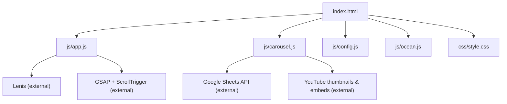
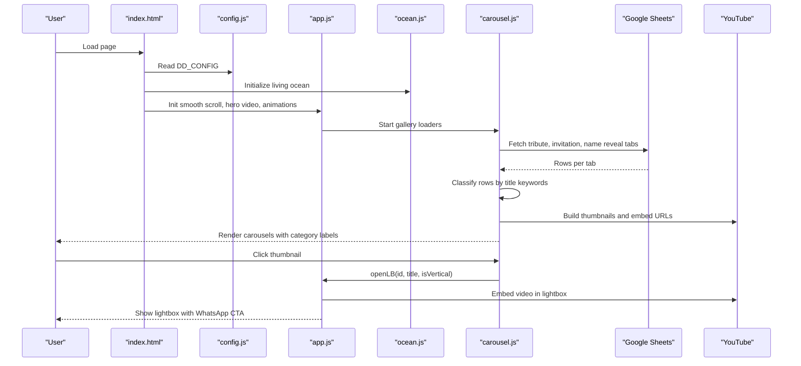
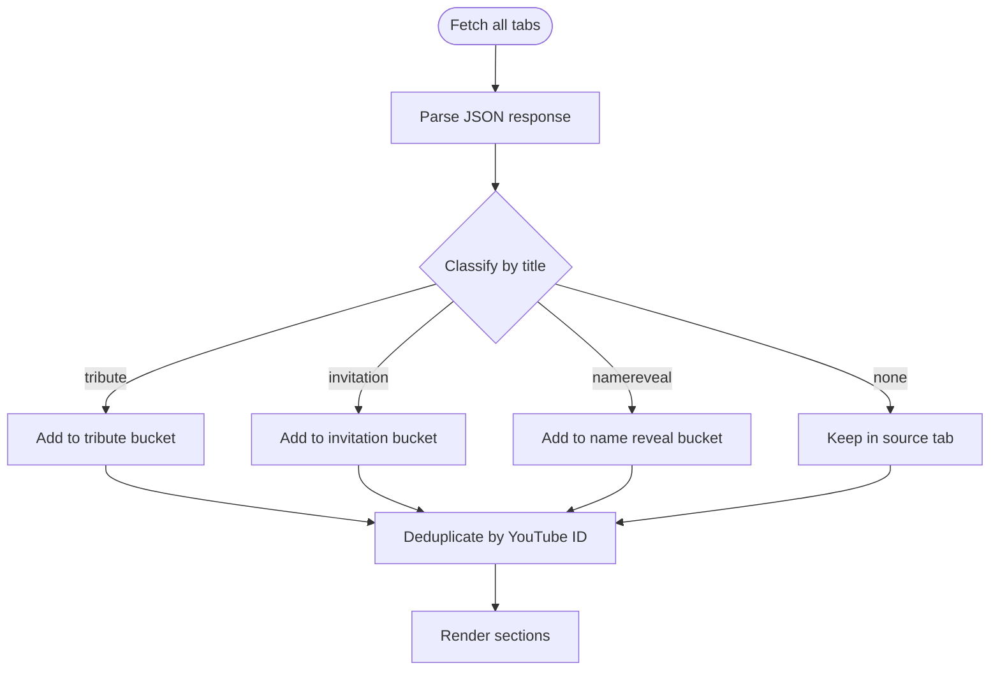
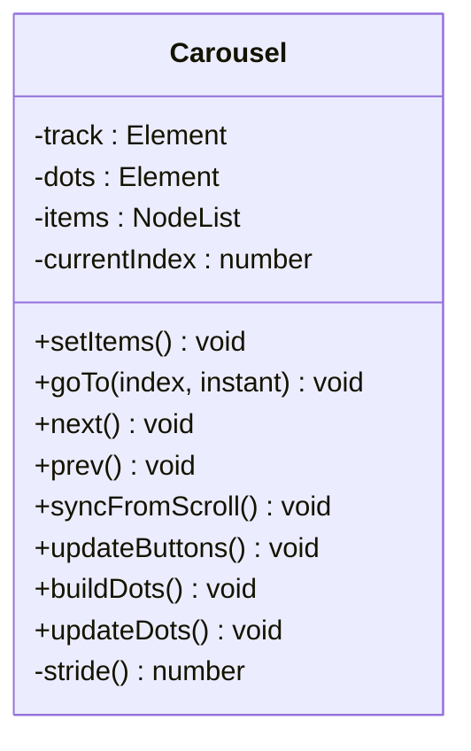
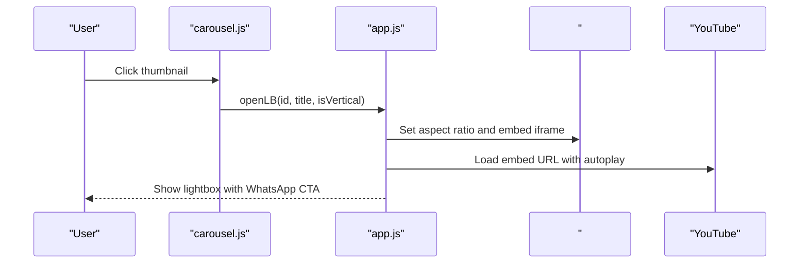
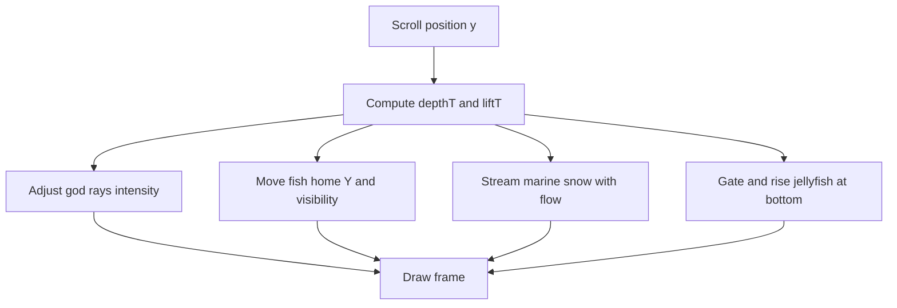
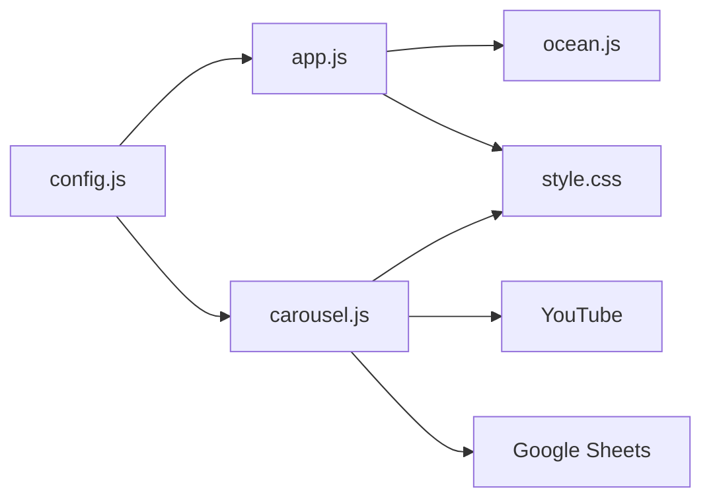

# Portfolio Video Gallery System

<cite>
**Referenced Files in This Document**
- [index.html](file://index.html)
- [js/app.js](file://js/app.js)
- [js/carousel.js](file://js/carousel.js)
- [js/config.js](file://js/config.js)
- [js/ocean.js](file://js/ocean.js)
- [css/style.css](file://css/style.css)
</cite>

## Table of Contents
1. [Introduction](#introduction)
2. [Project Structure](#project-structure)
3. [Core Components](#core-components)
4. [Architecture Overview](#architecture-overview)
5. [Detailed Component Analysis](#detailed-component-analysis)
6. [Dependency Analysis](#dependency-analysis)
7. [Performance Considerations](#performance-considerations)
8. [Troubleshooting Guide](#troubleshooting-guide)
9. [Conclusion](#conclusion)
10. [Appendices](#appendices)

## Introduction
This document explains the portfolio video gallery system that powers a dynamic, category-based showcase of videos sourced from Google Sheets. It covers how videos are fetched, organized into categories (Tribute Films, Wedding Invitation Videos, Baby Name Reveal Videos), displayed in native touch-enabled carousels, and opened in a lightbox with smooth scrolling via Lenis and GSAP ScrollTrigger. It also documents the ocean animation background, configuration options for adding new content, performance optimizations, responsive design considerations, and common issues such as YouTube embed loading and mobile compatibility.

## Project Structure
The site is a single-page application composed of:
- HTML sections for hero, marquee, multiple video galleries, services, about, contact, and modals.
- JavaScript modules for app logic, carousel behavior, configuration, and an animated ocean background.
- CSS for layout, animations, carousels, lightbox, and responsive styles.

**Diagram sources**
- [index.html:352-359](file://index.html#L352-L359)
- [js/app.js:44-56](file://js/app.js#L44-L56)
- [js/carousel.js:151-159](file://js/carousel.js#L151-L159)

**Section sources**
- [index.html:1-362](file://index.html#L1-L362)
- [js/app.js:1-210](file://js/app.js#L1-L210)
- [js/carousel.js:1-569](file://js/carousel.js#L1-L569)
- [js/config.js:1-129](file://js/config.js#L1-L129)
- [js/ocean.js:1-642](file://js/ocean.js#L1-L642)
- [css/style.css:1-635](file://css/style.css#L1-L635)

## Core Components
- Configuration: Centralized settings for Google Sheet IDs/tabs, featured hero video, contact links, social links, UPI details, and inline fallback arrays for invitation/name reveal videos and website/AI builds showcases.
- Carousel engine: Native scroll-snap carousels with arrow navigation, dot indicators, and click-to-open lightbox. Supports horizontal 16:9 items and vertical 9:16 items.
- Data pipeline: Fetches all three Google Sheet tabs concurrently, classifies each row by title keywords into tribute/invitation/name-reveal buckets, deduplicates by YouTube ID, and renders only relevant sections.
- Lightbox: Shared modal that opens YouTube embeds in either horizontal or vertical aspect ratio, with a smart WhatsApp action link pre-filled with context.
- Smooth scrolling: Lenis integration with ScrollTrigger to animate reveals and count-up stats; anchor links use Lenis when available.
- Ocean animation: Full-screen canvas with volumetric light rays, marine snow, fish school, and bioluminescent jellyfish driven by scroll depth and time.

**Section sources**
- [js/config.js:20-129](file://js/config.js#L20-L129)
- [js/carousel.js:151-205](file://js/carousel.js#L151-L205)
- [js/carousel.js:213-322](file://js/carousel.js#L213-L322)
- [js/app.js:146-188](file://js/app.js#L146-L188)
- [js/app.js:44-93](file://js/app.js#L44-L93)
- [js/ocean.js:27-79](file://js/ocean.js#L27-L79)

## Architecture Overview
The system loads configuration first, then initializes the ocean background, sets up smooth scrolling and entrance animations, and finally populates the galleries from Google Sheets with category routing and fallbacks.

**Diagram sources**
- [index.html:352-359](file://index.html#L352-L359)
- [js/config.js:20-47](file://js/config.js#L20-L47)
- [js/app.js:26-29](file://js/app.js#L26-L29)
- [js/app.js:44-56](file://js/app.js#L44-L56)
- [js/carousel.js:151-205](file://js/carousel.js#L151-L205)
- [js/carousel.js:324-334](file://js/carousel.js#L324-L334)
- [js/app.js:146-188](file://js/app.js#L146-L188)

## Detailed Component Analysis

### Google Sheets Integration and Category Routing
- The carousel module fetches three tabs concurrently using the configured sheet ID and tab names. Each tab returns rows with at least Title and YouTube fields.
- Rows are classified into tribute, invitation, or name reveal based on title keywords. If classification matches the home tab, it gets priority; otherwise, the original tab determines placement.
- Duplicate entries for the same YouTube ID are resolved by scoring: exact match to home tab wins, then classification-only match, else keep the original tab entry.
- Titles are normalized through a mapping table and a tidy function to ensure professional wording on the site.

**Diagram sources**
- [js/carousel.js:151-205](file://js/carousel.js#L151-L205)

**Section sources**
- [js/carousel.js:151-205](file://js/carousel.js#L151-L205)
- [js/carousel.js:50-147](file://js/carousel.js#L50-L147)

### Carousel Functionality and Touch Navigation
- Carousels use CSS scroll-snap with native touch support for smooth swiping and inertia.
- Arrow buttons navigate by computing pixel offsets based on item widths and gaps; dots reflect the current index and are updated on scroll events.
- Click-to-open triggers the shared lightbox; drag gestures are detected to prevent accidental lightbox opening after a swipe.
- Vertical invitation videos render as 9:16 cards in a horizontal snap carousel; horizontal tribute/name reveal videos render as 16:9 cards.

**Diagram sources**
- [js/carousel.js:213-322](file://js/carousel.js#L213-L322)

**Section sources**
- [js/carousel.js:213-322](file://js/carousel.js#L213-L322)
- [css/style.css:422-477](file://css/style.css#L422-L477)
- [css/style.css:578-635](file://css/style.css#L578-L635)

### Featured Video Highlighting and Hero Section
- The hero section features a looping, muted YouTube embed set from configuration. It uses a no-cookie domain for privacy and includes controls disabled for a cinematic experience.
- The featured strip previously existed but has been removed; the hero film remains the primary highlight.

**Section sources**
- [js/app.js:26-29](file://js/app.js#L26-L29)
- [index.html:78-85](file://index.html#L78-L85)
- [js/config.js:43-47](file://js/config.js#L43-L47)

### Lightbox and Smart WhatsApp Action
- The lightbox supports both horizontal and vertical aspect ratios and injects a YouTube embed with autoplay and minimal branding.
- A contextual WhatsApp message is generated including the viewed video title, making it easy for users to request similar work.

**Diagram sources**
- [js/carousel.js:324-334](file://js/carousel.js#L324-L334)
- [js/app.js:146-188](file://js/app.js#L146-L188)

**Section sources**
- [js/app.js:146-188](file://js/app.js#L146-L188)
- [css/style.css:240-303](file://css/style.css#L240-L303)

### Ocean Animation Effects and Scroll Integration
- The ocean canvas renders volumetric light rays, marine snow, a fish school, and bioluminescent jellyfish.
- Scroll depth drives the scene’s “descent”: surface light dims, rays recede, fish dive below view, and jellyfish rise near the bottom half of the page.
- Smooth scroll values are fed from Lenis to maintain consistent motion across devices and respect reduced-motion preferences.

**Diagram sources**
- [js/ocean.js:57-79](file://js/ocean.js#L57-L79)
- [js/ocean.js:453-609](file://js/ocean.js#L453-L609)

**Section sources**
- [js/ocean.js:27-79](file://js/ocean.js#L27-L79)
- [js/ocean.js:453-609](file://js/ocean.js#L453-L609)
- [js/app.js:95-110](file://js/app.js#L95-L110)

### Smooth Scrolling with Lenis and GSAP Animations
- Lenis provides smooth scrolling and integrates with GSAP ScrollTrigger to update scroll positions during Lenis-driven scrolls.
- Anchor links use Lenis scrollTo with an offset; if Lenis is unavailable, native smooth scrolling is used.
- Entrance animations include staggered text reveals, fade/scale transitions, word-by-word statement scrubbing, and count-up statistics triggered on scroll.

**Section sources**
- [js/app.js:44-93](file://js/app.js#L44-L93)
- [index.html:352-359](file://index.html#L352-L359)

### Responsive Design Considerations
- Carousels adapt to smaller screens with adjusted arrow sizes and card widths; vertical invitation videos remain side-by-side where possible.
- Lightbox action card stacks vertically on small screens; close button and spacing adjust for mobile ergonomics.
- Reduced-motion media queries disable animations and transitions for accessibility.

**Section sources**
- [css/style.css:468-477](file://css/style.css#L468-L477)
- [css/style.css:578-635](file://css/style.css#L578-L635)
- [css/style.css:297-303](file://css/style.css#L297-L303)
- [css/style.css:314-316](file://css/style.css#L314-L316)

## Dependency Analysis
- External libraries:
  - Lenis for smooth scrolling.
  - GSAP and ScrollTrigger for animations and scroll-triggered effects.
- Internal dependencies:
  - config.js supplies all runtime configuration.
  - app.js wires global behaviors (hero video, lightbox, smooth scroll, header state).
  - carousel.js handles data fetching, classification, rendering, and interactions.
  - ocean.js renders the animated background and responds to scroll depth.
  - style.css defines layout, carousels, lightbox, and responsive rules.

**Diagram sources**
- [js/config.js:20-129](file://js/config.js#L20-L129)
- [js/app.js:1-210](file://js/app.js#L1-L210)
- [js/carousel.js:1-569](file://js/carousel.js#L1-L569)
- [js/ocean.js:1-642](file://js/ocean.js#L1-L642)
- [css/style.css:1-635](file://css/style.css#L1-L635)

**Section sources**
- [js/config.js:20-129](file://js/config.js#L20-L129)
- [js/app.js:1-210](file://js/app.js#L1-L210)
- [js/carousel.js:1-569](file://js/carousel.js#L1-L569)
- [js/ocean.js:1-642](file://js/ocean.js#L1-L642)
- [css/style.css:1-635](file://css/style.css#L1-L635)

## Performance Considerations
- Lazy loading of thumbnails reduces initial payload.
- Native scroll-snap avoids heavy JS animation overhead for carousels.
- Lenis smooth scrolling is conditionally enabled and respects reduced-motion preferences.
- Ocean canvas scales DPR conservatively and pauses when the tab is hidden to save resources.
- Sheet fetches are parallelized with Promise.allSettled to avoid blocking and handle partial failures gracefully.
- Inline fallback arrays allow sections to hide themselves when data is empty rather than showing incorrect content.

[No sources needed since this section provides general guidance]

## Troubleshooting Guide
- YouTube embed not loading:
  - Ensure the YouTube ID is valid and extractable from the provided URL format.
  - Check network requests to YouTube domains; some environments block external embeds.
  - Use the no-cookie domain for privacy and better compatibility.
- Mobile compatibility:
  - Verify touch-action and scroll-snap properties are active; test swiping behavior on iOS and Android.
  - Confirm Lenis smoothTouch setting aligns with device expectations; consider disabling smoothTouch on certain platforms if conflicts arise.
- Google Sheets access:
  - Confirm the sheet is published to web and shared as “Anyone with the link” can view.
  - Validate tab names match configuration; typos will cause fetch failures and fallback to inline arrays.
- Empty sections:
  - If a section hides unexpectedly, check classification logic and title keywords; ensure titles contain recognizable terms for the intended category.
- Reduced motion:
  - Users with reduced-motion preferences should still see functional content; animations are disabled while core functionality remains intact.

**Section sources**
- [js/carousel.js:151-159](file://js/carousel.js#L151-L159)
- [js/carousel.js:351-383](file://js/carousel.js#L351-L383)
- [js/app.js:26-29](file://js/app.js#L26-L29)
- [js/app.js:44-56](file://js/app.js#L44-L56)
- [js/config.js:22-41](file://js/config.js#L22-L41)

## Conclusion
The portfolio video gallery system combines a robust Google Sheets-backed data pipeline with native touch carousels, a flexible lightbox, and immersive ocean animations. Configuration is centralized for easy updates, and category routing ensures content appears in the right sections. With careful attention to performance, responsiveness, and accessibility, the system delivers a polished user experience across devices.

[No sources needed since this section summarizes without analyzing specific files]

## Appendices

### How to Add New Videos
- Update the Google Sheet:
  - Add rows to the appropriate tab with headers matching the expected columns (Title and YouTube at minimum).
  - Ensure titles include recognizable keywords for correct classification (e.g., “wedding,” “name reveal,” “tribute”).
  - Publish the sheet and confirm sharing permissions.
- Alternatively, add inline fallback entries in configuration arrays for invitation or name reveal videos if needed.

**Section sources**
- [js/config.js:22-41](file://js/config.js#L22-L41)
- [js/config.js:63-89](file://js/config.js#L63-L89)
- [js/carousel.js:151-205](file://js/carousel.js#L151-L205)

### How to Customize Categories
- Modify title classification logic by adjusting keyword patterns in the classifier function.
- Update the title mapping table to refine editorial wording for existing titles.
- Adjust tidyTitle transformations to normalize incoming titles consistently.

**Section sources**
- [js/carousel.js:50-147](file://js/carousel.js#L50-L147)

### How to Modify Gallery Behavior
- Change carousel navigation behavior by editing goTo, stride, and syncFromScroll methods.
- Adjust lightbox behavior by modifying openLB parameters and embedded URL options.
- Toggle Lenis smooth scrolling and ScrollTrigger integration in app initialization.

**Section sources**
- [js/carousel.js:213-322](file://js/carousel.js#L213-L322)
- [js/app.js:146-188](file://js/app.js#L146-L188)
- [js/app.js:44-56](file://js/app.js#L44-L56)