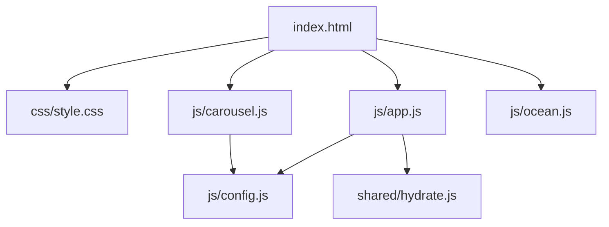
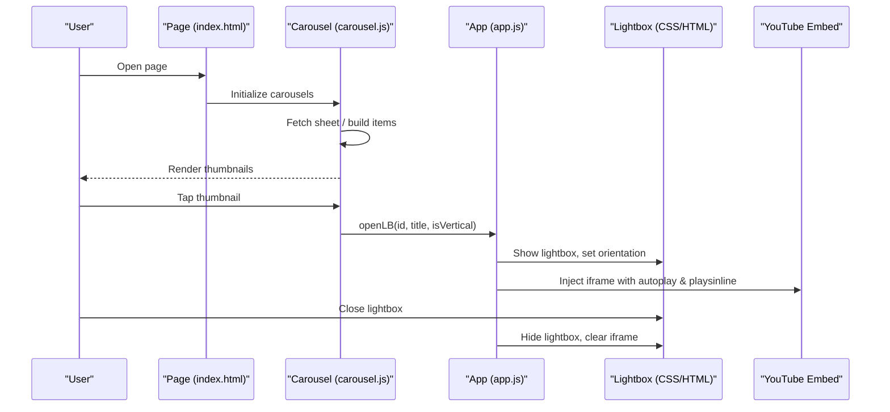
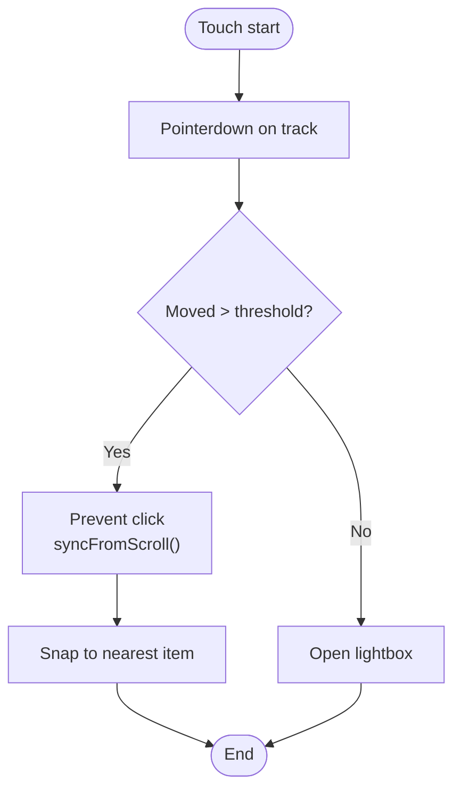
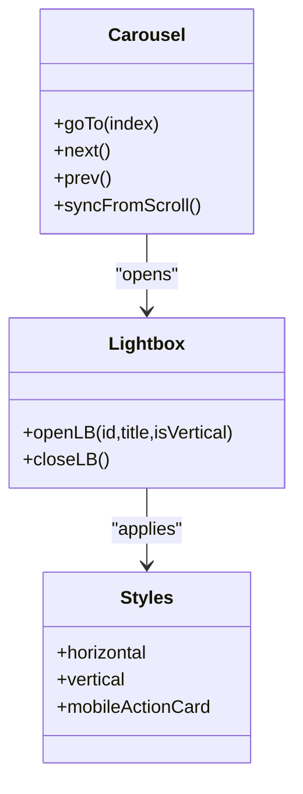
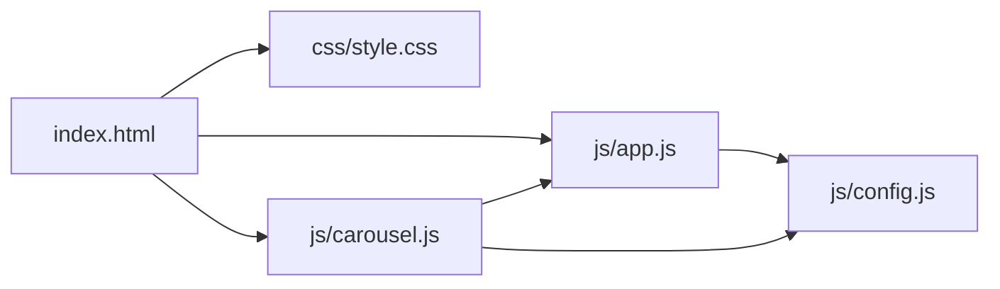

# Responsive Design and Mobile Optimization

<cite>
**Referenced Files in This Document**
- [index.html](file://index.html)
- [style.css](file://css/style.css)
- [app.js](file://js/app.js)
- [carousel.js](file://js/carousel.js)
- [config.js](file://js/config.js)
- [ocean.js](file://js/ocean.js)
- [hydrate.js](file://shared/hydrate.js)
</cite>

## Table of Contents
1. Introduction
2. Project Structure
3. Core Components
4. Architecture Overview
5. Detailed Component Analysis
6. Dependency Analysis
7. Performance Considerations
8. Troubleshooting Guide
9. Conclusion
10. Appendices

## Introduction
This document explains how the portfolio system implements responsive design and mobile optimization with a mobile-first approach. It covers CSS media queries, flexible layouts, touch-optimized interactions, video gallery adaptation across screen sizes, lightbox behavior on mobile, device capability detection, advanced animations, performance optimizations (reduced motion, lazy loading, memory management), and testing strategies for cross-device compatibility.

## Project Structure
The site is built around a single-page layout with:
- A responsive stylesheet that defines base styles and media-query breakpoints for grids, carousels, modals, and typography.
- JavaScript modules that handle content loading, carousel navigation, lightbox playback, smooth scrolling, and animation orchestration.
- Configuration that drives content sources (Google Sheets or inline arrays) and contact links.

**Diagram sources**
- [index.html:1-362](file://index.html#L1-L362)
- [style.css:1-635](file://css/style.css#L1-L635)
- [app.js:1-210](file://js/app.js#L1-L210)
- [carousel.js:1-569](file://js/carousel.js#L1-L569)
- [config.js:1-129](file://js/config.js#L1-L129)
- [hydrate.js:55-98](file://shared/hydrate.js#L55-L98)

**Section sources**
- [index.html:1-362](file://index.html#L1-L362)
- [style.css:1-635](file://css/style.css#L1-L635)
- [app.js:1-210](file://js/app.js#L1-L210)
- [carousel.js:1-569](file://js/carousel.js#L1-L569)
- [config.js:1-129](file://js/config.js#L1-L129)
- [hydrate.js:55-98](file://shared/hydrate.js#L55-L98)

## Core Components
- Responsive grid and layout: Two-column grids for galleries and posters, collapsing to single column on small screens; fluid typography using clamp(); aspect-ratio-based cards for consistent proportions.
- Touch-optimized carousels: Native scroll-snap rails with inertia and rubber-banding; pointer events to prevent accidental lightbox triggers after swipes; responsive navigation arrows and dots.
- Video lightbox: Shared modal that adapts to horizontal and vertical videos; mobile-specific action card stacking and full-width CTA buttons.
- Smooth scrolling and animations: Lenis smooth scroll integrated with GSAP ScrollTrigger; reduced-motion preferences respected.
- Content loading: Dynamic rendering from Google Sheets with fallbacks; lazy-loaded thumbnails; poster images for website showcases.

**Section sources**
- [style.css:170-186](file://css/style.css#L170-L186)
- [style.css:425-477](file://css/style.css#L425-L477)
- [style.css:578-633](file://css/style.css#L578-L633)
- [style.css:240-303](file://css/style.css#L240-L303)
- [app.js:44-56](file://js/app.js#L44-L56)
- [app.js:58-93](file://js/app.js#L58-L93)
- [carousel.js:213-322](file://js/carousel.js#L213-L322)
- [carousel.js:351-463](file://js/carousel.js#L351-L463)

## Architecture Overview
The page loads configuration and assets, then initializes interactive features. Carousels fetch data, render items, and wire up click handlers to open a shared lightbox. The lightbox injects an embedded player and a call-to-action. Smooth scrolling and animations are enabled conditionally based on user preferences and feature availability.

**Diagram sources**
- [carousel.js:351-463](file://js/carousel.js#L351-L463)
- [app.js:146-188](file://js/app.js#L146-L188)
- [style.css:240-303](file://css/style.css#L240-L303)
- [index.html:332-339](file://index.html#L332-L339)

## Detailed Component Analysis

### Responsive Grids and Layouts
- Base two-column grid for galleries and posters; collapses to one column at small widths.
- Fluid typography via clamp() for headings and section titles.
- Aspect-ratio cards ensure consistent visual rhythm regardless of screen size.
- Media queries adjust gaps, padding, and font sizes for readability on phones.

Key behaviors:
- Gallery grid uses two columns by default and switches to one column below a threshold.
- Wedding sites and AI builds grids switch to single column on small screens.
- Typography scales down on smaller viewports while maintaining hierarchy.

**Section sources**
- [style.css:170-186](file://css/style.css#L170-L186)
- [style.css:514-577](file://css/style.css#L514-L577)
- [style.css:150-155](file://css/style.css#L150-L155)

### Touch-Optimized Carousels
- Uses native CSS scroll-snap with pan gestures for smooth, inertial swiping.
- Pointer event handling prevents lightbox opening after a swipe gesture.
- Navigation arrows and dots update based on actual scroll position.
- Responsive arrow sizing and positioning for tablets and phones.

**Diagram sources**
- [carousel.js:239-248](file://js/carousel.js#L239-L248)
- [carousel.js:281-302](file://js/carousel.js#L281-L302)
- [style.css:425-477](file://css/style.css#L425-L477)

**Section sources**
- [carousel.js:213-322](file://js/carousel.js#L213-L322)
- [style.css:425-477](file://css/style.css#L425-L477)

### Video Gallery Adaptation and Lightbox Behavior
- Thumbnails use YouTube-generated images with lazy loading to reduce initial payload.
- Lightbox supports both horizontal and vertical orientations; CSS classes adjust aspect ratio and wrapper width.
- On mobile, the action card stacks vertically and the WhatsApp CTA becomes full-width for easier tapping.
- Embedded players use autoplay, muted where appropriate, and playsinline for iOS.

**Diagram sources**
- [carousel.js:213-322](file://js/carousel.js#L213-L322)
- [app.js:146-188](file://js/app.js#L146-L188)
- [style.css:240-303](file://css/style.css#L240-L303)

**Section sources**
- [carousel.js:351-463](file://js/carousel.js#L351-L463)
- [app.js:146-188](file://js/app.js#L146-L188)
- [style.css:240-303](file://css/style.css#L240-L303)

### Breakpoints and Adaptive Image Loading
Breakpoints observed in the stylesheet:
- 520px–560px: Single-column grids for wedding sites and AI builds; adjustments for invitation carousel item widths.
- 560px+: Increased max container width and refined spacing.
- 640px: Lightbox action card stacks vertically; close button sizing adjusted.
- 768px: Carousel navigation sizing and spacing adjustments; vertical video play button sizing.

Adaptive image loading:
- Thumbnails loaded lazily to defer offscreen resources.
- Poster images used for website showcases when embedding is blocked.
- Optional DPR-aware asset selection logic exists in shared hydration utilities for other contexts.

**Section sources**
- [style.css:550-577](file://css/style.css#L550-L577)
- [style.css:578-633](file://css/style.css#L578-L633)
- [style.css:297-303](file://css/style.css#L297-L303)
- [style.css:468-477](file://css/style.css#L468-L477)
- [carousel.js:361-373](file://js/carousel.js#L361-L373)
- [hydrate.js:55-98](file://shared/hydrate.js#L55-L98)

### Device Capabilities Detection and Feature Detection
- Reduced motion preference disables smooth scrolling and animations when requested by the OS.
- Hover detection gates cursor effects and magnetic interactions to desktop-only experiences.
- Lenis smooth scrolling is initialized only when supported and not reduced-motion.
- IntersectionObserver usage in related components ensures heavy work runs only when visible.

Practical examples:
- Smooth scroll disabled under reduced motion.
- Cursor glow and magnetic buttons only active on hover-capable devices.
- Animations and transitions suppressed under reduced motion.

**Section sources**
- [app.js:44-56](file://js/app.js#L44-L56)
- [app.js:126-141](file://js/app.js#L126-L141)
- [style.css:314-316](file://css/style.css#L314-L316)

### Performance Optimizations
- Lazy loading of thumbnails reduces initial bandwidth and improves Time to Interactive.
- Playsinline and modest branding on embedded players optimize mobile playback behavior.
- Reduced motion support respects user preferences to avoid unnecessary CPU/GPU usage.
- Passive scroll listeners improve scroll responsiveness.
- Deferred initialization of heavy features until DOM ready and libraries loaded.

Examples:
- Lazy attributes on dynamically created images.
- Conditional smooth scrolling based on reduced motion.
- Passive event listeners for scroll and pointer interactions.

**Section sources**
- [carousel.js:361-373](file://js/carousel.js#L361-L373)
- [app.js:44-56](file://js/app.js#L44-L56)
- [app.js:231-248](file://js/carousel.js#L231-L248)
- [style.css:314-316](file://css/style.css#L314-L316)

### Testing Approaches for Cross-Device Compatibility
Recommended practices grounded in the codebase:
- Use browser DevTools device emulation to verify breakpoints at 520px, 560px, 640px, and 768px.
- Test touch interactions (swipe, tap) to confirm carousel snap and lightbox gating after drag.
- Validate reduced motion behavior by enabling OS-level preferences and confirming animations are disabled.
- Check lazy loading by throttling network and observing deferred thumbnail loads.
- Verify lightbox orientation switching between horizontal and vertical videos on portrait and landscape modes.

[No sources needed since this section provides general guidance]

## Dependency Analysis
- index.html wires up styles and scripts, including GSAP, Lenis, and custom modules.
- app.js depends on config.js for contact and social links; it also exposes openLB for carousel.js to reuse.
- carousel.js depends on config.js for content sources and calls openLB from app.js.
- style.css provides all responsive rules consumed by HTML structure and JS-driven classes.

**Diagram sources**
- [index.html:352-359](file://index.html#L352-L359)
- [app.js:1-210](file://js/app.js#L1-L210)
- [carousel.js:1-569](file://js/carousel.js#L1-L569)
- [config.js:1-129](file://js/config.js#L1-L129)

**Section sources**
- [index.html:352-359](file://index.html#L352-L359)
- [app.js:1-210](file://js/app.js#L1-L210)
- [carousel.js:1-569](file://js/carousel.js#L1-L569)
- [config.js:1-129](file://js/config.js#L1-L129)

## Performance Considerations
- Prefer lazy loading for offscreen images and defer heavy initialization until necessary.
- Respect prefers-reduced-motion to minimize CPU/GPU usage on low-power devices.
- Use passive event listeners for scroll and pointer events to keep UI responsive.
- Avoid heavy animations on mobile; rely on CSS transforms and will-change sparingly.
- Ensure embedded players use minimal parameters (autoplay, muted, playsinline) to reduce overhead.

[No sources needed since this section provides general guidance]

## Troubleshooting Guide
Common issues and resolutions:
- Carousels not snapping: Ensure CSS scroll-snap properties are applied and items have correct dimensions; check pointer event handling to avoid click conflicts after swipes.
- Lightbox not closing: Confirm close handler is attached and ESC key listener clears modals; verify lenis state is restored.
- Videos not playing inline on iOS: Ensure playsinline is set and autoplay is allowed per browser policy; consider user gesture requirements.
- Excessive animations causing lag: Verify reduced motion settings disable animations; review GSAP timelines and ScrollTrigger configurations.

**Section sources**
- [carousel.js:239-248](file://js/carousel.js#L239-L248)
- [app.js:183-188](file://js/app.js#L183-L188)
- [app.js:208-210](file://js/app.js#L208-L210)
- [style.css:314-316](file://css/style.css#L314-L316)

## Conclusion
The portfolio employs a robust mobile-first strategy with responsive grids, touch-optimized carousels, adaptive lightboxes, and careful performance tuning. Breakpoints and media queries ensure readability and usability across devices. Device and feature detection enable graceful degradation and respect for user preferences. Together, these patterns deliver a fast, accessible, and engaging experience on mobile and desktop.

[No sources needed since this section summarizes without analyzing specific files]

## Appendices

### Key Responsive Breakpoints Summary
- 520px–560px: Single-column grids for site showcases; invitation carousel item sizing adjustments.
- 640px: Lightbox action card stacks vertically; close button sizing optimized for touch.
- 768px: Carousel navigation sizing and spacing; vertical video play button sizing.

**Section sources**
- [style.css:550-577](file://css/style.css#L550-L577)
- [style.css:578-633](file://css/style.css#L578-L633)
- [style.css:297-303](file://css/style.css#L297-L303)
- [style.css:468-477](file://css/style.css#L468-L477)