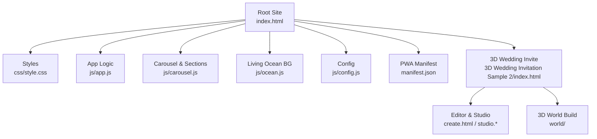
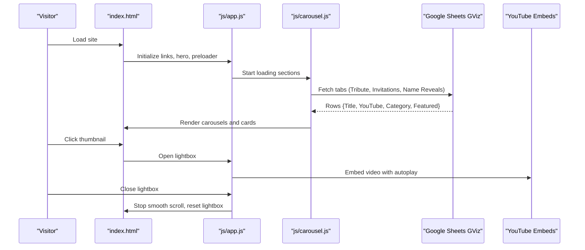
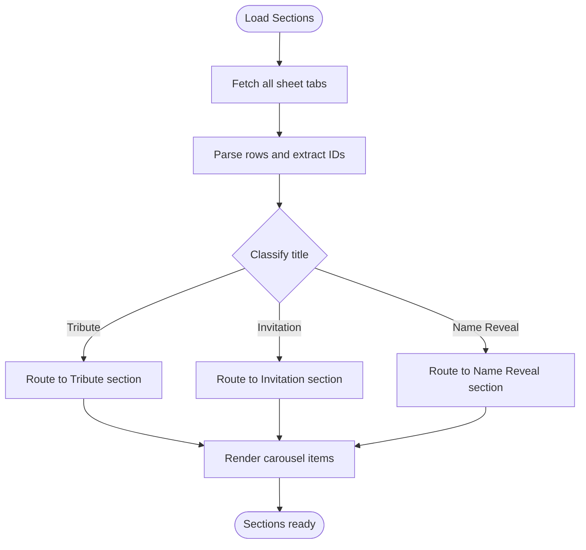
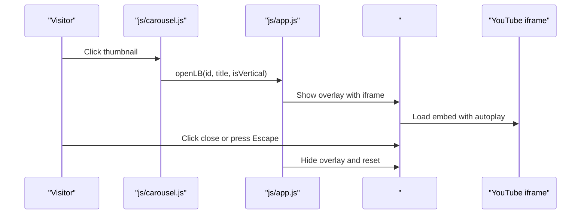
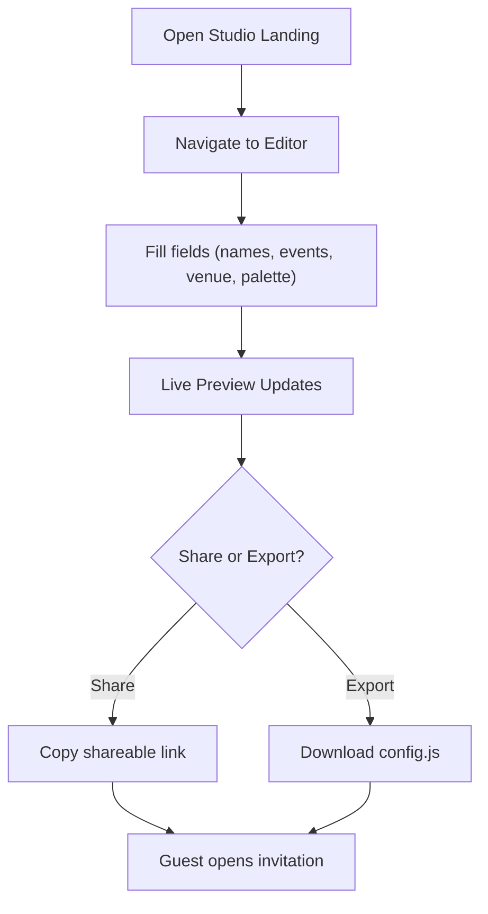
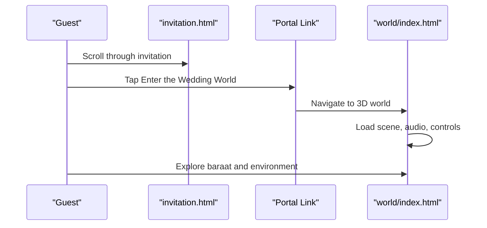
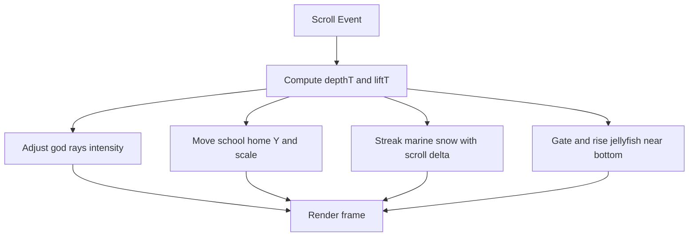
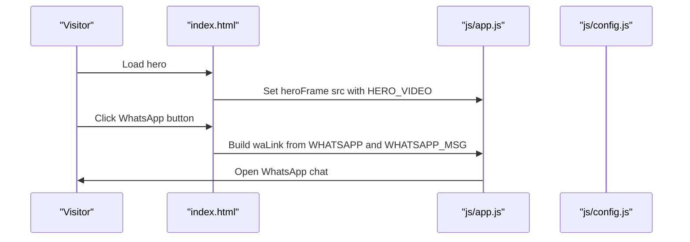
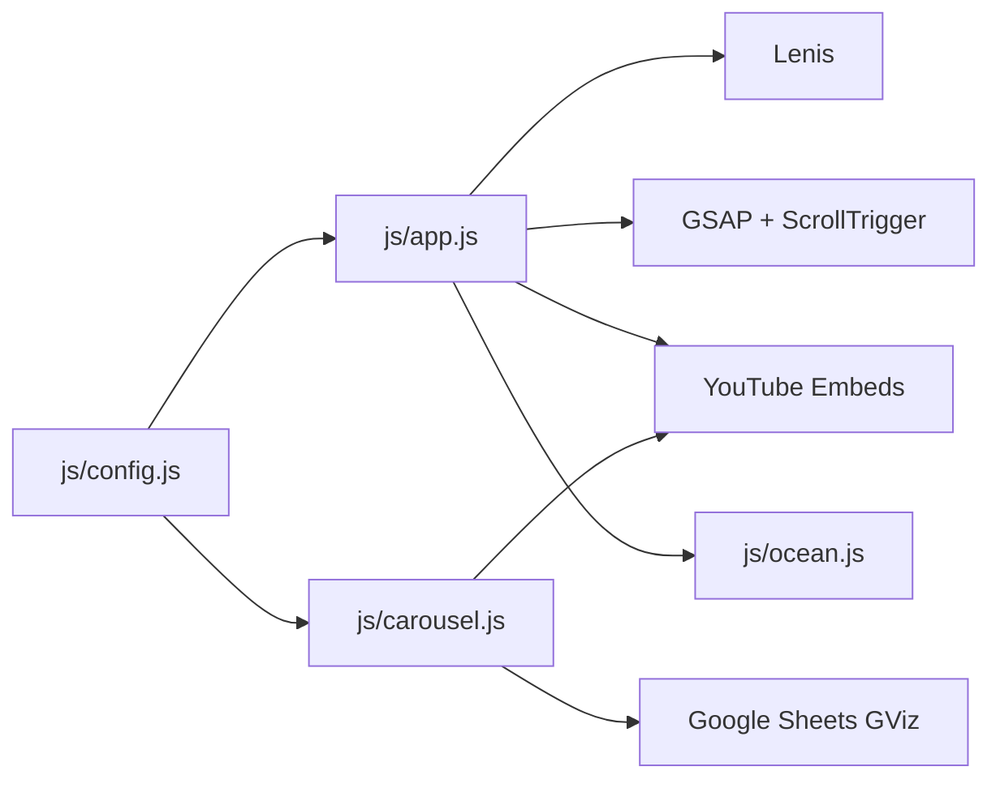

# Project Overview & Introduction

<cite>
**Referenced Files in This Document**
- [README.md](file://README.md)
- [index.html](file://index.html)
- [css/style.css](file://css/style.css)
- [js/config.js](file://js/config.js)
- [js/app.js](file://js/app.js)
- [js/carousel.js](file://js/carousel.js)
- [js/ocean.js](file://js/ocean.js)
- [manifest.json](file://manifest.json)
- [3D Wedding Invitation Sample 2/README.md](file://3D%20Wedding%20Invitation%20Sample%202/README.md)
- [3D Wedding Invitation Sample 2/index.html](file://3D%20Wedding%20Invitation%20Sample%202/index.html)
</cite>

## Table of Contents
1. [Introduction](#introduction)
2. [Project Structure](#project-structure)
3. [Core Components](#core-components)
4. [Architecture Overview](#architecture-overview)
5. [Detailed Component Analysis](#detailed-component-analysis)
6. [Dependency Analysis](#dependency-analysis)
7. [Performance Considerations](#performance-considerations)
8. [Troubleshooting Guide](#troubleshooting-guide)
9. [Conclusion](#conclusion)
10. [Appendices](#appendices)

## Introduction
DeepDreams AI Studio Portfolio is a premium, mobile-first website that showcases cinematic tribute AI videos and related services. The site pulls live content from a Google Sheet so you can update the gallery from your phone without redeploying code. It includes:
- A hero section with an autoplaying featured video
- Multiple video galleries (tribute films, wedding invitation videos, name reveal videos)
- Interactive sections for wedding websites and AI solutions
- A no-code editing experience via a separate studio/editor module
- An immersive 3D wedding invitation world accessible from the invitation flow

The stack is intentionally lightweight and modern: HTML + CSS + vanilla JavaScript, GSAP with ScrollTrigger for animations, Lenis for smooth scrolling, YouTube embeds for playback, and a canvas-based living ocean background. Deployment is simple: drag-and-drop to Netlify or any static host.

[No sources needed since this section summarizes without analyzing specific files]

## Project Structure
At a high level, the portfolio is organized into:
- Root site: index.html, css/style.css, js/config.js, js/app.js, js/carousel.js, js/ocean.js, manifest.json
- 3D Wedding Invitation sample: a self-contained subproject under 3D Wedding Invitation Sample 2 with its own README, index.html, editor, and world build
- Supporting assets and configuration files for deployment and metadata

**Diagram sources**
- [index.html:1-362](file://index.html#L1-L362)
- [css/style.css:1-635](file://css/style.css#L1-L635)
- [js/app.js:1-210](file://js/app.js#L1-L210)
- [js/carousel.js:1-569](file://js/carousel.js#L1-L569)
- [js/ocean.js:1-642](file://js/ocean.js#L1-L642)
- [js/config.js:1-129](file://js/config.js#L1-L129)
- [manifest.json:1-25](file://manifest.json#L1-L25)
- [3D Wedding Invitation Sample 2/index.html:1-402](file://3D%20Wedding%20Invitation%20Sample%202/index.html#L1-L402)

**Section sources**
- [README.md:1-66](file://README.md#L1-L66)
- [index.html:1-362](file://index.html#L1-L362)

## Core Components
- Live content feed from Google Sheets GViz: All video galleries are driven by one or more tabs in a single sheet. Titles and categories are normalized and routed automatically to the correct section.
- Video carousel system: Native scroll-snap carousels with arrow navigation and dot indicators; lightbox playback with smart WhatsApp CTAs.
- No-code editing: A studio landing page and editor allow creating and previewing wedding invitations without writing code.
- 3D wedding invitation experience: A scroll-driven invitation ends at a gateway to a separately loaded 3D world built with Three.js.
- Smooth interactions: Lenis smooth scroll, GSAP entrance animations, and a living ocean canvas background.

Key capabilities demonstrated:
- Add a new video row on your phone in Google Sheets and see it appear on the site immediately.
- Click any thumbnail to open a lightbox and request a similar style via WhatsApp with a pre-filled message.
- Explore interactive wedding website samples and concept AI builds directly from the portfolio.
- Launch the 3D world from the invitation flow after experiencing the scroll-cinema.

**Section sources**
- [js/config.js:20-129](file://js/config.js#L20-L129)
- [js/carousel.js:151-205](file://js/carousel.js#L151-L205)
- [js/app.js:146-188](file://js/app.js#L146-L188)
- [3D Wedding Invitation Sample 2/README.md:1-115](file://3D%20Wedding%20Invitation%20Sample%202/README.md#L1-L115)

## Architecture Overview
The site follows a clear separation between presentation, behavior, and data:
- Presentation: index.html defines sections for hero, marquee, galleries, services, about, contact, and footer. Styles in css/style.css provide a dark, cinematic theme with responsive layouts.
- Behavior: js/app.js wires up links, hero video, preloader, Lenis smooth scroll, GSAP animations, header state, lightbox, UPI modal, and marquee. js/carousel.js fetches and routes sheet data, renders carousels, and manages interactions.
- Data: js/config.js centralizes all editable settings including Google Sheet ID and tab names, hero video, and showcase arrays.
- Background: js/ocean.js renders a full-screen animated canvas with fish, snow, rays, and jellyfish, responding to scroll depth.
- PWA: manifest.json enables installability and sets app metadata.

**Diagram sources**
- [index.html:63-115](file://index.html#L63-L115)
- [js/app.js:26-41](file://js/app.js#L26-L41)
- [js/carousel.js:151-205](file://js/carousel.js#L151-L205)
- [js/app.js:146-188](file://js/app.js#L146-L188)

## Detailed Component Analysis

### Live Content Feed and Section Routing
- Single source of truth: One Google Sheet with multiple tabs drives all galleries. Headers define columns per collection.
- Title normalization and classification: Titles are cleaned and mapped to editorial wording; films are classified into Tribute, Invitation, or Name Reveal based on keywords.
- Robust fallbacks: If a sheet tab fails or is empty, inline arrays in config.js can be used as fallbacks.

**Diagram sources**
- [js/carousel.js:151-205](file://js/carousel.js#L151-L205)
- [js/config.js:20-129](file://js/config.js#L20-L129)

**Section sources**
- [js/carousel.js:50-141](file://js/carousel.js#L50-L141)
- [js/carousel.js:151-205](file://js/carousel.js#L151-L205)
- [js/config.js:20-129](file://js/config.js#L20-L129)

### Video Gallery System and Lightbox
- Carousels use native scroll-snap for smooth, performant horizontal swiping with arrow buttons and dot indicators.
- Lightbox supports both horizontal and vertical aspect ratios and integrates a smart WhatsApp CTA that references the selected video title.
- Thumbnails are sourced from YouTube image endpoints; titles are sanitized before rendering.

**Diagram sources**
- [js/carousel.js:324-334](file://js/carousel.js#L324-L334)
- [js/app.js:146-188](file://js/app.js#L146-L188)

**Section sources**
- [js/carousel.js:213-322](file://js/carousel.js#L213-L322)
- [js/app.js:146-188](file://js/app.js#L146-L188)
- [css/style.css:240-303](file://css/style.css#L240-L303)

### No-Code Editing Capabilities (Studio and Editor)
- Studio landing page introduces the product and provides access to the editor and live demo.
- Editor allows users to fill in names, muhurat, events, venue, palette, and RSVP link, then preview changes live.
- Drafts are saved locally; sharing is supported via URL parameters or downloadable config.

**Diagram sources**
- [3D Wedding Invitation Sample 2/index.html:48-66](file://3D%20Wedding%20Invitation%20Sample%202/index.html#L48-L66)
- [3D Wedding Invitation Sample 2/README.md:37-48](file://3D%20Wedding%20Invitation%20Sample%202/README.md#L37-L48)

**Section sources**
- [3D Wedding Invitation Sample 2/README.md:37-48](file://3D%20Wedding%20Invitation%20Sample%202/README.md#L37-L48)
- [3D Wedding Invitation Sample 2/index.html:48-66](file://3D%20Wedding%20Invitation%20Sample%202/index.html#L48-L66)

### 3D Wedding Invitation Experience
- The invitation is a scroll-driven cinematic experience ending at a gateway to a 3D world.
- The 3D world is a separate Vite-built project loaded only when the user chooses to enter, keeping the invitation lightweight.
- Sound handoff is managed carefully to respect mobile audio policies and reduce motion preferences.

**Diagram sources**
- [3D Wedding Invitation Sample 2/README.md:49-65](file://3D%20Wedding%20Invitation%20Sample%202/README.md#L49-L65)
- [3D Wedding Invitation Sample 2/index.html:199-225](file://3D%20Wedding%20Invitation%20Sample%202/index.html#L199-L225)

**Section sources**
- [3D Wedding Invitation Sample 2/README.md:49-65](file://3D%20Wedding%20Invitation%20Sample%202/README.md#L49-L65)
- [3D Wedding Invitation Sample 2/index.html:199-225](file://3D%20Wedding%20Invitation%20Sample%202/index.html#L199-L225)

### Living Ocean Background and Animations
- The ocean canvas renders volumetric light rays, marine snow, a school of fish, and bioluminescent jellyfish.
- Scroll depth drives descent: surface light dims, rays recede, fish dive, and jellyfish bloom near the bottom.
- Interactions: pointer/touch startles the school; reduced-motion mode keeps a calm, static frame.

**Diagram sources**
- [js/ocean.js:57-78](file://js/ocean.js#L57-L78)
- [js/ocean.js:453-609](file://js/ocean.js#L453-L609)

**Section sources**
- [js/ocean.js:1-26](file://js/ocean.js#L1-L26)
- [js/ocean.js:57-78](file://js/ocean.js#L57-L78)
- [js/ocean.js:453-609](file://js/ocean.js#L453-L609)

### Hero, Marquee, and Contact Integrations
- Hero features a featured video embedded via YouTube nocookie, with autoplay muted and looping.
- Marquee displays service tags for quick scanning.
- Contact section wires WhatsApp, email, Instagram, YouTube, and UPI payment flows using config values.

**Diagram sources**
- [index.html:63-88](file://index.html#L63-L88)
- [js/app.js:18-29](file://js/app.js#L18-L29)
- [js/config.js:116-128](file://js/config.js#L116-L128)

**Section sources**
- [index.html:63-88](file://index.html#L63-L88)
- [js/app.js:18-29](file://js/app.js#L18-L29)
- [js/config.js:116-128](file://js/config.js#L116-L128)

## Dependency Analysis
- External libraries:
  - Lenis for smooth scrolling
  - GSAP and ScrollTrigger for animations
  - YouTube embeds for video playback
- Internal modules:
  - config.js supplies runtime settings consumed by app.js and carousel.js
  - app.js orchestrates UI behaviors and exposes shared functions
  - carousel.js handles data fetching, rendering, and interaction logic
  - ocean.js provides background visuals independent of other modules

**Diagram sources**
- [index.html:352-359](file://index.html#L352-L359)
- [js/app.js:44-56](file://js/app.js#L44-L56)
- [js/carousel.js:151-159](file://js/carousel.js#L151-L159)
- [js/config.js:20-129](file://js/config.js#L20-L129)

**Section sources**
- [index.html:352-359](file://index.html#L352-L359)
- [js/app.js:44-56](file://js/app.js#L44-L56)
- [js/carousel.js:151-159](file://js/carousel.js#L151-L159)
- [js/config.js:20-129](file://js/config.js#L20-L129)

## Performance Considerations
- Lightweight stack: Vanilla JS, minimal dependencies, and lazy loading of heavy components (e.g., 3D world).
- Efficient carousels: Native scroll-snap avoids custom animation overhead and delivers smooth touch interactions.
- Adaptive visuals: Reduced-motion support ensures accessibility and performance on constrained devices.
- Optimized media: YouTube embeds offload video decoding; posters and thumbnails are used where appropriate.
- Deferred 3D load: The 3D world is loaded only when the user enters the portal, preserving initial page speed.

[No sources needed since this section provides general guidance]

## Troubleshooting Guide
- Videos not loading:
  - Ensure the Google Sheet is published and shared as “Anyone with the link” viewer.
  - Verify SHEET_ID and tab names in config.js match your sheet structure.
  - Check browser console for errors from the GViz fetch.
- Sections hidden unexpectedly:
  - If a section has no matching videos, it hides itself to avoid showing unrelated content.
  - Add correctly titled entries to the appropriate sheet tab or populate inline fallback arrays in config.js.
- Lightbox issues:
  - Confirm YouTube IDs are valid and extracted correctly.
  - Ensure the lightbox container exists in the DOM before opening.
- Smooth scroll not working:
  - Lenis initializes only if available and reduced-motion is not preferred.
  - Anchor links rely on Lenis; ensure Lenis is loaded before anchor clicks.
- 3D world not loading:
  - The world is a separate build; verify the world path and that the server serves static assets correctly.
  - Mobile browsers require a user gesture to unlock audio; the invitation handles first-gesture retries.

**Section sources**
- [js/carousel.js:151-159](file://js/carousel.js#L151-L159)
- [js/carousel.js:351-383](file://js/carousel.js#L351-L383)
- [js/app.js:146-188](file://js/app.js#L146-L188)
- [3D Wedding Invitation Sample 2/README.md:49-65](file://3D%20Wedding%20Invitation%20Sample%202/README.md#L49-L65)

## Conclusion
The DeepDreams AI Studio Portfolio combines a clean, mobile-first design with powerful, no-code content management via Google Sheets. It delivers a rich viewing experience through carousels, lightboxes, and animations, while offering advanced capabilities like a no-code editor and an immersive 3D wedding invitation world. The architecture is modular and easy to extend, making it suitable for showcasing creative work and converting visitors into clients.

[No sources needed since this section summarizes without analyzing specific files]

## Appendices

### Technology Stack Summary
- Frontend: HTML, CSS, vanilla JavaScript
- Animation: GSAP + ScrollTrigger
- Smooth scrolling: Lenis
- Media: YouTube nocookie embeds
- Background: Canvas-based living ocean
- PWA: manifest.json for installability
- Deployment: Static hosting (Netlify recommended)

**Section sources**
- [README.md:50-55](file://README.md#L50-L55)
- [index.html:352-359](file://index.html#L352-L359)
- [manifest.json:1-25](file://manifest.json#L1-L25)

### Quick Start Checklist
- Place logo in assets/logo.png
- Edit js/config.js with contact info, social links, and Google Sheet details
- Create a Google Sheet with required headers per tab and publish to web
- Preview locally using a static server
- Deploy to Netlify by dragging the folder

**Section sources**
- [README.md:22-51](file://README.md#L22-L51)
- [js/config.js:20-129](file://js/config.js#L20-L129)