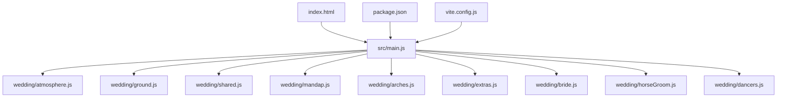
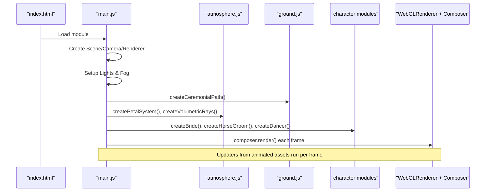
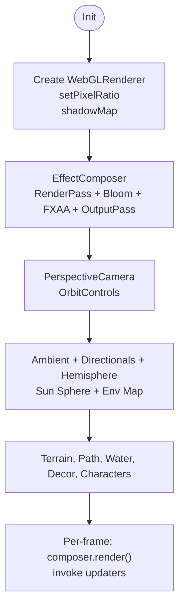
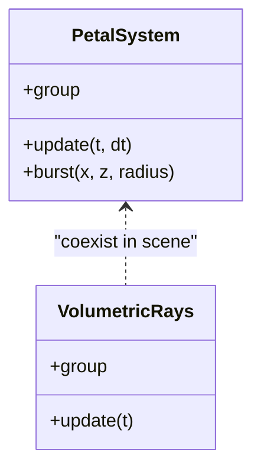
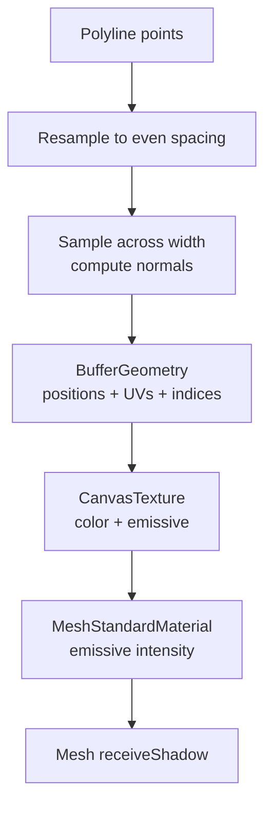
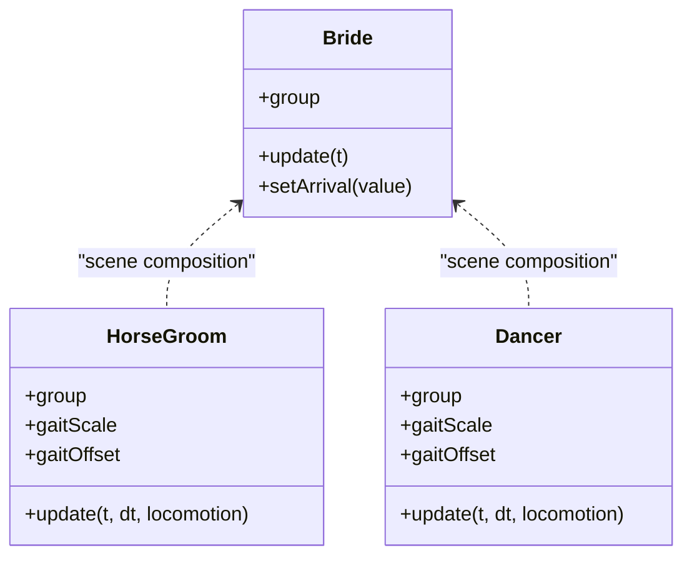
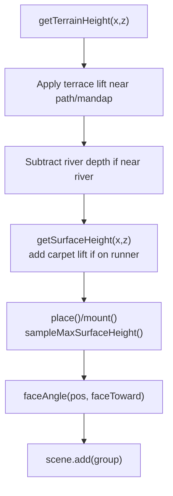
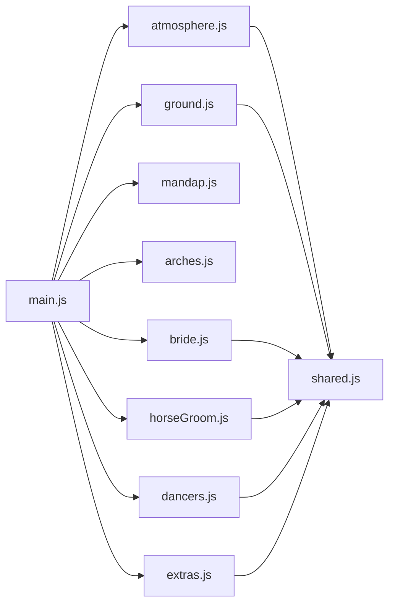

# 3D Scene Architecture

<cite>
**Referenced Files in This Document**
- [main.js](file://3D Wedding Invitation Sample 2/3d-world-source/src/main.js)
- [atmosphere.js](file://3D Wedding Invitation Sample 2/3d-world-source/src/wedding/atmosphere.js)
- [ground.js](file://3D Wedding Invitation Sample 2/3d-world-source/src/wedding/ground.js)
- [shared.js](file://3D Wedding Invitation Sample 2/3d-world-source/src/wedding/shared.js)
- [mandap.js](file://3D Wedding Invitation Sample 2/3d-world-source/src/wedding/mandap.js)
- [arches.js](file://3D Wedding Invitation Sample 2/3d-world-source/src/wedding/arches.js)
- [extras.js](file://3D Wedding Invitation Sample 2/3d-world-source/src/wedding/extras.js)
- [bride.js](file://3D Wedding Invitation Sample 2/3d-world-source/src/wedding/bride.js)
- [horseGroom.js](file://3D Wedding Invitation Sample 2/3d-world-source/src/wedding/horseGroom.js)
- [dancers.js](file://3D Wedding Invitation Sample 2/3d-world-source/src/wedding/dancers.js)
- [index.html](file://3D Wedding Invitation Sample 2/3d-world-source/index.html)
- [package.json](file://3D Wedding Invitation Sample 2/3d-world-source/package.json)
- [vite.config.js](file://3D Wedding Invitation Sample 2/3d-world-source/vite.config.js)
</cite>

## Table of Contents
1. [Introduction](#introduction)
2. [Project Structure](#project-structure)
3. [Core Components](#core-components)
4. [Architecture Overview](#architecture-overview)
5. [Detailed Component Analysis](#detailed-component-analysis)
6. [Dependency Analysis](#dependency-analysis)
7. [Performance Considerations](#performance-considerations)
8. [Troubleshooting Guide](#troubleshooting-guide)
9. [Conclusion](#conclusion)
10. [Appendices](#appendices)

## Introduction
This document explains the Three.js-based 3D scene architecture for a cinematic Indian wedding world. It covers scene initialization, camera and lighting setup, render loop management, modular components (atmosphere, ground, characters), performance optimizations (adaptive quality, object pooling via instancing, memory-conscious materials), WebGL context handling, shader usage, and GPU resource management. It also provides guidance on extending the scene with new components and optimizing for different device capabilities.

## Project Structure
The project is organized around a central main module that composes the scene, plus feature modules for atmosphere, ground, decorations, and character assets. The HTML entry mounts the renderer into a root container and wires UI overlays. Build configuration supports both standard distribution and single-file builds.

**Diagram sources**
- [index.html:259-259](file://3D Wedding Invitation Sample 2/3d-world-source/index.html#L259-L259)
- [main.js:1-23](file://3D Wedding Invitation Sample 2/3d-world-source/src/main.js#L1-L23)
- [package.json:13-19](file://3D Wedding Invitation Sample 2/3d-world-source/package.json#L13-L19)
- [vite.config.js:1-19](file://3D Wedding Invitation Sample 2/3d-world-source/vite.config.js#L1-L19)

**Section sources**
- [index.html:259-259](file://3D Wedding Invitation Sample 2/3d-world-source/index.html#L259-L259)
- [main.js:1-23](file://3D Wedding Invitation Sample 2/3d-world-source/src/main.js#L1-L23)
- [package.json:13-19](file://3D Wedding Invitation Sample 2/3d-world-source/package.json#L13-L19)
- [vite.config.js:1-19](file://3D Wedding Invitation Sample 2/3d-world-source/vite.config.js#L1-L19)

## Core Components
- Scene director and runtime state: layout definitions, procession timing, mobile detection, and updater registry.
- Renderer, post-processing, and controls: WebGLRenderer, EffectComposer passes, OrbitControls tuned per device class.
- Lighting rig: ambient, directional key/fill/rim, hemisphere light, sun sphere, environment map.
- Terrain and water: procedural heightfield, river streams, lake with reflective ring, polygon offset to avoid z-fighting.
- Ground dressing: ceremonial runner path and rangoli medallion with emissive glow maps.
- Atmosphere effects: petal system using InstancedMesh and volumetric rays using additive quads and gradient textures.
- Characters and props: mandap, arches, extras (plane banner, swans, money fountain, firework), bride, horse/groom, dancers.
- Shared palette: centralized color constants for consistent material design.

**Section sources**
- [main.js:111-188](file://3D Wedding Invitation Sample 2/3d-world-source/src/main.js#L111-L188)
- [main.js:190-271](file://3D Wedding Invitation Sample 2/3d-world-source/src/main.js#L190-L271)
- [main.js:276-631](file://3D Wedding Invitation Sample 2/3d-world-source/src/main.js#L276-L631)
- [ground.js:113-192](file://3D Wedding Invitation Sample 2/3d-world-source/src/wedding/ground.js#L113-L192)
- [ground.js:293-316](file://3D Wedding Invitation Sample 2/3d-world-source/src/wedding/ground.js#L293-L316)
- [atmosphere.js:38-205](file://3D Wedding Invitation Sample 2/3d-world-source/src/wedding/atmosphere.js#L38-L205)
- [atmosphere.js:212-328](file://3D Wedding Invitation Sample 2/3d-world-source/src/wedding/atmosphere.js#L212-L328)
- [mandap.js:10-261](file://3D Wedding Invitation Sample 2/3d-world-source/src/wedding/mandap.js#L10-L261)
- [arches.js:62-177](file://3D Wedding Invitation Sample 2/3d-world-source/src/wedding/arches.js#L62-L177)
- [extras.js:47-112](file://3D Wedding Invitation Sample 2/3d-world-source/src/wedding/extras.js#L47-L112)
- [extras.js:119-147](file://3D Wedding Invitation Sample 2/3d-world-source/src/wedding/extras.js#L119-L147)
- [extras.js:153-202](file://3D Wedding Invitation Sample 2/3d-world-source/src/wedding/extras.js#L153-L202)
- [extras.js:208-257](file://3D Wedding Invitation Sample 2/3d-world-source/src/wedding/extras.js#L208-L257)
- [bride.js:12-273](file://3D Wedding Invitation Sample 2/3d-world-source/src/wedding/bride.js#L12-L273)
- [horseGroom.js:9-303](file://3D Wedding Invitation Sample 2/3d-world-source/src/wedding/horseGroom.js#L9-L303)
- [dancers.js:104-329](file://3D Wedding Invitation Sample 2/3d-world-source/src/wedding/dancers.js#L104-L329)
- [shared.js:1-26](file://3D Wedding Invitation Sample 2/3d-world-source/src/wedding/shared.js#L1-L26)

## Architecture Overview
The scene follows a director-driven composition pattern:
- main.js initializes the renderer, camera, lights, terrain, and post-processing pipeline.
- Feature modules export builders that return groups and optional update functions.
- main.js places assets using helpers that compute surface heights and orientations along a defined path.
- Animated assets register updaters that are invoked each frame.
- Post-processing adds bloom and FXAA (desktop only), with output pass.

**Diagram sources**
- [main.js:138-188](file://3D Wedding Invitation Sample 2/3d-world-source/src/main.js#L138-L188)
- [ground.js:113-192](file://3D Wedding Invitation Sample 2/3d-world-source/src/wedding/ground.js#L113-L192)
- [atmosphere.js:38-205](file://3D Wedding Invitation Sample 2/3d-world-source/src/wedding/atmosphere.js#L38-L205)
- [bride.js:12-273](file://3D Wedding Invitation Sample 2/3d-world-source/src/wedding/bride.js#L12-L273)
- [horseGroom.js:9-303](file://3D Wedding Invitation Sample 2/3d-world-source/src/wedding/horseGroom.js#L9-L303)
- [dancers.js:104-329](file://3D Wedding Invitation Sample 2/3d-world-source/src/wedding/dancers.js#L104-L329)

## Detailed Component Analysis

### Scene Initialization, Camera, Lighting, and Render Loop
- Renderer and pixel ratio: adaptive pixel ratio capped for mobile; antialias disabled on mobile; shadow map enabled with PCF vs PCFSoft based on device class.
- Post-processing: EffectComposer with RenderPass, UnrealBloomPass, optional FXAAShader, OutputPass.
- Camera: PerspectiveCamera with intro framing and OrbitControls tuned for mobile/desktop.
- Lighting: Ambient, Directional key/fill/rim, HemisphereLight, sun sphere with glow, environment map used as background and environment.
- Render loop: Not shown explicitly here; typical requestAnimationFrame would call composer.render() and invoke registered updaters.

**Diagram sources**
- [main.js:138-188](file://3D Wedding Invitation Sample 2/3d-world-source/src/main.js#L138-L188)
- [main.js:190-271](file://3D Wedding Invitation Sample 2/3d-world-source/src/main.js#L190-L271)

**Section sources**
- [main.js:138-188](file://3D Wedding Invitation Sample 2/3d-world-source/src/main.js#L138-L188)
- [main.js:190-271](file://3D Wedding Invitation Sample 2/3d-world-source/src/main.js#L190-L271)

### Modular Component System

#### Atmosphere Effects
- Petal system: Single InstancedMesh of curled quads with per-instance color and motion; respawn at top when reaching ground; supports burst spawning.
- Volumetric rays: Additive-blended crossed quads with gradient texture; shimmer and sway; low cost.

**Diagram sources**
- [atmosphere.js:38-205](file://3D Wedding Invitation Sample 2/3d-world-source/src/wedding/atmosphere.js#L38-L205)
- [atmosphere.js:212-328](file://3D Wedding Invitation Sample 2/3d-world-source/src/wedding/atmosphere.js#L212-L328)

**Section sources**
- [atmosphere.js:38-205](file://3D Wedding Invitation Sample 2/3d-world-source/src/wedding/atmosphere.js#L38-L205)
- [atmosphere.js:212-328](file://3D Wedding Invitation Sample 2/3d-world-source/src/wedding/atmosphere.js#L212-L328)

#### Ground Rendering
- Ceremonial path: Procedural strip geometry following a polyline, sampled across width; textured with canvas-generated color and emissive maps; receives shadows.
- Rangoli medallion: Flat circular geometry with procedurally drawn texture and emissive mask; sits above ground with small clearance.

**Diagram sources**
- [ground.js:113-192](file://3D Wedding Invitation Sample 2/3d-world-source/src/wedding/ground.js#L113-L192)
- [ground.js:197-291](file://3D Wedding Invitation Sample 2/3d-world-source/src/wedding/ground.js#L197-L291)

**Section sources**
- [ground.js:113-192](file://3D Wedding Invitation Sample 2/3d-world-source/src/wedding/ground.js#L113-L192)
- [ground.js:293-316](file://3D Wedding Invitation Sample 2/3d-world-source/src/wedding/ground.js#L293-L316)

#### Character Management
- Bride: Detailed group with layered lehenga, jewelry, dupatta, garland; idle sway and arrival animation; returns { group, update }.
- Horse/Groom: Grouped horse with caparison and groom; distance-driven gait updates leg pivots; head/tail/breathing animations; returns { group, update, gaitScale, gaitOffset }.
- Dancers: Stylized low-poly humans with variant-driven dance animations; shared materials cached; returns { group, update, gaitScale, gaitOffset }.

**Diagram sources**
- [bride.js:12-273](file://3D Wedding Invitation Sample 2/3d-world-source/src/wedding/bride.js#L12-L273)
- [horseGroom.js:9-303](file://3D Wedding Invitation Sample 2/3d-world-source/src/wedding/horseGroom.js#L9-L303)
- [dancers.js:104-329](file://3D Wedding Invitation Sample 2/3d-world-source/src/wedding/dancers.js#L104-L329)

**Section sources**
- [bride.js:12-273](file://3D Wedding Invitation Sample 2/3d-world-source/src/wedding/bride.js#L12-L273)
- [horseGroom.js:9-303](file://3D Wedding Invitation Sample 2/3d-world-source/src/wedding/horseGroom.js#L9-L303)
- [dancers.js:104-329](file://3D Wedding Invitation Sample 2/3d-world-source/src/wedding/dancers.js#L104-L329)

#### Decorative Structures
- Mandap: Tiered plinth, carved pillars, domed canopy, cloth valance, garlands, kalash finial, agni fire vedi with emissive flames.
- Arches: Toran gate with cusped arch and garland valance; floral arch with vine skeleton and flower clusters; carved lamp-pillar with glowing flame.
- Extras: Plane banner with waving cloth; swans circling pond; money fountain using InstancedMesh; firework with rocket and sparks; team groom banner with waving cloth.

**Section sources**
- [mandap.js:10-261](file://3D Wedding Invitation Sample 2/3d-world-source/src/wedding/mandap.js#L10-L261)
- [arches.js:62-177](file://3D Wedding Invitation Sample 2/3d-world-source/src/wedding/arches.js#L62-L177)
- [arches.js:183-233](file://3D Wedding Invitation Sample 2/3d-world-source/src/wedding/arches.js#L183-L233)
- [arches.js:239-317](file://3D Wedding Invitation Sample 2/3d-world-source/src/wedding/arches.js#L239-L317)
- [extras.js:47-112](file://3D Wedding Invitation Sample 2/3d-world-source/src/wedding/extras.js#L47-L112)
- [extras.js:119-147](file://3D Wedding Invitation Sample 2/3d-world-source/src/wedding/extras.js#L119-L147)
- [extras.js:153-202](file://3D Wedding Invitation Sample 2/3d-world-source/src/wedding/extras.js#L153-L202)
- [extras.js:208-257](file://3D Wedding Invitation Sample 2/3d-world-source/src/wedding/extras.js#L208-L257)
- [extras.js:263-303](file://3D Wedding Invitation Sample 2/3d-world-source/src/wedding/extras.js#L263-L303)

### Data Flows and Processing Logic
- Surface height sampling: Base terrain function combines sine/cosine noise; raised terrace flattens corridor and mandap area; rivers carve depth; path proximity influences placement.
- Placement helpers: place() and mount() compute grounded positions and orientation; mount wraps animated assets to preserve grounding during local transforms.
- Path traversal: Polyline segments precomputed; samplePathCenter computes position and tangent; distanceAlongPathTo finds nearest segment; gate proximity affects lane scaling.
- Asset clearing: Avoid placing trees/rocks near path or other assets using blocked() checks.

**Diagram sources**
- [main.js:276-325](file://3D Wedding Invitation Sample 2/3d-world-source/src/main.js#L276-L325)
- [main.js:361-440](file://3D Wedding Invitation Sample 2/3d-world-source/src/main.js#L361-L440)
- [main.js:442-524](file://3D Wedding Invitation Sample 2/3d-world-source/src/main.js#L442-L524)

**Section sources**
- [main.js:276-325](file://3D Wedding Invitation Sample 2/3d-world-source/src/main.js#L276-L325)
- [main.js:361-440](file://3D Wedding Invitation Sample 2/3d-world-source/src/main.js#L361-L440)
- [main.js:442-524](file://3D Wedding Invitation Sample 2/3d-world-source/src/main.js#L442-L524)

## Dependency Analysis
- main.js depends on all wedding modules for asset creation and atmosphere parameters.
- atmosphere.js and ground.js depend on shared.js for color palette.
- Character modules depend on shared.js for skin/cloth colors and use THREE primitives/materials.
- Build tools: Vite config enables single-file build mode; package.json declares dependencies and scripts.

**Diagram sources**
- [main.js:1-23](file://3D Wedding Invitation Sample 2/3d-world-source/src/main.js#L1-L23)
- [atmosphere.js:1-3](file://3D Wedding Invitation Sample 2/3d-world-source/src/wedding/atmosphere.js#L1-L3)
- [ground.js:1-5](file://3D Wedding Invitation Sample 2/3d-world-source/src/wedding/ground.js#L1-L5)
- [shared.js:1-26](file://3D Wedding Invitation Sample 2/3d-world-source/src/wedding/shared.js#L1-L26)

**Section sources**
- [main.js:1-23](file://3D Wedding Invitation Sample 2/3d-world-source/src/main.js#L1-L23)
- [shared.js:1-26](file://3D Wedding Invitation Sample 2/3d-world-source/src/wedding/shared.js#L1-L26)

## Performance Considerations
- Adaptive quality settings:
  - Mobile detection adjusts pixel ratio, shadow type, fog density, and disables FXAA.
  - Terrain segment count reduced on mobile.
  - Shadow map size reduced on mobile.
- Object pooling and instancing:
  - Petal system uses a single InstancedMesh for many particles.
  - Money fountain and fireworks use InstancedMesh for dynamic instances.
  - Dancer materials cached to reduce allocations.
- Memory management:
  - Reuse geometries and materials where possible.
  - Canvas textures generated once and reused.
  - Dynamic draw usage flags set for frequently updated instance matrices.
- Shader usage:
  - Post-processing uses built-in shaders (UnrealBloomPass, FXAAShader).
  - Custom shaders not used directly; emissive materials rely on bloom for glow.
- GPU resource management:
  - Environment map used for reflections and sky.
  - Polygon offset applied to water and ground elements to prevent z-fighting.
  - Frustum culling disabled for petal mesh to ensure correct ordering during animation.

[No sources needed since this section provides general guidance]

## Troubleshooting Guide
- Z-fighting between water and shore: Ensure polygonOffset is set correctly on water meshes and edges.
- Characters sinking into terrain: Verify mount() clearance values and sampleMaxSurfaceHeight footprint radii.
- Excessive draw calls: Confirm InstancedMesh usage for particles and repeated objects; avoid creating per-frame materials.
- Mobile performance issues: Check pixel ratio caps, shadow map sizes, and whether FXAA is enabled on desktop only.
- Path alignment problems: Validate resampling step and cross-sampling density for the ceremonial path; ensure getHeight reflects current terrain modifications.

**Section sources**
- [main.js:144-149](file://3D Wedding Invitation Sample 2/3d-world-source/src/main.js#L144-L149)
- [main.js:593-631](file://3D Wedding Invitation Sample 2/3d-world-source/src/main.js#L593-L631)
- [ground.js:174-192](file://3D Wedding Invitation Sample 2/3d-world-source/src/wedding/ground.js#L174-L192)
- [atmosphere.js:78-81](file://3D Wedding Invitation Sample 2/3d-world-source/src/wedding/atmosphere.js#L78-L81)

## Conclusion
The scene architecture centers on a robust main compositor that integrates modular components for atmosphere, ground, and characters. It employs adaptive quality settings, instancing for high-count effects, and careful material reuse to maintain performance across devices. The procedural terrain and path system ensure assets align naturally with the environment. Extending the scene involves adding new component modules that follow the established patterns: returning groups and optional update functions, using shared palette colors, and leveraging instancing where appropriate.

[No sources needed since this section summarizes without analyzing specific files]

## Appendices

### Extending the Scene with New Components
- Create a new module exporting a builder function that returns a THREE.Group and optionally an update function.
- Use shared.js colors for consistency.
- If animating, wrap the group in a parent managed by main.js placement helpers to preserve grounding and orientation.
- Register any per-frame logic via the updater mechanism or integrate into existing systems (e.g., petal-like particle systems should use InstancedMesh).

**Section sources**
- [main.js:329-359](file://3D Wedding Invitation Sample 2/3d-world-source/src/main.js#L329-L359)
- [shared.js:1-26](file://3D Wedding Invitation Sample 2/3d-world-source/src/wedding/shared.js#L1-L26)

### Optimizing for Different Device Capabilities
- Detect mobile and adjust rendering options (pixel ratio, shadow type, FXAA).
- Reduce geometry complexity (terrain segments) on mobile.
- Limit expensive effects (bloom strength, ray count) based on device class if needed.
- Prefer instancing and shared materials to minimize draw calls and allocations.

**Section sources**
- [main.js:111-188](file://3D Wedding Invitation Sample 2/3d-world-source/src/main.js#L111-L188)
- [main.js:593-631](file://3D Wedding Invitation Sample 2/3d-world-source/src/main.js#L593-L631)