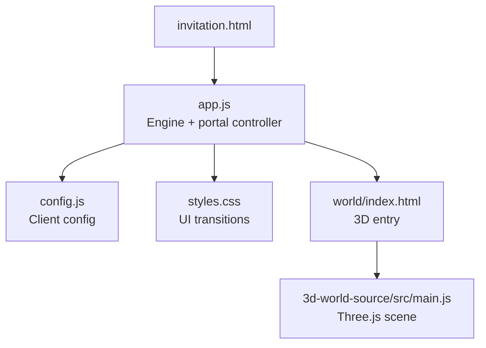
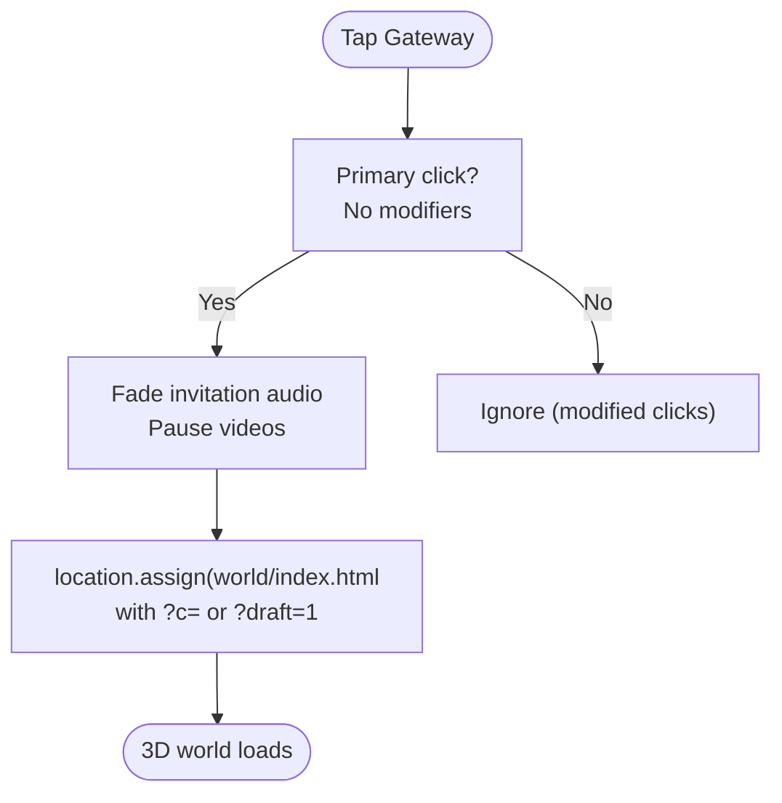
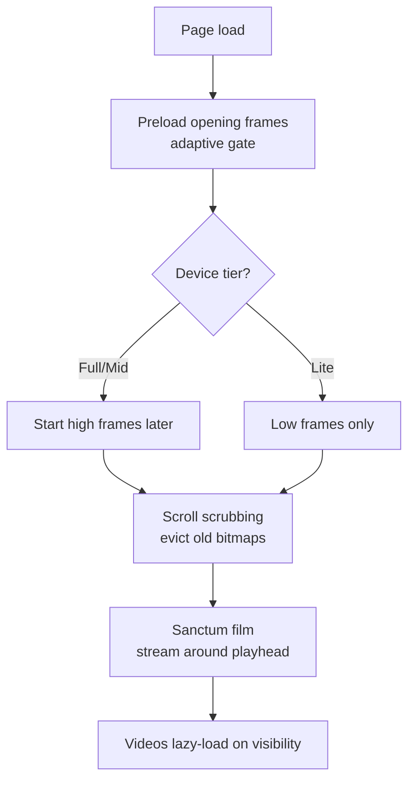
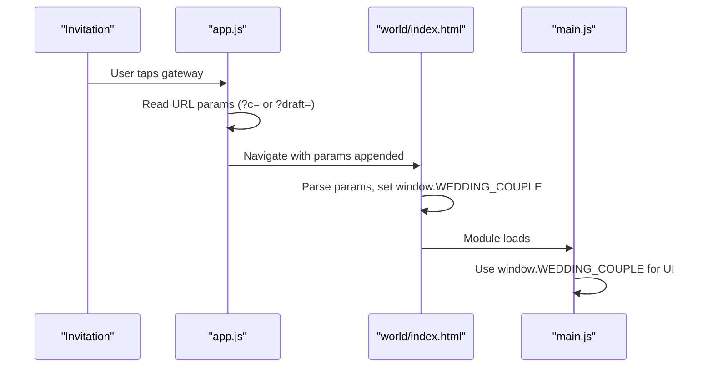
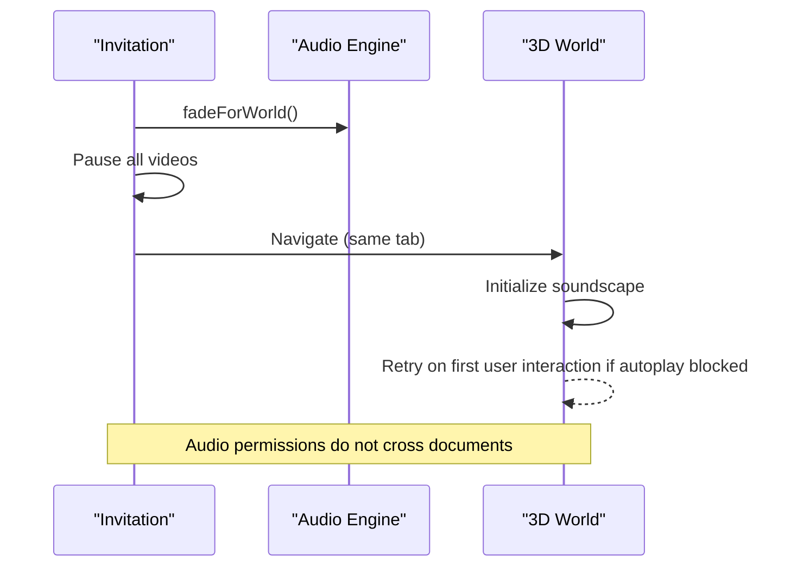
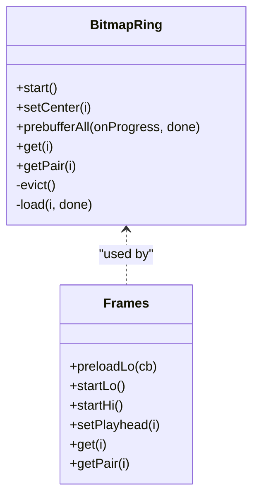
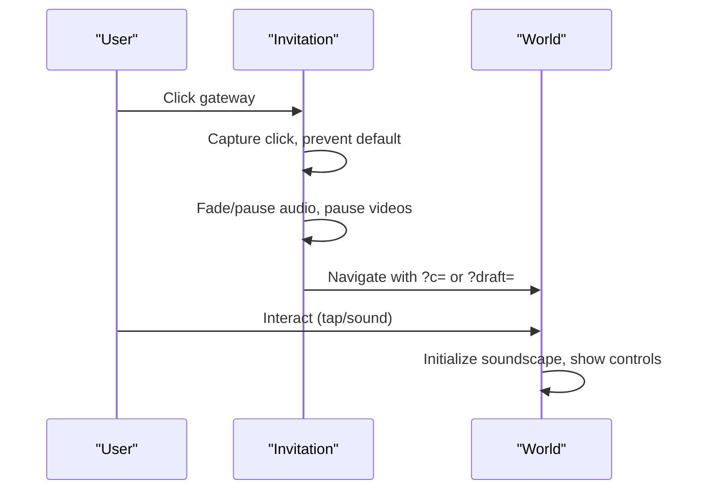
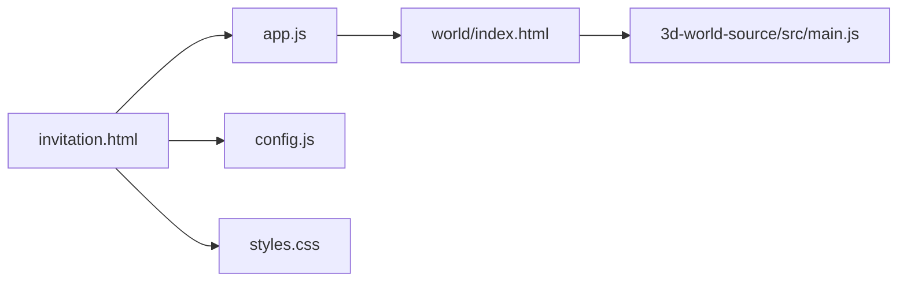

# 3D World Integration

<cite>
**Referenced Files in This Document**
- [HANDOFF.md](file://3D Wedding Invitation Sample 2/HANDOFF.md)
- [invitation.html](file://3D Wedding Invitation Sample 2/invitation.html)
- [app.js](file://3D Wedding Invitation Sample 2/app.js)
- [config.js](file://3D Wedding Invitation Sample 2/config.js)
- [styles.css](file://3D Wedding Invitation Sample 2/styles.css)
- [world/index.html](file://3D Wedding Invitation Sample 2/world/index.html)
- [3d-world-source/src/main.js](file://3D Wedding Invitation Sample 2/3d-world-source/src/main.js)
</cite>

## Table of Contents
1. Introduction
2. Project Structure
3. Core Components
4. Architecture Overview
5. Detailed Component Analysis
6. Dependency Analysis
7. Performance Considerations
8. Troubleshooting Guide
9. Conclusion

## Introduction
This document explains how the scroll-driven 2D invitation experience hands off to a separate Three.js 3D wedding world, and how state, assets, and audio are synchronized across contexts. It covers progressive loading (the 3D world loads only when users enter the finale), mobile performance strategies, memory management, communication protocols for data passing and events, and cleanup procedures. It also provides troubleshooting guidance and tuning recommendations.

## Project Structure
The integration spans two routes:
- The invitation page at the root with sections that guide guests to the finale.
- A separately built 3D world under world/, loaded only after a deliberate tap.



**Diagram sources**
- [invitation.html:255-285](file://3D Wedding Invitation Sample 2/invitation.html#L255-L285)
- [app.js:1597-1689](file://3D Wedding Invitation Sample 2/app.js#L1597-L1689)
- [config.js:6-123](file://3D Wedding Invitation Sample 2/config.js#L6-L123)
- [world/index.html:200-225](file://3D Wedding Invitation Sample 2/world/index.html#L200-L225)
- [3d-world-source/src/main.js:1-24](file://3D Wedding Invitation Sample 2/3d-world-source/src/main.js#L1-L24)

**Section sources**
- [HANDOFF.md:19-43](file://3D Wedding Invitation Sample 2/HANDOFF.md#L19-L43)
- [invitation.html:255-285](file://3D Wedding Invitation Sample 2/invitation.html#L255-L285)
- [world/index.html:200-225](file://3D Wedding Invitation Sample 2/world/index.html#L200-L225)

## Core Components
- Invitation engine (app.js): orchestrates frame scrubbing, petals, scratch card, countdown, films, and the portal handoff to the 3D world.
- Client configuration (config.js): defines couple, events, venue, frames, sanctum film, and theme; used by both pages.
- Portal UI (invitation.html + styles.css): final section gateway with CSS-only Rajputana torana and transition overlay.
- 3D world entry (world/index.html): lightweight shell that hydrates couple names from URL parameters and boots the Three.js app.
- 3D runtime (3d-world-source/src/main.js): builds scene, lighting, characters, path, atmosphere, post-processing, and soundscape.

Key responsibilities:
- Progressive loading: heavy 3D bundle is not preloaded; it loads on user intent at the finale.
- State synchronization: couple identity passed via URL query parameters so the 3D world can personalize its title card and banners.
- Audio handoff: invitation audio fades out and pauses; the 3D world starts its own soundscape independently.
- Cleanup: videos stop, media/GPU work released before navigation; world handles its own lifecycle.

**Section sources**
- [app.js:1597-1689](file://3D Wedding Invitation Sample 2/app.js#L1597-L1689)
- [config.js:6-123](file://3D Wedding Invitation Sample 2/config.js#L6-L123)
- [invitation.html:255-285](file://3D Wedding Invitation Sample 2/invitation.html#L255-L285)
- [world/index.html:200-225](file://3D Wedding Invitation Sample 2/world/index.html#L200-L225)
- [3d-world-source/src/main.js:138-188](file://3D Wedding Invitation Sample 2/3d-world-source/src/main.js#L138-L188)

## Architecture Overview
The handoff uses same-tab navigation to avoid cross-document audio permission issues and to allow the invitation to release resources before the 3D world initializes. Data passes through URL search parameters; no localStorage coupling is required.

```mermaid
sequenceDiagram
participant U as "User"
participant I as "Invitation Page"
participant A as "app.js"
participant W as "World Entry"
participant T as "Three.js Runtime"
U->>I : Tap "Enter the Wedding World"
I->>A : click event on #world-portal-link
A->>A : fadeForWorld(), pause videos
A->>W : location.assign("./world/index.html?c=...|?draft=1")
Note over A,W : Same-tab navigation; invitation audio paused
W->>T : Load module and build scene
T->>T : Hydrate couple names from window.WEDDING_COUPLE
T-->>U : Show title card, start soundscape
```

**Diagram sources**
- [app.js:1597-1689](file://3D Wedding Invitation Sample 2/app.js#L1597-L1689)
- [world/index.html:200-225](file://3D Wedding Invitation Sample 2/world/index.html#L200-L225)
- [3d-world-source/src/main.js:28-37](file://3D Wedding Invitation Sample 2/3d-world-source/src/main.js#L28-L37)

## Detailed Component Analysis

### Handoff Mechanism: Scroll-to-3D Transition
- The finale contains a semantic anchor link (#world-portal-link) styled as a Rajputana gateway.
- On primary click, app.js prevents default, plays subtle bell/whoosh, fades the invitation score, pauses all videos, and navigates to the world route after a short delay.
- The destination URL carries either ?c= or ?draft= so the 3D world can personalize itself without reading the invitation’s localStorage.



**Diagram sources**
- [app.js:1622-1689](file://3D Wedding Invitation Sample 2/app.js#L1622-L1689)
- [invitation.html:261-283](file://3D Wedding Invitation Sample 2/invitation.html#L261-L283)

**Section sources**
- [app.js:1597-1689](file://3D Wedding Invitation Sample 2/app.js#L1597-L1689)
- [invitation.html:255-285](file://3D Wedding Invitation Sample 2/invitation.html#L255-L285)

### Asset Loading Strategy
- Invitation frames: adaptive ring buffer decodes low-res frames first, then high-res frames conditionally based on device capability and network conditions. Prebuffering ensures smooth initial scrub.
- Hidden moment film: streams around its playhead with eviction outside an asymmetric window.
- Videos: lazy-loaded via data-src and poster attributes; never downloaded until needed.
- 3D world: loaded only on user intent at the finale; no prefetch/preload from the invitation.



**Diagram sources**
- [app.js:347-606](file://3D Wedding Invitation Sample 2/app.js#L347-L606)
- [config.js:97-123](file://3D Wedding Invitation Sample 2/config.js#L97-L123)

**Section sources**
- [HANDOFF.md:61-80](file://3D Wedding Invitation Sample 2/HANDOFF.md#L61-L80)
- [app.js:347-606](file://3D Wedding Invitation Sample 2/app.js#L347-L606)
- [config.js:97-123](file://3D Wedding Invitation Sample 2/config.js#L97-L123)

### State Synchronization Between 2D and 3D
- Identity pass-through: app.js rewrites the portal link to include ?c= or ?draft= if present in the current invitation URL.
- World hydration: world/index.html reads the same parameters early and sets window.WEDDING_COUPLE, which the Three.js runtime consumes to render personalized title cards and banners.
- No shared mutable state: avoids stale or leaked draft data between sessions.



**Diagram sources**
- [app.js:1603-1620](file://3D Wedding Invitation Sample 2/app.js#L1603-L1620)
- [world/index.html:200-225](file://3D Wedding Invitation Sample 2/world/index.html#L200-L225)
- [3d-world-source/src/main.js:28-37](file://3D Wedding Invitation Sample 2/3d-world-source/src/main.js#L28-L37)

**Section sources**
- [app.js:1603-1620](file://3D Wedding Invitation Sample 2/app.js#L1603-L1620)
- [world/index.html:200-225](file://3D Wedding Invitation Sample 2/world/index.html#L200-L225)
- [3d-world-source/src/main.js:28-37](file://3D Wedding Invitation Sample 2/3d-world-source/src/main.js#L28-L37)

### Audio Handoff and Cleanup
- Invitation audio: background score starts inside the seal gesture; during portal handoff, it fades out and pauses. All videos are paused before navigation.
- 3D audio: world starts its own soundscape from the beginning; autoplay blocked on mobile retries on first natural interaction. Persistent speaker control performs a fresh trusted unlock.
- Back navigation: pageshow restores invitation audio state; pagehide pauses invitation audio when leaving to the world.



**Diagram sources**
- [app.js:301-344](file://3D Wedding Invitation Sample 2/app.js#L301-L344)
- [app.js:1675-1686](file://3D Wedding Invitation Sample 2/app.js#L1675-L1686)
- [world/index.html:252-253](file://3D Wedding Invitation Sample 2/world/index.html#L252-L253)

**Section sources**
- [HANDOFF.md:75-80](file://3D Wedding Invitation Sample 2/HANDOFF.md#L75-L80)
- [app.js:301-344](file://3D Wedding Invitation Sample 2/app.js#L301-L344)
- [app.js:1675-1686](file://3D Wedding Invitation Sample 2/app.js#L1675-L1686)

### Mobile Performance and Memory Management
- Frame rings: decode off main thread into ImageBitmaps; evict bitmaps outside a directional window; full prebuffer only when capable.
- Capability tiers: detect save-data mode, slow networks, and deviceMemory to choose lite/mid/full modes.
- High frames: desktop-only streaming; decoded one-by-one while motion calms; tiny eviction window.
- 3D renderer: pixel ratio capped on mobile; shadow map size reduced; FXAA disabled on mobile; bloom tuned conservatively.
- Visibility handling: suspend/resume audio context and background tasks on visibility changes.



**Diagram sources**
- [app.js:357-477](file://3D Wedding Invitation Sample 2/app.js#L357-L477)
- [app.js:491-606](file://3D Wedding Invitation Sample 2/app.js#L491-L606)

**Section sources**
- [app.js:479-489](file://3D Wedding Invitation Sample 2/app.js#L479-L489)
- [3d-world-source/src/main.js:138-188](file://3D Wedding Invitation Sample 2/3d-world-source/src/main.js#L138-L188)

### Communication Protocols and Event Handling
- Data passing: URL search parameters carry couple identity and draft mode; world parses them early to hydrate UI.
- Events: invitation triggers portal handoff via click; world exposes sound toggle and follow baraat button for user control.
- Cleanup: invitation pauses media and fades audio before navigation; world manages its own lifecycle and UI overlays.



**Diagram sources**
- [app.js:1622-1689](file://3D Wedding Invitation Sample 2/app.js#L1622-L1689)
- [world/index.html:252-253](file://3D Wedding Invitation Sample 2/world/index.html#L252-L253)

**Section sources**
- [app.js:1622-1689](file://3D Wedding Invitation Sample 2/app.js#L1622-L1689)
- [world/index.html:252-253](file://3D Wedding Invitation Sample 2/world/index.html#L252-L253)

## Dependency Analysis
- invitation.html depends on app.js and config.js for behavior and content.
- app.js depends on config.js for frame paths and counts, and on styles.css for transition visuals.
- world/index.html depends on the compiled Three.js module and sets up couple hydration before module load.
- 3d-world-source/src/main.js imports scene modules and constructs the environment and characters.



**Diagram sources**
- [invitation.html:321-323](file://3D Wedding Invitation Sample 2/invitation.html#L321-L323)
- [world/index.html:200-225](file://3D Wedding Invitation Sample 2/world/index.html#L200-L225)
- [3d-world-source/src/main.js:1-24](file://3D Wedding Invitation Sample 2/3d-world-source/src/main.js#L1-L24)

**Section sources**
- [invitation.html:321-323](file://3D Wedding Invitation Sample 2/invitation.html#L321-L323)
- [world/index.html:200-225](file://3D Wedding Invitation Sample 2/world/index.html#L200-L225)
- [3d-world-source/src/main.js:1-24](file://3D Wedding Invitation Sample 2/3d-world-source/src/main.js#L1-L24)

## Performance Considerations
- Do not preload or iframe the 3D route from the invitation; keep portal navigation in the same tab to allow resource release before WebGL initialization.
- Use adaptive frame buffers and cap high-quality frames to desktop or capable devices.
- Lazy-load videos and use posters to avoid unnecessary downloads.
- Reduce renderer cost on mobile: lower pixel ratio, smaller shadow maps, disable FXAA, tune bloom.
- Evict bitmap frames aggressively outside the active window to bound memory.
- Respect reduced-motion preferences and provide fallbacks.

[No sources needed since this section provides general guidance]

## Troubleshooting Guide
Common issues and resolutions:
- 3D world does not load: ensure world/assets directory is deployed alongside index.html; verify relative asset URLs resolve.
- Names not personalized in world: confirm URL includes ?c= or ?draft=; check world/index.html parsing logic and window.WEDDING_COUPLE setup.
- Audio blocked on mobile: world opens silently and retries on first interaction; persistent speaker control performs a fresh trusted unlock.
- Stutter during hero scrub: verify frame prebuffer completes; check device tier selection and network conditions; ensure high frames are not forced on low-memory devices.
- Videos still playing after handoff: confirm all videos are paused before navigation; check video elements in DOM.
- Back navigation audio restored incorrectly: ensure pageshow resets overlay and restores invitation audio; verify pagehide pauses audio when leaving.

**Section sources**
- [HANDOFF.md:61-80](file://3D Wedding Invitation Sample 2/HANDOFF.md#L61-L80)
- [app.js:1675-1689](file://3D Wedding Invitation Sample 2/app.js#L1675-L1689)
- [world/index.html:200-225](file://3D Wedding Invitation Sample 2/world/index.html#L200-L225)

## Conclusion
The integration cleanly separates the lightweight 2D invitation from the heavy 3D world, loading the latter only upon explicit user intent. Data passes via URL parameters, audio transitions are managed per-document, and performance is optimized through adaptive loading, memory-bounded frame buffers, and mobile-specific rendering settings. This approach preserves responsiveness, reduces bandwidth, and delivers a consistent, personalized experience across contexts.

[No sources needed since this section summarizes without analyzing specific files]