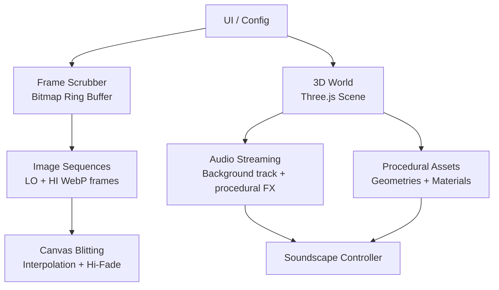
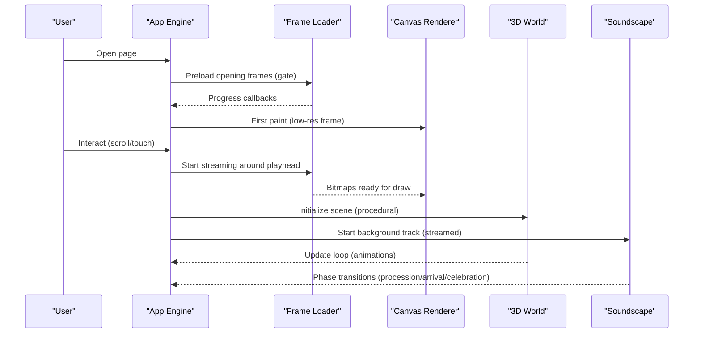
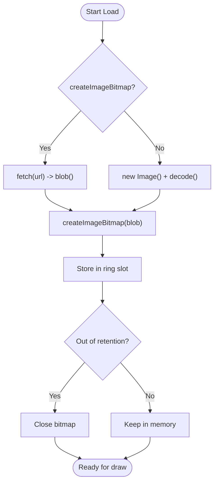
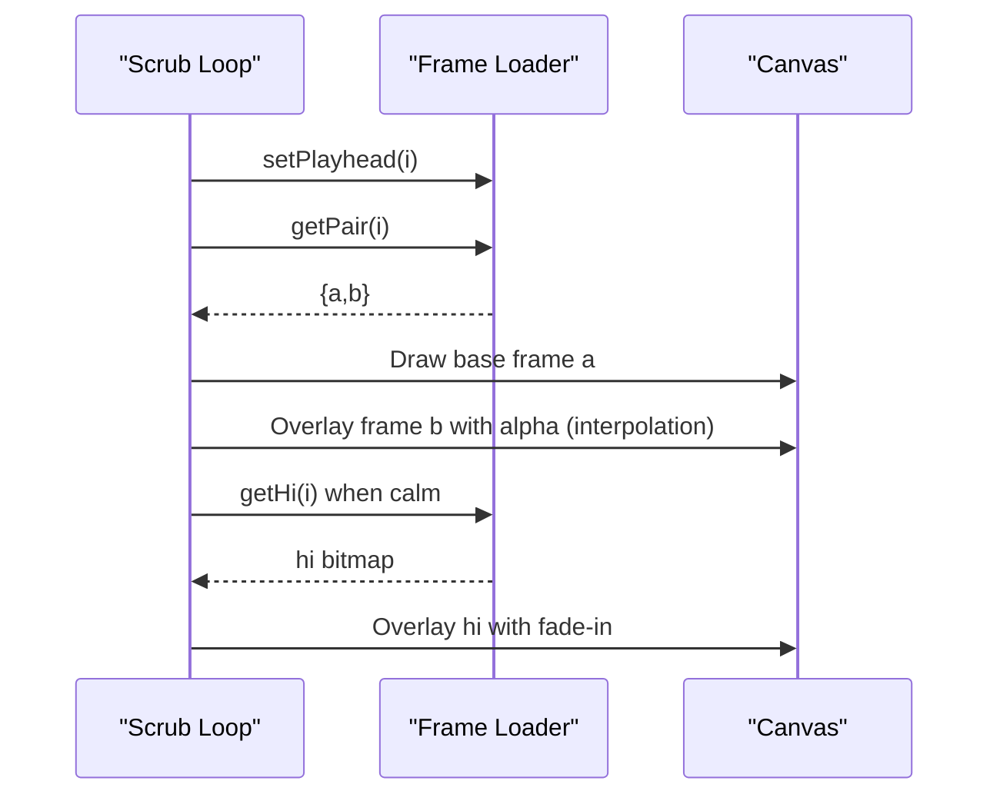
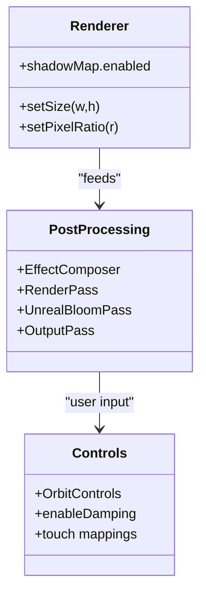
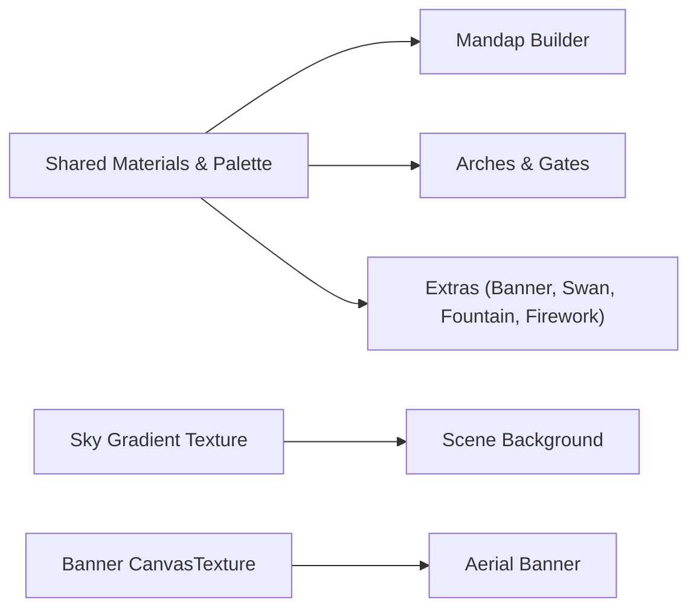
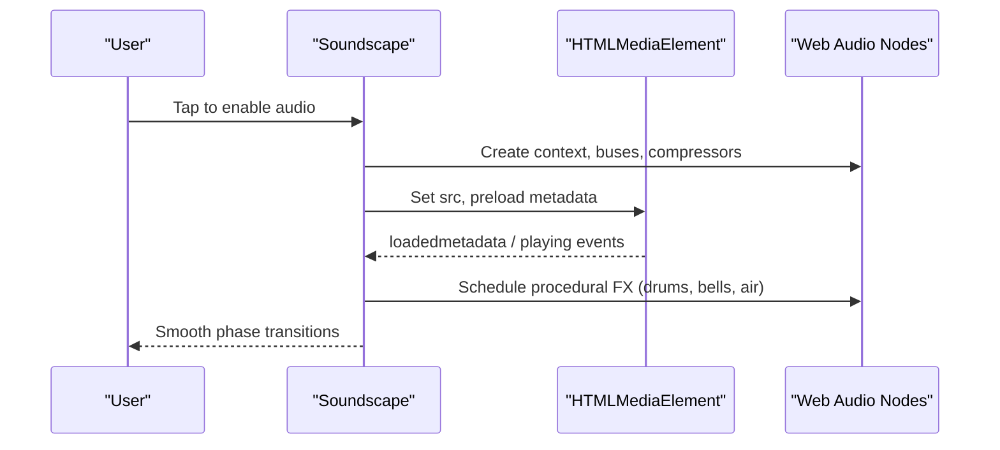
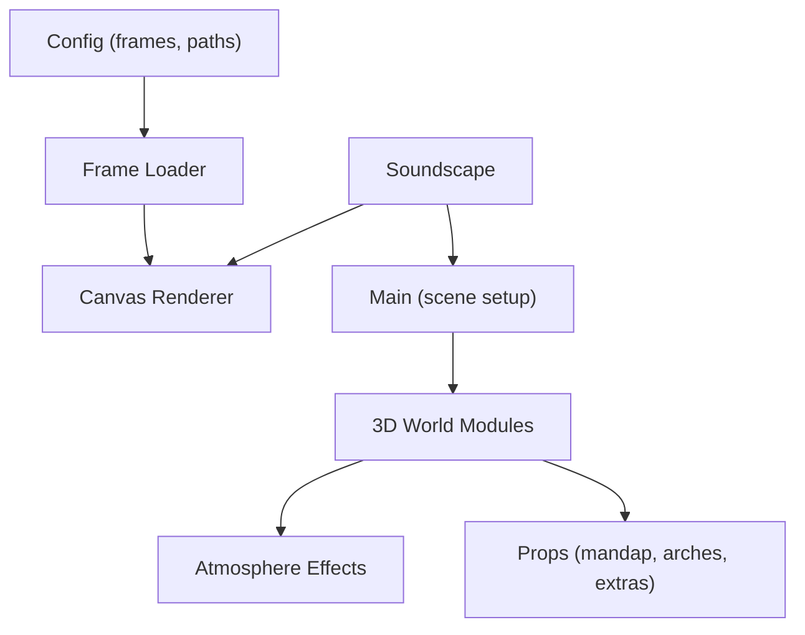

# Asset Loading System

<cite>
**Referenced Files in This Document**
- [app.js](file://3D Wedding Invitation Sample 2/app.js)
- [config.js](file://3D Wedding Invitation Sample 2/config.js)
- [main.js](file://3D Wedding Invitation Sample 2/3d-world-source/src/main.js)
- [soundscape.js](file://3D Wedding Invitation Sample 2/3d-world-source/src/wedding/soundscape.js)
- [atmosphere.js](file://3D Wedding Invitation Sample 2/3d-world-source/src/wedding/atmosphere.js)
- [mandap.js](file://3D Wedding Invitation Sample 2/3d-world-source/src/wedding/mandap.js)
- [arches.js](file://3D Wedding Invitation Sample 2/3d-world-source/src/wedding/arches.js)
- [extras.js](file://3D Wedding Invitation Sample 2/3d-world-source/src/wedding/extras.js)
</cite>

## Table of Contents
1. Introduction
2. Project Structure
3. Core Components
4. Architecture Overview
5. Detailed Component Analysis
6. Dependency Analysis
7. Performance Considerations
8. Troubleshooting Guide
9. Conclusion
10. Appendices

## Introduction
This document explains the asset loading and management system used by the wedding invitation experience. It focuses on progressive, on-demand loading to optimize initial load time, the supported asset types (textures, audio, procedural 3D assets), caching strategies, error handling and fallbacks, and optimization techniques such as texture compression, LOD-like behavior, and lazy loading patterns. It also provides guidance for adding new asset types and optimizing existing assets for mobile performance.

## Project Structure
The project separates two major subsystems:
- A frame-based cinematic scrubber that loads image sequences progressively with a direction-aware ring buffer.
- A 3D world built with Three.js that procedurally constructs most assets at runtime and streams audio on demand.

**Diagram sources**
- [app.js:347-606](file://3D Wedding Invitation Sample 2/app.js#L347-L606)
- [config.js:97-123](file://3D Wedding Invitation Sample 2/config.js#L97-L123)
- [main.js:138-188](file://3D Wedding Invitation Sample 2/3d-world-source/src/main.js#L138-L188)
- [soundscape.js:31-639](file://3D Wedding Invitation Sample 2/3d-world-source/src/wedding/soundscape.js#L31-L639)

**Section sources**
- [app.js:347-606](file://3D Wedding Invitation Sample 2/app.js#L347-L606)
- [config.js:97-123](file://3D Wedding Invitation Sample 2/config.js#L97-L123)
- [main.js:138-188](file://3D Wedding Invitation Sample 2/3d-world-source/src/main.js#L138-L188)
- [soundscape.js:31-639](file://3D Wedding Invitation Sample 2/3d-world-source/src/wedding/soundscape.js#L31-L639)

## Core Components
- Progressive image sequence loader with a ring buffer that prefetches ahead/behind the playhead, supports full prebuffer mode, and evicts bitmaps to bound memory.
- Capability-tiered quality selection based on device memory and connection type to choose between low-only, mid, or full-quality frame streaming.
- Lazy audio streaming for background music and procedural sound effects, with safe resume/mute and graceful fallback when media fails.
- Procedural 3D asset construction using shared materials and geometries; no external model files are loaded at runtime.
- Post-processing pipeline tuned per platform (mobile vs desktop) to balance visual quality and performance.

**Section sources**
- [app.js:347-606](file://3D Wedding Invitation Sample 2/app.js#L347-L606)
- [app.js:479-489](file://3D Wedding Invitation Sample 2/app.js#L479-L489)
- [soundscape.js:31-639](file://3D Wedding Invitation Sample 2/3d-world-source/src/wedding/soundscape.js#L31-L639)
- [main.js:138-188](file://3D Wedding Invitation Sample 2/3d-world-source/src/main.js#L138-L188)

## Architecture Overview
The system uses a hybrid approach:
- Image sequences are streamed via fetch and decoded off the main thread into ImageBitmaps where available, then blitted to canvas for smooth scrubbing.
- The 3D scene is assembled from procedural geometry and materials; textures are generated on the fly (e.g., sky gradient, banner textures).
- Audio is streamed as an HTMLMediaElement and mixed with procedural Web Audio effects.

**Diagram sources**
- [app.js:515-606](file://3D Wedding Invitation Sample 2/app.js#L515-L606)
- [app.js:609-713](file://3D Wedding Invitation Sample 2/app.js#L609-L713)
- [main.js:138-188](file://3D Wedding Invitation Sample 2/3d-world-source/src/main.js#L138-L188)
- [soundscape.js:31-639](file://3D Wedding Invitation Sample 2/3d-world-source/src/wedding/soundscape.js#L31-L639)

## Detailed Component Analysis

### Progressive Frame Loader (Ring Buffer)
- Loads low-resolution frames first, then starts high-resolution streaming after a delay or when motion calms.
- Uses createImageBitmap for efficient decoding; falls back to async image decode if unavailable.
- Supports full prebuffer mode for devices with sufficient memory to avoid stalls during scrubbing.
- Evicts bitmaps outside a retention window to keep memory bounded.

**Diagram sources**
- [app.js:357-477](file://3D Wedding Invitation Sample 2/app.js#L357-L477)

**Section sources**
- [app.js:347-477](file://3D Wedding Invitation Sample 2/app.js#L347-L477)
- [app.js:479-489](file://3D Wedding Invitation Sample 2/app.js#L479-L489)
- [app.js:491-606](file://3D Wedding Invitation Sample 2/app.js#L491-L606)

### Frame Rendering and Interpolation
- Draws low-res frames immediately and cross-fades adjacent frames for smooth motion.
- Fades in high-resolution frames when motion slows down to improve perceived quality without impacting responsiveness.
- Respects a reserved area for the couple’s name board so artwork never overlaps critical UI.

**Diagram sources**
- [app.js:609-713](file://3D Wedding Invitation Sample 2/app.js#L609-L713)

**Section sources**
- [app.js:609-713](file://3D Wedding Invitation Sample 2/app.js#L609-L713)

### 3D World Initialization and Optimization
- Creates renderer, camera, post-processing passes, and lighting.
- Adjusts pixel ratio, shadow map size, and shadow type based on device capability.
- Disables anti-aliasing on mobile to save GPU cycles.
- Uses fog and bloom to enhance atmosphere while controlling cost.

**Diagram sources**
- [main.js:138-188](file://3D Wedding Invitation Sample 2/3d-world-source/src/main.js#L138-L188)

**Section sources**
- [main.js:138-188](file://3D Wedding Invitation Sample 2/3d-world-source/src/main.js#L138-L188)

### Procedural 3D Assets
- Most assets are constructed at runtime using shared geometries and materials, avoiding external model downloads.
- Examples include mandap, arches, banners, swans, money fountain, and firework effects.
- Textures like skies and banners are generated via CanvasTexture, keeping assets self-contained.

**Diagram sources**
- [mandap.js:1-262](file://3D Wedding Invitation Sample 2/3d-world-source/src/wedding/mandap.js#L1-L262)
- [arches.js:1-317](file://3D Wedding Invitation Sample 2/3d-world-source/src/wedding/arches.js#L1-L317)
- [extras.js:1-304](file://3D Wedding Invitation Sample 2/3d-world-source/src/wedding/extras.js#L1-L304)
- [main.js:193-220](file://3D Wedding Invitation Sample 2/3d-world-source/src/main.js#L193-L220)

**Section sources**
- [mandap.js:1-262](file://3D Wedding Invitation Sample 2/3d-world-source/src/wedding/mandap.js#L1-L262)
- [arches.js:1-317](file://3D Wedding Invitation Sample 2/3d-world-source/src/wedding/arches.js#L1-L317)
- [extras.js:1-304](file://3D Wedding Invitation Sample 2/3d-world-source/src/wedding/extras.js#L1-L304)
- [main.js:193-220](file://3D Wedding Invitation Sample 2/3d-world-source/src/main.js#L193-L220)

### Audio Streaming and Fallbacks
- Background piano track is streamed via HTMLMediaElement to avoid large in-memory buffers.
- Procedural soundscape adds ceremonial percussion, bells, and ambience using Web Audio API.
- Handles autoplay policies by resuming context on user gesture; gracefully degrades if media fails.

**Diagram sources**
- [soundscape.js:31-639](file://3D Wedding Invitation Sample 2/3d-world-source/src/wedding/soundscape.js#L31-L639)

**Section sources**
- [soundscape.js:31-639](file://3D Wedding Invitation Sample 2/3d-world-source/src/wedding/soundscape.js#L31-L639)

## Dependency Analysis
- The frame loader depends on configuration for frame counts, paths, and prefixes.
- The 3D world depends on shared color palette and modular builders for scene composition.
- Audio module integrates both streaming media and procedural synthesis, coordinating phases with scene events.

**Diagram sources**
- [config.js:97-123](file://3D Wedding Invitation Sample 2/config.js#L97-L123)
- [main.js:138-188](file://3D Wedding Invitation Sample 2/3d-world-source/src/main.js#L138-L188)
- [atmosphere.js:1-364](file://3D Wedding Invitation Sample 2/3d-world-source/src/wedding/atmosphere.js#L1-L364)
- [mandap.js:1-262](file://3D Wedding Invitation Sample 2/3d-world-source/src/wedding/mandap.js#L1-L262)
- [arches.js:1-317](file://3D Wedding Invitation Sample 2/3d-world-source/src/wedding/arches.js#L1-L317)
- [extras.js:1-304](file://3D Wedding Invitation Sample 2/3d-world-source/src/wedding/extras.js#L1-L304)
- [soundscape.js:31-639](file://3D Wedding Invitation Sample 2/3d-world-source/src/wedding/soundscape.js#L31-L639)

**Section sources**
- [config.js:97-123](file://3D Wedding Invitation Sample 2/config.js#L97-L123)
- [main.js:138-188](file://3D Wedding Invitation Sample 2/3d-world-source/src/main.js#L138-L188)
- [atmosphere.js:1-364](file://3D Wedding Invitation Sample 2/3d-world-source/src/wedding/atmosphere.js#L1-L364)
- [soundscape.js:31-639](file://3D Wedding Invitation Sample 2/3d-world-source/src/wedding/soundscape.js#L31-L639)

## Performance Considerations
- Progressive loading:
  - Gate preload ensures the opening stretch is ready before interaction.
  - Direction-aware prefetch reduces stalls during scrubbing.
  - Full prebuffer mode avoids network/decode latency on capable devices.
- Memory management:
  - Bitmap eviction keeps memory bounded; retained mode holds more during active scrubbing.
  - Procedural assets avoid heavy model downloads; textures are generated on the fly.
- Platform adaptation:
  - Lower pixel ratio and simpler shadows on mobile.
  - Disable AA on mobile; adjust bloom and fog density.
- Audio efficiency:
  - Stream background track instead of decoding into memory.
  - Procedural effects add richness without extra downloads.

[No sources needed since this section provides general guidance]

## Troubleshooting Guide
- Opening frames fail to load:
  - Retries with exponential backoff up to a limit; consider checking network connectivity and frame URLs.
- High-resolution frames not appearing:
  - Ensure hi ring is started after a delay or when motion calms; verify device capability tier.
- Audio does not start:
  - Requires user gesture to resume AudioContext; check mute state and media errors; procedural fallback remains active.
- 3D world performance issues:
  - Reduce pixel ratio, disable AA, lower shadow resolution; confirm post-processing passes are appropriate for device.

**Section sources**
- [app.js:515-565](file://3D Wedding Invitation Sample 2/app.js#L515-L565)
- [app.js:479-489](file://3D Wedding Invitation Sample 2/app.js#L479-L489)
- [soundscape.js:435-478](file://3D Wedding Invitation Sample 2/3d-world-source/src/wedding/soundscape.js#L435-L478)
- [main.js:144-188](file://3D Wedding Invitation Sample 2/3d-world-source/src/main.js#L144-L188)

## Conclusion
The asset loading system combines progressive image streaming, procedural 3D construction, and efficient audio streaming to deliver a rich experience with fast initial load times and responsive interactions. By leveraging capability detection, ring-buffer caching, and platform-specific optimizations, it balances visual fidelity with performance across devices.

[No sources needed since this section summarizes without analyzing specific files]

## Appendices

### Supported Asset Types
- Images: WebP frame sequences for cinematic scrubbing.
- Audio: Streaming background track plus procedural sound effects.
- 3D content: Procedural models built from primitives and shared materials; dynamic textures generated via CanvasTexture.

**Section sources**
- [config.js:97-123](file://3D Wedding Invitation Sample 2/config.js#L97-L123)
- [extras.js:10-41](file://3D Wedding Invitation Sample 2/3d-world-source/src/wedding/extras.js#L10-L41)
- [main.js:193-220](file://3D Wedding Invitation Sample 2/3d-world-source/src/main.js#L193-L220)

### Caching Mechanisms
- Bitmap ring buffer caches recent frames around the playhead; evicts older bitmaps to free memory.
- Full prebuffer mode retains all frames for zero-latency scrubbing on capable devices.
- Procedural assets are recomputed once per module load and reused via shared materials/geometries.

**Section sources**
- [app.js:357-477](file://3D Wedding Invitation Sample 2/app.js#L357-L477)
- [app.js:447-468](file://3D Wedding Invitation Sample 2/app.js#L447-L468)

### Error Handling and Fallbacks
- Frame loading retries with exponential backoff; gate resolves even if some frames fail.
- Audio media errors mark track as failed; procedural soundscape continues to provide ambiance.
- 3D world remains functional without external assets; relies on procedural generation.

**Section sources**
- [app.js:515-565](file://3D Wedding Invitation Sample 2/app.js#L515-L565)
- [soundscape.js:525-528](file://3D Wedding Invitation Sample 2/3d-world-source/src/wedding/soundscape.js#L525-L528)

### Optimization Techniques
- Texture compression: Use WebP for frame sequences to reduce bandwidth.
- Model LOD: Achieved via dual-tier frame streaming (low and high) and selective hi-frame activation based on motion and device capability.
- Lazy loading: Frame rings start streaming only when visible; audio starts on user gesture; 3D scene initializes with minimal overhead.

**Section sources**
- [config.js:97-123](file://3D Wedding Invitation Sample 2/config.js#L97-L123)
- [app.js:479-489](file://3D Wedding Invitation Sample 2/app.js#L479-L489)
- [app.js:609-713](file://3D Wedding Invitation Sample 2/app.js#L609-L713)
- [soundscape.js:31-639](file://3D Wedding Invitation Sample 2/3d-world-source/src/wedding/soundscape.js#L31-L639)

### Adding New Asset Types
- For images:
  - Add new frame sets to config with count, path prefix, and extension; ensure ring buffer parameters suit the new asset size.
- For audio:
  - Extend soundscape phases and bus mixes; stream new tracks via HTMLMediaElement and integrate with phase transitions.
- For 3D:
  - Create new builder modules using shared materials and geometries; expose functions to instantiate and animate groups.

**Section sources**
- [config.js:97-123](file://3D Wedding Invitation Sample 2/config.js#L97-L123)
- [soundscape.js:96-109](file://3D Wedding Invitation Sample 2/3d-world-source/src/wedding/soundscape.js#L96-L109)
- [mandap.js:1-262](file://3D Wedding Invitation Sample 2/3d-world-source/src/wedding/mandap.js#L1-L262)
- [arches.js:1-317](file://3D Wedding Invitation Sample 2/3d-world-source/src/wedding/arches.js#L1-L317)
- [extras.js:1-304](file://3D Wedding Invitation Sample 2/3d-world-source/src/wedding/extras.js#L1-L304)

### Mobile Performance Guidance
- Prefer low-tier frame streaming and disable hi frames on constrained devices.
- Reduce pixel ratio and shadow resolution; disable AA on mobile.
- Stream audio rather than decoding large buffers; use procedural effects sparingly.
- Generate textures at reasonable resolutions; reuse materials and geometries.

**Section sources**
- [app.js:479-489](file://3D Wedding Invitation Sample 2/app.js#L479-L489)
- [main.js:144-188](file://3D Wedding Invitation Sample 2/3d-world-source/src/main.js#L144-L188)
- [soundscape.js:510-528](file://3D Wedding Invitation Sample 2/3d-world-source/src/wedding/soundscape.js#L510-L528)