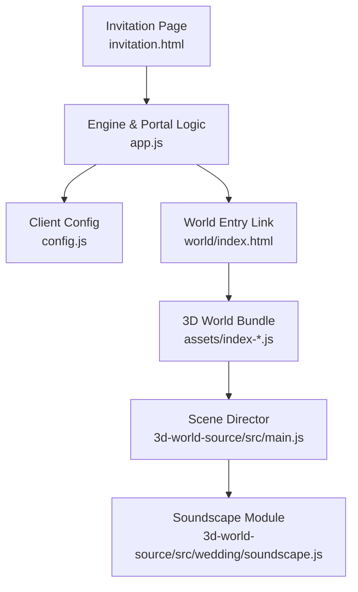
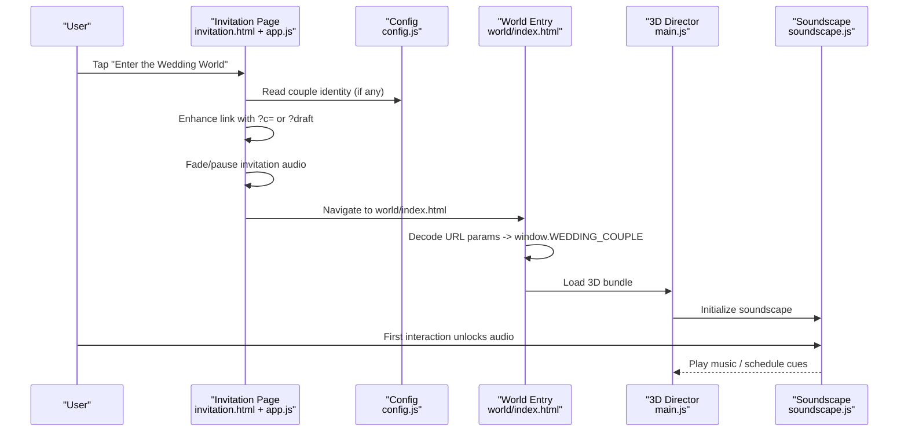
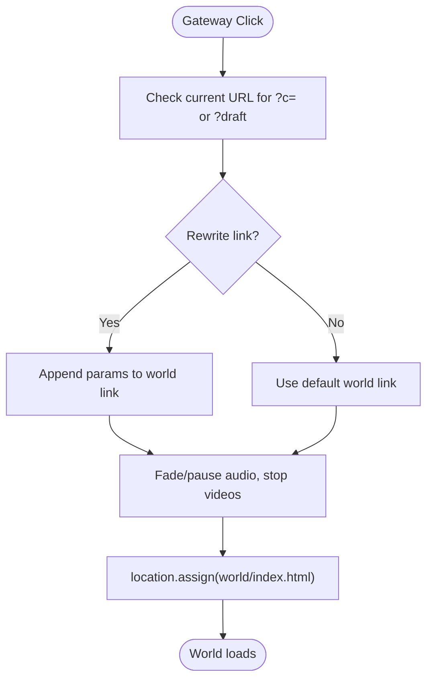
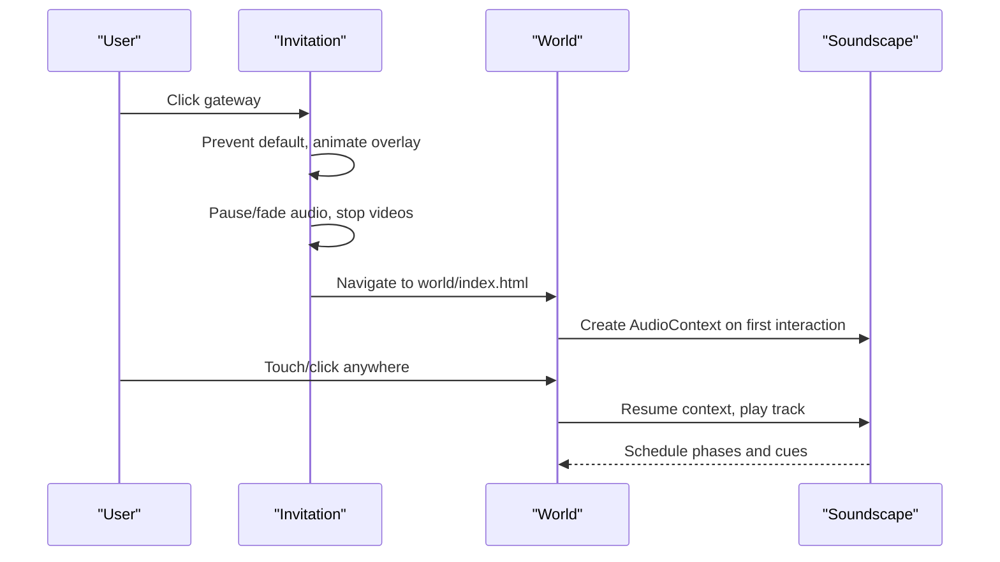
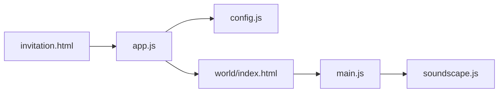

# Cross-Context Communication

<cite>
**Referenced Files in This Document**
- [invitation.html](file://3D Wedding Invitation Sample 2/invitation.html)
- [app.js](file://3D Wedding Invitation Sample 2/app.js)
- [config.js](file://3D Wedding Invitation Sample 2/config.js)
- [world/index.html](file://3D Wedding Invitation Sample 2/world/index.html)
- [main.js](file://3D Wedding Invitation Sample 2/3d-world-source/src/main.js)
- [soundscape.js](file://3D Wedding Invitation Sample 2/3d-world-source/src/wedding/soundscape.js)
- [HANDOFF.md](file://3D Wedding Invitation Sample 2/HANDOFF.md)
- [README.md](file://3D Wedding Invitation Sample 2/README.md)
</cite>

## Table of Contents
1. Introduction
2. Project Structure
3. Core Components
4. Architecture Overview
5. Detailed Component Analysis
6. Dependency Analysis
7. Performance Considerations
8. Troubleshooting Guide
9. Conclusion

## Introduction
This document explains how the 2D invitation page and the 3D world environment communicate during the handoff from scroll-based navigation to an immersive 3D experience. The system intentionally avoids cross-context messaging APIs such as postMessage between iframes or workers. Instead, it uses same-tab navigation with URL-encoded state to pass minimal identity data into the 3D world. Audio is paused and faded out by the invitation before navigation; the 3D world initializes its own audio context and media on the first user gesture. This design preserves performance, respects mobile autoplay policies, and keeps security simple because both routes are served from the same origin.

## Project Structure
The project contains two separate experiences:
- Invitation route: a lightweight HTML/CSS/JS page that orchestrates scroll-driven visuals, countdowns, RSVP, and a portal link to the 3D world.
- 3D world route: a Vite-built Three.js application loaded only after the user taps the gateway.

**Diagram sources**
- [invitation.html:255-285](file://3D Wedding Invitation Sample 2/invitation.html#L255-L285)
- [app.js:1597-1689](file://3D Wedding Invitation Sample 2/app.js#L1597-L1689)
- [config.js:6-123](file://3D Wedding Invitation Sample 2/config.js#L6-L123)
- [world/index.html:200-225](file://3D Wedding Invitation Sample 2/world/index.html#L200-L225)
- [main.js:1-24](file://3D Wedding Invitation Sample 2/3d-world-source/src/main.js#L1-L24)
- [soundscape.js:31-639](file://3D Wedding Invitation Sample 2/3d-world-source/src/wedding/soundscape.js#L31-L639)

**Section sources**
- [invitation.html:255-285](file://3D Wedding Invitation Sample 2/invitation.html#L255-L285)
- [app.js:1597-1689](file://3D Wedding Invitation Sample 2/app.js#L1597-L1689)
- [config.js:6-123](file://3D Wedding Invitation Sample 2/config.js#L6-L123)
- [world/index.html:200-225](file://3D Wedding Invitation Sample 2/world/index.html#L200-L225)
- [main.js:1-24](file://3D Wedding Invitation Sample 2/3d-world-source/src/main.js#L1-L24)
- [soundscape.js:31-639](file://3D Wedding Invitation Sample 2/3d-world-source/src/wedding/soundscape.js#L31-L639)

## Core Components
- Invitation engine (app.js): Manages scroll-driven visuals, audio, and the portal transition. It enhances the gateway link to carry couple identity via URL parameters and performs a short visual/audio handoff before navigating.
- Client configuration (config.js): Provides couple names, events, frames, and other content used by the invitation. It also merges overrides for published links or drafts.
- World entry (world/index.html): Prepares the 3D world UI and extracts couple identity from URL parameters to hydrate static elements before loading the 3D bundle.
- 3D scene director (main.js): Initializes Three.js scene, camera, controls, assets, and animation loop. It reads couple identity from window.WEDDING_COUPLE set by the world entry script.
- Soundscape module (soundscape.js): Owns the 3D world’s audio lifecycle, including autoplay unlock, phase transitions, and cue scheduling.

Key responsibilities:
- Handoff trigger: User clicks “Enter the Wedding World”.
- State passing: Couple identity passed through URL search params (?c=… or ?draft).
- Audio handoff: Invitation fades and pauses audio; 3D world starts its own audio on first interaction.
- Cleanup: Videos paused, canvases released by browser navigation, and 3D world manages its own resources.

**Section sources**
- [app.js:1597-1689](file://3D Wedding Invitation Sample 2/app.js#L1597-L1689)
- [config.js:6-123](file://3D Wedding Invitation Sample 2/config.js#L6-L123)
- [world/index.html:200-225](file://3D Wedding Invitation Sample 2/world/index.html#L200-L225)
- [main.js:1-24](file://3D Wedding Invitation Sample 2/3d-world-source/src/main.js#L1-L24)
- [soundscape.js:31-639](file://3D Wedding Invitation Sample 2/3d-world-source/src/wedding/soundscape.js#L31-L639)

## Architecture Overview
The communication model is URL-driven rather than message-driven. There is no postMessage bridge between contexts. Instead:
- The invitation augments the world link with query parameters carrying couple identity.
- The world entry script decodes these parameters and sets a global object consumed by the 3D bundle.
- The 3D scene reads this global to render personalized text and banners.
- Audio is handled independently per context to comply with autoplay policies.

**Diagram sources**
- [app.js:1597-1689](file://3D Wedding Invitation Sample 2/app.js#L1597-L1689)
- [config.js:6-123](file://3D Wedding Invitation Sample 2/config.js#L6-L123)
- [world/index.html:200-225](file://3D Wedding Invitation Sample 2/world/index.html#L200-L225)
- [main.js:1-24](file://3D Wedding Invitation Sample 2/3d-world-source/src/main.js#L1-L24)
- [soundscape.js:31-639](file://3D Wedding Invitation Sample 2/3d-world-source/src/wedding/soundscape.js#L31-L639)

## Detailed Component Analysis

### Invitation-to-World Handoff Flow
- Trigger: Click on the gateway anchor (#world-portal-link).
- Enhancement: If the current page has ?c= or ?draft, the link is rewritten to include those parameters so the world can personalize itself.
- Transition: A short overlay animates, invitation audio is faded and paused, videos are stopped, then same-tab navigation occurs.
- Result: The browser releases the invitation’s media/GPU work before the 3D world initializes WebGL.

**Diagram sources**
- [app.js:1597-1689](file://3D Wedding Invitation Sample 2/app.js#L1597-L1689)

**Section sources**
- [app.js:1597-1689](file://3D Wedding Invitation Sample 2/app.js#L1597-L1689)

### Data Structures Used for Communication
- URL search parameters:
  - c: Base64-like encoded JSON payload containing couple details. Decoded by both invitation and world when present.
  - draft: Flag indicating editor draft mode; world reads local storage when explicitly requested.
- Global object in world context:
  - window.WEDDING_COUPLE: Set by world/index.html after decoding URL params; consumed by main.js and UI scripts.

These structures are intentionally minimal to avoid heavy cross-context messaging and to keep security boundaries clear.

**Section sources**
- [config.js:175-211](file://3D Wedding Invitation Sample 2/config.js#L175-L211)
- [world/index.html:200-225](file://3D Wedding Invitation Sample 2/world/index.html#L200-L225)
- [main.js:25-29](file://3D Wedding Invitation Sample 2/3d-world-source/src/main.js#L25-L29)

### Event Handling Patterns
- Invitation side:
  - Click handler on #world-portal-link prevents default, plays transition sounds, fades audio, stops videos, then navigates.
  - Reduced-motion users bypass animation and navigate immediately.
- World side:
  - Autoplay policy compliance: Audio context resumes on first pointer/keyboard event; persistent sound button triggers fresh unlock.
  - Scene initialization: After first frame, loader hides, title card fades, hints appear/disappear based on device type.

**Diagram sources**
- [app.js:1597-1689](file://3D Wedding Invitation Sample 2/app.js#L1597-L1689)
- [soundscape.js:435-478](file://3D Wedding Invitation Sample 2/3d-world-source/src/wedding/soundscape.js#L435-L478)
- [main.js:1718-1727](file://3D Wedding Invitation Sample 2/3d-world-source/src/main.js#L1718-L1727)

**Section sources**
- [app.js:1597-1689](file://3D Wedding Invitation Sample 2/app.js#L1597-L1689)
- [soundscape.js:435-478](file://3D Wedding Invitation Sample 2/3d-world-source/src/wedding/soundscape.js#L435-L478)
- [main.js:1718-1727](file://3D Wedding Invitation Sample 2/3d-world-source/src/main.js#L1718-L1727)

### Cleanup Procedures
- Invitation cleanup before navigation:
  - Pauses all video elements.
  - Fades master gain to near silence and suspends/resumes AudioContext appropriately.
  - Stops background music element.
- Browser-level cleanup:
  - Same-tab navigation allows the browser to release canvases, decoders, and GPU resources before the 3D world initializes.
- World cleanup:
  - The 3D world owns its AudioContext and media; it handles visibility changes by pausing/suspending and resuming on return.

**Section sources**
- [app.js:301-345](file://3D Wedding Invitation Sample 2/app.js#L301-L345)
- [app.js:1659-1689](file://3D Wedding Invitation Sample 2/app.js#L1659-L1689)
- [soundscape.js:619-628](file://3D Wedding Invitation Sample 2/3d-world-source/src/wedding/soundscape.js#L619-L628)

### Security Considerations for Cross-Origin Messaging
- No postMessage usage: The design avoids cross-origin messaging entirely by using same-tab navigation and URL parameters.
- Origin safety: Both routes are served from the same origin, eliminating cross-origin risks.
- Input validation: URL parameters are decoded defensively; malformed values are ignored to prevent crashes.
- Local storage isolation: Draft data remains isolated to the editor context unless explicitly passed via URL.

[No sources needed since this section provides general guidance]

### Performance Optimization for Real-Time Data Exchange
- Lazy loading: The 3D world is not preloaded or prefetched; it loads only after user activation.
- Minimal state transfer: Only couple identity is passed via URL; heavy assets remain in their respective routes.
- Resource release: Same-tab navigation frees invitation resources before WebGL initialization.
- Adaptive streaming: Invitation uses bitmap rings and playhead-aware caching; world uses adaptive pixel ratio and shadow settings.

**Section sources**
- [HANDOFF.md:61-80](file://3D Wedding Invitation Sample 2/HANDOFF.md#L61-L80)
- [README.md:49-64](file://3D Wedding Invitation Sample 2/README.md#L49-L64)

## Dependency Analysis
The handoff depends on coordinated behavior across modules:
- invitation.html defines the gateway anchor and includes app.js and config.js.
- app.js reads config.js for couple identity and enhances the world link accordingly.
- world/index.html decodes URL params and sets window.WEDDING_COUPLE before loading the 3D bundle.
- main.js consumes window.WEDDING_COUPLE to personalize UI and scene elements.
- soundscape.js manages audio lifecycle independent of the invitation.

**Diagram sources**
- [invitation.html:255-285](file://3D Wedding Invitation Sample 2/invitation.html#L255-L285)
- [app.js:1597-1689](file://3D Wedding Invitation Sample 2/app.js#L1597-L1689)
- [config.js:6-123](file://3D Wedding Invitation Sample 2/config.js#L6-L123)
- [world/index.html:200-225](file://3D Wedding Invitation Sample 2/world/index.html#L200-L225)
- [main.js:1-24](file://3D Wedding Invitation Sample 2/3d-world-source/src/main.js#L1-L24)
- [soundscape.js:31-639](file://3D Wedding Invitation Sample 2/3d-world-source/src/wedding/soundscape.js#L31-L639)

**Section sources**
- [invitation.html:255-285](file://3D Wedding Invitation Sample 2/invitation.html#L255-L285)
- [app.js:1597-1689](file://3D Wedding Invitation Sample 2/app.js#L1597-L1689)
- [config.js:6-123](file://3D Wedding Invitation Sample 2/config.js#L6-L123)
- [world/index.html:200-225](file://3D Wedding Invitation Sample 2/world/index.html#L200-L225)
- [main.js:1-24](file://3D Wedding Invitation Sample 2/3d-world-source/src/main.js#L1-L24)
- [soundscape.js:31-639](file://3D Wedding Invitation Sample 2/3d-world-source/src/wedding/soundscape.js#L31-L639)

## Performance Considerations
- Avoid preloading the 3D world from the invitation to keep initial load fast.
- Use same-tab navigation to allow resource release before WebGL startup.
- Keep the gateway visual CSS-only to avoid extra payloads.
- Respect reduced-motion preferences for immediate navigation.
- Ensure the world’s audio unlocks on the first natural interaction without extra modals.

[No sources needed since this section provides general guidance]

## Troubleshooting Guide
Common issues and resolutions:
- 3D world does not start audio:
  - Cause: Mobile browsers block autoplay until user interaction.
  - Resolution: Ensure the user interacts with the world (tap/click) to unlock audio; use the sound button to trigger a fresh unlock.
- Invitation audio continues playing after navigation:
  - Cause: Navigation did not pause audio properly.
  - Resolution: Verify the gateway click handler fades and pauses audio before calling location.assign.
- World shows wrong couple names:
  - Cause: URL parameters missing or malformed.
  - Resolution: Confirm the invitation rewrites the world link with ?c= or ?draft when present; ensure world/index.html decodes safely.
- Slow handoff or white flash:
  - Cause: Preloading or iframe usage.
  - Resolution: Remove any prefetch/preload of the world; use same-tab navigation with a brief overlay.

**Section sources**
- [app.js:1659-1689](file://3D Wedding Invitation Sample 2/app.js#L1659-L1689)
- [world/index.html:200-225](file://3D Wedding Invitation Sample 2/world/index.html#L200-L225)
- [HANDOFF.md:61-80](file://3D Wedding Invitation Sample 2/HANDOFF.md#L61-L80)

## Conclusion
The invitation-to-world handoff relies on URL-encoded state and same-tab navigation rather than postMessage. This approach simplifies security, improves performance, and aligns with mobile autoplay constraints. The invitation prepares the user with a smooth transition and audio handoff; the 3D world initializes independently, unlocking audio on the first interaction and rendering personalized content from the passed couple identity. By keeping responsibilities clear and minimizing data exchange, the system delivers a responsive and reliable experience across devices.

[No sources needed since this section summarizes without analyzing specific files]