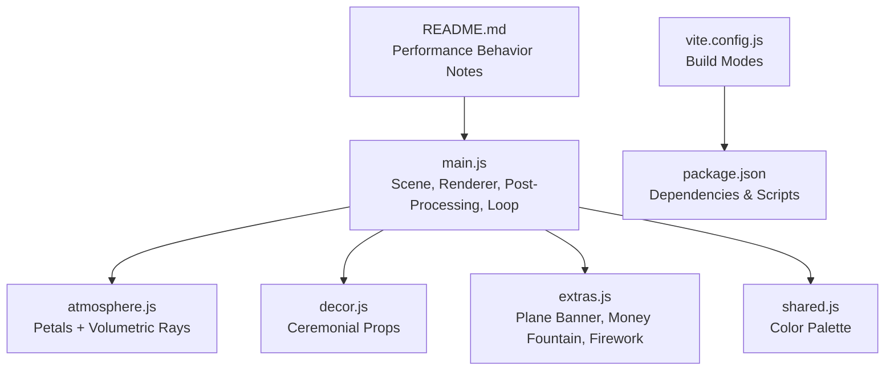
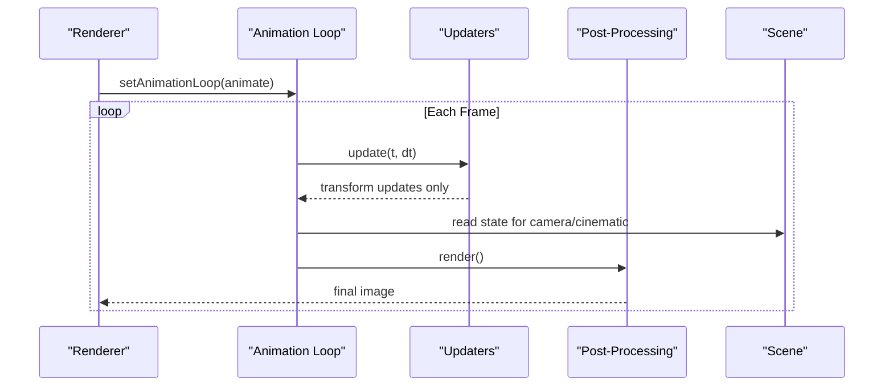
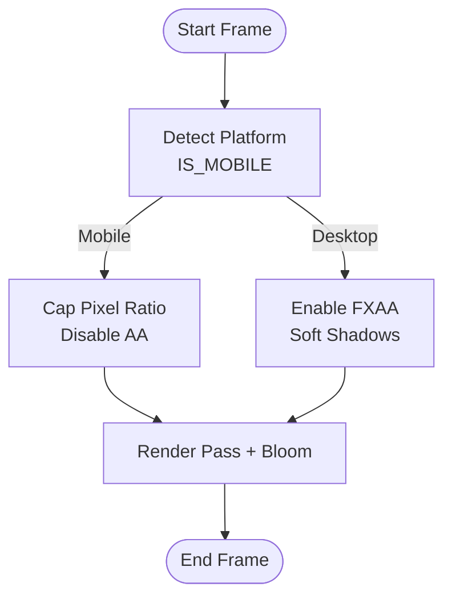
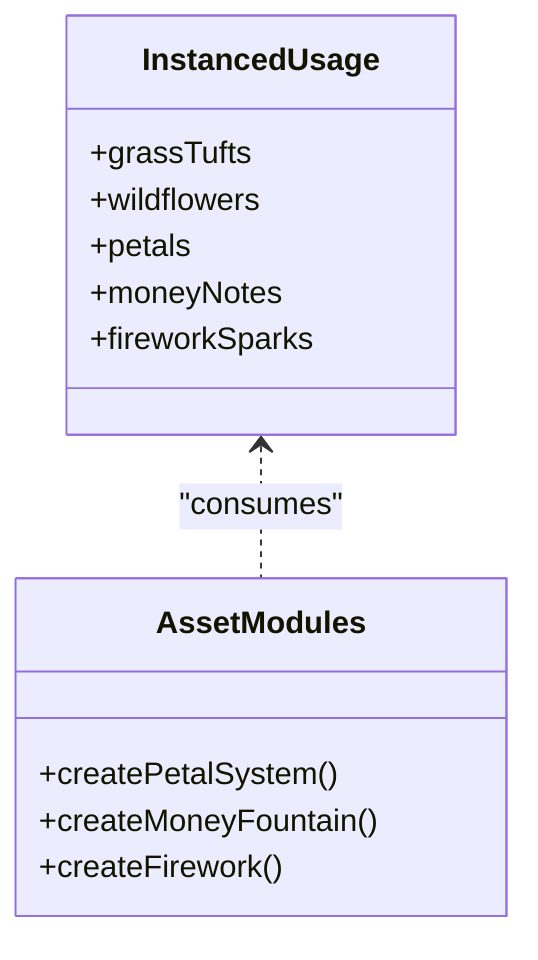
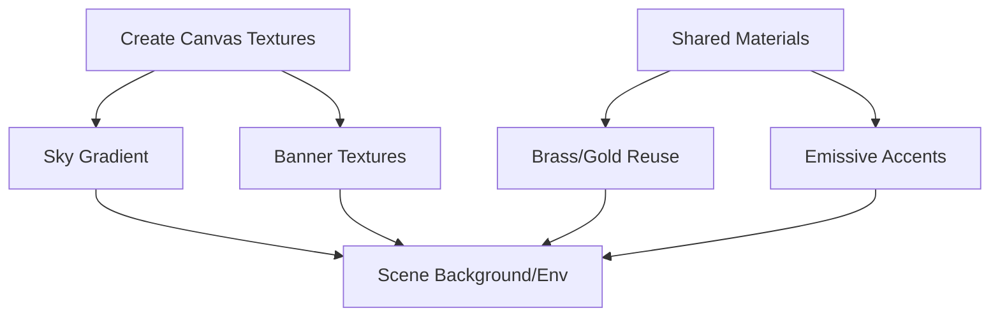
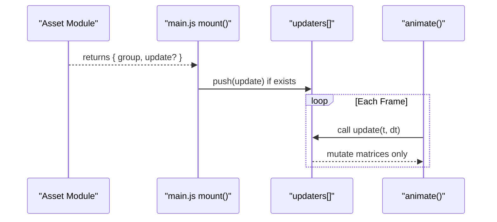
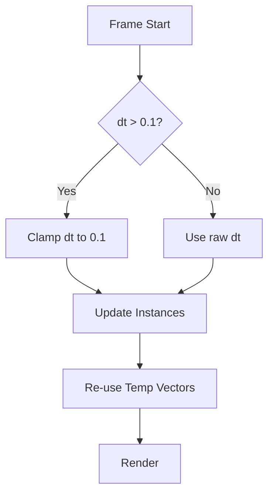
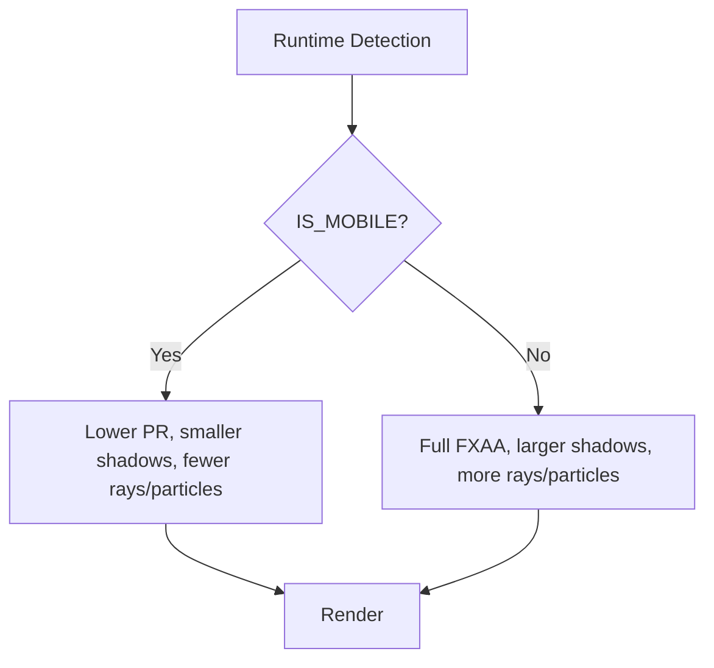
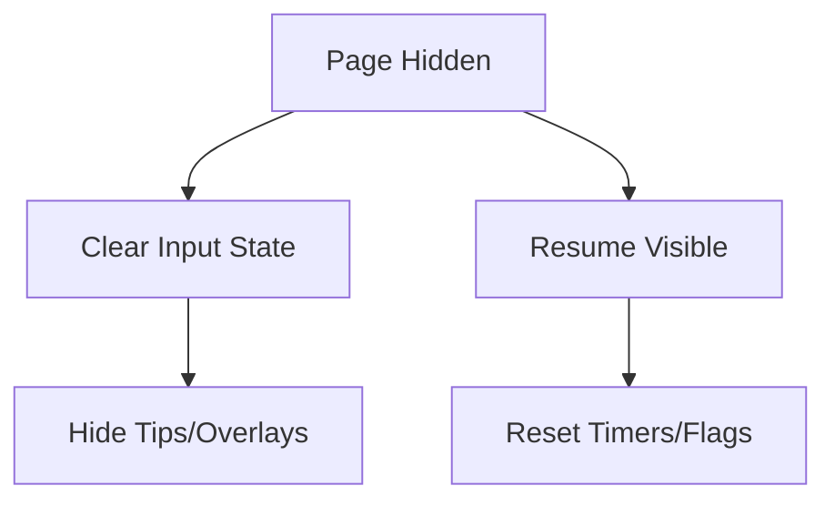
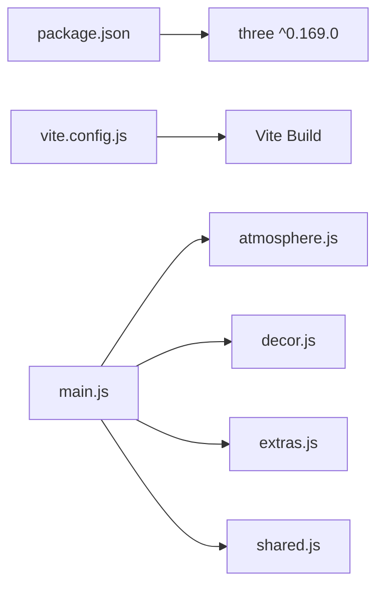

# Performance Optimization

<cite>
**Referenced Files in This Document**
- [main.js](file://3D Wedding Invitation Sample 2/3d-world-source/src/main.js)
- [atmosphere.js](file://3D Wedding Invitation Sample 2/3d-world-source/src/wedding/atmosphere.js)
- [decor.js](file://3D Wedding Invitation Sample 2/3d-world-source/src/wedding/decor.js)
- [extras.js](file://3D Wedding Invitation Sample 2/3d-world-source/src/wedding/extras.js)
- [shared.js](file://3D Wedding Invitation Sample 2/3d-world-source/src/wedding/shared.js)
- [package.json](file://3D Wedding Invitation Sample 2/3d-world-source/package.json)
- [vite.config.js](file://3D Wedding Invitation Sample 2/3d-world-source/vite.config.js)
- [README.md](file://3D Wedding Invitation Sample 2/README.md)
</cite>

## Table of Contents
1. Introduction
2. Project Structure
3. Core Components
4. Architecture Overview
5. Detailed Component Analysis
6. Dependency Analysis
7. Performance Considerations
8. Troubleshooting Guide
9. Conclusion

## Introduction
This document explains performance optimization strategies used by the 3D wedding world to deliver smooth, mobile-first experiences across devices and browsers. It covers reduced polygon counts, texture and lighting choices, efficient rendering pipelines, memory management practices, profiling techniques, adaptive quality scaling, frame rate monitoring, and battery-friendly behaviors. The goal is to maintain a stable 60fps target while preserving visual quality.

## Project Structure
The 3D world is a standalone Vite project that builds into a self-contained or distributable bundle. It uses Three.js for rendering and organizes scene content into modular asset builders (e.g., atmosphere, decor, extras). The main entry composes the scene, sets up the renderer and post-processing pipeline, and drives animation and camera behavior.

**Diagram sources**
- [main.js:135-188](file://3D Wedding Invitation Sample 2/3d-world-source/src/main.js#L135-L188)
- [atmosphere.js:38-205](file://3D Wedding Invitation Sample 2/3d-world-source/src/wedding/atmosphere.js#L38-L205)
- [decor.js:27-135](file://3D Wedding Invitation Sample 2/3d-world-source/src/wedding/decor.js#L27-L135)
- [extras.js:47-112](file://3D Wedding Invitation Sample 2/3d-world-source/src/wedding/extras.js#L47-L112)
- [shared.js:1-26](file://3D Wedding Invitation Sample 2/3d-world-source/src/wedding/shared.js#L1-L26)
- [vite.config.js:1-20](file://3D Wedding Invitation Sample 2/3d-world-source/vite.config.js#L1-L20)
- [package.json:1-22](file://3D Wedding Invitation Sample 2/3d-world-source/package.json#L1-L22)
- [README.md:66-75](file://3D Wedding Invitation Sample 2/README.md#L66-L75)

**Section sources**
- [main.js:135-188](file://3D Wedding Invitation Sample 2/3d-world-source/src/main.js#L135-L188)
- [vite.config.js:1-20](file://3D Wedding Invitation Sample 2/3d-world-source/vite.config.js#L1-L20)
- [package.json:1-22](file://3D Wedding Invitation Sample 2/3d-world-source/package.json#L1-L22)
- [README.md:66-75](file://3D Wedding Invitation Sample 2/README.md#L66-L75)

## Core Components
- Mobile detection and platform-aware settings: device pixel ratio caps, shadow map size, antialiasing toggles, and control damping tuned per platform.
- Efficient geometry reuse: instanced meshes for grass, flowers, petals, money, and fireworks reduce draw calls.
- Adaptive terrain resolution: lower segment count on mobile reduces vertex processing cost.
- Lightweight post-processing: bloom enabled; FXAA disabled on mobile to save GPU cycles.
- Centralized palette and materials: shared color constants minimize redundant material creation.
- Animated effects via small update functions: petals, volumetric rays, banners, and fountain/spark systems update matrices efficiently without allocating new objects each frame.

**Section sources**
- [main.js:111-188](file://3D Wedding Invitation Sample 2/3d-world-source/src/main.js#L111-L188)
- [main.js:594-631](file://3D Wedding Invitation Sample 2/3d-world-source/src/main.js#L594-L631)
- [main.js:814-834](file://3D Wedding Invitation Sample 2/3d-world-source/src/main.js#L814-L834)
- [atmosphere.js:38-205](file://3D Wedding Invitation Sample 2/3d-world-source/src/wedding/atmosphere.js#L38-L205)
- [extras.js:153-202](file://3D Wedding Invitation Sample 2/3d-world-source/src/wedding/extras.js#L153-L202)
- [shared.js:1-26](file://3D Wedding Invitation Sample 2/3d-world-source/src/wedding/shared.js#L1-L26)

## Architecture Overview
The runtime architecture centers on a single render loop that updates animated assets, adjusts cinematic camera behavior, and renders through an effect composer. Platform detection gates expensive features like soft shadows and FXAA. Asset modules return lightweight groups with optional update hooks that are registered once and invoked per frame.

**Diagram sources**
- [main.js:1636-1727](file://3D Wedding Invitation Sample 2/3d-world-source/src/main.js#L1636-L1727)
- [main.js:155-173](file://3D Wedding Invitation Sample 2/3d-world-source/src/main.js#L155-L173)

## Detailed Component Analysis

### Mobile-First Rendering Pipeline
- Pixel ratio cap: On mobile, pixel ratio is capped to reduce fill-rate pressure.
- Antialiasing: Disabled on mobile to avoid extra passes.
- Shadow maps: Smaller map sizes on mobile; softer shadow type reserved for desktop.
- Post-processing: Bloom always present; FXAA added only on desktop.
- Controls: Touch-friendly damping and speeds; gesture mapping optimized for coarse pointer.

**Diagram sources**
- [main.js:111-188](file://3D Wedding Invitation Sample 2/3d-world-source/src/main.js#L111-L188)
- [main.js:155-173](file://3D Wedding Invitation Sample 2/3d-world-source/src/main.js#L155-L173)

**Section sources**
- [main.js:111-188](file://3D Wedding Invitation Sample 2/3d-world-source/src/main.js#L111-L188)
- [main.js:155-173](file://3D Wedding Invitation Sample 2/3d-world-source/src/main.js#L155-L173)

### Reduced Polygon Counts and Geometry Efficiency
- Terrain segments scaled down on mobile to cut vertex work.
- InstancedMesh used extensively:
  - Grass tufts and wildflowers batched into single draw calls.
  - Petal system uses one InstancedMesh with dynamic matrices.
  - Money fountain and fireworks use InstancedMesh for particles.
- Low-poly primitives: cones, cylinders, icosahedrons, lathe profiles for props.

**Diagram sources**
- [main.js:594-631](file://3D Wedding Invitation Sample 2/3d-world-source/src/main.js#L594-L631)
- [main.js:814-834](file://3D Wedding Invitation Sample 2/3d-world-source/src/main.js#L814-L834)
- [atmosphere.js:38-205](file://3D Wedding Invitation Sample 2/3d-world-source/src/wedding/atmosphere.js#L38-L205)
- [extras.js:153-202](file://3D Wedding Invitation Sample 2/3d-world-source/src/wedding/extras.js#L153-L202)

**Section sources**
- [main.js:594-631](file://3D Wedding Invitation Sample 2/3d-world-source/src/main.js#L594-L631)
- [main.js:814-834](file://3D Wedding Invitation Sample 2/3d-world-source/src/main.js#L814-L834)
- [atmosphere.js:38-205](file://3D Wedding Invitation Sample 2/3d-world-source/src/wedding/atmosphere.js#L38-L205)
- [extras.js:153-202](file://3D Wedding Invitation Sample 2/3d-world-source/src/wedding/extras.js#L153-L202)

### Texture and Material Strategy
- Procedural textures: sky gradient generated from canvas; banner textures created at runtime to avoid large external assets.
- Shared materials: repeated parts reuse material instances within assets to minimize state changes.
- Emissive accents: selective emissive intensity for glow that works well with bloom without heavy multi-pass costs.

**Diagram sources**
- [main.js:193-220](file://3D Wedding Invitation Sample 2/3d-world-source/src/main.js#L193-L220)
- [extras.js:10-41](file://3D Wedding Invitation Sample 2/3d-world-source/src/wedding/extras.js#L10-L41)
- [decor.js:13-22](file://3D Wedding Invitation Sample 2/3d-world-source/src/wedding/decor.js#L13-L22)

**Section sources**
- [main.js:193-220](file://3D Wedding Invitation Sample 2/3d-world-source/src/main.js#L193-L220)
- [extras.js:10-41](file://3D Wedding Invitation Sample 2/3d-world-source/src/wedding/extras.js#L10-L41)
- [decor.js:13-22](file://3D Wedding Invitation Sample 2/3d-world-source/src/wedding/decor.js#L13-L22)

### Efficient Animation and Update Pattern
- Updaters array collects per-asset update functions once at setup; invoked every frame with time delta.
- Transform-only updates: actors move via wrapper groups; locomotion state computed from distance traveled rather than physics simulation.
- Burst effects reuse existing instances (petals) instead of creating new geometry.

**Diagram sources**
- [main.js:326-359](file://3D Wedding Invitation Sample 2/3d-world-source/src/main.js#L326-L359)
- [main.js:1636-1702](file://3D Wedding Invitation Sample 2/3d-world-source/src/main.js#L1636-L1702)
- [atmosphere.js:153-185](file://3D Wedding Invitation Sample 2/3d-world-source/src/wedding/atmosphere.js#L153-L185)

**Section sources**
- [main.js:326-359](file://3D Wedding Invitation Sample 2/3d-world-source/src/main.js#L326-L359)
- [main.js:1636-1702](file://3D Wedding Invitation Sample 2/3d-world-source/src/main.js#L1636-L1702)
- [atmosphere.js:153-185](file://3D Wedding Invitation Sample 2/3d-world-source/src/wedding/atmosphere.js#L153-L185)

### Memory Management Practices
- Object disposal: While explicit dispose calls are not present in the analyzed files, the code avoids per-frame allocations by reusing buffers, instance matrices, and temporary vectors/quaternions.
- Garbage collection optimization:
  - Clamp delta time to prevent large jumps when tabs are hidden.
  - Use typed arrays for per-instance data (positions, rotations, scales).
  - Avoid creating new geometries or materials inside loops.
- Resource cleanup:
  - Visibility handlers clear input state and hide UI hints when the page loses focus.
  - Resize handler throttles updates to one rAF per resize event.

**Diagram sources**
- [atmosphere.js:153-157](file://3D Wedding Invitation Sample 2/3d-world-source/src/wedding/atmosphere.js#L153-L157)
- [main.js:1607-1611](file://3D Wedding Invitation Sample 2/3d-world-source/src/main.js#L1607-L1611)
- [main.js:1735-1753](file://3D Wedding Invitation Sample 2/3d-world-source/src/main.js#L1735-L1753)

**Section sources**
- [atmosphere.js:153-157](file://3D Wedding Invitation Sample 2/3d-world-source/src/wedding/atmosphere.js#L153-L157)
- [main.js:1607-1611](file://3D Wedding Invitation Sample 2/3d-world-source/src/main.js#L1607-L1611)
- [main.js:1735-1753](file://3D Wedding Invitation Sample 2/3d-world-source/src/main.js#L1735-L1753)

### Profiling Tools and Techniques
- Built-in timing: The animation loop uses a clock to compute delta time and clamps it to avoid spikes.
- Visual diagnostics: Interaction tips and loading states help identify UX stalls; visibility change handlers ensure no stale state persists.
- External tools: Use browser DevTools Performance panel to capture frames, inspect draw calls, shader compilation, and GC events. Focus on:
  - Draw call count and batching (instancing helps).
  - Shader compile time spikes during first use of materials/textures.
  - Long tasks caused by layout thrash or synchronous operations.

[No sources needed since this section provides general guidance]

### Adaptive Quality Scaling Based on Device Capabilities
- Mobile vs desktop:
  - Pixel ratio cap, shadow map size, antialiasing, FXAA, and control speeds adapt to platform.
- Content-level adaptation:
  - Terrain segments reduced on mobile.
  - Particle counts (e.g., money fountain) reduced on mobile.
  - Volumetric ray count reduced on mobile.
- Build-time options:
  - Single-file build mode available for distribution; normal build for hosting.

**Diagram sources**
- [main.js:111-188](file://3D Wedding Invitation Sample 2/3d-world-source/src/main.js#L111-L188)
- [main.js:594-631](file://3D Wedding Invitation Sample 2/3d-world-source/src/main.js#L594-L631)
- [extras.js:153-202](file://3D Wedding Invitation Sample 2/3d-world-source/src/wedding/extras.js#L153-L202)
- [vite.config.js:1-20](file://3D Wedding Invitation Sample 2/3d-world-source/vite.config.js#L1-L20)

**Section sources**
- [main.js:111-188](file://3D Wedding Invitation Sample 2/3d-world-source/src/main.js#L111-L188)
- [main.js:594-631](file://3D Wedding Invitation Sample 2/3d-world-source/src/main.js#L594-L631)
- [extras.js:153-202](file://3D Wedding Invitation Sample 2/3d-world-source/src/wedding/extras.js#L153-L202)
- [vite.config.js:1-20](file://3D Wedding Invitation Sample 2/3d-world-source/vite.config.js#L1-L20)

### Frame Rate Monitoring and Battery Life Considerations
- Delta time clamping prevents extreme jumps after backgrounding, reducing CPU/GPU spikes.
- Visibility handling clears keys and hides UI hints when the page is hidden, avoiding unnecessary work.
- Idle auto-rotate disabled on mobile to reduce continuous motion when not interacting.
- Lower particle counts and simpler shadows on mobile reduce power draw.

**Diagram sources**
- [main.js:1607-1611](file://3D Wedding Invitation Sample 2/3d-world-source/src/main.js#L1607-L1611)
- [atmosphere.js:153-157](file://3D Wedding Invitation Sample 2/3d-world-source/src/wedding/atmosphere.js#L153-L157)

**Section sources**
- [main.js:1607-1611](file://3D Wedding Invitation Sample 2/3d-world-source/src/main.js#L1607-L1611)
- [atmosphere.js:153-157](file://3D Wedding Invitation Sample 2/3d-world-source/src/wedding/atmosphere.js#L153-L157)

### Best Practices for Smooth 60fps Across Devices and Browsers
- Keep draw calls low via instancing and shared materials.
- Reduce geometry complexity on mobile (terrain segments, shadow maps).
- Limit post-processing passes on mobile (disable FXAA).
- Avoid per-frame allocations; reuse buffers and temporary objects.
- Gate expensive effects behind platform checks and user interactions.
- Use efficient animation patterns: transform-only updates, bounded deltas, and minimal state churn.

[No sources needed since this section provides general guidance]

## Dependency Analysis
The 3D world depends on Three.js and is built with Vite. The main module orchestrates all subsystems and imports asset modules for scene composition.

**Diagram sources**
- [package.json:13-15](file://3D Wedding Invitation Sample 2/3d-world-source/package.json#L13-L15)
- [vite.config.js:1-20](file://3D Wedding Invitation Sample 2/3d-world-source/vite.config.js#L1-L20)
- [main.js:1-23](file://3D Wedding Invitation Sample 2/3d-world-source/src/main.js#L1-L23)

**Section sources**
- [package.json:13-15](file://3D Wedding Invitation Sample 2/3d-world-source/package.json#L13-L15)
- [vite.config.js:1-20](file://3D Wedding Invitation Sample 2/3d-world-source/vite.config.js#L1-L20)
- [main.js:1-23](file://3D Wedding Invitation Sample 2/3d-world-source/src/main.js#L1-L23)

## Performance Considerations
- Rendering budget: Favor instanced meshes and simple geometry; keep shadow maps modest on mobile.
- Post-processing budget: Bloom is acceptable; FXAA only on desktop.
- Animation budget: Batch updates via a single updaters loop; avoid object creation in hot paths.
- Memory budget: Reuse typed arrays and temporary vectors; clamp dt to avoid spikes.
- Build strategy: Use single-file build for distribution when appropriate; otherwise standard dist for caching.

[No sources needed since this section provides general guidance]

## Troubleshooting Guide
- Stutter after tab switch: Ensure delta time is clamped and visibility handlers reset state.
- Excessive GPU usage on mobile: Verify pixel ratio cap, shadow map size, and FXAA status.
- High draw calls: Confirm instancing is used for repeated elements (grass, petals, particles).
- Jank on resize: Ensure resize handler throttles to one rAF and updates only when dimensions change.

**Section sources**
- [atmosphere.js:153-157](file://3D Wedding Invitation Sample 2/3d-world-source/src/wedding/atmosphere.js#L153-L157)
- [main.js:111-188](file://3D Wedding Invitation Sample 2/3d-world-source/src/main.js#L111-L188)
- [main.js:1735-1753](file://3D Wedding Invitation Sample 2/3d-world-source/src/main.js#L1735-L1753)

## Conclusion
The 3D wedding world achieves smooth performance through careful platform detection, reduced geometry and effects on mobile, efficient instancing, and a lean animation loop. By combining these techniques with disciplined memory practices and targeted profiling, the experience remains responsive and visually rich across a wide range of devices and browsers.

[No sources needed since this section summarizes without analyzing specific files]