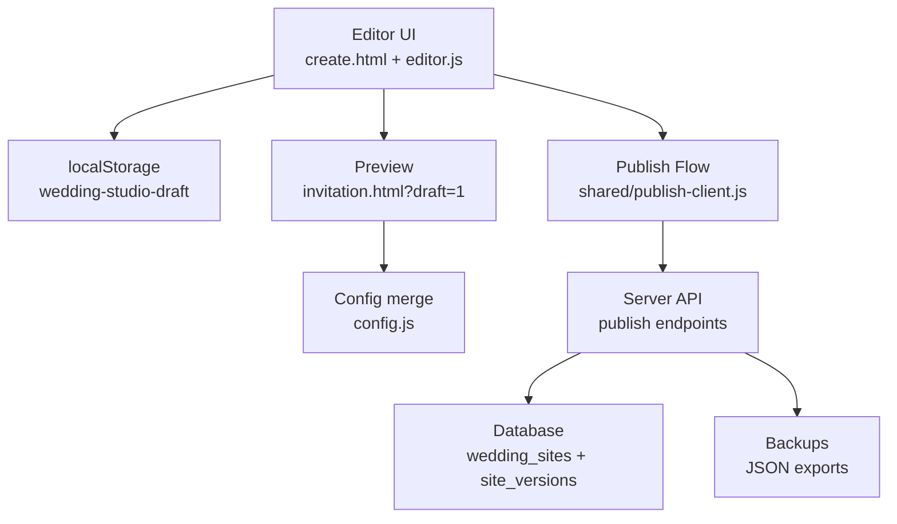
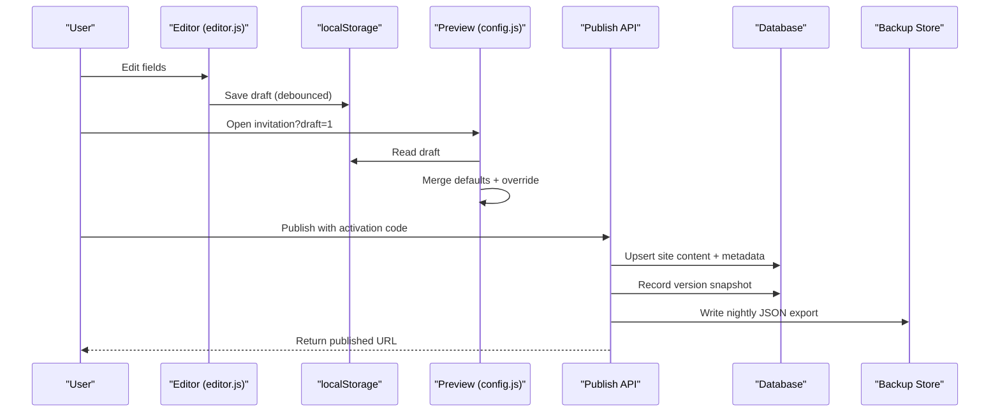
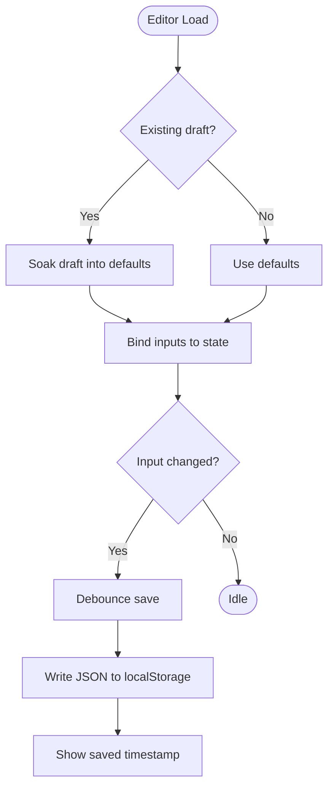
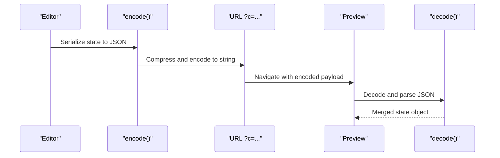
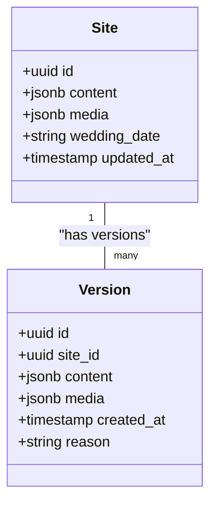
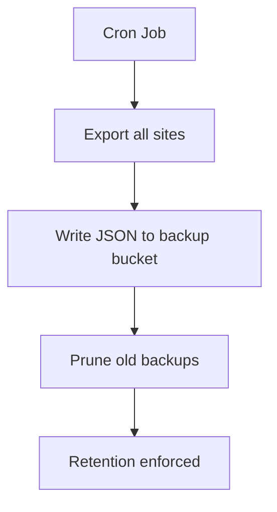
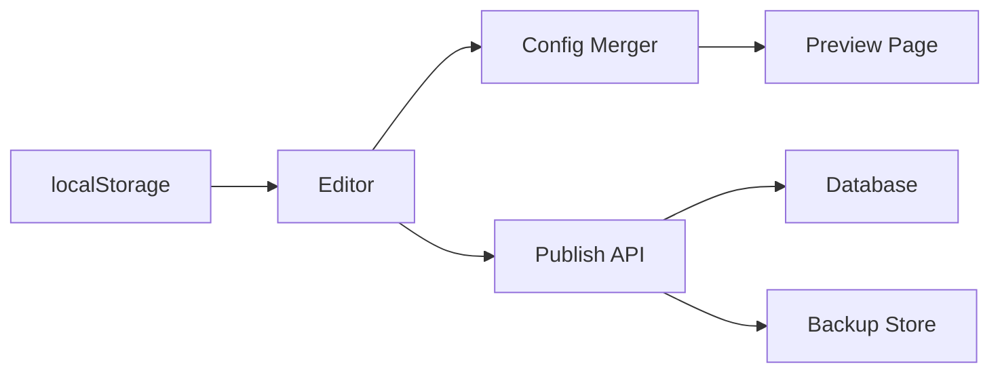

# Data Persistence & State Management

<cite>
**Referenced Files in This Document**
- [editor.js](file://3D Wedding Invitation Sample 2/editor.js)
- [config.js](file://3D Wedding Invitation Sample 2/config.js)
- [app.js](file://wedding/app.js)
- [create.html](file://3D Wedding Invitation Sample 2/create.html)
- [storage.js](file://api/_lib/storage.js)
- [keepalive.js](file://api/cron/keepalive.js)
- [schema.sql](file://supabase/schema.sql)
- [public-view.js](file://api/_lib/public-view.js)
</cite>

## Table of Contents
1. [Introduction](#introduction)
2. [Project Structure](#project-structure)
3. [Core Components](#core-components)
4. [Architecture Overview](#architecture-overview)
5. [Detailed Component Analysis](#detailed-component-analysis)
6. [Dependency Analysis](#dependency-analysis)
7. [Performance Considerations](#performance-considerations)
8. [Troubleshooting Guide](#troubleshooting-guide)
9. [Conclusion](#conclusion)
10. [Appendices](#appendices)

## Introduction
This document explains how user invitation data is persisted across browser sessions and how it flows from the editor to published invitations. It focuses on:
- localStorage-based draft persistence for the editor
- Data serialization and deserialization for sharing and previewing
- Automatic save mechanisms and conflict handling across tabs
- Versioning, migration, and backup/restore strategies
- Export capabilities and troubleshooting storage-related issues

The system uses a client-side draft store for editing and a server-side publish flow that persists published content with versioning and backups.

## Project Structure
The data persistence layer spans three areas:
- Client-side editor draft storage (localStorage)
- Client-side data sharing via URL-encoded payloads
- Server-side publishing, versioning, and backups

**Diagram sources**
- [editor.js:73-82](file://3D Wedding Invitation Sample 2/editor.js#L73-L82)
- [config.js:168-210](file://3D Wedding Invitation Sample 2/config.js#L168-L210)
- [keepalive.js:122-137](file://api/cron/keepalive.js#L122-L137)
- [schema.sql:259-337](file://supabase/schema.sql#L259-L337)

**Section sources**
- [editor.js:73-82](file://3D Wedding Invitation Sample 2/editor.js#L73-L82)
- [config.js:168-210](file://3D Wedding Invitation Sample 2/config.js#L168-L210)
- [keepalive.js:122-137](file://api/cron/keepalive.js#L122-L137)
- [schema.sql:259-337](file://supabase/schema.sql#L259-L337)

## Core Components
- Editor draft store: Saves the current design as JSON into localStorage under a dedicated key.
- Config merger: Merges defaults, overrides from URL or drafts, and derives fields like hashtags and dates.
- Sharing payload: Encodes/decodes invitation data for share links and previews.
- Publishing pipeline: Validates and publishes designs to the server, which stores versions and creates backups.
- Backup/export: Nightly JSON export of all sites; retention policy prunes old backups.

Key responsibilities:
- Persist edits locally without blocking the UI
- Merge incoming data safely while preserving defaults
- Ensure published content is validated and safe for public view
- Maintain historical versions and recoverable backups

**Section sources**
- [editor.js:73-82](file://3D Wedding Invitation Sample 2/editor.js#L73-L82)
- [config.js:168-210](file://3D Wedding Invitation Sample 2/config.js#L168-L210)
- [app.js:61-77](file://wedding/app.js#L61-L77)
- [keepalive.js:122-137](file://api/cron/keepalive.js#L122-L137)

## Architecture Overview
The architecture separates drafting, previewing, and publishing:
- Drafting: The editor writes to localStorage with debounced saves.
- Previewing: The invitation page merges defaults with overrides from URL or draft.
- Publishing: The server validates content, persists it, and maintains versions/backups.

**Diagram sources**
- [editor.js:73-82](file://3D Wedding Invitation Sample 2/editor.js#L73-L82)
- [config.js:168-210](file://3D Wedding Invitation Sample 2/config.js#L168-L210)
- [schema.sql:259-337](file://supabase/schema.sql#L259-L337)
- [keepalive.js:122-137](file://api/cron/keepalive.js#L122-L137)

## Detailed Component Analysis

### Editor Draft Storage (localStorage)
- Key: A dedicated localStorage key stores the full editor state as JSON.
- Debounced save: Saves are throttled to avoid excessive writes.
- Auto-merge: On load, existing drafts are merged into defaults using a shallow-safe soak function to prevent overwriting entire sections unintentionally.
- Reset and cleanup: Reset clears the draft; successful publish clears the draft after completion.

**Diagram sources**
- [editor.js:27-48](file://3D Wedding Invitation Sample 2/editor.js#L27-L48)
- [editor.js:73-82](file://3D Wedding Invitation Sample 2/editor.js#L73-L82)

**Section sources**
- [editor.js:27-48](file://3D Wedding Invitation Sample 2/editor.js#L27-L48)
- [editor.js:73-82](file://3D Wedding Invitation Sample 2/editor.js#L73-L82)
- [create.html:261-305](file://3D Wedding Invitation Sample 2/create.html#L261-L305)

### Data Serialization and Deserialization
- Share links: Invitation data can be encoded into URL parameters for sharing and previewing.
- Compression: Uses LZString when available; otherwise falls back to base64 encoding.
- Safe decoding: Decoding errors are caught to ensure the invitation still renders even if the link is truncated.

**Diagram sources**
- [app.js:61-77](file://wedding/app.js#L61-L77)

**Section sources**
- [app.js:61-77](file://wedding/app.js#L61-L77)

### Automatic Save Mechanisms
- Debouncing: Saves are delayed briefly to batch multiple rapid changes.
- UI feedback: A saved timestamp indicates the last successful write.
- Error handling: Writes are wrapped in try/catch to handle quota or permission errors gracefully.

**Section sources**
- [editor.js:73-82](file://3D Wedding Invitation Sample 2/editor.js#L73-L82)

### Conflict Resolution Across Tabs
- Single-writer model: Each tab maintains its own draft in localStorage. There is no cross-tab synchronization.
- Overwrite risk: If multiple tabs edit the same draft key, the last writer wins.
- Recommendation: Avoid editing the same draft in multiple tabs simultaneously.

[No sources needed since this section provides general guidance based on observed behavior]

### Versioning Strategy and Migration Handling
- Published versions: The server records each update as a new version snapshot, enabling rollbacks.
- Pruning: Versions are pruned to keep only the newest N per site.
- Migration approach: The editor merges incoming drafts into defaults using a safe soak function to preserve structure across schema changes.

**Diagram sources**
- [schema.sql:259-337](file://supabase/schema.sql#L259-L337)

**Section sources**
- [schema.sql:259-337](file://supabase/schema.sql#L259-L337)
- [editor.js:27-48](file://3D Wedding Invitation Sample 2/editor.js#L27-L48)

### Backup and Restore Functionality
- Nightly export: All sites are exported to JSON files with timestamps.
- Retention: Older backups are pruned to a fixed count.
- Recovery: The publish flow includes a recovery endpoint to retrieve previously published links.

**Diagram sources**
- [keepalive.js:122-137](file://api/cron/keepalive.js#L122-L137)
- [storage.js:151-182](file://api/_lib/storage.js#L151-L182)

**Section sources**
- [keepalive.js:122-137](file://api/cron/keepalive.js#L122-L137)
- [storage.js:151-182](file://api/_lib/storage.js#L151-L182)

### Data Export Capabilities
- Download config: The editor allows exporting the current configuration as a JavaScript file.
- Download brief: The editor allows exporting the current state as JSON for record-keeping or handoff.
- Email brief: The editor composes an email with the brief details and full configuration.

**Section sources**
- [editor.js:496-516](file://3D Wedding Invitation Sample 2/editor.js#L496-L516)
- [editor.js:632-642](file://3D Wedding Invitation Sample 2/editor.js#L632-L642)

### Custom Data Validators and Extending the Data Model
- Validation by type: Published content is validated against an allow-list per template to ensure safety and consistency.
- Extending the model: Add new fields to the editor form and bind them to the state; ensure the server’s allow-list includes new fields for publishing.
- Defaults and derivation: New fields should have sensible defaults and may be derived from existing fields (e.g., hashtag from names).

**Section sources**
- [public-view.js:1-21](file://api/_lib/public-view.js#L1-L21)
- [editor.js:94-131](file://3D Wedding Invitation Sample 2/editor.js#L94-L131)
- [config.js:155-163](file://3D Wedding Invitation Sample 2/config.js#L155-L163)

## Dependency Analysis
The persistence layer depends on:
- Client-side storage APIs (localStorage)
- URL-based data transport (encoded payloads)
- Server-side validation and persistence (database and storage)
- Cron jobs for maintenance (backup and pruning)

**Diagram sources**
- [editor.js:73-82](file://3D Wedding Invitation Sample 2/editor.js#L73-L82)
- [config.js:168-210](file://3D Wedding Invitation Sample 2/config.js#L168-L210)
- [keepalive.js:122-137](file://api/cron/keepalive.js#L122-L137)

**Section sources**
- [editor.js:73-82](file://3D Wedding Invitation Sample 2/editor.js#L73-L82)
- [config.js:168-210](file://3D Wedding Invitation Sample 2/config.js#L168-L210)
- [keepalive.js:122-137](file://api/cron/keepalive.js#L122-L137)

## Performance Considerations
- Debounced saves reduce write frequency and improve responsiveness.
- Merging defaults with overrides avoids unnecessary re-renders.
- Server-side versioning and pruning manage storage growth.
- Backups are scheduled nightly to minimize impact on live operations.

[No sources needed since this section provides general guidance]

## Troubleshooting Guide
Common storage-related issues:
- Quota exceeded: LocalStorage has size limits; large drafts may fail to save. Monitor usage and consider clearing old drafts.
- Browser compatibility: Some browsers restrict localStorage access in private mode or third-party contexts.
- Cross-tab conflicts: Multiple tabs editing the same draft can overwrite each other; use single-tab editing.
- Truncated share links: If a link is cut short, decoding fails; the invitation still renders with defaults.

Recovery steps:
- Clear the draft and start fresh if corruption occurs.
- Use the publish recovery endpoint to retrieve previously published links.
- Check server logs for upstream failures during publishing.

**Section sources**
- [app.js:61-77](file://wedding/app.js#L61-L77)
- [editor.js:561-568](file://3D Wedding Invitation Sample 2/editor.js#L561-L568)
- [keepalive.js:122-137](file://api/cron/keepalive.js#L122-L137)

## Conclusion
The data persistence layer combines client-side drafting with server-side publishing to provide a robust workflow for creating and managing wedding invitations. LocalStorage ensures drafts persist across sessions, while server-side versioning and backups protect published content. The system emphasizes safety through validation and graceful error handling, making it resilient across different environments and user scenarios.

[No sources needed since this section summarizes without analyzing specific files]

## Appendices
- Example: Implementing a custom validator for a new field involves updating the editor binding and ensuring the server’s allow-list includes the field.
- Example: Extending the data model requires adding UI elements, default values, and merging logic to maintain backward compatibility.
- Example: Troubleshooting localStorage issues includes checking quotas, permissions, and cross-tab behavior.

[No sources needed since this section provides general guidance]