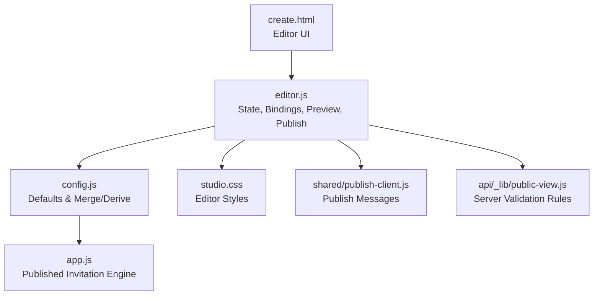
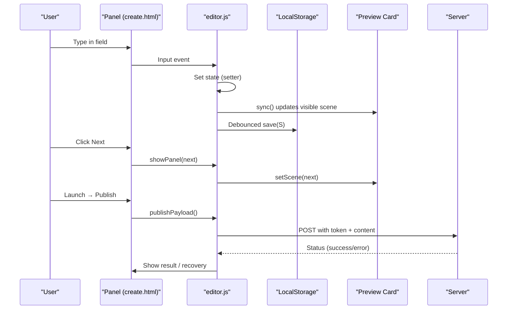
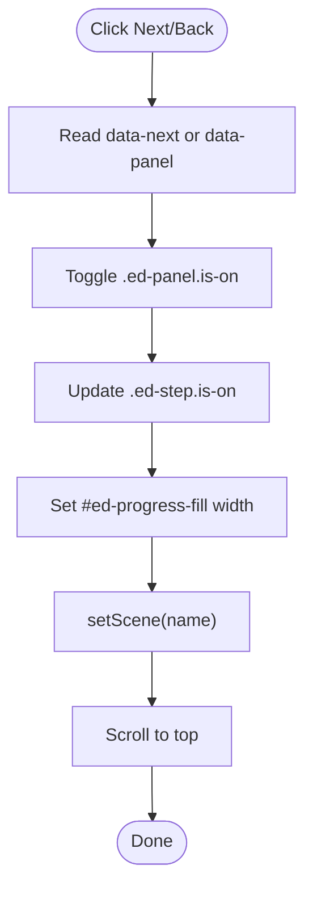
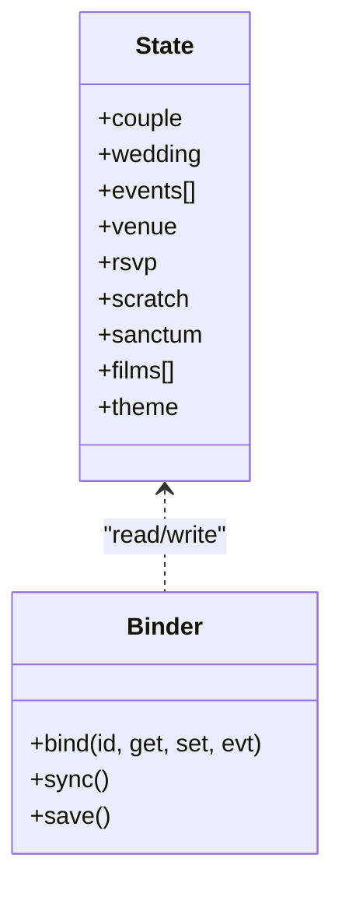
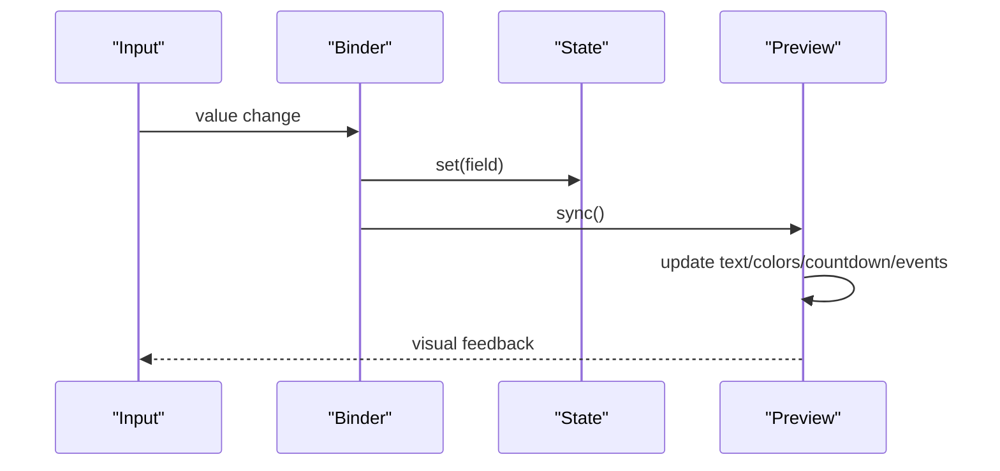
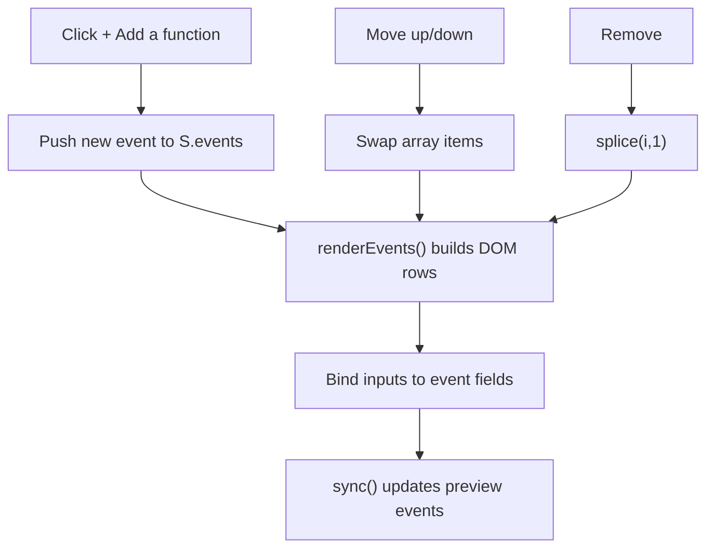
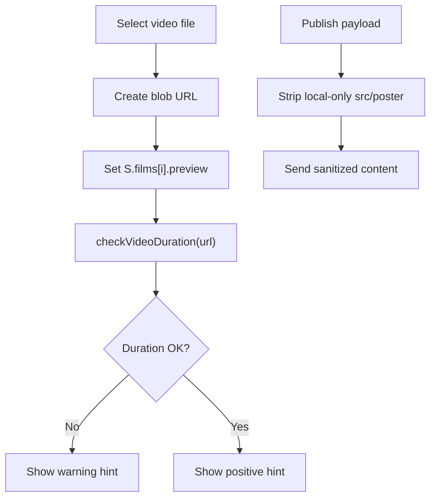
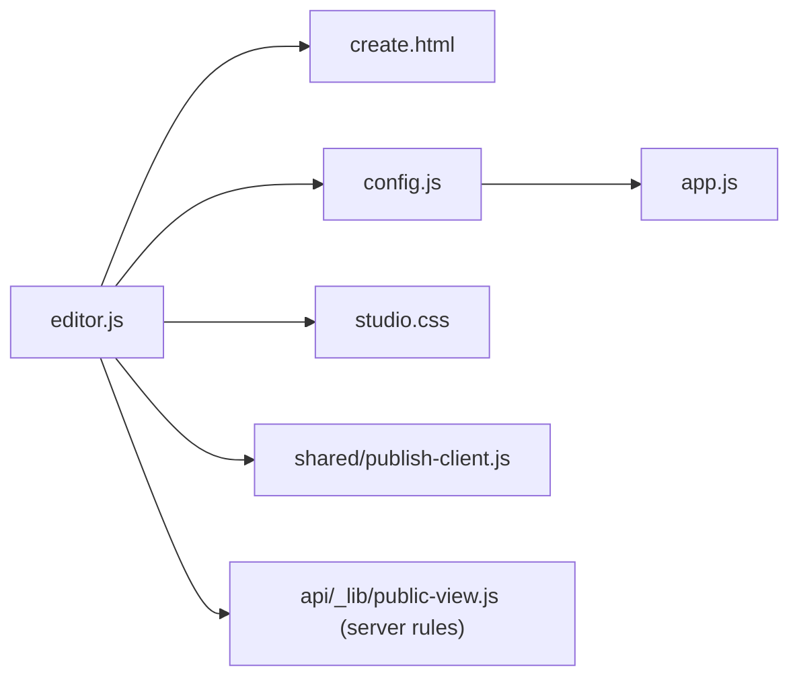

# Form Management System

<cite>
**Referenced Files in This Document**
- [create.html](file://3D Wedding Invitation Sample 2/create.html)
- [editor.js](file://3D Wedding Invitation Sample 2/editor.js)
- [config.js](file://3D Wedding Invitation Sample 2/config.js)
- [app.js](file://3D Wedding Invitation Sample 2/app.js)
- [studio.css](file://3D Wedding Invitation Sample 2/studio.css)
- [public-view.js](file://api/_lib/public-view.js)
- [publish-client.js](file://shared/publish-client.js)
</cite>

## Table of Contents
1. Introduction
2. Project Structure
3. Core Components
4. Architecture Overview
5. Detailed Component Analysis
6. Dependency Analysis
7. Performance Considerations
8. Troubleshooting Guide
9. Conclusion
10. Appendices

## Introduction
This document explains the form management system used by the wedding invitation editor to collect and manage all user inputs across a multi-step wizard. It covers:
- Multi-step navigation between panels (couple, events, venue/RSVP, videos, blessing, theme, launch)
- Field binding and live preview updates
- Validation rules and error handling patterns
- Data persistence and publishing flow
- Accessibility features
- Practical guidance for adding fields, custom validation, and extending steps

The system is implemented primarily in the editor page and its JavaScript module, with configuration and runtime behavior bridged into the published invitation engine.

## Project Structure
The editor lives under the “3D Wedding Invitation Sample 2” folder and consists of:
- create.html: The UI shell containing step panels, navigation, and the live preview card
- editor.js: The core form state, bindings, validation helpers, preview sync, and publish actions
- config.js: Default data model and merge/derive logic that powers both editor defaults and published content
- app.js: The published invitation engine that consumes the merged configuration and renders the final experience
- studio.css: Editor-specific styles including panel layout, accessibility focus states, and preview scenes
- shared and api modules: Publishing client messages and server-side validation rules applied when generating public views

**Diagram sources**
- [create.html:51-59](file://3D Wedding Invitation Sample 2/create.html#L51-L59)
- [editor.js:27-48](file://3D Wedding Invitation Sample 2/editor.js#L27-L48)
- [config.js:6-123](file://3D Wedding Invitation Sample 2/config.js#L6-L123)
- [studio.css:234-311](file://3D Wedding Invitation Sample 2/studio.css#L234-L311)
- [publish-client.js:49-70](file://shared/publish-client.js#L49-L70)
- [public-view.js:21-53](file://api/_lib/public-view.js#L21-L53)
- [app.js:6-10](file://3D Wedding Invitation Sample 2/app.js#L6-L10)

**Section sources**
- [create.html:51-59](file://3D Wedding Invitation Sample 2/create.html#L51-L59)
- [editor.js:27-48](file://3D Wedding Invitation Sample 2/editor.js#L27-L48)
- [config.js:6-123](file://3D Wedding Invitation Sample 2/config.js#L6-L123)
- [studio.css:234-311](file://3D Wedding Invitation Sample 2/studio.css#L234-L311)
- [publish-client.js:49-70](file://shared/publish-client.js#L49-L70)
- [public-view.js:21-53](file://api/_lib/public-view.js#L21-L53)
- [app.js:6-10](file://3D Wedding Invitation Sample 2/app.js#L6-L10)

## Core Components
- State model: A single state object S holds couple, wedding, events, venue, rsvp, scratch, sanctum, films, and theme. Defaults are loaded from WEDDING_DEFAULTS and merged with any saved draft or URL-encoded design.
- Binding layer: A small bind() helper wires DOM inputs to state getters/setters and triggers live preview sync and debounced save.
- Step navigation: Panels are toggled via data attributes; progress bar updates; preview scene switches to match the active step.
- Live preview: A sticky preview card mirrors the current step’s section and updates in real time as fields change.
- Persistence: LocalStorage draft saving with debounce; reset clears storage and reloads defaults.
- Publishing: Prepares payload, strips local-only media, posts to the server using a token, and shows success/recovery flows.

Key responsibilities by file:
- editor.js: All form logic, validation helpers, preview sync, and publish orchestration
- create.html: Panel markup, field IDs, and navigation buttons
- config.js: Default structure and derive logic for derived fields like hashtag and city
- app.js: Consumes merged config to render the published invitation
- studio.css: Editor UX, focus states, responsive grid, and preview scene styling
- publish-client.js: Human-readable error messages for publish failures
- public-view.js: Server-side validation rules for safe rendering

**Section sources**
- [editor.js:27-48](file://3D Wedding Invitation Sample 2/editor.js#L27-L48)
- [editor.js:84-131](file://3D Wedding Invitation Sample 2/editor.js#L84-L131)
- [editor.js:329-342](file://3D Wedding Invitation Sample 2/editor.js#L329-L342)
- [editor.js:394-471](file://3D Wedding Invitation Sample 2/editor.js#L394-L471)
- [editor.js:531-611](file://3D Wedding Invitation Sample 2/editor.js#L531-L611)
- [create.html:67-305](file://3D Wedding Invitation Sample 2/create.html#L67-L305)
- [config.js:6-123](file://3D Wedding Invitation Sample 2/config.js#L6-L123)
- [studio.css:234-311](file://3D Wedding Invitation Sample 2/studio.css#L234-L311)
- [publish-client.js:49-70](file://shared/publish-client.js#L49-L70)
- [public-view.js:21-53](file://api/_lib/public-view.js#L21-L53)

## Architecture Overview
The editor uses a unidirectional data flow:
- User input → bound setter → update S → sync preview → debounced save
- Navigation → showPanel → update progress → switch preview scene
- Publish → sanitize payload → call publish client → handle status

**Diagram sources**
- [editor.js:84-131](file://3D Wedding Invitation Sample 2/editor.js#L84-L131)
- [editor.js:329-342](file://3D Wedding Invitation Sample 2/editor.js#L329-L342)
- [editor.js:394-471](file://3D Wedding Invitation Sample 2/editor.js#L394-L471)
- [editor.js:531-611](file://3D Wedding Invitation Sample 2/editor.js#L531-L611)
- [create.html:51-59](file://3D Wedding Invitation Sample 2/create.html#L51-L59)

## Detailed Component Analysis

### Multi-step Form Navigation
- Steps are defined in the header nav with data-panel targets.
- showPanel toggles visibility of .ed-panel elements, highlights the active step button, updates the progress bar width based on an ordered list of steps, and sets the preview scene to match.
- “Next” and “Back” buttons use data-next to navigate.

**Diagram sources**
- [editor.js:329-342](file://3D Wedding Invitation Sample 2/editor.js#L329-L342)
- [create.html:51-59](file://3D Wedding Invitation Sample 2/create.html#L51-L59)

**Section sources**
- [editor.js:329-342](file://3D Wedding Invitation Sample 2/editor.js#L329-L342)
- [create.html:51-59](file://3D Wedding Invitation Sample 2/create.html#L51-L59)

### Field Binding and Data Model
- A generic bind(id, get, set, evt) wires inputs to state and triggers sync/save.
- Fields cover:
  - Couple: bride, groom, full names, monogram, hashtag, tagline
  - Muhurat: date, time, timezone, muhurat line
  - Venue: name, address, city, maps query
  - RSVP: formUrl, deadline
  - Blessing: scratch heading/message, sanctum heading/hint
  - Films: eyebrow, line, src, optional file upload (preview only)
  - Theme: six color swatches and presets
- Derived fields:
  - Hashtag auto-derived if missing
  - City inferred from address if missing
  - Short date derived from display date and city

**Diagram sources**
- [editor.js:27-48](file://3D Wedding Invitation Sample 2/editor.js#L27-L48)
- [editor.js:84-131](file://3D Wedding Invitation Sample 2/editor.js#L84-L131)
- [config.js:6-123](file://3D Wedding Invitation Sample 2/config.js#L6-L123)

**Section sources**
- [editor.js:84-131](file://3D Wedding Invitation Sample 2/editor.js#L84-L131)
- [editor.js:133-196](file://3D Wedding Invitation Sample 2/editor.js#L133-L196)
- [editor.js:198-215](file://3D Wedding Invitation Sample 2/editor.js#L198-L215)
- [config.js:6-123](file://3D Wedding Invitation Sample 2/config.js#L6-L123)

### Live Preview Updates
- sync() updates the preview card’s text, colors, countdown, events list, venue details, RSVP kind, film captions, blessing text, and palette swatches.
- Contextual scenes: Only the scene matching the active step is shown; “launch” reveals all scenes for a full read-through.
- Name board sizing adapts to available width to keep names legible.

**Diagram sources**
- [editor.js:394-471](file://3D Wedding Invitation Sample 2/editor.js#L394-L471)
- [editor.js:319-327](file://3D Wedding Invitation Sample 2/editor.js#L319-L327)

**Section sources**
- [editor.js:319-327](file://3D Wedding Invitation Sample 2/editor.js#L319-L327)
- [editor.js:394-471](file://3D Wedding Invitation Sample 2/editor.js#L394-L471)

### Events Management (Dynamic Function Cards)
- The Events panel renders a dynamic list of function cards with controls to add, reorder, edit, and delete entries.
- Each card exposes fields for name, icon, date, time, venue, description, and accent color.
- Changes update the preview’s events list immediately.

**Diagram sources**
- [editor.js:217-285](file://3D Wedding Invitation Sample 2/editor.js#L217-L285)
- [editor.js:412-421](file://3D Wedding Invitation Sample 2/editor.js#L412-L421)

**Section sources**
- [editor.js:217-285](file://3D Wedding Invitation Sample 2/editor.js#L217-L285)
- [editor.js:412-421](file://3D Wedding Invitation Sample 2/editor.js#L412-L421)

### Venue and RSVP Configuration
- Venue fields include name, address, city, and maps query.
- RSVP supports either a Google Form link or built-in form; preview indicates which mode is active.
- Deadline text is displayed in preview.

**Section sources**
- [editor.js:120-126](file://3D Wedding Invitation Sample 2/editor.js#L120-L126)
- [editor.js:423-429](file://3D Wedding Invitation Sample 2/editor.js#L423-L429)
- [create.html:126-151](file://3D Wedding Invitation Sample 2/create.html#L126-L151)

### Video Upload Handling
- Three video slots allow setting eyebrow, caption, and direct MP4/WebM URL.
- File picker creates a temporary blob URL for live preview only; it does not persist to the published site.
- Duration feedback warns if too short/long and recommends 10–50 seconds (max 60s).
- On publish, local-only sources are stripped to prevent broken links for guests.

**Diagram sources**
- [editor.js:133-196](file://3D Wedding Invitation Sample 2/editor.js#L133-L196)
- [editor.js:531-542](file://3D Wedding Invitation Sample 2/editor.js#L531-L542)

**Section sources**
- [editor.js:133-196](file://3D Wedding Invitation Sample 2/editor.js#L133-L196)
- [editor.js:531-542](file://3D Wedding Invitation Sample 2/editor.js#L531-L542)

### Blessing Message Editing
- Scratch card heading and message, plus sanctum heading and hint, are editable and reflected in the preview’s foil/messaging scene.

**Section sources**
- [editor.js:127-131](file://3D Wedding Invitation Sample 2/editor.js#L127-L131)
- [editor.js:438-442](file://3D Wedding Invitation Sample 2/editor.js#L438-L442)
- [create.html:224-240](file://3D Wedding Invitation Sample 2/create.html#L224-L240)

### Theme Customization
- Six color swatches control primary, deep, gold, soft gold, ivory, and ink.
- Preset palettes can be applied; changes propagate to CSS variables and preview swatches.

**Section sources**
- [editor.js:198-215](file://3D Wedding Invitation Sample 2/editor.js#L198-L215)
- [editor.js:394-401](file://3D Wedding Invitation Sample 2/editor.js#L394-L401)
- [create.html:242-259](file://3D Wedding Invitation Sample 2/create.html#L242-L259)

### Form State Management and Persistence
- State S is initialized from defaults and merged with any saved draft or URL-encoded design.
- Debounced save writes JSON to localStorage; toast shows last saved time.
- Reset clears storage and reloads defaults.

**Section sources**
- [editor.js:27-48](file://3D Wedding Invitation Sample 2/editor.js#L27-L48)
- [editor.js:73-82](file://3D Wedding Invitation Sample 2/editor.js#L73-L82)
- [editor.js:643-647](file://3D Wedding Invitation Sample 2/editor.js#L643-L647)

### Error Handling Patterns
- Publish flow:
  - Validates presence of activation token
  - Strips invalid media before sending
  - Uses publish client messages for user-friendly errors
  - Offers recovery option if initial request fails
- Draft safety:
  - Draft is never cleared on failure; only after successful publish
- Server-side validation:
  - Public view enforces type-safe fields (text length, hex colors, https URLs, allowed media markers)

**Section sources**
- [editor.js:570-611](file://3D Wedding Invitation Sample 2/editor.js#L570-L611)
- [publish-client.js:49-70](file://shared/publish-client.js#L49-L70)
- [public-view.js:21-53](file://api/_lib/public-view.js#L21-L53)

### Accessibility Features
- Focus-visible outlines for keyboard navigation
- aria-labels on interactive elements (e.g., seal button, publish status)
- aria-live regions for status updates (toast, publish status)
- Semantic headings and labels for screen readers
- Reduced motion support via CSS media query

**Section sources**
- [studio.css:21-22](file://3D Wedding Invitation Sample 2/studio.css#L21-L22)
- [create.html:280-302](file://3D Wedding Invitation Sample 2/create.html#L280-L302)
- [app.js:93-94](file://3D Wedding Invitation Sample 2/app.js#L93-L94)
- [studio.css:458-461](file://3D Wedding Invitation Sample 2/studio.css#L458-L461)

## Dependency Analysis
- editor.js depends on:
  - create.html for DOM structure and element IDs
  - config.js for default data and merge/derive behavior
  - studio.css for editor UI and preview styling
  - shared/publish-client.js for publish messaging
  - api/_lib/public-view.js indirectly via server validation during publishing
- app.js consumes the merged configuration to render the published invitation and RSVP behavior

**Diagram sources**
- [editor.js:27-48](file://3D Wedding Invitation Sample 2/editor.js#L27-L48)
- [config.js:138-211](file://3D Wedding Invitation Sample 2/config.js#L138-L211)
- [app.js:6-10](file://3D Wedding Invitation Sample 2/app.js#L6-L10)

**Section sources**
- [editor.js:27-48](file://3D Wedding Invitation Sample 2/editor.js#L27-L48)
- [config.js:138-211](file://3D Wedding Invitation Sample 2/config.js#L138-L211)
- [app.js:6-10](file://3D Wedding Invitation Sample 2/app.js#L6-L10)

## Performance Considerations
- Debounced saves reduce write frequency to localStorage
- Preview hydration for videos occurs only when the Videos step is opened to avoid unnecessary loads
- Name board sizing uses canvas measurement to avoid layout thrashing
- Reduced motion respected for users who prefer fewer animations

[No sources needed since this section provides general guidance]

## Troubleshooting Guide
Common issues and resolutions:
- Videos not appearing for guests: Ensure you paste a hosted web URL; uploaded files are preview-only and stripped on publish
- Invalid activation code: Use the provided code exactly; recover your published link if already issued
- Large media rejected: Reduce photo/video sizes; server enforces limits and safe types
- Draft lost: Check device storage; reset clears it intentionally; export JSON brief regularly

Actionable checks:
- Verify RSVP form URL is not a placeholder and points to an accessible endpoint
- Confirm muhurat date/time is valid and in the future
- Validate theme colors are proper hex values (enforced server-side)
- Review publish status messages for precise next steps

**Section sources**
- [editor.js:531-542](file://3D Wedding Invitation Sample 2/editor.js#L531-L542)
- [editor.js:570-611](file://3D Wedding Invitation Sample 2/editor.js#L570-L611)
- [public-view.js:21-53](file://api/_lib/public-view.js#L21-L53)
- [publish-client.js:49-70](file://shared/publish-client.js#L49-L70)

## Conclusion
The form management system provides a robust, accessible, and user-friendly way to build a fully customized wedding invitation. Its clear separation of concerns—state, bindings, preview, persistence, and publishing—makes it straightforward to extend with new fields, validations, and steps while maintaining a consistent live-preview experience and safe publishing pipeline.

[No sources needed since this section summarizes without analyzing specific files]

## Appendices

### How to Add a New Form Field
Steps:
1. Add the input element in create.html within the appropriate panel, ensuring a unique id and label
2. In editor.js, add a bind() call mapping the input to a path in S (e.g., S.couple.newField)
3. If needed, update sync() to reflect the field in the preview
4. Optionally add validation hints or constraints in the UI
5. Test multi-step navigation and preview updates

Example references:
- Adding a simple text field similar to existing ones
- Wiring to state and preview

**Section sources**
- [editor.js:84-131](file://3D Wedding Invitation Sample 2/editor.js#L84-L131)
- [editor.js:394-471](file://3D Wedding Invitation Sample 2/editor.js#L394-L471)
- [create.html:67-112](file://3D Wedding Invitation Sample 2/create.html#L67-L112)

### Implementing Custom Validation Rules
Patterns used in the codebase:
- Inline hints for duration and warnings (video duration check)
- Checklist indicators to guide completion
- Server-side validation for safety (type checks, URL schemes, color formats)

To implement:
- Create a validator function that inspects the field value and updates UI hints
- Integrate with bind() or input handlers to run validation on change
- For publish-time safety, ensure server-side rules in public-view.js enforce constraints

**Section sources**
- [editor.js:176-196](file://3D Wedding Invitation Sample 2/editor.js#L176-L196)
- [editor.js:473-487](file://3D Wedding Invitation Sample 2/editor.js#L473-L487)
- [public-view.js:21-53](file://api/_lib/public-view.js#L21-L53)

### Extending the Form Wizard with Additional Steps
To add a new step:
1. Add a new step button in create.html with data-panel
2. Add a new panel div with data-panel and content
3. Update the order array in showPanel to include the new step
4. Add preview scene(s) and update setScene logic if needed
5. Wire any fields to state and sync()

**Section sources**
- [create.html:51-59](file://3D Wedding Invitation Sample 2/create.html#L51-L59)
- [editor.js:329-342](file://3D Wedding Invitation Sample 2/editor.js#L329-L342)
- [editor.js:319-327](file://3D Wedding Invitation Sample 2/editor.js#L319-L327)