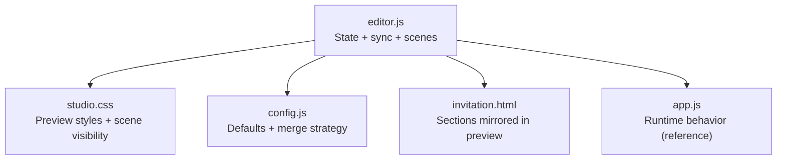
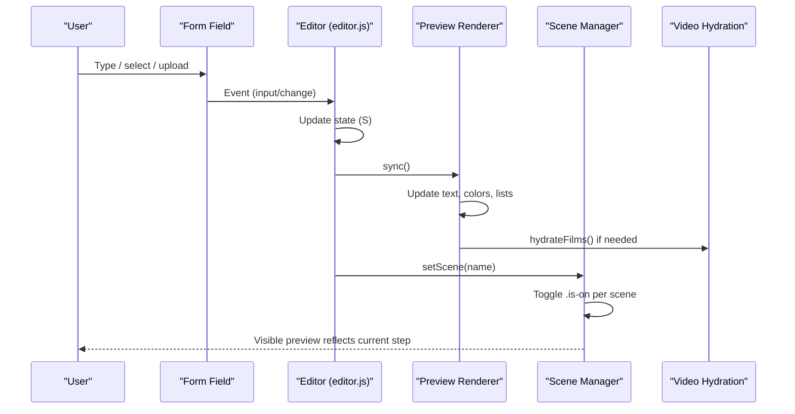
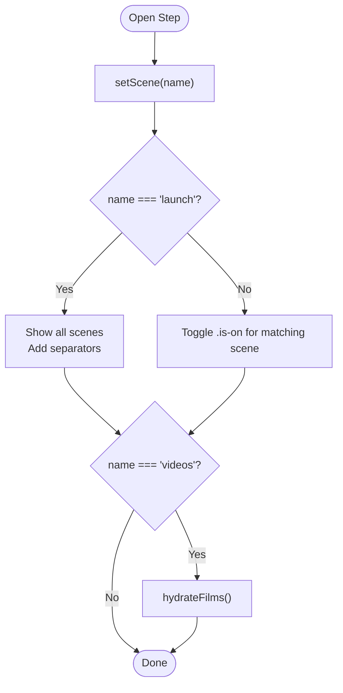
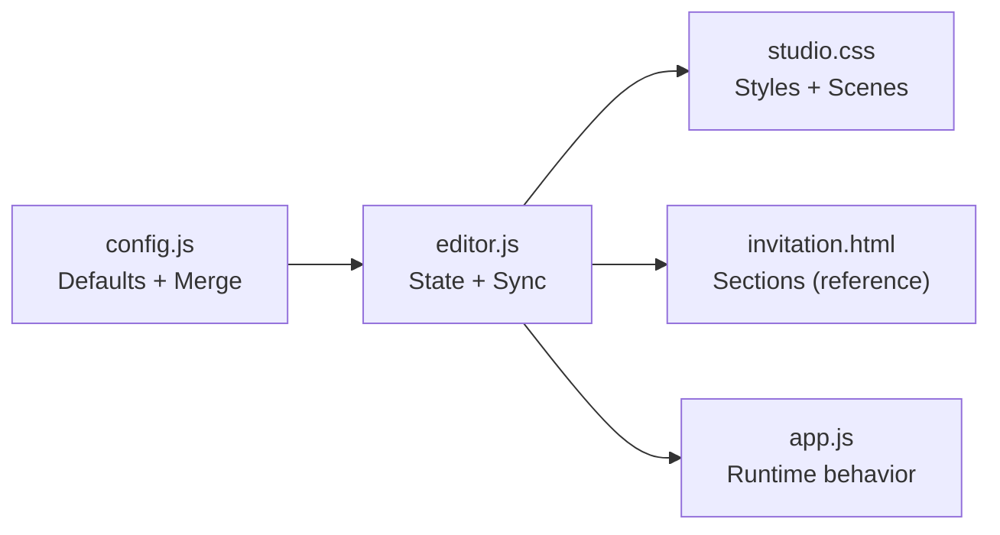

# Live Preview System

<cite>
**Referenced Files in This Document**
- [editor.js](file://3D Wedding Invitation Sample 2/editor.js)
- [studio.css](file://3D Wedding Invitation Sample 2/studio.css)
- [config.js](file://3D Wedding Invitation Sample 2/config.js)
- [app.js](file://3D Wedding Invitation Sample 2/app.js)
- [invitation.html](file://3D Wedding Invitation Sample 2/invitation.html)
</cite>

## Table of Contents
1. [Introduction](#introduction)
2. [Project Structure](#project-structure)
3. [Core Components](#core-components)
4. [Architecture Overview](#architecture-overview)
5. [Detailed Component Analysis](#detailed-component-analysis)
6. [Dependency Analysis](#dependency-analysis)
7. [Performance Considerations](#performance-considerations)
8. [Troubleshooting Guide](#troubleshooting-guide)
9. [Conclusion](#conclusion)
10. [Appendices](#appendices)

## Introduction
This document explains the live preview system used by the wedding invitation editor to provide real-time visual feedback as users edit content. It covers:
- How the preview renders and updates synchronously with form changes
- Scene-based switching that mirrors the currently open editor step
- Handling of different content types (text, colors, videos)
- Memory management and performance techniques for smooth updates
- The preview card architecture, scene isolation, and lazy loading strategies
- Practical guidance for adding new scenes, optimizing large content previews, and debugging rendering issues

## Project Structure
The live preview is implemented primarily in the editor’s client-side code and styled via dedicated CSS. Key files:
- Editor logic and preview synchronization: editor.js
- Preview styling and scene visibility: studio.css
- Configuration and defaults merged into the final config: config.js
- Production invitation engine (for reference on how data flows at runtime): app.js
- Invitation HTML structure (for understanding rendered sections): invitation.html

**Diagram sources**
- [editor.js:287-346](file://3D Wedding Invitation Sample 2/editor.js#L287-L346)
- [studio.css:394-462](file://3D Wedding Invitation Sample 2/studio.css#L394-L462)
- [config.js:138-212](file://3D Wedding Invitation Sample 2/config.js#L138-L212)
- [invitation.html:135-286](file://3D Wedding Invitation Sample 2/invitation.html#L135-L286)
- [app.js:347-606](file://3D Wedding Invitation Sample 2/app.js#L347-L606)

**Section sources**
- [editor.js:287-346](file://3D Wedding Invitation Sample 2/editor.js#L287-L346)
- [studio.css:394-462](file://3D Wedding Invitation Sample 2/studio.css#L394-L462)
- [config.js:138-212](file://3D Wedding Invitation Sample 2/config.js#L138-L212)
- [invitation.html:135-286](file://3D Wedding Invitation Sample 2/invitation.html#L135-L286)
- [app.js:347-606](file://3D Wedding Invitation Sample 2/app.js#L347-L606)

## Core Components
- State model: a single state object holds couple details, wedding date/time, venue, events, films, scratch/blessing text, and theme colors.
- Form bindings: input fields update the state and trigger a synchronous preview refresh.
- Preview renderer: a function updates DOM nodes inside a preview card to reflect current state.
- Scene manager: toggles which preview scene is visible based on the active editor step; “launch” shows all scenes.
- Lazy hydration: video elements are only attached when their scene becomes visible or during full read-through.

Key responsibilities:
- Synchronization: every change calls a central sync routine that updates the preview.
- Scene isolation: each section of the preview is wrapped in a scene container controlled by data attributes and classes.
- Performance: minimize layout thrash, avoid unnecessary network requests, and defer heavy work until needed.

**Section sources**
- [editor.js:84-132](file://3D Wedding Invitation Sample 2/editor.js#L84-L132)
- [editor.js:394-471](file://3D Wedding Invitation Sample 2/editor.js#L394-L471)
- [editor.js:287-346](file://3D Wedding Invitation Sample 2/editor.js#L287-L346)
- [studio.css:394-462](file://3D Wedding Invitation Sample 2/studio.css#L394-L462)

## Architecture Overview
The preview system follows a unidirectional data flow:
- User edits a field → bound handler updates state → sync() updates the preview → scene manager ensures the correct scene is visible.

**Diagram sources**
- [editor.js:84-132](file://3D Wedding Invitation Sample 2/editor.js#L84-L132)
- [editor.js:394-471](file://3D Wedding Invitation Sample 2/editor.js#L394-L471)
- [editor.js:287-346](file://3D Wedding Invitation Sample 2/editor.js#L287-L346)

## Detailed Component Analysis

### Preview Rendering Engine
- Central sync function updates all preview elements from the current state:
  - Theme variables applied as CSS custom properties on the preview card
  - Couple monogram, tagline, date display, muhurat, venue name, hashtag
  - Events list rendered from the events array
  - Venue address, maps query, RSVP deadline, and RSVP type indicator
  - Film captions updated; videos hydrated lazily
  - Blessing headings/messages updated
  - Palette swatches generated from theme colors
  - Countdown timer ticked once per second while active
- Name board sizing uses canvas measurement to fit names without overflow, mirroring production behavior.

Optimization highlights:
- Avoids repeated DOM queries by caching selectors where practical
- Uses CSS variables for theme updates instead of per-element style changes
- Defers video hydration until the relevant scene is visible

**Section sources**
- [editor.js:394-471](file://3D Wedding Invitation Sample 2/editor.js#L394-L471)
- [editor.js:350-393](file://3D Wedding Invitation Sample 2/editor.js#L350-L393)

### Scene-Based Preview Switching
- Each editor step corresponds to a preview scene identified by a data attribute.
- setScene toggles visibility using a class and sets a label describing what is shown.
- “Launch” mode unhides all scenes and adds separators for readability.
- Videos are hydrated only when entering the videos scene or launch mode to avoid unnecessary downloads.

**Diagram sources**
- [editor.js:287-346](file://3D Wedding Invitation Sample 2/editor.js#L287-L346)

**Section sources**
- [editor.js:287-346](file://3D Wedding Invitation Sample 2/editor.js#L287-L346)
- [studio.css:394-411](file://3D Wedding Invitation Sample 2/studio.css#L394-L411)

### Content Types Handling
- Text: direct textContent updates for labels, headings, messages, and dynamic lists.
- Colors: theme values are applied as CSS custom properties on the preview card root, ensuring consistent color usage across scenes.
- Videos:
  - In-editor file picks create temporary blob URLs for local preview only; these are not persisted or published.
  - Published/public src values are validated to ensure they are accessible to guests.
  - Video hydration attaches src/poster only when the videos scene is visible.
  - Duration checks inform creators about recommended lengths.

**Section sources**
- [editor.js:133-196](file://3D Wedding Invitation Sample 2/editor.js#L133-L196)
- [editor.js:298-327](file://3D Wedding Invitation Sample 2/editor.js#L298-L327)
- [editor.js:394-471](file://3D Wedding Invitation Sample 2/editor.js#L394-L471)

### Memory Usage During Editing Sessions
- Local-only sources (blob:, data:, file:) are stripped before publishing to prevent dead links.
- Temporary blob URLs created for local video previews are not saved to persistent storage.
- The preview avoids preloading all videos; hydration is deferred until necessary.
- For production-level frame handling (reference), bitmap rings evict unused frames to keep memory bounded; this pattern informs the editor’s conservative approach to media.

**Section sources**
- [editor.js:527-542](file://3D Wedding Invitation Sample 2/editor.js#L527-L542)
- [editor.js:133-196](file://3D Wedding Invitation Sample 2/editor.js#L133-L196)
- [app.js:347-477](file://3D Wedding Invitation Sample 2/app.js#L347-L477)

### Preview Card Architecture and Scene Isolation
- The preview card applies theme variables via CSS custom properties for consistent styling.
- Scenes are isolated containers with a common class and a data attribute indicating the target scene.
- Only one scene is visible at a time except in “launch” mode, where all scenes are shown with clear separation.
- Styling ensures long scenes (videos, launch) scroll within the card and drop decorative borders appropriately.

**Section sources**
- [studio.css:350-462](file://3D Wedding Invitation Sample 2/studio.css#L350-L462)
- [editor.js:287-346](file://3D Wedding Invitation Sample 2/editor.js#L287-L346)

### Lazy Loading Strategies
- Videos:
  - In-editor: attach src/poster only when the videos scene is opened; otherwise leave empty to avoid network usage.
  - Production: use data-src and data-poster attributes; assign actual src/poster only when needed.
- Images and frames:
  - Production uses bitmap rings with eviction to limit memory footprint and streaming to keep playback smooth.
- Audio:
  - Background audio is started after user interaction and paused/suspended when not visible to conserve resources.

**Section sources**
- [editor.js:298-327](file://3D Wedding Invitation Sample 2/editor.js#L298-L327)
- [app.js:108-132](file://3D Wedding Invitation Sample 2/app.js#L108-L132)
- [app.js:347-477](file://3D Wedding Invitation Sample 2/app.js#L347-L477)
- [app.js:181-345](file://3D Wedding Invitation Sample 2/app.js#L181-L345)

## Dependency Analysis
- editor.js depends on:
  - DOM elements in the preview card (scenes, labels, counters)
  - CSS classes and custom properties defined in studio.css
  - State derived from config.js defaults and merges
- config.js provides:
  - Default configuration and merging rules for overrides (draft, published, encoded links)
  - Derived fields like hashtags and city short names
- app.js serves as the production counterpart, demonstrating how the same data drives the live invitation experience.

**Diagram sources**
- [config.js:138-212](file://3D Wedding Invitation Sample 2/config.js#L138-L212)
- [editor.js:287-346](file://3D Wedding Invitation Sample 2/editor.js#L287-L346)
- [studio.css:394-462](file://3D Wedding Invitation Sample 2/studio.css#L394-L462)
- [invitation.html:135-286](file://3D Wedding Invitation Sample 2/invitation.html#L135-L286)
- [app.js:347-606](file://3D Wedding Invitation Sample 2/app.js#L347-L606)

**Section sources**
- [config.js:138-212](file://3D Wedding Invitation Sample 2/config.js#L138-L212)
- [editor.js:287-346](file://3D Wedding Invitation Sample 2/editor.js#L287-L346)
- [studio.css:394-462](file://3D Wedding Invitation Sample 2/studio.css#L394-L462)
- [invitation.html:135-286](file://3D Wedding Invitation Sample 2/invitation.html#L135-L286)
- [app.js:347-606](file://3D Wedding Invitation Sample 2/app.js#L347-L606)

## Performance Considerations
- Minimize reflows: batch DOM updates within sync() and avoid reading layout properties mid-update.
- Defer heavy work: video hydration occurs only when the videos scene is visible or during launch.
- Use CSS variables for theme updates to avoid per-element style recalculations.
- Respect device capabilities: production code tiers image quality and buffering based on device memory and connection; apply similar caution in editor previews.
- Avoid unnecessary network requests: do not set video src unless the scene is active; strip local-only URLs before publishing.

[No sources needed since this section provides general guidance]

## Troubleshooting Guide
Common issues and resolutions:
- Videos not appearing in preview:
  - Ensure the videos scene is active; hydration only runs when entering that scene or launch mode.
  - Verify src is a valid web URL; local blob URLs are preview-only and will not persist.
  - Check duration warnings; very short or overly long clips may be flagged.
- Names overflowing or misaligned:
  - Name sizing uses canvas measurement; ensure the preview container has a measurable width and that font families load.
- Theme colors not updating:
  - Confirm CSS custom properties are set on the preview card root and that scenes inherit them.
- Slow updates while editing:
  - Reduce number of simultaneous inputs; ensure no heavy operations run on every keystroke.
  - Avoid setting video src on every change; rely on lazy hydration.
- Publishing fails due to local-only media:
  - Replace local blob/data/file URLs with hosted URLs; the editor strips non-published sources automatically.

**Section sources**
- [editor.js:133-196](file://3D Wedding Invitation Sample 2/editor.js#L133-L196)
- [editor.js:298-327](file://3D Wedding Invitation Sample 2/editor.js#L298-L327)
- [editor.js:394-471](file://3D Wedding Invitation Sample 2/editor.js#L394-L471)
- [editor.js:527-542](file://3D Wedding Invitation Sample 2/editor.js#L527-L542)

## Conclusion
The live preview system provides immediate, accurate feedback as users edit their wedding invitation. It achieves this through a centralized state model, a robust sync function, and scene-based visibility control. Performance is maintained by deferring expensive operations like video hydration and by leveraging CSS variables for efficient theme updates. The design aligns closely with the production invitation’s behavior, ensuring consistency between editing and viewing experiences.

[No sources needed since this section summarizes without analyzing specific files]

## Appendices

### Adding a New Preview Scene
Steps:
- Define a new scene container in the preview markup with a unique data attribute identifying the scene.
- Add corresponding editor panel and step navigation entry.
- Implement scene-specific updates in sync():
  - Bind any new fields to state
  - Render content into the new scene
- If the scene includes media, implement lazy hydration similar to existing video handling.
- Style the scene in studio.css to match the preview card’s theme and ensure proper visibility transitions.

**Section sources**
- [editor.js:287-346](file://3D Wedding Invitation Sample 2/editor.js#L287-L346)
- [editor.js:394-471](file://3D Wedding Invitation Sample 2/editor.js#L394-L471)
- [studio.css:394-462](file://3D Wedding Invitation Sample 2/studio.css#L394-L462)

### Optimizing Preview Performance for Large Content
Recommendations:
- Defer hydration of large assets (videos, images) until the scene is visible.
- Batch DOM updates in sync() to reduce layout thrash.
- Use CSS variables for theme updates to avoid per-element recalculations.
- Limit concurrent network requests for media; stagger loads if necessary.
- Consider capability detection to adjust quality or buffering levels, mirroring production practices.

[No sources needed since this section provides general guidance]

### Debugging Preview Rendering Issues
Checklist:
- Inspect scene visibility: verify data-scene and .is-on classes are applied correctly.
- Validate state: ensure fields are bound and state updates occur on input/change events.
- Confirm hydration: check whether videos have src/poster assigned only when needed.
- Review CSS: ensure custom properties are set on the preview card root and inherited by scenes.
- Monitor console: look for errors related to media loading or invalid URLs.

**Section sources**
- [editor.js:287-346](file://3D Wedding Invitation Sample 2/editor.js#L287-L346)
- [editor.js:394-471](file://3D Wedding Invitation Sample 2/editor.js#L394-L471)
- [studio.css:394-462](file://3D Wedding Invitation Sample 2/studio.css#L394-L462)