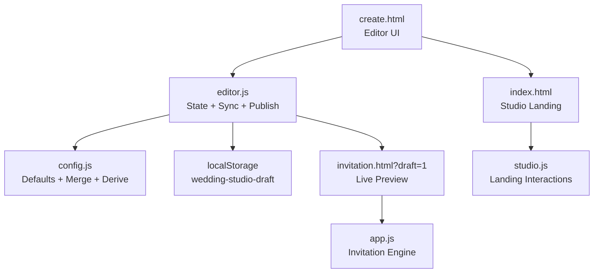
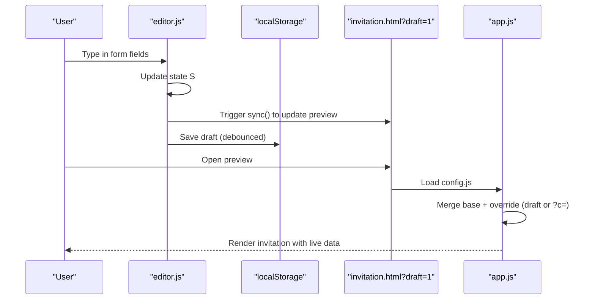
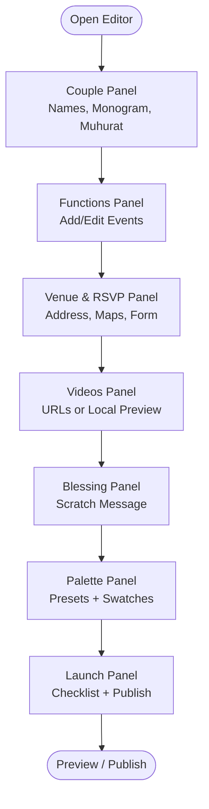
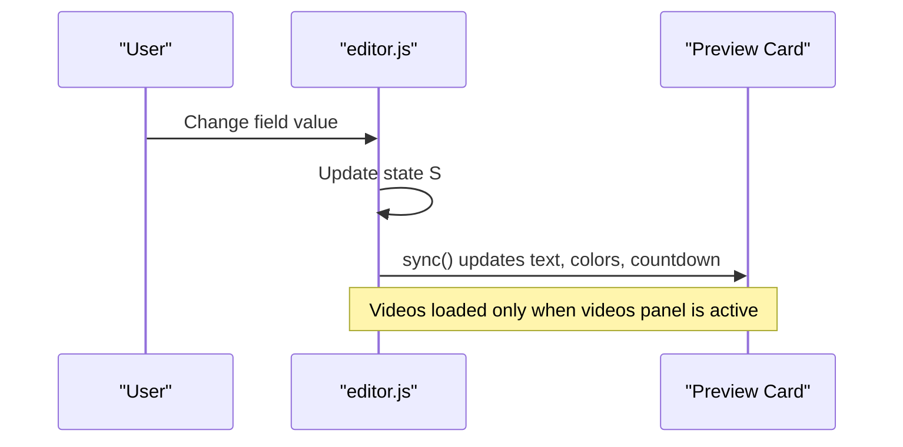
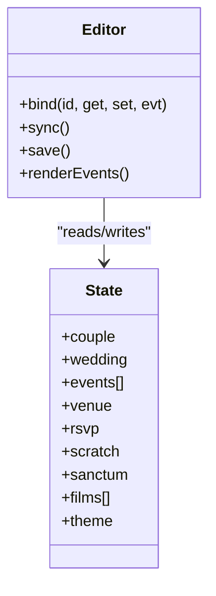
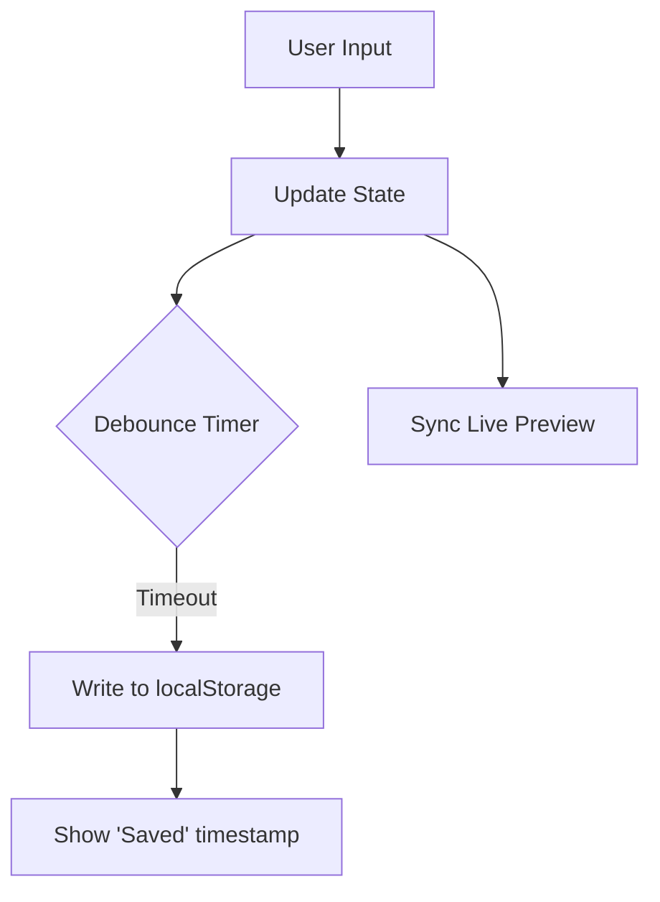
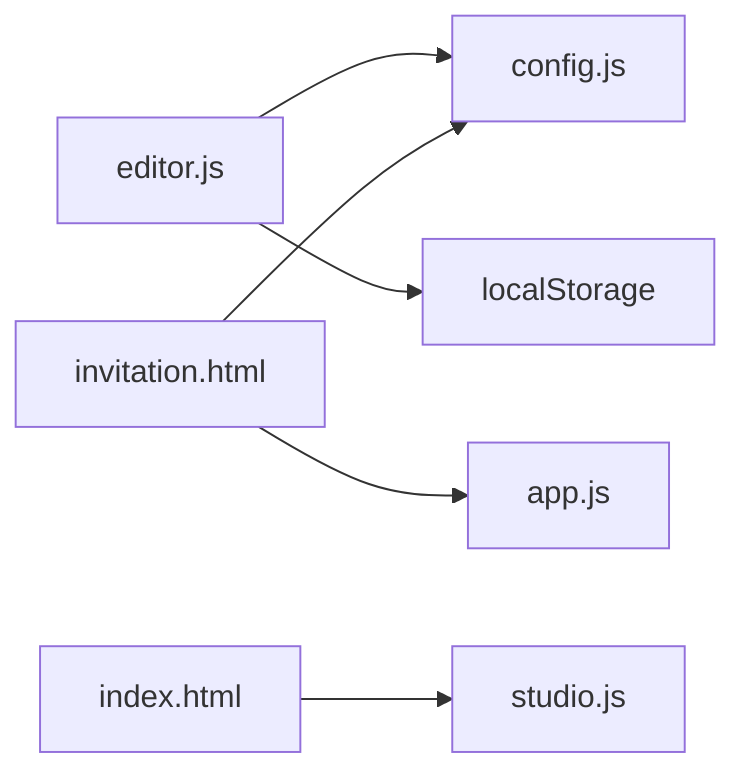

# No-Code Editor Interface

<cite>
**Referenced Files in This Document**
- [create.html](file://3D Wedding Invitation Sample 2/create.html)
- [editor.js](file://3D Wedding Invitation Sample 2/editor.js)
- [config.js](file://3D Wedding Invitation Sample 2/config.js)
- [app.js](file://3D Wedding Invitation Sample 2/app.js)
- [invitation.html](file://3D Wedding Invitation Sample 2/invitation.html)
- [index.html](file://3D Wedding Invitation Sample 2/index.html)
- [studio.js](file://3D Wedding Invitation Sample 2/studio.js)
</cite>

## Table of Contents
1. [Introduction](#introduction)
2. [Project Structure](#project-structure)
3. [Core Components](#core-components)
4. [Architecture Overview](#architecture-overview)
5. [Detailed Component Analysis](#detailed-component-analysis)
6. [Dependency Analysis](#dependency-analysis)
7. [Performance Considerations](#performance-considerations)
8. [Troubleshooting Guide](#troubleshooting-guide)
9. [Conclusion](#conclusion)
10. [Appendices](#appendices)

## Introduction
This document explains the no-code editor interface that allows clients to create custom wedding invitations. It covers the live preview system, form-based content editing, real-time synchronization between editor and preview, and the end-to-end user experience flow. It also documents all editable fields (names, monogram, muhurat timing, functions, venue details, RSVP configuration, and color palette), client-side data persistence using localStorage, validation rules, error handling, practical editing scenarios, browser compatibility troubleshooting, and performance optimization techniques for large content updates.

## Project Structure
The editor is implemented as a single-page application with a guided multi-step form and a contextual live preview panel. The key files are:
- create.html: Editor UI layout, step navigation, and panels for each editable section
- editor.js: Editor state management, field bindings, live preview sync, checklist, and publish actions
- config.js: Default invitation configuration and studio bridge logic that merges overrides and derives defaults
- app.js: The published invitation engine; it reads the merged configuration and renders the final experience
- invitation.html: The guest-facing invitation page
- index.html: Studio landing page that links into the editor and demo
- studio.js: Landing page interactions and phone mockup behavior

**Diagram sources**
- [create.html:37-60](file://3D Wedding Invitation Sample 2/create.html#L37-L60)
- [editor.js:7-48](file://3D Wedding Invitation Sample 2/editor.js#L7-L48)
- [config.js:6-123](file://3D Wedding Invitation Sample 2/config.js#L6-L123)
- [invitation.html:24-45](file://3D Wedding Invitation Sample 2/invitation.html#L24-L45)
- [app.js:9-150](file://3D Wedding Invitation Sample 2/app.js#L9-L150)
- [index.html:48-66](file://3D Wedding Invitation Sample 2/index.html#L48-L66)
- [studio.js:20-40](file://3D Wedding Invitation Sample 2/studio.js#L20-L40)

**Section sources**
- [create.html:37-60](file://3D Wedding Invitation Sample 2/create.html#L37-L60)
- [editor.js:7-48](file://3D Wedding Invitation Sample 2/editor.js#L7-L48)
- [config.js:6-123](file://3D Wedding Invitation Sample 2/config.js#L6-L123)
- [invitation.html:24-45](file://3D Wedding Invitation Sample 2/invitation.html#L24-L45)
- [app.js:9-150](file://3D Wedding Invitation Sample 2/app.js#L9-L150)
- [index.html:48-66](file://3D Wedding Invitation Sample 2/index.html#L48-L66)
- [studio.js:20-40](file://3D Wedding Invitation Sample 2/studio.js#L20-L40)

## Core Components
- Editor state model: A single object holds couple, wedding, events, venue, rsvp, scratch, sanctum, films, and theme sections. It is initialized from defaults and merged with any saved draft or URL-encoded design.
- Field binding: A generic bind function wires inputs to state changes and triggers live preview sync and debounced save.
- Live preview: A contextual card mirrors only the scene being edited, hydrating video clips only when the videos panel is open.
- Persistence: Drafts are saved to localStorage under a dedicated key with a debounce to avoid excessive writes.
- Validation and guidance: Video duration checks provide immediate feedback; checklist on launch validates completeness; local-only media are flagged for publishing.
- Publishing: Activation code submission sends a payload stripped of device-only resources to the server; recovery supports retrieving an already-published link.

**Section sources**
- [editor.js:27-48](file://3D Wedding Invitation Sample 2/editor.js#L27-L48)
- [editor.js:73-90](file://3D Wedding Invitation Sample 2/editor.js#L73-L90)
- [editor.js:176-196](file://3D Wedding Invitation Sample 2/editor.js#L176-L196)
- [editor.js:474-487](file://3D Wedding Invitation Sample 2/editor.js#L474-L487)
- [editor.js:531-542](file://3D Wedding Invitation Sample 2/editor.js#L531-L542)
- [editor.js:580-625](file://3D Wedding Invitation Sample 2/editor.js#L580-L625)

## Architecture Overview
The editor uses a unidirectional data flow:
- User edits a field → State updates → Live preview syncs → Debounced save persists to localStorage
- On preview, the invitation page reads either a draft flag or encoded design and merges with defaults to render the final experience

**Diagram sources**
- [editor.js:73-90](file://3D Wedding Invitation Sample 2/editor.js#L73-L90)
- [editor.js:394-471](file://3D Wedding Invitation Sample 2/editor.js#L394-L471)
- [config.js:138-211](file://3D Wedding Invitation Sample 2/config.js#L138-L211)
- [app.js:9-150](file://3D Wedding Invitation Sample 2/app.js#L9-L150)

## Detailed Component Analysis

### Editor Form Panels and Editable Fields
The editor is organized into seven steps:
- Couple: Bride/groom names, full names, monogram, hashtag, tagline, muhurat date/time/timezone, muhurat line
- Functions: Add/remove/reorder events with name, icon, date, time, venue, description, accent color
- Venue & RSVP: Venue name/address, city, maps query, optional Google Form URL, RSVP deadline
- Videos: Three film slots with eyebrow, caption, direct MP4/WebM URL, or file upload for preview-only
- Blessing: Scratch heading/message and hidden-moment heading/hint
- Palette: Six-color theme with presets and individual swatches
- Launch: Checklist, preview, publish with activation code, download config/brief, email brief

**Diagram sources**
- [create.html:51-59](file://3D Wedding Invitation Sample 2/create.html#L51-L59)
- [create.html:67-112](file://3D Wedding Invitation Sample 2/create.html#L67-L112)
- [create.html:115-124](file://3D Wedding Invitation Sample 2/create.html#L115-L124)
- [create.html:127-151](file://3D Wedding Invitation Sample 2/create.html#L127-L151)
- [create.html:154-222](file://3D Wedding Invitation Sample 2/create.html#L154-L222)
- [create.html:225-240](file://3D Wedding Invitation Sample 2/create.html#L225-L240)
- [create.html:243-259](file://3D Wedding Invitation Sample 2/create.html#L243-L259)
- [create.html:262-305](file://3D Wedding Invitation Sample 2/create.html#L262-L305)

**Section sources**
- [create.html:67-112](file://3D Wedding Invitation Sample 2/create.html#L67-L112)
- [create.html:115-124](file://3D Wedding Invitation Sample 2/create.html#L115-L124)
- [create.html:127-151](file://3D Wedding Invitation Sample 2/create.html#L127-L151)
- [create.html:154-222](file://3D Wedding Invitation Sample 2/create.html#L154-L222)
- [create.html:225-240](file://3D Wedding Invitation Sample 2/create.html#L225-L240)
- [create.html:243-259](file://3D Wedding Invitation Sample 2/create.html#L243-L259)
- [create.html:262-305](file://3D Wedding Invitation Sample 2/create.html#L262-L305)

### Live Preview System
- Contextual scenes: The preview card shows only the scene corresponding to the active editor panel. The “launch” scene reveals all scenes so users can read through the entire invitation.
- Real-time sync: Every input change calls sync(), which updates CSS variables for colors, text nodes for names/date/muhurat/events/venue/RSVP, and countdown timers.
- Video hydration: Film elements are hydrated only when the videos panel is opened to avoid unnecessary downloads. Local file uploads set a preview-only URL not persisted to shared drafts.
- Name fitting: The preview computes font size to keep names legible without overlapping, mirroring the production behavior.

**Diagram sources**
- [editor.js:287-337](file://3D Wedding Invitation Sample 2/editor.js#L287-L337)
- [editor.js:394-471](file://3D Wedding Invitation Sample 2/editor.js#L394-L471)
- [editor.js:300-317](file://3D Wedding Invitation Sample 2/editor.js#L300-L317)
- [editor.js:351-392](file://3D Wedding Invitation Sample 2/editor.js#L351-L392)

**Section sources**
- [editor.js:287-337](file://3D Wedding Invitation Sample 2/editor.js#L287-L337)
- [editor.js:300-317](file://3D Wedding Invitation Sample 2/editor.js#L300-L317)
- [editor.js:351-392](file://3D Wedding Invitation Sample 2/editor.js#L351-L392)
- [editor.js:394-471](file://3D Wedding Invitation Sample 2/editor.js#L394-L471)

### Data Model and Real-Time Synchronization
- State initialization: Starts from defaults, then merges any saved draft or URL-encoded design. Derived fields like hashtag and city are filled if missing.
- Binding: Inputs are bound to state via a helper that sets initial values and listens for input/change events, calling sync() and save().
- Date handling: ISO date/time/timezone are combined into display strings and used for countdown calculations.
- Events list: Dynamic rendering of event cards with add/move/delete/toggle operations; changes propagate immediately to preview.
- Theme: Color swatches and presets update CSS variables in the preview instantly.

**Diagram sources**
- [editor.js:27-48](file://3D Wedding Invitation Sample 2/editor.js#L27-L48)
- [editor.js:84-131](file://3D Wedding Invitation Sample 2/editor.js#L84-L131)
- [editor.js:217-285](file://3D Wedding Invitation Sample 2/editor.js#L217-L285)
- [editor.js:394-471](file://3D Wedding Invitation Sample 2/editor.js#L394-L471)

**Section sources**
- [editor.js:27-48](file://3D Wedding Invitation Sample 2/editor.js#L27-L48)
- [editor.js:84-131](file://3D Wedding Invitation Sample 2/editor.js#L84-L131)
- [editor.js:217-285](file://3D Wedding Invitation Sample 2/editor.js#L217-L285)
- [editor.js:394-471](file://3D Wedding Invitation Sample 2/editor.js#L394-L471)

### Client-Side Data Persistence
- Storage key: Drafts are stored under a dedicated key in localStorage.
- Debounced save: Saves occur after a short delay to reduce write frequency while typing.
- Recovery: If a saved draft exists, it is merged into defaults; URL parameters can also load designs.
- Safety: Local-only media (blob/data/file URLs) are excluded from published payloads and flagged during publishing.

**Diagram sources**
- [editor.js:73-82](file://3D Wedding Invitation Sample 2/editor.js#L73-L82)
- [editor.js:39-48](file://3D Wedding Invitation Sample 2/editor.js#L39-L48)
- [editor.js:531-542](file://3D Wedding Invitation Sample 2/editor.js#L531-L542)

**Section sources**
- [editor.js:39-48](file://3D Wedding Invitation Sample 2/editor.js#L39-L48)
- [editor.js:73-82](file://3D Wedding Invitation Sample 2/editor.js#L73-L82)
- [editor.js:531-542](file://3D Wedding Invitation Sample 2/editor.js#L531-L542)

### Validation Rules and Error Handling
- Video duration guidance: When a file is selected, metadata is inspected and feedback indicates recommended durations (10–50 seconds, max 60). Errors show a default hint.
- Local-only media protection: Any blob/data/file source is cleared before publishing to prevent broken links for guests.
- Checklist validation: Launch panel lists required items and flags incomplete ones (e.g., missing venue maps, placeholder RSVP forms).
- Publish errors: Status messages inform users about issues (missing token, unavailable publishing, network errors) and offer recovery options.

**Section sources**
- [editor.js:176-196](file://3D Wedding Invitation Sample 2/editor.js#L176-L196)
- [editor.js:531-542](file://3D Wedding Invitation Sample 2/editor.js#L531-L542)
- [editor.js:474-487](file://3D Wedding Invitation Sample 2/editor.js#L474-L487)
- [editor.js:580-625](file://3D Wedding Invitation Sample 2/editor.js#L580-L625)

### User Experience Flow
- Step-by-step wizard: Navigation buttons guide users through couple, functions, venue, videos, blessing, palette, and launch.
- Contextual preview: The right-hand preview card reflects only the current step, reducing cognitive load.
- Immediate feedback: Changes appear instantly in the preview; saves are indicated by a timestamp.
- Launch actions: Users can preview the full invitation, publish with an activation code, download config/brief, or email the brief to the studio.

**Section sources**
- [create.html:51-59](file://3D Wedding Invitation Sample 2/create.html#L51-L59)
- [create.html:308-400](file://3D Wedding Invitation Sample 2/create.html#L308-L400)
- [editor.js:329-342](file://3D Wedding Invitation Sample 2/editor.js#L329-L342)
- [editor.js:489-516](file://3D Wedding Invitation Sample 2/editor.js#L489-L516)

## Dependency Analysis
- Editor depends on config.js for defaults and merging logic; it reads window.WEDDING_DEFAULTS and window.WEDDING_CONFIG.
- The invitation page depends on config.js and app.js to render the final experience based on merged configuration.
- The landing page uses studio.js for branding and interactive behaviors.

**Diagram sources**
- [editor.js:23-28](file://3D Wedding Invitation Sample 2/editor.js#L23-L28)
- [config.js:138-211](file://3D Wedding Invitation Sample 2/config.js#L138-L211)
- [invitation.html:318-323](file://3D Wedding Invitation Sample 2/invitation.html#L318-L323)
- [index.html:399-400](file://3D Wedding Invitation Sample 2/index.html#L399-L400)

**Section sources**
- [editor.js:23-28](file://3D Wedding Invitation Sample 2/editor.js#L23-L28)
- [config.js:138-211](file://3D Wedding Invitation Sample 2/config.js#L138-L211)
- [invitation.html:318-323](file://3D Wedding Invitation Sample 2/invitation.html#L318-L323)
- [index.html:399-400](file://3D Wedding Invitation Sample 2/index.html#L399-L400)

## Performance Considerations
- Debounced persistence: Saves are throttled to minimize localStorage writes during rapid typing.
- Conditional video hydration: Films are loaded only when the videos panel is visible, preventing unnecessary bandwidth usage.
- Efficient preview updates: sync() updates DOM text and CSS variables directly without re-rendering entire sections.
- Large content handling: For heavy assets (frames, films), the invitation engine uses prebuffering and bitmap rings to maintain smooth scrolling; the editor avoids loading these assets until necessary.

[No sources needed since this section provides general guidance]

## Troubleshooting Guide
- Browser compatibility
  - file:// protocol: The pages include a script to strip cache-busting query strings when opened locally to avoid asset 404s.
  - Reduced motion: Some features detect prefers-reduced-motion and adjust animations accordingly.
  - Audio autoplay: Mobile browsers require user interaction to start audio; the invitation uses a seal tap to unlock sound.
- Common issues
  - Videos not showing in preview: Ensure you paste a hosted URL; local file uploads are preview-only and will not persist to shared drafts.
  - RSVP not embedding: Confirm the Google Form URL is valid and not a placeholder; the built-in form is used if left blank.
  - Publish fails: Check the activation code and network connectivity; use the recover option if a previous publish succeeded but the link was lost.
- Diagnostics
  - Use the checklist on the Launch panel to verify required fields.
  - Inspect the status messages near the publish controls for specific error hints.

**Section sources**
- [invitation.html:5-21](file://3D Wedding Invitation Sample 2/invitation.html#L5-L21)
- [create.html:5-21](file://3D Wedding Invitation Sample 2/create.html#L5-L21)
- [editor.js:176-196](file://3D Wedding Invitation Sample 2/editor.js#L176-L196)
- [editor.js:580-625](file://3D Wedding Invitation Sample 2/editor.js#L580-L625)

## Conclusion
The no-code editor provides a streamlined, guided workflow for creating rich wedding invitations with a live preview that stays synchronized with your edits. It balances ease-of-use with robustness: drafts persist locally, validations guide you toward completion, and publishing safeguards ensure only shareable resources are sent to guests. The architecture cleanly separates editor concerns from the invitation renderer, enabling reliable previews and consistent final experiences across devices.

[No sources needed since this section summarizes without analyzing specific files]

## Appendices

### Practical Editing Scenarios
- Updating couple names and monogram:
  - Edit bride/groom names and monogram in the Couple panel; preview updates immediately with fitted names and updated seal text.
- Adjusting muhurat timing:
  - Set date, time, and timezone; the preview’s countdown and muhurat line update automatically.
- Adding multiple functions:
  - Use “Add a function” to create new event cards; reorder, edit details, and see them reflected in the preview’s functions scene.
- Configuring venue and RSVP:
  - Fill venue address and maps query; optionally paste a Google Form URL to embed RSVP; preview shows map chip and RSVP kind.
- Replacing video clips:
  - Paste hosted MP4/WebM URLs for persistent sharing; use file upload for local preview only; duration guidance helps optimize length.
- Customizing palette:
  - Choose a preset or tweak individual swatches; preview applies theme colors in real time.

**Section sources**
- [create.html:67-112](file://3D Wedding Invitation Sample 2/create.html#L67-L112)
- [create.html:115-124](file://3D Wedding Invitation Sample 2/create.html#L115-L124)
- [create.html:127-151](file://3D Wedding Invitation Sample 2/create.html#L127-L151)
- [create.html:154-222](file://3D Wedding Invitation Sample 2/create.html#L154-L222)
- [create.html:243-259](file://3D Wedding Invitation Sample 2/create.html#L243-L259)
- [editor.js:394-471](file://3D Wedding Invitation Sample 2/editor.js#L394-L471)