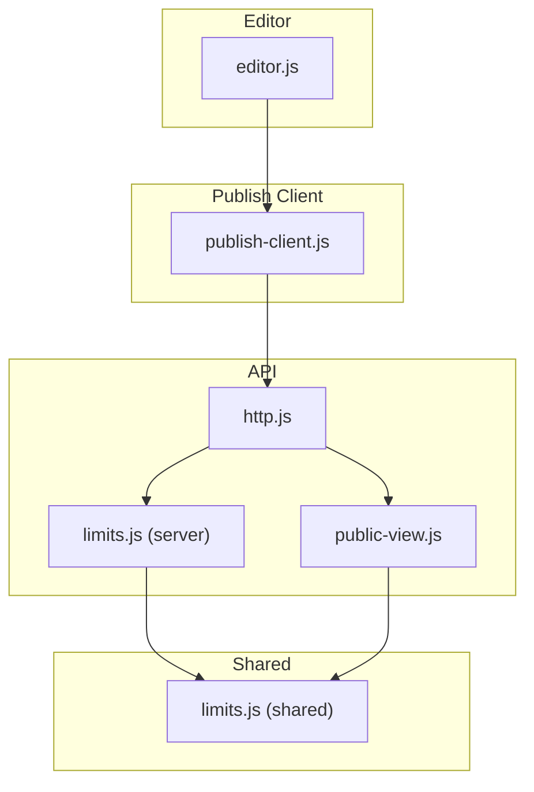
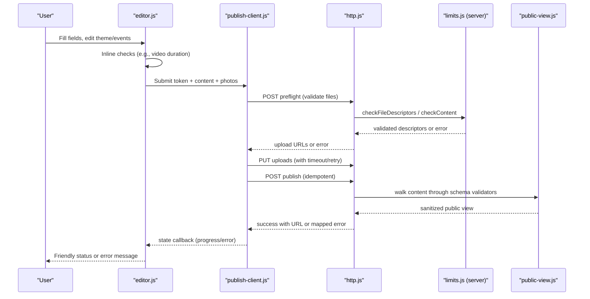
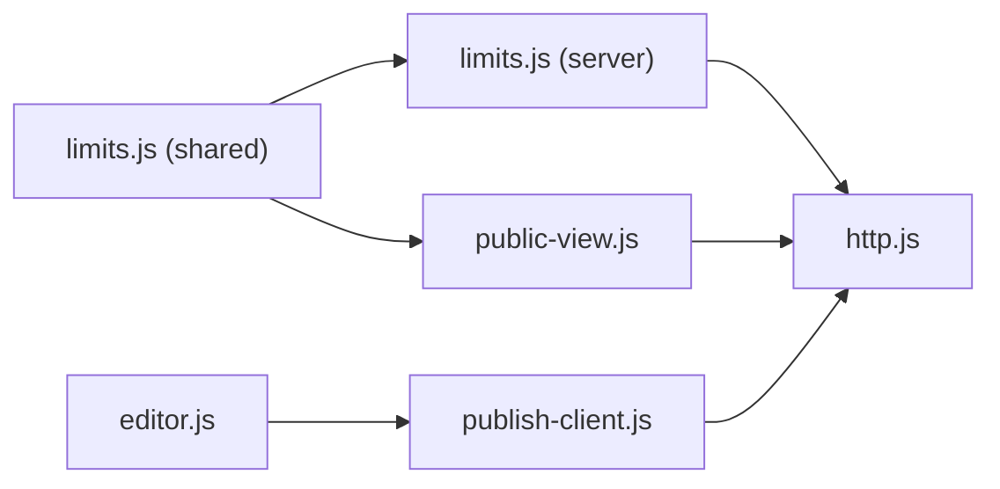

# Validation & Error Handling

<cite>
**Referenced Files in This Document**
- [public-view.js](file://api/_lib/public-view.js)
- [limits.js (server)](file://api/_lib/limits.js)
- [limits.js (shared)](file://shared/limits.js)
- [http.js](file://api/_lib/http.js)
- [publish-client.js](file://shared/publish-client.js)
- [editor.js](file://3D Wedding Invitation Sample 2/editor.js)
- [app.js (Sample 2)](file://3D Wedding Invitation Sample 2/app.js)
</cite>

## Table of Contents
1. Introduction
2. Project Structure
3. Core Components
4. Architecture Overview
5. Detailed Component Analysis
6. Dependency Analysis
7. Performance Considerations
8. Troubleshooting Guide
9. Conclusion
10. Appendices

## Introduction
This document explains the validation and error handling system that ensures data integrity and provides user-friendly feedback during editing and publishing. It covers:
- Field-level validation rules for text, date/time, URL, color, and media references
- Inline validation and form submission validation
- Error display mechanisms and recovery strategies
- Accessibility considerations for error states
- Practical guidance for adding new validation rules and custom error handlers

## Project Structure
The validation and error handling spans both server-side and client-side code:
- Server-side validation and error mapping live in API libraries
- Client-side validation and user feedback live in editor and publish client modules
- Shared limits define caps used by both sides to keep behavior consistent

**Diagram sources**
- [editor.js:570-625](file://3D Wedding Invitation Sample 2/editor.js#L570-L625)
- [publish-client.js:312-370](file://shared/publish-client.js#L312-L370)
- [http.js:52-79](file://api/_lib/http.js#L52-L79)
- [limits.js (server):43-62](file://api/_lib/limits.js#L43-L62)
- [public-view.js:41-108](file://api/_lib/public-view.js#L41-L108)
- [limits.js (shared):31-55](file://shared/limits.js#L31-L55)

**Section sources**
- [editor.js:570-625](file://3D Wedding Invitation Sample 2/editor.js#L570-L625)
- [publish-client.js:312-370](file://shared/publish-client.js#L312-L370)
- [http.js:52-79](file://api/_lib/http.js#L52-L79)
- [limits.js (server):43-62](file://api/_lib/limits.js#L43-L62)
- [public-view.js:41-108](file://api/_lib/public-view.js#L41-L108)
- [limits.js (shared):31-55](file://shared/limits.js#L31-L55)

## Core Components
- Field validators: text, bool, num, colour, url, mediaRef
- Content and file validation: content size, embedded files, template allowlist, file descriptors, media references
- HTTP error mapping: standardized error codes with friendly messages and retry hints
- Publish client: idempotency, retries, timeouts, progress, and user-facing messages
- Editor: inline checks (e.g., video duration), checklist, and publish flow

Key responsibilities:
- Enforce safe, bounded inputs on both client and server
- Provide clear, actionable errors to users
- Ensure robust recovery from transient failures

**Section sources**
- [public-view.js:41-108](file://api/_lib/public-view.js#L41-L108)
- [limits.js (server):43-125](file://api/_lib/limits.js#L43-L125)
- [http.js:52-79](file://api/_lib/http.js#L52-L79)
- [publish-client.js:52-81](file://shared/publish-client.js#L52-L81)
- [editor.js:176-196](file://3D Wedding Invitation Sample 2/editor.js#L176-L196)

## Architecture Overview
End-to-end flow for validation and error handling during publishing:

**Diagram sources**
- [editor.js:570-625](file://3D Wedding Invitation Sample 2/editor.js#L570-L625)
- [publish-client.js:312-370](file://shared/publish-client.js#L312-L370)
- [http.js:91-119](file://api/_lib/http.js#L91-L119)
- [limits.js (server):74-125](file://api/_lib/limits.js#L74-L125)
- [public-view.js:173-196](file://api/_lib/public-view.js#L173-L196)

## Detailed Component Analysis

### Field Validators (text, bool, num, colour, url, mediaRef)
- text: coerces to string, clamps length, ignores objects; used for names, descriptions, venue info
- bool: normalizes truthy/falsy values
- num: returns finite numbers or undefined
- colour: accepts only hex color strings suitable for CSS custom properties
- url: parses and allows only https URLs; rejects invalid or insecure schemes
- mediaRef: accepts either a site-owned marker reference or a safe bundled asset path; bounds array sizes

These validators are applied via a walker that enforces a strict schema per template, ensuring only allowed fields pass through and are safely typed.

Practical examples:
- Adding a new field: extend the template shape with a validator function and ensure it is included in the public output
- Customizing rules: create a new validator function (e.g., stricter length or pattern) and plug it into the schema

**Section sources**
- [public-view.js:41-108](file://api/_lib/public-view.js#L41-L108)
- [public-view.js:117-169](file://api/_lib/public-view.js#L117-L169)
- [public-view.js:173-196](file://api/_lib/public-view.js#L173-L196)

### Content and File Validation
- Content validation:
  - Rejects non-object shapes
  - Enforces maximum serialized bytes
  - Blocks embedded base64 images to prevent database bloat and injection risks
- Template validation:
  - Only known templates are accepted
- File descriptor validation:
  - Validates hash format, size, type, dimensions, and responsive variant
  - Deduplicates identical variants
  - Enforces per-wedding photo count and total media bytes
- Media references at publish time:
  - Ensures paths stay within the customer’s folder and do not escape directory boundaries
  - Truncates captions and validates roles

Error outcomes include specific codes like too large, unknown template, bad request, and out-of-path media.

**Section sources**
- [limits.js (server):43-62](file://api/_lib/limits.js#L43-L62)
- [limits.js (server):74-125](file://api/_lib/limits.js#L74-L125)
- [limits.js (server):131-162](file://api/_lib/limits.js#L131-L162)

### HTTP Error Mapping and User-Friendly Messages
- Centralized error map defines status codes, user messages, and whether an error is retryable
- All responses are JSON with ok, code, message, and optional retryable flag
- Requests are wrapped so unexpected exceptions never leak stack traces; they are logged in redacted form and returned as friendly errors
- Rate limiting protects against brute-force attempts

Examples:
- Invalid activation code: 400 with guidance to check the code
- Too large content: 413 with suggestion to remove photos
- Transient upstream failure: 503 with retry hint

**Section sources**
- [http.js:52-79](file://api/_lib/http.js#L52-L79)
- [http.js:164-177](file://api/_lib/http.js#L164-L177)

### Publish Client: Retries, Timeouts, Idempotency, and Feedback
- Idempotency key derived from token and persisted locally before first attempt to avoid duplicate publishes
- Timeouts: shorter for API calls, longer for uploads
- Retry logic: one retry for network or server errors with backoff; does not retry user errors
- Progress callbacks inform the UI about phases: checking, uploading, publishing, done, error
- Friendly messages map server codes to plain-language guidance

Recovery strategy:
- If a publish fails after leaving the device, a recover endpoint can retrieve the published link using the same token

**Section sources**
- [publish-client.js:52-81](file://shared/publish-client.js#L52-L81)
- [publish-client.js:89-154](file://shared/publish-client.js#L89-L154)
- [publish-client.js:158-194](file://shared/publish-client.js#L158-L194)
- [publish-client.js:312-370](file://shared/publish-client.js#L312-L370)

### Editor: Inline Validation and Submission Flow
- Inline validation:
  - Video duration feedback guides users toward recommended lengths
  - Local-only sources (blob/data/file) are stripped before publishing to avoid dead links
- Checklist:
  - Encourages completing essential fields (names, date, events, venue, RSVP, films)
- Publishing:
  - Validates presence of activation token
  - Strips local-only film sources and warns if any were removed
  - Calls publish with progress callbacks and shows friendly status or error

Accessibility:
- Uses ARIA attributes for modal/dialog states and busy indicators where applicable
- Provides clear labels and focus management around critical actions

**Section sources**
- [editor.js:176-196](file://3D Wedding Invitation Sample 2/editor.js#L176-L196)
- [editor.js:473-487](file://3D Wedding Invitation Sample 2/editor.js#L473-L487)
- [editor.js:570-625](file://3D Wedding Invitation Sample 2/editor.js#L570-L625)
- [app.js (Sample 2):1639-1673](file://3D Wedding Invitation Sample 2/app.js#L1639-L1673)

### Date/Time Validation
- Server-side date normalization:
  - Accepts ISO-like strings, extracts calendar day, validates format, and returns normalized date or null
- Editor-side date helpers:
  - Parses and formats dates for display and input controls
  - Rebuilds ISO timestamp from date/time/tz selections

Guidance:
- Optional wedding date is supported; invalid or missing dates simply result in null rather than hard failures

**Section sources**
- [limits.js (server):171-179](file://api/_lib/limits.js#L171-L179)
- [editor.js:50-71](file://3D Wedding Invitation Sample 2/editor.js#L50-L71)
- [editor.js:103-118](file://3D Wedding Invitation Sample 2/editor.js#L103-L118)

### URL Validation
- Server-side:
  - Only absolute https URLs are accepted; invalid URLs are rejected
- Editor-side:
  - Local-only sources are stripped before publishing to prevent broken guest links
- Guest RSVP:
  - External forms are loaded in an iframe with fallback behavior if blocked or empty

Security rationale:
- Prevents mixed-content issues and script/data injection via unsafe protocols

**Section sources**
- [public-view.js:69-80](file://api/_lib/public-view.js#L69-L80)
- [editor.js:531-542](file://3D Wedding Invitation Sample 2/editor.js#L531-L542)
- [app.js (Sample 2):1484-1501](file://3D Wedding Invitation Sample 2/app.js#L1484-L1501)

### Color Format Validation
- Server-side:
  - Hex color strings validated for CSS custom property safety
- Editor-side:
  - Theme colors bound to inputs and preview updates
- Rationale:
  - Prevents stylesheet injection and ensures consistent theming

**Section sources**
- [public-view.js:60-67](file://api/_lib/public-view.js#L60-L67)
- [editor.js:198-215](file://3D Wedding Invitation Sample 2/editor.js#L198-L215)

### Media Reference Validation
- Server-side:
  - Accepts site-owned markers or bundled asset paths; rejects arbitrary external URLs
  - Bounds arrays and sanitizes roles/captions
- Public view:
  - Resolves media to safe, responsive URLs and includes width/height for layout stability

**Section sources**
- [public-view.js:82-108](file://api/_lib/public-view.js#L82-L108)
- [public-view.js:200-233](file://api/_lib/public-view.js#L200-L233)

## Dependency Analysis

- Shared limits provide a single source of truth for caps used by both client and server
- Server modules depend on shared limits for consistent enforcement
- Editor and publish client coordinate to present consistent constraints and feedback

**Diagram sources**
- [limits.js (shared):31-55](file://shared/limits.js#L31-L55)
- [limits.js (server):19-20](file://api/_lib/limits.js#L19-L20)
- [public-view.js:33-37](file://api/_lib/public-view.js#L33-L37)
- [publish-client.js:41-48](file://shared/publish-client.js#L41-L48)

**Section sources**
- [limits.js (shared):31-55](file://shared/limits.js#L31-L55)
- [limits.js (server):19-20](file://api/_lib/limits.js#L19-L20)
- [public-view.js:33-37](file://api/_lib/public-view.js#L33-L37)
- [publish-client.js:41-48](file://shared/publish-client.js#L41-L48)

## Performance Considerations
- Text clamping prevents oversized fields from bloating public reads
- Array bounds limit gallery/event lists to reasonable sizes
- Image widths and quality settings balance visual fidelity and bandwidth
- Upload concurrency limited to two lanes to avoid saturating weak connections
- Timeouts and retries reduce hanging requests while avoiding unnecessary retries for user errors

[No sources needed since this section provides general guidance]

## Troubleshooting Guide
Common scenarios and how the system responds:
- Invalid activation code:
  - Server returns a friendly message guiding the user to verify the code
  - Client displays the mapped message without exposing internal details
- Too large content or photos:
  - Server rejects with a clear message suggesting removing photos
  - Client may show progress and allow retry
- Network or timeout errors:
  - Client retries once with backoff and shows a reassuring message
  - Draft remains intact until successful publish
- Upstream/server errors:
  - User sees a retryable message; draft persists; recover option available

Recovery options:
- Use the recover flow to find a published website if the initial publish succeeded but the response was lost
- Check the checklist in the editor to ensure all required fields are complete

**Section sources**
- [http.js:52-79](file://api/_lib/http.js#L52-L79)
- [publish-client.js:52-81](file://shared/publish-client.js#L52-L81)
- [publish-client.js:312-370](file://shared/publish-client.js#L312-L370)
- [editor.js:473-487](file://3D Wedding Invitation Sample 2/editor.js#L473-L487)

## Conclusion
The validation and error handling system combines strict server-side schemas and limits with client-side safeguards and user-friendly messaging. It ensures data integrity, prevents injection and abuse, and provides clear guidance and recovery paths for users during editing and publishing.

[No sources needed since this section summarizes without analyzing specific files]

## Appendices

### Adding a New Validation Rule
Steps:
- Define a validator function that coerces and validates the value, returning undefined when invalid
- Add the validator to the appropriate template shape in the public view module
- If the rule affects storage or costs, update shared limits and server checks accordingly
- Update editor-side hints or checklist items to guide users

Example references:
- Validator functions and schema walking
- Shared limits definitions
- Server-side content and file checks

**Section sources**
- [public-view.js:41-108](file://api/_lib/public-view.js#L41-L108)
- [public-view.js:117-169](file://api/_lib/public-view.js#L117-L169)
- [limits.js (shared):31-55](file://shared/limits.js#L31-L55)
- [limits.js (server):43-125](file://api/_lib/limits.js#L43-L125)

### Implementing Custom Error Handlers
Approach:
- Map new server-side error codes to friendly messages in the HTTP error map
- Ensure the publish client has corresponding user messages
- Update editor UI to display contextual guidance based on error codes

Example references:
- Centralized error map and response shaping
- Client-side message mapping and retry logic

**Section sources**
- [http.js:52-79](file://api/_lib/http.js#L52-L79)
- [publish-client.js:52-81](file://shared/publish-client.js#L52-L81)

### Creating User-Friendly Error Messages for Complex Scenarios
Guidelines:
- Explain what happened in plain language
- Suggest a concrete next step (e.g., remove photos, check code, wait and retry)
- Avoid technical jargon or internal identifiers
- Indicate whether retrying is appropriate

Example references:
- Server error messages designed for end users
- Client messages tailored to transient vs. user-caused failures

**Section sources**
- [http.js:52-79](file://api/_lib/http.js#L52-L79)
- [publish-client.js:52-81](file://shared/publish-client.js#L52-L81)

### Accessibility Considerations for Error States
- Use ARIA attributes to communicate busy states and dialog visibility
- Ensure error messages are associated with relevant form controls
- Provide keyboard-accessible controls and focus management
- Respect reduced motion preferences where animations are involved

Example references:
- Modal/dialog ARIA toggles and busy indicators
- Reduced motion handling

**Section sources**
- [app.js (Sample 2):1639-1673](file://3D Wedding Invitation Sample 2/app.js#L1639-L1673)